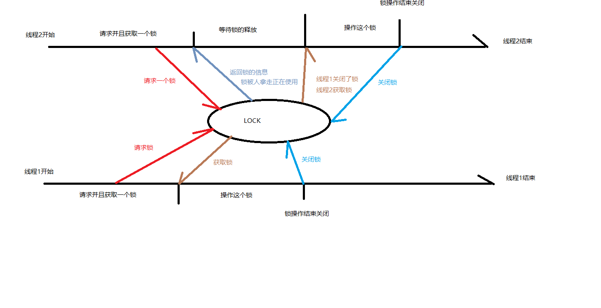
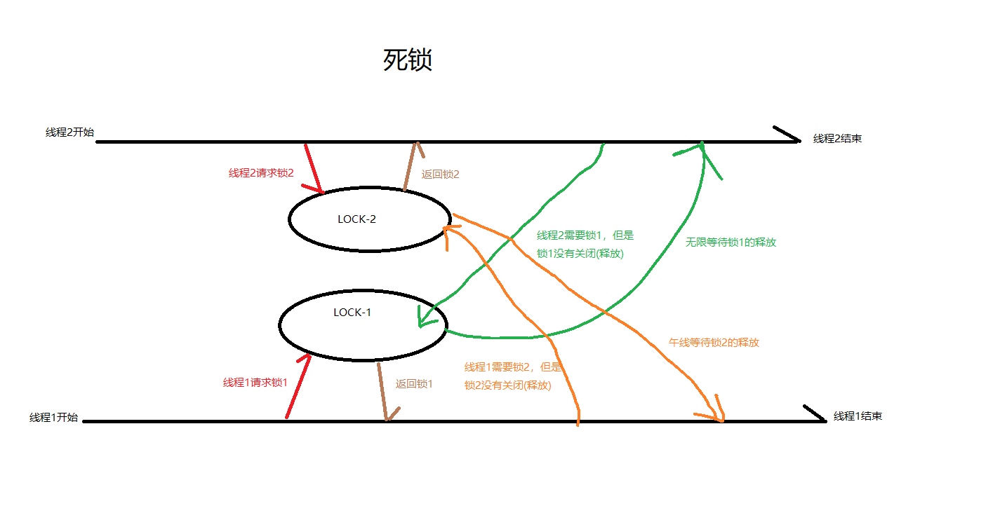
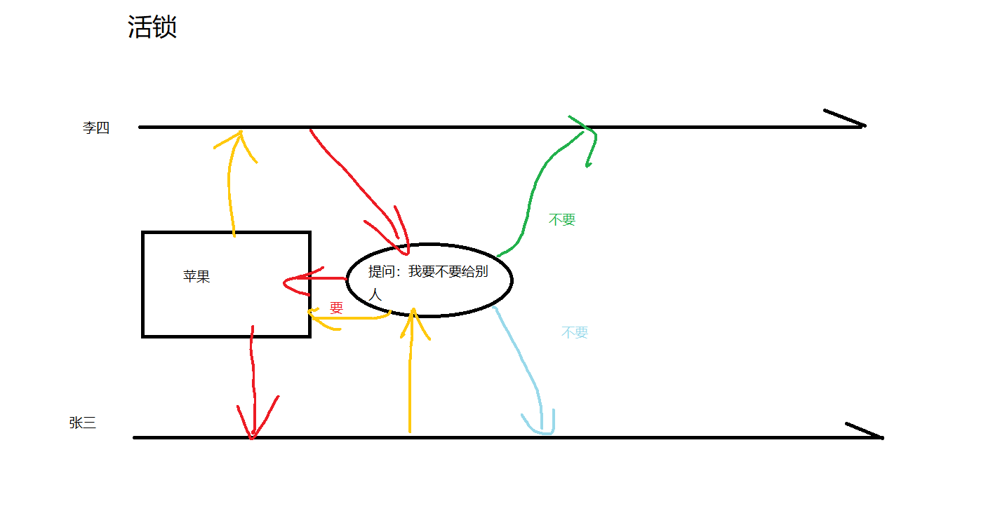
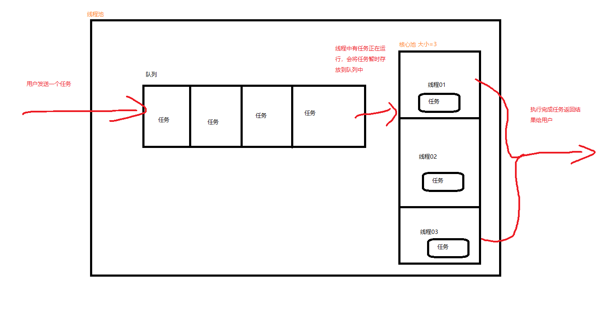

# java 并发
## CH-1:Thread & Runnable
- 继承**java.lang.Thread**类
- 实现**java.lang.Runnable**接口


### 开始一个简单线程
需求:
- 创建一个线程名称
- 获取一个线程名称
#### Thread
```java
public class HelloThread extends Thread {

    @Override
    public void run() {
        System.out.println("hello Thread");
    }


    public static void main(String[] args) {
        HelloThread th = new HelloThread();
        th.setName("测试线程名称");
        th.run();
        System.out.println(th.getName());
    }

}
```
- 运行结果
```text
hello Thread
测试线程名称
```
#### Runnable
```java
public class HelloRunnable {

    public static void main(String[] args) {
        Runnable runnable = runnableDemo();
        Thread t = new Thread(runnable, "测试线程");
        t.run();
        System.out.println(t.getName());

    }

    private static Runnable runnableDemo() {
        Runnable r = () -> System.out.println("hello runnable");
        return r;
    }
}
```
- 运行结果
```text
hello runnable
测试线程
```

### 线程状态
- java.lang.Thread.State 有这个枚举定义
- NEW:线程没有执行
- RUNNABLE:线程在JVM中执行
- BLOCKED:线程阻塞,等待一个监听锁
- WAITING:等待另一个线程执行
- TIMED_WAITING:线程在一定时间内等待另一个线程执行
- TERMINATED:线程退出
- 通过 java.lang.Thread.getState() 方法获取

### 线程优先级
- 最大优先级、最小优先级、默认优先级
```java
 /**
     * The minimum priority that a thread can have.
     * 最小优先级
     */
    public final static int MIN_PRIORITY = 1;

   /**
     * The default priority that is assigned to a thread.
     * 默认优先级
     */
    public final static int NORM_PRIORITY = 5;

    /**
     * The maximum priority that a thread can have.
     * 最大优先级
     */
    public final static int MAX_PRIORITY = 10;
```
- 设置优先级
- java.lang.Thread.setPriority 方法
- 参数值在1-10之间
```java
    public final void setPriority(int newPriority) {
        ThreadGroup g;
        checkAccess();
        if (newPriority > MAX_PRIORITY || newPriority < MIN_PRIORITY) {
            throw new IllegalArgumentException();
        }
        if((g = getThreadGroup()) != null) {
            if (newPriority > g.getMaxPriority()) {
                newPriority = g.getMaxPriority();
            }
            setPriority0(priority = newPriority);
        }
    }
```

### 守护线程 & 非守护线程
- java.lang.Thread.setDaemon() 方法设置守护线程
- java.lang.Thread.isDaemon() 查看是否是守护线程

```java
    /* Whether or not the thread is a daemon thread. */
    private boolean     daemon = false;
```

### 线程启动
- java.lang.Thread.start() 方法

### 完整的一个案例
```java
public class ThreadDemo001 {

    public static void main(String[] args) {
        Runnable r1 = () -> {
            Thread thread = Thread.currentThread();
            System.out.printf("runnable 内线程：%s 是否存活: %s 状态 %s",
                    thread.getName(),
                    thread.isAlive(),
                    thread.getState()
            );
            System.out.println();

        };

        Thread t1 = new Thread(r1, "thread-1");
        Thread t2 = new Thread(r1, "thread-2");

        // 设置t1 作为守护线程
        t1.setDaemon(true);

        System.out.printf("线程：%s 是否存活: %s 状态 %s",
                t1.getName(),
                t1.isAlive(),
                t1.getState()
        );
        System.out.println();

        System.out.printf("线程：%s 是否存活: %s 状态 %s",
                t2.getName(),
                t2.isAlive(),
                t2.getState()
        );
        System.out.println();
        t1.start();
        t2.start();
    }

}
```
### 其他操作
#### 中断线程 
- java.lang.Thread.interrupt()

    - 当线程在阻塞状态中 sleep 或 join 方法,阻塞状态清除
- java.lang.Thread.interrupted()

    - 当前线程是否中断
- java.lang.Thread.isInterrupted()
    - 当前线程是否中断 
      
        
```java
public class ThreadInterrup {
    public static void main(String[] args) throws InterruptedException {
        Runnable r = () -> {
            String name = Thread.currentThread().getName();
            int count = 0;
            while (!Thread.interrupted()) {
                System.out.println(name + ":" + count++);
            }
        };

        Thread t1 = new Thread(r,"thread-01");
        Thread t2 = new Thread(r, "thread-02");
        t1.start();
        t2.start();
        TimeUnit.SECONDS.sleep(1L);
        // 把线程1打断
        t1.interrupt();
        TimeUnit.SECONDS.sleep(2L);
        t2.interrupt();

    }
}

```

#### 等待线程
- java.lang.Thread.join()等待直到线程死亡
```java
public class ThreadJoin {

    private static Long res;

    public static void main(String[] args) {
        Runnable r = new Runnable() {
            @Override
            public void run() {
                System.out.println("1");
            }
        };


        Thread t = new Thread(r);
        t.start();
        try {

            t.join();

        } catch (Exception e) {
            e.printStackTrace();
        }
        System.out.println("stop");

    }


}

```

#### 线程睡眠
- java.lang.Thread.sleep(long) 线程睡眠 毫秒
```java
public class ThreadSleep {
    public static void main(String[] args) throws InterruptedException {
        Runnable r = () -> {
            String name = Thread.currentThread().getName();
            int count = 0;
            while (!Thread.interrupted()) {
                System.out.println(name + ":" + count++);
            }
        };

        Thread t1 = new Thread(r,"thread-01");
        Thread t2 = new Thread(r, "thread-02");
        t1.start();
        t2.start();
        try {
            Thread.sleep(10);
            t1.interrupt();
            t2.interrupt();
        } catch (Exception e) {
            e.printStackTrace();
        }
    }}
```

------

## CH-2 : 数据问题

### 数据竞争

> - 两条或两条以上的线程并发访问**同一个内存区域**,**至少有一条**执行**写操作**,线程没有协调对同一块内存区域的访问

```java
public class DataRace {

    // 输出运算流程：从0开始累加1
    private static Integer calc = 0;

    public static void main(String[] args) {
        Runnable r = () -> {
            for (int i = 0; i < 5; i++) {
                addOne();
            }
        };
        Thread t1 = new Thread(r, "线程01");
        Thread t2 = new Thread(r, "线程02");
        t1.start();
        t2.start();
    }

    private synchronized static void addOneSynchronized() {
        int now = calc;
        calc++;
        System.out.println(Thread.currentThread().getName() + " - 操作前 " + now + " 操作后 " + calc);
    }

    private  static void addOne() {
        int now = calc;
        calc++;
        System.out.println(Thread.currentThread().getName() + " - 操作前 " + now + " 操作后 " + calc);
    }

}
```

- addOneSynchronized 输出
```text
线程01 - 操作前 0 操作后 1
线程01 - 操作前 1 操作后 2
线程01 - 操作前 2 操作后 3
线程01 - 操作前 3 操作后 4
线程01 - 操作前 4 操作后 5
线程02 - 操作前 5 操作后 6
线程02 - 操作前 6 操作后 7
线程02 - 操作前 7 操作后 8
线程02 - 操作前 8 操作后 9
线程02 - 操作前 9 操作后 10
```
- addOne 输出
```text
线程01 - 操作前 0 操作后 1
线程01 - 操作前 2 操作后 3
线程02 - 操作前 1 操作后 2
线程02 - 操作前 4 操作后 5
线程02 - 操作前 5 操作后 6
线程01 - 操作前 3 操作后 4
线程01 - 操作前 7 操作后 8
线程01 - 操作前 8 操作后 9
线程02 - 操作前 6 操作后 7
线程02 - 操作前 9 操作后 10
```

### 临界区
> 有多个线程试图同时访问临界区，那么在有一个线程进入后其他所有试图访问此临界区的线程将被挂起，并一直持续到进入临界区的线程离开。临界区在被释放后，其他线程可以继续抢占，并以此达到用原子方式操作共享资源的目的。
### jvm 中的同步临界区
- 同步作为jvm的特性,功能在于保证两个或两个以上的线程**不会同时执行相同的临界区**,临界区必须**串行方式**访问
- 线程在临界区的时候每一条线程对灵界去的访问都会互斥执行.线程锁: **互斥锁**




### 同步关键字
- synchronized
```java
public class SynchronizedDemo {

    private static Integer mode = 1;
    private static Integer result = 0;

    public static void main(String[] args) {
        Id id = new Id();
        System.out.println(id.getCount());

        Runnable r1 = () -> {
            synchronized (mode) {
                result = mode + 2;
                System.out.println("当前reslut " + result);
            }
        };

        Thread thread1 = new Thread(r1);
        thread1.start();

    }
}

class Id {

    private static int count = 1;

    public synchronized int getCount() {
        return ++count;
    }
}

```


### 活跃性问题
#### 死锁
- 线程1等待线程2持有的资源,线程2等待线程1持有的资源, 资源互斥(每一个资源只有一线程可以操作),导致程序无法正常运行


```java
public class DeadlockDemo {

    private final Object lock1 = new Object();
    private final Object lock2 = new Object();

    public static void main(String[] args) {
        DeadlockDemo deadlockDemo = new DeadlockDemo();
        Runnable r1 = () -> {
            while (true) {
                deadlockDemo.insMethod1();
                try {
                    TimeUnit.SECONDS.sleep(1L);
                } catch (InterruptedException e) {
                    e.printStackTrace();
                }
            }
        };

        Runnable r2 = () -> {
            while (true) {
                deadlockDemo.insMethod2();
                try {
                    TimeUnit.SECONDS.sleep(1L);
                } catch (InterruptedException e) {
                    e.printStackTrace();
                }
            }
        };

        Thread t1 = new Thread(r1, "线程1");
        Thread t2 = new Thread(r2, "线程2");
        t1.start();
        t2.start();
        // 在这个案例中
        // 线程1获取lock1
        // lock1进入临界区 ,lock2 没有进入
        // 线程2获取lock2
        // lock2进入临界区 ,lock1没有进入
        // JVM同步特性,线程1持有lock1锁 线程2持有lock2锁,线程1需要执行lock2的锁(线程2持有),线程2同理
        // 运行结果交替输出 在方法1中，在方法2中

    }

    public void insMethod1() {
        synchronized (lock1) {
            synchronized (lock2) {
                System.out.println("在方法1中");
            }
        }
    }

    public void insMethod2() {
        synchronized (lock2) {
            synchronized (lock1) {
                System.out.println("在方法2中");
            }
        }
    }
}
```
- 死锁经常出现在: 多个方法间互相调用,形成环形调用

#### 活锁
- 线程持续重试一个失败的操作 ,导致程序无法正常运行
- 不恰当的例子
  过年，家里有2个孩子一个叫做张三，一个叫做李四，长辈给了张三一个苹果，张三不要给了李四，李四也不要又还给了张三，如此往复

- 代码实例  
```java
public class Apple {

    /**
     * 当前所有者
     */
    private People owner;

    public Apple(People d) {
        owner = d;
    }

    public People getOwner () {
        return owner;
    }

    public synchronized void setOwner (People d) {
        owner = d;
    }
}

public class People {

    private String name;

    private boolean active;

    @Override
    public String toString() {
        final StringBuilder sb = new StringBuilder("{");
        sb.append("\"name\":\"")
                .append(name).append('\"');
        sb.append(",\"active\":")
                .append(active);
        sb.append('}');
        return sb.toString();
    }

    public People(String name, boolean active) {
        this.name = name;
        this.active = active;
    }

    public synchronized void doWork(Apple apple, People otherPeople) {
        while (active) {
            if (apple.getOwner() != this) {
                try {
                    wait(10);
                } catch (InterruptedException e) {
                }
                continue;
            }

            if (otherPeople.isActive()) {
                System.out.println(getName() + " 把苹果交给 ： " +
                        otherPeople.getName());
                apple.setOwner(otherPeople);
                continue;
            }

            System.out.println(getName() + ": 吃苹果");
            active = false;
            apple.setOwner(otherPeople);
        }

    }

    public String getName() {
        return name;
    }

    public boolean isActive() {
        return active;
    }
}


public class LiveLock {

    public static void main(String[] args) {
        final People zhansan = new People("张三", true);
        final People lisi = new People("李四", true);

        Apple s = new Apple(zhansan);
        System.out.println("最开始把苹果给张三");
        System.out.println(s.getOwner());
        new Thread(() -> {
            zhansan.doWork(s, lisi);
        }).start();

        new Thread(() -> {
            lisi.doWork(s, zhansan);
        }).start();

    }

}

```


#### 饿死
- 线程一直被延迟访问所需要的依赖资源

```java
public class StarveDemo {

    private static Object sharedObj = new Object();

    public static void main(String[] args) {

        for (int i = 0; i < 5; i++) {
            StarveThread fairness = new StarveThread("线程-" + i);
            fairness.start();
        }

    }


    private static class StarveThread extends Thread {

        public StarveThread(String name) {
            super(name);
        }

        @Override
        public void run() {
            int c = 0;
            while (true) {
                synchronized (sharedObj) {
                    if (c == 10) {
                        c = 0;
                    }
                    ++c;
                    System.out.println(Thread.currentThread().getName() + "值:"+c);
                    try {
                        Thread.sleep(100);
                    } catch (InterruptedException e) {
                        e.printStackTrace();
                    }
                }
            }
        }
    }
}

```


#### 针对饿死的平均分配 Fairness
```java
public class FairnessDemo {
    private static Object sharedObj = new Object();

    public static void main (String[] args) {

        for (int i = 0; i < 5; i++) {
            Fairness fairness = new Fairness();
            fairness.start();
        }
    }


    private static class Fairness extends Thread {
        @Override
        public void run () {

            int c = 0;
            while (true) {
                synchronized (sharedObj) {
                    if (c == 10) {
                        c = 0;
                    }
                    ++c;
                    System.out.println(Thread.currentThread().getName() + " 当前C值 ：" + c);
                    try {
                        // 让线程互相平等的方式: 让锁等待操作
                        sharedObj.wait(100);
                    } catch (InterruptedException e) {
                        e.printStackTrace();
                    }
                }
            }
        }
    }


}
```

### 线程通讯
##### 函数
- wait
- notify
##### 案例
- 线程1 初始化变量 ；线程2输出这个变量达到通讯

```java
public class EZdemo {

    private static String message;

    public static void main(String[] args) {
        Thread thread1 = new Thread(() -> {
            while (message == null) {
                // 因为线程去启动顺序是不固定的所以需要等待复制成功
                System.out.println("还没有值");
            }
            System.out.println("获取通讯变量" + message);
        });
        Thread thread2 = new Thread(() -> {
            message = " 初始化变量";

        });
        thread1.start();
        thread2.start();
    }

}
```
- 使用while会额外消费cpu资源 , "**Guarded Blocks**"，引出wait() notify()

```java
public class WaitDemo {

    private static String message;

    public static void main(String[] args) {
        Object lock = new Object();

        Thread thread1 = new Thread(() -> {
            synchronized (lock) {

                while (message == null) {
                    // 因为线程去启动顺序是不固定的所以需要等待复制成功
                    System.out.println("还没有值");
                    try {
                        lock.wait();
                    } catch (Exception e) {
                        e.printStackTrace();
                    }
                }
            }
            System.out.println("获取通讯变量" + message);
        });
        Thread thread2 = new Thread(() -> {
            synchronized (lock) {

                message = " 初始化变量";
                lock.notify();

            }

        });

        thread1.start();
        thread2.start();

    }

}

```

```java
public class WaitNotifyDemo {

    public static void main(String[] args) {
        SharedObject shareObject = new SharedObject();
        new Thread(() -> {
            shareObject.setMessage("我再设置内容");
        }).start();

        new Thread(() -> {
            String message = shareObject.getMessage();
            System.out.println(message);
        }).start();
    }


    private static class SharedObject {
        private String message;

        public synchronized void setMessage (String message) {
            this.message = message;
            notify();
        }

        public synchronized String getMessage () {
            while (message == null) {
                try {
                    wait();
                } catch (InterruptedException e) {
                    e.printStackTrace();
                }
            }
            return message;
        }
    }

}
```


### volatile 关键字

- 解决**可见性**问题

- JSR-133文档

    > ​	The write of the default value (zero, false or null) to each variable synchronizes-with to the
    > first action in every thread.
    > ​	Although it may seem a little strange to write a default value to a variable before the object
    > containing the variable is allocated, conceptually every object is created at the start of the
    > program with its default initialized values. Consequently, the default initialization of any
    > object happens-before any other actions (other than default writes) of a program.

- 个人理解：在初始化变量的时候(默认值的时候) 需要在线程中第一个操作。

#### demo

- 需求,线程1读取数据，线程2修改数据,持续输出修改值,以及当前值

- 简单设计逻辑

  这段代码出现的问题是仅有第一次修改后读取了数据,并没有持续读取count值

  ```java
  public class NotVolatileDemo {
  
      public static int count;
  
      public static void main(String[] args) {
          Thread t1 = new Thread(() -> {
              int tem = 0;
              while (true) {
                  if (tem != count) {
                      tem = count;
                      System.out.println("读取当前值 ：" + count);
  
                  }
              }
          });
          Thread t2 = new Thread(() -> {
              for (int i = 0; i < 10; i++) {
                  count++;
                  System.out.println("修改当前值 ：" + count);
                  try {
                      Thread.sleep(5);
                  } catch (Exception e) {
                      e.printStackTrace();
                  }
  
              }
              // 退出
              System.exit(0);
          });
          t1.start();
          
          t2.start();
      }
  
  }
  ```

- 具有volatile修饰来改进

    ```java
    public class VolatileDemo {
    
        public static volatile int count;
    
        public static void main(String[] args) {
            Thread t1 = new Thread(() -> {
                int tem = 0;
                while (true) {
                    if (tem != count) {
                        tem = count;
                        System.out.println("读取当前值 ：" + count);
    
                    }
                }
            });
            Thread t2 = new Thread(() -> {
                for (int i = 0; i < 10; i++) {
                    count++;
                    System.out.println("修改当前值 ：" + count);
                    try {
                        Thread.sleep(5);
                    } catch (Exception e) {
                        e.printStackTrace();
                    }
    
                }
                // 退出
                System.exit(0);
            });
            t1.start();
            t2.start();
        }
    
    }
    ```

#### 总结

1. 当变量被volatile修饰的时候，每一个线程都会访问主存中存该变量的拷贝，不会访问缓存中该变量的拷贝。
2. 只有**可见性**导致的问题才使用 **volatile**关键字
3. 为了数据安全还是需要**synchronized**来满足**互斥**


### final关键字

- 使用final 来确保**不可变性**
- volatile修饰后不可以用final修饰


### 生产者消费者模型

- 生产者创造数据，消费者对数据进行修改，两者同时操作一个共享变量

#### 案例1

1. 假定消费者率先执行
2. 消费者从共享数据中获取数据，当前数据还没有写入 writed = true ，消费者陷入等待状态
3. 生产者启动，开始构建数据，当生产者生产完成数据后将writed = false ,通知消费者开始
4. 消费者开始操作，消费者获取数据，修改变量 writed = true , 此时生产者在等待
5. 如此往复步骤2，步骤3知道结束


- 共享数据类SharedObject

  ```java
  public class SharedObject {
  
      private char aChar;
      private volatile boolean writed = true;
  
      public synchronized char getaChar() {
          while (writed) {
              try {
                  wait();
              } catch (Exception e) {
                  e.printStackTrace();
              }
          }
          this.writed = true;
          notify();
          return this.aChar;
      }
  
      public synchronized void setaChar(char aChar) {
          while (!writed) {
              try {
                  wait();
              } catch (Exception e) {
                  e.printStackTrace();
              }
          }
          this.aChar = aChar;
          this.writed = false;
          notify();
      }
  }
  ```

  

- 生产者类 Producer

  ```java
  public class Producer extends Thread {
  
      private final SharedObject sharedObject;
  
      public Producer(SharedObject sharedObject) {
          this.sharedObject = sharedObject;
      }
  
      @Override
      public void run() {
          for (char i = 'a'; i <= 'f'; i++) {
  
              synchronized (sharedObject) {
  
                  sharedObject.setaChar(i);
                  System.out.println("生产数据字符  ：" + i);
              }
          }
      }
  }
  ```

  

- 消费者类Consumer

  ```java
  public class Consumer extends Thread {
  
      private final SharedObject sharedObject;
  
      public Consumer(SharedObject sharedObject) {
          this.sharedObject = sharedObject;
      }
  
      @Override
      public void run() {
          char ch;
          do {
              synchronized (sharedObject) {
  
                  ch = sharedObject.getaChar();
                  System.out.println("消费者取出数据 " + ch);
              }
          } while (ch != 'f');
      }
  }
  ```

- 执行类

  ```java
  public class Main {
  
      public static void main(String[] args) {
          SharedObject sharedObject = new SharedObject();
          new Producer(sharedObject).start();
          new Consumer(sharedObject).start();
      }
  }
  ```


---

##  CH-3: 线程组

### 定义

[文档](<https://docs.oracle.com/javase/8/docs/api/>)

> ​	A thread group represents a set of threads. In addition, a thread group can also include other thread groups. The thread groups form a tree in which every thread group except the initial thread group has a parent.
>
> ​	A thread is allowed to access information about its own thread group, but not to access information about its thread group's parent thread group or any other thread groups.

- 线程组是多个线程的集合，线程组也可以包含其他线程组，线程组行车一个树，除出实现城外的每一个线程组都有一个父线程组
- 一个线程可以访问自己线程组的信息，不能访问它的父线程组或其他线程组的信息
- 线程组是非线程安全的

---

## CH-4:并发工具Executor

1. java.util.concurrent.Executor
2. java.util.concurrent.ExecutorService

#### ExecutorService方法说明

| 方法                                                         | 描述                                                         |
| :----------------------------------------------------------- | ------------------------------------------------------------ |
| java.util.concurrent.ExecutorService#awaitTermination        | 在一条关闭请求之后，不管任务是否全部完成，timeout超时，还是当前线程被中断的那一条县发生，都会持续阻塞。如果executor已经终止，返回true，若在终止前超时，返回false |
| java.util.concurrent.ExecutorService#invokeAll(java.util.Collection<? extends java.util.concurrent.Callable<T>>) | 执行任务集合中每一个callable任务并当所有任务执行成功后（1.任务正常执行2.抛出异常），返回java.util.concurrent.Future 集合，这个Future集合都会持有任务的状态和结果，这个future集合和任务带迭起返回的任务序列具有相同顺序 |
| java.util.concurrent.ExecutorService#invokeAny(java.util.Collection<? extends java.util.concurrent.Callable<T>>) | 执行给出的tasks，如果有任务成功执行就返回结果，只有成功执行或者异常的返回，没有完成执行的任务都会被取消，当任务处于等待却被中断时抛出异常 |
| java.util.concurrent.ExecutorService#isShutdown              | 当executor终止时返回true反之返回false                        |
| java.util.concurrent.ExecutorService#isTerminated            | 若紧接者终止之后所有的任务都完成了，返回true反之返回false    |
| java.util.concurrent.ExecutorService#shutdown                | 有序关闭之前提交的任务，不再接收新的任务                     |
| java.util.concurrent.ExecutorService#shutdownNow             | 尝试停止所有活跃的线程，挂机等待任务的线程，并且返回一组正在等待执行任务 |
| java.util.concurrent.ExecutorService#submit(java.util.concurrent.Callable<T>) | 提交一个callable任务执行，同时返回一个代表任务等待结果的future |

### Future方法说明

| 方法                                                         | 描述                                                      |
| ------------------------------------------------------------ | --------------------------------------------------------- |
| java.util.concurrent.Future#cancel                           | 尝试取消此任务的执行，当任务取消时返回true，反之返回false |
| java.util.concurrent.Future#get(long, java.util.concurrent.TimeUnit) | 最多等点timeout ，知道任务执行完成返回结果                |
| java.util.concurrent.Future#isDone                           | 当此任务完成返回true，反之返回false                       |
| java.util.concurrent.Future#isCancelled                      | 当此任务在正常完成之前被取消返回true，反之返回false       |

### hello executor

```java
public class HelloExecutor {

    public static void main(String[] args) {
        ExecutorService executorService = Executors.newSingleThreadExecutor();
        Future<?> hello_executor = executorService.submit(new Runnable() {
            @Override
            public void run() {
                System.out.println("hello executor");
            }
        });
        executorService.shutdown();
    }

}
```


### 线程池

- 线程池时预先实例化的备用线程的集合

### 线程数

- 池中当前的线程实例化数量，任务提交到池中线程数增加

### 核心池大小

- 每一个池中最多可以为传入的任务创建多少线程

### 队列

- 当任务过多超过核心池大小，将任务放置到队列中



