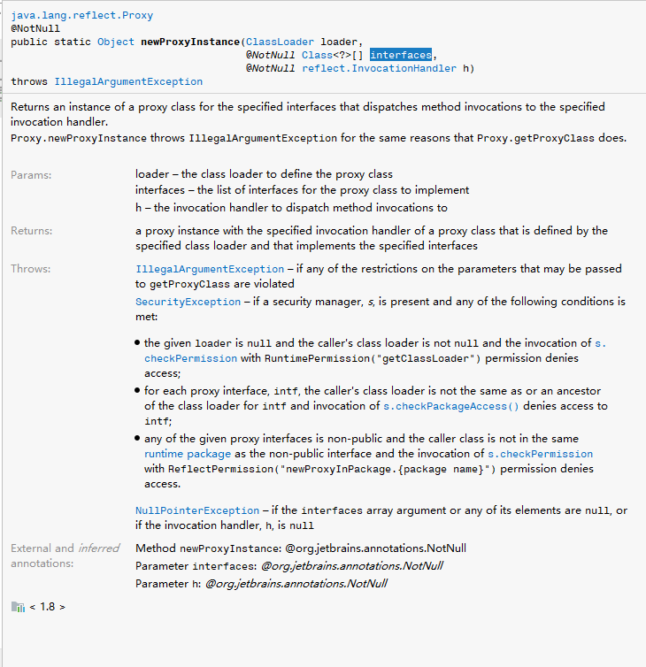

[TOC]

# 设计模式仓库

## 代理模式

### 静态代理

- 代理对象和目标对象实现相同接口
- 优点
  - 在不改变目标对象的前提下拓展目标对象
  - 保护具体业务逻辑，不对外暴露
- 缺点
  - 额外代理类数量多

#### 代码

- 以找工作为例，在智联上找工作

    ```java
    public class Person {

        public void findWork() {
            System.out.println("找工作");
        }

    }

    public class ZhiLian {

        private Person p;

        public ZhiLian(Person person) {
            this.p = person;
        }

        public void findWork() {
            // 智联帮你找工作
            System.out.println("智联正在帮你寻找工作");
            this.p.findWork();
            System.out.println("帮你找到工作了");
        }

    }
    
    public class StataicProxyTest {
    
        public static void main(String[] args) {
            Person p = new Person();
            ZhiLian zhiLian = new ZhiLian(p);
            zhiLian.findWork();
        }
    
    }
    ```
    
    - 运行结果
    
      ```
      智联正在帮你寻找工作
      找工作
      帮你找到工作了
      ```
    
    - 思考：当找到了工作以后，找房子，也将成为一个问题 需要去解决，你可能会选择一个租房公司来帮你找房子...... 难么就会需要另一个类 租房类。当需求越来越多，这些代理类也会越来越多


​      


### 动态代理

#### JDK 动态代理

- 优点
  - 解决静态代理中冗余代理的问题
- 缺点
  - JDK动态代理基于接口进行开发，必须要有一个接口


- 代码

  ```java
  public class PersonJdk {
  
      public void findWork() {
          System.out.println("找工作");
      }
  
  }
  public class ZhiLianJdk {
  
      /**
       * 被代理对象的临时保存结点
       */
      private PersonJdk target;
  
      public Object getInstance(PersonJdk personJdk) {
          this.target = personJdk;
          Class clazz;
  
          clazz = personJdk.getClass();
  
          // 重构一个新的对象
          return  Proxy.newProxyInstance(clazz.getClassLoader(), clazz.getInterfaces(),
                  new InvocationHandler() {
                      @Override
                      public Object invoke(Object proxy, Method method, Object[] args)
                              throws Throwable {
                          System.out.println("jdk 代理的智联");
  
                          Object invoke = method.invoke(target, args);
                          System.out.println("工作找到了");
                          return null;
                      }
                  });
  
      }
  }
  
  ```

  - 测试

    ```java
    public class JdkProxy {
    
        public static void main(String[] args) {
            PersonJdk pjd = new PersonJdk();
            Object obj = new ZhiLianJdk().getInstance(pjd);
    
            System.out.println(obj);
    
        }
    
    }
    ```

    测试结果如下

    ```
    jdk 代理的智联
    工作找到了
    null
    ```

  - 思考：我拿到的是一个obj 而不是PersonJdk 这个类 真正执行的方法应该时PersonJdk.findwok 。对测试类进行修改

    ```java
    public class JdkProxy {
    
        public static void main(String[] args) {
            PersonJdk pjd = new PersonJdk();
            Object obj = new ZhiLianJdk().getInstance(pjd);
    
            PersonJdk p = (PersonJdk) obj;
            p.findWork();
    
    //        System.out.println(obj);
    
        }
    
    }
    ```

  - 此时会抛出如下异常

    ```
    Exception in thread "main" java.lang.ClassCastException: com.sun.proxy.$Proxy0 cannot be cast to com.huifer.design.proxy.jdk.PersonJdk
    	at com.huifer.design.proxy.jdk.JdkProxyTest.main(JdkProxy.java:16)
    ```

  - 为什么出现了这个问题？

    - jdk代理模式的实现 被代理对象必须实现一个接口
    - 

  - 解决方案

    - 增加一个接口

      ```java
      public interface ZhiYuan {
      
          /**
           * 找工作
           */
          void findWork();
      
      }
      ```

      ```java
      public class PersonJdk implements ZhiYuan {
      
          @Override
          public void findWork() {
              System.out.println("找工作");
          }
      
      }
      ```

      ```java
      public class ZhiLianJdk {
      
          /**
           * 被代理对象的临时保存结点 从personjdk 提升到一个接口
           */
          private ZhiYuan target;
      
          public Object getInstance(ZhiYuan personJdk) {
              this.target = personJdk;
              Class clazz;
      
              clazz = personJdk.getClass();
      
              // 重构一个新的对象
              return  Proxy.newProxyInstance(clazz.getClassLoader(), clazz.getInterfaces(),
                      new InvocationHandler() {
                          @Override
                          public Object invoke(Object proxy, Method method, Object[] args)
                                  throws Throwable {
                              System.out.println("jdk 代理的智联");
      
                              Object invoke = method.invoke(target, args);
                              System.out.println("工作找到了");
                              return invoke;
                          }
                      });
      
          }
      }
      ```

      ```java
      public class JdkProxy {
      
          public static void main(String[] args) {
              PersonJdk pjd = new PersonJdk();
              Object obj = new ZhiLianJdk().getInstance(pjd);
              // 注意 JDK 代理实现的是接口 并不是实现了接口的类 (PersonJdk)
              ZhiYuan p = (ZhiYuan) obj;
              p.findWork();
      
      //        System.out.println(obj);
      
          }
      
      }
      ```

      运行结果

      ```
      jdk 代理的智联
      找工作
      工作找到了
      ```

  - 新的需求：职员想要找个房子居住。解：这个就只需要完成一个新的代理类即可

    ```java
    public interface ZhiYuan {
    
        /**
         * 找工作
         */
        void findWork();
    
        /**
         * 找房子
         */
        void findHouse();
    
    }
    ```

    ```java
    public class Jdk58 {
    
        private ZhiYuan target;
    
    
        public Object getInstance(ZhiYuan z) {
            this.target = z;
    
            Class clazz = null;
            clazz = z.getClass();
            Object o = Proxy.newProxyInstance(clazz.getClassLoader(), clazz.getInterfaces(),
                    new InvocationHandler() {
                        @Override
                        public Object invoke(Object proxy, Method method, Object[] args)
                                throws Throwable {
                            System.out.println("58同城为你服务");
    
                            Object invoke = method.invoke(target, args);
    
                            return invoke;
                        }
    
                    });
            return o;
    
        }
    
    }
    ```

    ```java
    public class JdkProxy {
    
        public static void main(String[] args) {
            PersonJdk pjd = new PersonJdk();
            Object obj = new ZhiLianJdk().getInstance(pjd);
            // 注意 JDK 代理实现的是接口 并不是实现了接口的类 (PersonJdk)
            ZhiYuan p = (ZhiYuan) obj;
            p.findWork();
    
    //        System.out.println(obj);
            System.out.println("===========");
            ZhiYuan instance = (ZhiYuan) new Jdk58().getInstance(pjd);
            instance.findHouse();
    
    
        }
    
    }
    ```

    运行结果

    ```
    jdk 代理的智联
    找工作
    工作找到了
    ===========
    58同城为你服务
    找房子
    ```

- 深究

  - 运行流程
    1. 获取被代理对象的引用，通过jdk Proxy 创建新的类还需要，被代理对象的所有接口
    2. jdk Proxy 创建新的类 ， 同时实现所有接口
    3. 在 InvocationHandler 添加自己的处理逻辑
    4. 编译成class 文件，在由JVM 进行调用


#### cglib动态代理

- 优点

  - 没有接口也能实现动态代理，采用字节码增强。

- 代码

  ```java
  public class CGPerson {
      public void findWork() {
          System.out.println("找工作");
      }
  }
  
  public class CGLIBZhiLian {
  
      public Object getInstance(Class<?> clazz) throws Exception {
          Enhancer enhancer = new Enhancer();
          enhancer.setSuperclass(clazz);
  
          enhancer.setCallback(new MethodInterceptor() {
              @Override
              public Object intercept(Object o, Method method, Object[] args,
                      MethodProxy methodProxy) throws Throwable {
                  System.out.println("CGLIB 代理智联");
                  Object o1 = methodProxy.invokeSuper(o, args);
                  return o1;
              }
          });
  
          return enhancer.create();
  
      }
  }
  
  
  ```

  ```java
  public class CglibProxyTest {
  
      public static void main(String[] args) throws Exception {
  
  
          CGPerson instance = (CGPerson) new CGLIBZhiLian().getInstance(CGPerson.class);
          instance.findWork();
  
      }
  
  }
  ```

  运行结果

  ```
  CGLIB 代理智联
  找工作
  ```

  


### 总结

- 静态代理：必须已知所有内容，运行前就知道。
- 动态代理：对代理内容未知，运行时才知道。


- 适配模式
- 装饰模式
## 工厂模式
### 简单工厂模式
#### 基础内容
- 生活案例
  
  - 有一个集合工厂，在工厂里面生产 [ 蒙牛、 伊利、 特仑苏 ]等各大品牌的牛奶，用户向这个工厂下订单说：我要蒙牛
- 案例解读
  - 类：工厂，作用生产牛奶
  - 接口: 牛奶， 作用[蒙牛、 伊利、 特仑苏] 继承牛奶
  - main：从工厂中提出蒙牛的订单
  
  
#### 代码
- 牛奶类
```java
package com.huifer.design.factory;


public interface Milk {

    /**
     * 获取一个牛奶的名称
     */
    String getName();
}

public class MengNiu implements Milk {

    @Override
    public String getName() {
        return "蒙牛";
    }
}

public class YiLi implements Milk {

    @Override
    public String getName() {
        return "伊利";
    }
}

```

- 工厂类
```java
public class SimpleFactory {

    public Milk getMilk(String name) {
        if ("蒙牛".equals(name)) {
            return new MengNiu();
        } else if ("伊利".equals(name)) {
            return new YiLi();
        } else {
            return null;
        }
    }

}
```

- 测试类
```java
public class SimpleFactoryTest {

    public static void main(String[] args) {
        SimpleFactory simpleFactory = new SimpleFactory();
        Milk mn = simpleFactory.getMilk("蒙牛");
        Milk yili = simpleFactory.getMilk("伊利");

        System.out.println(mn.getName());
        System.out.println(yili.getName());
    }

}

```
#### 小结
- 对用户而言不知道如何创建,创建过程对用户隐藏。小明只需要说我要蒙牛的牛奶，店家就给蒙牛的牛奶。

---
### 工厂方法模式
#### 基础内容
- 生活案例
  - 有两个工厂分别生产蒙牛、伊利，在工厂内部分别对配料进行调整
- 案例理解
  - 接口：工厂，作用：蒙牛、伊利的工厂都继承该工厂
  - 类： 蒙牛工厂类、伊利工厂类，作用：对牛奶进行生产
#### 代码
- 工厂接口以及工厂
```java
public interface MethodFactory {

    /**
     * 获取牛奶
     */
    Milk createMilk();

}

public class MengNiuFactory implements MethodFactory {

    @Override
    public Milk createMilk() {
        System.out.println("蒙牛材料清单 ： 牛奶 100 克");
        return new MengNiu();
    }

}

public class YiLiFactory implements MethodFactory {

    @Override
    public Milk createMilk() {
        System.out.println("蒙牛材料清单 ： 牛奶 200 克");
        return new YiLi();
    }

}

```
- 测试
```java
public class MethodFactoryTest {

    public static void main(String[] args) {
        MethodFactory factory = new MengNiuFactory();
        Milk milk = factory.createMilk();
        System.out.println(milk.getName());

        MethodFactory factory1 = new YiLiFactory();
        Milk milk1 = factory1.createMilk();
        System.out.println(milk.getName());
    }
}

```
####小结
- 工厂方法模式可以自定义各种类的创建过程，对类的创建足够自由

### 抽象工厂模式
#### 基础内容
- 生活案例
  - 我想造一个生产蒙牛的工厂，市场上直接可以购买整个生产机器配料。
  
- 案例理解
  - 市场上有很多牛奶工厂可供选择，你只需要选择你需要的。
  - 基类： 工厂基类 ， 作用：统一牛奶工厂
  - 类： 牛奶工厂，实现了工厂基类。 
#### 代码
- 工厂
```java
public abstract class AbstractFactory {

    public void hello() {
        System.out.println("hello factory");
    }

    /**
     * 蒙牛
     */
    public abstract Milk getMengNiu();

    /**
     * 伊利
     * @return
     */
    public abstract Milk getYiLi();

}


public class MilkFactory extends AbstractFactory {

    @Override
    public void hello() {
        super.hello();
    }

    @Override
    public Milk getMengNiu() {
        return new MengNiuFactory().createMilk();
    }

    @Override
    public Milk getYiLi() {
        return new YiLiFactory().createMilk();
    }

}

```
- 测试类
```java
public class AbsFactoryTest {

    public static void main(String[] args) {
        MilkFactory milkFactory = new MilkFactory();
        Milk mengNiu = milkFactory.getMengNiu();
        System.out.println(mengNiu.getName());

    }

}

```
#### 小结
- 用户只具有选择权，不再具有具体的参数的创建权。能够避免用户使用时根据参数而导致的异常

### 总结

- 创建工厂

  - 简单工厂：需要知道具体的创建参数
  - 工厂方法：需要知道有那些工厂
  - 抽象工厂：需要选择具体的工厂

  

## 单例模式
### 饿汉式
- 不管是否使用都提前创建实例，避免了线程安全问题。
```java
public class Hungry {

    /**
     * 提前创建一个实例 且不能修改
     */
    private static final Hungry HUNGRY = new Hungry();

    /**
     * 私有化构造方法
     */
    private Hungry() {
    }

    /**
     * 返回实例
     */
    public static Hungry getInstance() {
        return HUNGRY;
    }

}
```
- 测试方法
```java
private static void hungryTest() throws InterruptedException {
        CountDownLatch latch = new CountDownLatch(count);

        for (int i = 0; i < count; i++) {
            new Thread(() -> {
                try {
                    latch.await();
                    Hungry instance = Hungry.getInstance();
                    System.out.println(System.currentTimeMillis() + " : " + instance);
                } catch (Exception e) {

                }
            }).start();
            latch.countDown();
        }

    }
```
查看同一时间是否出现两个对象

```
1557969460097 : com.huifer.design.singleton.Hungry@5f292f85
1557969460097 : com.huifer.design.singleton.Hungry@5f292f85
1557969460097 : com.huifer.design.singleton.Hungry@5f292f85
1557969460097 : com.huifer.design.singleton.Hungry@5f292f85
1557969460097 : com.huifer.design.singleton.Hungry@5f292f85
1557969460097 : com.huifer.design.singleton.Hungry@5f292f85
1557969460097 : com.huifer.design.singleton.Hungry@5f292f85
1557969460097 : com.huifer.design.singleton.Hungry@5f292f85
1557969460097 : com.huifer.design.singleton.Hungry@5f292f85
1557969460097 : com.huifer.design.singleton.Hungry@5f292f85
```


###  <a name="lanhan">懒汉式</a>  
- 默认加载不进行实例化，在需要使用的时候才会进行实例化

    

    ```java
    public class Lazy1 {
    
        private static Lazy1 lazy1 = null;
    
        private Lazy1() {
        }
    
        public static Lazy1 getInstance() {
            if (lazy1 == null) {
                lazy1 = new Lazy1();
            }
            return lazy1;
        }
    
    }
    
    ```

    懒汉式

    ```java
        private static void lazyTest1()  {
            CountDownLatch latch = new CountDownLatch(count);
            for (int i = 0; i < count; i++) {
                new Thread(() -> {
    
                    try {
                        latch.await();
                        Lazy1 instance = Lazy1.getInstance();
                        System.out.println(System.currentTimeMillis() + " : " + instance);
                    } catch (Exception e) {
    
                    }
                }).start();
    
                latch.countDown();
            }
        }
    
    ```

    测试结果

    ```
    1557969659291 : com.huifer.design.singleton.Lazy1@6a89c268
    1557969659291 : com.huifer.design.singleton.Lazy1@6a89c268
    1557969659291 : com.huifer.design.singleton.Lazy1@6a89c268
    1557969659291 : com.huifer.design.singleton.Lazy1@6a89c268
    1557969659291 : com.huifer.design.singleton.Lazy1@6a89c268
    1557969659291 : com.huifer.design.singleton.Lazy1@6a89c268
    1557969659291 : com.huifer.design.singleton.Lazy1@6a89c268
    1557969659291 : com.huifer.design.singleton.Lazy1@6a89c268
    1557969659291 : com.huifer.design.singleton.Lazy1@41562ac8// 这一行有问题
    1557969659291 : com.huifer.design.singleton.Lazy1@6a89c268
    ```

    多线程测试结果不符合预期，它出现了两个实例 ， 需要对其进行修改。解决方案：给getInstance 添加锁 （同步锁）

    ```java
    public class Lazy2 {
    
        private static Lazy2 lazy1 = null;
    
        private Lazy2() {
        }
    
        public static synchronized Lazy2 getInstance() {
            if (lazy1 == null) {
                lazy1 = new Lazy2();
            }
            return lazy1;
        }
    
    }
    ```

    测试结果

    ```
    1557970444285 : com.huifer.design.singleton.Lazy2@3573fdb0
    1557970444285 : com.huifer.design.singleton.Lazy2@3573fdb0
    1557970444285 : com.huifer.design.singleton.Lazy2@3573fdb0
    1557970444285 : com.huifer.design.singleton.Lazy2@3573fdb0
    1557970444285 : com.huifer.design.singleton.Lazy2@3573fdb0
    1557970444285 : com.huifer.design.singleton.Lazy2@3573fdb0
    1557970444285 : com.huifer.design.singleton.Lazy2@3573fdb0
    1557970444285 : com.huifer.design.singleton.Lazy2@3573fdb0
    1557970444285 : com.huifer.design.singleton.Lazy2@3573fdb0
    1557970444285 : com.huifer.design.singleton.Lazy2@3573fdb0
    ```

    然而使用同步锁 synchronized 带来了性能问题 速度变得慢了很多。使用静态内部类来提升性能 

    ```java
    public class Lazy3 {
    
       
        private Lazy3() {
    
        }
    
    
        public static final Lazy3 getInstance() {
            return lazyHolder.LAZY_3;
        }
    
    
        private static class lazyHolder {
    
            // 内部类会率先初始化
            private static final Lazy3 LAZY_3 = new Lazy3();
        }
    }
    ```
    
    在这个基础上依然存在一个问题 ， 强制访问私有构造方法来创建实例。 当强制生产两个实例时需要抛出异常
    
    ```java
    public class Lazy4 {
    
    
        private static boolean initialized = false;
    
        private Lazy4() {
            synchronized (Lazy4.class) {
                if (initialized == false) {
                    initialized = !initialized;
                } else {
                    throw new RuntimeException("单例初始化异常 ， 私有构造方法被强制使用");
                }
            }
        }
    
        public static final Lazy4 getInstance() {
            return lazyHolder.LAZY_3;
        }
    
    
        private static class lazyHolder {
    
            private static final Lazy4 LAZY_3 = new Lazy4();
        }
    }
    ```
    
    ```java
    private static void lazy4Test() {
        try {
    
            Class<Lazy4> lazy4Class = Lazy4.class;
            // 获取私有构造方法 com.huifer.design.singleton.Lazy4.Lazy4
            Constructor<Lazy4> constructor = lazy4Class.getDeclaredConstructor(null);
            // 强制生产
            constructor.setAccessible(true);
            // 构造2次
            Lazy4 lazy4_1 = constructor.newInstance();
            Lazy4 lazy4_2 = constructor.newInstance();
        } catch (Exception e) {
            e.printStackTrace();
    
        }
    
    }
    ```
    
    测试结果存在异常 ，这个异常符合我们的预设
    
    ```
    java.lang.reflect.InvocationTargetException
    	at sun.reflect.NativeConstructorAccessorImpl.newInstance0(Native Method)
    	at sun.reflect.NativeConstructorAccessorImpl.newInstance(NativeConstructorAccessorImpl.java:62)
    	at sun.reflect.DelegatingConstructorAccessorImpl.newInstance(DelegatingConstructorAccessorImpl.java:45)
    	at java.lang.reflect.Constructor.newInstance(Constructor.java:423)
    	at com.huifer.design.singleton.Test.lazy4Test(Test.java:202)
    	at com.huifer.design.singleton.Test.main(Test.java:28)
    Caused by: java.lang.RuntimeException: 单例初始化异常 ， 私有构造方法被强制使用
    	at com.huifer.design.singleton.Lazy4.<init>(Lazy4.java:20)
    	... 6 more
    ```
    
    


### 注册式

- 用一个Map来存储注册的实体，通过实体名称来获取

```java
public class RegisterMap {

    private static Map<String, Object> register = new HashMap<>();

    private RegisterMap() {
    }

    public static synchronized RegisterMap getInstance(String name) {
        if (name == null) {
            name = RegisterMap.class.getName();
        }
        if (register.get(name) == null) {
            try {
                register.put(name, new RegisterMap());
            } catch (Exception e) {
                e.printStackTrace();
            }
        }
        return (RegisterMap) register.get(name);
    }


}

```

- 线程安全测试

  ```java
  private static void registerTest() {
      CountDownLatch latch = new CountDownLatch(count);
      for (int i = 0; i < count; i++) {
          new Thread(() -> {
  
              try {
                  latch.await();
                  RegisterMap registerMap = RegisterMap.getInstance("registerMap");
  
                  System.out.println(System.currentTimeMillis() + " : " + registerMap);
              } catch (Exception e) {
  
              }
          }).start();
  
          latch.countDown();
      }
  
  }
  ```

- 测试结果

  ```
  1557972891686 : com.huifer.design.singleton.RegisterMap@5ca02bd8
  1557972891686 : com.huifer.design.singleton.RegisterMap@5ca02bd8
  1557972891686 : com.huifer.design.singleton.RegisterMap@5ca02bd8
  1557972891686 : com.huifer.design.singleton.RegisterMap@5ca02bd8
  1557972891686 : com.huifer.design.singleton.RegisterMap@5ca02bd8
  1557972891686 : com.huifer.design.singleton.RegisterMap@5ca02bd8
  1557972891686 : com.huifer.design.singleton.RegisterMap@5ca02bd8
  1557972891686 : com.huifer.design.singleton.RegisterMap@5ca02bd8
  1557972891686 : com.huifer.design.singleton.RegisterMap@5ca02bd8
  1557972891686 : com.huifer.design.singleton.RegisterMap@5ca02bd8
  ```

  


### 枚举式

```java
public enum EnumSing {
    INSTANCE;
    private Object instance;

    EnumSing() {
        instance = new Object();
    }

    public Object getInstance() {
        return instance;
    }

}

Object o = EnumSing.INSTANCE.getInstance();
```

### 序列化与反序列化

- 将实体类序列化到本地 ，再次读取这个类时保证唯一性

```
public class SerializableSign implements Serializable {

    public final static SerializableSign Instance = new SerializableSign();

    private static final long serialVersionUID = 2263605502238537664L;

    private SerializableSign() {
    }


    public static SerializableSign getInstance() {
        return Instance;
    }


}
```

- 测试方法

  ```java
  private static void serializableTest() {
      SerializableSign s1 = null;
      SerializableSign s2 = SerializableSign.getInstance();
      FileOutputStream fos = null;
      ObjectOutputStream oos = null;
      FileInputStream fis = null;
      ObjectInputStream ois = null;
      try {
  
          // 测试序列化是否单例
          // 写入本地
          fos = new FileOutputStream("SerializableSign.obj");
          oos = new ObjectOutputStream(fos);
          oos.writeObject(s2);
          oos.flush();
          oos.close();
          // 从本地读取
          fis = new FileInputStream("SerializableSign.obj");
          ois = new ObjectInputStream(fis);
          s1 = (SerializableSign) ois.readObject();
          ois.close();
  
          System.out.println(s1);
          System.out.println(s2);
          System.out.println(s1 == s2);
      } catch (Exception e) {
  
      }
  
  
  }
  ```

  测试结果

  ```
  com.huifer.design.singleton.SerializableSign@7b23ec81
  com.huifer.design.singleton.SerializableSign@5cad8086
  false
  
  ```

  阅读[这篇文章](<https://www.ibm.com/developerworks/cn/java/j-5things1/index.html>),后知道了 在实体类种编写readResolve 方法来替换读取的实例对象

  ```java
  private Object readResolve() {
      // 反序列化时替换实例
      return Instance;
  }
  ```

  测试结果

  ```
  com.huifer.design.singleton.SerializableSign@5cad8086
  com.huifer.design.singleton.SerializableSign@5cad8086
  true
  ```

  通过 readResolve 方法修改后实例变成了唯一实例

### 总结

- 在整个系统运行过程中只有一个实例，有且只有一个。
- 保证单例的方案
  - 饿汉式
    - 在类加载的时候就初始化，对象是单例的
    - 优点：没有锁，执行效率高，线程绝对安全
    - 缺点：始终占据一部分内存空间
  - 懒汉式（线程安全问题的解决），spring 种的延迟加载
    - 默认不实例化，在使用过程中产生实例，通过方法调用来创建。存在线程安全问题，具体操作请看上述-[懒汉式](#lanhan) 
    - 静态内部类的性能最优
    - 优点：内存空间利用高
    
  - 注册式
  - 枚举式


## 原型模式

> 原型模式是创建型模式的一种，其特点在于通过“复制”一个已经存在的实例来返回新的实例,而不是新建实例。被复制的实例就是我们所称的“原型”，这个原型是可定制的。
> 原型模式多用于创建复杂的或者耗时的实例，因为这种情况下，复制一个已经存在的实例使程序运行更高效；或者创建值相等，只是命名不一样的同类数据。

#### JDK 实现

- JDK 官方提供了一种原型模式 Cloneable

```java
public class Prototype implements Cloneable {

    public String name;
    public Tag tag;

    @Override
    protected Object clone() throws CloneNotSupportedException {
        return super.clone();
    }
}

public class Tag {

    public String f;

    public Tag(String f) {
        this.f = f;
    }
}

```

- 测试用例

  ```java
  public class PrototypeTest {
  
      public static void main(String[] args) throws CloneNotSupportedException {
          Prototype prototype = new Prototype();
          prototype.name = "张三";
          prototype.tag = new Tag("123");
  
          Prototype clone = (Prototype) prototype.clone();
  
          clone.tag.f = "asasas";
          System.out.println(clone.tag.f);
          System.out.println(prototype.tag.f);
  
          System.out.println(clone.tag);
          System.out.println(prototype.tag);
  
      }
  
  }
  ```

- 运行结果

  ```
  asasas
  asasas
  com.huifer.design.prototype.Tag@330bedb4
  com.huifer.design.prototype.Tag@330bedb4
  ```

- 在这个测试用例种修改了clone 后的属性原来的实例属性也被同时修改，这是一个需要解决的问题。**此处出现了地址引用同一个地址，这是一种浅拷贝**

  - 使用**序列化来辅助深拷贝**
  - **自定义的属性也需要序列化**！！！

  ```java
  public Object deepClone() {
      try {
          ByteArrayOutputStream baos = new ByteArrayOutputStream();
          ObjectOutputStream oos = new ObjectOutputStream(baos);
          oos.writeObject(this);
  
          ByteArrayInputStream bis = new ByteArrayInputStream(baos.toByteArray());
          ObjectInputStream ois = new ObjectInputStream(bis);
  
          Prototype copyObject = (Prototype) ois.readObject();
          return copyObject;
      } catch (Exception e) {
          e.printStackTrace();
          return null;
      }
  }
  ```

  测试用例

  ```java
  public class PrototypeTest {
  
      public static void main(String[] args) throws Exception {
          Prototype prototype = new Prototype();
          prototype.name = "张三";
          prototype.tag = new Tag("123");
  
          Prototype clone = (Prototype) prototype.clone();
  
          clone.tag.f = "asasas";
          System.out.println(clone.tag.f);
          System.out.println(prototype.tag.f);
  
          System.out.println(clone.tag);
          System.out.println(prototype.tag);
  
          System.out.println(prototype.name == clone.name);
          System.out.println(prototype.tag == clone.tag);
      }
  
  }
  ```

  运行结果

  ```
  asasas
  123
  com.huifer.design.prototype.Tag@2f4d3709
  com.huifer.design.prototype.Tag@5e2de80c
  false
  false
  ```

  - 从结果上看可以说这两个实例是独立的。


### 总结

- 在原始基础上创建一个新的，两者的实例不相同但是数据内容相同
