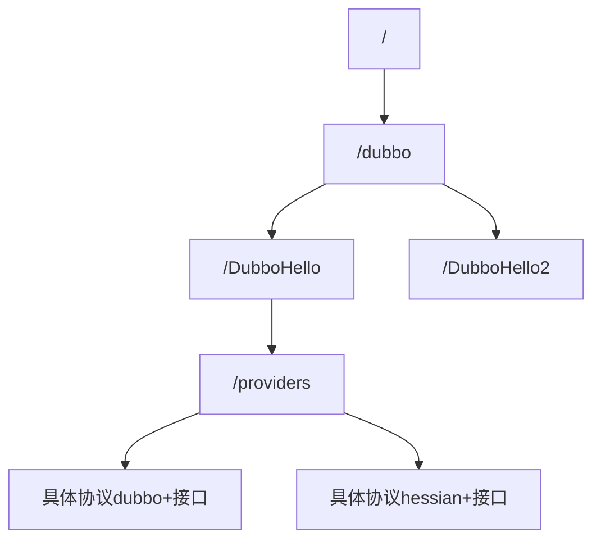
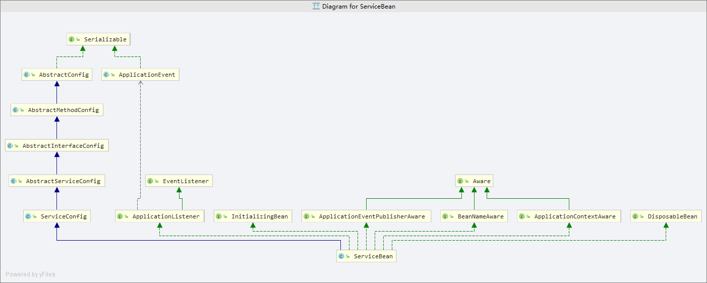
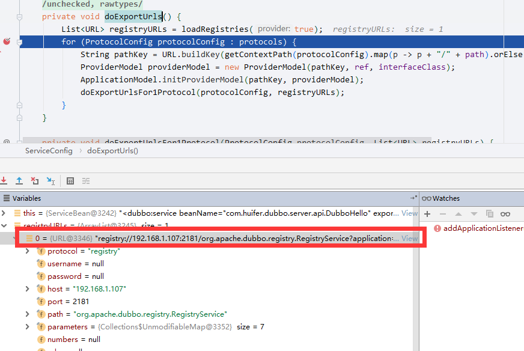
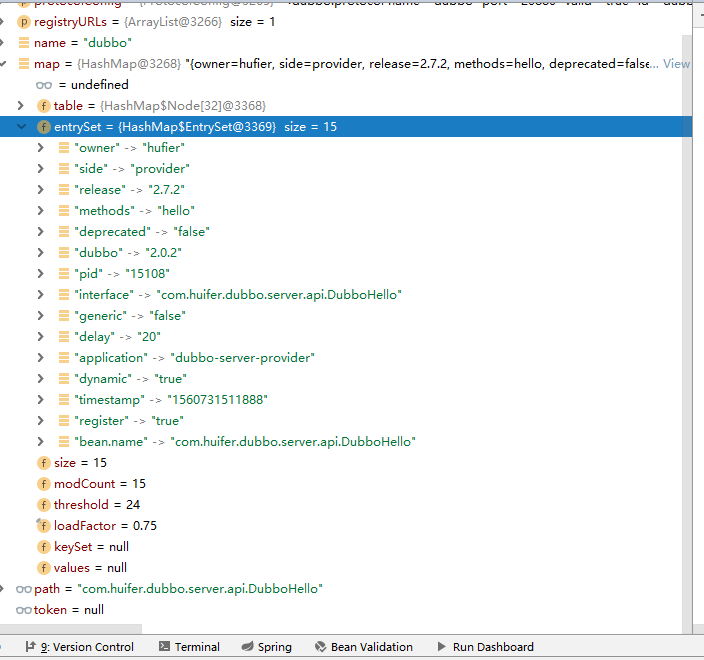
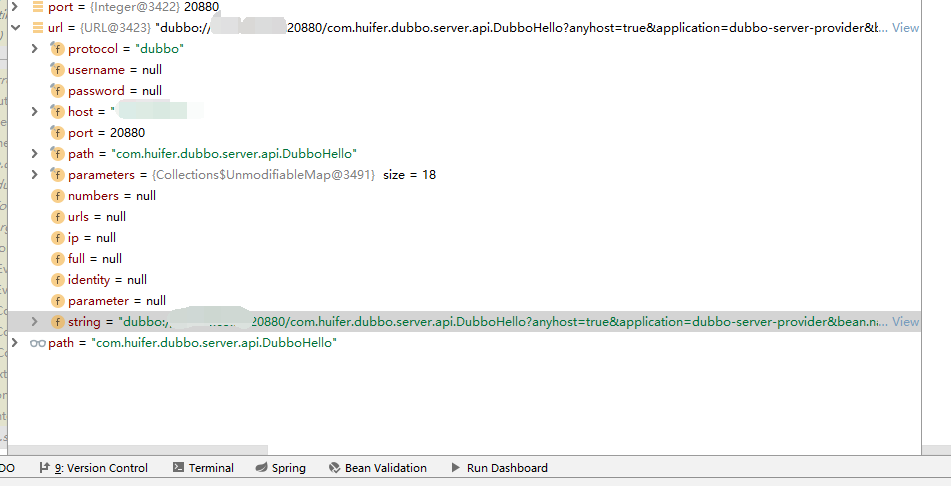
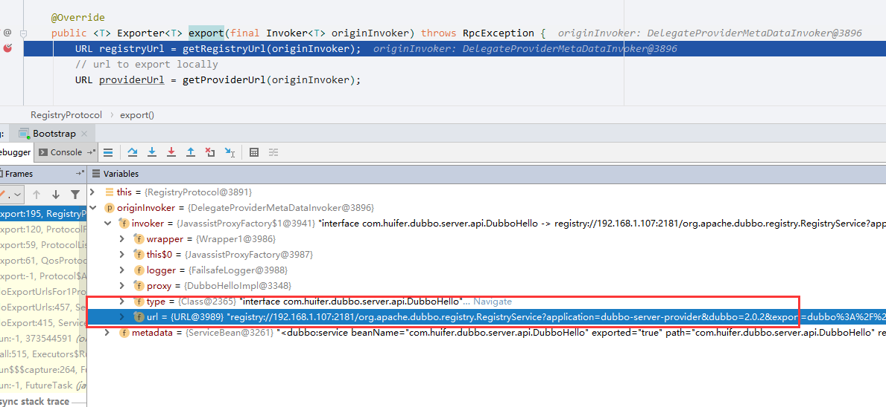
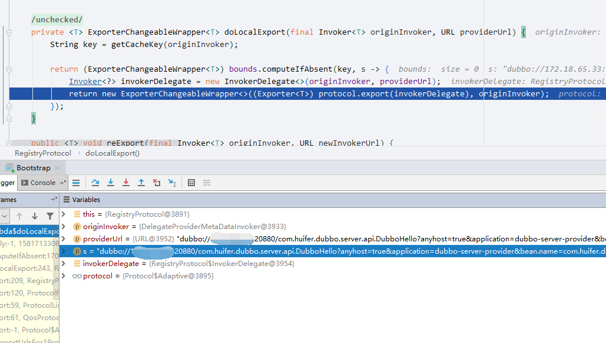
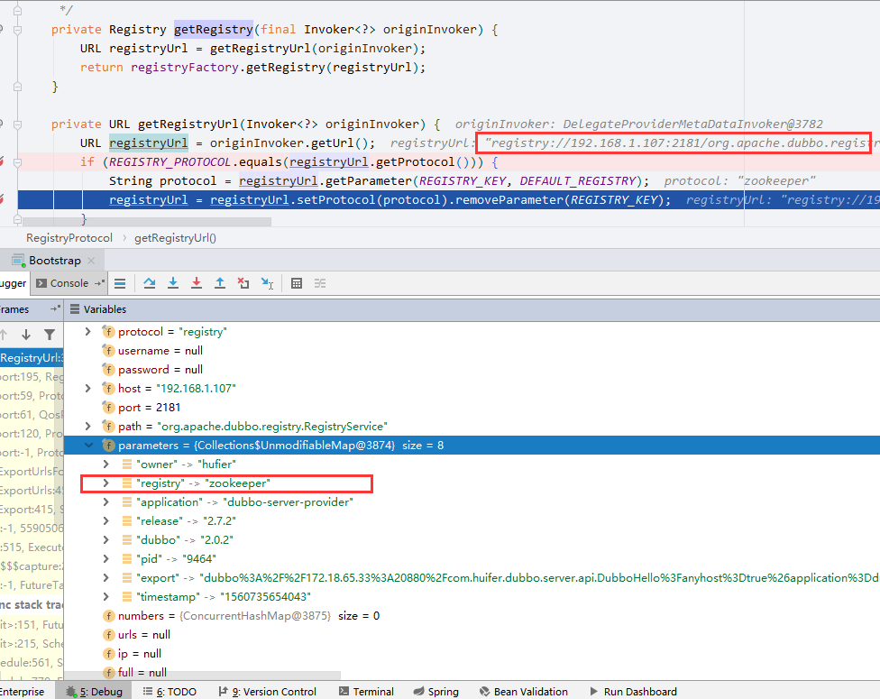
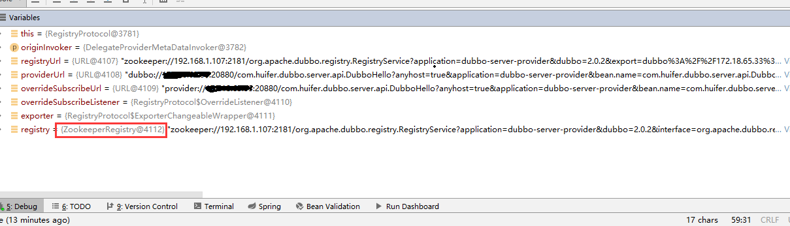

# dubbo 分布服务治理

## dubbo是什么

- 一个RPC框架


文档: <http://dubbo.apache.org/zh-cn/docs/user/quick-start.html>

## 简单案例

一般情况下dubbo分为如下几个模块

- dubbo-client: 客户端
- dubbo-server: 服务端
  - server-api:接口
  - server-provider: 接口实现
    - 依赖server-api 

项目结构如下


- server-api 接口

  ```java
  public interface DubboHello {
      String hello(String msg);
  } 
  ```

- server-provider接口实现

  ```java
  public class DubboHelloImpl implements DubboHello {
  
      @Override
      public String hello(String msg) {
          return "dubbo : " + msg;
      }
  
  }
  ```

- dubbo-client客户端

  ```java
  public class HelloClient {
  
      public static void main(String[] args) {
          DubboHello dubboHello = null;
          String helloDubbo = dubboHello.hello("hello dubbo");
          System.out.println(helloDubbo);
      }
  
  }
  ```

  - 这样是没办法进行方法调用，此时client依赖`server-api` ，还需要进行服务注册


### 改进

- server-provider 添加dubbo依赖

  ```xml
  <properties>
      <dubbo.version>2.7.2</dubbo.version>
  </properties>
  <dependency>
    <groupId>org.apache.dubbo</groupId>
    <artifactId>dubbo</artifactId>
    <version>${dubbo.version}</version>
  </dependency>
  ```

- dubbo-server.xml

  ```xml
  <?xml version="1.0" encoding="UTF-8"?>
  <beans xmlns="http://www.springframework.org/schema/beans"
    xmlns:xsi="http://www.w3.org/2001/XMLSchema-instance"
    xmlns:dubbo="http://dubbo.apache.org/schema/dubbo"
    xsi:schemaLocation="http://www.springframework.org/schema/beans        http://www.springframework.org/schema/beans/spring-beans-4.3.xsd        http://dubbo.apache.org/schema/dubbo        http://dubbo.apache.org/schema/dubbo/dubbo.xsd">
  
    <!-- 提供方应用信息，用于计算依赖关系 -->
    <dubbo:application name="dubbo-server-provider" owner="hufier"/>
  
    <!-- 使用multicast广播注册中心暴露服务地址 -->
    <dubbo:registry address="N/A"/>
  
    <!-- 用dubbo协议在20880端口暴露服务 -->
    <dubbo:protocol name="dubbo" port="20880"/>
  
    <!-- 声明需要暴露的服务接口 -->
    <dubbo:service interface="com.huifer.dubbo.server.api.DubboHello" ref="dubboHello"/>
  
    <!-- 和本地bean一样实现服务 id=server:ref-->
    <bean id="dubboHello" class="com.huifer.dubbo.server.provider.DubboHelloImpl"/>
  
  </beans>
  ```

- Bootstrap

  ```java
  public class Bootstrap {
  
      public static void main(String[] args) throws IOException {
          ClassPathXmlApplicationContext context = new ClassPathXmlApplicationContext(
                  "dubbo-server.xml");
          context.start();
          System.in.read();
      }
  
  }
  ```

- 启动

  ```
   dubbo://0.0.0.0:20880/com.huifer.dubbo.server.api.DubboHello?anyhost=true&application=dubbo-server-provider&bean.name=com.huifer.dubbo.server.api.DubboHello&bind.ip=0.0.0.0&bind.port=20880&deprecated=false&dubbo=2.0.2&dynamic=true&generic=false&interface=com.huifer.dubbo.server.api.DubboHello&methods=hello&owner=hufier&pid=12916&register=true&release=2.7.2&side=provider&timestamp=1560395544486, dubbo version: 2.7.2, current host: 0.0.0.0
  ```

  

- `dubbo-client`也需要加入`dubbo`依赖

- dubbo-client.xml

  ```xml
  <?xml version="1.0" encoding="UTF-8"?>
  <beans xmlns="http://www.springframework.org/schema/beans"
    xmlns:xsi="http://www.w3.org/2001/XMLSchema-instance"
    xmlns:dubbo="http://dubbo.apache.org/schema/dubbo"
    xsi:schemaLocation="http://www.springframework.org/schema/beans        http://www.springframework.org/schema/beans/spring-beans-4.3.xsd        http://dubbo.apache.org/schema/dubbo        http://dubbo.apache.org/schema/dubbo/dubbo.xsd">
  
    <!-- 消费方应用名，用于计算依赖关系，不是匹配条件，不要与提供方一样 -->
    <dubbo:application name="dubbo-client"  />
  
    <!-- 使用multicast广播注册中心暴露发现服务地址 -->
    <dubbo:registry address="N/A" />
  
    <!-- 生成远程服务代理，可以和本地bean一样使用demoService -->
    <dubbo:reference id="dubboHello" interface="com.huifer.dubbo.server.api.DubboHello" url="dubbo://0.0.0.0:20880/com.huifer.dubbo.server.api.DubboHello"/>
  </beans>
  ```

- HelloClient

  ```java
  public class HelloClient {
  
      public static void main(String[] args) {
          ClassPathXmlApplicationContext context = new ClassPathXmlApplicationContext(
                  "dubbo-client.xml");
          DubboHello dubboHello = (DubboHello) context.getBean("dubboHello");
  
          String helloDubbo = dubboHello.hello("hello dubbo");
          System.out.println(helloDubbo);
      }
  
  }
  ```

  - 运行结果

    `dubbo : hello dubbo`

### 配合zk

- 依赖

  ```xml
  <dependency>
    <groupId>org.apache.dubbo</groupId>
    <artifactId>dubbo</artifactId>
    <version>${dubbo.version}</version>
  </dependency>
  
  <dependency>
    <groupId>org.apache.dubbo</groupId>
    <artifactId>dubbo-dependencies-zookeeper</artifactId>
    <version>${dubbo.version}</version>
  </dependency>
  ```

- 服务端地址配置

```xml
<?xml version="1.0" encoding="UTF-8"?>
<beans xmlns="http://www.springframework.org/schema/beans"
  xmlns:xsi="http://www.w3.org/2001/XMLSchema-instance"
  xmlns:dubbo="http://dubbo.apache.org/schema/dubbo"
  xsi:schemaLocation="http://www.springframework.org/schema/beans        http://www.springframework.org/schema/beans/spring-beans-4.3.xsd        http://dubbo.apache.org/schema/dubbo        http://dubbo.apache.org/schema/dubbo/dubbo.xsd">

  <!-- 提供方应用信息，用于计算依赖关系 -->
  <dubbo:application name="dubbo-server-provider" owner="hufier"/>

  <dubbo:registry address="zookeeper://192.168.1.107:2181"/>
  <!-- 用dubbo协议在20880端口暴露服务 -->
  <dubbo:protocol name="dubbo" port="20880"/>

  <!-- 声明需要暴露的服务接口 -->
  <dubbo:service interface="com.huifer.dubbo.server.api.DubboHello" ref="dubboHello"/>

  <!-- 和本地bean一样实现服务 id=server:ref-->
  <bean id="dubboHello" class="com.huifer.dubbo.server.provider.DubboHelloImpl"/>

</beans>

```

- 客户端配置

  ```xml
  <?xml version="1.0" encoding="UTF-8"?>
  <beans xmlns="http://www.springframework.org/schema/beans"
    xmlns:xsi="http://www.w3.org/2001/XMLSchema-instance"
    xmlns:dubbo="http://dubbo.apache.org/schema/dubbo"
    xsi:schemaLocation="http://www.springframework.org/schema/beans        http://www.springframework.org/schema/beans/spring-beans-4.3.xsd        http://dubbo.apache.org/schema/dubbo        http://dubbo.apache.org/schema/dubbo/dubbo.xsd">
  
    <!-- 消费方应用名，用于计算依赖关系，不是匹配条件，不要与提供方一样 -->
    <dubbo:application name="dubbo-client"  />
  
    <dubbo:registry address="zookeeper://192.168.1.107:2181"/>
  
    <!-- 生成远程服务代理，可以和本地bean一样使用demoService -->
    <dubbo:reference id="dubboHello" interface="com.huifer.dubbo.server.api.DubboHello" />
  </beans>
  ```

  


## dubbo 在zookeeper

启动一个dubbo服务端项目在zookeeper的结构

- 启动一个dubbo服务端，内含包括

```xml
<?xml version="1.0" encoding="UTF-8"?>
<beans xmlns="http://www.springframework.org/schema/beans"
  xmlns:xsi="http://www.w3.org/2001/XMLSchema-instance"
  xmlns:dubbo="http://dubbo.apache.org/schema/dubbo"
  xsi:schemaLocation="http://www.springframework.org/schema/beans        http://www.springframework.org/schema/beans/spring-beans-4.3.xsd        http://dubbo.apache.org/schema/dubbo        http://dubbo.apache.org/schema/dubbo/dubbo.xsd">

  <!-- 提供方应用信息，用于计算依赖关系 -->
  <dubbo:application name="dubbo-server-provider" owner="hufier"/>

  <dubbo:registry address="zookeeper://192.168.1.107:2181"/>
  <!-- 用dubbo协议在20880端口暴露服务 -->
  <dubbo:protocol name="dubbo" port="20880"/>

  <!-- 声明需要暴露的服务接口 protocl可以填写多个协议 -->
  <dubbo:service interface="com.huifer.dubbo.server.api.DubboHello" ref="dubboHello" protocol="dubbo"/> 
  <dubbo:service interface="com.huifer.dubbo.server.api.DubboHello2" ref="dubboHello2" protocol="hessian"/>

  <!-- 和本地bean一样实现服务 id=server:ref-->
  <bean id="dubboHello" class="com.huifer.dubbo.server.provider.DubboHelloImpl"/>
  <bean id="dubboHello2" class="com.huifer.dubbo.server.provider.DubboHelloImpl2"/>

</beans>

```

- dubbo在zookeeper下的存放结构




## 多版本关键字version

- 定义接口

```java
public interface DubboVersion1 {

    /**
     * 第一个版本的hello
     * @param o
     * @return
     */
    String sayHelloV1(String o);

}
```

- 同一个接口2个版本实现

  ```java
  public class DubboV1 implements DubboVersion1 {
  
      @Override
      public String sayHelloV1(String o) {
          return "version1 : " + o;
      }
  }
  ```

  ```java
  public class DubboV2 implements DubboVersion1 {
  
      @Override
      public String sayHelloV1(String o) {
          return "version2 : " + o;
      }
  }
  ```

- 服务端配置

  ```xml
    <dubbo:service interface="com.huifer.dubbo.server.api.DubboVersion1" ref="dv1" protocol="dubbo"
      version="1.0.0"/>
    <dubbo:service interface="com.huifer.dubbo.server.api.DubboVersion1" ref="dv2" protocol="dubbo"
      version="2.0.0"/>
  
  
    <bean id="dv1" class="com.huifer.dubbo.server.provider.DubboV1" />
    <bean id="dv2" class="com.huifer.dubbo.server.provider.DubboV2"/>
  
  
  ```

- 客户端配置

  ```xml
  <dubbo:reference id="acac" interface="com.huifer.dubbo.server.api.DubboHello" version="1.0.0"/>
  ```

- 客户端代码

  ```java
  public class HelloClient {
  
      public static void main(String[] args) {
          ClassPathXmlApplicationContext context = new ClassPathXmlApplicationContext(
                  "dubbo-client.xml");
  
  
          DubboVersion1 dv1 = (DubboVersion1) context.getBean("acac");
          System.out.println(dv1.sayHelloV1("hello-dubbo"));
      }
  
  }
  ```

- 想要替换成`version=2.0.0`只需要将 客户端配置中`version`进行修改即可

- zookeeper变化

  - 在这个路径中存放了`version=xxx`

  ```
  [dubbo%3A%2F%2F0.0.0.0%3A20880%2Fcom.huifer.dubbo.server.api.DubboVersion1%3Fanyhost%3Dtrue%26application%3Ddubbo-server-provider%26bean.name%3Dcom.huifer.dubbo.server.api.DubboVersion1%26deprecated%3Dfalse%26dubbo%3D2.0.2%26dynamic%3Dtrue%26generic%3Dfalse%26interface%3Dcom.huifer.dubbo.server.api.DubboVersion1%26methods%3DsayHelloV1%26owner%3Dhufier%26pid%3D10848%26register%3Dtrue%26release%3D2.7.2%26revision%3D1.0.0%26side%3Dprovider%26timestamp%3D1560473277839%26version%3D1.0.0, dubbo%3A%2F%2F0.0.0.0%3A20880%2Fcom.huifer.dubbo.server.api.DubboVersion12%3Fanyhost%3Dtrue%26application%3Ddubbo-server-provider%26bean.name%3Dcom.huifer.dubbo.server.api.DubboVersion12%26deprecated%3Dfalse%26dubbo%3D2.0.2%26dynamic%3Dtrue%26generic%3Dfalse%26interface%3Dcom.huifer.dubbo.server.api.DubboVersion1%26methods%3DsayHelloV1%26owner%3Dhufier%26pid%3D10848%26register%3Dtrue%26release%3D2.7.2%26revision%3D2.0.0%26side%3Dprovider%26timestamp%3D1560473277917%26version%3D2.0.0]
  
  ```

## 容错机制 cluster关键字 

```xml
<dubbo:reference id="acac"
  interface="com.huifer.dubbo.server.api.DubboVersion1"
  version="2.0.0"
  cluster="failsafe"
/>
```

`org.apache.dubbo.rpc.cluster.support`包下

- failsafe
  - 请求失败，记录请求，
- **failover**
  - 默认
  - 请求失败重试其他服务器
  - 重试次数：2 ，不包含第一次请求，总共发送3次请求
  - 搜索查询推荐使用
- **failfast**
  - 快速失败，失败直接报错
  - 数据操作增加、删除、修改推荐使用
- **failback**
  - 失败后恢复
  - 数据操作增加、删除、修改推荐使用
- forking
  - 同时调用N个节点(由forks设置),多个节点谁先返回就返回这个结果
  - forks：最大并行数量
- broadcast
  - 广播，只要由一台服务报错执行就报错

## 配置

| 标签                                                         | 用途         | 解释                                                         |
| ------------------------------------------------------------ | ------------ | ------------------------------------------------------------ |
| `<dubbo:service/>`                                           | 服务配置     | 用于暴露一个服务，定义服务的元信息，一个服务可以用多个协议暴露，一个服务也可以注册到多个注册中心 |
| `<dubbo:reference/>`[[2\]](http://dubbo.apache.org/zh-cn/docs/user/configuration/xml.html#fn2) | 引用配置     | 用于创建一个远程服务代理，一个引用可以指向多个注册中心       |
| `<dubbo:protocol/>`                                          | 协议配置     | 用于配置提供服务的协议信息，协议由提供方指定，消费方被动接受 |
| `<dubbo:application/>`                                       | 应用配置     | 用于配置当前应用信息，不管该应用是提供者还是消费者           |
| `<dubbo:module/>`                                            | 模块配置     | 用于配置当前模块信息，可选                                   |
| `<dubbo:registry/>`                                          | 注册中心配置 | 用于配置连接注册中心相关信息                                 |
| `<dubbo:monitor/>`                                           | 监控中心配置 | 用于配置连接监控中心相关信息，可选                           |
| `<dubbo:provider/>`                                          | 提供方配置   | 当 ProtocolConfig 和 ServiceConfig 某属性没有配置时，采用此缺省值，可选 |
| `<dubbo:consumer/>`                                          | 消费方配置   | 当 ReferenceConfig 某属性没有配置时，采用此缺省值，可选      |
| `<dubbo:method/>`                                            | 方法配置     | 用于 ServiceConfig 和 ReferenceConfig 指定方法级的配置信息   |
| `<dubbo:argument/>`                                          | 参数配置     | 用于指定方法参数配置                                         |

## 配置优先级

官方文档-配置<http://dubbo.apache.org/zh-cn/docs/user/configuration/xml.html>


1. **客户端>服务端**

2. **方法>接口>全局配置**
1. 同级别客户端优先


## 服务降级

**mock 客户端配置**

- 定义mock类

  ```java
  public class MockDemo implements DubboVersion1 {
  
      @Override
      public String sayHelloV1(String o) {
          return "服务降级-mock" + o;
      }
  }
  ```

- 客户端配置

  1毫秒完成调用

  ```java
    <dubbo:reference id="acac"
      interface="com.huifer.dubbo.server.api.DubboVersion1"
      version="2.0.0"
      timeout="1"
      mock="com.huifer.dubbo.client.mock.MockDemo"
  
    />
  ```

  ```java
  public class HelloClient {
  
      public static void main(String[] args) {
          ClassPathXmlApplicationContext context = new ClassPathXmlApplicationContext(
                  "dubbo-client.xml");
          DubboVersion1 dv1 = (DubboVersion1) context.getBean("acac");
          System.out.println(dv1.sayHelloV1("hello-dubbo"));
      }
  
  }
  ```

- 运行结果

  ```
  服务降级-mock : hello-dubbo
  ```

  


## SPI

### Java SPI

```sequence
调用者-->BaseService:调用
BaseService --> BaseServiceImpl1:发现
BaseService --> BaseServiceImpl2:发现
```


- 基本接口

  ```java
  public interface BaseService {
      String hello(String msg);
  }
  ```

- 实现1

  ```java
  public class BaseServiceImplV1 implements BaseService {
  
      @Override
      public String hello(String msg) {
          return "v1 : " + msg;
      }
  }
  ```

- 实现2

  ```java
  public class BaseServiceImplV2 implements BaseService {
  
      @Override
      public String hello(String msg) {
          return "v2 : " + msg;
      }
  }
  ```

- 配置文件

  `src/main/resources/`下创建` /META-INF/services`，并且以接口全类名创建文件，填写内容为实现该类的实现类的全类名

  - `com.huifer.dubbo.spi.BaseService`

    ```
    com.huifer.dubbo.spi.BaseServiceImplV1
    com.huifer.dubbo.spi.BaseServiceImplV2
    
    ```

    


- 启动

  ```java
  public class Run {
  
      public static void main(String[] args) {
          ServiceLoader<BaseService> baseServices = ServiceLoader.load(BaseService.class);
  
          for (BaseService baseService : baseServices) {
              System.out.println(baseService.hello("fff"));;
          }
      }
  
  }
  ```
  - 运行结果

    ```
    v1 : fff
    v2 : fff
    ```

    


### dubbo SPI

#### demo

官方文档 <http://dubbo.apache.org/zh-cn/docs/source_code_guide/dubbo-spi.html>

- dubbo中spi资源应该放在那里？
  - /META-INF/dubbo下
- 文件编写
  - 文件名: 全路径类名
  - 内容 key=value


- 接口

  ```java
  @SPI
  public interface Robot {
      void sayHello();
  }
  ```

- 接口实现1

  ```java
  public class Bumblebee implements Robot {
  
      @Override
      public void sayHello() {
          System.out.println("Hello, I am Bumblebee.");
      }
  }
  ```

- 接口实现2

  ```java
  public class OptimusPrime implements Robot {
  
      @Override
      public void sayHello() {
          System.out.println("Hello, I am Optimus Prime.");
      }
  }
  ```

- 配置文件

  ```
  optimusPrime=com.huifer.dubbo.client.spi.OptimusPrime
  bumblebee=com.huifer.dubbo.client.spi.Bumblebee
  ```

- 启动器

  ```java
  public class SpiDemo {
  
      public static void main(String[] args) {
  
          ExtensionLoader<Robot> extensionLoader =
                  ExtensionLoader.getExtensionLoader(Robot.class);
          Robot optimusPrime = extensionLoader.getExtension("optimusPrime");
          optimusPrime.sayHello();
          Robot bumblebee = extensionLoader.getExtension("bumblebee");
          bumblebee.sayHello();
  
      }
  
  }
  ```

  - 下图为一个错误的拼写


- 正确拼写
  - 

相关issues: <https://github.com/apache/dubbo/issues/4310> 问题在单词拼写 :cry:

##### 检查流程

- 打开target文件夹下查看编译后结果

  

  然后就知道问题了!!!!!!!!

  

#### org.apache.dubbo.common.extension.ExtensionLoader 类

> 调用链
>
> - `org.apache.dubbo.common.extension.ExtensionLoader#getExtensionLoader`
>   - `org.apache.dubbo.common.extension.ExtensionLoader#getAdaptiveExtension`
>     - `org.apache.dubbo.common.extension.ExtensionLoader#createAdaptiveExtension`
>       - `org.apache.dubbo.common.extension.ExtensionLoader#getAdaptiveExtensionClass`
>         - `org.apache.dubbo.common.extension.ExtensionLoader#getExtensionClasses`
>           - `org.apache.dubbo.common.extension.ExtensionLoader#loadExtensionClasses`
>             - `org.apache.dubbo.common.extension.ExtensionLoader#cacheDefaultExtensionName`
>         - `org.apache.dubbo.common.extension.ExtensionLoader#createAdaptiveExtensionClass`


- `org.apache.dubbo.common.extension.ExtensionLoader#getExtensionLoader`

  - 作用: 传入一个class 来获得 `ExtensionLoader`

  ```java
  @SuppressWarnings("unchecked")
  public static <T> ExtensionLoader<T> getExtensionLoader(Class<T> type) {
      if (type == null) {
          throw new IllegalArgumentException("Extension type == null");
      }
      if (!type.isInterface()) {
          throw new IllegalArgumentException("Extension type (" + type + ") is not an interface!");
      }
      if (!withExtensionAnnotation(type)) {
          throw new IllegalArgumentException("Extension type (" + type +
                  ") is not an extension, because it is NOT annotated with @" + SPI.class.getSimpleName() + "!");
      }
  	// 从EXTENSION_LOADERS中获取 这是个Map<Class,ExtensionLoader>
      ExtensionLoader<T> loader = (ExtensionLoader<T>) EXTENSION_LOADERS.get(type);
      if (loader == null) {
          // 创建一个 ExtensionLoader
          EXTENSION_LOADERS.putIfAbsent(type, new ExtensionLoader<T>(type));
          loader = (ExtensionLoader<T>) EXTENSION_LOADERS.get(type);
      }
      return loader;
  }
  ```

- 继续debug进入到了`org.apache.dubbo.common.extension.ExtensionLoader#getAdaptiveExtension`方法

  - 将instance 创建到内存中

  ```java
  @SuppressWarnings("unchecked")
  public T getAdaptiveExtension() {
      Object instance = cachedAdaptiveInstance.get();
      if (instance == null) {
          if (createAdaptiveInstanceError == null) {
              synchronized (cachedAdaptiveInstance) {
                  instance = cachedAdaptiveInstance.get();
                  if (instance == null) {
                      try {
                          // 将 instance 放入cachedAdaptiveInstance
                          instance = createAdaptiveExtension();
                          cachedAdaptiveInstance.set(instance);
                      } catch (Throwable t) {
                          createAdaptiveInstanceError = t;
                          throw new IllegalStateException("Failed to create adaptive instance: " + t.toString(), t);
                      }
                  }
              }
          } else {
              throw new IllegalStateException("Failed to create adaptive instance: " + createAdaptiveInstanceError.toString(), createAdaptiveInstanceError);
          }
      }
  
      return (T) instance;
  }
  ```

- `createAdaptiveExtension()`

  ```java
  @SuppressWarnings("unchecked")
  private T createAdaptiveExtension() {
      try {
          // 获得一个适配器实例
          return injectExtension((T) getAdaptiveExtensionClass().newInstance());
      } catch (Exception e) {
          throw new IllegalStateException("Can't create adaptive extension " + type + ", cause: " + e.getMessage(), e);
      }
  }
  ```

- `getAdaptiveExtensionClass()`

  ```java
  private Class<?> getAdaptiveExtensionClass() {
      getExtensionClasses();
      if (cachedAdaptiveClass != null) {
          return cachedAdaptiveClass;
      }
      return cachedAdaptiveClass = createAdaptiveExtensionClass();
  }
  ```

- `getExtensionClasses`

  - 获取所有扩展类 `Holder<Map<String, Class<?>>> cachedClasses`

  ```java
  private Map<String, Class<?>> getExtensionClasses() {
      Map<String, Class<?>> classes = cachedClasses.get();
      if (classes == null) {
          synchronized (cachedClasses) {
              classes = cachedClasses.get();
              if (classes == null) {
                  classes = loadExtensionClasses();
                  cachedClasses.set(classes);
              }
          }
      }
      return classes;
  }
  ```

- `loadExtensionClasses`

  加载dubbo预设扩展点

  ```java
  private Map<String, Class<?>> loadExtensionClasses() {
      cacheDefaultExtensionName();
  
      Map<String, Class<?>> extensionClasses = new HashMap<>();
      loadDirectory(extensionClasses, DUBBO_INTERNAL_DIRECTORY, type.getName());
      loadDirectory(extensionClasses, DUBBO_INTERNAL_DIRECTORY, type.getName().replace("org.apache", "com.alibaba"));
      loadDirectory(extensionClasses, DUBBO_DIRECTORY, type.getName());
      loadDirectory(extensionClasses, DUBBO_DIRECTORY, type.getName().replace("org.apache", "com.alibaba"));
      loadDirectory(extensionClasses, SERVICES_DIRECTORY, type.getName());
      loadDirectory(extensionClasses, SERVICES_DIRECTORY, type.getName().replace("org.apache", "com.alibaba"));
      return extensionClasses;
  }
  ```

  ```java
  private static final String SERVICES_DIRECTORY = "META-INF/services/";
  
  private static final String DUBBO_DIRECTORY = "META-INF/dubbo/";
  
  private static final String DUBBO_INTERNAL_DIRECTORY = DUBBO_DIRECTORY + "internal/";
  ```

  ​	`org.apache.dubbo.common.extension.ExtensionFactory`

  ```  
  adaptive=org.apache.dubbo.common.extension.factory.AdaptiveExtensionFactory
  spi=org.apache.dubbo.common.extension.factory.SpiExtensionFactory
  spring=org.apache.dubbo.config.spring.extension.SpringExtensionFactory
  ```

  这些内容会被加载，当然项目中的也会被加载

  


- `cacheDefaultExtensionName`

- `createAdaptiveExtensionClass`

  - 创建扩展点

  ```java
  private Class<?> createAdaptiveExtensionClass() {
      String code = new AdaptiveClassCodeGenerator(type, cachedDefaultName).generate();
      ClassLoader classLoader = findClassLoader();
      org.apache.dubbo.common.compiler.Compiler compiler = ExtensionLoader.getExtensionLoader(org.apache.dubbo.common.compiler.Compiler.class).getAdaptiveExtension();
      return compiler.compile(code, classLoader);
  }
  ```

---

## 服务发布解析

- xml解析器`org.apache.dubbo.config.spring.schema.DubboNamespaceHandler`

  - `org.apache.dubbo.config.spring.schema.DubboBeanDefinitionParser`
    - 将配置文件中的标签解析成具体的类

  ```java
  public class DubboNamespaceHandler extends NamespaceHandlerSupport {
  
      static {
          Version.checkDuplicate(DubboNamespaceHandler.class);
      }
  
      @Override
      public void init() {
          registerBeanDefinitionParser("application", new DubboBeanDefinitionParser(ApplicationConfig.class, true));
          registerBeanDefinitionParser("module", new DubboBeanDefinitionParser(ModuleConfig.class, true));
          registerBeanDefinitionParser("registry", new DubboBeanDefinitionParser(RegistryConfig.class, true));
          registerBeanDefinitionParser("config-center", new DubboBeanDefinitionParser(ConfigCenterBean.class, true));
          registerBeanDefinitionParser("metadata-report", new DubboBeanDefinitionParser(MetadataReportConfig.class, true));
          registerBeanDefinitionParser("monitor", new DubboBeanDefinitionParser(MonitorConfig.class, true));
          registerBeanDefinitionParser("metrics", new DubboBeanDefinitionParser(MetricsConfig.class, true));
          registerBeanDefinitionParser("provider", new DubboBeanDefinitionParser(ProviderConfig.class, true));
          registerBeanDefinitionParser("consumer", new DubboBeanDefinitionParser(ConsumerConfig.class, true));
          registerBeanDefinitionParser("protocol", new DubboBeanDefinitionParser(ProtocolConfig.class, true));
          registerBeanDefinitionParser("service", new DubboBeanDefinitionParser(ServiceBean.class, true));
          registerBeanDefinitionParser("reference", new DubboBeanDefinitionParser(ReferenceBean.class, false));
          registerBeanDefinitionParser("annotation", new AnnotationBeanDefinitionParser());
      }
  
  }
  ```

- `org.apache.dubbo.config.spring.ServiceBean`

  

  ```java
  public class ServiceBean<T> extends ServiceConfig<T> implements InitializingBean, DisposableBean,
          ApplicationContextAware, ApplicationListener<ContextRefreshedEvent>, BeanNameAware,
          ApplicationEventPublisherAware {
              // ...
          	// 入口
              if (!supportedApplicationListener) {
              	export();
          	}
          }
  ```

  - supportedApplicationListener是什么？

    ```java
    @Override
    public void setApplicationContext(ApplicationContext applicationContext) {
        this.applicationContext = applicationContext;
        SpringExtensionFactory.addApplicationContext(applicationContext);
        supportedApplicationListener = addApplicationListener(applicationContext, this);
    }
    ```
    
    - `InitializingBean`
      - `org.springframework.beans.factory.InitializingBean#afterPropertiesSet`类初始化成功后做什么
    - `DisposableBean`
      - `org.springframework.beans.factory.DisposableBean#destroy`类销毁后做什么
    - `ApplicationContextAware`
      - ​	`org.springframework.context.ApplicationContextAware#setApplicationContext`容器初始化时设置application context
    - `ApplicationListener`
      - `org.springframework.context.ApplicationListener#onApplicationEvent`spring的监听事件，监听bean
    - `BeanNameAware`
      - `org.springframework.beans.factory.BeanNameAware#setBeanName`设置bean的名称
    - `ApplicationEventPublisherAware`
      - `org.springframework.context.ApplicationEventPublisherAware#setApplicationEventPublisher`spring的事件发布者
  
  
  
  - 加载流程图调用链见最后总结
  
  ```sequence
  xml-->实体:DubboNamespaceHandler和DubboBeanDefinitionParser解析
  实体-->ServerBean#afterPropertiesSet:初始化后执行afterPropertiesSet方法
  ServerBean#afterPropertiesSet-->ServiceConfig#export:执行export方法
  ServiceConfig#export-->ServiceConfig#doExport: 执行doExport
  ServiceConfig#doExport-->ServiceConfig#doExportUrls:获取注册中心	
  ServiceConfig#doExportUrls-->ServiceConfig#doExportUrlsFor1Protocol: 将配置文件中protocol转换成map，在由map转换成url...
  ```
  
  
  
  - `doExportUrls`
  
    ```xml
    <dubbo:registry address="zookeeper://192.168.1.107:2181"/>
    ```
  
    
  
  - `doExportUrlsFor1Protocol`
  
    ```java
    private void doExportUrlsFor1Protocol(ProtocolConfig protocolConfig, List<URL> registryURLs) {
        // 本地服务
        if (!SCOPE_REMOTE.equalsIgnoreCase(scope)) {
            exportLocal(url);
        }
    }
    
    
        private void exportLocal(URL url) {
            URL local = URLBuilder.from(url)
                    .setProtocol(LOCAL_PROTOCOL)
                    .setHost(LOCALHOST_VALUE)
                    .setPort(0)
                    .build();
            // proxyFactory获取一个Invoker对象添加到Exporter中
            Exporter<?> exporter = protocol.export(
                    proxyFactory.getInvoker(ref, (Class) interfaceClass, local));
            exporters.add(exporter); 
            logger.info("Export dubbo service " + interfaceClass.getName() + " to local registry url : " + local);
        }
    ```
  
    - map
  
      
  
    - url
  
      
  
  - ```java
    Exporter<?> exporter = protocol.export(
            proxyFactory.getInvoker(ref, (Class) interfaceClass, local));
    ```
  
    - protocol
  
      ```java
      private static final Protocol protocol = ExtensionLoader.getExtensionLoader(Protocol.class).getAdaptiveExtension();
      ```
  
      ```java
      public interface Protocol {}
      ```
  
      `Protocol`是接口方法实现从哪来?`org.apache.dubbo.common.extension.ExtensionLoader#createAdaptiveExtensionClass`
  
      具体查看上文	
  
      ```java
      private Class<?> createAdaptiveExtensionClass() {
          String code = new AdaptiveClassCodeGenerator(type, cachedDefaultName).generate();
          ClassLoader classLoader = findClassLoader();
          org.apache.dubbo.common.compiler.Compiler compiler = ExtensionLoader.getExtensionLoader(org.apache.dubbo.common.compiler.Compiler.class).getAdaptiveExtension();
          return compiler.compile(code, classLoader);
      }
      ```
  
      ```java 
      import org.apache.dubbo.common.extension.ExtensionLoader;
      
      public class Protocol$Adaptive implements org.apache.dubbo.rpc.Protocol {
      
          public void destroy() {
              throw new UnsupportedOperationException(
                      "The method public abstract void org.apache.dubbo.rpc.Protocol.destroy() of interface org.apache.dubbo.rpc.Protocol is not adaptive method!");
          }
      
          public int getDefaultPort() {
              throw new UnsupportedOperationException(
                      "The method public abstract int org.apache.dubbo.rpc.Protocol.getDefaultPort() of interface org.apache.dubbo.rpc.Protocol is not adaptive method!");
          }
      
          public org.apache.dubbo.rpc.Exporter export(org.apache.dubbo.rpc.Invoker arg0)
                  throws org.apache.dubbo.rpc.RpcException {
              if (arg0 == null) {
                  throw new IllegalArgumentException("org.apache.dubbo.rpc.Invoker argument == null");
              }
              if (arg0.getUrl() == null) {
                  throw new IllegalArgumentException(
                          "org.apache.dubbo.rpc.Invoker argument getUrl() == null");
              }
              org.apache.dubbo.common.URL url = arg0.getUrl();
              String extName = (url.getProtocol() == null ? "dubbo" : url.getProtocol());
              if (extName == null) {
                  throw new IllegalStateException(
                          "Failed to get extension (org.apache.dubbo.rpc.Protocol) name from url (" + url
                                  .toString() + ") use keys([protocol])");
              }
              org.apache.dubbo.rpc.Protocol extension = ExtensionLoader
                      .getExtensionLoader(org.apache.dubbo.rpc.Protocol.class).getExtension(extName);
              return extension.export(arg0);
          }
      
          public org.apache.dubbo.rpc.Invoker refer(java.lang.Class arg0,
                  org.apache.dubbo.common.URL arg1) throws org.apache.dubbo.rpc.RpcException {
              if (arg1 == null) {
                  throw new IllegalArgumentException("url == null");
              }
              org.apache.dubbo.common.URL url = arg1;
              String extName = (url.getProtocol() == null ? "dubbo" : url.getProtocol());
              if (extName == null) {
                  throw new IllegalStateException(
                          "Failed to get extension (org.apache.dubbo.rpc.Protocol) name from url (" + url
                                  .toString() + ") use keys([protocol])");
              }
              org.apache.dubbo.rpc.Protocol extension = ExtensionLoader
                      .getExtensionLoader(org.apache.dubbo.rpc.Protocol.class).getExtension(extName);
              return extension.refer(arg0, arg1);
          }
      }
      ```
  
      - 在服务注册阶段`  org.apache.dubbo.rpc.Protocol extension = ExtensionLoader.getExtensionLoader(org.apache.dubbo.rpc.Protocol.class).getExtension(extName);`具体为`org.apache.dubbo.registry.integration.RegistryProtocol`
  
    - `org.apache.dubbo.registry.integration.RegistryProtocol#export`
  
      ```java
      @Override
      public <T> Exporter<T> export(final Invoker<T> originInvoker) throws RpcException {
          URL registryUrl = getRegistryUrl(originInvoker);
          // url to export locally
          URL providerUrl = getProviderUrl(originInvoker);
      
          // Subscribe the override data
          // FIXME When the provider subscribes, it will affect the scene : a certain JVM exposes the service and call
          //  the same service. Because the subscribed is cached key with the name of the service, it causes the
          //  subscription information to cover.
          final URL overrideSubscribeUrl = getSubscribedOverrideUrl(providerUrl);
          final OverrideListener overrideSubscribeListener = new OverrideListener(overrideSubscribeUrl, originInvoker);
          overrideListeners.put(overrideSubscribeUrl, overrideSubscribeListener);
      
          providerUrl = overrideUrlWithConfig(providerUrl, overrideSubscribeListener);
          //export invoker
          // 发布服务
          final ExporterChangeableWrapper<T> exporter = doLocalExport(originInvoker, providerUrl);
      
          // url to registry
          final Registry registry = getRegistry(originInvoker);
          final URL registeredProviderUrl = getRegisteredProviderUrl(providerUrl, registryUrl);
          ProviderInvokerWrapper<T> providerInvokerWrapper = ProviderConsumerRegTable.registerProvider(originInvoker,
                  registryUrl, registeredProviderUrl);
          //to judge if we need to delay publish
          boolean register = registeredProviderUrl.getParameter("register", true);
          if (register) {
              register(registryUrl, registeredProviderUrl);
              providerInvokerWrapper.setReg(true);
          }
      
          // Deprecated! Subscribe to override rules in 2.6.x or before.
          registry.subscribe(overrideSubscribeUrl, overrideSubscribeListener);
      
          exporter.setRegisterUrl(registeredProviderUrl);
          exporter.setSubscribeUrl(overrideSubscribeUrl);
          //Ensure that a new exporter instance is returned every time export
          return new DestroyableExporter<>(exporter);
      }
      ```
  
      
  
      - `doLocalExport`
  
        ```java
        private <T> ExporterChangeableWrapper<T> doLocalExport(final Invoker<T> originInvoker, URL providerUrl) {
            String key = getCacheKey(originInvoker);
        
            return (ExporterChangeableWrapper<T>) bounds.computeIfAbsent(key, s -> {
                Invoker<?> invokerDelegate = new InvokerDelegate<>(originInvoker, providerUrl);
                return new ExporterChangeableWrapper<>((Exporter<T>) protocol.export(invokerDelegate), originInvoker);
            });
        }
        ```
  
        `protocol.export(invokerDelegate), originInvoker);`又一次使用`Protocol$Adaptive`
  
        此时调用`DubboProtocol`
  
        - `org.apache.dubbo.rpc.protocol.dubbo.DubboProtocol#export`
  
          ```java
          @Override
          public <T> Exporter<T> export(Invoker<T> invoker) throws RpcException {
              URL url = invoker.getUrl();
          
              // export service.
              String key = serviceKey(url);
              DubboExporter<T> exporter = new DubboExporter<T>(invoker, key, exporterMap);
              exporterMap.put(key, exporter);
          
              //export an stub service for dispatching event
              Boolean isStubSupportEvent = url.getParameter(STUB_EVENT_KEY, DEFAULT_STUB_EVENT);
              Boolean isCallbackservice = url.getParameter(IS_CALLBACK_SERVICE, false);
              if (isStubSupportEvent && !isCallbackservice) {
                  String stubServiceMethods = url.getParameter(STUB_EVENT_METHODS_KEY);
                  if (stubServiceMethods == null || stubServiceMethods.length() == 0) {
                      if (logger.isWarnEnabled()) {
                          logger.warn(new IllegalStateException("consumer [" + url.getParameter(INTERFACE_KEY) +
                                  "], has set stubproxy support event ,but no stub methods founded."));
                      }
          
                  } else {
                      stubServiceMethodsMap.put(url.getServiceKey(), stubServiceMethods);
                  }
              }
          
              openServer(url);
              optimizeSerialization(url);
          
              return exporter;
          }
          ```
  
        
  
        - `org.apache.dubbo.rpc.protocol.dubbo.DubboProtocol#openServer`
  
          ```java
          private void openServer(URL url) {
              // find server.
              String key = url.getAddress();
              //client can export a service which's only for server to invoke
              boolean isServer = url.getParameter(IS_SERVER_KEY, true);
              if (isServer) {
                  ExchangeServer server = serverMap.get(key);
                  if (server == null) {
                      synchronized (this) {
                          server = serverMap.get(key);
                          if (server == null) {
                              serverMap.put(key, createServer(url)); // 创建server
                          }
                      }
                  } else {
                      // server supports reset, use together with override
                      server.reset(url);
                  }
              }
          }
          ```
  
          > ```java
          > final ExporterChangeableWrapper<T> exporter = doLocalExport(originInvoker, providerUrl);
          > ```
          >
          > 完成
  
    - `final Registry registry = getRegistry(originInvoker);`执行后注册到zookeeper中
  
      - `org.apache.dubbo.registry.integration.RegistryProtocol#getRegistry`
  
        ```java
        private Registry getRegistry(final Invoker<?> originInvoker) {
            URL registryUrl = getRegistryUrl(originInvoker);
            return registryFactory.getRegistry(registryUrl);
        }
        
        private URL getRegistryUrl(Invoker<?> originInvoker) {
            URL registryUrl = originInvoker.getUrl();
            if (REGISTRY_PROTOCOL.equals(registryUrl.getProtocol())) {
                String protocol = registryUrl.getParameter(REGISTRY_KEY, DEFAULT_REGISTRY);
                registryUrl = registryUrl.setProtocol(protocol).removeParameter(REGISTRY_KEY);
            }
            return registryUrl;
        }
        ```
  
        完成协议转换，此时这个url为zookeeper协议地址 ，并非所有的都转换为zookeeper，根据配置转换
  
        ```xml
        <dubbo:registry address="zookeeper://192.168.1.107:2181"/>
        ```
  
        
  
        ` return registryFactory.getRegistry(registryUrl);` 其中的`registryFactory`就是`ZookeeperRegistryFactory`
  
        - `org.apache.dubbo.registry.support.AbstractRegistryFactory#getRegistry`
  
          ```java
          @Override
          public Registry getRegistry(URL url) {
              url = URLBuilder.from(url)
                      .setPath(RegistryService.class.getName())
                      .addParameter(INTERFACE_KEY, RegistryService.class.getName())
                      .removeParameters(EXPORT_KEY, REFER_KEY)
                      .build();
              String key = url.toServiceStringWithoutResolving();
              // Lock the registry access process to ensure a single instance of the registry
              LOCK.lock();
              try {
                  Registry registry = REGISTRIES.get(key);
                  if (registry != null) {
                      return registry;
                  }
                  //create registry by spi/ioc
                  // 创建zookeeper Registry org.apache.dubbo.registry.zookeeper.ZookeeperRegistryFactory#createRegistry
                  registry = createRegistry(url);
                  if (registry == null) {
                      throw new IllegalStateException("Can not create registry " + url);
                  }
                  REGISTRIES.put(key, registry);
                  return registry;
              } finally {
                  // Release the lock
                  LOCK.unlock();
              }
          }
          ```
  
          - `org.apache.dubbo.registry.zookeeper.ZookeeperRegistryFactory#createRegistry`
  
            ```java
            @Override
            public Registry createRegistry(URL url) {
                return new ZookeeperRegistry(url, zookeeperTransporter);
            }
            ```
  
            - `org.apache.dubbo.registry.zookeeper.ZookeeperRegistry#ZookeeperRegistry`
  
              ```java
              public ZookeeperRegistry(URL url, ZookeeperTransporter zookeeperTransporter) {
                  super(url);
                  if (url.isAnyHost()) {
                      throw new IllegalStateException("registry address == null");
                  }
                  String group = url.getParameter(GROUP_KEY, DEFAULT_ROOT);
                  if (!group.startsWith(PATH_SEPARATOR)) {
                      group = PATH_SEPARATOR + group;
                  }
                  this.root = group;
                  zkClient = zookeeperTransporter.connect(url);
                  zkClient.addStateListener(state -> {
                      if (state == StateListener.RECONNECTED) {
                          try {
                              recover();
                          } catch (Exception e) {
                              logger.error(e.getMessage(), e);
                          }
                      }
                  });
              }
              ```
  
              通过zookeeper客户端连接
  
              此时`final Registry registry = getRegistry(originInvoker);`为`org.apache.dubbo.registry.zookeeper.ZookeeperRegistry`
  
              
  
              
  
          - `org.apache.dubbo.registry.integration.RegistryProtocol#register`
  
            ```java
            boolean register = registeredProviderUrl.getParameter("register", true);
            if (register) {
                register(registryUrl, registeredProviderUrl);
                providerInvokerWrapper.setReg(true);
            }
                public void register(URL registryUrl, URL registeredProviderUrl) {
                    Registry registry = registryFactory.getRegistry(registryUrl);
                    registry.register(registeredProviderUrl);
                }
            
            ```
  
            - `org.apache.dubbo.registry.support.FailbackRegistry#register`
  
              `ZookeeperRegistry`的父类`org.apache.dubbo.registry.support.FailbackRegistry`方法
  
              ```java
              @Override
              public void register(URL url) {
                  super.register(url);
                  removeFailedRegistered(url);
                  removeFailedUnregistered(url);
                  try {
                      // Sending a registration request to the server side
                      	// 注册
                      doRegister(url);
                  } catch (Exception e) {
                      Throwable t = e;
              
                      // If the startup detection is opened, the Exception is thrown directly.
                      boolean check = getUrl().getParameter(Constants.CHECK_KEY, true)
                              && url.getParameter(Constants.CHECK_KEY, true)
                              && !CONSUMER_PROTOCOL.equals(url.getProtocol());
                      boolean skipFailback = t instanceof SkipFailbackWrapperException;
                      if (check || skipFailback) {
                          if (skipFailback) {
                              t = t.getCause();
                          }
                          throw new IllegalStateException("Failed to register " + url + " to registry " + getUrl().getAddress() + ", cause: " + t.getMessage(), t);
                      } else {
                          logger.error("Failed to register " + url + ", waiting for retry, cause: " + t.getMessage(), t);
                      }
              
                      // Record a failed registration request to a failed list, retry regularly
                      addFailedRegistered(url);
                  }
              }
              ```
  
              - `doRegister`方法由`org.apache.dubbo.registry.zookeeper.ZookeeperRegistry#doRegister`实现
  
                ```java
                @Override
                public void doRegister(URL url) {
                    try {
                        zkClient.create(toUrlPath(url), url.getParameter(DYNAMIC_KEY, true));
                    } catch (Throwable e) {
                        throw new RpcException("Failed to register " + url + " to zookeeper " + getUrl() + ", cause: " + e.getMessage(), e);
                    }
                }
                ```
  
                - 创建节点


### 总结

- 调用链

  

> - `org.apache.dubbo.config.spring.ServiceBean`
>
>   - `org.apache.dubbo.config.spring.ServiceBean#afterPropertiesSet`
>
>     - `org.apache.dubbo.config.ServiceConfig#export`
>
>       - `org.apache.dubbo.config.ServiceConfig#doExport`
>
>         - `org.apache.dubbo.config.ServiceConfig#doExportUrls`
>
>           - `org.apache.dubbo.config.ServiceConfig#doExportUrlsFor1Protocol`
>
>             - `org.apache.dubbo.config.ServiceConfig#exportLocal`
>
>               `org.apache.dubbo.common.extension.ExtensionLoader#createAdaptiveExtensionClass`中的具体export方法通过适配器的方式进行调用
>
>               - `org.apache.dubbo.registry.integration.RegistryProtocol#export`
>
>                 - `final ExporterChangeableWrapper<T> exporter = doLocalExport(originInvoker, providerUrl);`方法后续调用链
>
>                 - `org.apache.dubbo.registry.integration.RegistryProtocol#doLocalExport`
>
>                   - `org.apache.dubbo.rpc.protocol.ProtocolFilterWrapper#export`
>                     - `org.apache.dubbo.rpc.protocol.ProtocolListenerWrapper#export`
>                       - `org.apache.dubbo.rpc.protocol.dubbo.DubboProtocol#export`
>                         - `org.apache.dubbo.rpc.protocol.dubbo.DubboProtocol#openServer`
>                           - `org.apache.dubbo.rpc.protocol.dubbo.DubboProtocol#createServer`
>
>                 - ```java
>                   final Registry registry = getRegistry(originInvoker);
>                   ```
>
>                   后续调用链
>
>                   - `org.apache.dubbo.registry.integration.RegistryProtocol#getRegistry`
>
>                     - `org.apache.dubbo.registry.support.AbstractRegistryFactory#getRegistry`
>
>                       - `org.apache.dubbo.registry.zookeeper.ZookeeperRegistryFactory#createRegistry`
>
>                         - `org.apache.dubbo.registry.zookeeper.ZookeeperRegistryFactory#createRegistry`
>
>                           - `org.apache.dubbo.registry.zookeeper.ZookeeperRegistry#ZookeeperRegistry`
>
>                             ```java
>                             Registry registry = registryFactory.getRegistry(registryUrl);
>                             ```
>
>                             执行完成
>
>                             - `org.apache.dubbo.registry.support.FailbackRegistry#register`
>                               - `org.apache.dubbo.registry.zookeeper.ZookeeperRegistry#doRegister`创建节点
>
>                   
>
>                   
>
>                   

