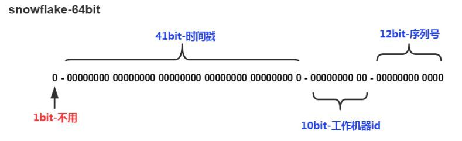

# 分布式id生成策略
## 分布式id的特征
- 全局唯一
- 高可用

## 设计方案
### UUID

> UUID 是 通用唯一识别码（Universally Unique Identifier）的缩写，是一种软件建构的标准，亦为[开放软件基金会](https://baike.baidu.com/item/开放软件基金会/1223731)组织在[分布式计算](https://baike.baidu.com/item/分布式计算/85448)环境领域的一部分。其目的，是让分布式系统中的所有元素，都能有唯一的辨识信息，而不需要通过中央控制端来做辨识信息的指定。如此一来，每个人都可以创建不与其它人冲突的UUID。在这样的情况下，就不需考虑数据库创建时的名称重复问题。

#### Java中的UUID

`java.util.UUID`

四种生成策略

1. Time-based，基于时间计算

   ```java
   UUID uuid = Generators.timeBasedGenerator().generate();
   ```

   - 通过UUID的高低位来进行构造

   ```java
       public UUID generate() {
           long rawTimestamp = this._timer.getTimestamp();
           int clockHi = (int)(rawTimestamp >>> 32);
           int clockLo = (int)rawTimestamp;
           int midhi = clockHi << 16 | clockHi >>> 16;
           midhi &= -61441;
           midhi |= 4096;
           long midhiL = (long)midhi;
           midhiL = midhiL << 32 >>> 32;
           long l1 = (long)clockLo << 32 | midhiL;
           return new UUID(l1, this._uuidL2);
       }
   ```

2. DCE security，DCE安全的uuid

3. Name-based，基于名字的uuid

   ```java
   UUID uuid = UUID.nameUUIDFromBytes("huifer".getBytes());
   System.out.println(uuid);
   ```

4. Randomly generated，随机数uuid生成策略

   ```java
   UUID uuid = UUID.randomUUID();
   System.out.println(uuid.toString());
   ```

#### 推荐库

[java-uuid-generator](https://github.com/cowtowncoder/java-uuid-generator)

```xml
<dependency>
  <groupId>com.fasterxml.uuid</groupId>
  <artifactId>java-uuid-generator</artifactId>
  <version>3.2.0</version>
</dependency>

```

#### 优点

1. 本地生产没有I/O
2. 无序性

#### 缺点

1. 128位二进制过长存储只能用string
2. 不能体现有序

### 基于数据库

#### 步长方案

> 假设有3个数据库a、b、c，步长位数据库数量，a的起始id=0,b的起始id=1,c的起始id=2\
>
> a,0,3,6...
>
> b,1,4,7...
>
> c,2,5,8...
>
> `id = 起始id+步长x操作次数`

```java
	public static void main(String[] args) {
		String[] strings = {"A", "B", "C"};
		int step = strings.length;
		int operationNumber = 10;

		for (int i = 0; i < strings.length; i++) {
			for (int j = 0; j < operationNumber; j++) {
				String dbName = strings[i];
				int id = i + step * j;
				System.out.println(String.format("数据库%s,第%s次操作,id=%s", dbName, j, id));
			}
		}
	}
```

#### Flicker方案

> 通过数据库的自增长id来得到id 

```mysql
CREATE TABLE `tb_seqno` (
  `a` varchar(1) NOT NULL,
  `id` int(11) NOT NULL AUTO_INCREMENT,
  PRIMARY KEY (`id`),
  UNIQUE KEY `uk_a` (`a`)
) ENGINE=MyISAM AUTO_INCREMENT=25 DEFAULT CHARSET=utf8
```

实际使用中需要连续执行两条sql，一条插入语句一条获取最后id语句

```mysql
REPLACE INTO tb_seqno(`a`) VALUE('a');
select last_insert_id();
```

### 基于redis(incr)

```java
Long collectionId = redis.opsForValue().increment(RedisKey.OTC_COLLECTION_ID_KEY, 1L);
```

```java
Jedis jedis = new Jedis();
Long incr = jedis.incrBy("test-inrc", 1L);
Long incr1 = jedis.incr("test-inrc");
Long incr2 = jedis.incrBy("test-inrc", 1L);
Long incr3 = jedis.incr("test-inrc");
String s = jedis.get("test-inrc");
System.out.println(s);
```

#### 推荐库

[redis-id-generator](https://github.com/hengyunabc/redis-id-generator)

### Snowflake


41bit可以存储` (1L << 41) / (1000L * 60 * 60 * 24 * 365) = 69`年(毫秒级别)

```java
package com.huifer.idgen;

/**
 * @author: wang
 * @description:
 */
public class SnowFlake {

	/**
	 * 开始时间戳
	 */
	public static final long START_STMP = 1546272000000L;
	/**
	 * 序列号位数
	 */
	public static final long SEQUENCE_BIT = 12L;
	/**
	 * 机器表示位数
	 */
	public static final long MACHINE_BIT = 5L;
	/**
	 * 数据中心位数
	 */
	public static final long DATACENTER_BIT = 5L;

	/**
	 * 序列号最大值
	 */
	public static final long MAX_SEQUENCE_NUM = -1L ^ (-1L << SEQUENCE_BIT);
	/**
	 * 机器最大值
	 */
	public static final long MAX_MACHINE_NUM = -1L ^ (-1L << MACHINE_BIT);
	/**
	 * 数据中心最大值
	 */
	public static final long MAX_DATACENTER_NUM = -1L ^ (-1L << DATACENTER_BIT);
	/**
	 * 机器左移
	 */
	public static final long MAXCHINE_LEFT = SEQUENCE_BIT;
	/**
	 * 数据中心左移
	 */
	public static final long DATACENTER_LEFT = SEQUENCE_BIT + MACHINE_BIT;
	/**
	 * 时间戳左移
	 */
	public final static long TIMESTMP_LEFT = DATACENTER_LEFT + DATACENTER_BIT;


	/**
	 * 数据中心id
	 */
	private long dataCenterId;
	/**
	 * 机器id
	 */
	private long machineId;
	/**
	 * 序列号
	 */
	private long sequence = 0L;
	/**
	 * 最后一次时间戳
	 */
	private long lastStmp = -1L;

	public SnowFlake(long dataCenterId, long machineId) {
		if (dataCenterId > MAX_DATACENTER_NUM || dataCenterId < 0) {
			throw new IllegalArgumentException();
		}

		if (machineId > MAX_MACHINE_NUM || machineId < 0) {
			throw new IllegalArgumentException();
		}
		this.dataCenterId = dataCenterId;
		this.machineId = machineId;
	}


	public synchronized long genId() {
		long curStmp = System.currentTimeMillis();
		if (curStmp < lastStmp) {
			throw new RuntimeException();
		}
		if (curStmp == lastStmp) {
			// 时间戳相同时序列号+1
			sequence = (sequence + 1) & MAX_SEQUENCE_NUM;
			if (sequence == 0L) {
				curStmp = getNextMill();
			}
		} else {
			sequence = 0L;
		}
		lastStmp = curStmp;
		return (curStmp - START_STMP)
				<< TIMESTMP_LEFT//时间戳
				| dataCenterId << DATACENTER_LEFT//数据中心
				| machineId << MAXCHINE_LEFT // 机器标识
				| sequence//序列号
				;

	}


	private long getNextMill() {
		long mill = System.currentTimeMillis();
		while (mill <= lastStmp) {
			mill = System.currentTimeMillis();
		}
		return mill;
	}


	public static void main(String[] args) {
		long dataCenterId = 2L;
		long machineId = 3L;
		long sequence = 4L;
		SnowFlake snowFlake = new SnowFlake(dataCenterId, machineId);
		for (int i = 0; i < (1<<30); i++) {
			long genId = snowFlake.genId();
			System.out.println(genId);
		}
	}
}
```

