# activemq

## 安装
官网下载: http://activemq.apache.org/components/classic/download/

```shell
tar -zxvf apache-activemq-5.15.9-bin.tar.gz apache-activemq-5.15.9/
cd bin
sh activemq start

```

- 访问监控平台

  <http://192.168.1.108:8161/>

- 账号密码设置

  `vim conf/jetty.xml`

  ```xml
  <bean id="adminSecurityConstraint" class="org.eclipse.jetty.util.security.Constraint">
      <property name="name" value="BASIC" />
      <property name="roles" value="admin" />
       <!-- set authenticate=false to disable login -->
      <property name="authenticate" value="true" />
  </bean>
  ```

  将`authenticate`属性修改为`true`

  - `vim conf/jetty-realm.properties `

    ```properties
    # Defines users that can access the web (console, demo, etc.)
    # username: password [,rolename ...]
    admin: admin, admin
    user: user, user
    
    ```

    - 密码为admin，admin

- 访问

  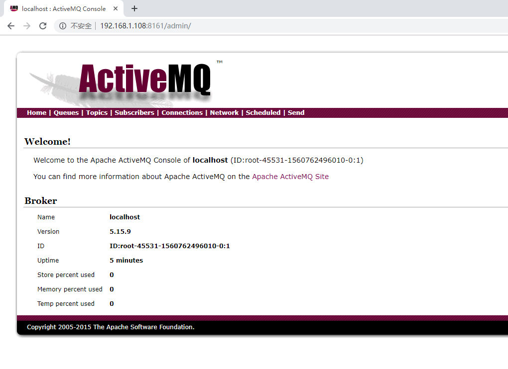


## Java Message Service（JMS）

> 
>
> JMS即[Java消息服务](https://baike.baidu.com/item/Java消息服务)（Java Message Service）应用程序接口，是一个[Java平台](https://baike.baidu.com/item/Java平台)中关于面向[消息中间件](https://baike.baidu.com/item/消息中间件/5899771)（MOM）的[API](https://baike.baidu.com/item/API/10154)，用于在两个应用程序之间，或[分布式系统](https://baike.baidu.com/item/分布式系统/4905336)中发送消息，进行异步通信。Java消息服务是一个与具体平台无关的API，绝大多数MOM提供商都对JMS提供支持。
>
> JMS是一种与厂商无关的 API，用来访问收发系统消息，它类似于[JDBC](https://baike.baidu.com/item/JDBC)(Java Database Connectivity)。这里，JDBC 是可以用来访问许多不同关系数据库的 API，而 JMS 则提供同样与厂商无关的访问方法，以访问消息收发服务。许多厂商都支持 JMS，包括 IBM 的 MQSeries、BEA的 Weblogic JMS service和 Progress 的 SonicMQ。 JMS 使您能够通过消息收发服务（有时称为消息中介程序或路由器）从一个 JMS 客户机向另一个 JMS客户机发送消息。消息是 JMS 中的一种类型对象，由两部分组成：报头和消息主体。报头由路由信息以及有关该消息的元数据组成。消息主体则携带着应用程序的数据或有效负载。根据有效负载的类型来划分，可以将消息分为几种类型，它们分别携带：简单文本(TextMessage)、可序列化的对象 (ObjectMessage)、属性集合 (MapMessage)、字节流 (BytesMessage)、原始值流 (StreamMessage)，还有无有效负载的消息 (Message)。
>
> 链接地址：<https://baike.baidu.com/item/JMS/2836691?fr=aladdin>


- jms是一个API

[**JMS规范**](<http://doc.yonyoucloud.com/doc/JMS2CN/index.html>)


## 队列案例

- 依赖

  ```xml
  <dependency>
    <groupId>org.apache.activemq</groupId>
    <artifactId>activemq-all</artifactId>
    <version>5.15.9</version>
  </dependency>
  ```

- 生产端代码

  ```java
  public class JMSQueueProducer {
  
      public static void main(String[] args) throws Exception {
          ConnectionFactory connectionFactory = new ActiveMQConnectionFactory(
                  "tcp://192.168.1.108:61616");
          Connection connection = connectionFactory.createConnection();
          // 启动连接
          connection.start();
          // 创建会话
          Session session = connection.createSession(true, Session.AUTO_ACKNOWLEDGE);
          Queue testQueue = session.createQueue("testQueue");
          MessageProducer producer = session.createProducer(testQueue);
          TextMessage message = session.createTextMessage("hello activemq");
          producer.send(message);
          session.commit();
          session.close();
          connection.close();
  
      }
  
  }
  ```

  - 运行代码

    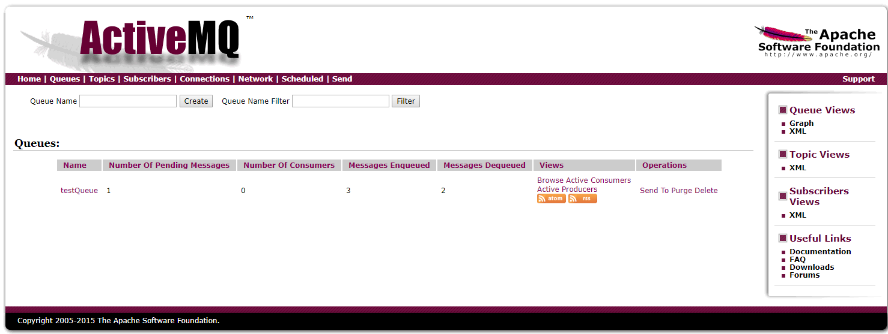

- 表头说明

  - Name
    - 队列名称
  - Number Of Pending Messages
    - 等待消费的消息，这个是当前未出队列的数量
  - Number Of Consumers 
    - 消费者数量
  - Messages Enqueued
    - 进入队列的消息；（ 这个数量只增不减，重启acmq后会清零）
  - Messages Dequeued
    - 出了队列的消息  可以理解为是消费这消费掉的数量 （重启acmq后会清零）

- 消费端代码

  ```java
  public class JMSQueueReceiver {
  
      public static void main(String[] args) throws JMSException {
          ConnectionFactory connectionFactory = new ActiveMQConnectionFactory(
                  "tcp://192.168.1.108:61616");
          Connection connection = connectionFactory.createConnection();
          connection.start();
          Session session = connection.createSession(true, Session.AUTO_ACKNOWLEDGE);
          Queue testQueue = session.createQueue("testQueue");
          MessageConsumer consumer = session.createConsumer(testQueue);
          TextMessage msg = (TextMessage) consumer.receive();
          System.out.println(msg.getText());
  
          session.commit();
          session.close();
  
      }
  }
  ```

  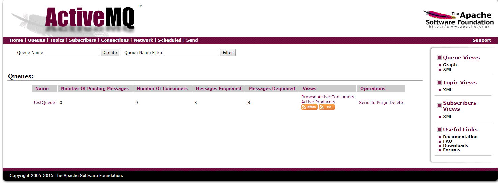

- 消费端监听器

  ```java
  public class JMSQueueListenerReceiver {
  
      public static void main(String[] args) throws JMSException {
          ConnectionFactory connectionFactory = new ActiveMQConnectionFactory(
                  "tcp://192.168.1.108:61616");
          Connection connection = connectionFactory.createConnection();
          connection.start();
          Session session = connection.createSession(true, Session.AUTO_ACKNOWLEDGE);
          Queue testQueue = session.createQueue("testQueue");
  
          MessageConsumer consumer = session.createConsumer(testQueue);
          MessageListener messageListener = new MessageListener() {
              @Override
              public void onMessage(Message message) {
                  try {
                      System.out.println(((TextMessage) message).getText());
                  } catch (JMSException e) {
                      e.printStackTrace();
                  }
              }
          };
  
          while (true) {
              consumer.setMessageListener(messageListener);
          }
  
      }
  }
  ```


## 订阅案例

- 生产端

  ```java
  public class JMSTopicProducer {
  
      public static void main(String[] args) throws Exception {
          ConnectionFactory connectionFactory = new ActiveMQConnectionFactory(
                  "tcp://192.168.1.108:61616");
          Connection connection = connectionFactory.createConnection();
          // 启动连接
          connection.start();
          // 创建会话
          Session session = connection.createSession(true, Session.AUTO_ACKNOWLEDGE);
          Topic testTopic = session.createTopic("testTopic");
  
          MessageProducer producer = session.createProducer(testTopic);
  
          TextMessage hello_topic = session.createTextMessage("hello TOC");
          producer.send(hello_topic);
  
          session.commit();
          session.close();
          connection.close();
  
      }
  }
  ```

- 消费端

  ```java
  public class JMSTopicReceiver {
  
      public static void main(String[] args) throws JMSException {
          ConnectionFactory connectionFactory = new ActiveMQConnectionFactory(
                  "tcp://192.168.1.108:61616");
          Connection connection = connectionFactory.createConnection();
          connection.start();
          Session session = connection.createSession(true, Session.AUTO_ACKNOWLEDGE);
          Destination destination = session.createTopic("testTopic");
          MessageConsumer consumer = session.createConsumer(destination);
          TextMessage msg = (TextMessage) consumer.receive();
          System.out.println(msg.getText());
  
          session.commit();
          session.close();
          consumer.close();
  
      }
  }
  ```

- **注意**
  
  - 需要将消费端率先启动才会接收到消息

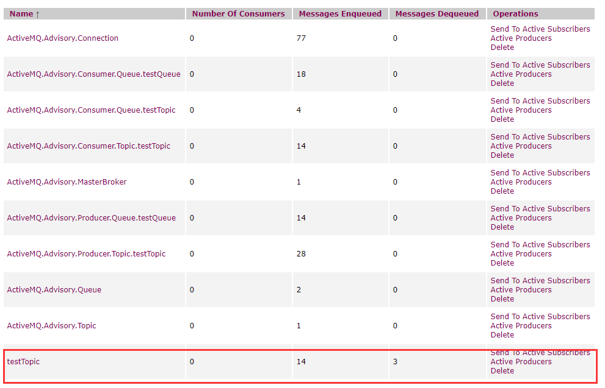

## 持久化消息订阅

- 订阅端

```java
public class JMSPersistenceTopicReceiver {

    public static final String PS = "Persistence-1";

    public static void main(String[] args) throws JMSException {
        ConnectionFactory connectionFactory = new ActiveMQConnectionFactory(
                "tcp://192.168.1.108:61616");
        Connection connection = connectionFactory.createConnection();
        connection.setClientID(PS);
        connection.start();
        Session session = connection.createSession(true, Session.AUTO_ACKNOWLEDGE);
        Topic testTopic = session.createTopic("testTopic");
        MessageConsumer consumer = session.createDurableSubscriber(testTopic,PS);
        TextMessage msg = (TextMessage) consumer.receive();
        System.out.println(msg.getText());

        session.commit();
        session.close();
        consumer.close();
    }
}
```

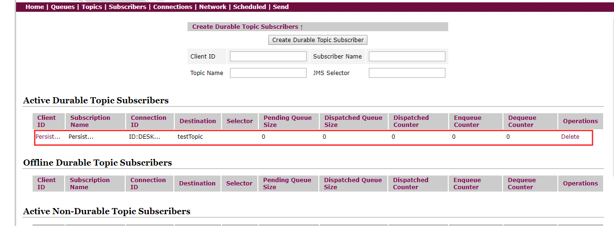

- 生产端

  ```java
  public class JMSTopicProducer {
  
      public static void main(String[] args) throws Exception {
          ConnectionFactory connectionFactory = new ActiveMQConnectionFactory(
                  "tcp://192.168.1.108:61616");
          Connection connection = connectionFactory.createConnection();
          // 启动连接
          connection.start();
          // 创建会话
          Session session = connection.createSession(true, Session.AUTO_ACKNOWLEDGE);
          Topic testTopic = session.createTopic("testTopic");
  
          MessageProducer producer = session.createProducer(testTopic);
  
         // 消息持久化设置 producer.setDeliveryMode(DeliveryMode.PERSISTENT);
          
          TextMessage hello_topic = session.createTextMessage("hello topic");
          producer.send(hello_topic);
  
          session.commit();
          session.close();
          connection.close();
  
      }
  }
  ```

- 启动`JMSPersistenceTopicReceiver` 关闭`JMSPersistenceTopicReceiver`,启动`JMSTopicProducer` ，启动`JMSPersistenceTopicReceiver`消息正常接收


## 消息确认方式

### session

```java
Session createSession(boolean transacted, int acknowledgeMode)
    throws JMSException;
```

- 通过第一个参数来确认事务性会话，非事务性会话

- 第一个参数transacted
  - true才有事务概念
  - false没有事务概念
- 只有执行了`commit`才会上传到activeMQ

- 事务针对生产端

  `session.commit();` 消息确认

  `session.rollback();`消息回滚，重新提交

- 事务针对消费端

  `session.commit();` 消息被确认接收

  `session.rollback();`消息没有接收，重新处理

- `commit` 和`rollback` 执行任意一个事务结束


## 点对点PointToPoint

- 一对一形式，发送消息的客户端将消息放入指定的队列（queue）中，消息接收端从这个队列中提取消息
- session关闭时，一部分消息被收取但是没有确认，消费端在下一次连接相同队列时这些没有确认的消息还会被再次接收
- 持久化消息会被长期保存直到消息被签收


## 发布订阅Publish/Subscribe

- 一对多形式，发送消息的客户端将消息放入主题（topic）中，主题将这个消息推送给每个订阅当前主题的消费端
- 持久化订阅的使用场景：必须确认接收所有消息


## 消息发送

### 默认值

1. **非持久化消息异步发送**
2. **非持久化消息+非事务模式下同步发送**
3. **开启事务时，消息异步发送**


### 消息异步发送设置

- url设置`jms.userAsynSend=true`
	```java
	ConnectionFactory connectionFactory = new ActiveMQConnectionFactory(
	        "tcp://192.168.1.108:61616?jms.userAsynSend=true`");
	```
- `setAlwaysSyncSend`属性
    ```java
    ConnectionFactory connectionFactory = new ActiveMQConnectionFactory(
            "tcp://192.168.1.108:61616");
    ((ActiveMQConnectionFactory)connectionFactory).setAlwaysSyncSend(true);
    ```


### send()

```java
public class JMSQueueProducer {

    public static void main(String[] args) throws Exception {
        ConnectionFactory connectionFactory = new ActiveMQConnectionFactory(
                "tcp://192.168.1.108:61616");
        Connection connection = connectionFactory.createConnection();
        // 启动连接
        connection.start();
        // 创建会话
        Session session = connection.createSession(true, Session.AUTO_ACKNOWLEDGE);
        Queue testQueue = session.createQueue("testQueue");
        MessageProducer producer = session.createProducer(testQueue);
        TextMessage message = session.createTextMessage("hello activemq");
        producer.send(message);
        session.commit();
        session.close();
        connection.close();

    }

}
```

`producer.send(message);`分析目标

- `org.apache.activemq.ActiveMQMessageProducerSupport#send(javax.jms.Message)`
  - `org.apache.activemq.ActiveMQMessageProducer#send(javax.jms.Destination, javax.jms.Message, int, int, long)`
    - `org.apache.activemq.ActiveMQMessageProducer#send(javax.jms.Destination, javax.jms.Message, int, int, long, org.apache.activemq.AsyncCallback)`
      - `org.apache.activemq.ActiveMQSession#send`


```java
public void send(Destination destination, Message message, int deliveryMode, int priority, long timeToLive, AsyncCallback onComplete) throws JMSException {
    checkClosed(); // 判断是否开启	
    if (destination == null) {
        if (info.getDestination() == null) {
            throw new UnsupportedOperationException("A destination must be specified.");
        }
        throw new InvalidDestinationException("Don't understand null destinations");
    }

    ActiveMQDestination dest;
    if (destination.equals(info.getDestination())) {
        dest = (ActiveMQDestination)destination; 
    } else if (info.getDestination() == null) {
        dest = ActiveMQDestination.transform(destination);
    } else {
        throw new UnsupportedOperationException("This producer can only send messages to: " + this.info.getDestination().getPhysicalName());
    }
    if (dest == null) {
        throw new JMSException("No destination specified");
    }

    if (transformer != null) {
        Message transformedMessage = transformer.producerTransform(session, this, message);
        if (transformedMessage != null) {
            message = transformedMessage;
        }
    }

    if (producerWindow != null) {
        try {
            producerWindow.waitForSpace(); // 等待
        } catch (InterruptedException e) {
            throw new JMSException("Send aborted due to thread interrupt.");
        }
    }
	// 正真的发送
    this.session.send(this, dest, message, deliveryMode, priority, timeToLive, producerWindow, sendTimeout, onComplete);

    stats.onMessage();
}
```


```java
protected void send(ActiveMQMessageProducer producer, ActiveMQDestination destination, Message message, int deliveryMode, int priority, long timeToLive,
                    MemoryUsage producerWindow, int sendTimeout, AsyncCallback onComplete) throws JMSException {

    checkClosed();
    if (destination.isTemporary() && connection.isDeleted(destination)) {
        throw new InvalidDestinationException("Cannot publish to a deleted Destination: " + destination);
    }
    synchronized (sendMutex) {// session 同步锁
        // tell the Broker we are about to start a new transaction
        doStartTransaction(); // 开启事务
        TransactionId txid = transactionContext.getTransactionId();
        long sequenceNumber = producer.getMessageSequence();

        //Set the "JMS" header fields on the original message, see 1.1 spec section 3.4.11
        message.setJMSDeliveryMode(deliveryMode);
        long expiration = 0L;
        if (!producer.getDisableMessageTimestamp()) {
            long timeStamp = System.currentTimeMillis();
            message.setJMSTimestamp(timeStamp);
            if (timeToLive > 0) {
                expiration = timeToLive + timeStamp;
            }
        }
        message.setJMSExpiration(expiration);
        message.setJMSPriority(priority);
        message.setJMSRedelivered(false);

        // transform to our own message format here
        ActiveMQMessage msg = ActiveMQMessageTransformation.transformMessage(message, connection);
        msg.setDestination(destination);
        msg.setMessageId(new MessageId(producer.getProducerInfo().getProducerId(), sequenceNumber));

        // Set the message id.
        if (msg != message) {
            message.setJMSMessageID(msg.getMessageId().toString());
            // Make sure the JMS destination is set on the foreign messages too.
            message.setJMSDestination(destination);
        }
        //clear the brokerPath in case we are re-sending this message
        msg.setBrokerPath(null);

        msg.setTransactionId(txid);
        if (connection.isCopyMessageOnSend()) {
            msg = (ActiveMQMessage)msg.copy();
        }
        msg.setConnection(connection);
        msg.onSend();
        msg.setProducerId(msg.getMessageId().getProducerId());
        if (LOG.isTraceEnabled()) {
            LOG.trace(getSessionId() + " sending message: " + msg);
        }
        
        
        
        if (onComplete==null && sendTimeout <= 0 && !msg.isResponseRequired() && !connection.isAlwaysSyncSend() && (!msg.isPersistent() || connection.isUseAsyncSend() || txid != null)) { // 同步发送和异步发送的判断逻辑
            this.connection.asyncSendPacket(msg);
            if (producerWindow != null) {
                // Since we defer lots of the marshaling till we hit the
                // wire, this might not
                // provide and accurate size. We may change over to doing
                // more aggressive marshaling,
                // to get more accurate sizes.. this is more important once
                // users start using producer window
                // flow control.
                int size = msg.getSize();
                producerWindow.increaseUsage(size);
            }
        } else {
            if (sendTimeout > 0 && onComplete==null) {
                this.connection.syncSendPacket(msg,sendTimeout);
            }else {
                this.connection.syncSendPacket(msg, onComplete);
            }
        }

    }
}
```

- 同步和异步发送的判断

  ```java
          if (onComplete==null && sendTimeout <= 0 && !msg.isResponseRequired() && !connection.isAlwaysSyncSend() && (!msg.isPersistent() || connection.isUseAsyncSend() || txid != null)) {}
  ```

  - `onComplete==null`
    - 回调方法
  - `sendTimeout`
    - 发送时间<=0
  - `!msg.isResponseRequired()`
    - 消息不需要反馈
  - `!connection.isAlwaysSyncSend()`
    - 是否异步发送
  - `!msg.isPersistent()`
    - 消息非持久化

### 异步发送

`this.connection.asyncSendPacket(msg);`

```java
public void asyncSendPacket(Command command) throws JMSException {
    if (isClosed()) {
        throw new ConnectionClosedException();
    } else {
        doAsyncSendPacket(command);
    }
}
    private void doAsyncSendPacket(Command command) throws JMSException {
        try {
            this.transport.oneway(command);
        } catch (IOException e) {
            throw JMSExceptionSupport.create(e);
        }
    }
```

- `transport`是什么

  - > ```java
    > ConnectionFactory connectionFactory = new ActiveMQConnectionFactory(
    >         "tcp://192.168.1.108:61616");
    > Connection connection = connectionFactory.createConnection();
    > ```
    >
    > - `org.apache.activemq.ActiveMQConnectionFactory#createActiveMQConnection(java.lang.String, java.lang.String)`

  - ```java
    protected ActiveMQConnection createActiveMQConnection(String userName, String password) throws JMSException {
         Transport transport = createTransport();
    }
    
    protected Transport createTransport() throws JMSException {
            try {
                URI connectBrokerUL = brokerURL;
                String scheme = brokerURL.getScheme();
                if (scheme == null) {
                    throw new IOException("Transport not scheme specified: [" + brokerURL + "]");
                }
                if (scheme.equals("auto")) {
                    connectBrokerUL = new URI(brokerURL.toString().replace("auto", "tcp"));
                } else if (scheme.equals("auto+ssl")) {
                    connectBrokerUL = new URI(brokerURL.toString().replace("auto+ssl", "ssl"));
                } else if (scheme.equals("auto+nio")) {
                    connectBrokerUL = new URI(brokerURL.toString().replace("auto+nio", "nio"));
                } else if (scheme.equals("auto+nio+ssl")) {
                    connectBrokerUL = new URI(brokerURL.toString().replace("auto+nio+ssl", "nio+ssl"));
                }
    
                return TransportFactory.connect(connectBrokerUL);
            } catch (Exception e) {
                throw JMSExceptionSupport.create("Could not create Transport. Reason: " + e, e);
            }
        }
        
        
    ```

  - `return TransportFactory.connect(connectBrokerUL);`

    ```java
    public static Transport connect(URI location) throws Exception {
        TransportFactory tf = findTransportFactory(location);
        return tf.doConnect(location);
    }
    ```

    - `findTransportFactory`

    ```java
    public static TransportFactory findTransportFactory(URI location) throws IOException {
        String scheme = location.getScheme();
        if (scheme == null) {
            throw new IOException("Transport not scheme specified: [" + location + "]");
        }
        TransportFactory tf = TRANSPORT_FACTORYS.get(scheme);
        if (tf == null) {
            // Try to load if from a META-INF property.
            try {
                tf = (TransportFactory)TRANSPORT_FACTORY_FINDER.newInstance(scheme);
                TRANSPORT_FACTORYS.put(scheme, tf);
            } catch (Throwable e) {
                throw IOExceptionSupport.create("Transport scheme NOT recognized: [" + scheme + "]", e);
            }
        }
        return tf;
    }
    ```

    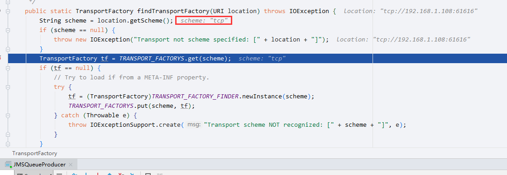

    

  - `doConnect`

    `org.apache.activemq.transport.TransportFactory#doConnect(java.net.URI)`

     **这个地方返回rc ，而不是transport**

    ```java
    public Transport doConnect(URI location) throws Exception {
        try {
            Map<String, String> options = new HashMap<String, String>(URISupport.parseParameters(location));
            if( !options.containsKey("wireFormat.host") ) {
                options.put("wireFormat.host", location.getHost());
            }
            WireFormat wf = createWireFormat(options);
            Transport transport = createTransport(location, wf);
            Transport rc = configure(transport, wf, options);
            //remove auto
            IntrospectionSupport.extractProperties(options, "auto.");
    
            if (!options.isEmpty()) {
                throw new IllegalArgumentException("Invalid connect parameters: " + options);
            }
            return rc;
        } catch (URISyntaxException e) {
            throw IOExceptionSupport.create(e);
        }
    }
    ```

  - `Transport transport = createTransport(location, wf);`

    前面确认了这是一个tcp

    `org.apache.activemq.transport.tcp.TcpTransportFactory#createTransport(java.net.URI, org.apache.activemq.wireformat.WireFormat)`

    ```java
    @Override
    protected Transport createTransport(URI location, WireFormat wf) throws UnknownHostException, IOException {
        URI localLocation = null;
        String path = location.getPath();
        // see if the path is a local URI location
        if (path != null && path.length() > 0) {
            int localPortIndex = path.indexOf(':');
            try {
                Integer.parseInt(path.substring(localPortIndex + 1, path.length()));
                String localString = location.getScheme() + ":/" + path;
                localLocation = new URI(localString);
            } catch (Exception e) {
                LOG.warn("path isn't a valid local location for TcpTransport to use", e.getMessage());
                if(LOG.isDebugEnabled()) {
                    LOG.debug("Failure detail", e);
                }
            }
        }
        // 创建TCP的socket org.apache.activemq.transport.tcp.TcpTransportFactory#createSocketFactory
        SocketFactory socketFactory = createSocketFactory();
        // org.apache.activemq.transport.tcp.TcpTransportFactory#createTcpTransport
        return createTcpTransport(wf, socketFactory, location, localLocation);
    }
    ```

  - `org.apache.activemq.transport.tcp.TcpTransport`

    ```java
    public TcpTransport(WireFormat wireFormat, SocketFactory socketFactory, URI remoteLocation,
                        URI localLocation) throws UnknownHostException, IOException {
        this.wireFormat = wireFormat;
        this.socketFactory = socketFactory;
        try {
            this.socket = socketFactory.createSocket();
        } catch (SocketException e) {
            this.socket = null;
        }
        this.remoteLocation = remoteLocation;
        this.localLocation = localLocation;
        this.initBuffer = null;
        setDaemon(false);
    }
    ```

  - `rc`具体内容

    ```java
    Transport rc = configure(transport, wf, options);
    ```

    ```java
    public Transport configure(Transport transport, WireFormat wf, Map options) throws Exception {
        transport = compositeConfigure(transport, wf, options);
    
        transport = new MutexTransport(transport);
        transport = new ResponseCorrelator(transport);
    	
        return transport;
    }
    ```

  - transport = `ResponseCorrelator(MutexTransport(transport))`

- `this.transport.oneway(command);`

  ```java
  private void doAsyncSendPacket(Command command) throws JMSException {
      try {
          this.transport.oneway(command);
      } catch (IOException e) {
          throw JMSExceptionSupport.create(e);
      }
  }
  ```

  - `org.apache.activemq.transport.tcp.TcpTransport#oneway`

    发送消息

    ```java
    @Override
    public void oneway(Object command) throws IOException {
        checkStarted();
        wireFormat.marshal(command, dataOut);
        dataOut.flush();
    }
    ```


### 同步发送

```java
if (sendTimeout > 0 && onComplete==null) {
                    this.connection.syncSendPacket(msg,sendTimeout);
                }else {
                    this.connection.syncSendPacket(msg, onComplete);
                }
```


```java
public void syncSendPacket(final Command command, final AsyncCallback onComplete) throws JMSException {
    if(onComplete==null) {
        syncSendPacket(command);
    } else {
        if (isClosed()) {
            throw new ConnectionClosedException();
        }
        try {
            this.transport.asyncRequest(command, new ResponseCallback() {
                @Override
                public void onCompletion(FutureResponse resp) {
                    Response response;
                    Throwable exception = null;
                    try {
                        response = resp.getResult();
                        if (response.isException()) {
                            ExceptionResponse er = (ExceptionResponse)response;
                            exception = er.getException();
                        }
                    } catch (Exception e) {
                        exception = e;
                    }
                    if (exception != null) {
                        if ( exception instanceof JMSException) {
                            onComplete.onException((JMSException) exception);
                        } else {
                            if (isClosed() || closing.get()) {
                                LOG.debug("Received an exception but connection is closing");
                            }
                            JMSException jmsEx = null;
                            try {
                                jmsEx = JMSExceptionSupport.create(exception);
                            } catch(Throwable e) {
                                LOG.error("Caught an exception trying to create a JMSException for " +exception,e);
                            }
                            // dispose of transport for security exceptions on connection initiation
                            if (exception instanceof SecurityException && command instanceof ConnectionInfo){
                                try {
                                    forceCloseOnSecurityException(exception);
                                } catch (Throwable t) {
                                    // We throw the original error from the ExceptionResponse instead.
                                }
                            }
                            if (jmsEx != null) {
                                onComplete.onException(jmsEx);
                            }
                        }
                    } else {
                        onComplete.onSuccess();
                    }
                }
            });
        } catch (IOException e) {
            throw JMSExceptionSupport.create(e);
        }
    }
}
```

- `response = resp.getResult();`

  ```java
  public Response getResult() throws IOException {
      boolean hasInterruptPending = Thread.interrupted();
      try {
          return responseSlot.take();
      } catch (InterruptedException e) {
          hasInterruptPending = false;
          throw dealWithInterrupt(e);
      } finally {
          if (hasInterruptPending) {
              Thread.currentThread().interrupt();
          }
      }
  }
  
      public E take() throws InterruptedException {
          final ReentrantLock lock = this.lock;
          lock.lockInterruptibly();
          try {
              while (count == 0)
                  notEmpty.await(); 
              return dequeue();
          } finally {
              lock.unlock();
          }
      }
  ```


## 消息消费

- `receive`
- `javax.jms.MessageListener`

两者不能共存

原因如下

```java
@Override
public Message receive() throws JMSException {
    checkClosed();
    checkMessageListener();

    sendPullCommand(0);
    MessageDispatch md = dequeue(-1);
    if (md == null) {
        return null;
    }

    beforeMessageIsConsumed(md);
    afterMessageIsConsumed(md, false);

    return createActiveMQMessage(md);
}

    protected void checkMessageListener() throws JMSException {
        session.checkMessageListener();
    }

    public void checkMessageListener() throws JMSException {
        if (messageListener != null) {
            throw new IllegalStateException("Cannot synchronously receive a message when a MessageListener is set");
        }
        for (Iterator<ActiveMQMessageConsumer> i = consumers.iterator(); i.hasNext();) {
            ActiveMQMessageConsumer consumer = i.next();
            if (consumer.hasMessageListener()) {
                throw new IllegalStateException("Cannot synchronously receive a message when a MessageListener is set");
            }
        }
    }
```

- 执行流程继续

  `sendPullCommand(0);`

  ```java
  public void asyncSendPacket(Command command) throws JMSException {
      connection.asyncSendPacket(command);
  }
  ```

  后续代码和消息发送相同


## 消息配置参数

- `activemq.xml`文件

  ```xml
        <systemUsage>
          <systemUsage>
              <memoryUsage>
                  <memoryUsage percentOfJvmHeap="70" />
              </memoryUsage>
              <storeUsage>
                  <storeUsage limit="100 gb"/>
              </storeUsage>
              <tempUsage>
                  <tempUsage limit="50 gb"/>
              </tempUsage>
          </systemUsage>
      </systemUsage>
  ```

  - memoryUsage
    - 可用百分比
  - storeUsage
    - 可用磁盘空间
  - tempUsage
    - 临时存储空间，当到达`memoryUsage`限制值时存入临时存储空间，**非持久化消息才会**

持久化方案

### kahadb，默认

```xml
    <persistenceAdapter>
        <kahaDB directory="${activemq.data}/kahadb"/>
    </persistenceAdapter>

```
- 标签属性

| 属性                             | 默认值        | 含义                                                         |
| -------------------------------- | ------------- | ------------------------------------------------------------ |
| directory                        | activemq-data | 消息文件和日志的存储目录                                     |
| indexWriteBatchSize              | 1000          | 一批索引的大小，当要更新的索引量到达这个值时，更新到消息文件中 |
| indexCacheSize                   | 10000         | 内存中，索引的页大小                                         |
| enableIndexWriteAsync            | FALSE         | 索引是否异步写到消息文件中                                   |
| journalMaxFileLength             | 32mb          | 一个消息文件的大小                                           |
| enableJournalDiskSyncs           | TRUE          | 是否讲非事务的消息同步写入到磁盘                             |
| cleanupInterval                  | 30000         | 清除操作周期，单位ms                                         |
| checkpointInterval               | 5000          | 索引写入到消息文件的周期，单位ms                             |
| ignoreMissingJournalfiles        | FALSE         | 忽略丢失的消息文件，false，当丢失了消息文件，启动异常        |
| checkForCorruptJournalFiles      | FALSE         | 检查消息文件是否损坏，true，检查发现损坏会尝试修复           |
| checksumJournalFiles             | FALSE         | 产生一个checksum，以便能够检测journal文件是否损坏。          |
| archiveDataLogs                  | FALSE         | 当为true时，归档的消息文件被移到directoryArchive,而不是直接删除 |
| directoryArchive                 | null          | 存储被归档的消息文件目录                                     |
| databaseLockedWaitDelay          | 10000         | 在使用负载时，等待获得文件锁的延迟时间，单位ms               |
| maxAsyncJobs                     | 10000         | 同个生产者产生等待写入的异步消息最大量                       |
| concurrentStoreAndDispatchTopics | FALSE         | 当写入消息的时候，是否转发主题消息                           |
| concurrentStoreAndDispatchQueues | TRUE          | 当写入消息的时候，是否转发队列消息                           |
| archiveCorruptedIndex            | FALSE         | 是否归档错误的索引                                           |

### JDBC

修改`activemq.xml`

```xml
    
        <persistenceAdapter>
            <!--<kahaDB directory="${activemq.data}/kahadb"/>-->
            <jdbcPersistenceAdapter dataSource="#mysql-ds" createTablesOnStartup="true" />
        </persistenceAdapter>


<bean id="mysql-ds" class="org.apache.commons.dbcp.BasicDataSource" destroy-method="close">
            <property name="driverClassName" value="com.mysql.jdbc.Driver"/>
            <property name="url" value="jdbc:mysql://192.168.1.215:3306/at15?serverTimezone=UTC&amp;rewriteBatchedStatements=true&amp;useUnicode=true&amp;characterEncoding=utf8"/>
            <property name="username" value="root"/>
            <property name="password" value="root"/>
            <property name="maxActive" value="200"/>
            <property name="poolPreparedStatements" value="true"/>
        </bean>
```

在lib目录下存放

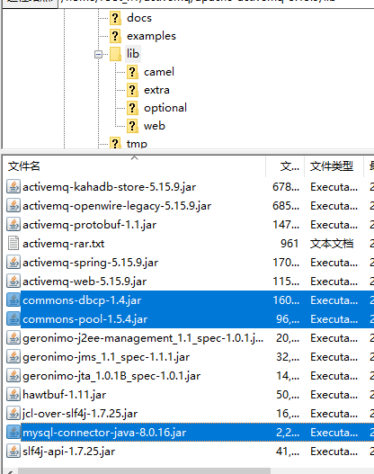

启动后会在数据库中创建3张表格

1. activemq_acks
2. activemq_lock
3. activemq_msgs

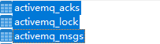

发送一条消息

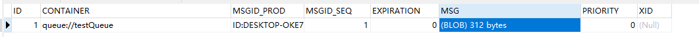


#### **activemq_acks**

- 该表存储订阅关系

1. **CONTAINER**：消息的目的地
2.   **SUB_DEST**：如果是使用static集群，这个字段会有集群其他系统的信息
3. **CLIENT_ID**：每个订阅者客户端ID
4. **SUB_NAME**：订阅者名称
5. **SELECTOR**：选择器，可以选择只消费满足条件的消息。条件可以用自定义属性实现，可支持多属性and和or操作
6.  **LAST_ACKED_ID**：记录消费过的消息的id。
7.  **PRIORITY**：优先级

  

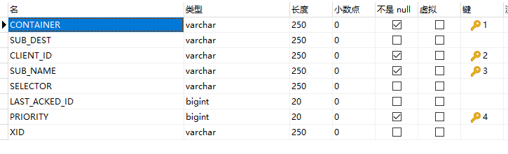

#### activemq_lock

- 用于记录哪一个Broker是Master Broker。这张表只有在集群环境中才会用到，在集群中，只能有一个Broker来接收消息，那么这个Broker就是主Broker，其他的作为从Broker，用来备份等待。

1. TIME：时间
2. BROKER_NAME：Broker名称

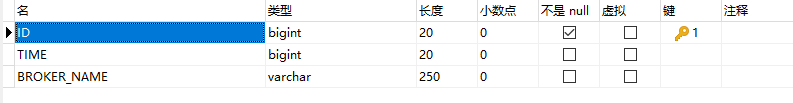

#### activemq_msgs

- 用于存储消息，Topic和Queue消息都会保存在这张表中

1. **CONTAINER**：容器名称

2. **MSGID_PROD**：消息发送者客户端的主键

3. **MSGID_SEQ**：发送消息的顺序，msgid_prod+msg_seq可以组成jms的messageid

4. **EXPIRATION**：消息的过期时间，存储的是从1970-01-01到现在的毫秒数

5. **MSG**：消息本体的java序列化对象的二进制数据

6. **PRIORITY**：优先级，从0-9，数值越大优先级越高

   

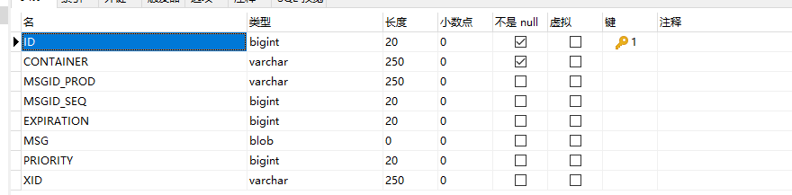


### Memory 内存

> 基于内存的消息存储，内存消息存储主要是存储所有的持久化的消息在内存中。persistent=”false”,表示不设置持久化存储，直接存储到内存中。

```xml
<beans>
    <broker brokerName="test-broker" persistent="false"
        xmlns="http://activemq.apache.org/schema/core">
        <transportConnectors>
            <transportConnector uri="tcp://localhost:61635"/>
        </transportConnectors>
    </broker>
</beans>
```


### LevelDB

```xml
<persistenceAdapter>
    <levelDBdirectory="activemq-data"/>
</persistenceAdapter>
```

### 

### JDBC with activeMq journal

```xml
<persistenceFactory>
    <journalPersistenceAdapterFactory dataSource="#Mysql-DS" dataDirectory="activemq-data"/>
</persistenceFactory>
```


