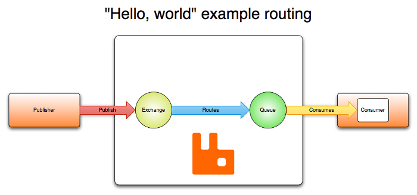

# rabbitmq

## AMQP

> ​	AMQP，即Advanced Message Queuing Protocol,一个提供统一消息服务的应用层标准高级消息队列协议,是应用层协议的一个开放标准,为面向消息的中间件设计。基于此协议的客户端与消息中间件可传递消息，并不受客户端/中间件不同产品，不同的开发语言等条件的限制

## 安装

```shell
 # 解压文件
 xz -d rabbitmq-server-generic-unix-3.7.15.tar.xz 
 tar -xvf rabbitmq-server-generic-unix-3.7.15.tar 

# 添加PATH
sudo vim /etc/profile

export PATH=/home/root_h1/rabbitmq/rabbitmq_server-3.7.15/sbin:$PATH

source /etc/profile

```


- 依赖安装

  ```shell
  sudo dpkg -i esl-erlang_22.0.3-1_ubuntu_xenial_amd64.deb
  
  ```

  ```
  dpkg: error: requested operation requires superuser privilege
  root_h1@root:~/rabbitmq$ sudo dpkg -i esl-erlang_22.0.3-1_ubuntu_xenial_amd64.deb 
  Selecting previously unselected package esl-erlang.
  dpkg: considering removing erlang-base in favour of esl-erlang ...
  dpkg: no, cannot proceed with removal of erlang-base (--auto-deconfigure will help):
   erlang-syntax-tools depends on erlang-base (= 1:20.2.2+dfsg-1ubuntu2) | erlang-base-hipe (= 1:20.2.2+dfsg-1ubuntu2)
    erlang-base is to be removed.
    erlang-base-hipe is not installed.
  
  dpkg: regarding esl-erlang_22.0.3-1_ubuntu_xenial_amd64.deb containing esl-erlang:
   esl-erlang conflicts with erlang-base
    erlang-base (version 1:20.2.2+dfsg-1ubuntu2) is present and installed.
  
  dpkg: error processing archive esl-erlang_22.0.3-1_ubuntu_xenial_amd64.deb (--install):
   conflicting packages - not installing esl-erlang
  Errors were encountered while processing:
   esl-erlang_22.0.3-1_ubuntu_xenial_amd64.deb
  
  ```

  - 继续安装依赖

    ```shell
    sudo apt install erlang-base
    sudo apt install erlang-base-hipe
    ```

  ```
  dpkg: considering removing erlang-base-hipe in favour of esl-erlang ...
  dpkg: no, cannot proceed with removal of erlang-base-hipe (--auto-deconfigure will help):
   erlang-syntax-tools depends on erlang-base (= 1:20.2.2+dfsg-1ubuntu2) | erlang-base-hipe (= 1:20.2.2+dfsg-1ubuntu2)
    erlang-base is not installed but configs remain.
    erlang-base-hipe is to be removed.
  
  dpkg: regarding esl-erlang_22.0.3-1_ubuntu_disco_amd64.deb containing esl-erlang:
   esl-erlang conflicts with erlang-base-hipe
    erlang-base-hipe (version 1:20.2.2+dfsg-1ubuntu2) is present and installed.
  
  dpkg: error processing archive esl-erlang_22.0.3-1_ubuntu_disco_amd64.deb (--install):
   conflicting packages - not installing esl-erlang
  Errors were encountered while processing:
   esl-erlang_22.0.3-1_ubuntu_disco_amd64.deb
  
  ```

  


## 工作模型



