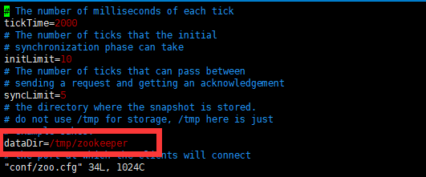
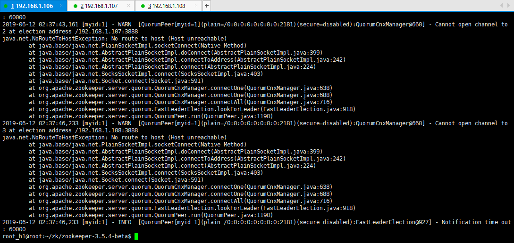
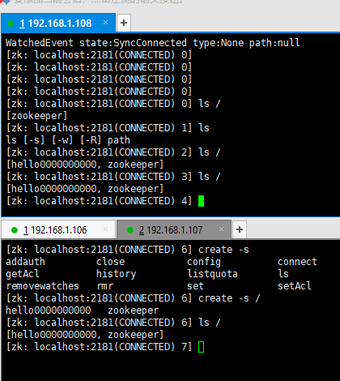
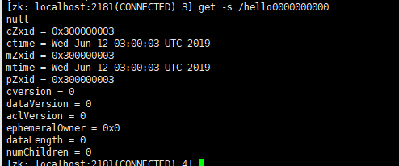

# zookeeper

## 演进

```sequence
用户服务--> 订单服务集群: 调用订单服务
NOTE RIGHT OF 用户服务 :维护多个wsdl
订单服务集群 --> 商品服务: 调用商品服务
NOTE RIGHT OF 商品服务 :维护多个wsdl
```

- 问题
  1. wsdl地址维护
  2. 服务集群的负载均衡
  3. 服务发现确保服务存在

```sequence
用户服务--> 中间件: 调用订单服务
note left of 中间件: 由中间件来确定具体访问哪一个订单服务
中间件 -> 订单服务1:调用订单服务
中间件 -> 订单服务2:调用订单服务
中间件 -> 订单服务3:调用订单服务
note right of 订单服务3: 订单服务内容相同

```

- 中间件数据存储

  ```mermaid
  graph TB
  
  A[/]-->B[/APP]
  B-->X[/user]
  B-->Y[/order]
  B-->Z[/commodity]
  Y-->Y-1[http://...]
  Y-->Y-2[http://...]
  Y-->Y-3[http://...]
  ```

- zookeeper集群

  ```sequence
  用户--> zookeeper_master: 用户请求
  zookeeper_master-> zookeeper_slave1: 子节点1
  zookeeper_master-> zookeeper_slave2: 子节点2
  
  
  
  ```

  负载均衡中轮询或者随机算法会让用户访问的集群不一定是同一个，从而需要满足**数据同步**.

  zookeeper：2PC数据提交


## 安装

```shell
tar -zxvf zookeeper-3.5.4-beta.tar.gz 
cd zookeeper-3.5.4-beta
cp conf/zoo_sample.cfg conf/zoo.cfg
vim conf/zoo.cfg # 按需进行配置修改
# 启动服务
sh bin/zkServer.sh start
# 启动cli
sh bin/zkCli.sh
```

## 节点

```shell
[zk: localhost:2181(CONNECTED) 11] create /oder/wsdl zhangsan
Node does not exist: /oder/wsdl

[zk: localhost:2181(CONNECTED) 12] create /order
Created /order

[zk: localhost:2181(CONNECTED) 13] create /order/wsdl zhangsan
Created /order/wsdl

[zk: localhost:2181(CONNECTED) 14] get /order/wsdl
zhangsan

[zk: localhost:2181(CONNECTED) 20] get -s /order/wsdl
zhangsan
cZxid = 0x573
ctime = Wed Jun 12 08:54:57 CST 2019
mZxid = 0x573
mtime = Wed Jun 12 08:54:57 CST 2019
pZxid = 0x573
cversion = 0
dataVersion = 0
aclVersion = 0
ephemeralOwner = 0x0
dataLength = 8
numChildren = 0
```

### 临时节点

```
 create -e /temp temp
```

### 有序节点

```
[zk: localhost:2181(CONNECTED) 28]  create -s  /seq 1
Created /seq0000000036
[zk: localhost:2181(CONNECTED) 29]  create -s  /seq 2
Created /seq0000000037
[zk: localhost:2181(CONNECTED) 30]

```

## 集群

- 启动三台虚拟机修改zoo.cfg,每一台都需要添加如下内容

  `server.id=ip:port:port`

```
server.1=192.168.1.106:2888:3888
server.2=192.168.1.107:2888:3888
server.3=192.168.1.108:2888:3888
```

- 每一台虚拟机创建dataDir

  

  **不要放在/tem**

  - `vim /tmp/zookeeper/myid`
  - 根据对应ip 写对应id

- 选择`192.168.1.106`启动zk

- 查看日志

  ```
  cat logs/zookeeper-root_h1-server-root.out 
  ```

  

  ```
  2019-06-12 02:37:46,233 [myid:1] - WARN  [QuorumPeer[myid=1](plain=/0:0:0:0:0:0:0:0:2181)(secure=disabled):QuorumCnxManager@660] - Cannot open channel to 3 at election address /192.168.1.108:3888
  
  ```

  - 缺少其他服务器

- 关闭防火墙

  ```shell
  ufw disable
  ```

- 启动`192.168.1.107`     zookeeper

- 启动`192.168.1.108`     zookeeper

- 任意一台虚拟机创建一个节点

  ```
  create -s /hello0000000000
  ```

  


## zookeeper集群角色

### Leader

> leader服务器是整个zookeeper集群的核心，负责任务
>
> 1. 事务请求的唯一调度和处理者，保证集群事务处理的顺序
> 2. 集群内部各个服务器之间的调度者

### Follower

> 负责任务
>
> 1. 处理非事务请求
> 2. 转发事务请求给leader服务器
> 3. 参与事务请求投票(Proposal) 如果通过数`>50%` 才会有`commit`操作
> 4. 参与Leader选举

### Observer

> 负责任务
>
> 1. Observer同步数据
> 2. 不参与任何投票（Proposal 、leader）


## zk的设计

集群方案

- leader
- follower

  ```sequence
  note left of leader: zookeeper集群
  leader --> follower1:
  leader --> follower2:
  ```


### 数据一致性

- 如何保证的？**2PC**,**分布式事务**
- 2PC ：<https://baike.baidu.com/item/2PC>

```sequence
note left of 节点1:正常请求双方通过 
任务调度者 --> 节点1:提交请求
任务调度者 --> 节点2:提交请求
节点1 --> 任务调度者: 好的接收请求
节点2 --> 任务调度者: 好的接收请求
任务调度者 --> 节点1: commit
任务调度者 --> 节点2: commit
note left of 节点1: 非正常请求有一方不通过
任务调度者 -> 节点1:提交请求
任务调度者 -> 节点2:提交请求

节点1 -> 任务调度者: 不接受处理
节点2 -> 任务调度者: 好的接收请求
任务调度者 -> 节点1:rollback
任务调度者 -> 节点2:rollback


```


  ```sequence
client --> follower_1 : 读请求
follower_1 --> client : 返回请求

client -> follower_1 : request:写请求
follower_1 -> leader : request:转发写请求
leader -> follower_1: Proposal :转发写请求
leader -> follower_2: Proposal :转发写请求
follower_1 ->leader : ack ：可以执行
follower_2 ->leader : ack ：可以执行
note right of leader : 可以执行的占比大于>50% commit
leader -->leader: commit
leader -> follower_1 : commit
leader -> follower_2 : commit
note right of leader : 提交完成后同步到observer
leader --> observer: 同步数据


follower_1 -> client: 返回写请求的处理结果
  ```


### leader 挂了怎么办

- 选举机制
- **ZAB协议**

leader 宕机判断

1. leader 失去过半的follower节点
2. leader 服务结束

#### 恢复那些数据？

1. 已处理数据不能丢失

- 下图含义客户端发送一个写请求，leader收到了`>50%`的follower数量后，leader与其中一个follower断开连接只有一部分收到了commit，**ZAB协议**来保证这个提交的数据不会消失

```sequence
note left of client: 数据恢复
client --> follower1:request
follower1 --> leader: request
leader --> follower1: Proposal 
leader --> follower2: Proposal 
follower1 --> leader:ack:yes
follower2 --> leader:ack:yes
note right of leader : leader与follower2断开
leader--> follower1 : commit 

```


- 下图含义：leader直接崩溃，leader收到了事务请求，还为转发事务投票时崩溃。重选leader

  ```sequence
  note left of client: 数据恢复
  client -->follower1: request
  follower1 --> leader: request
  note right of leader: leader 崩溃
  
  ```

  

### ZAB协议

- 先看一看一个节点下有那些信息

  

  ```
  [zk: localhost:2181(CONNECTED) 3] get -s /hello0000000000
  null
  cZxid = 0x300000003
  ctime = Wed Jun 12 03:00:03 UTC 2019
  mZxid = 0x300000003
  mtime = Wed Jun 12 03:00:03 UTC 2019
  pZxid = 0x300000003
  cversion = 0
  dataVersion = 0
  aclVersion = 0
  ephemeralOwner = 0x0
  dataLength = 0
  numChildren = 0
  
  ```

- 节点信息

  - cZxid: 创建后 zk 为当前节点分配的 id 
  - ctime: create time，节点创建时间 
  - mZxid: 节点修改后的 id 
  - mtime: 节点修改时间 
  - pZxid: 子节点 id 
  - cversion: 子节点 version，子节点数据变化时 cversion 会变化 
  - dataversion: 当前节点的数据版本号，当当前节点数据修改后，版本号会加一 
  - aclVersion: 访问控制列表版本，权限变化时累加 
  - ephemeralOwner：短暂的拥有者，临时节点绑定到的 session id 
  - dataLength：数据长度 
  - numChildren: 子节点数

#### ZAB思想

- Zxid 产生

  > 在 ZAB 协议的事务编号 ZXID 设计中，ZXID 是一个 64 位的数字，
  >
  > - 低 32 位可以看作是一个简单的递增的计数器，针对客户端的每一个事务请求，Leader 都会产生一个新的事务 Proposal 并对该计数器进行 + 1 操作。
  > - 高 32 位代表了每代 Leader 的唯一性，低 32 代表了每代 Leader 中事务的唯一性。同时，也能让 Follwer 通过高 32 位识别不同的 Leader。简化了数据恢复流程。


- Proposal-1 | 01 解释
  - 任务号-1 | leader编号，任务序号

```sequence
note right of follower1 : Proposal-l1-1 | 01 
note right of follower1 : Proposal-l1-2 | 02 
note right of follower1 : Proposal-l1-3 | 03 
leader --> follower1: Proposal-1 | 01  commit
leader --> follower2: Proposal-1 | 01  commit
note left of follower1 : follower1 包含Proposal-l1-1 | 01
note right of follower2 : follower2 包含Proposal-l1-1 | 01
note left of leader : leader death 
```

- 接上图 ，leader死亡follower2选举成leader

  - Proposal-l2-1 | 10解释

    第0个leader 死亡，选举成功一个新的leader `epoch +1` 

    0 为第0个任务序列

```sequence
note left of follower2:follower2，leader选举成功
note right of follower2 : Proposal-l2-1 | 10
note right of follower2 : Proposal-l2-2 | 11
follower1  --> follower2: Proposal-l2-1 | 10 commit
```

- 接上图 follower2死亡，leader重启

  此时lieader 中还有2个事务会被丢弃！

  1. Proposal-l1-2 | 02 
  2. Proposal-l1-3 | 03 

```sequence
note left of leader : leader 重启
note left of leader : Proposal-l1-2,Proposal-l1-3 丢弃
leader --> follower1: 恢复连接
leader --> follower2: 死亡连接
```


### leader选举

- Fast Leader
- zxid 最大做leader
  - **事务ID越大，表示事务越新**
  - **epoch 没经过一次投票，epoch+1**
- datadir/myid（服务器id）
  - **myid越大，在leader选举中，权重越大**

#### leader 选举源码

```java
    public Vote lookForLeader() throws InterruptedException {
        try {
            self.jmxLeaderElectionBean = new LeaderElectionBean();
            MBeanRegistry.getInstance().register(
                    self.jmxLeaderElectionBean, self.jmxLocalPeerBean);
        } catch (Exception e) {
            LOG.warn("Failed to register with JMX", e);
            self.jmxLeaderElectionBean = null;
        }
        if (self.start_fle == 0) {
           self.start_fle = Time.currentElapsedTime();
        }
        try {
            // 收到的投票
            Map<Long, Vote> recvset = new HashMap<Long, Vote>();
			// 选举结果
            Map<Long, Vote> outofelection = new HashMap<Long, Vote>();

            int notTimeout = minNotificationInterval;

            synchronized(this){
                logicalclock.incrementAndGet();
                updateProposal(getInitId(), getInitLastLoggedZxid(), getPeerEpoch());
            }

            LOG.info("New election. My id =  " + self.getId() +
                    ", proposed zxid=0x" + Long.toHexString(proposedZxid));
            sendNotifications();

            SyncedLearnerTracker voteSet;

            /*
             * Loop in which we exchange notifications until we find a leader
             */
			// 死循环直到选出leader结束
            while ((self.getPeerState() == ServerState.LOOKING) &&
                    (!stop)){
                /*
                 * Remove next notification from queue, times out after 2 times
                 * the termination time
                 */
                // 透标消息
                Notification n = recvqueue.poll(notTimeout,
                        TimeUnit.MILLISECONDS);

                /*
                 * Sends more notifications if haven't received enough.
                 * Otherwise processes new notification.
                 */
                if(n == null){
                    if(manager.haveDelivered()){
                        sendNotifications();
                    } else {
                        manager.connectAll();
                    }

                    /*
                     * Exponential backoff
                     */
                    // 延长超时时间
                    int tmpTimeOut = notTimeout*2;
                    notTimeout = (tmpTimeOut < maxNotificationInterval?
                            tmpTimeOut : maxNotificationInterval);
                    LOG.info("Notification time out: " + notTimeout);
                }
                // 收到投票内容，判断是否属于当前集群
                else if (validVoter(n.sid) && validVoter(n.leader)) {
                    /*
                     * Only proceed if the vote comes from a replica in the current or next
                     * voting view for a replica in the current or next voting view.
                     */
                    // 判断当前节点状态
                    switch (n.state) {
                    case LOOKING:
                        if (getInitLastLoggedZxid() == -1) {
                            LOG.debug("Ignoring notification as our zxid is -1");
                            break;
                        }
                        if (n.zxid == -1) {
                            LOG.debug("Ignoring notification from member with -1 zxid" + n.sid);
                            break;
                        }
                        // If notification > current, replace and send messages out
                        // epoch >logicalclock 表示这是一个新的选举
                        if (n.electionEpoch > logicalclock.get()) {
                            // 跟新 logicalclock
                            logicalclock.set(n.electionEpoch);
                            // 清空收到的投票
                            recvset.clear();
                            // 判断当前消息是否可以作为leader
                            if(totalOrderPredicate(n.leader, n.zxid, n.peerEpoch,
                                    getInitId(), getInitLastLoggedZxid(), getPeerEpoch())) {
                                // 选举成功，修改	投票
                                updateProposal(n.leader, n.zxid, n.peerEpoch);
                            } else {
                                // 选举失败不操作
                                updateProposal(getInitId(),
                                        getInitLastLoggedZxid(),
                                        getPeerEpoch());
                            }
                            
                            sendNotifications();// 广播消息，让其他节点知道当前节点的投票信息
                        } else if (n.electionEpoch < logicalclock.get()) {
                            // 如果epoch小于<logicalclock则忽略
                           
                            if(LOG.isDebugEnabled()){
                                LOG.debug("Notification election epoch is smaller than logicalclock. n.electionEpoch = 0x"
                                        + Long.toHexString(n.electionEpoch)
                                        + ", logicalclock=0x" + Long.toHexString(logicalclock.get()));
                            }
                            break;
                        } else if (totalOrderPredicate(n.leader, n.zxid, n.peerEpoch,
                                proposedLeader, proposedZxid, proposedEpoch)) {
                            updateProposal(n.leader, n.zxid, n.peerEpoch);
                            sendNotifications();
                        }

                        if(LOG.isDebugEnabled()){
                            LOG.debug("Adding vote: from=" + n.sid +
                                    ", proposed leader=" + n.leader +
                                    ", proposed zxid=0x" + Long.toHexString(n.zxid) +
                                    ", proposed election epoch=0x" + Long.toHexString(n.electionEpoch));
                        }

                        // don't care about the version if it's in LOOKING state
                            // 将投票结果存入map中，过半数通过
                        recvset.put(n.sid, new Vote(n.leader, n.zxid, n.electionEpoch, n.peerEpoch));

                        voteSet = getVoteTracker(
                                recvset, new Vote(proposedLeader, proposedZxid,
                                        logicalclock.get(), proposedEpoch));

                        if (voteSet.hasAllQuorums()) {

                            // Verify if there is any change in the proposed leader
                           	//
                            while((n = recvqueue.poll(finalizeWait,
                                    TimeUnit.MILLISECONDS)) != null){
                                if(totalOrderPredicate(n.leader, n.zxid, n.peerEpoch,
                                        proposedLeader, proposedZxid, proposedEpoch)){
                                    recvqueue.put(n);
                                    break;
                                }
                            }

                            /*
                             * This predicate is true once we don't read any new
                             * relevant message from the reception queue
                             */
                            // 确认leader
                            if (n == null) {
                                setPeerState(proposedLeader, voteSet);
                                Vote endVote = new Vote(proposedLeader,
                                        proposedZxid, logicalclock.get(), 
                                        proposedEpoch);
                                leaveInstance(endVote);
                                return endVote;
                            }
                        }
                        break;
                   // ...more
    }	
```

- leader 选举的权重比较
        - New epoch is higher
        - New epoch is the same as current epoch, but new zxid is higher
        - New epoch is the same as current epoch, new zxid is the same


```java
    /**
     * Check if a pair (server id, zxid) succeeds our
     * current vote.
     *
     */
    protected boolean totalOrderPredicate(long newId, long newZxid, long newEpoch, long curId, long curZxid, long curEpoch) {
        LOG.debug("id: " + newId + ", proposed id: " + curId + ", zxid: 0x" +
                Long.toHexString(newZxid) + ", proposed zxid: 0x" + Long.toHexString(curZxid));
        if(self.getQuorumVerifier().getWeight(newId) == 0){
            return false;
        }

        /*
         * We return true if one of the following three cases hold:
         * 1- New epoch is higher
         * 2- New epoch is the same as current epoch, but new zxid is higher
         * 3- New epoch is the same as current epoch, new zxid is the same
         *  as current zxid, but server id is higher.
         */

        return ((newEpoch > curEpoch) ||
                ((newEpoch == curEpoch) &&
                ((newZxid > curZxid) || ((newZxid == curZxid) && (newId > curId)))));
    }
```

## zookeeper - java - api

- 构造方法

  ```java
      /**
       *
       * @param connectString 服务端IP地址: 端口
       * @param sessionTimeout 超时时间
       * @throws IOException
       */
      public ZooKeeper(String connectString, int sessionTimeout, Watcher watcher) throws IOException {
          this(connectString, sessionTimeout, watcher, false);
      }
  ```

- 创建节点

  ```java
      /**
       * 
       * @param path 节点地址
       * @param data value
       * @param acl org.apache.zookeeper.ZooDefs.Ids
       * @param createMode org.apache.zookeeper.CreateMode
       */
      public String create(String path, byte[] data, List<ACL> acl, CreateMode createMode) throws KeeperException, InterruptedException {
      }
  ```

- 删除节点

  ```java
      /**
       * 
       * @param path 节点地址
       * @param version 版本号
       */
      public void delete(String path, int version) throws InterruptedException, KeeperException {
      }
  
  ```

- 判断节点是否存在

  ```java
  /**
   * 
   * @param path 节点地址
   */
  public Stat exists(String path, boolean watch) throws KeeperException, InterruptedException {
      return this.exists(path, watch ? this.watchManager.defaultWatcher : null);
  }
  ```

   

- 监听节点变化情况

  ```java
  private void registerWatcher(String path) {
      try {
  
          PathChildrenCache childrenCache = new PathChildrenCache(curatorFramework, path, true);
          PathChildrenCacheListener pathChildrenCacheListener = (curatorFramework, pathChildrenCacheEvent) ->
                  servicePaths = curatorFramework.getChildren().forPath(path);
  
          childrenCache.getListenable().addListener(pathChildrenCacheListener);
          childrenCache.start();
      } catch (Exception e) {
          System.out.println("注册 watcher 失败");
          e.printStackTrace();
      }
  
  }
  ```

- 获取子节点

  ```java
  curatorFramework.getChildren().forPath(path);
  ```