# 认识分布式

## 常见概念

- 单机结构

  - 一个app即可完成所有操作，适用于业务量小的项目

    ```mermaid
    sequenceDiagram
    食客 -->> 厨师 : 点单
    厨师 -->> 食客 : 上菜 
    ```
  
- 集群结构

  - 多个单机结构的集合

  - 物理上增加额外的机器

    ```mermaid
    sequenceDiagram
    食客1 --> 厨师1 : 点单
    厨师1 --> 食客1 : 上菜
    
    食客2 --> 厨师2 : 点单
    厨师2 --> 食客2 : 上菜
    ```

    

- 分布式

  - 分布式结构就是将一个完整的系统，按照业务功能，拆分成一个个独立的子系统，在分布式结构中，每个子系统就被称为“服务”。这些子系统能够独立运行在web容器中，它们之间通过RPC方式通信。

  - 操作模式的改变

    ```mermaid
    sequenceDiagram
    配菜1 -->> 厨师1: 洗菜切菜
    配菜2 -->> 厨师2: 洗菜切菜
    ```

    

- 节点

  - 可以独立按照分布式协议完成一定逻辑的程序

- 副本机制

  - 在不同节点上持久化同一份数据，当其中一个节点数据丢失，则可以种副本上读取数据
  - 数据副本是分布式系统中解决数据丢失的方法

- 中间件

  - 应用河系统之间为开发者提供通讯处理的一类软件

## 架构演进

- 以电商为例，模块为 `用户`，`商品`，`支付`

### 单应用

- 将整个项目作为整体进行部署

  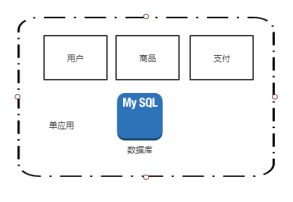

### 应用与数据库分离

- 将应用与数据分离至两台服务器上

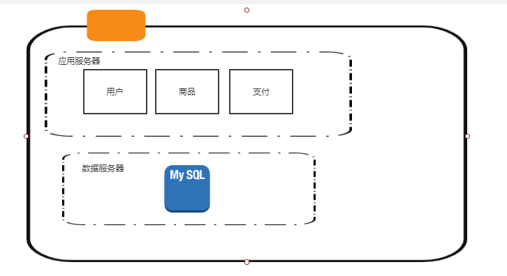

### 应用集群

- 多个应用服务器

  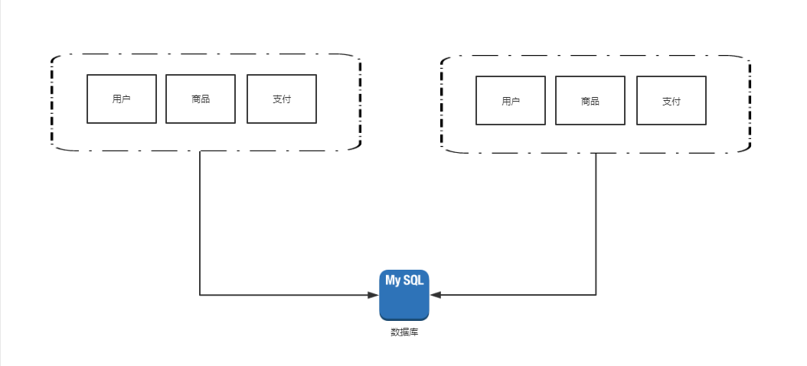

### 读写分离

- 两个数据库分别承担读、写 ，写数据库需要向读数据库进行数据提交

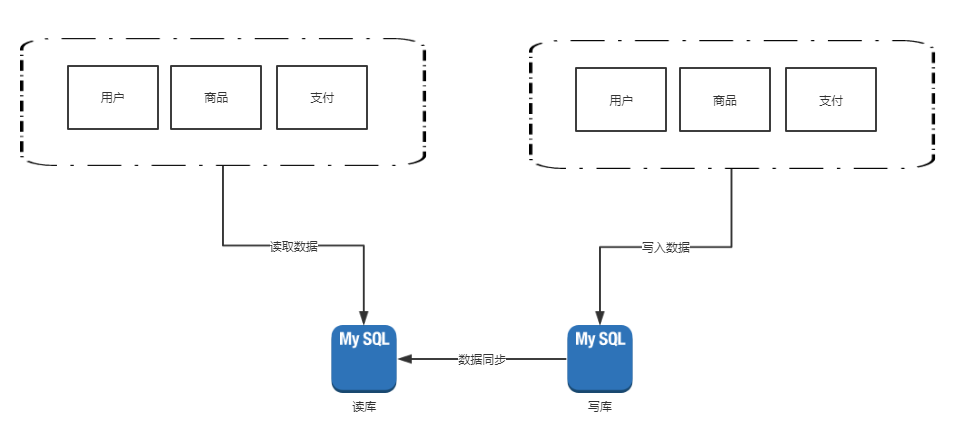

### 搜索索引

- 电商场景下 模糊搜索很多，提升搜索的性能使用ES


### 缓存引入

- redis 存储经常使用数据或这其他数据

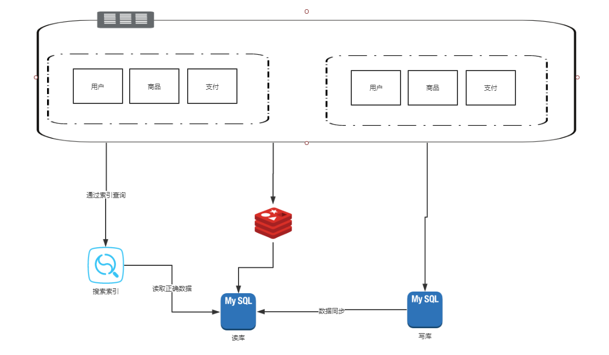

### 数据库拆分

- 水平拆分：同一个表的数据拆分到更多的表或数据库中
- 垂直拆分：把不同业务数据拆分到不同数据库中，下图：将商品作为业务进行拆分

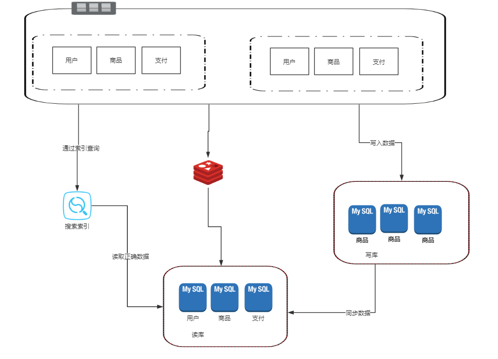

### 应用拆分

- 将`用户`、`商品`、`交易`拆分成独立应用

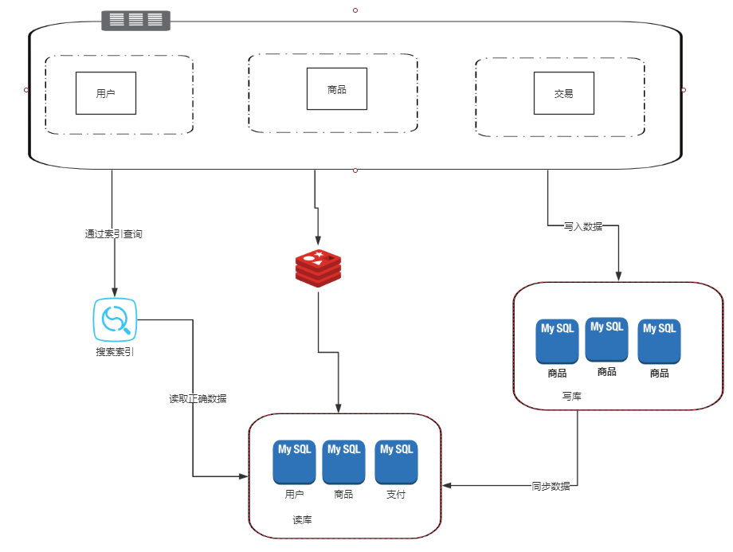


## 通讯协议

### TCP/IP

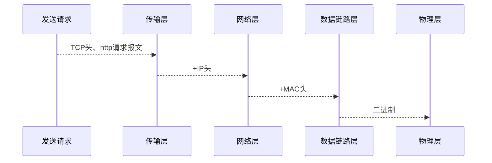

- TCP
  - 目标端口号

- IP
  - 源ip地址
  - 目标ip地址


三次握手

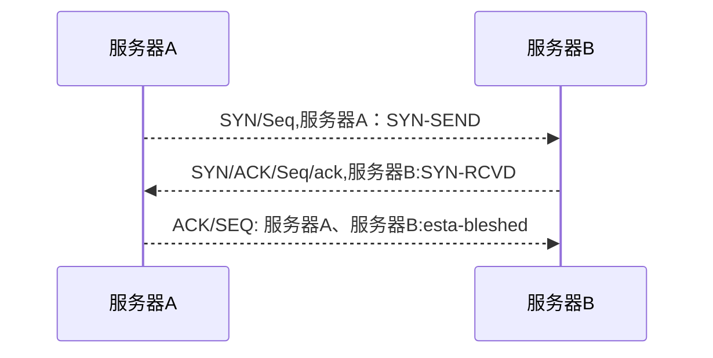

#### 四次挥手

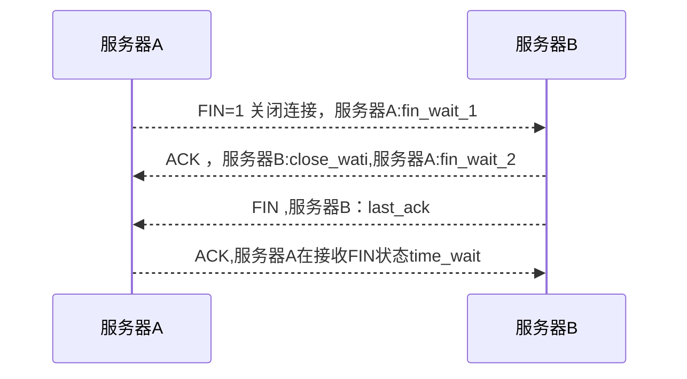


简单socket

- ClientSocketDemo

```java
public class ClientSocketDemo {

    public static void main(String[] args) throws IOException {
        Socket socket = null;

        try {
            socket = new Socket("127.0.0.1", 8080);
            PrintWriter printWriter = new PrintWriter(socket.getOutputStream(),true);
            printWriter.println("hello");
        } catch (Exception e) {

        } finally {
            if (socket != null) {
                socket.close();
            }
        }
    }
}

```

- ServerSocketDemo

```java
public class ServerSocketDemo {

    public static void main(String[] args) throws IOException {
        ServerSocket serverSocket = null;
        BufferedReader bufferedReader = null;

        try {
            serverSocket = new ServerSocket(8080);
            // 等待客户端连接
            Socket accept = serverSocket.accept();
            // inputstream
            bufferedReader = new BufferedReader(new InputStreamReader(accept.getInputStream()));
            // 写出
            System.out.println(bufferedReader.readLine());

        } catch (IOException e) {
            e.printStackTrace();
        } finally {
            if (bufferedReader != null) {
                bufferedReader.close();
            }

            if (serverSocket != null) {
                serverSocket.close();
            }
        }


    }
}
```

#### 简单UDP

- UdpClientDemo

```java
public class UdpClientDemo {

    public static void main(String[] args) throws Exception {
        InetAddress address = InetAddress.getByName("localhost");
        byte[] sendData = "hello".getBytes();
        DatagramPacket datagramPacket = new DatagramPacket(sendData, sendData.length, address,
                9999);

        DatagramSocket datagramSocket = new DatagramSocket();
        datagramSocket.send(datagramPacket);
        datagramSocket.close();
    }

}
```

- UdpServerDemo

```java
public class UdpServerDemo {

    public static void main(String[] args) {
        DatagramSocket datagramSocket = null;
        DatagramPacket datagramPacket = null;
        try {
            datagramSocket = new DatagramSocket(9999);
            byte[] receiveData = new byte[1024];
            datagramPacket = new DatagramPacket(receiveData, receiveData.length);
            datagramSocket.receive(datagramPacket);

            System.out.println(new String(receiveData, 0, datagramPacket.getLength()));


        } catch (Exception e) {

        } finally {
            if (datagramSocket != null) {
                datagramSocket.close();
            }
        }

    }
}
```

### http

#### 方法

- GET
  - 请求指定的页面信息，并返回实体主体。 
- POST
  - 请求服务器接受所指定的文档作为对所标识的URI的新的从属实体。 
- PUT
  - 从客户端向服务器传送的数据取代指定的文档的内容。 
- DELETE
  -  请求服务器删除指定的页面。 
- OPTIONS
  - 允许客户端查看服务器的性能。
- HEAD
  - 只请求页面的首部。 

#### 特点

1. HTTP无状态

   - 解决技术：cookie + session

     ```mermaid
     sequenceDiagram
     浏览器-->> 服务器:创建一个session，sessionId
     服务器-->> 浏览器: 将sessionId 放入cookie
     浏览器-->> 服务器: 将cookie 携带发送请求
     ```

2. 数据明文

   - 解决技术：https协议
     - ssl/tls
     - tcp
     - ip


### https

#### 通讯原理

- 基础模型

  客户端向服务端发送一段文本信息。

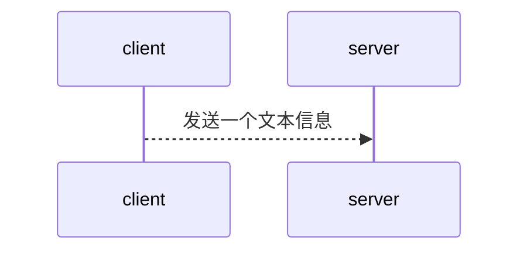

- 客户端加密 

  对称加密

  ```mermaid
  sequenceDiagram
  client密钥 -->> server密钥: 发送一个文本信息
  ```
```
  
  - 对称加密的坏处：一个密钥可以解密所有信息
    ```mermaid
    sequenceDiagram
    clientA、密钥A-->>server密钥A:请求
    clientB、密钥A-->>server密钥A:请求
  clientC、密钥A-->>server密钥A:非发请求
```

  - 一个客户端一个密钥
  
    - 问题，客户端如何知道这个密钥
    
    ```mermaid
    sequenceDiagram
    clientA、密钥A-->>server:请求
    clientB、密钥B-->>server:请求
    clientC、密钥C-->>server:请求
    ```
  
    

- 非对称加密

  - 公钥+私钥
  - 公钥获取形式？

  ```mermaid
  sequenceDiagram
  
  clientA、公钥 -->> server私钥 : 请求
  clientB、公钥 -->> server私钥 : 请求
  clientC、公钥 -->> server私钥 : 请求
  ```

  问题概述图

  ```mermaid
  sequenceDiagram
  client -->> 拦截者 : 请求
  拦截者-->> server: 转发请求种的公钥
  server-->> 拦截者: 公钥+数据
  拦截者-->> client: 拦截者创建一个公钥 ， 此时client不知道公钥的正确性
  ```

  

- 第三方加密

  ```mermaid
  sequenceDiagram
  client ->> 拦截者 : 请求
  拦截者-->> server: 转发请求种的公钥
  server -->> 第三方: server密钥加密公钥
  第三方-->> server: 第三方返回加密后的公钥
  server-->> 拦截者: 第三方加密公钥+数据
  拦截者-->> client: 拦截者创建一个公钥
  ```

  - 第三方创建**数字证书**

    - server公钥(加密后)

  - 问题

    1. 客户端如何解密第三方加密的**数字证书**？

    2. 第三方可以将证书发放给任意一个客户端，如何避免？

       ```mermaid
       sequenceDiagram
       serverA-->>第三方: 申请证书
       serverB-->>第三方: 申请证书，这个是一个坏人。这样又可以替换证书了
       ```

- 证书有效性的验证

  - 数字证书改进

    - 证书**唯一编号**

    - 唯一编号算法
    - server公钥(加密后)

    - 其他信息

  ```mermaid
  sequenceDiagram
  server-->>数字证书A:通过ca生产证书
  拦截者-->>数字证书B:通过ca生产证书
  client->> 数字证书A:获取证书
  client->> 数字证书B:获取证书
  ```

  - 通过加密算法进行一次加密计算，比对加密算法结果和证书唯一编号进行对比是否相等


- 总结

  ```mermaid
  sequenceDiagram
  
  
  服务端 -->> CA机构: 服务端公钥发送给CA机构
  CA机构 -->> 客户端: 返回证书
  Note left of CA机构: 服务端生产公钥私钥<br/>服务端保存私钥<br/>公钥发送给CA机构
  Note right of CA机构: CA机构内置的公钥<br/>私钥,CA机构加密服<br/>务端公钥生产数字前面<br/>返回给客户端,CA根证<br/>书内置在浏览器中
  
  
  客户端 ->> 服务端: TCP，发起请求，客户端随机值，客户端加密算法
  服务端 ->> 客户端: 接受请求，返回CA机构基于自身公钥私钥的算法后的证书，服务端随机值
  
  loop 证书校验
  	客户端->客户端: CA证书可受信任，有效期，数字签名，所有者
  end
  
  客户端 ->> 服务端: 加密算法(客户端随机值+服务端随机值)
  
  loop 解密信息
  	服务端->服务端: 客户端随机值+服务端随机值，验证成功船舰Session-Key
  end
  
  
  服务端 ->> 客户端:后续使用session-key
  
  ```

  


## 序列化与反序列化

### 序列化的意义

- 两个服务之间传输实体
- 磁盘数据转换成实体

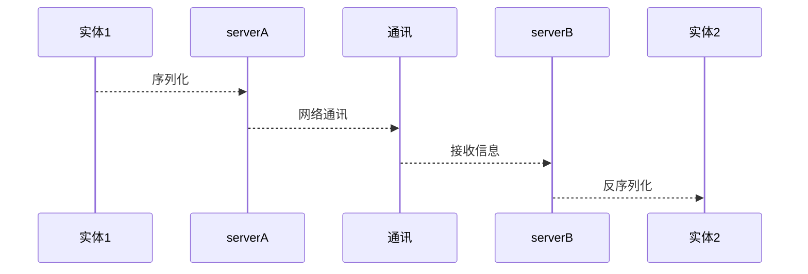

### Serialization

1. 数据大
2. 语言限制

### java序列化

```java
public class MySerializerImpl implements MySerializer {

    @Override
    public <T> byte[] serializer(T obj) throws IOException {
        ObjectOutputStream oos = null;
        ByteArrayOutputStream bos = new ByteArrayOutputStream();
        try {
            oos = new ObjectOutputStream(bos);
            oos.writeObject(obj);
            return bos.toByteArray();

        } catch (IOException e) {
            e.printStackTrace();
        } finally {
            if (oos != null) {
                oos.close();
            }
            bos.close();
        }
        return null;
    }

    @Override
    public <T> T deSerializer(byte[] data, Class<T> clazz) throws IOException {
        ByteArrayInputStream bis = new ByteArrayInputStream(data);
        ObjectInputStream ois = null;

        try {
            ois = new ObjectInputStream(bis);
            return (T) ois.readObject();
        } catch (IOException e) {
            e.printStackTrace();
        } catch (ClassNotFoundException e) {
            e.printStackTrace();
        } finally {
            if (ois != null) {
                ois.close();
            }
            bis.close();
        }

        return null;
    }
}


public class TestRun {


    public static void main(String[] args) throws IOException {
        User user = new User();
        user.setName("张三");
        MySerializer mySerializer = new MySerializerImpl();

        byte[] serializer = mySerializer.serializer(user);
        User user1 = mySerializer.deSerializer(serializer, User.class);
        System.out.println(user1);


    }


    private static class User implements Serializable {

        private String name;

        public String getName() {
            return name;
        }

        public void setName(String name) {
            this.name = name;
        }

        @Override
        public String toString() {
            final StringBuilder sb = new StringBuilder("{");
            sb.append("\"name\":\"")
                    .append(name).append('\"');
            sb.append('}');
            return sb.toString();
        }
    }

}
```


- **静态变量不参与序列化**


### 常见序列化技术

#### XML形式

- webservice soap (http+xml)

#### json

- Jackson

- FastJson

- GSON

#### hessian

#### Protobuf

- 独立语言，独立平台
- 空间占用少

[**protobuf**](<https://github.com/protocolbuffers/protobuf/releases>)

```protobuf
syntax ="proto3";


package com.huifer.jdk.serializer.proto;
option java_outer_classname="UserProto";


message MyUser{
    string name=1;
    int32 age=2;
}

```


```
.\protoc.exe --java_out=./ ./MyUser.proto
```

- Maven 插件

  ```xml
  <?xml version="1.0" encoding="UTF-8"?>
  <project xmlns="http://maven.apache.org/POM/4.0.0"
           xmlns:xsi="http://www.w3.org/2001/XMLSchema-instance"
           xsi:schemaLocation="http://maven.apache.org/POM/4.0.0 http://maven.apache.org/xsd/maven-4.0.0.xsd">
      <modelVersion>4.0.0</modelVersion>
  
      <groupId>com.huifer</groupId>
      <artifactId>jdk</artifactId>
      <version>1.0-SNAPSHOT</version>
      <properties>
          <project.build.sourceEncoding>UTF-8</project.build.sourceEncoding>
          <project.reporting.outputEncoding>UTF-8</project.reporting.outputEncoding>
          <java.version>1.9</java.version>
      </properties>
  
  
  
  
  
      <dependencies>
          <dependency>
              <groupId>io.grpc</groupId>
              <artifactId>grpc-all</artifactId>
              <version>0.13.2</version>
          </dependency>
      </dependencies>
  
  
      <build>
          <extensions>
              <extension>
                  <groupId>kr.motd.maven</groupId>
                  <artifactId>os-maven-plugin</artifactId>
                  <version>1.4.1.Final</version>
              </extension>
          </extensions>
  
  
          <plugins>
  
              <plugin>
                  <groupId>org.xolstice.maven.plugins</groupId>
                  <artifactId>protobuf-maven-plugin</artifactId>
                  <version>0.5.0</version>
                  <configuration>
                      <protoSourceRoot>${basedir}/src/main/resources</protoSourceRoot><!--默认的proto文件路径-->
                      <protocArtifact>com.google.protobuf:protoc:3.8.0:exe:${os.detected.classifier}</protocArtifact>
                      <pluginId>grpc-java</pluginId>
                      <pluginArtifact>io.grpc:protoc-gen-grpc-java:0.13.2:exe:${os.detected.classifier}</pluginArtifact>
                  </configuration>
                  <executions>
                      <execution>
                          <goals>
                              <goal>compile</goal>
                              <goal>compile-custom</goal>
                          </goals>
                      </execution>
                  </executions>
              </plugin>
  
  
              <plugin>
                  <groupId>org.apache.maven.plugins</groupId>
                  <artifactId>maven-compiler-plugin</artifactId>
                  <configuration>
                      <source>9</source>
                      <target>9</target>
                  </configuration>
              </plugin>
          </plugins>
      </build>
  
  
  
  
  
  </project>
  ```

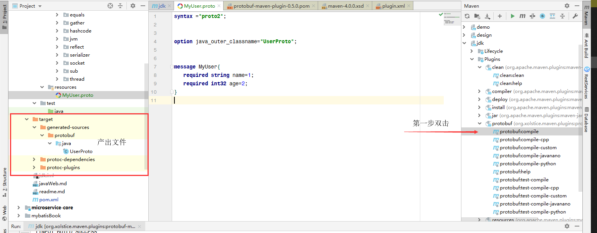

- 上图还需要将文件复制到项目的具体包下，有点不方便进行如下改进。

  ```xml
  <protoSourceRoot>${basedir}/src/main/resources
  </protoSourceRoot><!--默认的proto文件路径-->
  <outputDirectory>${basedir}/src/main/java/com/huifer/jdk/serializer/proto
  </outputDirectory><!--默认的proto文件路径-->
  <clearOutputDirectory>false</clearOutputDirectory>
  ```

  - protoSourceRoot：proto文件存放位置
  - outputDirectory：java文件输出位置
  - clearOutputDirectory：是否清空outputDirectory

```xml
<?xml version="1.0" encoding="UTF-8"?>
<project xmlns="http://maven.apache.org/POM/4.0.0"
  xmlns:xsi="http://www.w3.org/2001/XMLSchema-instance"
  xsi:schemaLocation="http://maven.apache.org/POM/4.0.0 http://maven.apache.org/xsd/maven-4.0.0.xsd">
  <modelVersion>4.0.0</modelVersion>

  <groupId>com.huifer</groupId>
  <artifactId>jdk</artifactId>
  <version>1.0-SNAPSHOT</version>
  <properties>
    <project.build.sourceEncoding>UTF-8</project.build.sourceEncoding>
    <project.reporting.outputEncoding>UTF-8</project.reporting.outputEncoding>
    <java.version>1.9</java.version>
    <protobuf.version>3.8.0</protobuf.version>
  </properties>

  <dependencies>
    <dependency>
      <groupId>com.google.protobuf</groupId>
      <artifactId>protobuf-java</artifactId>
      <version>${protobuf.version}</version>
    </dependency>


    <dependency>
      <groupId>io.grpc</groupId>
      <artifactId>grpc-all</artifactId>
      <version>0.13.2</version>
    </dependency>
  </dependencies>

  <build>
    <extensions>
      <extension>
        <groupId>kr.motd.maven</groupId>
        <artifactId>os-maven-plugin</artifactId>
        <version>1.4.1.Final</version>
      </extension>
    </extensions>


    <plugins>
      <plugin>
        <groupId>org.xolstice.maven.plugins</groupId>
        <artifactId>protobuf-maven-plugin</artifactId>
        <version>0.5.0</version>
        <configuration>
          <protoSourceRoot>${basedir}/src/main/resources
          </protoSourceRoot><!--默认的proto文件路径-->
          <!--                    <outputDirectory>${basedir}/src/main/java/com/huifer/jdk/serializer/proto                    </outputDirectory>&lt;!&ndash;默认的proto文件路径&ndash;&gt;-->
          <outputDirectory>${basedir}/src/main/java</outputDirectory><!--默认的proto文件路径-->
          <clearOutputDirectory>false</clearOutputDirectory>
          <protocArtifact>com.google.protobuf:protoc:3.8.0:exe:${os.detected.classifier}
          </protocArtifact>
          <pluginId>grpc-java</pluginId>
          <pluginArtifact>
            io.grpc:protoc-gen-grpc-java:0.13.2:exe:${os.detected.classifier}
          </pluginArtifact>
        </configuration>
        <executions>
          <execution>
            <goals>
              <goal>compile</goal>
              <goal>compile-custom</goal>
            </goals>
          </execution>
        </executions>
      </plugin>


      <plugin>
        <groupId>org.apache.maven.plugins</groupId>
        <artifactId>maven-compiler-plugin</artifactId>
        <configuration>
          <source>9</source>
          <target>9</target>
        </configuration>
      </plugin>
    </plugins>
  </build>

</project>

```

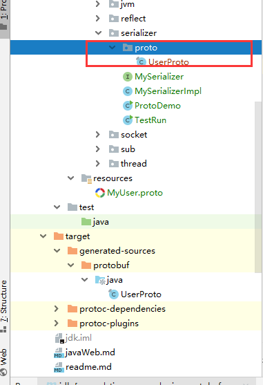

成功放入具体包下


```java
public class ProtoDemo {

    public static void main(String[] args) throws Exception {
        UserProto.MyUser myUser = UserProto.MyUser.newBuilder().setAge(10).setName("zhangsan").build();

        ByteString bytes = myUser.toByteString();

        System.out.println(bytes);

        UserProto.MyUser myUser1 = UserProto.MyUser.parseFrom(bytes);
        System.out.println(myUser1);
    }

}
```

```
<ByteString@7c53a9eb size=12>
name: "zhangsan"
age: 10
```


#### 通用序列化

- 依赖

  ```xml
     <dependency>
          <groupId>io.protostuff</groupId>
          <artifactId>protostuff-core</artifactId>
          <version>1.4.0</version>
      </dependency>
  
      <dependency>
          <groupId>io.protostuff</groupId>
          <artifactId>protostuff-runtime</artifactId>
          <version>1.4.0</version>
      </dependency>
  ```


- ProtoBufUtil

  ```java
  public class ProtoBufUtil {
  
      public static <T> byte[] serializer(T o) {
          Schema schema = RuntimeSchema.getSchema(o.getClass());
          return ProtobufIOUtil.toByteArray(o, schema, LinkedBuffer.allocate(256));
      }
  
      public static <T> T deserializer(byte[] bytes, Class<T> clazz) {
  
          T obj = null;
          try {
              obj = clazz.getDeclaredConstructor().newInstance();
              Schema schema = RuntimeSchema.getSchema(obj.getClass());
              ProtostuffIOUtil.mergeFrom(bytes, obj, schema);
          } catch (Exception e) {
              e.printStackTrace();
          }
  
          return obj;
      }
  }
  ```

- 实例类

  ```java
  @Data
  @NoArgsConstructor
  @AllArgsConstructor
  public class Student {
  
      @Tag(1)
      private String name;
      @Tag(2)
      private int age;
  }
  
  ```

- 测试

  ```java
  public class ProtoUtilsTest {
  
      public static void main(String[] args) {
          Student student = new Student("张三", 22);
          byte[] serializer = ProtoBufUtil.serializer(student);
          Student deserializer = ProtoBufUtil.deserializer(serializer, Student.class);
          System.out.println(serializer);
          System.out.println(deserializer);
      }
  
  }
  
  ```

  