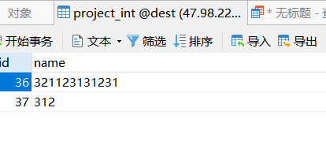
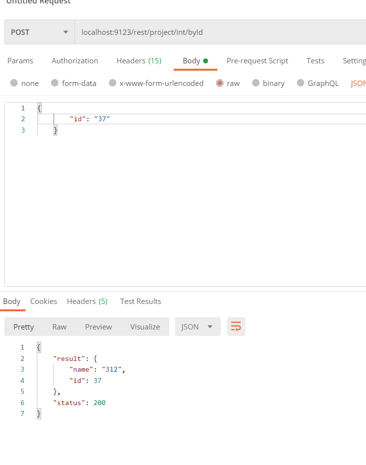
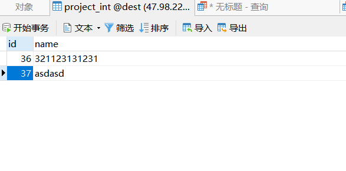
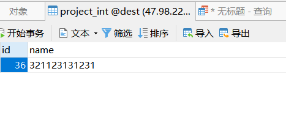

# controller 省略测试用例

- 在这篇文章之前, 我提出了一个 crud 的模板工程. 主要目的是去掉 数据库和 redis 这两层的通用代码. 在去掉这一层之后想尝试去掉 controller 类. 对这个想法进行了实现


## 配置
### 依赖配置
- 本例为 mybatis 操作
    - `0.0.5-Releases-hot-fix` dev 开发分支版本. 后续会修改
```xml
    <dependency>
      <groupId>com.github.huifer</groupId>
      <artifactId>for-controller</artifactId>
      <version>0.0.5-Releases-hot-fix</version>
      <scope>compile</scope>
    </dependency>
    <dependency>
      <groupId>com.github.huifer</groupId>
      <artifactId>for-mybatis</artifactId>
      <version>0.0.5-Releases-hot-fix</version>
    </dependency>
```

### 实体类配置

```java
@CrudController(uri = "/project/int", idType = Integer.class)
public class ProjectInt extends AbsEntity implements Serializable {

  private String name;

  public String getName() {
    return name;
  }

  public void setName(String name) {
    this.name = name;
  }
}


@CrudController(uri = "/project/str", idType = String.class)
public class ProjectStr extends AbsEntity implements Serializable {

  private String name;

  public String getName() {
    return name;
  }

  public void setName(String name) {
    this.name = name;
  }
}

```

### mapper 

```java
@Mapper
public interface ProjectIntMapper extends A<Integer, ProjectInt> {

  @Override
  @Insert("INSERT INTO `project_int`(`name`) VALUES (#{name} ) ")
  int insertSelective(ProjectInt record);

  @Override
  @Select("select * from project_int where id = #{id,javaType=INTEGER} ")
  ProjectInt selectByPrimaryKey(@Param("id") Integer integer);

  @Override
  @Delete("DELETE FROM `dest`.`project_int` WHERE `id` = #{integer} ")
  int deleteByPrimaryKey(Integer integer);

  @Override
  @Update("UPDATE `dest`.`project_int` SET `name` = #{name}  WHERE `id`= #{id}  ")
  int updateByPrimaryKeySelective(ProjectInt record);
}

@Mapper
public interface ProjectStrMapper extends A<String, ProjectStr> {

  @Override
  @Insert("INSERT INTO `dest`.`project_str`(`name`) VALUES (#{name} ) ")
  int insertSelective(ProjectStr record);

  @Override
  @Select("select * from project_str where id = #{integer} ")
  ProjectStr selectByPrimaryKey(String integer);

  @Override
  @Delete("DELETE FROM `dest`.`project_str` WHERE `id` = #{integer} ")
  int deleteByPrimaryKey(String integer);

  @Override
  @Update("UPDATE `dest`.`project_str` SET `name` = #{name}  WHERE `id`= #{id}  ")
  int updateByPrimaryKeySelective(ProjectStr record);
}

```

### Spring Boot 配置

```java
@Configuration
public class ForControllerConfig {

  @Bean
  FilterRegistrationBean myFilterRegistration() {
    FilterRegistrationBean frb = new FilterRegistrationBean();
    frb.setFilter(new MyFilter());
    frb.setUrlPatterns(Arrays.asList("/*"));
    return frb;
  }


  @Bean
  ServletRegistrationBean myServletRegistration() {
    ServletRegistrationBean srb = new ServletRegistrationBean();
    srb.setServlet(new OcaServlet());
    srb.setUrlMappings(Arrays.asList("/rest/*"));
    return srb;
  }


  @Bean
  ServletListenerRegistrationBean<ServletContextListener> myServletListener() {
    ServletListenerRegistrationBean<ServletContextListener> srb =
        new ServletListenerRegistrationBean<>();
    srb.setListener(new MyServletListener());
    return srb;
  }
}
public class MyFilter implements Filter {

  @Override
  public void init(FilterConfig filterConfig) throws ServletException {
  }

  @Override
  public void doFilter(ServletRequest request,
      ServletResponse response, FilterChain chain)
      throws IOException, ServletException {
    String url = request instanceof HttpServletRequest ?
        ((HttpServletRequest) request).getRequestURL().toString() : "N/A";
    System.out.println("from filter, processing url: " + url);
    chain.doFilter(request, response);
  }

  @Override
  public void destroy() {
  }
}

public class MyServletListener implements ServletContextListener {
    
    @Override
    public void contextInitialized (ServletContextEvent sce) {
        System.out.println("from ServletContextListener: " +
                                     " context initialized");
    }

    @Override
    public void contextDestroyed (ServletContextEvent sce) {
    }
}


```

- 启动类
```java

@SpringBootApplication
@EnableCrudController(scanPackages = {"com.github.huifer.ctr"})
@EnableCrudTemplate(daoType= DaoType.MYBATIS)
public class ForControllerApp {

  public static void main(String[] args) {
    SpringApplication.run(ForControllerApp.class, args);
  }

}

```


## 测试方法
```
localhost:9123/rest/project/int/add

{
    "name": "312"
}
```



```
localhost:9123/rest/project/int/byId

{
    "id": "37"
}
```





```
localhost:9123/rest/project/int/editor

{
    "id": "37",
    "name":"asdasd"
}
```




```
localhost:9123/rest/project/int/del

{
    "id": "37"
}
```

