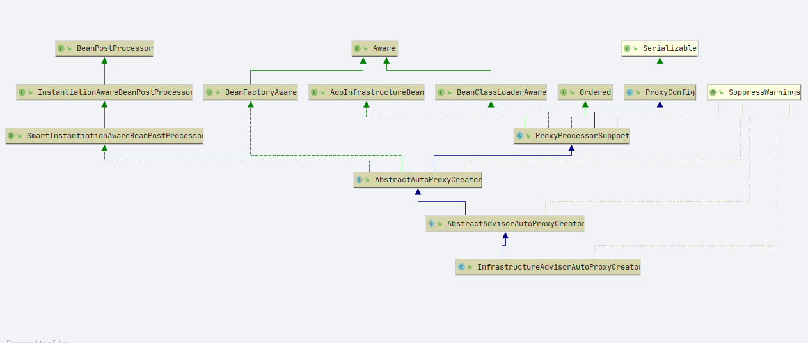
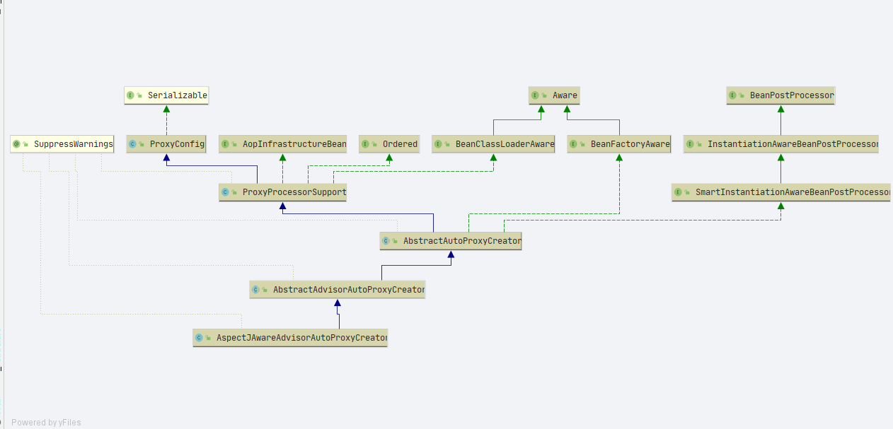
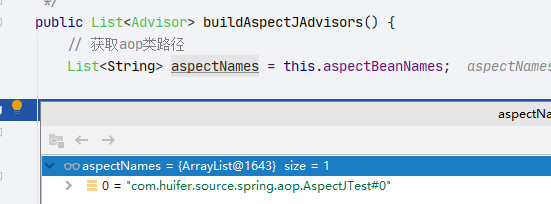
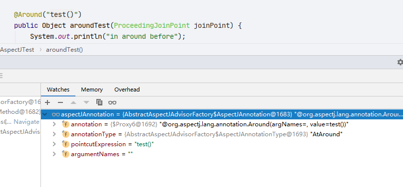
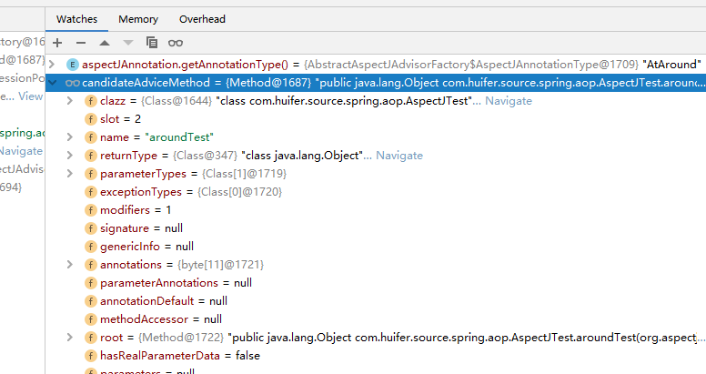

# Spring AOP
- Author: [HuiFer](https://github.com/huifer)
- 源码阅读仓库: [huifer-spring](https://github.com/huifer/spring-framework-read)

- 注意: 由于篇幅原因没有将所有相关的方法贴出

## demo

```java
public class AopSourceCode {
    public static void main(String[] args) {
        ClassPathXmlApplicationContext context = new ClassPathXmlApplicationContext("aop/AopDemo.xml");
        TestAopBean testAopBean = context.getBean("testAopBean", TestAopBean.class);
        testAopBean.test();
    }
}
```

```xml
<?xml version="1.0" encoding="UTF-8"?>
<beans xmlns:xsi="http://www.w3.org/2001/XMLSchema-instance"
       xmlns:aop="http://www.springframework.org/schema/aop" xmlns="http://www.springframework.org/schema/beans"
       xsi:schemaLocation="http://www.springframework.org/schema/beans http://www.springframework.org/schema/beans/spring-beans.xsd
        http://www.springframework.org/schema/aop https://www.springframework.org/schema/aop/spring-aop.xsd">

    <aop:aspectj-autoproxy/>
    <bean id="testAopBean" class="com.huifer.source.spring.aop.TestAopBean"/>
    <bean class="com.huifer.source.spring.aop.AspectJTest"/>

</beans>
```


```java
package com.huifer.source.spring.aop;

public class TestAopBean {
    private String testStr = "TestAopBean";


    public String getTestStr() {
        return testStr;
    }

    public void setTestStr(String testStr) {
        this.testStr = testStr;
    }

    public void test() {
        System.out.println(testStr);
    }
}

```

```java
package com.huifer.source.spring.aop;

import org.aspectj.lang.ProceedingJoinPoint;
import org.aspectj.lang.annotation.*;

@Aspect
public class AspectJTest {


    @Pointcut("execution(* com.huifer.source.spring.aop.TestAopBean.test(..))")
    public void test() {
    }

    @Before("test()")
    public void beforeTest() {
        System.out.println("before test");
    }

    @After("test()")
    public void afterTest() {
        System.out.println("after test");
    }

    @Around("test()")
    public Object aroundTest(ProceedingJoinPoint joinPoint) {
        System.out.println("in around before");

        Object o = null;
        try {
            o = joinPoint.proceed();
        } catch (Throwable e) {
            e.printStackTrace();
        }
        System.out.println("in around after");
        return o;

    }
}

```

## 解析

在`org.springframework.aop.config.AopConfigUtils`中存在下面代码

```JAVA
    /**
     * Stores the auto proxy creator classes in escalation order.
     */
    private static final List<Class<?>> APC_PRIORITY_LIST = new ArrayList<>(3);

    /**
     *
     */
    static {
        // Set up the escalation list...
        APC_PRIORITY_LIST.add(InfrastructureAdvisorAutoProxyCreator.class);
        APC_PRIORITY_LIST.add(AspectJAwareAdvisorAutoProxyCreator.class);
        APC_PRIORITY_LIST.add(AnnotationAwareAspectJAutoProxyCreator.class);
    }


```

这几个`InfrastructureAdvisorAutoProxyCreator`、`AspectJAwareAdvisorAutoProxyCreator`、`AnnotationAwareAspectJAutoProxyCreator`都实现`AbstractAutoProxyCreator`







从类图中可以发现有一个接口`BeanPostProcessor`它定义了一个方法`postProcessAfterInitialization` 在bean实例化之前要做一些操作,操作由子类实现

`org.springframework.aop.framework.autoproxy.AbstractAutoProxyCreator#postProcessAfterInitialization`

```java
    @Override
    public Object postProcessAfterInitialization(@Nullable Object bean, String beanName) {
        // 判断bean是否不为空
        if (bean != null) {
            // 通过 bean.class 和 beanName 组装一个cacheKey
            Object cacheKey = getCacheKey(bean.getClass(), beanName);
            // 移除cacheKey看是否与bean相等
            if (this.earlyProxyReferences.remove(cacheKey) != bean) {
                // 代理
                return wrapIfNecessary(bean, beanName, cacheKey);
            }
        }
        return bean;
    }

```


```JAVA
    protected Object wrapIfNecessary(Object bean, String beanName, Object cacheKey) {
        // 这个bean是否处理过
        if (StringUtils.hasLength(beanName) && this.targetSourcedBeans.contains(beanName)) {
            return bean;
        }
        // 这个bean是否需要代理
        if (Boolean.FALSE.equals(this.advisedBeans.get(cacheKey))) {
            return bean;
        }
        // 1.bean.class是否是Spring接口类型 2. 是否为 AutowireCapableBeanFactory 接口
        if (isInfrastructureClass(bean.getClass()) || shouldSkip(bean.getClass(), beanName)) {
            // 向代理集合中插入值
            this.advisedBeans.put(cacheKey, Boolean.FALSE);
            return bean;
        }

        // Create proxy if we have advice.
        // 增强方法获取
        Object[] specificInterceptors = getAdvicesAndAdvisorsForBean(bean.getClass(), beanName, null);
        // 增强方法不为空
        if (specificInterceptors != DO_NOT_PROXY) {
            // 向代理集合中插入值
            this.advisedBeans.put(cacheKey, Boolean.TRUE);
            // 创建代理
            Object proxy = createProxy(
                    bean.getClass(), beanName, specificInterceptors, new SingletonTargetSource(bean));
            // 代理类型
            this.proxyTypes.put(cacheKey, proxy.getClass());
            return proxy;
        }

        this.advisedBeans.put(cacheKey, Boolean.FALSE);
        return bean;
    }

```


## getAdvicesAndAdvisorsForBean

- `org.springframework.aop.framework.autoproxy.AbstractAdvisorAutoProxyCreator#getAdvicesAndAdvisorsForBean`

```JAVA
    @Override
    @Nullable
    protected Object[] getAdvicesAndAdvisorsForBean(
            Class<?> beanClass, String beanName, @Nullable TargetSource targetSource) {

        // 寻找Advisor
        List<Advisor> advisors = findEligibleAdvisors(beanClass, beanName);
        // 增强方法是否为空
        if (advisors.isEmpty()) {
            return DO_NOT_PROXY;
        }
        // 返回增强方法集合
        return advisors.toArray();
    }

```


## findEligibleAdvisors

```JAVA
    protected List<Advisor> findEligibleAdvisors(Class<?> beanClass, String beanName) {
        // 寻找增强方法
        List<Advisor> candidateAdvisors = findCandidateAdvisors();
        //
        List<Advisor> eligibleAdvisors = findAdvisorsThatCanApply(candidateAdvisors, beanClass, beanName);
        extendAdvisors(eligibleAdvisors);
        if (!eligibleAdvisors.isEmpty()) {
            eligibleAdvisors = sortAdvisors(eligibleAdvisors);
        }
        return eligibleAdvisors;
    }
	
```


## findCandidateAdvisors

```JAVA
    protected List<Advisor> findCandidateAdvisors() {
        Assert.state(this.advisorRetrievalHelper != null, "No BeanFactoryAdvisorRetrievalHelper available");
        return this.advisorRetrievalHelper.findAdvisorBeans();
    }

```

- `org.springframework.aop.aspectj.annotation.AnnotationAwareAspectJAutoProxyCreator#findCandidateAdvisors`

```JAVA
    @Override
    protected List<Advisor> findCandidateAdvisors() {
        // Add all the Spring advisors found according to superclass rules.
        List<Advisor> advisors = super.findCandidateAdvisors();
        // Build Advisors for all AspectJ aspects in the bean factory.
        if (this.aspectJAdvisorsBuilder != null) {
            advisors.addAll(this.aspectJAdvisorsBuilder.buildAspectJAdvisors());
        }
        return advisors;
    }

```


## buildAspectJAdvisors

```JAVA
    public List<Advisor> buildAspectJAdvisors() {
        // 获取aop类路径
        List<String> aspectNames = this.aspectBeanNames;

        if (aspectNames == null) {
            synchronized (this) {
                aspectNames = this.aspectBeanNames;
                if (aspectNames == null) {
                    List<Advisor> advisors = new ArrayList<>();
                    aspectNames = new ArrayList<>();
                    // 获取beanName
                    String[] beanNames = BeanFactoryUtils.beanNamesForTypeIncludingAncestors(
                            this.beanFactory, Object.class, true, false);
                    for (String beanName : beanNames) {
                        if (!isEligibleBean(beanName)) {
                            continue;
                        }
                        // We must be careful not to instantiate beans eagerly as in this case they
                        // would be cached by the Spring container but would not have been weaved.
                        // 获取类型
                        Class<?> beanType = this.beanFactory.getType(beanName);
                        if (beanType == null) {
                            continue;
                        }
                        // 判断是否有Aspect注解
                        if (this.advisorFactory.isAspect(beanType)) {
                            // aspect 列表添加当前beanName
                            aspectNames.add(beanName);
                            // 获取Aspect注解信息
                            AspectMetadata amd = new AspectMetadata(beanType, beanName);

                            if (amd.getAjType().getPerClause().getKind() == PerClauseKind.SINGLETON) {
                                MetadataAwareAspectInstanceFactory factory =
                                        new BeanFactoryAspectInstanceFactory(this.beanFactory, beanName);
                                // 获取增强方法
                                List<Advisor> classAdvisors = this.advisorFactory.getAdvisors(factory);
                                if (this.beanFactory.isSingleton(beanName)) {
                                    this.advisorsCache.put(beanName, classAdvisors);
                                }
                                else {
                                    this.aspectFactoryCache.put(beanName, factory);
                                }
                                advisors.addAll(classAdvisors);
                            }
                            else {
                                // Per target or per this.
                                if (this.beanFactory.isSingleton(beanName)) {
                                    throw new IllegalArgumentException("Bean with name '" + beanName +
                                            "' is a singleton, but aspect instantiation model is not singleton");
                                }
                                MetadataAwareAspectInstanceFactory factory =
                                        new PrototypeAspectInstanceFactory(this.beanFactory, beanName);
                                this.aspectFactoryCache.put(beanName, factory);
                                advisors.addAll(this.advisorFactory.getAdvisors(factory));
                            }
                        }
                    }
                    this.aspectBeanNames = aspectNames;
                    return advisors;
                }
            }
        }

        if (aspectNames.isEmpty()) {
            return Collections.emptyList();
        }
        // 缓存注解
        List<Advisor> advisors = new ArrayList<>();
        // aspectNames 获取增强
        for (String aspectName : aspectNames) {
            List<Advisor> cachedAdvisors = this.advisorsCache.get(aspectName);
            if (cachedAdvisors != null) {
                advisors.addAll(cachedAdvisors);
            }
            else {
                MetadataAwareAspectInstanceFactory factory = this.aspectFactoryCache.get(aspectName);
                advisors.addAll(this.advisorFactory.getAdvisors(factory));
            }
        }
        return advisors;
    }

```




## getAdvisors	

```JAVA
    @Override
    public List<Advisor> getAdvisors(MetadataAwareAspectInstanceFactory aspectInstanceFactory) {
        // 获取带有 Aspect 注解的类
        Class<?> aspectClass = aspectInstanceFactory.getAspectMetadata().getAspectClass();
        // 获取 aspectName
        String aspectName = aspectInstanceFactory.getAspectMetadata().getAspectName();
        // 验证
        validate(aspectClass);

        // We need to wrap the MetadataAwareAspectInstanceFactory with a decorator
        // so that it will only instantiate once.
        MetadataAwareAspectInstanceFactory lazySingletonAspectInstanceFactory =
                new LazySingletonAspectInstanceFactoryDecorator(aspectInstanceFactory);

        List<Advisor> advisors = new ArrayList<>();
        // 获取增强方法
        for (Method method : getAdvisorMethods(aspectClass)) {
            Advisor advisor = getAdvisor(method, lazySingletonAspectInstanceFactory, advisors.size(), aspectName);
            if (advisor != null) {
                advisors.add(advisor);
            }
        }

        // If it's a per target aspect, emit the dummy instantiating aspect.
        if (!advisors.isEmpty() && lazySingletonAspectInstanceFactory.getAspectMetadata().isLazilyInstantiated()) {
            Advisor instantiationAdvisor = new SyntheticInstantiationAdvisor(lazySingletonAspectInstanceFactory);
            advisors.add(0, instantiationAdvisor);
        }

        // Find introduction fields.
        for (Field field : aspectClass.getDeclaredFields()) {
            Advisor advisor = getDeclareParentsAdvisor(field);
            if (advisor != null) {
                advisors.add(advisor);
            }
        }

        return advisors;
    }

```

## getPointcut

```JAVA
    @Nullable
    private AspectJExpressionPointcut getPointcut(Method candidateAdviceMethod, Class<?> candidateAspectClass) {
        // 寻找 Aspect 相关注解
        AspectJAnnotation<?> aspectJAnnotation =
                AbstractAspectJAdvisorFactory.findAspectJAnnotationOnMethod(candidateAdviceMethod);
        if (aspectJAnnotation == null) {
            return null;
        }

        // 信息组装
        AspectJExpressionPointcut ajexp =
                new AspectJExpressionPointcut(candidateAspectClass, new String[0], new Class<?>[0]);
        // 获取 pointCut表达式
        ajexp.setExpression(aspectJAnnotation.getPointcutExpression());
        if (this.beanFactory != null) {
            ajexp.setBeanFactory(this.beanFactory);
        }
        return ajexp;
    }

```




## findAspectJAnnotationOnMethod

- `org.springframework.aop.aspectj.annotation.AbstractAspectJAdvisorFactory`

```JAVA

    private static final Class<?>[] ASPECTJ_ANNOTATION_CLASSES = new Class<?>[]{
            Pointcut.class, Around.class, Before.class, After.class, AfterReturning.class, AfterThrowing.class};


	@SuppressWarnings("unchecked")
    @Nullable
    protected static AspectJAnnotation<?> findAspectJAnnotationOnMethod(Method method) {
        // 循环判断当前方法是否存在AOP相关注解
        for (Class<?> clazz : ASPECTJ_ANNOTATION_CLASSES) {
            AspectJAnnotation<?> foundAnnotation = findAnnotation(method, (Class<Annotation>) clazz);
            if (foundAnnotation != null) {
                return foundAnnotation;
            }
        }
        return null;
    }

```


## InstantiationModelAwarePointcutAdvisorImpl

- 构造函数如下

```JAVA
    public InstantiationModelAwarePointcutAdvisorImpl(AspectJExpressionPointcut declaredPointcut,
                                                      Method aspectJAdviceMethod, AspectJAdvisorFactory aspectJAdvisorFactory,
                                                      MetadataAwareAspectInstanceFactory aspectInstanceFactory, int declarationOrder, String aspectName) {

        // 切片方法名称
        this.declaredPointcut = declaredPointcut;
        // 切片类
        this.declaringClass = aspectJAdviceMethod.getDeclaringClass();
        // 增强方法名称
        this.methodName = aspectJAdviceMethod.getName();
        // 参数类型
        this.parameterTypes = aspectJAdviceMethod.getParameterTypes();
        // 增强方法
        this.aspectJAdviceMethod = aspectJAdviceMethod;
        //
        this.aspectJAdvisorFactory = aspectJAdvisorFactory;
        //
        this.aspectInstanceFactory = aspectInstanceFactory;
        //
        this.declarationOrder = declarationOrder;
        // 切片名称
        this.aspectName = aspectName;

        if (aspectInstanceFactory.getAspectMetadata().isLazilyInstantiated()) {
            // Static part of the pointcut is a lazy type.
            Pointcut preInstantiationPointcut = Pointcuts.union(
                    aspectInstanceFactory.getAspectMetadata().getPerClausePointcut(), this.declaredPointcut);

            // Make it dynamic: must mutate from pre-instantiation to post-instantiation state.
            // If it's not a dynamic pointcut, it may be optimized out
            // by the Spring AOP infrastructure after the first evaluation.
            this.pointcut = new PerTargetInstantiationModelPointcut(
                    this.declaredPointcut, preInstantiationPointcut, aspectInstanceFactory);
            this.lazy = true;
        }
        else {
            // A singleton aspect.
            this.pointcut = this.declaredPointcut;
            this.lazy = false;
            // 实例化通知
            this.instantiatedAdvice = instantiateAdvice(this.declaredPointcut);
        }
    }

```

- 关注实例化通知`instantiateAdvice`方法


## instantiateAdvice

```JAVA
    private Advice instantiateAdvice(AspectJExpressionPointcut pointcut) {
        Advice advice = this.aspectJAdvisorFactory.getAdvice(this.aspectJAdviceMethod, pointcut,
                this.aspectInstanceFactory, this.declarationOrder, this.aspectName);
        return (advice != null ? advice : EMPTY_ADVICE);
    }

```


## getAdvice

- `org.springframework.aop.aspectj.annotation.ReflectiveAspectJAdvisorFactory#getAdvice`

```JAVA
    @Override
    @Nullable
    public Advice getAdvice(Method candidateAdviceMethod, AspectJExpressionPointcut expressionPointcut,
                            MetadataAwareAspectInstanceFactory aspectInstanceFactory, int declarationOrder, String aspectName) {

        Class<?> candidateAspectClass = aspectInstanceFactory.getAspectMetadata().getAspectClass();
        validate(candidateAspectClass);

        AspectJAnnotation<?> aspectJAnnotation =
                AbstractAspectJAdvisorFactory.findAspectJAnnotationOnMethod(candidateAdviceMethod);
        if (aspectJAnnotation == null) {
            return null;
        }

        // If we get here, we know we have an AspectJ method.
        // Check that it's an AspectJ-annotated class
        if (!isAspect(candidateAspectClass)) {
            throw new AopConfigException("Advice must be declared inside an aspect type: " +
                    "Offending method '" + candidateAdviceMethod + "' in class [" +
                    candidateAspectClass.getName() + "]");
        }

        if (logger.isDebugEnabled()) {
            logger.debug("Found AspectJ method: " + candidateAdviceMethod);
        }

        AbstractAspectJAdvice springAdvice;

        // 根据不同类型的注解进行不同处理
        switch (aspectJAnnotation.getAnnotationType()) {
            case AtPointcut:
                if (logger.isDebugEnabled()) {
                    logger.debug("Processing pointcut '" + candidateAdviceMethod.getName() + "'");
                }
                return null;
            case AtAround:
                springAdvice = new AspectJAroundAdvice(
                        candidateAdviceMethod, expressionPointcut, aspectInstanceFactory);
                break;
            case AtBefore:
                springAdvice = new AspectJMethodBeforeAdvice(
                        candidateAdviceMethod, expressionPointcut, aspectInstanceFactory);
                break;
            case AtAfter:
                springAdvice = new AspectJAfterAdvice(
                        candidateAdviceMethod, expressionPointcut, aspectInstanceFactory);
                break;
            case AtAfterReturning:
                springAdvice = new AspectJAfterReturningAdvice(
                        candidateAdviceMethod, expressionPointcut, aspectInstanceFactory);
                AfterReturning afterReturningAnnotation = (AfterReturning) aspectJAnnotation.getAnnotation();
                if (StringUtils.hasText(afterReturningAnnotation.returning())) {
                    springAdvice.setReturningName(afterReturningAnnotation.returning());
                }
                break;
            case AtAfterThrowing:
                springAdvice = new AspectJAfterThrowingAdvice(
                        candidateAdviceMethod, expressionPointcut, aspectInstanceFactory);
                AfterThrowing afterThrowingAnnotation = (AfterThrowing) aspectJAnnotation.getAnnotation();
                if (StringUtils.hasText(afterThrowingAnnotation.throwing())) {
                    springAdvice.setThrowingName(afterThrowingAnnotation.throwing());
                }
                break;
            default:
                throw new UnsupportedOperationException(
                        "Unsupported advice type on method: " + candidateAdviceMethod);
        }

        // Now to configure the advice...
        springAdvice.setAspectName(aspectName);
        springAdvice.setDeclarationOrder(declarationOrder);
        String[] argNames = this.parameterNameDiscoverer.getParameterNames(candidateAdviceMethod);
        if (argNames != null) {
            springAdvice.setArgumentNamesFromStringArray(argNames);
        }
        springAdvice.calculateArgumentBindings();

        return springAdvice;
    }

```


- 直接看`switch`方法 参数为注解类型

  ```JAVA
      protected enum AspectJAnnotationType {
  
          AtPointcut, AtAround, AtBefore, AtAfter, AtAfterReturning, AtAfterThrowing
      }
  ```

  




查看 

```JAVA
            case AtAround:
                springAdvice = new AspectJAroundAdvice(
                        candidateAdviceMethod, expressionPointcut, aspectInstanceFactory);
                break;

```


在 `org.springframework.aop.aspectj.AspectJAroundAdvice`类中有下面这段代码

```JAVA
    @Override
    public Object invoke(MethodInvocation mi) throws Throwable {
        if (!(mi instanceof ProxyMethodInvocation)) {
            throw new IllegalStateException("MethodInvocation is not a Spring ProxyMethodInvocation: " + mi);
        }
        ProxyMethodInvocation pmi = (ProxyMethodInvocation) mi;
        ProceedingJoinPoint pjp = lazyGetProceedingJoinPoint(pmi);
        JoinPointMatch jpm = getJoinPointMatch(pmi);
        return invokeAdviceMethod(pjp, jpm, null, null);
    }

```

```JAVA
    protected Object invokeAdviceMethod(JoinPoint jp, @Nullable JoinPointMatch jpMatch,
                                        @Nullable Object returnValue, @Nullable Throwable t) throws Throwable {

        return invokeAdviceMethodWithGivenArgs(argBinding(jp, jpMatch, returnValue, t));
    }

```

```JAVA
protected Object invokeAdviceMethodWithGivenArgs(Object[] args) throws Throwable {
        Object[] actualArgs = args;
        if (this.aspectJAdviceMethod.getParameterCount() == 0) {
            actualArgs = null;
        }
        try {
            ReflectionUtils.makeAccessible(this.aspectJAdviceMethod);
            // TODO AopUtils.invokeJoinpointUsingReflection
            // 增强方法执行
            return this.aspectJAdviceMethod.invoke(this.aspectInstanceFactory.getAspectInstance(), actualArgs);
        }
        catch (IllegalArgumentException ex) {
            throw new AopInvocationException("Mismatch on arguments to advice method [" +
                    this.aspectJAdviceMethod + "]; pointcut expression [" +
                    this.pointcut.getPointcutExpression() + "]", ex);
        }
        catch (InvocationTargetException ex) {
            throw ex.getTargetException();
        }
    }
```


可想而知别的几个`case`创建的对象也是存在`invoke`方法的.

并且通过`isBeforeAdvice`来判断前置执行`isAfterAdvice`来判断后置执行


- 至此我们已经获取到了基本信息可以开始对象创建了


## createProxy

在看一下创建代理之前获取到的增强方法


