# ClassPathXmlApplicationContext
- 源码阅读仓库: [huifer-spring](https://github.com/huifer/spring-framework)

这是一段我们最开始认识spring时候的代码
```java
public class ContextLoadSourceCode {
    public static void main(String[] args) {
        // 这是一个最基本的 spring 调用的例子
        ClassPathXmlApplicationContext context = new ClassPathXmlApplicationContext("beans.xml");
        Person bean = context.getBean(Person.class);
        System.out.println(bean.getName());
    }
}
```
- 这段代码干了什么事情呢?
## 类图
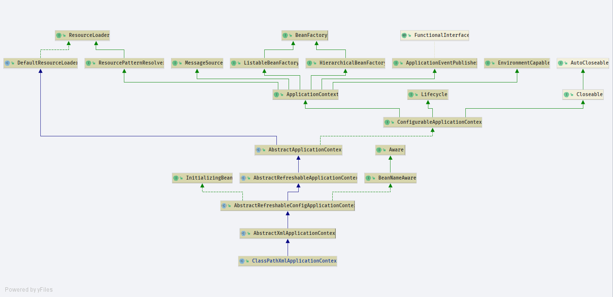
## 解析
### 构造方法
- 代码从这一句话开始,它是一个构造方法,构造了一个`ClassPathXmlApplicationContext`底层做了哪些内容呢?
`ClassPathXmlApplicationContext context = new ClassPathXmlApplicationContext("beans.xml");`

```java
public ClassPathXmlApplicationContext(String configLocation) throws BeansException {
        this(new String[]{configLocation}, true, null);
    }


public ClassPathXmlApplicationContext(
            String[] configLocations, boolean refresh, @Nullable ApplicationContext parent)
            throws BeansException {

        // 调用上层`AbstractXmlApplicationContext`
        super(parent);
        setConfigLocations(configLocations);
        if (refresh) {
            refresh();
        }
    }
```
#### 参数解析
- configLocations: 本地的上下文,在本例中为`beans.xml`
- refresh: 刷新上下文,默认为`true`
- parent: 父上下文,默认`null`

### super(parent)
- `org.springframework.context.support.AbstractApplicationContext.AbstractApplicationContext(org.springframework.context.ApplicationContext)`
- 一直往下点方法,会看到
```java
public AbstractApplicationContext(@Nullable ApplicationContext parent) {
        this();
        setParent(parent);
    }
```
我们关心的重点是`setParent`方法
```java
    @Override
    public void setParent(@Nullable ApplicationContext parent) {
        this.parent = parent;
        if (parent != null) {
            Environment parentEnvironment = parent.getEnvironment();
            if (parentEnvironment instanceof ConfigurableEnvironment) {
                getEnvironment().merge((ConfigurableEnvironment) parentEnvironment);
            }
        }
    }
```
- 只有在不为空的时候才会有操作,本例不做细查
### setConfigLocations(configLocations)
- 函数作用:设置上下文内容
- `org.springframework.context.support.AbstractRefreshableConfigApplicationContext.setConfigLocations`
```java
    public void setConfigLocations(@Nullable String... locations) {
        if (locations != null) {
            Assert.noNullElements(locations, "Config locations must not be null");
            this.configLocations = new String[locations.length];
            for (int i = 0; i < locations.length; i++) {
                this.configLocations[i] = resolvePath(locations[i]).trim();
            }
        }
        else {
            this.configLocations = null;
        }
    }

```
- AbstractRefreshableConfigApplicationContext 的一个属性值
```java
    @Nullable
    private String[] configLocations;
```
- 关注一个方法`resolvePath`,解析路径


## Environment

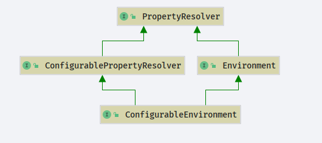


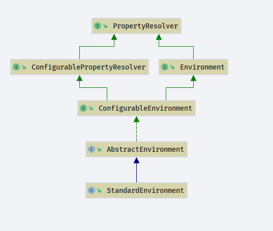

```java
protected String resolvePath(String path) {
        return getEnvironment().resolveRequiredPlaceholders(path);
    }
```
- 此时`environment`我们还没有进行过操作他是一个`null`需要走`createEnvironment`方法
```java
@Override
    public ConfigurableEnvironment getEnvironment() {
        if (this.environment == null) {
            this.environment = createEnvironment();
        }
        return this.environment;
    }
```
- 创建环境
```java
protected ConfigurableEnvironment createEnvironment() {
        return new StandardEnvironment();
    }
```
- 这个类(StandardEnvironment)里面没有构造方法,应该在父类中
```java
public class StandardEnvironment extends AbstractEnvironment {

    public static final String SYSTEM_ENVIRONMENT_PROPERTY_SOURCE_NAME = "systemEnvironment";

    public static final String SYSTEM_PROPERTIES_PROPERTY_SOURCE_NAME = "systemProperties";

    @Override
    protected void customizePropertySources(MutablePropertySources propertySources) {
        propertySources.addLast(
                new PropertiesPropertySource(SYSTEM_PROPERTIES_PROPERTY_SOURCE_NAME, getSystemProperties()));
        propertySources.addLast(
                new SystemEnvironmentPropertySource(SYSTEM_ENVIRONMENT_PROPERTY_SOURCE_NAME, getSystemEnvironment()));
    }

}

```
- 在父类`org.springframework.core.env.AbstractEnvironment`确实找到了一个构造方法
```java
public AbstractEnvironment() {
        customizePropertySources(this.propertySources);
    }
```
- `customizePropertySources`是一个模板方法在`org.springframework.core.env.AbstractEnvironment`没有实现,交给子类去做了实现方法.

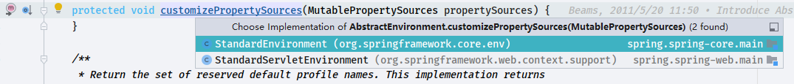
- 当前子类`StandardEnvironment`
```java
@Override
    protected void customizePropertySources(MutablePropertySources propertySources) {
        propertySources.addLast(
                new PropertiesPropertySource(SYSTEM_PROPERTIES_PROPERTY_SOURCE_NAME, getSystemProperties()));
        propertySources.addLast(
                new SystemEnvironmentPropertySource(SYSTEM_ENVIRONMENT_PROPERTY_SOURCE_NAME, getSystemEnvironment()));
    }
```

## MutablePropertySources
- `org.springframework.core.env.MutablePropertySources`
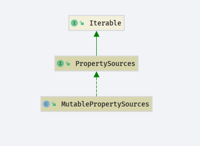
- 代码主要维护`propertySourceList`
```java
public class MutablePropertySources implements PropertySources {

    private final List<PropertySource<?>> propertySourceList = new CopyOnWriteArrayList<>();

}
```
- `customizePropertySources`方法就好理解了
```java
@Override
    protected void customizePropertySources(MutablePropertySources propertySources) {
        // 添加JVM 环境变量
        propertySources.addLast(
                new PropertiesPropertySource(SYSTEM_PROPERTIES_PROPERTY_SOURCE_NAME, getSystemProperties()));
        // 添加操作系统相关的环境变量
        propertySources.addLast(
                new SystemEnvironmentPropertySource(SYSTEM_ENVIRONMENT_PROPERTY_SOURCE_NAME, getSystemEnvironment()));
    }
```


- 加载JVM变量
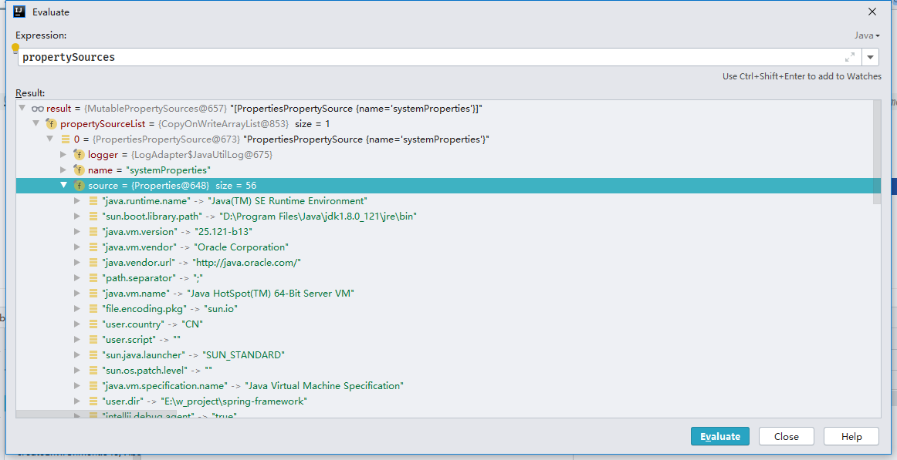

- 加载系统变量
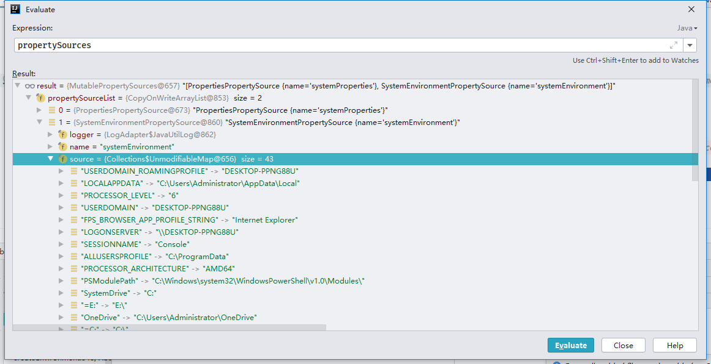


环境变量获取到了下一步.

## resolveRequiredPlaceholders

```JAVA
    protected String resolvePath(String path) {
        return getEnvironment().resolveRequiredPlaceholders(path);
    }
```

`org.springframework.core.env.AbstractEnvironment#resolveRequiredPlaceholders`

```JAVA
@Override
    public String resolveRequiredPlaceholders(String text) throws IllegalArgumentException {
        return this.propertyResolver.resolveRequiredPlaceholders(text);
    }
```

`resolveRequiredPlaceholders`

- `org.springframework.core.env.AbstractPropertyResolver#resolveRequiredPlaceholders`

```JAVA
    @Override
    public String resolveRequiredPlaceholders(String text) throws IllegalArgumentException {
        // 初始化阶段这部分内容必然为空
        if (this.strictHelper == null) {
            // 构造strictHelper
            this.strictHelper = createPlaceholderHelper(false);
        }
        // 执行解析
        return doResolvePlaceholders(text, this.strictHelper);
    }

```

```java
    private PropertyPlaceholderHelper createPlaceholderHelper(boolean ignoreUnresolvablePlaceholders) {
        return new PropertyPlaceholderHelper(this.placeholderPrefix, this.placeholderSuffix,
                this.valueSeparator, ignoreUnresolvablePlaceholders);
    }

```

```java
    /**
     * Creates a new {@code PropertyPlaceholderHelper} that uses the supplied prefix and suffix.
     *
     * @param placeholderPrefix              the prefix that denotes the start of a placeholder
     *                                       占位符前缀
     * @param placeholderSuffix              the suffix that denotes the end of a placeholder
     *                                       占位符后缀
     * @param valueSeparator                 the separating character between the placeholder variable
     *                                       and the associated default value, if any
     *                                       占位分割符号
     * @param ignoreUnresolvablePlaceholders indicates whether unresolvable placeholders should
     *                                       be ignored ({@code true}) or cause an exception ({@code false})
     *                                       忽略不可解析部分
     */
    public PropertyPlaceholderHelper(String placeholderPrefix, String placeholderSuffix,
                                     @Nullable String valueSeparator, boolean ignoreUnresolvablePlaceholders) {

        Assert.notNull(placeholderPrefix, "'placeholderPrefix' must not be null");
        Assert.notNull(placeholderSuffix, "'placeholderSuffix' must not be null");
        this.placeholderPrefix = placeholderPrefix;
        this.placeholderSuffix = placeholderSuffix;
        String simplePrefixForSuffix = wellKnownSimplePrefixes.get(this.placeholderSuffix);
        if (simplePrefixForSuffix != null && this.placeholderPrefix.endsWith(simplePrefixForSuffix)) {
            this.simplePrefix = simplePrefixForSuffix;
        }
        else {
            this.simplePrefix = this.placeholderPrefix;
        }
        this.valueSeparator = valueSeparator;
        this.ignoreUnresolvablePlaceholders = ignoreUnresolvablePlaceholders;
    }

```


## PropertyPlaceholderHelper

- `PropertyPlaceholderHelper`维护的内容如下针对前后缀进行操作,占位符替换

```java
    /**
     * 对应的分割符号
     * 众所周知的
     */
    private static final Map<String, String> wellKnownSimplePrefixes = new HashMap<>(4);

    static {
        wellKnownSimplePrefixes.put("}", "{");
        wellKnownSimplePrefixes.put("]", "[");
        wellKnownSimplePrefixes.put(")", "(");
    }
```


## doResolvePlaceholders

```java
    @Override
    public String resolveRequiredPlaceholders(String text) throws IllegalArgumentException {
        // 脚本解析器? 不知道怎么翻译,
        // 判断 strictHelper 是否为空
        if (this.strictHelper == null) {
            // 构建strictHelper
            this.strictHelper = createPlaceholderHelper(false);
        }
        // 执行解析方法
        return doResolvePlaceholders(text, this.strictHelper);
    }
```

doResolvePlaceholders 调用链路

- `org.springframework.core.env.AbstractPropertyResolver#doResolvePlaceholders`
  - `org.springframework.util.PropertyPlaceholderHelper#replacePlaceholders(java.lang.String, org.springframework.util.PropertyPlaceholderHelper.PlaceholderResolver)`
    - `org.springframework.util.PropertyPlaceholderHelper#parseStringValue`

- 在当前测试用例中我们可以发现 `value `= `beans.xml` 直接返回即可,暂不对该类进行深挖

```java
protected String parseStringValue(
            String value, PlaceholderResolver placeholderResolver, @Nullable Set<String> visitedPlaceholders) {

        // 判断是否包含 placeholderPrefix 前缀
        int startIndex = value.indexOf(this.placeholderPrefix);
        if (startIndex == -1) {
            // 不包含直接返回 value
            return value;
        }
    }
```

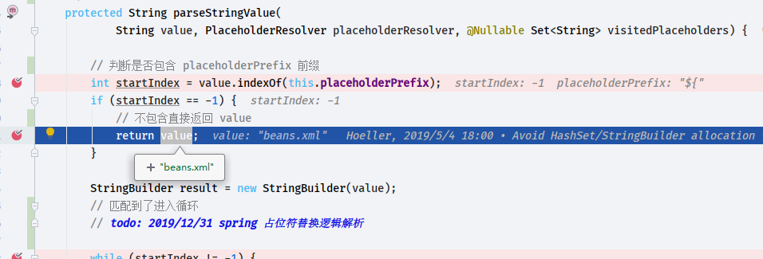

- 本文只有一个`configLocation`文件那么到这里已经走完了下面这个方法

  ```java
      public void setConfigLocations(@Nullable String... locations) {
          if (locations != null) {
              Assert.noNullElements(locations, "Config locations must not be null");
              this.configLocations = new String[locations.length];
              for (int i = 0; i < locations.length; i++) {
                  this.configLocations[i] = resolvePath(locations[i]).trim();
              }
          }
          else {
              this.configLocations = null;
          }
      }
  
  ```

  ```java
      public ClassPathXmlApplicationContext(
              String[] configLocations, boolean refresh, @Nullable ApplicationContext parent)
              throws BeansException {
  
          // 调用上层`AbstractXmlApplicationContext`
          super(parent);
          setConfigLocations(configLocations);
          if (refresh) {
              refresh();
          }
      }
  
  ```

  接下来就是`refresh()`方法了

  ## refresh

  ```JAVA
          if (refresh) {
              refresh();
          }
  ```

  `refresh`的值是`true`为什么?答: 构造`ClassPathXmlApplicationContext` 设置的`true`

  ```java
      public ClassPathXmlApplicationContext(String configLocation) throws BeansException {
          this(new String[]{configLocation}, true, null);
      }
  
  ```

- 调用

  - `org.springframework.context.support.AbstractApplicationContext#refresh`

代码如下

```java
    @Override
    public void refresh() throws BeansException, IllegalStateException {
        synchronized (this.startupShutdownMonitor) {
            // Prepare this context for refreshing.
            prepareRefresh();

            // Tell the subclass to refresh the internal bean factory.
            ConfigurableListableBeanFactory beanFactory = obtainFreshBeanFactory();

            // Prepare the bean factory for use in this context.
            prepareBeanFactory(beanFactory);

            try {
                // Allows post-processing of the bean factory in context subclasses.
                postProcessBeanFactory(beanFactory);

                // Invoke factory processors registered as beans in the context.
                invokeBeanFactoryPostProcessors(beanFactory);

                // Register bean processors that intercept bean creation.
                registerBeanPostProcessors(beanFactory);

                // Initialize message source for this context.
                initMessageSource();

                // Initialize event multicaster for this context.
                initApplicationEventMulticaster();

                // Initialize other special beans in specific context subclasses.
                onRefresh();

                // Check for listener beans and register them.
                registerListeners();

                // Instantiate all remaining (non-lazy-init) singletons.
                finishBeanFactoryInitialization(beanFactory);

                // Last step: publish corresponding event.
                finishRefresh();
            }

            catch (BeansException ex) {
                if (logger.isWarnEnabled()) {
                    logger.warn("Exception encountered during context initialization - " +
                            "cancelling refresh attempt: " + ex);
                }

                // Destroy already created singletons to avoid dangling resources.
                destroyBeans();

                // Reset 'active' flag.
                cancelRefresh(ex);

                // Propagate exception to caller.
                throw ex;
            }

            finally {
                // Reset common introspection caches in Spring's core, since we
                // might not ever need metadata for singleton beans anymore...
                resetCommonCaches();
            }
        }
    }

```


### prepareRefresh

```java
    /**
     * Prepare this context for refreshing, setting its startup date and
     * active flag as well as performing any initialization of property sources.
     * 初始化资源: 创建日期,是否关闭的标志位,是否活动的标志位
     */
    protected void prepareRefresh() {
        // Switch to active.
        this.startupDate = System.currentTimeMillis();
        this.closed.set(false);
        this.active.set(true);

        if (logger.isDebugEnabled()) {
            if (logger.isTraceEnabled()) {
                logger.trace("Refreshing " + this);
            }
            else {
                logger.debug("Refreshing " + getDisplayName());
            }
        }

        // Initialize any placeholder property sources in the context environment.
        // 初始化资源
        initPropertySources();

        // Validate that all properties marked as required are resolvable:
        // see ConfigurablePropertyResolver#setRequiredProperties
        getEnvironment().validateRequiredProperties();

        // Store pre-refresh ApplicationListeners...
        if (this.earlyApplicationListeners == null) {
            this.earlyApplicationListeners = new LinkedHashSet<>(this.applicationListeners);
        }
        else {
            // Reset local application listeners to pre-refresh state.
            this.applicationListeners.clear();
            this.applicationListeners.addAll(this.earlyApplicationListeners);
        }

        // Allow for the collection of early ApplicationEvents,
        // to be published once the multicaster is available...
        this.earlyApplicationEvents = new LinkedHashSet<>();
    }

```

### obtainFreshBeanFactory

```JAVA
    /**
     * Tell the subclass to refresh the internal bean factory.
     * <p>
     * 告诉子类刷新内部beanFactory
     *
     * @return the fresh BeanFactory instance
     * @see #refreshBeanFactory()
     * @see #getBeanFactory()
     */
    protected ConfigurableListableBeanFactory obtainFreshBeanFactory() {
        /**
         * {@link AbstractRefreshableApplicationContext#refreshBeanFactory()}
         */
        refreshBeanFactory();
        return getBeanFactory();
    }

```

#### refreshBeanFactory

```JAVA
protected abstract void refreshBeanFactory() throws BeansException, IllegalStateException;
```

- `org.springframework.context.support.AbstractRefreshableApplicationContext#refreshBeanFactory`


```JAVA
	// org.springframework.context.support.AbstractRefreshableApplicationContext#refreshBeanFactory	
	@Override
    protected final void refreshBeanFactory() throws BeansException {
        // 判断是否已经存在 BeanFactory
        if (hasBeanFactory()) {
            // 删除beans
            destroyBeans();
            // 关闭 BeanFactory
            closeBeanFactory();
        }
        try {
            // 创建一个 BeanFactory
            DefaultListableBeanFactory beanFactory = createBeanFactory();
            // 设置唯一id
            beanFactory.setSerializationId(getId());
            // 创建 定制的beanFactory
            customizeBeanFactory(beanFactory);
            // 加载beanFactory
            loadBeanDefinitions(beanFactory);
            synchronized (this.beanFactoryMonitor) {
                this.beanFactory = beanFactory;
            }
        }
        catch (IOException ex) {
            throw new ApplicationContextException("I/O error parsing bean definition source for " + getDisplayName(), ex);
        }
    }
```

- 直接看最后的`loadBeanDefinitions`

  - `org.springframework.context.support.AbstractXmlApplicationContext#loadBeanDefinitions(org.springframework.beans.factory.support.DefaultListableBeanFactory)`

    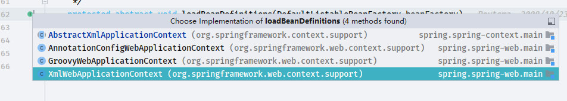

    实现该方法的有

    1. `AbstractXmlApplicationContext`
    2. `AnnotationConfigWebApplicationContext`
    3. `GroovyWebApplicationContext`
    4. `XmlWebApplicationContext`

    很明显我们需要去第一个`AbstractXmlApplicationContext`寻觅源码

```java
@Override
    protected void loadBeanDefinitions(DefaultListableBeanFactory beanFactory) throws BeansException, IOException {
        // Create a new XmlBeanDefinitionReader for the given BeanFactory.
        XmlBeanDefinitionReader beanDefinitionReader = new XmlBeanDefinitionReader(beanFactory);

        // Configure the bean definition reader with this context's
        // resource loading environment.
        // 设置
        beanDefinitionReader.setEnvironment(this.getEnvironment());
        // 设置资源加载器
        beanDefinitionReader.setResourceLoader(this);
        // 设置实体解析器
        beanDefinitionReader.setEntityResolver(new ResourceEntityResolver(this));

        // Allow a subclass to provide custom initialization of the reader,
        // then proceed with actually loading the bean definitions.
        // 初始化解析器 XmlBeanDefinitionReader
        initBeanDefinitionReader(beanDefinitionReader);
        // 实际解析bean定义
        loadBeanDefinitions(beanDefinitionReader);
    }
```

```java
    protected void loadBeanDefinitions(XmlBeanDefinitionReader reader) throws BeansException, IOException {
        Resource[] configResources = getConfigResources();
        if (configResources != null) {
            reader.loadBeanDefinitions(configResources);
        }
        /**
         * getConfigLocations 内容从 {@link ClassPathXmlApplicationContext} 初始化就准备好了
         */
        String[] configLocations = getConfigLocations();
        if (configLocations != null) {
            reader.loadBeanDefinitions(configLocations);
        }
    }

```

  reader.loadBeanDefinitions(configLocations); 调用链路

- `org.springframework.context.support.AbstractXmlApplicationContext#loadBeanDefinitions(org.springframework.beans.factory.xml.XmlBeanDefinitionReader)`
  - `org.springframework.beans.factory.support.AbstractBeanDefinitionReader#loadBeanDefinitions(java.lang.String...)`
    - `org.springframework.beans.factory.support.AbstractBeanDefinitionReader#loadBeanDefinitions(java.lang.String)`
      - `org.springframework.beans.factory.support.AbstractBeanDefinitionReader#loadBeanDefinitions(java.lang.String, java.util.Set<org.springframework.core.io.Resource>)`


```java
   //org.springframework.beans.factory.support.AbstractBeanDefinitionReader
	/**
     * Load bean definitions from the specified resource location.
     * <p>The location can also be a location pattern, provided that the
     * ResourceLoader of this bean definition reader is a ResourcePatternResolver.
     * <p>
     * 从指定的资源路径加载bean ,返回 bean的数量(自定义的bean)
     *
     * @param location        the resource location, to be loaded with the ResourceLoader
     *                        (or ResourcePatternResolver) of this bean definition reader
     *                        配置路径,spring.xml
     * @param actualResources a Set to be filled with the actual Resource objects
     *                        that have been resolved during the loading process. May be {@code null}
     *                        to indicate that the caller is not interested in those Resource objects.
     * @return the number of bean definitions found
     * @throws BeanDefinitionStoreException in case of loading or parsing errors
     * @see #getResourceLoader()
     * @see #loadBeanDefinitions(org.springframework.core.io.Resource)
     * @see #loadBeanDefinitions(org.springframework.core.io.Resource[])
     */
    public int loadBeanDefinitions(String location, @Nullable Set<Resource> actualResources) throws BeanDefinitionStoreException {
        // 获取资源加载器
        ResourceLoader resourceLoader = getResourceLoader();
        if (resourceLoader == null) {
            throw new BeanDefinitionStoreException(
                    "Cannot load bean definitions from location [" + location + "]: no ResourceLoader available");
        }

        if (resourceLoader instanceof ResourcePatternResolver) {
            // Resource pattern matching available.
            try {
                // 获取Resource
                Resource[] resources = ((ResourcePatternResolver) resourceLoader).getResources(location);
                // 解析bean的定义
                int count = loadBeanDefinitions(resources);
                if (actualResources != null) {
                    Collections.addAll(actualResources, resources);
                }
                if (logger.isTraceEnabled()) {
                    logger.trace("Loaded " + count + " bean definitions from location pattern [" + location + "]");
                }
                return count;
            }
            catch (IOException ex) {
                throw new BeanDefinitionStoreException(
                        "Could not resolve bean definition resource pattern [" + location + "]", ex);
            }
        }
        else {
            // Can only load single resources by absolute URL.
            Resource resource = resourceLoader.getResource(location);
            int count = loadBeanDefinitions(resource);
            if (actualResources != null) {
                actualResources.add(resource);
            }
            if (logger.isTraceEnabled()) {
                logger.trace("Loaded " + count + " bean definitions from location [" + location + "]");
            }
            return count;
        }
    }

```

- `int count = loadBeanDefinitions(resources);`调用链路如下

- `org.springframework.beans.factory.support.AbstractBeanDefinitionReader#loadBeanDefinitions(org.springframework.core.io.Resource...)`
  - `org.springframework.beans.factory.support.BeanDefinitionReader#loadBeanDefinitions(org.springframework.core.io.Resource)`
    - `org.springframework.beans.factory.xml.XmlBeanDefinitionReader#loadBeanDefinitions(org.springframework.core.io.Resource)`
      - `org.springframework.beans.factory.xml.XmlBeanDefinitionReader#loadBeanDefinitions(org.springframework.core.io.support.EncodedResource)`
        - `org.springframework.beans.factory.xml.XmlBeanDefinitionReader#doLoadBeanDefinitions`


```java
// org.springframework.beans.factory.xml.XmlBeanDefinitionReader#doLoadBeanDefinitions
protected int doLoadBeanDefinitions(InputSource inputSource, Resource resource)
            throws BeanDefinitionStoreException {

        try {
            // 加载文档 xml 格式
            Document doc = doLoadDocument(inputSource, resource);
            // 注册bean
            int count = registerBeanDefinitions(doc, resource);
            if (logger.isDebugEnabled()) {
                logger.debug("Loaded " + count + " bean definitions from " + resource);
            }
            return count;
        }
  
    }
```

关注`registerBeanDefinitions`方法  `org.springframework.beans.factory.xml.XmlBeanDefinitionReader#registerBeanDefinitions`


```java
// org.springframework.beans.factory.xml.XmlBeanDefinitionReader#registerBeanDefinitions
public int registerBeanDefinitions(Document doc, Resource resource) throws BeanDefinitionStoreException {
        BeanDefinitionDocumentReader documentReader = createBeanDefinitionDocumentReader();
        int countBefore = getRegistry().getBeanDefinitionCount();
        // 注册方法
        documentReader.registerBeanDefinitions(doc, createReaderContext(resource));
        return getRegistry().getBeanDefinitionCount() - countBefore;
    }
```

- `org.springframework.beans.factory.xml.DefaultBeanDefinitionDocumentReader#registerBeanDefinitions`

```java
  // org.springframework.beans.factory.xml.DefaultBeanDefinitionDocumentReader#registerBeanDefinitions
  	  @Override
      public void registerBeanDefinitions(Document doc, XmlReaderContext readerContext) {
          this.readerContext = readerContext;
          doRegisterBeanDefinitions(doc.getDocumentElement());
      }
```

- `org.springframework.beans.factory.xml.DefaultBeanDefinitionDocumentReader#doRegisterBeanDefinitions`

  ```java
      /**
       * Register each bean definition within the given root {@code <beans/>} element.
       */
      @SuppressWarnings("deprecation")  // for Environment.acceptsProfiles(String...)
      protected void doRegisterBeanDefinitions(Element root) {
          // Any nested <beans> elements will cause recursion in this method. In
          // order to propagate and preserve <beans> default-* attributes correctly,
          // keep track of the current (parent) delegate, which may be null. Create
          // the new (child) delegate with a reference to the parent for fallback purposes,
          // then ultimately reset this.delegate back to its original (parent) reference.
          // this behavior emulates a stack of delegates without actually necessitating one.
          BeanDefinitionParserDelegate parent = this.delegate;
          this.delegate = createDelegate(getReaderContext(), root, parent);
  
          if (this.delegate.isDefaultNamespace(root)) {
              String profileSpec = root.getAttribute(PROFILE_ATTRIBUTE);
              if (StringUtils.hasText(profileSpec)) {
                  String[] specifiedProfiles = StringUtils.tokenizeToStringArray(
                          profileSpec, BeanDefinitionParserDelegate.MULTI_VALUE_ATTRIBUTE_DELIMITERS);
                  // We cannot use Profiles.of(...) since profile expressions are not supported
                  // in XML config. See SPR-12458 for details.
                  if (!getReaderContext().getEnvironment().acceptsProfiles(specifiedProfiles)) {
                      if (logger.isDebugEnabled()) {
                          logger.debug("Skipped XML bean definition file due to specified profiles [" + profileSpec +
                                  "] not matching: " + getReaderContext().getResource());
                      }
                      return;
                  }
              }
          }
  
          preProcessXml(root);
          parseBeanDefinitions(root, this.delegate);
          postProcessXml(root);
  
          this.delegate = parent;
      }
  
  ```

  - 看到源码上面的注释`Register each bean definition within the given root {@code <beans/>} element.`

    根据给定的节点解析bean的定义

- `org.springframework.beans.factory.xml.DefaultBeanDefinitionDocumentReader#parseBeanDefinitions`

  ```java
      /**
       * Parse the elements at the root level in the document:
       * "import", "alias", "bean".
       * 解析标签,import\alias\bean
       *
       * @param root the DOM root element of the document
       */
      protected void parseBeanDefinitions(Element root, BeanDefinitionParserDelegate delegate) {
          if (delegate.isDefaultNamespace(root)) {
              NodeList nl = root.getChildNodes();
              for (int i = 0; i < nl.getLength(); i++) {
                  Node node = nl.item(i);
                  if (node instanceof Element) {
                      Element ele = (Element) node;
                      if (delegate.isDefaultNamespace(ele)) {
                          // 不同标签的解析
                          parseDefaultElement(ele, delegate);
                      }
                      else {
                          delegate.parseCustomElement(ele);
                      }
                  }
              }
          }
          else {
              delegate.parseCustomElement(root);
          }
      }
  
  ```

  ```JAVA
      /**
       * 解析不同类型的标签
       *
       * @param ele
       * @param delegate
       */
      private void parseDefaultElement(Element ele, BeanDefinitionParserDelegate delegate) {
          if (delegate.nodeNameEquals(ele, IMPORT_ELEMENT)) {
              importBeanDefinitionResource(ele);
          }
          else if (delegate.nodeNameEquals(ele, ALIAS_ELEMENT)) {
              processAliasRegistration(ele);
          }
          else if (delegate.nodeNameEquals(ele, BEAN_ELEMENT)) {
              processBeanDefinition(ele, delegate);
          }
          else if (delegate.nodeNameEquals(ele, NESTED_BEANS_ELEMENT)) {
              // recurse
              doRegisterBeanDefinitions(ele);
          }
      }
  
  ```

- `org.springframework.beans.factory.xml.DefaultBeanDefinitionDocumentReader#processBeanDefinition`

  ```JAVA
      /**
       * Process the given bean element, parsing the bean definition
       * and registering it with the registry.
       * <p>
       * 加载信息并且注册
       */
      protected void processBeanDefinition(Element ele, BeanDefinitionParserDelegate delegate) {
          BeanDefinitionHolder bdHolder = delegate.parseBeanDefinitionElement(ele);
          if (bdHolder != null) {
              bdHolder = delegate.decorateBeanDefinitionIfRequired(ele, bdHolder);
              try {
                  // Register the final decorated instance.
                  BeanDefinitionReaderUtils.registerBeanDefinition(bdHolder, getReaderContext().getRegistry());
              }
              catch (BeanDefinitionStoreException ex) {
                  getReaderContext().error("Failed to register bean definition with name '" +
                          bdHolder.getBeanName() + "'", ele, ex);
              }
              // Send registration event.
              getReaderContext().fireComponentRegistered(new BeanComponentDefinition(bdHolder));
          }
      }
  
  ```

  - `org.springframework.beans.factory.xml.BeanDefinitionParserDelegate#parseBeanDefinitionElement(org.w3c.dom.Element, org.springframework.beans.factory.config.BeanDefinition)`

```JAVA
    @Nullable
    public BeanDefinitionHolder parseBeanDefinitionElement(Element ele, @Nullable BeanDefinition containingBean) {
        // 获取id 属性
        String id = ele.getAttribute(ID_ATTRIBUTE);
        // 获取 name 属性
        String nameAttr = ele.getAttribute(NAME_ATTRIBUTE);

        // 别名列表
        List<String> aliases = new ArrayList<>();
        if (StringUtils.hasLength(nameAttr)) {
            String[] nameArr = StringUtils.tokenizeToStringArray(nameAttr, MULTI_VALUE_ATTRIBUTE_DELIMITERS);
            aliases.addAll(Arrays.asList(nameArr));
        }

        // beanName  = <bean id=""/> 中id的属性值
        String beanName = id;
        if (!StringUtils.hasText(beanName) && !aliases.isEmpty()) {
            beanName = aliases.remove(0);
            if (logger.isTraceEnabled()) {
                logger.trace("No XML 'id' specified - using '" + beanName +
                        "' as bean name and " + aliases + " as aliases");
            }
        }

        if (containingBean == null) {
            checkNameUniqueness(beanName, aliases, ele);
        }

        AbstractBeanDefinition beanDefinition = parseBeanDefinitionElement(ele, beanName, containingBean);
        if (beanDefinition != null) {
            if (!StringUtils.hasText(beanName)) {
                try {
                    if (containingBean != null) {
                        beanName = BeanDefinitionReaderUtils.generateBeanName(
                                beanDefinition, this.readerContext.getRegistry(), true);
                    }
                    else {
                        beanName = this.readerContext.generateBeanName(beanDefinition);
                        // Register an alias for the plain bean class name, if still possible,
                        // if the generator returned the class name plus a suffix.
                        // This is expected for Spring 1.2/2.0 backwards compatibility.
                        String beanClassName = beanDefinition.getBeanClassName();
                        if (beanClassName != null &&
                                beanName.startsWith(beanClassName) && beanName.length() > beanClassName.length() &&
                                !this.readerContext.getRegistry().isBeanNameInUse(beanClassName)) {
                            aliases.add(beanClassName);
                        }
                    }
                    if (logger.isTraceEnabled()) {
                        logger.trace("Neither XML 'id' nor 'name' specified - " +
                                "using generated bean name [" + beanName + "]");
                    }
                }
                catch (Exception ex) {
                    error(ex.getMessage(), ele);
                    return null;
                }
            }
            String[] aliasesArray = StringUtils.toStringArray(aliases);
            return new BeanDefinitionHolder(beanDefinition, beanName, aliasesArray);
        }

        return null;
    }

```

```JAVA
    /**
     * Parse the bean definition itself, without regard to name or aliases. May return
     * {@code null} if problems occurred during the parsing of the bean definition.
     * <p>
     * bean 解析,不考虑名称,别名.
     */
    @Nullable
    public AbstractBeanDefinition parseBeanDefinitionElement(
            Element ele, String beanName, @Nullable BeanDefinition containingBean) {

        this.parseState.push(new BeanEntry(beanName));

        String className = null;
        // 判断是否有 class 属性
        if (ele.hasAttribute(CLASS_ATTRIBUTE)) {
            // 获取 <bean class=""> class 的属性值
            className = ele.getAttribute(CLASS_ATTRIBUTE).trim();
        }
        String parent = null;
        // 判断是否有 parent 熟悉
        if (ele.hasAttribute(PARENT_ATTRIBUTE)) {
            parent = ele.getAttribute(PARENT_ATTRIBUTE);
        }

        try {
            // 创建一个bean
            AbstractBeanDefinition bd = createBeanDefinition(className, parent);
            // 设置其他bean属性
            parseBeanDefinitionAttributes(ele, beanName, containingBean, bd);
            bd.setDescription(DomUtils.getChildElementValueByTagName(ele, DESCRIPTION_ELEMENT));

            // 解析 meta 标签数据
            parseMetaElements(ele, bd);
            // 解析 {@code <lookup-method bean="personBean2"></lookup-method>}
            parseLookupOverrideSubElements(ele, bd.getMethodOverrides());
            // 解析 {@code <replaced-method name="" replacer=""/>}
            parseReplacedMethodSubElements(ele, bd.getMethodOverrides());
            // 解析 {@code <constructor-arg name="" value="" index="" ref="" type="" />}
            parseConstructorArgElements(ele, bd);
            // 解析 {@code <property name="" value=""/>}
            parsePropertyElements(ele, bd);
            // 解析 {@code <qualifier type="" value=""/>}
            parseQualifierElements(ele, bd);

            bd.setResource(this.readerContext.getResource());
            bd.setSource(extractSource(ele));

            return bd;
        }
        catch (ClassNotFoundException ex) {
            error("Bean class [" + className + "] not found", ele, ex);
        }
        catch (NoClassDefFoundError err) {
            error("Class that bean class [" + className + "] depends on not found", ele, err);
        }
        catch (Throwable ex) {
            error("Unexpected failure during bean definition parsing", ele, ex);
        }
        finally {
            this.parseState.pop();
        }

        return null;
    }

```


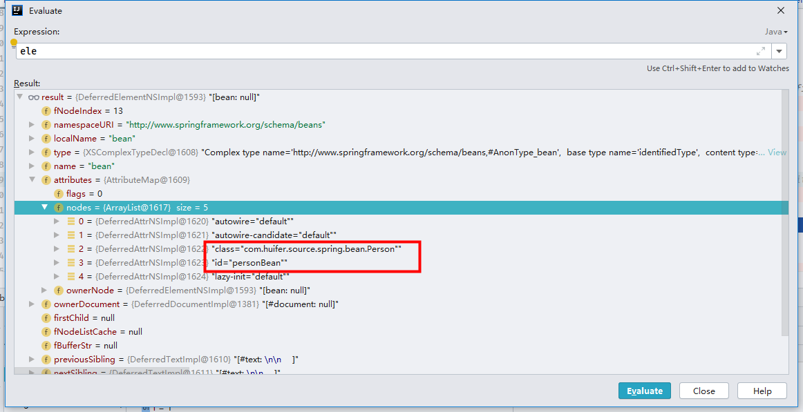

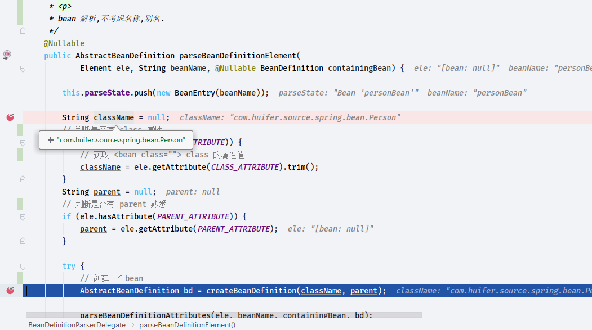

- 解析这一段

```xml
    <bean id="personBean" class="com.huifer.source.spring.bean.Person">
        <property name="name" value="huifer"/>
    </bean>
```

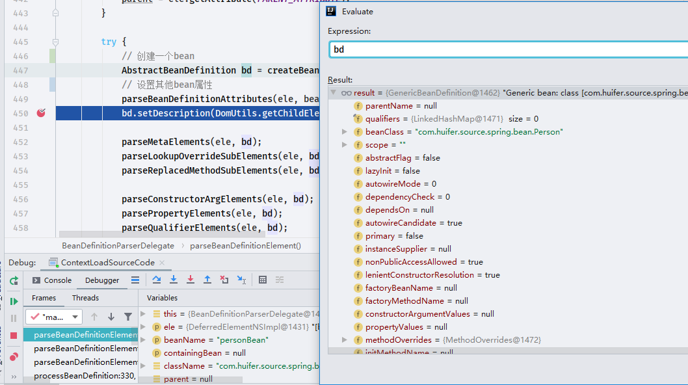

- 解析这一段

```xml
    <bean id="personBean" class="com.huifer.source.spring.bean.Person" scope="prototype">
        <property name="name" value="huifer"/>
    </bean>

```

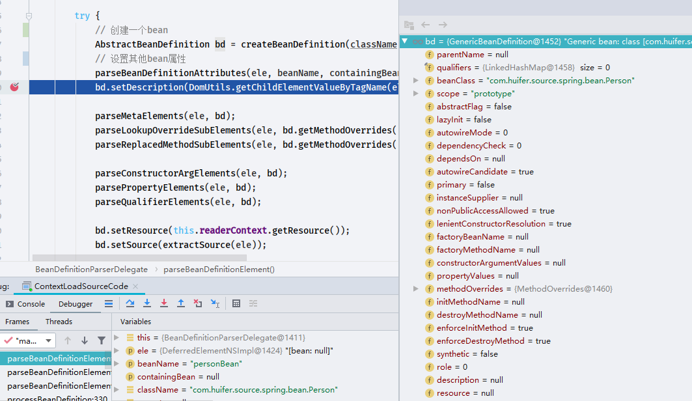

可以发现 `scope`被设置成功

- `org.springframework.beans.factory.xml.BeanDefinitionParserDelegate#parseBeanDefinitionAttributes`就不做详解了


- 具体解析流程查看[Spring-BeanDefinitionParserDelegate](/doc/context/Spring-BeanDefinitionParserDelegate.md)


#### getBeanFactory

```JAVA
@Override
    public abstract ConfigurableListableBeanFactory getBeanFactory() throws IllegalStateException;
```

- `org.springframework.context.support.AbstractRefreshableApplicationContext#getBeanFactory`

  ```java
   	@Override
      public final ConfigurableListableBeanFactory getBeanFactory() {
          synchronized (this.beanFactoryMonitor) {
              if (this.beanFactory == null) {
                  throw new IllegalStateException("BeanFactory not initialized or already closed - " +
                          "call 'refresh' before accessing beans via the ApplicationContext");
              }
              return this.beanFactory;
          }
      }
  ```

  简单的get方法

