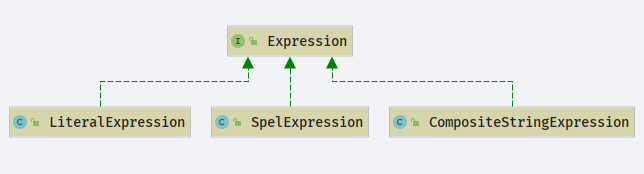
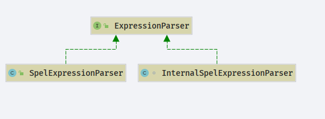
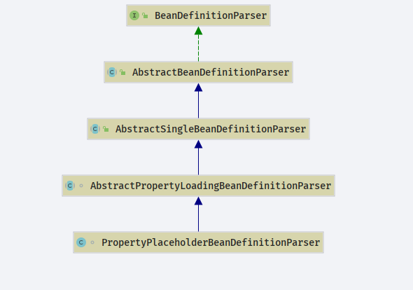
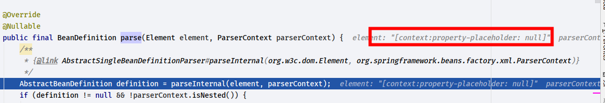

# Spring EL
- Author: [HuiFer](https://github.com/huifer)
- 源码阅读仓库: [huifer-spring](https://github.com/huifer/spring-framework-read)
- 源码地址: `org.springframework.context.expression.StandardBeanExpressionResolver`
- Spring EL 表达式接口: Expression
  - 
- Spring EL 表达式解析接口:ExpressionParser
  - 

- Spring EL 配置类: SpelParserConfiguration


## 配置

```xml
<?xml version="1.0" encoding="UTF-8"?>
<beans xmlns:xsi="http://www.w3.org/2001/XMLSchema-instance"
       xmlns:context="http://www.springframework.org/schema/context"
       xmlns="http://www.springframework.org/schema/beans"
       xsi:schemaLocation="http://www.springframework.org/schema/beans http://www.springframework.org/schema/beans/spring-beans.xsd http://www.springframework.org/schema/context https://www.springframework.org/schema/context/spring-context.xsd">

    <context:property-placeholder/>

    <bean id="eaBean" class="com.huifer.source.spring.el.EaBean">

        <property name="ints">
            <list>
                <array value-type="java.lang.Integer">
                    <value>1</value>
                </array>
                <array value-type="java.lang.Integer">
                    <value>2</value>
                </array>
            </list>
        </property>


        <property name="integerList">
            <list>
                <value>1</value>
            </list>
        </property>

        <property name="map">
            <map>
                <entry key="0" value="0"/>
                <entry key="1" value="0"/>
                <entry key="2" value="0"/>
            </map>
        </property>
        <property name="ebBean" value="#{ebBean}"></property>
    </bean>
    <bean id="ebBean" class="com.huifer.source.spring.el.EbBean">
        <property name="name" value="gg"/>
    </bean>
    <bean class="org.springframework.expression.spel.support.StandardEvaluationContext"/>

    <bean class="org.springframework.expression.spel.standard.SpelExpressionParser">
        <constructor-arg name="configuration">
            <!--设置解析配置选项,SpelParserConfiguration -->
            <!--注:不启用spel的编译模式. -->
            <bean class="org.springframework.expression.spel.SpelParserConfiguration">
                <constructor-arg name="compilerMode">
                    <null/>
                </constructor-arg>
                <constructor-arg name="compilerClassLoader">
                    <null/>
                </constructor-arg>
                <constructor-arg name="autoGrowNullReferences" value="true"/>
                <constructor-arg name="autoGrowCollections" value="true"/>
                <constructor-arg name="maximumAutoGrowSize" value="120"/>
            </bean>
        </constructor-arg>
    </bean>
</beans>
```


### context:property-placeholder

- `org.springframework.context.config.ContextNamespaceHandler`

  ```java
  public class ContextNamespaceHandler extends NamespaceHandlerSupport {
  
      @Override
      public void init() {
          // el
          registerBeanDefinitionParser("property-placeholder", new PropertyPlaceholderBeanDefinitionParser());
          registerBeanDefinitionParser("property-override", new PropertyOverrideBeanDefinitionParser());
          registerBeanDefinitionParser("annotation-config", new AnnotationConfigBeanDefinitionParser());
          registerBeanDefinitionParser("component-scan", new ComponentScanBeanDefinitionParser());
          registerBeanDefinitionParser("load-time-weaver", new LoadTimeWeaverBeanDefinitionParser());
          registerBeanDefinitionParser("spring-configured", new SpringConfiguredBeanDefinitionParser());
          registerBeanDefinitionParser("mbean-export", new MBeanExportBeanDefinitionParser());
          registerBeanDefinitionParser("mbean-server", new MBeanServerBeanDefinitionParser());
      }
  
  }
  ```

  查看目标:`org.springframework.context.config.PropertyPlaceholderBeanDefinitionParser`

- 类图

  


看到继承 `BeanDefinitionParser`先去找`parse`实现方法`org.springframework.beans.factory.xml.AbstractBeanDefinitionParser#parse`


```java
    @Override
    @Nullable
    public final BeanDefinition parse(Element element, ParserContext parserContext) {
        /**
         * {@link AbstractSingleBeanDefinitionParser#parseInternal(org.w3c.dom.Element, org.springframework.beans.factory.xml.ParserContext)}
         */
        AbstractBeanDefinition definition = parseInternal(element, parserContext);
        if (definition != null && !parserContext.isNested()) {
            try {
                // 获取标签的id属性
                String id = resolveId(element, definition, parserContext);
                if (!StringUtils.hasText(id)) {
                    parserContext.getReaderContext().error(
                            "Id is required for element '" + parserContext.getDelegate().getLocalName(element)
                                    + "' when used as a top-level tag", element);
                }
                String[] aliases = null;
                if (shouldParseNameAsAliases()) {
                    // 获取 name 属性
                    String name = element.getAttribute(NAME_ATTRIBUTE);
                    if (StringUtils.hasLength(name)) {
                        aliases = StringUtils.trimArrayElements(StringUtils.commaDelimitedListToStringArray(name));
                    }
                }
                // 将 AbstractBeanDefinition 转换为 BeanDefinitionHolder 并注册
                BeanDefinitionHolder holder = new BeanDefinitionHolder(definition, id, aliases);
                // 注册 BeanDefinitionHolder
                registerBeanDefinition(holder, parserContext.getRegistry());
                if (shouldFireEvents()) {
                    // 监听器处理
                    BeanComponentDefinition componentDefinition = new BeanComponentDefinition(holder);
                    postProcessComponentDefinition(componentDefinition);
                    parserContext.registerComponent(componentDefinition);
                }
            }
            catch (BeanDefinitionStoreException ex) {
                String msg = ex.getMessage();
                parserContext.getReaderContext().error((msg != null ? msg : ex.toString()), element);
                return null;
            }
        }
        return definition;
    }

```




### parseInternal

- `org.springframework.beans.factory.xml.AbstractSingleBeanDefinitionParser#parseInternal`

```java
    @Override
    protected final AbstractBeanDefinition parseInternal(Element element, ParserContext parserContext) {
        //  创建Bean定义构造器
        BeanDefinitionBuilder builder = BeanDefinitionBuilder.genericBeanDefinition();
        // 获取parentName
        String parentName = getParentName(element);
        if (parentName != null) {
            builder.getRawBeanDefinition().setParentName(parentName);
        }
        // 调用自己实现的方法 
        Class<?> beanClass = getBeanClass(element);
        if (beanClass != null) {
            // 设置 class
            builder.getRawBeanDefinition().setBeanClass(beanClass);
        } else {
            // getBeanClassName 同样也是可以在自定义的解析类中实现
            String beanClassName = getBeanClassName(element);
            if (beanClassName != null) {
                // 设置 class
                builder.getRawBeanDefinition().setBeanClassName(beanClassName);
            }
        }
        builder.getRawBeanDefinition().setSource(parserContext.extractSource(element));
        BeanDefinition containingBd = parserContext.getContainingBeanDefinition();
        if (containingBd != null) {
            // Inner bean definition must receive same scope as containing bean.
            // 设置scope
            builder.setScope(containingBd.getScope());
        }
        if (parserContext.isDefaultLazyInit()) {
            // Default-lazy-init applies to custom bean definitions as well.
            // 设置 lazy-init
            builder.setLazyInit(true);
        }

        // 执行解析方法,在自定义解析类中存在com.huifer.source.spring.parser.UserBeanDefinitionParser.doParse
        doParse(element, parserContext, builder);
        return builder.getBeanDefinition();
    }

```


### getBeanClass

- `org.springframework.context.config.PropertyPlaceholderBeanDefinitionParser#getBeanClass`

```java
    @Override
    protected Class<?> getBeanClass(Element element) {
        // As of Spring 3.1, the default value of system-properties-mode has changed from
        // 'FALLBACK' to 'ENVIRONMENT'. This latter value indicates that resolution of
        // placeholders against system properties is a function of the Environment and
        // its current set of PropertySources.
        if (SYSTEM_PROPERTIES_MODE_DEFAULT.equals(element.getAttribute(SYSTEM_PROPERTIES_MODE_ATTRIBUTE))) {
            return PropertySourcesPlaceholderConfigurer.class;
        }

        // The user has explicitly specified a value for system-properties-mode: revert to
        // PropertyPlaceholderConfigurer to ensure backward compatibility with 3.0 and earlier.
        return PropertyPlaceholderConfigurer.class;
    }

```


### doParse

- `org.springframework.context.config.PropertyPlaceholderBeanDefinitionParser#doParse`

  ```java
      @Override
      protected void doParse(Element element, ParserContext parserContext, BeanDefinitionBuilder builder) {
          // 解析并且设置基本属性
          super.doParse(element, parserContext, builder);
  
          builder.addPropertyValue("ignoreUnresolvablePlaceholders",
                  Boolean.valueOf(element.getAttribute("ignore-unresolvable")));
  
          String systemPropertiesModeName = element.getAttribute(SYSTEM_PROPERTIES_MODE_ATTRIBUTE);
          if (StringUtils.hasLength(systemPropertiesModeName) &&
                  !systemPropertiesModeName.equals(SYSTEM_PROPERTIES_MODE_DEFAULT)) {
              builder.addPropertyValue("systemPropertiesModeName", "SYSTEM_PROPERTIES_MODE_" + systemPropertiesModeName);
          }
  
          if (element.hasAttribute("value-separator")) {
              builder.addPropertyValue("valueSeparator", element.getAttribute("value-separator"));
          }
          if (element.hasAttribute("trim-values")) {
              builder.addPropertyValue("trimValues", element.getAttribute("trim-values"));
          }
          if (element.hasAttribute("null-value")) {
              builder.addPropertyValue("nullValue", element.getAttribute("null-value"));
          }
      }
  
  ```

  

  - `org.springframework.context.config.AbstractPropertyLoadingBeanDefinitionParser#doParse`

    ```java
    @Override
        protected void doParse(Element element, ParserContext parserContext, BeanDefinitionBuilder builder) {
            // 获取 location 属性
            String location = element.getAttribute("location");
            if (StringUtils.hasLength(location)) {
                // 路径解析
                location = parserContext.getReaderContext().getEnvironment().resolvePlaceholders(location);
                // 分割
                String[] locations = StringUtils.commaDelimitedListToStringArray(location);
                // 设置路径
                builder.addPropertyValue("locations", locations);
            }
    
            // 获取 properties-ref 属性
            String propertiesRef = element.getAttribute("properties-ref");
            if (StringUtils.hasLength(propertiesRef)) {
                // 添加 properties
                builder.addPropertyReference("properties", propertiesRef);
            }
            // 获取 file-encoding 文件编码
            String fileEncoding = element.getAttribute("file-encoding");
            if (StringUtils.hasLength(fileEncoding)) {
                // 设置文件编码
                builder.addPropertyValue("fileEncoding", fileEncoding);
            }
            // 获取 order 属性
            String order = element.getAttribute("order");
            if (StringUtils.hasLength(order)) {
                // 添加 order 值
                builder.addPropertyValue("order", Integer.valueOf(order));
            }
    
            builder.addPropertyValue("ignoreResourceNotFound",
                    Boolean.valueOf(element.getAttribute("ignore-resource-not-found")));
    
            builder.addPropertyValue("localOverride",
                    Boolean.valueOf(element.getAttribute("local-override")));
    
            builder.setRole(BeanDefinition.ROLE_INFRASTRUCTURE);
        }
    ```

    


## ExpressionParser

- 表达式解析器


