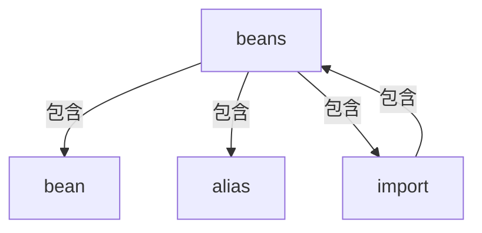

# 第三章 IoC 资源读取及注册
- 本章笔者将带领各位读者了解在 XML 模式下 Spring 是如何将其进行解析成 BeanDefinition 对象的. 本文围绕三点进行分析， 第一点是关于 **XML 文档的验证**， 第二点是关于 **Document 对象的获取**， 第三点是关于 **XML 解析成 BeanDefinition 并注册**. 


##  3.1 XML 文档验证


###  3.1.1 认识 XML 验证模式

首先不得不承认现今的各类编辑器的智能提示功能都很强大，它们可以帮我们来减少编写 XML 时出错的可能， 但从程序员的角度来说我们还是需要去对 XML 进行数据验证. 

- 对于 XML 文档的验证在 XML 提出之时就有一个验证方式， 各类语言的验证也基本上是围绕这个验证规则进行开发的. 一般常用的验证方式是**DTD(Document_Type_Definition)** 验证

> DTD 的定义:
>
> - A **document type definition** (**DTD**) is a set of *markup declarations* that define a *document type* for an [SGML](https://en.wikipedia.org/wiki/SGML)-family [markup language](https://en.wikipedia.org/wiki/Markup_language) ([GML](https://en.wikipedia.org/wiki/IBM_Generalized_Markup_Language)， [SGML](https://en.wikipedia.org/wiki/SGML)， [XML](https://en.wikipedia.org/wiki/XML)， [HTML](https://en.wikipedia.org/wiki/HTML)).
> - from: [wiki](https://en.wikipedia.org/wiki/Document_type_definition)


- 除了 **DTD** 以外我们还有另外一种 **XSD(XML_Schema_Definition)** 验证方式. 

> XSD 的定义:
>
> - **XSD** (**XML Schema Definition**)， a recommendation of the World Wide Web Consortium ([W3C](https://en.wikipedia.org/wiki/W3C))， specifies how to formally describe the elements in an Extensible Markup Language ([XML](https://en.wikipedia.org/wiki/XML)) document. It can be used by programmers to verify each piece of item content in a document. They can check if it adheres to the description of the element it is placed in.[[1\]](https://en.wikipedia.org/wiki/XML_Schema_(W3C)#cite_note-1)
> - from: [wiki](https://en.wikipedia.org/wiki/XML_Schema_(W3C))


- 现在我们了解两种 XML 的验证方式: **DTD**、**XSD** 这两者的验证都是根据文档本身出发， 即需要事先编辑好两种类型的文件 (拓展名: `*.dtd` 、`*.XSD` ) ， 在这两种类型文件中存储了关于 Spring 所支持的标签， 那么它们具体存储在那个地方呢? 这些预定义的文件放在 **spring-beans** 的资源文件中

  


###  3.1.2 Spring 中 XML 的验证

在 [3.1.1 认识 XML 验证模式] 中我们了解了关于 XML 的验证方式， 下面我来看看在 Spring 中是如何处理 XML 验证的. 

在前文我们已经知道了两种验证模式， 那么对于 Spring 来说它需要确定具体的一个验证模式. 

目标： **找到 Spring 推测出 XML 验证方式的代码**

- 这段代码是由 `XmlBeanDefinitionReader#getValidationModeForResource` 所提供的 (完整方法签名: `org.springframework.beans.factory.xml.XmlBeanDefinitionReader#getValidationModeForResource`) .


Spring 推测验证方式的代码如下 

```java
protected int getValidationModeForResource(Resource resource) {
   // 获取 xml 验证方式
   int validationModeToUse = getValidationMode();
   if (validationModeToUse != VALIDATION_AUTO) {
      return validationModeToUse;
   }
   int detectedMode = detectValidationMode(resource);
   if (detectedMode != VALIDATION_AUTO) {
      return detectedMode;
   }
   // Hmm， we didn't get a clear indication... Let's assume XSD，
   // since apparently no DTD declaration has been found up until
   // detection stopped (before finding the document's root tag).
   return VALIDATION_XSD;
}
```


具体的获取方式:

1. 从成员变量中获取(成员变量: `validationMode`)
2. 交给`XmlValidationModeDetector` 类进行处理， 具体处理方法签名: `org.springframework.util.xml.XmlValidationModeDetector#detectValidationMode`


我们来看方法 `detectValidationMode` 具体的推测方式

```JAVA
public int detectValidationMode(InputStream inputStream) throws IOException {
   // Peek into the file to look for DOCTYPE.
   BufferedReader reader = new BufferedReader(new InputStreamReader(inputStream));
   try {
      boolean isDtdValidated = false;
      String content;
      while ((content = reader.readLine()) != null) {
         content = consumeCommentTokens(content);
         if (this.inComment || !StringUtils.hasText(content)) {
            continue;
         }
         if (hasDoctype(content)) {
            isDtdValidated = true;
            break;
         }
         if (hasOpeningTag(content)) {
            // End of meaningful data...
            break;
         }
      }
      return (isDtdValidated ? VALIDATION_DTD : VALIDATION_XSD);
   }
   catch (CharConversionException ex) {
      // Choked on some character encoding...
      // Leave the decision up to the caller.
      return VALIDATION_AUTO;
   }
   finally {
      reader.close();
   }
}
```

别看这段代码很长， 其中最关键的代码是

```java
if (hasDoctype(content)) {
   isDtdValidated = true;
   break;
}
```

在这段代码👆中 `hasDoctype` 很关键 这段就是做字符串判断: 字符串是否包含 `DOCTYPE` 字符串


此时我们可以下定论: **Spring 中 `XmlValidationModeDetector` 对验证模式的确认是循环 xml 整个文件的每一行判断是否有 `DOCTYPE` 字符串， 包含就是 DTD 验证模式， 不包含就是 XSD 模式**


关于 XML 的验证方式笔者到这儿就算是分析完成了. 下面我们将进入 `Document` 对象获取的分析中


##  3.2 Document 对象获取

首先我们需要知道 `Document` 对象从谁那里获得， 不必多说各位肯定可以想到这是从 XML 文件中获取. 那么 Spring 中谁负责这个功能呢? **Spring 中将读取输入流转换成 `Document` 对象的重任交给了 `DocumentLoader` 接口**. 

下面我们来看一下 `DocumentLoader` 的定义


```java
public interface DocumentLoader {

	Document loadDocument(
    	  	InputSource inputSource， EntityResolver entityResolver，
      		ErrorHandler errorHandler， int validationMode， boolean namespaceAware)
        throws Exception;
}
```


从这个接口定义上来看笔者这里会有一个疑问给各位: 参数是`InputSource` 但是我们在使用的时候都传递的是一个字符串(Spring xml 配置文件的文件地址) ， 那这个 `InputSource` 的处理过程是在哪儿呢? 

- 处理方法在: `org.springframework.beans.factory.xml.XmlBeanDefinitionReader#loadBeanDefinitions(org.springframework.core.io.support.EncodedResource)` 中

  在这个方法中有下面这段代码. 这便是 XML 文件转换成 `InputSource` 的方式. 

```java
// 省略了前候代码
InputStream inputStream = encodedResource.getResource().getInputStream();
try {
 InputSource inputSource = new InputSource(inputStream);
 if (encodedResource.getEncoding() != null) {
    inputSource.setEncoding(encodedResource.getEncoding());
 }
 return doLoadBeanDefinitions(inputSource， encodedResource.getResource());
```


在了解了 `InputSource` 来源之后我们就可以去关注 `DocumentLoader` 的实现类了. Spring 中 `DocumentLoader` 有且仅有一个实现类 `DefaultDocumentLoader` 下面我们就来看看这个实现类的一些细节吧. 


```java
@Override
public Document loadDocument(InputSource inputSource， EntityResolver entityResolver，
      ErrorHandler errorHandler， int validationMode， boolean namespaceAware) throws Exception {

   // 创建 xml document 构建工具
   DocumentBuilderFactory factory = createDocumentBuilderFactory(validationMode， namespaceAware);
   if (logger.isTraceEnabled()) {
      logger.trace("Using JAXP provider [" + factory.getClass().getName() + "]");
   }

   // documentBuilder 类创建
   DocumentBuilder builder = createDocumentBuilder(factory， entityResolver， errorHandler);
   return builder.parse(inputSource);
}
```


在做 `InputSource` 转换 `Document` 的方法中主要使用到的是属于 `javax.xml` 和 `org.w3c` 包下的类或者接口， 这部分内容就不具体展开， 各位读者可以根据自己的需求. 


##  3.3 BeanDefinition 注册


通过前面的学习我们得到了 `Document` 对象， 下面我们就需要去看 BeanDefinition 的注册了. 这一段完整的流程代码在`org.springframework.beans.factory.xml.XmlBeanDefinitionReader#doLoadBeanDefinitions` 方法中有体现， 下面笔者将贴出核心代码. 


```java
// 去掉了异常处理和日志
protected int doLoadBeanDefinitions(InputSource inputSource， Resource resource)
      throws BeanDefinitionStoreException {
    // 将 输入流转换成 Document
    Document doc = doLoadDocument(inputSource， resource);
    // 注册bean定义，并获取数量
    int count = registerBeanDefinitions(doc， resource);
    return count;
}
```


这一章节中我们需要重点关注的方法是 `registerBeanDefinitions` 继续寻找我们的目标方法


```JAVA
public int registerBeanDefinitions(Document doc， Resource resource) throws BeanDefinitionStoreException {
   // 获取 基于 Document 的Bean定义读取器
   BeanDefinitionDocumentReader documentReader = createBeanDefinitionDocumentReader();
   // 历史已有的bean定义数量
   int countBefore = getRegistry().getBeanDefinitionCount();
   // 注册bean定义
   documentReader.registerBeanDefinitions(doc， createReaderContext(resource));
   // 注册后的数量-历史数量
   return getRegistry().getBeanDefinitionCount() - countBefore;
}
```


在我们找到上面方法并进行阅读后我们可以找到最重要的类 (接口) 已经浮现出来了 ， `BeanDefinitionDocumentReader` 重点对象，  `registerBeanDefinitions` 重点方法. 


目标: **了解 `BeanDefinitionDocumentReader#registerBeanDefinitions` 做了什么**


在开始方法分析(实现类分析) 之前我们先来对 `BeanDefinitionDocumentReader` 接口做一个了解， 主要了解接口的作用. 

`BeanDefinitionDocumentReader` 的作用就是进行 BeanDefinition 的注册

```java
public interface BeanDefinitionDocumentReader {

   /**
    * 注册 bean 定义
    */
   void registerBeanDefinitions(Document doc， XmlReaderContext readerContext)
         throws BeanDefinitionStoreException;

}
```


找到 `BeanDefinitionDocumentReader` 的实现类 `DefaultBeanDefinitionDocumentReader` 直接奔 `registerBeanDefinitions` 方法去. 

我们可以看到下面这样一段代码. 

```java
@Override
public void registerBeanDefinitions(Document doc， XmlReaderContext readerContext) {
   this.readerContext = readerContext;
   doRegisterBeanDefinitions(doc.getDocumentElement());
}
```

在这段代码中 `doRegisterBeanDefinitions` 就是 Spring 进行 `Document` 对象解析， 并将解析结果包装成 `BeanDefinition` 进行注册的核心方法， 它的方法签名是:  `org.springframework.beans.factory.xml.DefaultBeanDefinitionDocumentReader#doRegisterBeanDefinitions` ， 这个方法就是我们需要重点关注的方法( 处理 XML 模式下 Bean定义注册的核心). 


下面正式开始 `doRegisterBeanDefinitions` 的分析


###  3.3.1. doRegisterBeanDefinitions 流程

- 首先我们将 `doRegisterBeanDefinitions` 的代码全部贴出来， 来说一说这个方法里面的流程. 下面请各位阅读这段代码


```java
// 删除了注释和日志
protected void doRegisterBeanDefinitions(Element root) {
   // 父 BeanDefinitionParserDelegate 一开始为null
   BeanDefinitionParserDelegate parent = this.delegate;
   // 创建 BeanDefinitionParserDelegate
   this.delegate = createDelegate(getReaderContext()， root， parent);

   // 判断命名空间是否为默认的命名空间
   // 默认命名空间: http://www.springframework.org/schema/beans
   if (this.delegate.isDefaultNamespace(root)) {
      // 获取 profile 属性
      String profileSpec = root.getAttribute(PROFILE_ATTRIBUTE);
      // 是否存在 profile
      if (StringUtils.hasText(profileSpec)) {
         // profile 切分后的数据
         String[] specifiedProfiles = StringUtils.tokenizeToStringArray(
               profileSpec， BeanDefinitionParserDelegate.MULTI_VALUE_ATTRIBUTE_DELIMITERS);
         if (!getReaderContext().getEnvironment().acceptsProfiles(specifiedProfiles)) {
            return;
         }
      }
   }

   // 前置处理
   preProcessXml(root);
   // bean definition 处理
   parseBeanDefinitions(root， this.delegate);
   // 后置 xml 处理
   postProcessXml(root);

   this.delegate = parent;
}
```


前文说到我们目标是了解这个方法的整体流程， 下面各位读者可以一点点列一列， 笔者这里给出一个流程

1. 设置父`BeanDefinitionParserDelegate` 对象， 值得注意的是这个设置父对象一般情况下是不存在的即 `this.delegate = null `
2. 创建 `BeanDefinitionParserDelegate` 对象 ， `BeanDefinitionParserDelegate` 对象是作为解析的重要方法. 
3. 对于 `profile` 属性的处理
4. XML 解析的前置处理
5. XML 的解析处理
6. XML 解析的后置处理
7. 设置成员变量


这里提一个拓展点 `profile` 这个属性在 Spring 中一般用来做环境区分， 在 SpringBoot 中有一个类似的配置`spring.profiles`  . 在 Spring XML 模式中 `profile` 是属于 `<beans/>` 的一个属性， 各位读者如果感兴趣可以自行搜索相关资料， 笔者这里不展开介绍. 


 在 Spring 中 `preProcessXml` 和 `postProcessXml` 方法目前属于空方法状态， 没有任何实现代码，因此我们的分析目标是: **`parseBeanDefinitions`** 方法


###  3.3.2 parseBeanDefinitions 分析

- 分析之前我们还是将代码直接贴出来， 先看整体流程在追求细节


```JAVA
protected void parseBeanDefinitions(Element root， BeanDefinitionParserDelegate delegate) {
   // 是否是默认的命名空间
   if (delegate.isDefaultNamespace(root)) {
      // 子节点列表
      NodeList nl = root.getChildNodes();
      for (int i = 0; i < nl.getLength(); i++) {
         Node node = nl.item(i);
         if (node instanceof Element) {
            Element ele = (Element) node;
            // 是否是默认的命名空间
            if (delegate.isDefaultNamespace(ele)) {
               // 处理标签的方法
               parseDefaultElement(ele， delegate);
            }
            else {
               // 处理自定义标签
               delegate.parseCustomElement(ele);
            }
         }
      }
   }
   else {
      // 处理自定义标签
      delegate.parseCustomElement(root);
   }
}
```


`parseBeanDefinitions` 方法主要是对一个 `Element` 的每个节点进行处理， 节点本身又存在多样性， 

-  节点的多样性(xml标签在这里彼此称之为节点， 可能会和大部分人的说法相冲突， 请各位谅解)
	1. Spring 提供的标签: 即 DTD 或者 XSD 中定义的标签
	2. 自定义标签 
	
	根据节点多样性 Spring 提供了两个方法进行处理 `parseDefaultElement` 和 `delegate.parseCustomElement(ele)` 这两个方法也将是我们下面分析的重点

值得注意的是 `Element` 也有可能是自定义的. 


###  3.3.3 parseDefaultElement Spring 原生标签的处理


在前文我们已经了解到了两种标签的处理， 我们先展开 Spring 原生标签的处理， 那么 Spring 的原生标签有那些呢？ 

- Spring 的原生标签
  1. alias 标签
  2. bean 标签
  3. beans 标签
  4. import 标签


在开始分析标签解析之前我们需要先认识一下标签的结构， 这个其实就要回到笔者在本章(第三章) 

这里对于层级结构仅仅只是对 `alias` 、`import` 、`bean` 和 `beans` 四个标签做一个说明.

笔者这里将以 `spring-beans.dtd` 文件作为基础进行描述 标签层级结构

```xml-dtd
<!ELEMENT beans (
   description?，
   (import | alias | bean)*
)>
```

从这个结构体来看包含关系: **`beans` 下包含 `import`、 `alias` 和 `bean` 三个标签**


下面我们来看 `parseDefaultElement` 的代码内容

```java
private void parseDefaultElement(Element ele， BeanDefinitionParserDelegate delegate) {
   // 解析 import 标签
   if (delegate.nodeNameEquals(ele， IMPORT_ELEMENT)) {
      importBeanDefinitionResource(ele);
   }
   // 解析 alias 标签
   else if (delegate.nodeNameEquals(ele， ALIAS_ELEMENT)) {
      processAliasRegistration(ele);
   }
   // 解析 bean 标签
   else if (delegate.nodeNameEquals(ele， BEAN_ELEMENT)) {
      processBeanDefinition(ele， delegate);
   }
   // 解析 beans 标签
   // 嵌套的 beans
   else if (delegate.nodeNameEquals(ele， NESTED_BEANS_ELEMENT)) {
      // recurse
      doRegisterBeanDefinitions(ele);
   }
}
```


- 根据前文所说的标签包含关系再来看这段代码. 我们可以将最后一个 `else if` 给忽略. 就把这个当作是处理 `import`、 `alias` 、 `bean` 标签的方法即可. 


现在我们有了三个目标(问题)

1.  **`import` 标签是如何解析的？**
2.  **`alias` 标签是如何解析的？**
3.  **`bean` 标签是如何解析的？**

- 下面笔者就将围绕这三个目标(问题)进行分析


###  3.3.3.4 import 标签解析

- 首先我们找到 `import` 标签解析的方法: `org.springframework.beans.factory.xml.DefaultBeanDefinitionDocumentReader#importBeanDefinitionResource`


由于 `importBeanDefinitionResource` 方法是一个比较大的方法 笔者这里将其分为几部分进行分别叙述


####  3.3.4.1 import 标签解析的环境搭建

在开始前我们先做基本测试用例的搭建. 注意这里笔者会沿用第一章中搭建的基本工程作为 import 的数据. 下面就开始编写代码吧. 

1. 首先我们创建一个 Spring XML 配置文件， 名称为`import-beans.xml` .  向文件中填充代码

```xml
<?xml version="1.0" encoding="UTF-8"?>
<beans xmlns="http://www.springframework.org/schema/beans"
       xmlns:xsi="http://www.w3.org/2001/XMLSchema-instance"
       xsi:schemaLocation="http://www.springframework.org/schema/beans http://www.springframework.org/schema/beans/spring-beans.xsd">

    <import resource="first-ioc.xml"/>
</beans>
```

2. 编写测试用例

```java
class ImportNodeTest {

    @Test
    void testImportNode() {
        ClassPathXmlApplicationContext context
                = new ClassPathXmlApplicationContext("META-INF/import-beans.xml");
        context.close();
    }

}
```


下面我们看一下文件结构


这些准备工作完成之后我们就可以开始进行真正的分析了. 


####  3.3.4.2 import 标签的定义

首先笔者将 `import-beans.xml` 文件中的 `import` 标签提取出来 `<import resource="first-ioc.xml"/>` 

在 `import` 标签中我们观察到了一个属性 `resoruce` 那么它在 DTD 和 XSD 两个文件中的定义是什么样子的， 是否还有其他属性存在？ 下面我们来阅读 `spring-beans.xsd` 和 `spring-beans.dtd` 中对于 `import` 标签的定义

- `spring-beans.dtd` 中对于 `import` 标签的定义

```xml-dtd
<!--
   Specifies an XML bean definition resource to import.
-->
<!ELEMENT import EMPTY>

<!--
   The relative resource location of the XML bean definition file to import，
   for example "myImport.xml" or "includes/myImport.xml" or "../myImport.xml".
-->
<!ATTLIST import resource CDATA #REQUIRED>
```

- `spring-beans.xsd` 中对于 `import` 标签的定义

```xml
<xsd:element name="import">
   <xsd:annotation>
      <xsd:documentation source="java:org.springframework.core.io.Resource"><![CDATA[
Specifies an XML bean definition resource to import.
      ]]></xsd:documentation>
   </xsd:annotation>
   <xsd:complexType>
      <xsd:complexContent>
         <xsd:restriction base="xsd:anyType">
            <xsd:attribute name="resource" type="xsd:string" use="required">
               <xsd:annotation>
                  <xsd:documentation><![CDATA[
The relative resource location of the XML (bean definition) file to import，
for example "myImport.xml" or "includes/myImport.xml" or "../myImport.xml".
                  ]]></xsd:documentation>
               </xsd:annotation>
            </xsd:attribute>
         </xsd:restriction>
      </xsd:complexContent>
   </xsd:complexType>
</xsd:element>
```

从 `spring-beans.dtd` 和 `spring-beans.xsd` 中的描述来看 `import` 标签确实只有 `resource` 一个属性. 


- 在了解了 `import` 标签定义后我们开始正式的代码分析. 


####  3.3.4.3 import 标签解析第一部分: 处理 resource 属性

在 `importBeanDefinitionResource` 的第一部分代码中是将 `import` 中的 `resource` 属性获取出来， 转换成资源对象 `Resource` 集合


- 第一部分的代码如下

```java
// 获取 resource 属性
String location = ele.getAttribute(RESOURCE_ATTRIBUTE);
// 是否存在地址
if (!StringUtils.hasText(location)) {
   getReaderContext().error("Resource location must not be empty"， ele);
   return;
}

// 处理配置文件占位符
location = getReaderContext().getEnvironment().resolveRequiredPlaceholders(location);

// 资源集合
Set<Resource> actualResources = new LinkedHashSet<>(4);

// 是不是绝对地址
boolean absoluteLocation = false;
try {
   // 1. 判断是否为 url
   // 2. 通过转换成URI判断是否是绝对地址
   absoluteLocation = ResourcePatternUtils.isUrl(location) || ResourceUtils.toURI(location).isAbsolute();
}
catch (URISyntaxException ex) {
}
```


这里我们是解析 `import` 标签， 那么我们将配置文件中的标签内容对比着看

```xml
<import resource="first-ioc.xml"/>
```


第一句必然是将 `import` 标签的 `resource`  属性获取， 即 `location = first-ioc.xml`

配合测试用例进行 debug 可以看到下面这样的信息


继续往下走 `location` 会背进行二次处理， 处理什么呢？ Spring 在这里对其进行占位符的处理， 占位符可能是 `${}` 在这里会将其转换成一个具体的地址

这里各位如果感兴趣可以考虑阅读: `PropertyResolver` 接口的实现， 


对于 `location` 的二次处理后 Spring 紧接着做了一次是否是绝对路径的判断. 

1. 判断是否为 url
2. 通过转换成URI判断是否是绝对地址


这里对于 `absoluteLocation` 的模拟可能比较麻烦， 笔者这里不做展开.  下面我们来看第二第三部分的代码


####  3.3.4.4 import 标签解析的第二部分和第三部分 重回 loadBeanDefinitions

首先将代码贴出请各位读者进行基础阅读. 


```java
// 删除了异常处理和日志
// 第二部分
// Absolute or relative?
// 是不是绝对地址
if (absoluteLocation) {
      // 获取 import 的数量(bean定义的数量)
    int importCount = getReaderContext().getReader().loadBeanDefinitions(location， actualResources);
}
// 第三部分
else {
    // import 的数量
    int importCount;
    // 资源信息
    Resource relativeResource = getReaderContext().getResource().createRelative(location);
    // 资源是否存在
    if (relativeResource.exists()) {
        // 确定加载的bean定义数量
        importCount = getReaderContext().getReader().loadBeanDefinitions(relativeResource);
        // 加入资源集合
        actualResources.add(relativeResource);
    }
    // 资源不存在处理方案
    else {
        // 获取资源URL的数据
        String baseLocation = getReaderContext().getResource().getURL().toString();
        // 获取import数量
        importCount = getReaderContext().getReader().loadBeanDefinitions(
            StringUtils.applyRelativePath(baseLocation， location)， actualResources);
    }
}
```


虽然我们对于 `absoluteLocation` 变量的模拟比较麻烦但是我们通过观察， 这里主要做的事情就是在做 `loadBeanDefinitions` ，这个方法不知道读者是否熟悉， 看着和 `doLoadBeanDefinitions` 有点相似. 事实上这就是一个同源方法. 在第二部分第三部分代码中这段代码 `getReaderContext().getReader().loadBeanDefinitions` 就是核心. 那这个核心又是在做 `beans` 标签解析了. 这里就是一个嵌套处理. 那么我们需要理清楚这个嵌套关系， 

前文我们聊了关于 `beans`、 `bean` 、`alias` 和 `import` 的关系. 现在我们发现 `import` 里面存放的是一个 `beans`   . 这个关系就是下面这个图





根据这样一个包含关系图我们可以将更多的重点放在 `bean` 和 `alias` 标签的解析中. 


####  3.3.4.5 import 标签解析的第四部分 import 事件处理

- 最后我们来看 `import` 标签解析的第四部分代码

```java
// 第四部分
Resource[] actResArray = actualResources.toArray(new Resource[0]);
// 唤醒 import 处理事件
getReaderContext().fireImportProcessed(location， actResArray， extractSource(ele));
```


`import` 标签解析的第四部分就是做事件发布. 

我们来看看事件发布到底做了什么. 在当前事件发布的核心处理是依靠 `ReaderEventListener` 对象的

在这里对于 import 事件处理`fireImportProcessed` 本质上是`org.springframework.beans.testfixture.beans.CollectingReaderEventListener#importProcessed` 方法

这里就是存储了一个 `ImportDefinition` 对象

下面我们来看看详细代码

- 事件的处理核心

```java
@Override
public void importProcessed(ImportDefinition importDefinition) {
   this.imports.add(importDefinition);
}
```

- 存储容器 `imports` 

```java
private final List<ImportDefinition> imports = new LinkedList<>();
```


值得注意的是在 Spring 中 事件监听器 `eventListener` 是 `EmptyReaderEventListener` 实现， 笔者在上文所说的是 `CollectingReaderEventListener` 实现， 


- `EmptyReaderEventListener` 这个实现类中什么都没有做. 

```java
public class EmptyReaderEventListener implements ReaderEventListener {

   @Override
   public void defaultsRegistered(DefaultsDefinition defaultsDefinition) {
      // no-op
   }

   @Override
   public void componentRegistered(ComponentDefinition componentDefinition) {
      // no-op
   }

   @Override
   public void aliasRegistered(AliasDefinition aliasDefinition) {
      // no-op
   }

   @Override
   public void importProcessed(ImportDefinition importDefinition) {
      // no-op
   }

}
```


这里的结论是在 debug 中发现的. 


好的. 到这里 `import` 标签的解析全部完成. 下面将和各位读者分享 `alias` 标签的解析


###  3.3.5 标签解析

在这一节笔者将带领各位读者来了解 `alias` 标签的解析过程， 在开始分析之前我们需要先找到我们的分析目标: `org.springframework.beans.factory.xml.DefaultBeanDefinitionDocumentReader#processAliasRegistration`


####  3.3.5.1 alias 标签解析的环境搭建


在开始进行 `alias` 标签解析的方法分析前我们先做基本测试用例的搭建. 注意在这里笔者将会延用第一章中的 `PeopleBean` 作为部分资源. 下面来进行代码编辑. 


1. 首先我们创建一个 Spring XML 配置文件， 名称为 `alias-node.xml` .  向文件中填充代码

```xml
<?xml version="1.0" encoding="UTF-8"?>
<beans xmlns:xsi="http://www.w3.org/2001/XMLSchema-instance"
       xmlns="http://www.springframework.org/schema/beans"
       xsi:schemaLocation="http://www.springframework.org/schema/beans http://www.springframework.org/schema/beans/spring-beans.xsd">


    <alias name="people" alias="p1"/>
    <bean id="people" class="com.source.hot.ioc.book.pojo.PeopleBean">
        <property name="name" value="zhangsan"/>
    </bean>
</beans>
```


2. 编写测试用例


```java
class AliasNodeTest {

     @Test
    void testAlias(){
         ClassPathXmlApplicationContext context
                 = new ClassPathXmlApplicationContext("META-INF/alias-node.xml");

         Object people = context.getBean("people");
         Object p1 = context.getBean("p1");

         assert people.equals(p1);
     }
}
```


下面我们来看一下此时的目录结构


准备工作我们现在就都做完了， 下面就正是进入 `processAliasRegistration` 方法的分析


####  3.3.5.2 alias 标签的定义及含义

首先笔者将 `alias-node.xml` 文件中的 `alias` 标签提取出来: `<alias name="people" alias="p1"/>` 各位可以看到 `alias` 标签中存在两个属性， 第一个是 `name` ， 第二个是 `alias` . 这个标签可以这么理解: `people` 又被称为 `p1` . 关于 `name` 和 `alias` 属性的定义在 `spring-beans.dtd` 和 `spring-beans.xsd` 中都有提到， 笔者这里做一个简单摘要


- `spring-beans.dtd` 中对于 `alias` 标签的定义

```xml-dtd
<!ELEMENT alias EMPTY>

<!--
   The name of the bean to define an alias for.
-->
<!ATTLIST alias name CDATA #REQUIRED>

<!--
   The alias name to define for the bean.
-->
<!ATTLIST alias alias CDATA #REQUIRED>
```


- `spring-beans.xsd` 中对于 `alias` 标签的定义

```xml
<xsd:element name="alias">
   <xsd:annotation>
      <xsd:documentation><![CDATA[
Defines an alias for a bean (which can reside in a different definition
resource).
      ]]></xsd:documentation>
   </xsd:annotation>
   <xsd:complexType>
      <xsd:complexContent>
         <xsd:restriction base="xsd:anyType">
            <xsd:attribute name="name" type="xsd:string" use="required">
               <xsd:annotation>
                  <xsd:documentation><![CDATA[
The name of the bean to define an alias for.
                  ]]></xsd:documentation>
               </xsd:annotation>
            </xsd:attribute>
            <xsd:attribute name="alias" type="xsd:string" use="required">
               <xsd:annotation>
                  <xsd:documentation><![CDATA[
The alias name to define for the bean.
                  ]]></xsd:documentation>
               </xsd:annotation>
            </xsd:attribute>
         </xsd:restriction>
      </xsd:complexContent>
   </xsd:complexType>
</xsd:element>
```


####  3.3.5.3 processAliasRegistration 方法分析

在前文我们已经了解 `alias` 标签的属性有 `name` 和 `alias` 现在我们来看 `processAliasRegistration` 前两行代码 

```java
// 获取 name 属性
String name = ele.getAttribute(NAME_ATTRIBUTE);
// 获取 alias 属性
String alias = ele.getAttribute(ALIAS_ATTRIBUTE);
```

在这两行代码中 Spring 就做了一个事情: **读取标签属性**。

Spring 在完成属性获取之后做了属性值的验证具体代码如下

```java
boolean valid = true;
// name 属性验证
if (!StringUtils.hasText(name)) {
   getReaderContext().error("Name must not be empty"， ele);
   valid = false;
}
// alias 属性验证
if (!StringUtils.hasText(alias)) {
   getReaderContext().error("Alias must not be empty"， ele);
   valid = false;
}
```

在这儿 Spring 对 `name` 和 `alias` 做了非空判断(`!StringUtils.hasText`) 也就是说当我们在 XML 编写中忘记编写了 `alias` 标签两个属性中的任何一个都会出现异常信息.  下面笔者来进行一个模拟操作. 

- 异常模拟: 将 `<alias name="people" alias="p1"/>` 修改成 `<alias name="people" alias=""/>` 用来模拟 `alias` 属性不存在的情况. 

  此时在运行我们的测试方法就会出现下面这个异常信息


```
Configuration problem: Alias must not be empty
Offending resource: class path resource [META-INF/alias-node.xml]
org.springframework.beans.factory.parsing.BeanDefinitionParsingException: Configuration problem: Alias must not be empty
Offending resource: class path resource [META-INF/alias-node.xml]

```

省略了堆栈信息这不是一个完整的异常输出. 详细异常各位读者可以自行尝试后得到. 


回到 `processAliasRegistration` 方法中来， 在通过验证之后 Spring 做了什么? 

我们先来看代码

```java
// 删除了异常处理
if (valid) {
   // 注册
   getReaderContext().getRegistry().registerAlias(name， alias);

   // alias注册事件触发
   getReaderContext().fireAliasRegistered(name， alias， extractSource(ele));
}
```

从代码上看我们可以知道 Spring 做了两件事情

1. 别名注册
2. 别名注册事件的出发

有关别名注册各位读者可以阅读关于 `AliasRegistry` 接口和它的实现类. 笔者在[第五章](/docs/ch-05/第五章-别名注册.md)会做一个完整的讲解


####  3.3.5.4 别名注册

笔者在这里简单介绍一下关于别名的处理. 

在 `registerAlias(name， alias);` 这段代码中可以看到参数是 `name` 和 `alias` 两个属性. 别名注册必定和这两个参数有关. 笔者提出一个问题**如何进行关系的绑定？**

- 思考这个问题的时候我们不妨来聊一聊昵称. 比如有一个人叫做张三， 在使用 QQ 的时候叫做王五， 在使用微信的时候叫做李四. 此时李四和王五这两个名字都是张三的别名. 这里的关系可以是 **真名一对多别名**， 也可以是**别名一对一真名**. 这里我们就需要做出选择， 如何做好数据结构. 

  真名一对多别名: `Map<String，List<String>>`

  别名一对一真名: `Map<String，String>`


在我们思考了这个问题后我们来看 Spring 做了什么选择. Spring 选择了 **别名一对一真名**， 下面是 Spring 存储别名的容器对象. 

```java
private final Map<String， String> aliasMap = new ConcurrentHashMap<>(16);
```

根据数据结构的定义我们就知道了这个容器 key 和 value 存储的是什么了. 这便是 `alias` 标签信息的存储， 下面我们来看看 debug 是否和我们的推论一样

推论: key: p1 value: people

- debug 截图


可以从图中发现， 我们的推论是一个正确的推论. 


下面还剩下关于 `alias` 标签处理的最后一步， 发布事件. 


####  3.3.5.5 别名事件处理

首先我们来看发布事件的方法 `getReaderContext().fireAliasRegistered(name， alias， extractSource(ele))` ， 我们在找到这段代码之后好需要找到真正的实现方法

- 真正的实现方法

```java
public void fireAliasRegistered(String beanName， String alias， @Nullable Object source) {
   this.eventListener.aliasRegistered(new AliasDefinition(beanName， alias， source));
}
```


在这个方法中我们可以和 `import` 标签的事件处理进行对比. 在 `import` 标签处理中我们知道了 `ReaderEventListener eventListener` 有两个实现类. 1: `CollectingReaderEventListener` 2: `EmptyReaderEventListener`

当时我们再看 `import` 事件处理的时候 `eventListener` 是 `EmptyReaderEventListener` 类型， 在里面所有方法都是空方法， 此时在处理 `alias` 标签的时候它依旧是 `EmptyReaderEventListener` 类型. 当然就什么都没有做了. 不过我们还是需要来看看 `CollectingReaderEventListener` 在处理别名事件的时候做了什么. 

在 `CollectingReaderEventListener` 中定义了下面这个成员变量

```java
private final Map<String， List<AliasDefinition>> aliasMap = new LinkedHashMap<>(8);
```

我们来看看这个成员变量的 key 和 value 分别是什么. 

key: `alias` 标签中的 `name` 属性. 这个属性也是 `beanName` 

value: 列表存储 `AliasDefinition` 对象

- `AliasDefinition` 对象存储了一个完整的 `alias` 标签的信息: `name` ， `alias` 信息

通过这段分析我们可以了解到这就是我们前面提到的另一种对真名和别名的处理: **真名一对多别名** . 不过这段代码是在 `spring-beans/testtestFixtures` 中存在的，大部分情况下我们是不会使用到的. 这里仅仅作为一个拓展阅读. 


好的. 到这里 `alias` 标签的解析全部完成. 下面将和各位读者分享 `bean` 标签的解析


###  3.3.6 bean 标签解析

在这一节笔者将带领各位读者来了解 `bean` 标签的解析过程， 在开始分析之前我们需要先找到我们的分析目标: `org.springframework.beans.factory.xml.DefaultBeanDefinitionDocumentReader#processBeanDefinition`


####  3.3.6.1 bean 标签解析的环境搭建

在开始进行 `bean` 标签解析的方法分析前我们先做基本测试用例的搭建. 这里我们可以直接使用第一章的代码进行使用，笔者这里还是进行了一次拷贝， 各位读者可以跳过这一步直接在源代码上进行修改即可. 


1. 首先我们创建一个 Spring XML 配置文件， 名称为 `bean-node.xml` .  向文件中填充代码

```xml
<?xml version="1.0" encoding="UTF-8"?>
<beans xmlns:xsi="http://www.w3.org/2001/XMLSchema-instance"
       xmlns="http://www.springframework.org/schema/beans"
       xsi:schemaLocation="http://www.springframework.org/schema/beans http://www.springframework.org/schema/beans/spring-beans.xsd">

    <bean id="people" class="com.source.hot.ioc.book.pojo.PeopleBean">
    </bean>
</beans>
```

2. 创建测试用例

```java
class BeanNodeTest {
    @Test
    void testBean() {
        ClassPathXmlApplicationContext context
                = new ClassPathXmlApplicationContext("META-INF/bean-node.xml");

        Object people = context.getBean("people");
        context.close();
    }
}
```

下面我们来看一下此时的目录结构


这些准备工作完成之后我们就可以开始进行真正的分析了. 


####  3.3.6.2 bean 标签的定义

首先笔者将 `bean-node.xml` 文件中的 `bean` 标签提取出来: `<bean id="people" class="com.source.hot.ioc.book.pojo.PeopleBean"></bean>` 在当前例子中我们可以看到两个属性: `id` 和 `class` 那么在这两个属性之外是否还有其他的属性呢？ 这个答案是肯定的. 我们通过阅读 `spring-beans.dtd` 和 `spring-tool.xsd` 来进行了解 `bean` 标签的各个属性


- `spring-beans.dtd` 中对 `bean` 标签的定义

```xml-dtd

<!ELEMENT bean (
   description?，
   (meta | constructor-arg | property | lookup-method | replaced-method)*
)>

<!ATTLIST bean id ID #IMPLIED>

<!ATTLIST bean name CDATA #IMPLIED>

<!ATTLIST bean class CDATA #IMPLIED>

<!ATTLIST bean parent CDATA #IMPLIED>

<!ATTLIST bean scope CDATA #IMPLIED>

<!ATTLIST bean abstract (true | false) #IMPLIED>

<!ATTLIST bean lazy-init (true | false | default) "default">

<!ATTLIST bean autowire (no | byName | byType | constructor | autodetect | default) "default">

<!ATTLIST bean depends-on CDATA #IMPLIED>

<!ATTLIST bean autowire-candidate (true | false) #IMPLIED>

<!ATTLIST bean init-method CDATA #IMPLIED>

<!ATTLIST bean destroy-method CDATA #IMPLIED>

<!ATTLIST bean factory-method CDATA #IMPLIED>

<!ATTLIST bean factory-bean CDATA #IMPLIED>
```


现在笔者对 `spring-beans.dtd` 中定义 `bean` 标签的部分进行一个解析

首先我们可以看到下面这段代码

```xml-dtd
<!ELEMENT bean (
   description?，
   (meta | constructor-arg | property | lookup-method | replaced-method)*
)>
```

这段代码告诉了我们 `bean` 标签下的标签

1.  `meta` 标签
2. `constructor-arg` 标签
3. `property` 标签
4. `lookup-method` 标签
5. `replaced-method` 标签

在后续 `spring-beans.dtd` 对于 `bean` 标签的定义还有各类属性的定义下面举一个例子

```xml-dtd
<!ATTLIST bean id ID #IMPLIED>
```

笔者对其进行了总结 `bean` 标签的属性有下面这么多. 
- id
- name
- class
- parent
- scope
- abstract
- lazy-init
- autowire
- depends-on
- autowire-candidate
- init-method
- destroy-method
- factory-method
- factory-bean


这些属性和下级标签就是 Spring 中 `bean` 标签的真面目了， 下面我们来看看 `spring-beans.xsd` 中对于 `bean` 标签的定义


- `spring-beans.xsd` 中对于 `bean` 标签的定义


```xml
<xsd:group name="beanElements">
   <xsd:sequence>
      <xsd:element ref="description" minOccurs="0"/>
      <xsd:choice minOccurs="0" maxOccurs="unbounded">
         <xsd:element ref="meta"/>
         <xsd:element ref="constructor-arg"/>
         <xsd:element ref="property"/>
         <xsd:element ref="qualifier"/>
         <xsd:element ref="lookup-method"/>
         <xsd:element ref="replaced-method"/>
         <xsd:any namespace="##other" processContents="strict" minOccurs="0" maxOccurs="unbounded"/>
      </xsd:choice>
   </xsd:sequence>
</xsd:group>

<xsd:attributeGroup name="beanAttributes">
    <xsd:attribute name="name" type="xsd:string">
        <xsd:annotation>
            <xsd:documentation></xsd:documentation>
        </xsd:annotation>
    </xsd:attribute>
    <xsd:attribute name="class" type="xsd:string">
        <xsd:annotation>
            <xsd:documentation source="java:java.lang.Class"></xsd:documentation>
        </xsd:annotation>
    </xsd:attribute>
    <xsd:attribute name="parent" type="xsd:string">
        <xsd:annotation>
            <xsd:documentation></xsd:documentation>
        </xsd:annotation>
    </xsd:attribute>
    <xsd:attribute name="scope" type="xsd:string">
        <xsd:annotation>
            <xsd:documentation></xsd:documentation>
        </xsd:annotation>
    </xsd:attribute>
    <xsd:attribute name="abstract" type="xsd:boolean">
        <xsd:annotation>
            <xsd:documentation></xsd:documentation>
        </xsd:annotation>
    </xsd:attribute>
    <xsd:attribute name="lazy-init" default="default" type="defaultable-boolean">
        <xsd:annotation>
            <xsd:documentation></xsd:documentation>
        </xsd:annotation>
    </xsd:attribute>
    <xsd:attribute name="autowire" default="default">
        <xsd:annotation>
            <xsd:documentation></xsd:documentation>
        </xsd:annotation>
        <xsd:simpleType>
            <xsd:restriction base="xsd:NMTOKEN">
                <xsd:enumeration value="default"/>
                <xsd:enumeration value="no"/>
                <xsd:enumeration value="byName"/>
                <xsd:enumeration value="byType"/>
                <xsd:enumeration value="constructor"/>
            </xsd:restriction>
        </xsd:simpleType>
    </xsd:attribute>
    <xsd:attribute name="depends-on" type="xsd:string">
        <xsd:annotation>
            <xsd:documentation></xsd:documentation>
        </xsd:annotation>
    </xsd:attribute>
    <xsd:attribute name="autowire-candidate" default="default" type="defaultable-boolean">
        <xsd:annotation>
            <xsd:documentation></xsd:documentation>
        </xsd:annotation>
    </xsd:attribute>
    <xsd:attribute name="primary" type="xsd:boolean">
        <xsd:annotation>
            <xsd:documentation></xsd:documentation>
        </xsd:annotation>
    </xsd:attribute>
    <xsd:attribute name="init-method" type="xsd:string">
        <xsd:annotation>
            <xsd:documentation></xsd:documentation>
        </xsd:annotation>
    </xsd:attribute>
    <xsd:attribute name="destroy-method" type="xsd:string">
        <xsd:annotation>
            <xsd:documentation></xsd:documentation>
        </xsd:annotation>
    </xsd:attribute>
    <xsd:attribute name="factory-method" type="xsd:string">
        <xsd:annotation>
            <xsd:documentation></xsd:documentation>
        </xsd:annotation>
    </xsd:attribute>
    <xsd:attribute name="factory-bean" type="xsd:string">
        <xsd:annotation>
            <xsd:documentation></xsd:documentation>
        </xsd:annotation>
    </xsd:attribute>
    <xsd:anyAttribute namespace="##other" processContents="lax"/>
</xsd:attributeGroup>

```


相信各位读者现在对 `bean` 标签到底有哪些属性、标签组成有了一个更加清晰的认识. 下面笔者将展开 `bean` 标签的解析方法 `processBeanDefinition`


####  3.3.6.3 processBeanDefinition 方法解析

- 首先笔者将完整的代码全部贴出来请各位读者进行阅读

```java
// 删除了异常处理
protected void processBeanDefinition(Element ele， BeanDefinitionParserDelegate delegate) {
   // 创建 bean definition
   BeanDefinitionHolder bdHolder = delegate.parseBeanDefinitionElement(ele);
   if (bdHolder != null) {
      // bean definition 装饰
      bdHolder = delegate.decorateBeanDefinitionIfRequired(ele， bdHolder);
      // Register the final decorated instance.
      // 注册beanDefinition
      BeanDefinitionReaderUtils.registerBeanDefinition(bdHolder， getReaderContext().getRegistry());
      // Send registration event.
      // component注册事件触发
      getReaderContext().fireComponentRegistered(new BeanComponentDefinition(bdHolder));
   }
}
```


从这段代码是我们是完全看不到对于 `bean` 标签的解析过程， 只能模糊的看到一些 `BeanDefinition` ， `registerBeanDefinition` 和 `fireComponentRegistered` ， 那么真正的处理方法在哪里？Spring 在这里将 `bean` 标签的处理完全交给了 `BeanDefinitionParserDelegate` 对象进行. 这一部分的内容请各位读者阅读[第六章](/docs/ch-06/第六章-bean标签解析.md)


在知道真正的处理方法后我们来对整个流程进行梳理

1. 交由 `BeanDefinitionParserDelegate` 对象进行 `bean` 标签的处理得到 `BeanDefinitionHolder` 对象
2. 将得到的 `BeanDefinitionHolder` 对象进行 Bean 定义注册
3. 发布 Bean 注册事件 


####  3.3.6.4 bean 定义注册

首先我们来看注册方法 `BeanDefinitionReaderUtils.registerBeanDefinition(bdHolder， getReaderContext().getRegistry())`

笔者这里将方法代码直接贴出，请各位进行阅读

- `registerBeanDefinition` 方法详情

```java
public static void registerBeanDefinition(
      BeanDefinitionHolder definitionHolder， BeanDefinitionRegistry registry)
      throws BeanDefinitionStoreException {

   // Register bean definition under primary name.
   // 获取 beanName
   String beanName = definitionHolder.getBeanName();
   // 注册bean definition
   registry.registerBeanDefinition(beanName， definitionHolder.getBeanDefinition());

   // Register aliases for bean name， if any.
   // 别名列表
   String[] aliases = definitionHolder.getAliases();
   // 注册别名列表
   if (aliases != null) {
      for (String alias : aliases) {
         registry.registerAlias(beanName， alias);
      }
   }
}
```


在 `registerBeanDefinition` 方法中我们可以看到两个处理

1. 处理 `beanName` 和 `BeanDefinition` 的关系
2. 处理 `beanName` 和 `alias` 的关系


关于别名的处理各位需要阅读[第五章](/docs/ch-05/第五章-别名注册.md)， 如果想要简单了解的可以在这一章中往前翻一翻

下面我们把重点放在 `beanName` 和 `BeanDefinition` 的关系处理

笔者认为在此时各位仅需要了解存储的结构定义和具体的调用方法即可. 

- 调用方法: `org.springframework.beans.factory.support.DefaultListableBeanFactory#registerBeanDefinition`

  查询调用方法是一个比较简单的事情就不展开叙述寻找过程了.

- 存储结构: 在 `DefaultListableBeanFactory` 中下面这样一个成员变量

```java
private final Map<String， BeanDefinition> beanDefinitionMap = new ConcurrentHashMap<>(256);
```

  `beanDefinitionMap` 存储细节: key: beanName value: BeanDefinition

  知道这些后笔者将测试用例中的对象信息截图出来， 让各位读者有一个简单的了解

  


- 关于 BeanDefinition 的注册详细分析各位可以翻阅[第七章](/docs/ch-07/第七章-BeanDefinition注册.md)


####  3.3.6.5 bean 注册事件

首先我们来看发布事件的方法 `getReaderContext().fireComponentRegistered(new BeanComponentDefinition(bdHolder))` ， 我们在找到这段代码之后好需要找到真正的实现方法

- 真正的实现方法

```java
public void fireComponentRegistered(ComponentDefinition componentDefinition) {
   this.eventListener.componentRegistered(componentDefinition);
}
```


在 `fireComponentRegistered` 方法中我们对比 `import` 和 `alias` 标签， 在前面两个标签的处理中我们 debug 可以知道 `eventListener` 的类型是 `EmptyReaderEventListener` 也就是一个空方法， 在方法内部没有做任何操作，各位读者可以忽略. 


###  3.3.7 自定义标签解析

在前文笔者花了大量的篇幅来介绍 Spring 中原生标签的处理如: `import` 、`bean` 和 `alias` 标签.  下面笔者将带领各位读者对自定义标签的解析做一个简单的理解. 

在分析之前我们必然需要找到处理方法的入口. 笔者在最开始提到标签多样性的时候是在 `parseBeanDefinitions` 方法中


```java
protected void parseBeanDefinitions(Element root， BeanDefinitionParserDelegate delegate) {
   // 是否是默认的命名空间
   if (delegate.isDefaultNamespace(root)) {
      // 子节点列表
      NodeList nl = root.getChildNodes();
      for (int i = 0; i < nl.getLength(); i++) {
         Node node = nl.item(i);
         if (node instanceof Element) {
            Element ele = (Element) node;
            // 是否是默认的命名空间
            if (delegate.isDefaultNamespace(ele)) {
               // 处理标签的方法
               parseDefaultElement(ele， delegate);
            }
            else {
               // 处理自定义标签
               delegate.parseCustomElement(ele);
            }
         }
      }
   }
   else {
      // 处理自定义标签
      delegate.parseCustomElement(root);
   }
}
```


从这段代码中我们可以看到处理自定义标签的方法提供者是 `BeanDefinitionParserDelegate` 类. 笔者直接将方法给找出来，完整代码如下


```java
@Nullable
public BeanDefinition parseCustomElement(Element ele， @Nullable BeanDefinition containingBd) {
   // 获取命名空间的URL
   String namespaceUri = getNamespaceURI(ele);
   if (namespaceUri == null) {
      return null;
   }
   // 命名空间处理器
   NamespaceHandler handler = this.readerContext.getNamespaceHandlerResolver().resolve(namespaceUri);
   if (handler == null) {
      error("Unable to locate Spring NamespaceHandler for XML schema namespace [" + namespaceUri + "]"， ele);
      return null;
   }
   return handler.parse(ele， new ParserContext(this.readerContext， this， containingBd));
}
```


在 `parseCustomElement` 方法中我们可以看到正在处理标签的是 `NamespaceHandler` 接口. 通过接口的 `parse` 方法来得到 BeanDefinition 对象


在这里笔者仅做了一个抛砖引玉， 引出了 `NamespaceHandler` 接口， 真正的分析还没有做. 在处理自定义标签的时候内容还是比较多的， 在这笔者单开了一章节: [第四章]() 来专门的对自定义标签解析做一个分析. 


##  3.4 总结

在看完了第三章的主要内容后， 笔者来对其进行一个总结. 总结一下这一章我们学到了什么. 

笔者开篇向大家介绍了 XML 的验证方式: DTD 和 XSD 两种， 并且将这两种验证方式和原生标签的解析结合起来. 

接着笔者对 `Document` 对象的获取进行了分析. 找到了处理对象 `DocumentLoader`

最后在得到 `Document` 对象后笔者带领各位读者去针对标签解析进行了分析. 引出了 **原生标签** 和 **自定义标签** 两者， 并对原生标签做了分析. 