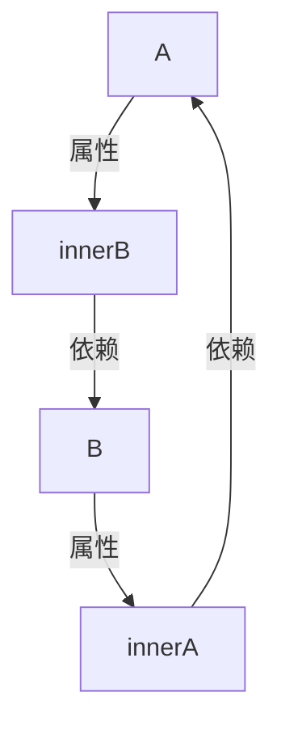
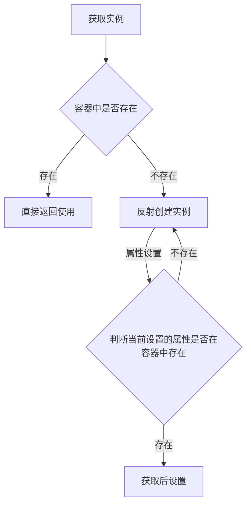

# 第九章 Bean 的获取

- 本章笔者将和各位读者介绍 Bean 获取相关的源码内容。


## 9.1 Bean 获取的方式

一般情况下我们会使用 `BeanFactory` 中提供的 `getBean` 方法来获取 Bean 实例，但是在配置 Bean 阶段会有多种方式。下面我们先来看看这些配置形式。

配置形式可以分下面四种

1. 第一种：直接 `bean` 标签配置 `id` 和 `class`
2. 第二种：配置 `bean` 标签中的 `factory-bean` 和 `factory-method`
3. 第三种：通过配置 `bean` 标签的 `factory-method` 这一种配置方式和第二种配置方式的区别是这里采用的 `class` 并不是 Bean Class 而是提供静态方法的 Class
4. 第四种：通过实现 `FactoryBean` 来进行配置


## 9.2 测试用例准备

首先我们来准备这四种方式的测试用例相关代码。

- `BeanSource`

```java
public class BeanSource {
 private String type;

 public String getType() {
    return type;
 }

 public void setType(String type) {
    this.type = type;
 }
}
```

- `BeanSourceFactory`

```java
public class BeanSourceFactory {
 public static BeanSource staticFactory() {
    BeanSource beanSource = new BeanSource();
    beanSource.setType("StaticFactory");
    return beanSource;
 }

 public BeanSource noStaticFactory() {
    BeanSource beanSource = new BeanSource();
    beanSource.setType("noStaticFactory");
    return beanSource;
 }
}
```

- `BeanSourceFactoryBean`

```java
public class BeanSourceFactoryBean implements FactoryBean<BeanSource> {
 @Override
 public BeanSource getObject() throws Exception {
    BeanSource beanSource = new BeanSource();
    beanSource.setType("from factory bean .");
    return beanSource;
 }

 @Override
 public Class<?> getObjectType() {
    return BeanSource.class;
 }

 @Override
 public boolean isSingleton() {
    return true;
 }
}
```

- `get-bean.xml`

```xml
<?xml version="1.0" encoding="UTF-8"?>
<beans xmlns:xsi="http://www.w3.org/2001/XMLSchema-instance"
    xmlns="http://www.springframework.org/schema/beans"
    xsi:schemaLocation="http://www.springframework.org/schema/beans http://www.springframework.org/schema/beans/spring-beans.xsd">


 <bean id="beanSource" class="com.source.hot.ioc.book.getbean.BeanSource">
    <property name="type" value="xml"/>
 </bean>

 <bean id="beanSourceFactory" class="com.source.hot.ioc.book.getbean.BeanSourceFactory"/>
 <bean id="beanSourceFromNoStatic" factory-bean="beanSourceFactory" factory-method="noStaticFactory"></bean>

 <bean id="beanSourceFromStatic" class="com.source.hot.ioc.book.getbean.BeanSourceFactory"
      factory-method="staticFactory"></bean>

 <bean id="beanSourceFromFactoryBean" class="com.source.hot.ioc.book.getbean.BeanSourceFactoryBean"></bean>
</beans>
```

- `GetBeanTest`

```java
class GetBeanTest {
 ClassPathXmlApplicationContext context = null;

 @BeforeEach
 void init() {
    context = new ClassPathXmlApplicationContext("META-INF/get-bean.xml");
 }

 @Test
 void fromBean() {
    BeanSource beanSource = context.getBean("beanSource", BeanSource.class);
    assert beanSource.getType().equals("xml");
 }

 @Test
 void fromStatic() {
    BeanSource beanSourceFromStatic = context.getBean("beanSourceFromStatic", BeanSource.class);
    assert beanSourceFromStatic.getType().equals("StaticFactory");
 }

 @Test
 void fromNoStatic() {
    BeanSource beanSourceFromNoStatic = context.getBean("beanSourceFromNoStatic", BeanSource.class);
    assert beanSourceFromNoStatic.getType().equals("noStaticFactory");

 }

 @Test
 void fromFactoryBean() {
    BeanSource beanSourceFromFactoryBean = context.getBean("beanSourceFromFactoryBean", BeanSource.class);
    assert beanSourceFromFactoryBean.getType().equals("from factory bean .");
 }
}
```


## 9.3 `doGetBean` 分析

我们所使用的 `getBean` 方法最终都会指向 `org.springframework.beans.factory.support.AbstractBeanFactory#doGetBean` ，在这个方法中会有我们所寻找的答案。首先我们先整体阅读这段代码

```java
@SuppressWarnings("unchecked")
protected <T> T doGetBean(final String name, @Nullable final Class<T> requiredType,
                          @Nullable final Object[] args, boolean typeCheckOnly) throws BeansException {
    // 转换beanName
    final String beanName = transformedBeanName(name);
    Object bean;

    // Eagerly check singleton cache for manually registered singletons.
    // 获取单例对象
    Object sharedInstance = getSingleton(beanName);
    // 单例对象是否存在 参数是否为空
    if (sharedInstance != null && args == null) {
        if (logger.isTraceEnabled()) {
            if (isSingletonCurrentlyInCreation(beanName)) {
                logger.trace("Returning eagerly cached instance of singleton bean '" + beanName +
                             "' that is not fully initialized yet - a consequence of a circular reference");
            }
            else {
                logger.trace("Returning cached instance of singleton bean '" + beanName + "'");
            }
        }
        // 获取bean实例
        bean = getObjectForBeanInstance(sharedInstance, name, beanName, null);
    }

    else {
        // Fail if we're already creating this bean instance:
        // We're assumably within a circular reference.
        // 循环依赖的问题
        if (isPrototypeCurrentlyInCreation(beanName)) {
            throw new BeanCurrentlyInCreationException(beanName);
        }

        // Check if bean definition exists in this factory.
        // 获取父bean工厂
        // 从 父bean工厂中创建
        BeanFactory parentBeanFactory = getParentBeanFactory();
        // 从 父bean 工厂中查询
        if (parentBeanFactory != null && !containsBeanDefinition(beanName)) {
            // Not found -> check parent.
            // 确定beanName
            String nameToLookup = originalBeanName(name);
            // 父bean工厂 类型判断
            if (parentBeanFactory instanceof AbstractBeanFactory) {
                // 再次获取
                return ((AbstractBeanFactory) parentBeanFactory).doGetBean(
                    nameToLookup, requiredType, args, typeCheckOnly);
            }
            else if (args != null) {
                // Delegation to parent with explicit args.
                return (T) parentBeanFactory.getBean(nameToLookup, args);
            }
            else if (requiredType != null) {
                // No args -> delegate to standard getBean method.
                return parentBeanFactory.getBean(nameToLookup, requiredType);
            }
            else {
                return (T) parentBeanFactory.getBean(nameToLookup);
            }
        }

        // 是否需要进行类型校验
        if (!typeCheckOnly) {
            // 将bean 标记为已创建
            markBeanAsCreated(beanName);
        }

        try {
            // 获取bean定义
            final RootBeanDefinition mbd = getMergedLocalBeanDefinition(beanName);
            checkMergedBeanDefinition(mbd, beanName, args);

            // Guarantee initialization of beans that the current bean depends on.
            // 需要依赖的bean
            String[] dependsOn = mbd.getDependsOn();
            if (dependsOn != null) {
                for (String dep : dependsOn) {
                    // 是否依赖
                    if (isDependent(beanName, dep)) {
                        throw new BeanCreationException(mbd.getResourceDescription(), beanName,
                                                        "Circular depends-on relationship between '" + beanName + "' and '" + dep + "'");
                    }
                    // 注册依赖bean
                    registerDependentBean(dep, beanName);
                    try {
                        // 获取bean
                        getBean(dep);
                    }
                    catch (NoSuchBeanDefinitionException ex) {
                        throw new BeanCreationException(mbd.getResourceDescription(), beanName,
                                                        "'" + beanName + "' depends on missing bean '" + dep + "'", ex);
                    }
                }
            }

            // Create bean instance.
            // 单例创建
            // 判断是否是单例
            if (mbd.isSingleton()) {
                // 获取bean单例bean
                sharedInstance = getSingleton(beanName, () -> {
                    try {
                        // 创建bean
                        return createBean(beanName, mbd, args);
                    }
                    catch (BeansException ex) {
                        // Explicitly remove instance from singleton cache: It might have been put there
                        // eagerly by the creation process, to allow for circular reference resolution.
                        // Also remove any beans that received a temporary reference to the bean.
                        // 摧毁单例的bean
                        destroySingleton(beanName);
                        throw ex;
                    }
                });
                // 获取 bean 实例
                bean = getObjectForBeanInstance(sharedInstance, name, beanName, mbd);
            }

            // 原型模式创建
            // 是否是原型模式
            else if (mbd.isPrototype()) {
                // It's a prototype -> create a new instance.
                Object prototypeInstance = null;
                try {
                    // 创建之前的行为
                    beforePrototypeCreation(beanName);
                    // 创建
                    prototypeInstance = createBean(beanName, mbd, args);
                }
                finally {
                    // 创建后的行为
                    afterPrototypeCreation(beanName);
                }
                // 创建
                bean = getObjectForBeanInstance(prototypeInstance, name, beanName, mbd);
            }

            else {
                // 获取作用域名称
                String scopeName = mbd.getScope();
                // 从作用域容器中获取当前作用域名称对应的作用域接口 scope
                final Scope scope = this.scopes.get(scopeName);
                if (scope == null) {
                    throw new IllegalStateException("No Scope registered for scope name '" + scopeName + "'");
                }
                try {
                    // 从 scope 接口卓获取
                    Object scopedInstance = scope.get(beanName, () -> {
                        // 创建之前做的行为
                        beforePrototypeCreation(beanName);
                        try {
                            // 创建 bean
                            return createBean(beanName, mbd, args);
                        }
                        finally {
                            // 创建之后做的行为
                            afterPrototypeCreation(beanName);
                        }
                    });
                    // 获取 bean 实例
                    bean = getObjectForBeanInstance(scopedInstance, name, beanName, mbd);
                }
                catch (IllegalStateException ex) {
                    throw new BeanCreationException(beanName,
                                                    "Scope '" + scopeName + "' is not active for the current thread; consider " +
                                                    "defining a scoped proxy for this bean if you intend to refer to it from a singleton",
                                                    ex);
                }
            }
        }
        catch (BeansException ex) {
            // bean 创建失败后的处理
            cleanupAfterBeanCreationFailure(beanName);
            throw ex;
        }
    }

    // Check if required type matches the type of the actual bean instance.
    // 类型和需要的类型是否匹配
    if (requiredType != null && !requiredType.isInstance(bean)) {
        try {
            // 获取类型转换器 , 通过类型转换器进行能转换
            T convertedBean = getTypeConverter().convertIfNecessary(bean, requiredType);
            if (convertedBean == null) {
                throw new BeanNotOfRequiredTypeException(name, requiredType, bean.getClass());
            }
            return convertedBean;
        }
        catch (TypeMismatchException ex) {
            if (logger.isTraceEnabled()) {
                logger.trace("Failed to convert bean '" + name + "' to required type '" +
                             ClassUtils.getQualifiedName(requiredType) + "'", ex);
            }
            throw new BeanNotOfRequiredTypeException(name, requiredType, bean.getClass());
        }
    }
    return (T) bean;
}

```


在这段方法中会分为下面这几个步骤


### 9.3.1 Bean Name 转换

在 Spring 中通过 Bean Name 获取 Bean 实例的时候大部分情况下都会进行这一个操作，下面我们来看看 `transformedBeanName` 中的具体细节。

- `transformedBeanName` 详细代码如下

```java
protected String transformedBeanName(String name) {
   // 转换 beanName .
   // 1. 通过·BeanFactoryUtils.transformedBeanName· 求beanName
   // 2. 如果是有别名的(方法参数是别名) . 会从别名列表中获取对应的 beanName
   return canonicalName(BeanFactoryUtils.transformedBeanName(name));
}
```

在这个转换过程中会有两次操作。

第一次是关于 FactoryBean 的操作，这里的操作是将 `FactoryBean` 的前置标记符号(`&`)去掉，这部分提供者是 `BeanFactoryUtils.transformedBeanName(name)`

- `BeanFactoryUtils.transformedBeanName(name)` 

```java
public static String transformedBeanName(String name) {
   Assert.notNull(name, "'name' must not be null");
   // 名字不是 & 开头直接返回
   if (!name.startsWith(BeanFactory.FACTORY_BEAN_PREFIX)) {
      return name;
   }
   // 截取字符串 在返回
   return transformedBeanNameCache.computeIfAbsent(name, beanName -> {
      do {
         beanName = beanName.substring(BeanFactory.FACTORY_BEAN_PREFIX.length());
      }
      while (beanName.startsWith(BeanFactory.FACTORY_BEAN_PREFIX));
      return beanName;
   });
}
```


第二次是关于别名的操作，Spring 会拿着第一次操作后的数据来别名容器中进行获取真正的 Bean Name， 方法提供者：`SimpleAliasRegistry#canonicalName` 关于别名转换的内容笔者在第五章中有讲述，各位忘记的话可以往前翻一翻。


### 9.3.2 单例容器中尝试获取

在得到 Bean Name 之后 Spring 会尝试从单例容器中获取，

- Spring 中存储单例 Bean 的容器

```java
private final Map<String, Object> singletonObjects = new ConcurrentHashMap<>(256);
```

不得不说的是 `DefaultSingletonBeanRegistry#getSingleton` 方法不仅仅是处理了单例对象的获取这一个行为，在这个方法中还有一个关于循环依赖上的处理，在这里对于循环依赖我们不做展开，在本文后半段会对循环依赖单独分析。在当前我们只需要知道所有的单例 Bean 都会被放在 ` singletonObjects` 容器之中，我们可以直接通过 Bean Name 获取即可。


### 9.3.3 获取 Bean 实例(`FactoryBean`)

在获取 Bean 实例的时候我们需要确定什么情况下会进行。在 Spring 中当我们在单例容器中根据 Bean Name 获取失败后并且参数列表为空就会进行 `getObjectForBeanInstance` 方法调用。下面我们来看看这个方法中的一些细节。

首先我们来看第一部分代码

```java
if (BeanFactoryUtils.isFactoryDereference(name)) {
   // 类型判断
   if (beanInstance instanceof NullBean) {
      return beanInstance;
   }
   if (!(beanInstance instanceof FactoryBean)) {
      throw new BeanIsNotAFactoryException(beanName, beanInstance.getClass());
   }
   if (mbd != null) {
      mbd.isFactoryBean = true;
   }
   // 返回实例
   return beanInstance;
}
```

在第一部分的代码中这里会做一个关于 `FactoryBean` 的处理，当正在处理的 Bean 是一个 `FactoryBean` 的时候会做出其他一些判断，当满足后会直接将 Bean 实例返回出去，注意这个 Bean 实例时从单例对象容器中获取的。


下面我们来看第二部分代码

```java
// Now we have the bean instance, which may be a normal bean or a FactoryBean.
// If it's a FactoryBean, we use it to create a bean instance, unless the
// caller actually wants a reference to the factory.
// 判断是否是 factoryBean
if (!(beanInstance instanceof FactoryBean)) {
    return beanInstance;
}

Object object = null;
if (mbd != null) {
    mbd.isFactoryBean = true;
}
else {
    // 缓存中获取
    object = getCachedObjectForFactoryBean(beanName);
}
if (object == null) {
    // Return bean instance from factory.
    // 如果还是 null 从 factory bean 中创建
    FactoryBean<?> factory = (FactoryBean<?>) beanInstance;
    // Caches object obtained from FactoryBean if it is a singleton.
    if (mbd == null && containsBeanDefinition(beanName)) {
        mbd = getMergedLocalBeanDefinition(beanName);
    }
    boolean synthetic = (mbd != null && mbd.isSynthetic());
    // 从 FactoryBean 中获取bean实例
    object = getObjectFromFactoryBean(factory, beanName, !synthetic);
}
return object;
```


在第二部分中我们在明面上可能看不出什么实际的操作信息，但是在 `getCachedObjectForFactoryBean` 方法和 `getObjectFromFactoryBean` 方法中有一个共同的操作对象 `factoryBeanObjectCache` 

- `factoryBeanObjectCache` 细节如下

```java
private final Map<String, Object> factoryBeanObjectCache = new ConcurrentHashMap<>(16);
```

该容器主要存储 FactoryBean 的实例，`getCachedObjectForFactoryBean` 方法是直接从容器中获取，在 `getObjectFromFactoryBean` 方法中会有向容器中设置数据的具体操作，下面我们来看这方面的具体操作


在 `getObjectFromFactoryBean` 中对于 FactoryBean 的创建分为两种情况，第一种 单例，第二种原型。


`getObjectFromFactoryBean` 的具体签名是：`org.springframework.beans.factory.support.FactoryBeanRegistrySupport#getObjectFromFactoryBean`


#### 9.3.3.1 FactoryBean 的单例创建

当 `FactoryBean#isSingleton()` 返回为 `true` 时会进入 `FactoryBean` 单例创建过程，下面是具体代码

```java
synchronized (getSingletonMutex()) {
    // 从工厂bean的缓存中获取
    Object object = this.factoryBeanObjectCache.get(beanName);
    if (object == null) {

        // 从 factoryBean 接口中获取
        object = doGetObjectFromFactoryBean(factory, beanName);
        // Only post-process and store if not put there already during getObject() call above
        // (e.g. because of circular reference processing triggered by custom getBean calls)
        // 从缓存map中获取
        Object alreadyThere = this.factoryBeanObjectCache.get(beanName);
        if (alreadyThere != null) {
            // 如果缓存中获取有值
            // object 覆盖
            object = alreadyThere;
        }
        else {
            // 判断是否需要后置处理
            if (shouldPostProcess) {
                // 是否处于创建中
                if (isSingletonCurrentlyInCreation(beanName)) {
                    // Temporarily return non-post-processed object, not storing it yet..
                    return object;
                }
                // 单例创建前的验证
                beforeSingletonCreation(beanName);
                try {
                    // 从 FactoryBean 接口创建的 后置处理
                    object = postProcessObjectFromFactoryBean(object, beanName);
                }
                catch (Throwable ex) {
                    throw new BeanCreationException(beanName,
                                                    "Post-processing of FactoryBean's singleton object failed", ex);
                }
                finally {
                    // 单例bean创建之后
                    afterSingletonCreation(beanName);
                }
            }
            // 是否包含bean name
            if (containsSingleton(beanName)) {
                // 插入缓存
                // 后续使用的时候可以直接获取
                this.factoryBeanObjectCache.put(beanName, object);
            }
        }
    }
    return object;
}

```

在这段代码中核心方法是下面四个

1. `doGetObjectFromFactoryBean`
2. `beforeSingletonCreation`
3. `postProcessObjectFromFactoryBean`
4. `afterSingletonCreation`

下面我们来对这四个方法进行细节分析

##### 9.3.3.1.1 `doGetObjectFromFactoryBean`

首先我们来看 `doGetObjectFromFactoryBean` 方法，在这个方法中对于对象的创建可以直接调用 `FactoryBean#getObject` 方法直接获取，当获取失败的时候会返回 `NullBean`


##### 9.3.3.1.2 `beforeSingletonCreation`

在了解 `doGetObjectFromFactoryBean` 之后我们来看下一个步骤 `beforeSingletonCreation` ，在这个方法中会做创建之前的验证操作。具体验证信息如下

1. 第一条：当前需要创建的 Bean Name 是否处于排除的容器(`inCreationCheckExclusions`)中
2. 第二条：当前需要创建的 Bean Name 是否是正在创建的 Bean ，通过 `singletonsCurrentlyInCreation` 容器判断


- 判断方法如下

```java
if (!this.inCreationCheckExclusions.contains(beanName) && !this.singletonsCurrentlyInCreation.add(beanName)) {
 throw new BeanCurrentlyInCreationException(beanName);
}
```


##### 9.3.3.1.3 `postProcessObjectFromFactoryBean`

当通过创建之前的验证之后接下来就是对 Bean 实例的后置处理，具体处理方法是 `postProcessObjectFromFactoryBean` 主要还是 `BeanPostProcessor` 的内容, 即调用 `BeanPostProcessor#postProcessAfterInitialization`

具体实现有下面两个方法

1. `org.springframework.beans.factory.support.AbstractAutowireCapableBeanFactory#postProcessObjectFromFactoryBean`
2. `org.springframework.beans.factory.support.FactoryBeanRegistrySupport#postProcessObjectFromFactoryBean`


##### 9.3.3.1.4 `afterSingletonCreation`

当完成了后置方法处理之后就会进入最后一个阶段，在这个阶段中会进行数据的验证，验证规则如下

1. 第一条：当前需要创建的 Bean Name 是否处于排除的容器(`inCreationCheckExclusions`)中
2. 第二条：从 `singletonsCurrentlyInCreation` 中删除当前正在删除的 Bean Name 是否成功

- 判断方法如下

```java
if (!this.inCreationCheckExclusions.contains(beanName) && !this.singletonsCurrentlyInCreation.remove(beanName)) {
 throw new IllegalStateException("Singleton '" + beanName + "' isn't currently in creation");
}
```


至此笔者将 `FactoryBean` 的单例形式的创建分析完成，下面我们来看非单例模式下的创建


#### 9.3.3.2 FactoryBean 的原型创建

进行 `FactoryBean` 创建原型 Bean 实例情况下基本方法和 `FactoryBean` 的单例模式创建方法是相同的，不同的是其中部分流程，下面我们来看原型模式的创建流程


```java
// 从 factoryBean 中创建
Object object = doGetObjectFromFactoryBean(factory, beanName);
// 判断是否需要后置处理
if (shouldPostProcess) {
   try {
      // 后置处理
      object = postProcessObjectFromFactoryBean(object, beanName);
   }
   catch (Throwable ex) {
      throw new BeanCreationException(beanName, "Post-processing of FactoryBean's object failed", ex);
   }
}
return object;
```


可以看到在原型模式中 Spring 直接从 `FactoryBean` 中直接获取实例，然后做后置验证。


通过这两种方式我们可以从 `FactoryBean` 中获取具体的 Bean 实例了。


### 9.3.4 从父容器中尝试获取

在 `doGetBean` 方法中对于获取 Bean 实例我们还可以通过父 `BeanFactor` 进行获取，整个关于父 `BeanFactory` 中获取的形式和单个 `BeanFactory` 的获取是相同的，这里就直接贴出代码不做详细分析。

```java
BeanFactory parentBeanFactory = getParentBeanFactory();
// 从 父bean 工厂中查询
if (parentBeanFactory != null && !containsBeanDefinition(beanName)) {
    // Not found -> check parent.
    // 确定beanName
    String nameToLookup = originalBeanName(name);
    // 父bean工厂 类型判断
    if (parentBeanFactory instanceof AbstractBeanFactory) {
        // 再次获取
        return ((AbstractBeanFactory) parentBeanFactory).doGetBean(
            nameToLookup, requiredType, args, typeCheckOnly);
    }
    else if (args != null) {
        // Delegation to parent with explicit args.
        return (T) parentBeanFactory.getBean(nameToLookup, args);
    }
    else if (requiredType != null) {
        // No args -> delegate to standard getBean method.
        return parentBeanFactory.getBean(nameToLookup, requiredType);
    }
    else {
        return (T) parentBeanFactory.getBean(nameToLookup);
    }
}

```


在了解父 `BeanFactory` 的获取后我们需要来认识其他 Bean 的创建模式，这里笔者将其分为 `FactoryBean` 和 非 `FactoryBean` 两种，下面我们将对非 `FactoryBean` 的创建模式进行探讨分析，在进入分析前我们先来看前置操作：**标记 Bean Name 正处于创建状态**


### 9.3.5 Bean Name 标记

在进行非 `FactoryBean` 创建之前我们会有 Bean Name 的标记动作，该方法的详细路径：`org.springframework.beans.factory.support.AbstractBeanFactory#markBeanAsCreated` ，我们来看看标记了那些内容。

1. 第一个：将 Bean Name 对应的 Merge Bean Definition 中的 `stale` 设置为 `true`
2. 第二个：**往 `alreadyCreated` 容器放入当前的 Bean Name**

在这两个标记中第二个标记尤为重要，`alreadyCreated` 中存储的 Bean Name 都是正在创建的 Bean Name


```java
protected void markBeanAsCreated(String beanName) {
   // 已创建的beanName 是否包含当前beanName
   if (!this.alreadyCreated.contains(beanName)) {
      synchronized (this.mergedBeanDefinitions) {
         if (!this.alreadyCreated.contains(beanName)) {
            // Let the bean definition get re-merged now that we're actually creating
            // the bean... just in case some of its metadata changed in the meantime.
            // 将属性stale设置true
            clearMergedBeanDefinition(beanName);
            // 放入已创建集合中
            this.alreadyCreated.add(beanName);
         }
      }
   }
}
```


### 9.3.6 非 `FactoryBean` 创建，单例模式

标记方法了解之后我们就正式来看非 `FactoryBean` 创建模式中关于单例 Bean 的创建。首先请各位先看代码

```java
if (mbd.isSingleton()) {
   // 获取bean单例bean
   sharedInstance = getSingleton(beanName, () -> {
      try {
         // 创建bean
         return createBean(beanName, mbd, args);
      }
      catch (BeansException ex) {
         // 摧毁单例的bean
         destroySingleton(beanName);
         throw ex;
      }
   });
   // 获取 bean 实例
   bean = getObjectForBeanInstance(sharedInstance, name, beanName, mbd);
}
```

这里是一个关于 Bean 单例模式的创建过程，在这个方法中我们对 `getObjectForBeanInstance` 比较熟悉，`getObjectForBeanInstance` 就是我们前面提到的 `FactoryBean` 创建，这里我们不重复描述，各位可以往前看 [9.3.3 获取 Bean 实例(`FactoryBean`)] 章节的内容。

在这个方法之中我们还需要理解一些参数

- mdb：合并的 Bean Definition 
- beanName： Bean 名称
- args：构造函数参数

同时我们还需要知道在创建失败后 (`createBean` 执行失败) 进行摧毁 Bean 相关的一些信息 ，关于 Bean 摧毁的分析在第八章-Bean的生命周期中有介绍。


在正真执行单例对象创建之前我们还有部分准备工作。这部分准备工作单例和原型都需要进行，下面我们来对这些通用的准备进行分析


#### 9.3.6.1 进行非 `FactoryBean` 创建之前的通用准备

首先来看通用准备的相关代码

```java
// 获取bean定义
final RootBeanDefinition mbd = getMergedLocalBeanDefinition(beanName);
checkMergedBeanDefinition(mbd, beanName, args);

// Guarantee initialization of beans that the current bean depends on.
// 需要依赖的bean
String[] dependsOn = mbd.getDependsOn();
if (dependsOn != null) {
   for (String dep : dependsOn) {
      // 是否依赖
      if (isDependent(beanName, dep)) {
         throw new BeanCreationException(mbd.getResourceDescription(), beanName,
               "Circular depends-on relationship between '" + beanName + "' and '" + dep + "'");
      }
      // 注册依赖bean
      registerDependentBean(dep, beanName);
      try {
         // 获取bean
         getBean(dep);
      }
      catch (NoSuchBeanDefinitionException ex) {
         throw new BeanCreationException(mbd.getResourceDescription(), beanName,
               "'" + beanName + "' depends on missing bean '" + dep + "'", ex);
      }
   }
}
```


进行非 `FactoryBean` 创建之前的通用准备分为下面几个步骤

1. 第一步：通过当前的 Bean Name 获取对应的 MergeBeanDefinition 

2. 第二步：对第一步获取的 MergeBeanDefinition 进行验证

3. 第三步：MergeBeanDefinition 中对于依赖项的处理。

   两个细节处理：

   1. 注册依赖信息
   2. 创建依赖的 Bean 实例

##### 9.3.6.1.1 `BeanDefinition` 合并

获取合并后的 Bean Definition 对象的方法是：`org.springframework.beans.factory.support.AbstractBeanFactory#getMergedBeanDefinition(java.lang.String, org.springframework.beans.factory.config.BeanDefinition, org.springframework.beans.factory.config.BeanDefinition)`

在这个方法中我们抛去从缓存中获取以外我们需要关注合并的两个 BeanDefinition 是那两个。

1. **第一个 BeanDefinition：当前 Bean Factory 中 Bean Name 对应的 Bean Definition。**
2. **第二个 BeanDefinition：当前 Bean Factory 的 父 Bean Factory 中 Bean Name 对应的 Bean Definition。**

下一个关注点：**合并的具体行为**，在 Spring 中关于 Bean Definition 的合并总共有两个方法。

1. **是由 `AbstractBeanDefinition` 提供的 `overrideFrom` 方法**
2. **是由 `AbstractBeanFactory` 提供的 `copyRelevantMergedBeanDefinitionCaches` 方法**
3. 在这两个方法中属于大面积的字段合并处理，其他还有一些细节字段的处理在 `org.springframework.beans.factory.support.AbstractBeanFactory#getMergedBeanDefinition(java.lang.String, org.springframework.beans.factory.config.BeanDefinition, org.springframework.beans.factory.config.BeanDefinition)` 有补充。


##### 9.3.6.1.2 验证 Bean Definition 的合并结果

在获取合并的 Bean Definition 对象后 Spring 回对这个对象做一个验证，验证方法是：`org.springframework.beans.factory.support.AbstractBeanFactory#checkMergedBeanDefinition` 下面我们来看这个验证过程。

- `checkMergedBeanDefinition` 方法详情

```java
protected void checkMergedBeanDefinition(RootBeanDefinition mbd, String beanName, @Nullable Object[] args)
      throws BeanDefinitionStoreException {

   if (mbd.isAbstract()) {
      throw new BeanIsAbstractException(beanName);
   }
}
```


从这段代码中我们可以看到如果 MergeBeanDefinition 对象的 `abstract` 属性等于 `true` 就会抛出异常。这些就是关于验证 MergeBeanDefinition 的信息。


##### 9.3.6.1.3 MergeBeanDefinition 依赖处理

在处理 MergeBeanDefinition 的依赖信息的时候主要分成两步

1. 注册依赖信息
2. 创建依赖的 Bean 实例

注册依赖信息就是往容器中放入数据，在这里使用到两个容器

1. `dependentBeanMap`
2. `dependenciesForBeanMap`

创建依赖的 Bean 实例就是调用 `getBean` ，这个方法的本质就是我们这一章的所有内容


#### 9.3.6.2 `doCreateBean`  方法分析 第一部分-获取实例

在前置准备都完成之后我们就可以开始单例 Bean 的创建了。在`AbstractBeanFactory` 中定义了一个抽象方法： `createBean` ，Spring 中只有一个实现：`org.springframework.beans.factory.support.AbstractAutowireCapableBeanFactory#createBean(java.lang.String, org.springframework.beans.factory.support.RootBeanDefinition, java.lang.Object[])`，这样我们找到了分析目标，对于创建 Bean 实例相关的行为其实就是 Bean 生命周期中的内容。


先来看 `createBean` 中的第一部分代码

- `createBean` 第一部分代码

```java
// beanDefinition
RootBeanDefinition mbdToUse = mbd;

// Make sure bean class is actually resolved at this point, and
// clone the bean definition in case of a dynamically resolved Class
// which cannot be stored in the shared merged bean definition.
// 获取当前需要加载的类
Class<?> resolvedClass = resolveBeanClass(mbd, beanName);
// 1. 待处理的类不为空
// 2. bean定义中含有 beanClass
// 3. className 不为空
// 满足、上述三点的情况下会去创建 RootBeanDefinition
if (resolvedClass != null && !mbd.hasBeanClass() && mbd.getBeanClassName() != null) {
   // 创建 beanDefinition
   mbdToUse = new RootBeanDefinition(mbd);
   // 设置bean class
   mbdToUse.setBeanClass(resolvedClass);
}
```

在第一部分代码中主要是对 BeanDefinition 的准备。在这里对于 BeanDefinition 的定义有两种情况

1. 第一种：直接使用参数作为后续操作对象
2. 第二种满足下面三个条件会重新生成一个 Bean Definition 对象进行后续使用
   1. 条件一：当前 Bean Name 对应的 Bean Type 不为空，可以理解为 `bean` 标签中 `class` 属性存在
   2. 条件二：Bean Definition 中 `beanClass` 的类型是 `Class`
   3. 条件三：Bean Definition 中 Bean Class Name 存在

这里各位可以关注类型推论方法：`resolveBeanClass`

类型推论的逻辑：

1. 行为一：当 Bean Definition 中存在 Bean Class 并且类型是 `Class` 立即使用该对象
2. 行为二：当 Bean Definition 中 `beanClass` 的类型是 `String` 时 Spring 会进行类加载，将字符串转换成具体的 `Class` 对象


第一部分到此结束，下面我们来看第二部分的操作

- `createBean` 第二部分代码

```java
// 第二部分
// Prepare method overrides.
try {
   // 方法重写
   mbdToUse.prepareMethodOverrides();
}
catch (BeanDefinitionValidationException ex) {
   throw new BeanDefinitionStoreException(mbdToUse.getResourceDescription(),
         beanName, "Validation of method overrides failed", ex
   );
}
```

在这一部分中主要时对 Bean Definition 对象中关于需要重写方法的处理，具体处理就是将 `MethodOverride` 的属性 `overloaded` 设置为 `false`

在第二部分中出现的一些核心方法和类

- 方法1：`org.springframework.beans.factory.support.AbstractBeanDefinition#prepareMethodOverrides`
- 方法2：`org.springframework.beans.factory.support.AbstractBeanDefinition#prepareMethodOverride`
- 对象：`org.springframework.beans.factory.support.MethodOverride`

第二部分相关分析完成下面我们来看第三部分的代码

- `createBean` 第三部分代码

```java
try {
 // Give BeanPostProcessors a chance to return a proxy instead of the target bean instance.
 // 创建bean之前的行为
 Object bean = resolveBeforeInstantiation(beanName, mbdToUse);
 if (bean != null) {
    return bean;
 }
}
catch (Throwable ex) {
 throw new BeanCreationException(mbdToUse.getResourceDescription(), beanName,
       "BeanPostProcessor before instantiation of bean failed", ex
 );
}
```


在第三部分中主要是关于 `BeanPostProcessor` 接口的相关操作，在 `resolveBeforeInstantiation` 方法中主要有两个关于 `BeanPostProcessor` 相关的操作

- 关于 `BeanPostProcessor` 的操作方法

  1. 第一个：`org.springframework.beans.factory.support.AbstractAutowireCapableBeanFactory#applyBeanPostProcessorsBeforeInstantiation`

```java
@Nullable
protected Object applyBeanPostProcessorsBeforeInstantiation(Class<?> beanClass, String beanName) {
    for (BeanPostProcessor bp : getBeanPostProcessors()) {
        if (bp instanceof InstantiationAwareBeanPostProcessor) {
            InstantiationAwareBeanPostProcessor ibp = (InstantiationAwareBeanPostProcessor) bp;
            // 调用自定义实现
            Object result = ibp.postProcessBeforeInstantiation(beanClass, beanName);
            if (result != null) {
                return result;
            }
        }
    }
    return null;
}
```

     这里是将容器中的所有 `BeanPostProcessor` 找出并且进行进一步类型确定，执行类型是 `InstantiationAwareBeanPostProcessor` 的前置方法 `postProcessBeforeInstantiation`

  2. 第二个：`org.springframework.beans.factory.support.AbstractAutowireCapableBeanFactory#applyBeanPostProcessorsAfterInitialization`

```JAVA
@Override
public Object applyBeanPostProcessorsAfterInitialization(Object existingBean, String beanName)
 throws BeansException {

 Object result = existingBean;
 for (BeanPostProcessor processor : getBeanPostProcessors()) {
     // 执行 spring 容器中 BeanPostProcessor
     Object current = processor.postProcessAfterInitialization(result, beanName);
     if (current == null) {
         return result;
     }
     result = current;
 }
 return result;
}

```

     这里是将容器中所有的 `BeanPostProcessor`找出然后循环每个 `BeanPostProcessor` 执行后置方法调用 `postProcessAfterInitialization`

这就是关于第三部分 Bean 创建之前的执行事项，如果此时可以获取到 Bean 实例那么就会直接返回，如果没有获取到 Bean 实例那么会走最后一部分，创建 Bean

- `createBean` 第四部分代码

```java
// 第四部分
try {
  // 创建bean
  Object beanInstance = doCreateBean(beanName, mbdToUse, args);
  if (logger.isTraceEnabled()) {
      logger.trace("Finished creating instance of bean '" + beanName + "'");
  }
  return beanInstance;
}
catch (BeanCreationException | ImplicitlyAppearedSingletonException ex) {
  // A previously detected exception with proper bean creation context already,
  // or illegal singleton state to be communicated up to DefaultSingletonBeanRegistry.
  throw ex;
}
catch (Throwable ex) {
  throw new BeanCreationException(
      mbdToUse.getResourceDescription(), beanName, "Unexpected exception during bean creation", ex);
}
```

在第四部分中主要目的就是通过 BeanDefinition 对象创建出 Bean 实例，关于这一部分在第八章中有相关分析。在这里笔者将逐行在和各位进行一次分析。


`org.springframework.beans.factory.support.AbstractAutowireCapableBeanFactory#createBeanInstance` 各个部分相关的代码进行分析。

- 第一部分代码

```JAVA
// 第一部分
// 获取 bean class
Class<?> beanClass = resolveBeanClass(mbd, beanName);
// bean 是否可以被创建的验证
if (beanClass != null && !Modifier.isPublic(beanClass.getModifiers()) && !mbd.isNonPublicAccessAllowed()) {
  throw new BeanCreationException(mbd.getResourceDescription(), beanName,
                                  "Bean class isn't public, and non-public access not allowed: " + beanClass.getName()
                                 );
}
```

  第一部分代码内容主要是进行 Bean Class 的推论


##### 9.3.6.2.1 `Supplier` 中创建 Bean 

- 第二部分代码

```java
// 第二部分
// 返回一个用来创建bean实例的回调接口
// Supplier get 直接获取bean对象
Supplier<?> instanceSupplier = mbd.getInstanceSupplier();
if (instanceSupplier != null) {
  return obtainFromSupplier(instanceSupplier, beanName);
}
```

  第二部分代码是尝试从 BeanDefinition 中获取 `Supplier` 接口，从 `Supplier` 接口中获取 Bean 实例

  获取方式如下：

  1. 第一步：调用 `Supplier` 中提供的 `get` 方法
  2. 第二步：创建 `BeanWrapper` 的实现类 `BeanWrapperImpl` 并调用 `initBeanWrapper` 


##### 9.3.6.2.2 FactoryBean + FactoryMethod 创建 Bean

- 第三部分代码

```java
// 第三部分
if (mbd.getFactoryMethodName() != null) {
  // 通过工厂方法创建
  return instantiateUsingFactoryMethod(beanName, mbd, args);
}
```

  第三部分是关于 FactorMethod 的处理，处理方式如下

  1. 第一步：`BeanWrapper` 的基本对象创建
  2. 第二步：读取 BeanDefinition 中关于 FactoryBeanName 的属性，并将其转换成实例
  3. 第三步：调用第二步中得到的 FactorBean 中提供的 FactoryMethod

第三部分的核心代码过于庞大不进行粘贴，各位可以自行阅读(入口方法签名：`org.springframework.beans.factory.support.AbstractAutowireCapableBeanFactory#instantiateUsingFactoryMethod`，核心调用方法签名：`org.springframework.beans.factory.support.ConstructorResolver#instantiateUsingFactoryMethod`)

下面我们结合测试用例来进行分析

```xml
<bean id="beanSourceFactory" class="com.source.hot.ioc.book.getbean.BeanSourceFactory"/>
<bean id="beanSourceFromNoStatic" factory-bean="beanSourceFactory" factory-method="noStaticFactory"></bean>
```

在我们前面的例子中我们有上面这样的一个测试用例，这里的第二步实质就是想要将 `bean` 标签中的 `factory-bean` 转换成对象 `BeanSourceFactory` 

下面我们来看几个关键对象的截图

- 关于 `FactoryBean` 的


- 关于需要执行的 `FactoryMethod` 

  


    	具体的执行就是 `FactoryBean` 反射执行 `FactoryMethod` 了，这块相对简单，主要复杂的内容实在前期的数据准备阶段。

在 `ConstructorResolver#instantiateUsingFactoryMethod` 中不只是笔者在次提到的这些内容还有其他的一些情况，比如候选方法（`FactoryMethod` ）存在多个的情况如何处理


下面我们来看第四部分代码

- 第四部分代码

```java
// 第四部分
// Shortcut when re-creating the same bean...
// 是否已经处理完成的标记
boolean resolved = false;
// 是否需要啊自动注入的标记
boolean autowireNecessary = false;
if (args == null) {
  synchronized (mbd.constructorArgumentLock) {
      if (mbd.resolvedConstructorOrFactoryMethod != null) {
          resolved = true;
          autowireNecessary = mbd.constructorArgumentsResolved;
      }
  }
}
```

  第四部分行为是一个标记，这里的  `autowireNecessary` 标记( **是否需要自动注入的标记**) 会印象后续的 Bean 实例化策略，这部分策略实现在第五部分中直接体现

- 第五部分代码

```java
if (resolved) {
 if (autowireNecessary) {
    // 自动构造 bean
    return autowireConstructor(beanName, mbd, null, null);
 }
 else {
    // 实例化bean
    return instantiateBean(beanName, mbd);
 }
}
```

  在第五部分中我们可以看到两个方法 

  1. 第一个：`autowireConstructor` 
  2. 第二个：`instantiateBean` 

  这两个方法在后面的第六部分中也有相关使用我们先来看第六部分相关代码

- 第六部分代码

```java
// 第六部分
// Candidate constructors for autowiring?
// 确定构造函数列表
Constructor<?>[] ctors = determineConstructorsFromBeanPostProcessors(beanClass, beanName);
if (ctors != null || mbd.getResolvedAutowireMode() == AUTOWIRE_CONSTRUCTOR ||
    mbd.hasConstructorArgumentValues() || !ObjectUtils.isEmpty(args)) {
 // 自动装配处理
 return autowireConstructor(beanName, mbd, ctors, args);
}

// Preferred constructors for default construction?
ctors = mbd.getPreferredConstructors();
if (ctors != null) {
 // 自动装配处理
 return autowireConstructor(beanName, mbd, ctors, null);
}

// No special handling: simply use no-arg constructor.
// 实例化 bean
return instantiateBean(beanName, mbd);
```


##### 9.3.6.2.3 `autowireConstructor` 创建 Bean

首先我们需要找到 `autowireConstructor` 的入口方法，该方法位于：`org.springframework.beans.factory.support.ConstructorResolver#autowireConstructor` ，我们先来认识参数列表

1. `String beanName`： Bean Name 
2. `RootBeanDefinition mbd`：Bean Definition
3. `@Nullable Constructor<?>[] chosenCtors`： 当前选中的构造函数列表
4. `@Nullable Object[] explicitArgs`：构造参数列表

在整个方法中我们可以看到一个关键方法 `instantiate`

```
instantiate(beanName, mbd, uniqueCandidate, EMPTY_ARGS)
instantiate(beanName, mbd, constructorToUse, argsToUse)
```

为了达成 `instantiate` 的执行条件，我们最为关键的就是需要从参数 `chosenCtors` 中推论得到一个需要执行的 `Constructor` 对象，另一个关键点是构造参数的确认，这一点会从参数 `explicitArgs` 中进行转换得到。

###### 9.3.6.2.3.1 参数列表的确认

我们先来看关于 `explicitArgs` 转换成构造参数的代码

```java
if (explicitArgs != null) {
   argsToUse = explicitArgs;
}
else {
   Object[] argsToResolve = null;
   synchronized (mbd.constructorArgumentLock) {
      constructorToUse = (Constructor<?>) mbd.resolvedConstructorOrFactoryMethod;
      if (constructorToUse != null && mbd.constructorArgumentsResolved) {
         // Found a cached constructor...
         argsToUse = mbd.resolvedConstructorArguments;
         if (argsToUse == null) {
            argsToResolve = mbd.preparedConstructorArguments;
         }
      }
   }
   if (argsToResolve != null) {
      // 解析 ConstructorArgumentValues 对象获得参数列表
      argsToUse = resolvePreparedArguments(beanName, mbd, bw, constructorToUse, argsToResolve, true);
   }
}
```

解析构造参数的形式有两种。

1. 第一种：直接量

   对于直接量的处理我们可以简单理解就是从 BeanDefinition 中的熟悉列表对象中获取

2. 第二种：外部连接对象

   对于外部连接对象我们可以简单理解是从容器中进行获取，一般可能是 Bean Id 或者 Bean Name 这两种外联方式


###### 9.3.6.2.3.2 构造函数的确认

下面我们来看构造函数的确认过程

第一步：在参数 `chosenCtors` 为 `null` 的情况下，Spring 会通过 Bean Definition 中 Bean Class 来进行构造函数列表的获取

```java
Constructor<?>[] candidates = chosenCtors;
// 如果构造函数集合为空，直接获取BeanClass 中的构造函数列表作为可选列表
if (candidates == null) {
   Class<?> beanClass = mbd.getBeanClass();
    candidates = (mbd.isNonPublicAccessAllowed() ?
                  beanClass.getDeclaredConstructors() : beanClass.getConstructors());
}
```


第二步：当候选的构造函数列表只有一个并且没有参数那么直接执行

```java
if (candidates.length == 1 && explicitArgs == null && !mbd.hasConstructorArgumentValues()) {
   Constructor<?> uniqueCandidate = candidates[0];
   if (uniqueCandidate.getParameterCount() == 0) {
      synchronized (mbd.constructorArgumentLock) {
         mbd.resolvedConstructorOrFactoryMethod = uniqueCandidate;
         mbd.constructorArgumentsResolved = true;
         mbd.resolvedConstructorArguments = EMPTY_ARGS;
      }
      bw.setBeanInstance(instantiate(beanName, mbd, uniqueCandidate, EMPTY_ARGS));
      return bw;
   }
}
```

第三步：在构造函数列表中存在多个构造器的处理

```java
for (Constructor<?> candidate : candidates) {

    // 构造函数的参数长度
    int parameterCount = candidate.getParameterCount();

    if (constructorToUse != null && argsToUse != null && argsToUse.length > parameterCount) {
        // Already found greedy constructor that can be satisfied ->
        // do not look any further, there are only less greedy constructors left.
        break;
    }
    // 当前构造函数的参数长度 小于 最小构造函数的参数长度不进行处理
    if (parameterCount < minNrOfArgs) {
        continue;
    }

    ArgumentsHolder argsHolder;
    // 构造函数中关于类型和参数名称的处理
    Class<?>[] paramTypes = candidate.getParameterTypes();
    if (resolvedValues != null) {
        try {
            String[] paramNames = ConstructorPropertiesChecker.evaluate(candidate, parameterCount);
            if (paramNames == null) {
                ParameterNameDiscoverer pnd = this.beanFactory.getParameterNameDiscoverer();
                if (pnd != null) {
                    paramNames = pnd.getParameterNames(candidate);
                }
            }
            argsHolder = createArgumentArray(beanName, mbd, resolvedValues, bw, paramTypes, paramNames,
                                             getUserDeclaredConstructor(candidate), autowiring, candidates.length == 1);
        }
        catch (UnsatisfiedDependencyException ex) {
            if (logger.isTraceEnabled()) {
                logger.trace("Ignoring constructor [" + candidate + "] of bean '" + beanName + "': " + ex);
            }
            // Swallow and try next constructor.
            if (causes == null) {
                causes = new LinkedList<>();
            }
            causes.add(ex);
            continue;
        }
    }
    else {
        // Explicit arguments given -> arguments length must match exactly.
        if (parameterCount != explicitArgs.length) {
            continue;
        }
        argsHolder = new ArgumentsHolder(explicitArgs);
    }

    int typeDiffWeight = (mbd.isLenientConstructorResolution() ?
                          argsHolder.getTypeDifferenceWeight(paramTypes) : argsHolder.getAssignabilityWeight(paramTypes));

    // 确认使用的参数列表
    // Choose this constructor if it represents the closest match.
    if (typeDiffWeight < minTypeDiffWeight) {
        constructorToUse = candidate;
        argsHolderToUse = argsHolder;
        argsToUse = argsHolder.arguments;
        minTypeDiffWeight = typeDiffWeight;
        ambiguousConstructors = null;
    }
    else if (constructorToUse != null && typeDiffWeight == minTypeDiffWeight) {
        if (ambiguousConstructors == null) {
            ambiguousConstructors = new LinkedHashSet<>();
            ambiguousConstructors.add(constructorToUse);
        }
        ambiguousConstructors.add(candidate);
    }
}

```

对于确定需要执行的构造函数对象的核心方法是

```
int typeDiffWeight = (mbd.isLenientConstructorResolution() ?
      argsHolder.getTypeDifferenceWeight(paramTypes) : argsHolder.getAssignabilityWeight(paramTypes));
```

笔者对于 `getTypeDifferenceWeight` 和 `getAssignabilityWeight` 两个方法的理解不是很深入，各位读者这块内容需要自行展开


第四步：执行构造函数

```java
bw.setBeanInstance(instantiate(beanName, mbd, constructorToUse, argsToUse));
```

对于 `instantiate` 方法我们将进入下一个阶段的时候进行分析


##### 9.3.6.2.4 `instantiateBean` 创建 Bean

在 `org.springframework.beans.factory.support.AbstractAutowireCapableBeanFactory#instantiateBean` 方法种存在两种情况，第一种情况是关于**非 Cglib 的 Bean 创建**，第二种情况是属于 **Cglib Bean 的创建** ，入口方法：`org.springframework.beans.factory.support.SimpleInstantiationStrategy#instantiate(org.springframework.beans.factory.support.RootBeanDefinition, java.lang.String, org.springframework.beans.factory.BeanFactory)`，下面请各位先阅读该方法的详细内容

- `SimpleInstantiationStrategy#instantiate` 方法详情

```java

@Override
public Object instantiate(RootBeanDefinition bd, @Nullable String beanName, BeanFactory owner) {
    // Don't override the class with CGLIB if no overrides.
    // 不是 cglib
    // 重写方法列表是否存在
    if (!bd.hasMethodOverrides()) {
        // 构造方法
        Constructor<?> constructorToUse;
        // 锁
        synchronized (bd.constructorArgumentLock) {
            // 提取构造函数
            constructorToUse = (Constructor<?>) bd.resolvedConstructorOrFactoryMethod;
            if (constructorToUse == null) {
                // 获取 bean Class
                final Class<?> clazz = bd.getBeanClass();
                // 确定 类型不是 接口
                if (clazz.isInterface()) {
                    throw new BeanInstantiationException(clazz, "Specified class is an interface");
                }
                try {
                    // 获取构造方法
                    if (System.getSecurityManager() != null) {
                        constructorToUse = AccessController.doPrivileged(
                            (PrivilegedExceptionAction<Constructor<?>>) clazz::getDeclaredConstructor);
                    }
                    else {
                        // 获取构造函数
                        constructorToUse = clazz.getDeclaredConstructor();
                    }
                    // 数据设置
                    // 将 类的构造函数赋值给 BeanDefinition
                    bd.resolvedConstructorOrFactoryMethod = constructorToUse;
                }
                catch (Throwable ex) {
                    throw new BeanInstantiationException(clazz, "No default constructor found", ex);
                }
            }
        }
        // 调用构造方法进行构造
        return BeanUtils.instantiateClass(constructorToUse);
    }
    else {
        // Must generate CGLIB subclass.
        // cglib 构造 . 本质还是 构造函数创建
        return instantiateWithMethodInjection(bd, beanName, owner);
    }
}

```

在这个方法种最后的两个返回值就是两种创建机制


###### 9.3.6.2.4.1 非 Cglib 模式的 Bean

对于非 Cglib 模式的创建在 Spring 种采用的是  `BeanUtils.instantiateClass(constructorToUse)` 在这个方法中其实就是要给无参构造的执行，各位请看下面代码

- `org.springframework.beans.factory.support.SimpleInstantiationStrategy#instantiate(org.springframework.beans.factory.support.RootBeanDefinition, java.lang.String, org.springframework.beans.factory.BeanFactory)` 详细信息

```java
public static <T> T instantiateClass(Constructor<T> ctor, Object... args) throws BeanInstantiationException {
   Assert.notNull(ctor, "Constructor must not be null");
    ReflectionUtils.makeAccessible(ctor);
    if (KotlinDetector.isKotlinReflectPresent() && KotlinDetector.isKotlinType(ctor.getDeclaringClass())) {
        return KotlinDelegate.instantiateClass(ctor, args);
    }
    else {
        Class<?>[] parameterTypes = ctor.getParameterTypes();
        Assert.isTrue(args.length <= parameterTypes.length, "Can't specify more arguments than constructor parameters");
        Object[] argsWithDefaultValues = new Object[args.length];
        for (int i = 0; i < args.length; i++) {
            if (args[i] == null) {
                Class<?> parameterType = parameterTypes[i];
                argsWithDefaultValues[i] = (parameterType.isPrimitive() ? DEFAULT_TYPE_VALUES.get(parameterType) : null);
            }
            else {
                argsWithDefaultValues[i] = args[i];
            }
        }
        return ctor.newInstance(argsWithDefaultValues);
    }
 
}
```


在了解了非 cglib 模式下的 Bean 创建之后我们来看看属于 cglib 的创建


###### 9.3.6.2.4.2 Cglib 模式的 Bean

首先我们需要找到最终的执行方法，该方法的完整签名：`org.springframework.beans.factory.support.CglibSubclassingInstantiationStrategy#instantiateWithMethodInjection(org.springframework.beans.factory.support.RootBeanDefinition, java.lang.String, org.springframework.beans.factory.BeanFactory, java.lang.reflect.Constructor<?>, java.lang.Object...)`

- cglib 模式下的实例化代码

```java
public Object instantiate(@Nullable Constructor<?> ctor, Object... args) {
   // 创造 CGLIB 对原有 BeanClass 的增强类
   Class<?> subclass = createEnhancedSubclass(this.beanDefinition);
   Object instance;
   if (ctor == null) {
      // 构造函数为空的情况下创建
      instance = BeanUtils.instantiateClass(subclass);
   }
   else {
      try {
         // 从 subClass 中查询对应的 构造函数
         Constructor<?> enhancedSubclassConstructor = subclass.getConstructor(ctor.getParameterTypes());
         // 创建对象
         instance = enhancedSubclassConstructor.newInstance(args);
      }
      catch (Exception ex) {
         throw new BeanInstantiationException(this.beanDefinition.getBeanClass(),
               "Failed to invoke constructor for CGLIB enhanced subclass [" + subclass.getName() + "]", ex);
      }
   }
   // SPR-10785: set callbacks directly on the instance instead of in the
   // enhanced class (via the Enhancer) in order to avoid memory leaks.
   Factory factory = (Factory) instance;

   // 设置 Factory 的回调
   factory.setCallbacks(new Callback[] { NoOp.INSTANCE,
         new LookupOverrideMethodInterceptor(this.beanDefinition, this.owner),
         new ReplaceOverrideMethodInterceptor(this.beanDefinition, this.owner) });
   return instance;
}
```


在这里我们其实得到的时关于一个动态代理后的对象，这个对象笔者在前文介绍方法重写相关内容的时候提到过，一个是 `lookup-method` ，另一是 `replaced-method` 看到这两个标签我们可以看到 `LookupOverrideMethodInterceptor` 和  `ReplaceOverrideMethodInterceptor` 方法这里当我们进行方法替换的时候就会来这个地方调用这里 `Factor` 相关的回调方法了，

对于 CGLIB 模式下的创建方法其本质还是 `BeanUtils.instantiateClass` ，只是传入的 class 从原始对象变成了代理对象。


##### 9.3.6.2.5 `createBeanInstance` 小结

在 `createBeanInstance` 方法中我们应该关注的点是 Bean 实例创建的几个方法，在这个方法中总共出现了下面几种创建或者获取 Bean 实例的方法

1. 第一种：通过 Bean Definition 中 `Supplier<?> instanceSupplier` 属性来获取 Bean 实例
2. 第二种：通过 Bean Definition 中  `String factoryBeanName` 和  `String factoryMethodName` 来获取 Bean 实例
3. 第三种：通过 `autowireConstructor` 方法，内部依赖  `Constructor` 进行构造 Bean 实例
4. 第四种：通过 `instantiateBean` 方法，
   1. 第一种形式：内部依赖 Bean Class 找 构造函数对象 `Constructor` 进行反射构造
   2. 第二种形式：CGLIB 代理，内部依赖还是 `Constructor` 不过此时的 `Constructor` 并不是原始的 Bean Class 所拥有的 `Constructor` 对象而是通过 `org.springframework.beans.factory.support.CglibSubclassingInstantiationStrategy.CglibSubclassCreator#createEnhancedSubclass` 创建出来的 Class 拥有的`Constructor` 对象


到此我们对于 `org.springframework.beans.factory.support.AbstractAutowireCapableBeanFactory#doCreateBean` 方法的第一个部分 `createBeanInstance` 有了一个完整的认识。

- `doCreateBean` 中的第一部分代码

```java
// 第一部分
// Instantiate the bean.
BeanWrapper instanceWrapper = null;
// 是否单例
if (mbd.isSingleton()) {
   // beanFactory 移除当前创建的beanName
   instanceWrapper = this.factoryBeanInstanceCache.remove(beanName);
}
// beanWrapper 是否存在
if (instanceWrapper == null) {
   // 创建 bean 实例
   instanceWrapper = createBeanInstance(beanName, mbd, args);
}
```

现在我们对于 `createBeanInstance(beanName, mbd, args); ` 的分析就这样告一段落，下面我们将继续升入 `doCreateBean` 的第二部分代码


#### 9.3.6.3 `doCreateBean` 方法分析 第二部分-后置方法调用

经过 `doCreateBean` 的第一部分代码我们现在得到了 Bean 实例，注意这里得到的对象是 `BeanWrapper`，在后续使用的时候我们需要从 `BeanWrapper` 中获取实例在进行使用，下面我们来看第二部分的代码

- `doCreateBean` 第二部分代码详情

```java
// 第二部分 后置方法调用
// 获取 实例
final Object bean = instanceWrapper.getWrappedInstance();
// beanWrapper中存储的实例.class
Class<?> beanType = instanceWrapper.getWrappedClass();
if (beanType != NullBean.class) {
   mbd.resolvedTargetType = beanType;
}

// Allow post-processors to modify the merged bean definition.
synchronized (mbd.postProcessingLock) {
   if (!mbd.postProcessed) {
      try {
         // 后置方法执行 BeanPostProcessor -> MergedBeanDefinitionPostProcessor
         applyMergedBeanDefinitionPostProcessors(mbd, beanType, beanName);
      }
      catch (Throwable ex) {
         throw new BeanCreationException(mbd.getResourceDescription(), beanName,
               "Post-processing of merged bean definition failed", ex
         );
      }
      mbd.postProcessed = true;
   }
}
```


在第二部分中我们主要操作的是容器中 `BeanPostProcessor` 的内容，注意这里指挥处理 `MergedBeanDefinitionPostProcessor` 相关内容，这里就是一个方法调用，笔者不做过多的描述。


#### 9.3.6.4 `doCreateBean` 方法分析 第三部分-早期单例 Bean 的暴露

下面我们将进入第三部分代码，请各位先阅读第三部分的代码

- `doCreateBean` 第三部分

```java
// 第三部分
// Eagerly cache singletons to be able to resolve circular references
// even when triggered by lifecycle interfaces like BeanFactoryAware.
// 是否需要提前暴露
boolean earlySingletonExposure = (mbd.isSingleton() && this.allowCircularReferences &&
      isSingletonCurrentlyInCreation(beanName));

// 单例对象暴露
if (earlySingletonExposure) {
   if (logger.isTraceEnabled()) {
      logger.trace("Eagerly caching bean '" + beanName +
            "' to allow for resolving potential circular references");
   }
   // 添加单例工厂
   addSingletonFactory(beanName, () -> getEarlyBeanReference(beanName, mbd, bean));
}
```

第三部分这里的操作是为了解决循环依赖的一个前置处理。

##### 9.3.6.5.1 提前暴露的确认


我们需要先来认识 `earlySingletonExposure` 的判断条件

1. Bean Definition 中定义了这是一个单例的Bean
2. `allowCircularReferences` 是否允许循环依赖, 默认 `true`
3. `isSingletonCurrentlyInCreation` 判断当前 Bean 是否正在处于创建阶段

在了解  `earlySingletonExposure` 后我们来看看 `addSingletonFactory` 和 `getEarlyBeanReference` 方法。


##### 9.3.6.5.2 `getEarlyBeanReference` 分析

我们直接来看 `getEarlyBeanReference` 的详细代码

```java
protected Object getEarlyBeanReference(String beanName, RootBeanDefinition mbd, Object bean) {
   Object exposedObject = bean;
   if (!mbd.isSynthetic() && hasInstantiationAwareBeanPostProcessors()) {
      for (BeanPostProcessor bp : getBeanPostProcessors()) {
         if (bp instanceof SmartInstantiationAwareBeanPostProcessor) {
            SmartInstantiationAwareBeanPostProcessor ibp = (SmartInstantiationAwareBeanPostProcessor) bp;
            exposedObject = ibp.getEarlyBeanReference(exposedObject, beanName);
         }
      }
   }
   return exposedObject;
}
```

在 `getEarlyBeanReference` 方法中我们的目标是获取 Bean 对象，在这个方法中没有特别的处理，对于需要提前暴露的Bean实例我们可以分为下面两种情况

1. 第一种：**在容器中没有 `SmartInstantiationAwareBeanPostProcessor` 实现直接使用 参数中的 Bean 实例**
2. 第二种：**在容器中存在 `SmartInstantiationAwareBeanPostProcessor` 通过 `SmartInstantiationAwareBeanPostProcessor` 提供的方法进行获取**


现在我们将需要提前暴露的 Bean 实例准备完成，下面我们来看看  `addSingletonFactory` 中的处理

##### 9.3.6.5.3 `addSingletonFactory` 分析

我们直接来看 `addSingletonFactory` 中的实现代码

```java
protected void addSingletonFactory(String beanName, ObjectFactory<?> singletonFactory) {
    Assert.notNull(singletonFactory, "Singleton factory must not be null");
    synchronized (this.singletonObjects) {
        // 单例bean容器中是否存在
        if (!this.singletonObjects.containsKey(beanName)) {
            // 添加单例对象工厂
            this.singletonFactories.put(beanName, singletonFactory);
            // 删除提前暴露的 BeanName
            this.earlySingletonObjects.remove(beanName);
            // 注册单例beanName
            this.registeredSingletons.add(beanName);
        }
    }
}
```

在这里我们主要认识各个容器的存储内容


| 容器名称                | 存储结构                        | 说明                                                         |
| ----------------------- | ------------------------------- | ------------------------------------------------------------ |
| `singletonFactories`    | `Map<String, ObjectFactory<?>>` | key: BeanName<br />value: 对象工厂<br />存储 BeanName 和 对象工厂的绑定关系 |
| `singletonObjects`      | `Map<String, Object>`           | key: BeanName<br />value: Bean 实例<br />存储 BeanName 和 Bean 实例的绑定关系 |
| `earlySingletonObjects` | `Map<String, Object>`           | key: BeanName<br />value: 提前暴露的 Bean 实例               |
| `registeredSingletons`  | `Set<String>`                   | 存储注册过的单例 Bean 对应的 Bean Name                       |


#### 9.3.6.5 `doCreateBean` 方法分析 第四部分-属性设置、`InitializingBean` 和 `init-method` 调用

在完成第三步操作后进入第四步,

```java
// 第四部分
// 实例化bean
// Initialize the bean instance.
Object exposedObject = bean;
try {
   // 设置属性
   populateBean(beanName, mbd, instanceWrapper);
   // 实例化bean
   exposedObject = initializeBean(beanName, exposedObject, mbd);
}
catch (Throwable ex) {
   if (ex instanceof BeanCreationException && beanName.equals(((BeanCreationException) ex).getBeanName())) {
      throw (BeanCreationException) ex;
   }
   else {
      throw new BeanCreationException(
            mbd.getResourceDescription(), beanName, "Initialization of bean failed", ex);
   }
}
```

第四部分相关的处理笔者在第八章中对于 Bean 生命周期的分析中有详细分析，主要可以阅读下面两个章节

1. [8.1.4 Bean 属性设置]
2. [8.1.7 `InitializingBean` 和 自定义 `init-method` 方法]


#### 9.3.6.6 `doCreateBean` 方法分析 第五部分-依赖处理

先来看关于依赖处理的代码


```java
if (earlySingletonExposure) {
   Object earlySingletonReference = getSingleton(beanName, false);
   if (earlySingletonReference != null) {
      if (exposedObject == bean) {
         exposedObject = earlySingletonReference;
      }
      else if (!this.allowRawInjectionDespiteWrapping && hasDependentBean(beanName)) {
         // 当前bean的依赖列表
         String[] dependentBeans = getDependentBeans(beanName);
         // 当前bean的依赖列表
         Set<String> actualDependentBeans = new LinkedHashSet<>(dependentBeans.length);
         for (String dependentBean : dependentBeans) {
            if (!removeSingletonIfCreatedForTypeCheckOnly(dependentBean)) {
               actualDependentBeans.add(dependentBean);
            }
         }
         if (!actualDependentBeans.isEmpty()) {
            throw new BeanCurrentlyInCreationException(
                  beanName,
                  "Bean with name '" + beanName + "' has been injected into other beans [" +
                        StringUtils.collectionToCommaDelimitedString(actualDependentBeans) +
                        "] in its raw version as part of a circular reference, but has eventually been " +
                        "wrapped. This means that said other beans do not use the final version of the " +
                        "bean. This is often the result of over-eager type matching - consider using " +
                        "'getBeanNamesOfType' with the 'allowEagerInit' flag turned off, for example."
            );
         }
      }
   }
}
```


对于这部分依赖处理关键方法 `removeSingletonIfCreatedForTypeCheckOnly` ，在 `removeSingletonIfCreatedForTypeCheckOnly` 方法中会移除单例容器中的部分数据，这部分数据是指当前 Bean 所依赖的 Bean Name 。Bean 创建的时候会有对于 Bean 所依赖的 Bean Name 进行创建，在创建阶段使用完成之后也就是这里这些在创建 Bean 阶段出来的依赖 Bean 会被移除出容器。


#### 9.3.6.7 `doCreateBean` 方法分析 第六部分-注册摧毁 Bean 信息

最后我们来看注册摧毁 Bean 方法

```java
// 第六部分
// Register bean as disposable.
try {
   // 注册bean(一次性的bean)
   registerDisposableBeanIfNecessary(beanName, bean, mbd);
}
catch (BeanDefinitionValidationException ex) {
   throw new BeanCreationException(
         mbd.getResourceDescription(), beanName, "Invalid destruction signature", ex);
}
```

在 Spring 的管理中，Bean 的生命周期有些情况下并不是被 Spring 完整管理的，在这里摧毁 Bean 这一生命周期只有单例对象拥有。关于 Bean 摧毁这个生命周期的详细分析在第八章中有相关分析，各位可以往前翻阅。

下面我们来看注册方法的全貌

```java
protected void registerDisposableBeanIfNecessary(String beanName, Object bean, RootBeanDefinition mbd) {
   AccessControlContext acc = (System.getSecurityManager() != null ? getAccessControlContext() : null);
   if (!mbd.isPrototype() && requiresDestruction(bean, mbd)) {
      if (mbd.isSingleton()) {
         // Register a DisposableBean implementation that performs all destruction
         // work for the given bean: DestructionAwareBeanPostProcessors,
         // DisposableBean interface, custom destroy method.
         registerDisposableBean(beanName,
               new DisposableBeanAdapter(bean, beanName, mbd, getBeanPostProcessors(), acc));
      }
      else {
         // A bean with a custom scope...
         Scope scope = this.scopes.get(mbd.getScope());
         if (scope == null) {
            throw new IllegalStateException("No Scope registered for scope name '" + mbd.getScope() + "'");
         }
         // scope 的注册
         scope.registerDestructionCallback(beanName,
               new DisposableBeanAdapter(bean, beanName, mbd, getBeanPostProcessors(), acc));
      }
   }
}
```

在这个注册摧毁Bean的时候我们可以忽略 `Scope` 接口提供的 `registerDestructionCallback` 方法，主要关注

```java
registerDisposableBean(beanName,
      new DisposableBeanAdapter(bean, beanName, mbd, getBeanPostProcessors(), acc))
```

在这个方法中主要是将 Bean Name 和 `DisposableBean` 做好绑定关系。下面时存储这个关系的容器


```java
private final Map<String, Object> disposableBeans = new LinkedHashMap<>();
```


当 BeanName 和 `DisposableBean` 的关系建立完成之后，我们对于 `doCreateBean` 和 `createBean` 的方法就分析完成了


下面我们回到我们进入这个方法的入口

```java
if (mbd.isSingleton()) {
   // 获取bean单例bean
   sharedInstance = getSingleton(beanName, () -> {
      try {
         // 创建bean
         return createBean(beanName, mbd, args);
      }
      catch (BeansException ex) {
         // Explicitly remove instance from singleton cache: It might have been put there
         // eagerly by the creation process, to allow for circular reference resolution.
         // Also remove any beans that received a temporary reference to the bean.
         // 摧毁单例的bean
         destroySingleton(beanName);
         throw ex;
      }
   });
   // 获取 bean 实例
   bean = getObjectForBeanInstance(sharedInstance, name, beanName, mbd);
}
```


在这个入口中我们目前完成了 `createBean` 的分析，我们还缺少对于 `getSingleton` 的分析，下面我们来看 `getSingleton` 的细节


#### 9.3.6.8 `getSingleton` 分析

我们先来看 `getSingleton` 方法的代码，看完后再来进行分析

```java
public Object getSingleton(String beanName, ObjectFactory<?> singletonFactory) {
   Assert.notNull(beanName, "Bean name must not be null");
   synchronized (this.singletonObjects) {
      // 从单例对象缓存中获取
      Object singletonObject = this.singletonObjects.get(beanName);
      if (singletonObject == null) {
         if (this.singletonsCurrentlyInDestruction) {
            throw new BeanCreationNotAllowedException(beanName,
                  "Singleton bean creation not allowed while singletons of this factory are in destruction " +
                        "(Do not request a bean from a BeanFactory in a destroy method implementation!)");
         }
         if (logger.isDebugEnabled()) {
            logger.debug("Creating shared instance of singleton bean '" + beanName + "'");
         }
         // 单例创建前的验证
         beforeSingletonCreation(beanName);
         // 是否是新的单例对象
         boolean newSingleton = false;
         // 是否存在异常
         boolean recordSuppressedExceptions = (this.suppressedExceptions == null);
         if (recordSuppressedExceptions) {
            this.suppressedExceptions = new LinkedHashSet<>();
         }
         try {
            // 从 ObjectFactory 中获取
            singletonObject = singletonFactory.getObject();
            newSingleton = true;
         }
         catch (IllegalStateException ex) {
            // Has the singleton object implicitly appeared in the meantime ->
            // if yes, proceed with it since the exception indicates that state.
            singletonObject = this.singletonObjects.get(beanName);
            if (singletonObject == null) {
               throw ex;
            }
         }
         catch (BeanCreationException ex) {
            if (recordSuppressedExceptions) {
               for (Exception suppressedException : this.suppressedExceptions) {
                  ex.addRelatedCause(suppressedException);
               }
            }
            throw ex;
         }
         finally {
            if (recordSuppressedExceptions) {
               this.suppressedExceptions = null;
            }
            // 创建单例对象后的验证
            afterSingletonCreation(beanName);
         }
         if (newSingleton) {
            // 添加到 单例容器中
            addSingleton(beanName, singletonObject);
         }
      }
      return singletonObject;
   }
}
```


在这段方法中我们可以直观的看到两种处理模式

1. 第一种：当单例对象容器中存在 Bean Name 对应的 Bean 实例，这里会直接返回
2. 第二种：当单例对象容器中不存在 Bean Name 对应的 Bean 实例。

这里我们着重围绕第二种情况进行详细分析，笔者在下面列出第二种情况的处理流程

1. 第一阶段：单例 Bean 创建之前的验证，具体处理方法 `beforeSingletonCreation`
2. 第二阶段：从 `ObjectFactory` 中获取 Bean 实例，具体处理方法 `singletonFactory.getObject()`
3. 第三阶段：单例 Bean 创建之后的验证，具体处理方法 `afterSingletonCreation`
4. 第四阶段：放入单例 Bean 存储容器中，具体处理方法 `addSingleton`


##### 9.3.6.8.1 `beforeSingletonCreation` 创建之前的验证

我们直接来看创建之前验证的代码内容

```java
protected void beforeSingletonCreation(String beanName) {
   if (!this.inCreationCheckExclusions.contains(beanName) && !this.singletonsCurrentlyInCreation.add(beanName)) {
      throw new BeanCurrentlyInCreationException(beanName);
   }
}
```

在这段代码中我们可以看到创建之前验证两个内容

1. 第一个：排除的 BeanName 中是否包含当前的 BeanName
2. 第二个：正在创建的的 BeanName 列表中是否可以添加当前的 BeanName


##### 9.3.6.8.2 `afterSingletonCreation` 创建之后的验证

我们直接来看创建之后的代码内容

```java
protected void afterSingletonCreation(String beanName) {
   // 排除的单例beanName 是否包含当前beanName
   // 移除当前正在初始化的beanName 是否正确
   if (!this.inCreationCheckExclusions.contains(beanName) && !this.singletonsCurrentlyInCreation.remove(beanName)) {
      throw new IllegalStateException("Singleton '" + beanName + "' isn't currently in creation");
   }
}
```

在这段代码中我们可以看到创建之后验证了两个内容

1. 第一个：排除的 BeanName 中是否包含当前的 BeanName
2. 第二个：正在创建的的 BeanName 列表中是否可以移除当前的 BeanName


##### 9.3.6.8.1 `addSingleton` 添加到单例容器中

下面我们来看最后的一个操作：添加到单例容器相关的代码

```java
protected void addSingleton(String beanName, Object singletonObject) {
   synchronized (this.singletonObjects) {
      // 设置 单例对象 map
      this.singletonObjects.put(beanName, singletonObject);
      // 删除 单例的beanFactory
      this.singletonFactories.remove(beanName);
      // 删除 早期加载的bean
      this.earlySingletonObjects.remove(beanName);
      // 放入已注册的beanName
      this.registeredSingletons.add(beanName);
   }
}
```

这里请各位回忆这里这些容器的存储内容，各位如果忘记了可以看下面这个表


| 容器名称                | 存储结构                        | 说明                                                         |
| ----------------------- | ------------------------------- | ------------------------------------------------------------ |
| `singletonFactories`    | `Map<String, ObjectFactory<?>>` | key: BeanName<br />value: 对象工厂<br />存储 BeanName 和 对象工厂的绑定关系 |
| `singletonObjects`      | `Map<String, Object>`           | key: BeanName<br />value: Bean 实例<br />存储 BeanName 和 Bean 实例的绑定关系 |
| `earlySingletonObjects` | `Map<String, Object>`           | key: BeanName<br />value: 提前暴露的 Bean 实例               |
| `registeredSingletons`  | `Set<String>`                   | 存储注册过的单例 Bean 对应的 Bean Name                       |


分析到此我们终于将 `getSingleton` 方法分析完成，同时我们对于**非 `FactoryBean` 创建 单例 Bean** 的内容我们就分析完成了。下面我们将进入非 `FactoryBean` 创建原型 Bean 的分析。


### 9.3.7 非 `FactoryBean` 创建，原型模式

对于非 `FactoryBean` 创建原型模式的 Bean 情况的代码如下

```java
else if (mbd.isPrototype()) {
   // It's a prototype -> create a new instance.
   Object prototypeInstance = null;
   try {
      // 创建之前的行为
      beforePrototypeCreation(beanName);
      // 创建
      prototypeInstance = createBean(beanName, mbd, args);
   }
   finally {
      // 创建后的行为
      afterPrototypeCreation(beanName);
   }
   // 创建
   bean = getObjectForBeanInstance(prototypeInstance, name, beanName, mbd);
}
```

在这个方法中我们可以看到 `beforePrototypeCreation` 、`createBean` 和 `afterPrototypeCreation` 对于这三个方法我们在前面都有介绍过这里不具体展开了


### 9.3.8 非 `FactoryBean` 创建 并且非单例非原型模式的创建

对于非 `FactoryBean` 创建 并且非单例非原型模式的创建

```java
else {
   // 获取作用域名称
   String scopeName = mbd.getScope();
   // 从作用域容器中获取当前作用域名称对应的作用域接口 scope
   final Scope scope = this.scopes.get(scopeName);
   if (scope == null) {
      throw new IllegalStateException("No Scope registered for scope name '" + scopeName + "'");
   }
   try {
      // 从 scope 接口卓获取
      Object scopedInstance = scope.get(beanName, () -> {
         // 创建之前做的行为
         beforePrototypeCreation(beanName);
         try {
            // 创建 bean
            return createBean(beanName, mbd, args);
         }
         finally {
            // 创建之后做的行为
            afterPrototypeCreation(beanName);
         }
      });
      // 获取 bean 实例
      bean = getObjectForBeanInstance(scopedInstance, name, beanName, mbd);
   }
   catch (IllegalStateException ex) {
      throw new BeanCreationException(beanName,
            "Scope '" + scopeName + "' is not active for the current thread; consider " +
                  "defining a scoped proxy for this bean if you intend to refer to it from a singleton",
            ex);
   }
}
```

在这个方法中我们还是会看到很多熟悉的方法这些方法笔者在本章中都有介绍，这一节就不具体展开了。


### 9.3.9 类型转换中获取 Bean 实例

在 `doGetBean` 方法的最后还有一个关于类型转换的处理，下面我们来看看最后一段代码

```java
if (requiredType != null && !requiredType.isInstance(bean)) {
   try {
      // 获取类型转换器 , 通过类型转换器进行能转换
      T convertedBean = getTypeConverter().convertIfNecessary(bean, requiredType);
      if (convertedBean == null) {
         throw new BeanNotOfRequiredTypeException(name, requiredType, bean.getClass());
      }
      return convertedBean;
   }
   catch (TypeMismatchException ex) {
      if (logger.isTraceEnabled()) {
         logger.trace("Failed to convert bean '" + name + "' to required type '" +
               ClassUtils.getQualifiedName(requiredType) + "'", ex);
      }
      throw new BeanNotOfRequiredTypeException(name, requiredType, bean.getClass());
   }
}
```

在这段代码中引出了一个新的获取 Bean 实例的方式：通过 `TypeConverter` 转换后的到 Bean 实例 ，关于 `TypeConverter` 的相关分析笔者将在第十一章做分析。


### 9.3.10 `doGetBean` 小结

在看了这么多关于获取 Bean 实例的分析后我们来对获取 Bean 做一个总结。

首先我们找到了一个入口 `getBean` ，我们从这个入口开始升入向下挖掘找到了真正的处理方法：`org.springframework.beans.factory.support.AbstractBeanFactory#doGetBean` ，在这个方法中我们认识到了 Bean 获取的过程

1. 第一步：BeanName 转换
2. 第二步：从单例容器中获取
3. 第三步：从 `FactoryBean` 中获取
4. 第四步：从父 BeanFactory 中获取
5. 第五步：不属于 `FactoryBean` 的三种获取方式
   1. 第一种：单例 Bean 获取
   2. 第二种：原型 Bean 获取
   3. 第三种：排除第一种第二种以外的情况
6. 第六步：通过 `TypeConverter` 转换后得到 Bean 实例

这些就是 `doGetBean` 中的大体流程，最后我们还有一个经常会被提问的内容：循环依赖


## 9.4 循环依赖

在开始分析循环依赖之前我们需要先了解什么是循环依赖，循环依赖是指你中有我我中有你。


### 9.4.1 Java 中的循环依赖

我们来看如何在 Java 中模拟循环依赖。

第一步定义两个对象让这两个对象的属性是彼此。

- 定义两个对象

```java
class A {
public B innerB;
}

class B {
public A innerA;
}
```

现在我们有了两个对象 `A` 和 `B` 并且这两个对象的属性是对方，此时我们就达成了循环依赖的必要条件

- 属性和依赖关系图



现在我们知道了 `A` 和 `B` 之间的关系下面我们来将测试用例补充完整。

第二步测试用例的补充

```java
@Test
void testCircularDependenceInJava() {
   A a = new A();
   B b = new B();
   a.innerB = b;
   b.innerA = a;
   System.out.println();
}
```

在这段代码之中我们先进行对象创建，再将属性分别指向对象这样就达成了在 Java 中手工模拟循环依赖。

- Java 中手工模拟循环依赖


现在我们理解了基础的循环依赖处理，在实际操作中我们肯定不希望通过这样的方式每次都手动创建两个对象然后再进行数据设置，下面我们就围绕这个需求来进行解决。

首先我们需要准备一个对象的存储容器，该容器存储信息如下

1. key ：类名
2. value：对象实例

这样我们就可以定义出下面这个对象

```java
static Map<String, Object> nameMappingObjectInstance = new HashMap<>();
```

准备好容器下面我们要准备获取实例的方法。获取实例的方法就是通过反射创建对象，具体代码如下

```java
@NotNull
private static <T> T getInstance(Class<T> clazz) throws Exception {
   return clazz.getDeclaredConstructor().newInstance();
}
```

下面我们来整理获取一个Bean的要素需要做哪些事情。

1. 第一个：获取对象
2. 第二个：设置属性

获取对象在这里有两种方式。

1. 第一种：从容器中获取对象实例
2. 第二种：通过 Class 反射获取对象实例

知道了两种获取方式之后我们将代码补充完整

```java
public static <T> T getBean(Class<T> clazz) throws Exception {
   String className = clazz.getName();
   // 容器中存在直接获取
   if (nameMappingObjectInstance.containsKey(className)) {
      return (T) nameMappingObjectInstance.get(className);
   }
   // 容器中不存在. 手动创建对象
   // 通过无参构造创建
   T objectInstance = getInstance(clazz);
   // 存入容器
   nameMappingObjectInstance.put(className, objectInstance);
   // 设置创建对象的数据
   setProperty(objectInstance);
   return objectInstance;
}
```

在完成了对象获取的之后我们要做第二件事就是数据设置，这里就是指 `setProperty` 方法的调用

由于我们这里演示的是循环依赖的属性设置，故而我们设置属性这个属性的来源是从容器或者及时创建。下面我们来看设置属性的方法


```java
private static <T> void setProperty(T objectInstance) throws Exception {
   Field[] fields = objectInstance.getClass().getDeclaredFields();
   for (Field field : fields) {
      field.setAccessible(true);
      // 获取属性类型
      Class<?> fieldType = field.getType();
      String fieldClassName = fieldType.getName();
      // 从容器中获取
      Object cache = nameMappingObjectInstance.get(fieldClassName);
      // 容器中存在
      if (cache != null) {
         field.set(objectInstance, cache);
      }
      // 容器中不存在
      else {
         Object bean = getBean(fieldType);
         field.set(objectInstance, bean);
      }

   }
}
```

现在我们代码都编写完成，下面我们来做测试用例


```java
@Test
void testCircularDependenceInJavaAuto() throws Exception {
   A aBean = getBean(A.class);
   B bBean = getBean(B.class);

   System.out.println();
}
```


- 测试用例中的数据信息


下面我们来整理一下整个流程





现在我们对于 Java 中处理循环依赖的方式有一个详细的了解。下面我们可以来进行 Spring 中循环依赖的处理了。


### 9.4.2 Spring 中循环依赖处理

在 Spring 中对于循环依赖的处理相关代码在  `org.springframework.beans.factory.support.DefaultSingletonBeanRegistry#getSingleton(java.lang.String, boolean)` 中，请各位先看下面代码

```java
@Nullable
protected Object getSingleton(String beanName, boolean allowEarlyReference) {
   // 尝试从单例缓存中获取
   Object singletonObject = this.singletonObjects.get(beanName);
   // 单例对象是否null
   // 这个 beanName 是否正在创建
   if (singletonObject == null && isSingletonCurrentlyInCreation(beanName)) {
      // 锁
      synchronized (this.singletonObjects) {
         // 从早期加载的map中获取
         singletonObject = this.earlySingletonObjects.get(beanName);
         // 对象是否空 ， 是否允许提前应用
         if (singletonObject == null && allowEarlyReference) {
            // 从对象工厂map中获取对象工厂
            ObjectFactory<?> singletonFactory = this.singletonFactories.get(beanName);
            if (singletonFactory != null) {
               // 对象获取后设置
               singletonObject = singletonFactory.getObject();
               this.earlySingletonObjects.put(beanName, singletonObject);
               this.singletonFactories.remove(beanName);
            }
         }
      }
   }
   return singletonObject;
}
```


这里还是需要请各位再次认识下面表格中的容器含义

| 容器名称                | 存储结构                        | 说明                                                         |
| ----------------------- | ------------------------------- | ------------------------------------------------------------ |
| `singletonFactories`    | `Map<String, ObjectFactory<?>>` | key: BeanName<br />value: 对象工厂<br />存储 BeanName 和 对象工厂的绑定关系 |
| `singletonObjects`      | `Map<String, Object>`           | key: BeanName<br />value: Bean 实例<br />存储 BeanName 和 Bean 实例的绑定关系 |
| `earlySingletonObjects` | `Map<String, Object>`           | key: BeanName<br />value: 提前暴露的 Bean 实例               |


在 Spring 中获取实例的顺序

1. 第一层：从单例对象容器中获取
2. 第二层：从提前暴露的容器中获取
3. 第三层：从对象工厂容器中获取对象工厂后进行获取

这里提前暴露的容器什么是提前暴露的实例呢？在这段代码中我们可以看到通过`ObjectFactory` 进行创建的就是提前暴露的实例。

`ObjectFactory` 对象工厂的设置是从哪里进行的。在 `doCreateBean` 中有这样一段代码 `addSingletonFactory(beanName, () -> getEarlyBeanReference(beanName, mbd, bean))`，在这段代码中就将数据插入了对象工厂容器。


## 9.5 总结


到此笔者对于 Bean 获取相关的源码分析告一段落了，在对于 Bean 获取的源码分析中我们主要探讨了在 Spring 中对于 Bean 实例的获取有那些方式，分别对这些方式进行了分析，在了解获取方式之后笔者和大家一起讨论了关于循环依赖的处理，从 Java 的一个基本循环依赖模型出发，简单实现了一个循环依赖处理的方法，在自己实现后笔者和各位一起看了 Spring 中的循环依赖处理方式。

