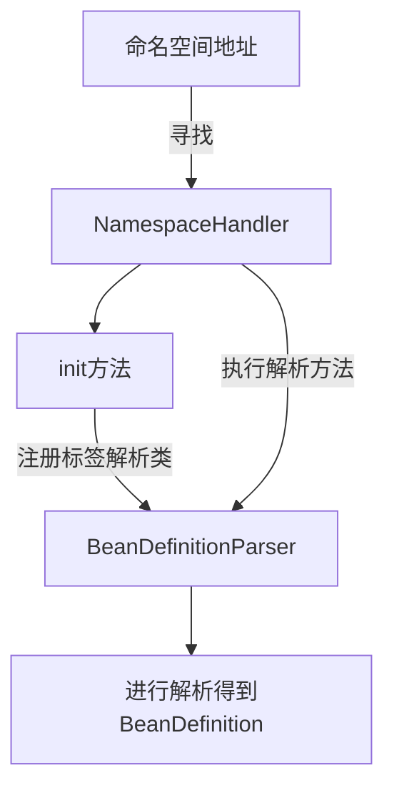

# 第四章 自定义标签解析
- 本章笔者将给各位读者介绍古纳于 Spring 中自定义标签的处理. 

##  4.1 创建自定义标签环境搭建
在[第三章](/docs/ch-03/第三章-IoC资源读取及注册.md)中笔者在最后简单的介绍了 Spring 对于自定义标签的处理方式， 细节展现的不是很多. 在这一章中笔者将详细分析自定义标签的处理. 下面我们开始进入自定义标签环境搭建阶段. 

开始前请各位阅读: [xml-custom](https://docs.spring.io/spring-framework/docs/5.2.3.RELEASE/spring-framework-reference/core.html#xml-custom) 这个文档. 这个文档是 Spring 官方提供了自定义 XML 的细节

- tips: 最早我们可以追溯到 Spring 2.0 版本 ， 在这个版本(2.0)中 Spring 就提供了一种方式让我们来自定义 XML 标签. 

在进行环境搭建之前我们需要了解执行步骤是什么样子的. 

1. 创建一个 XSD 文件来描述自定义标签的元素信息. 
2. 创建 `NamespaceHandler` 接口的实现类
3. 编写一个或多个 `BeanDefinitionParser` 接口的实现类
4. 向 Spring 注册编写的组件， 注册方式是编写 `Spring.handlers` 和 `Spring.schemas` 


在了解处理步骤后我们就开始进行正式的编写阶段. 


###  4.1.1 编写 XSD 文件

笔者这里使用一个叫做 `UserXsd` 的对象来存储自定义标签的属性

```java
// 省略getter&setter
public class UserXsd {
    private String name;

    private String idCard;
}
```

在创建完成存储数据的对象之后我们来编辑 XSD 文件


```xml
<?xml version="1.0" encoding="UTF-8"?>
<schema xmlns="http://www.w3.org/2001/XMLSchema"
        targetNamespace="http://www.huifer.com/schema/user"
        elementFormDefault="qualified">

    <element name="user_xsd">
        <complexType>
            <attribute name="id" type="string"/>
            <attribute name="name" type="string"/>
            <attribute name="idCard" type="string"/>
        </complexType>
    </element>
</schema>
```


###  4.1.2 编写 NamespaceHandler 实现类

- 这一部分主要编写 `NamespaceHandler` 实现类， 在Spring 中我们可以使用 `NamespaceHandlerSupport` 类继承过来覆盖 `init` 方法. 向 Spring 容器注册标签和标签解析对象即可.  

```JAVA
public class UserXsdNamespaceHandler extends NamespaceHandlerSupport {

    @Override
    public void init() {
        registerBeanDefinitionParser("user_xsd"， new UserXsdParser());
    }

}
```


###  4.1.3 编写 BeanDefinitionParser 实现类

- 在编写 `NamespaceHandler` 时出现了对象 `UserXsdNamespaceHandler` 这个对象就是 `BeanDefinitionParser` 的实现类， 在 Spring 中我们可以使用 `AbstractSingleBeanDefinitionParser` 覆盖 `getBeanClass` 和 `doParse` 方法来进行自定义标签的解析. 在本文我们的标签解析逻辑就是将 `name` 和 `idCard` 提取设置到 `BeanDefinitionBuilder` 中. 


```java
public class UserXsdParser extends AbstractSingleBeanDefinitionParser {
    @Override
    protected Class<?> getBeanClass(Element element) {
        return UserXsd.class;
    }

    @Override
    protected void doParse(Element element， BeanDefinitionBuilder builder) {
        String name = element.getAttribute("name");
        String idCard = element.getAttribute("idCard");
        builder.addPropertyValue("name"， name);
        builder.addPropertyValue("idCard"， idCard);
    }

}
```


###  4.1.4 编写注册方式

最后我们需要编写 `spring.handlerS` 和 `spring.schemas` 


- `spring.handlers` 文件编写下面内容

```properties
http\://www.huifer.com/schema/user=com.source.hot.ioc.book.namespace.handler.UserXsdNamespaceHandler
```

我们来进一步了解一下文件内容， 将 `spring.handlers` 文件分为两部分来看， 

	1. 第一部分是等于号前面的， 它是指命名空间和 xsd 文件中 `schema` 中的 `targetNamespace` 属性存在关联关系. 
 	2. 第二部分是等于号后面的， 它是指接口 `NamespaceHandler` 实现类的全路径


- `spring.schemas` 文件编写下面内容

```properties
http\://www.huifer.com/schema/user.xsd=META-INF/user.xsd
```

我们来进一步了解一下文件内容， 将 `spring.schemas` 文件分为两部分来看， 

1. 第一部分是等于号前面的， 它是指 `schemaLocation` 的一个链接地址
2. 第二部分是等于号后面的， 它是指对应 `schemaLocation` 对应的 xsd 描述文件


此时我们的目录结构如下


###  4.1.5 测试用例的编写

前文我们准备了 xsd 文件、 `spring.handler` 、`spring.schemas` 和一些 Java 代码 ，前期准备都做好了下面我们就需要去使用这个自定义的标签. 


####  4.1.5.1 Spring xml 文件编写

- 测试用例编写第一步先完成 Spring xml 文件的编写. 创建 `custom-xml.xml` 往文件中填写下面代码. 

```xml
<?xml version="1.0" encoding="UTF-8"?>
<beans xmlns="http://www.springframework.org/schema/beans"
       xmlns:xsi="http://www.w3.org/2001/XMLSchema-instance"
       xmlns:myname="http://www.huifer.com/schema/user"
       xsi:schemaLocation="http://www.springframework.org/schema/beans http://www.springframework.org/schema/beans/spring-beans.xsd
   http://www.huifer.com/schema/user http://www.huifer.com/schema/user.xsd
">

    <myname:user_xsd id="testUserBean" name="huifer" idCard="123"/>

</beans>
```


####  4.1.5.2 测试用例

- 在 Spring xml 文件编写完成后我们来做 Junit 测试用例的编写


```java
class CustomXmlTest {

    @Test
    void testXmlCustom() {
        ClassPathXmlApplicationContext context = new ClassPathXmlApplicationContext("META-INF/custom-xml.xml");
        UserXsd testUserBean = context.getBean("testUserBean"， UserXsd.class);
        assert testUserBean.getName().equals("huifer");
        assert testUserBean.getIdCard().equals("123");
        context.close();
    }
}
```


到此源码分析前的各个准备工作都已经准备就绪. 下面笔者就带各位进行自定义标签的解析分析了.


##  4.2  自定义标签解析


###  4.2.1 寻找自定义标签、NamesapceHandler 和 BeanDefinitionParser 之间的关系

这里回顾一下[第三章](book/ch-03/第三章-IoC资源读取及注册.md)的内容， 自定义标签的解析方法在哪里? 

- 自定义标签的解析方法: `org.springframework.beans.factory.xml.BeanDefinitionParserDelegate#parseCustomElement(org.w3c.dom.Element， org.springframework.beans.factory.config.BeanDefinition)`


笔者在这儿先将代码贴出来， 各位读者请先进行阅读

```java
@Nullable
public BeanDefinition parseCustomElement(Element ele， @Nullable BeanDefinition containingBd) {
   // 获取命名空间的URL
   String namespaceUri = getNamespaceURI(ele);
   if (namespaceUri == null) {
      return null;
   }
   // 命名空间处理器
   NamespaceHandler handler = this.readerContext.getNamespaceHandlerResolver().resolve(namespaceUri);
   if (handler == null) {
      error("Unable to locate Spring NamespaceHandler for XML schema namespace [" + namespaceUri + "]"， ele);
      return null;
   }
   return handler.parse(ele， new ParserContext(this.readerContext， this， containingBd));
}
```


根据这些参数和前文所写的一些测试代码我们来观察他们的关系. 

1. `namespaceUri` 和谁有关系？

   `namespaceUri` 和前文编写的 `spring.handlers` 的文件内容有一个直接的关系. 在 `spring.handlers` 中我们填写的内容是 命名空间对应命名空间处理器.
   
   根据前文的测试代码这里的 `NamespaceHandler` 应该是 `UserXsdNamespaceHandler` 对象

这是我们可以明着找到的第一层关系. 在 `UserXsdNamespaceHandler` 这个方法中还有一层关系我们来看看


- `UserXsdNamespaceHandler` 代码详情

```java
public class UserXsdNamespaceHandler extends NamespaceHandlerSupport {

    @Override
    public void init() {
        registerBeanDefinitionParser("user_xsd"， new UserXsdParser());
    }

}
```


- `UserXsdParser` 代码详情

```java
public class UserXsdParser extends AbstractSingleBeanDefinitionParser {
    @Override
    protected Class<?> getBeanClass(Element element) {
        return UserXsd.class;
    }

    @Override
    protected void doParse(Element element， BeanDefinitionBuilder builder) {
        String name = element.getAttribute("name");
        String idCard = element.getAttribute("idCard");
        builder.addPropertyValue("name"， name);
        builder.addPropertyValue("idCard"， idCard);
    }

}
```


看着这里的代码笔者补充一个方法

```java
@Nullable
BeanDefinition parse(Element element， ParserContext parserContext);
```


这里似乎可以对应起来了. 

在 `NamespaceHandler` 的实现类 `UserXsdNamespaceHandler` 中通过 `init` 注册的方法 `UserXsdParser` 对象似乎是得到 BeanDefinition 的最重要的方法. 


2. 第二层关系: 自定义标签和自定义标签解析对象的关系


下面笔者绘制一个流程图来简单概述一下自定义标签是如何进行解析的





###  4.2.2 获取命名空间地址

在方法第一步直接就获取 `namespaceUri` 属性， 获取方法是由 `org.w3c.dom` 直接提供的， 这里不展开了， 我们只需要知道这里获得的数据值是: `http://www.huifer.com/schema/user` 就可以了. 


###  4.2.3 NamespaceHandler 对象获取

方法第二步获取命名空间对应的 `NamespaceHandler` 下面就对这一段方法进行展开


```java
NamespaceHandler handler = this.readerContext.getNamespaceHandlerResolver().resolve(namespaceUri);
```


提出疑问: 负责命名空间解析的对象是谁？

- 答: **负责命名空间解析的对象是 `NamespaceHandlerResolver` 接口**


```java
@FunctionalInterface
public interface NamespaceHandlerResolver {

   /**
    * 解析命名空间的 url 获得 命名空间处理器
    */
   @Nullable
   NamespaceHandler resolve(String namespaceUri);

}
```


下面我们去找到 `NamespaceHandlerResolver` 接口的实现类 ， 幸运的是 Spring 在这里只有一个实现类 `DefaultNamespaceHandlerResolver` 这省去了很多对象确认的过程. 

在 `DefaultNamespaceHandlerResolver` 类的成员变量中有一个我们十分熟悉的内容


```java
public static final String DEFAULT_HANDLER_MAPPINGS_LOCATION = "META-INF/spring.handlers";
```


在 `spring.handlers` 中我们不就是放了一个 key 是命名空间 value 是命名空间处理对象的类全路径吗. 下面我们来看 `resolve` 方法到底做了什么. 

- `resolve` 方法详情

```java
// 删除异常处理和日志
public NamespaceHandler resolve(String namespaceUri) {
    // 获取 namespace handler 映射表
    Map < String， Object > handlerMappings = getHandlerMappings();
    // 从映射表中获取 uri 对应的 handler
    // 1. 字符串(名称)
    // 2. 实例
    Object handlerOrClassName = handlerMappings.get(namespaceUri);
    if(handlerOrClassName == null) {
        return null;
    } else if(handlerOrClassName instanceof NamespaceHandler) {
        return(NamespaceHandler) handlerOrClassName;
    }
    // 其他情况都做字符串处理
    else {
        String className = (String) handlerOrClassName;
        Class <? > handlerClass = ClassUtils.forName(className， this.classLoader);
        // 通过反射构造 namespaceHandler 实例
        NamespaceHandler namespaceHandler = (NamespaceHandler) BeanUtils.instantiateClass(handlerClass);
        // 初始化
        namespaceHandler.init();
        // 重写缓存
        handlerMappings.put(namespaceUri， namespaceHandler);
        return namespaceHandler;
    }
}
```


先将大体流程整理出来， 稍后再来分析每一个流程中的细节

1. 获取命名空间映射关系即 命名空间url -> 命名空间解析对象类全路径 ， 是一个 `map` 集合

2. 在第一步中得到的 `map` 集合中根据参数 `namespaceUri` 获取对应的对象

3. 根据对象的不同情况进行处理

   - 情况1: 通过 `namespaceUri` 获取的对象是 `NamespaceHandler` 类型

     直接返回即可使用

   - 情况2: 通过 `namespaceUri` 获取的对象不是 `NamespaceHandler` 类型

     - 当获取的不是 `NamespaceHandler` 时只可能是**字符串** ， 字符串是没有办法直接使用方法的 (`NamespaceHandler` 的方法 ) ， 在此 Spring 需要将其转换成  `NamespaceHandler`  对象

       在转换完成对象后进行 `init` 方法调用. 

       最后将数据重新放入缓存. **此时需要注意放入缓存的 value 是一个具体的对象， 而不是字符串.** 


###  4.2.4 getHandlerMappings 获取命名空间的映射关系

笔者先将 `getHandlerMappings` 的代码全部贴出来， 各位读者请先阅读. 

```java
// 删除异常处理和日志
private Map < String， Object > getHandlerMappings() {
    // 设置容器
    Map < String， Object > handlerMappings = this.handlerMappings;
    if(handlerMappings == null) {
        synchronized(this) {
            handlerMappings = this.handlerMappings;
            if(handlerMappings == null) {
                // 读取 资源文件地址
                Properties mappings = PropertiesLoaderUtils.loadAllProperties(this.handlerMappingsLocation， this.classLoader);
                handlerMappings = new ConcurrentHashMap < > (mappings.size());
                // 数据合并， 将 mappings 数据拷贝给 handlerMappings
                CollectionUtils.mergePropertiesIntoMap(mappings， handlerMappings);
                this.handlerMappings = handlerMappings;
            }
        }
    }
    return handlerMappings;
}
```


在 `getHandlerMappings` 方法中我们最值得关注的就是下面这段代码. 

```java
Properties mappings =
      PropertiesLoaderUtils.loadAllProperties(this.handlerMappingsLocation， this.classLoader);
```

这段代码是用来读取 `META-INF/spring.handlers` 文件的. Spring 将 `META-INF/spring.handlers` 文件当作拓展名为: `*.properties` 的文件进行处理. 处理得到的就是一个 map 对象 

在读取 `META-INF/spring.handlers` 之后 Spring 还进行了两个 map 对象的合并， 将历史的 `handlerMappings` 和本次读取到的 `handlerMappings` 做了一次合并

下面笔者进行 debug 将读取到的信息截图出来给各位读者进行一个了解

- 读取到的 `handlerMappings` 信息


在上面的截图中我们可以看到这样一条信息 `http://www.huifer.com/schema/user -> com.source.hot.ioc.book.namespace.handler.UserXsdNamespaceHandler` ， 这条信息就是我们在本章开始的是所编写的一个 `spring.handlers` 文件中的内容， 那么其他信息是从哪里来的? 这个问题的答案各位读者已经知道了. 在前文我们提到了一个成员变量

```java
public static final String DEFAULT_HANDLER_MAPPINGS_LOCATION = "META-INF/spring.handlers";
```

这个成员变量指向的地址中就包含了其他的 `handler` 数据信息， 下面笔者将完整的数据资料贴出. 


- `spring-beans` 工程下的 `spring.handlers`

```properties
http\://www.springframework.org/schema/c=org.springframework.beans.factory.xml.SimpleConstructorNamespaceHandler
http\://www.springframework.org/schema/p=org.springframework.beans.factory.xml.SimplePropertyNamespaceHandler
http\://www.springframework.org/schema/util=org.springframework.beans.factory.xml.UtilNamespaceHandler
```

- `spring-aop` 工程下的 `spring.handlers`

```properties
http\://www.springframework.org/schema/aop=org.springframework.aop.config.AopNamespaceHandler
```

- `spring-context` 工程下的 `spring.handlers`

```properties
http\://www.springframework.org/schema/context=org.springframework.context.config.ContextNamespaceHandler
http\://www.springframework.org/schema/jee=org.springframework.ejb.config.JeeNamespaceHandler
http\://www.springframework.org/schema/lang=org.springframework.scripting.config.LangNamespaceHandler
http\://www.springframework.org/schema/task=org.springframework.scheduling.config.TaskNamespaceHandler
http\://www.springframework.org/schema/cache=org.springframework.cache.config.CacheNamespaceHandler
```


- 这些就是 Spring 默认提供的 `NamespaceHandler` 资料了. 各位读者可以根据需要进行拓展阅读


- 在了解到此时我们对 `resolve` 方法的第一步已经了解到位了， 下面就进入到 `NamespaceHandler` 的获取

  

###  4.2.5 NamespaceHandler 的获取

在前面我们准备好了  `handlerMappings` 这个对象. 下面我们需要做的事情是初始化对象或者直接返回对象

- 首先我们先来看获取的方式

```java
Object handlerOrClassName = handlerMappings.get(namespaceUri);
if(handlerOrClassName == null) {
    return null;
} else if(handlerOrClassName instanceof NamespaceHandler) {
    return(NamespaceHandler) handlerOrClassName;
}
// 其他情况都做字符串处理
else {
    String className = (String) handlerOrClassName;
    Class <? > handlerClass = ClassUtils.forName(className， this.classLoader);
    // 通过反射构造 namespaceHandler 实例
    NamespaceHandler namespaceHandler = (NamespaceHandler) BeanUtils.instantiateClass(handlerClass);
    // 初始化
    namespaceHandler.init();
    // 重写缓存
    handlerMappings.put(namespaceUri， namespaceHandler);
    return namespaceHandler;
}
```


这段代码中我们可以直接看到三种情况

1. 容器中没有当前 `namespaceUri` 的值
2. 容器中有 并且类型是 `NamespaceHandler`
3. 容器中有 但类型不是 `NamespaceHandler` 

前两种情况很好理解， 重点我们放在第三种情况上. 第三种情况类型不是 `NamespaceHandler` 那它是什么类型呢？

请各位读者看下面这张图， 下面这张图中会告诉我们答案


第三种情况的类型是: `String` 

在知道类型后下面就是 Java 反射相关的操作了. 问: **已知类全路径请问如何得到实例?**

1. **`Class.forName` 得到 `Class` 对象**
2. **从 `Class` 中获取构造函数对象 `Constructor`**
3. **构造函数对象创建实例**

这三步操作映射到前文提到的代码分别是什么呢？

第一步可以映射成这段代码 `Class<?> handlerClass = ClassUtils.forName(className， this.classLoader);`

Spring 中有一个工具类 `BeanUtils.instantiateClass`  在这个工具类中 就实现了第二步和第三步， 这里各位读者可以进行拓展阅读， 笔者这里不展开阅读这个类. 


到此 `NamespaceHandler` 对象已经准备完毕了. 不过在 `NamespaceHandler` 接口定义中还有一个关于生命周期的方法 `init` (笔者姑且称之为生命周期方法) ， 这个方法在得到 `NamespaceHandler` 后会被立即执行. 


回到我们的测试用例中， 测试用例中我们编写了 `UserXsdNamespaceHandler` 对象在其中做了一部分操作

- `UserXsdNamespaceHandler` 的具体操作

```java
public class UserXsdNamespaceHandler extends NamespaceHandlerSupport {

    @Override
    public void init() {
        registerBeanDefinitionParser("user_xsd"， new UserXsdParser());
    }

}
```


这儿我们产生了一个疑问 `init` 里面到底做了什么呢？下面笔者将揭开它的面纱


###  4.2.6 NamespaceHandler 的 init 方法

首先从我们自己编写的 `UserXsdNamespaceHandler` 中可以发现继承了 `NamespaceHandlerSupport` 类， 毋庸置疑重点内容肯定都在 `NamespaceHandlerSupport` 中.  其实 Spring 中的所有再 `spring.handlers` 文件中出现的类都继承了 `NamespaceHandlerSupport` 类. 可见 `NamespaceHandlerSupport` 的重要性. 

不可否认的是在使用 `NamespaceHandlerSupport` 的过程中我们和 Spring 自己编写的实现类都是一个模板. 即**重写 `init` 方法， 在其中调用 `registerBeanDefinitionParser` 方法 (可以使用其他方法如`registerBeanDefinitionDecorator`)**

- 下面笔者找一个 AOP 相关的 `NamespaceHandler` 

```JAVA
public class AopNamespaceHandler extends NamespaceHandlerSupport {

 /**
  * Register the {@link BeanDefinitionParser BeanDefinitionParsers} for the
  * '{@code config}'， '{@code spring-configured}'， '{@code aspectj-autoproxy}'
  * and '{@code scoped-proxy}' tags.
  */
 @Override
 public void init() {
    // In 2.0 XSD as well as in 2.1 XSD.
    registerBeanDefinitionParser("config"， new ConfigBeanDefinitionParser());
    // Spring AOP 解析
    registerBeanDefinitionParser("aspectj-autoproxy"， new AspectJAutoProxyBeanDefinitionParser());
    registerBeanDefinitionDecorator("scoped-proxy"， new ScopedProxyBeanDefinitionDecorator());

    // Only in 2.0 XSD: moved to context namespace as of 2.1
    registerBeanDefinitionParser("spring-configured"， new SpringConfiguredBeanDefinitionParser());
 }

}
```


在我们测试用例编写时采用的方法是: `registerBeanDefinitionParser` 下面我们就来对其进行分析

首先来整体看一下代码

```java
protected final void registerBeanDefinitionParser(String elementName， BeanDefinitionParser parser) {
   this.parsers.put(elementName， parser);
}
```


代码看完了结合我们的调用我们可以知道两个参数的含义

1. `elementName` : xml 标签的名称
2. `parser `: 标签解析的实际对象， `BeanDefinitionParser` 的实现类

参数已经了解了， 下面来看看 `parsers` 这个变量是什么. 

```java
private final Map<String， BeanDefinitionParser> parsers = new HashMap<>();
```

从 `parsers` 的定义我们可以明确 key: xml 标签的名称 ， value: `BeanDefinitionParser` 接口的实现类. 

在知道这些信息后我们来打个断点看看调用后的对象 `parsers` 存储情况


到这 `init` 方法的细节都分析完成. 接下来就剩下最后一步了， 刷新 `NamespaceHandler` 缓存


###  4.2.7 `NamespaceHandler`  缓存的刷新


最后在 `NamespaceHandler` 的生命周期方法 `init` 执行完成后会刷新 `namespaceUri` 对应的 `value` 此时就会产生 `handlerMappings` 中 `value` 的多种情况

1. 不存在
2. 实例
3. 字符串

刷新 `handlerMappings` 变量的操作代码如下

```java
handlerMappings.put(namespaceUri， namespaceHandler)
```

- `namespaceHandler` 变量是一个实例

此时在 `handlerMappings` 中 `http://www.huifer.com/schema/user` 的 `value` 就是实例

这样下一次在使用时就会进入 类型判断的代码， 判断代码如下

```java
else if (handlerOrClassName instanceof NamespaceHandler) {
   return (NamespaceHandler) handlerOrClassName;
}
```

因为 `handlerMappings` 放进去的就是 `NamespaceHandler` 实现类， 所以此时就会直接返回. 


在这里 Spring 通过了一个 Map 对象的刷新操作来提高了性能，避免了每次从字符串出发进行反射获取实例， 获取实例之后再做其他操作. 


最后我们来看刷新后的 对象 `handlerMappings` 存储情况

可以发现此时	`http://www.huifer.com/schema/user -> {UserXsdNamespaceHandler@3395} ` 这一段信息已经变成了真正的 `NamespaceHandler` 实现类了. 


到这儿笔者就将下面这段代码分析完成了. 

```java
  NamespaceHandler handler = this.readerContext.getNamespaceHandlerResolver().resolve(namespaceUri);
```


现在我们已经知道了 `NamespaceHandler` 对象的获取过程， 下面就需要进入到真正的解析过程了. 对应代码就是下面这段

```java
handler.parse(ele， new ParserContext(this.readerContext， this， containingBd))
```


###  4.2.8 解析标签 - BeanDefinitionParser 对象准备

首先将信息重新归并一下， 我们在执行 `parse` 方法前我们有什么. 先看代码 

```java
NamespaceHandler handler = this.readerContext.getNamespaceHandlerResolver().resolve(namespaceUri);
return handler.parse(ele， new ParserContext(this.readerContext， this， containingBd));
```

在这段代码中根据前文所述我们得到的了 `NamespaceHandler` 对象， 这个对象的真正实例是 : `UserXsdNamespaceHandler` 

执行 `parse` 之前我们有一个明确的 `NamespaceHandler` 实现类是 `UserXsdNamespaceHandler`

在确认 `UserXsdNamespaceHandler` 对象之后， `parse` 方法的寻找也就有了一个方向， 在 `UserXsdNamespaceHandler` 中肯定有所提及. 但是我们编写 `UserXsdNamespaceHandler` 对象的时候并没有编写 `parse` 方法， 其实这个方法藏匿在 `NamespaceHandlerSupport` 中 下面我们就来看看这个方法的细节.


- 先看 `NamespaceHandlerSupport#parse` 方法详情

```JAVA
public BeanDefinition parse(Element element， ParserContext parserContext) {
   // 搜索 element 对应的  BeanDefinitionParser
   BeanDefinitionParser parser = findParserForElement(element， parserContext);
   // 解析
   return (parser != null ? parser.parse(element， parserContext) : null);
}
```


在开始前我们思考一个问题: 就现在这些参数而言我们可以通过什么和 `BeanDefinitionParser` 有所关系. 


这个关系就在 `init` 方法中， `init` 方法中我们注册了 xml 标签名称和 `BeanDefinitionParser` 的关系， 而此时我们传入的对象是 `Element` 和 `ParserContext` ， `Element` 不就是 xml 中的一个标签么， 只不过它是 Java 对象罢了， 那么这个标签必然有一个标签名称. 在看看我们之前存储的容器

```java
private final Map<String， BeanDefinitionParser> parsers = new HashMap<>();
```

这个容器里面的键值不就正好是我们的关系吗. 


在了解了前面这部分知识后我们来看 `findParserForElement` 到底做了什么

- `NamespaceHandlerSuppor#findParserForElement` 方法详情

  ```java
  private BeanDefinitionParser findParserForElement(Element element， ParserContext parserContext) {
     // 获取 element 的名称
     String localName = parserContext.getDelegate().getLocalName(element);
     // 从容器中获取
     BeanDefinitionParser parser = this.parsers.get(localName);
     if (parser == null) {
        parserContext.getReaderContext().fatal(
              "Cannot locate BeanDefinitionParser for element [" + localName + "]"， element);
     }
     return parser;
  }
  ```

哦， 我们懂了， Spring 在这通过 `ParserContext` 对象来获取 `Element` 的名称 ， 然后从容器 `parsers` 中获取对应的 `BeanDefinitionParser` 对象返回. 


这便是通过 `Element` 对象得到 `BeanDefinitionParser` 的完整过程. 下面笔者贴几个图来补充一下细节


下面就是解析标签的最后一步了 `parse` 方法的调用. 


###  4.2.9 解析标签 - parse 方法调用

首先我们需要找到 `parse` 方法的提供者. **在 Spring 中 `parse` 方法的提供者是: `AbstractBeanDefinitionParser`** 

- 首先笔者将完整的 `AbstractBeanDefinitionParser#parse` 方法贴出来， 各位读者请先阅读

```java
// 删除异常处理和日志
public final BeanDefinition parse(Element element， ParserContext parserContext) {
    // 解析 Element 得到 BeanDefinition 对象
    AbstractBeanDefinition definition = parseInternal(element， parserContext);
    if(definition != null && !parserContext.isNested()) {
        // 解析标签的 id
        String id = resolveId(element， definition， parserContext);
        if(!StringUtils.hasText(id)) {
            parserContext.getReaderContext().error("Id is required for element '" + parserContext.getDelegate().getLocalName(element) + "' when used as a top-level tag"， element);
        }
        String[] aliases = null;
        if(shouldParseNameAsAliases()) {
            // 标签的 name 属性
            String name = element.getAttribute(NAME_ATTRIBUTE);
            if(StringUtils.hasLength(name)) {
                // 别名处理， 字符串切割逗号
                aliases = StringUtils.trimArrayElements(StringUtils.commaDelimitedListToStringArray(name));
            }
        }
        // 创建 BeanDefinitionHolder
        BeanDefinitionHolder holder = new BeanDefinitionHolder(definition， id， aliases);
        // 注册 BeanDefinition
        registerBeanDefinition(holder， parserContext.getRegistry());
        // 是否需要出发事件
        if(shouldFireEvents()) {
            // 组件注册事件
            BeanComponentDefinition componentDefinition = new BeanComponentDefinition(holder);
            postProcessComponentDefinition(componentDefinition);
            parserContext.registerComponent(componentDefinition);
        }
    }
    return definition;
}
```


在这段代码中直接读我们根本发现不了 `UserXsdParser` 对象的踪迹. 笔者给各位点一下**看一看 `UserXsdParser` 的类图结构** ， 从类图结构上是否可以发现什么. 

- `UserXsdParser` 类图

  


哦~ 在这个类图上大有文章啊， 这一路下来 `AbstractBeanDefinitionParser` -> `AbstractSingleBeanDefinitionParser` -> `UserXsdParser` 全在一起. 类图结构清晰了以后我们来看第一段代码

```java
AbstractBeanDefinition definition = parseInternal(element， parserContext);
```


`parseInternal` 方法在 `AbstractBeanDefinitionParser` 是一个抽象方法， 真正的实现在 `AbstractSingleBeanDefinitionParser` 中， 话不多说笔者先将代码全部贴出来


- `AbstractSingleBeanDefinitionParser#parseInternal` 方法详情

```JAVA
@Override
protected final AbstractBeanDefinition parseInternal(Element element， ParserContext parserContext) {
	// BeanDefinition 构造器
	BeanDefinitionBuilder builder = BeanDefinitionBuilder.genericBeanDefinition();
	// 获取 parent 属性
	String parentName = getParentName(element);
	if (parentName != null) {
		builder.getRawBeanDefinition().setParentName(parentName);
	}

	// 获取 class 属性
	Class<?> beanClass = getBeanClass(element);
	if (beanClass != null) {
		builder.getRawBeanDefinition().setBeanClass(beanClass);
	}
	else {
		String beanClassName = getBeanClassName(element);
		if (beanClassName != null) {
			builder.getRawBeanDefinition().setBeanClassName(beanClassName);
		}
	}
	// 设置源
	builder.getRawBeanDefinition().setSource(parserContext.extractSource(element));

	// 获取已存在的 BeanDefinition ， 该对象禁用来设置 scope 属性
	BeanDefinition containingBd = parserContext.getContainingBeanDefinition();
	if (containingBd != null) {
		// Inner bean definition must receive same scope as containing bean.
		builder.setScope(containingBd.getScope());
	}
	if (parserContext.isDefaultLazyInit()) {
		// Default-lazy-init applies to custom bean definitions as well.
		builder.setLazyInit(true);
	}
	// 真正的调用
	doParse(element， parserContext， builder);
	// BeanDefinition 构造器中获取 BeanDefinition
	return builder.getBeanDefinition();
}
```


在看完 `AbstractSingleBeanDefinitionParser#parseInternal` 方法后请各位读者回忆一下 `UserXsdParser` 我们做了什么. 我们重写了 `getBeanClass` 和 `doParse` 方法

- `UserXsdParser` 详细信息

```java
public class UserXsdParser extends AbstractSingleBeanDefinitionParser {
    @Override
    protected Class<?> getBeanClass(Element element) {
        return UserXsd.class;
    }

    @Override
    protected void doParse(Element element， BeanDefinitionBuilder builder) {
        String name = element.getAttribute("name");
        String idCard = element.getAttribute("idCard");
        builder.addPropertyValue("name"， name);
        builder.addPropertyValue("idCard"， idCard);
    }

}
```


不过我们重写的 `doParse` 并不是在 `AbstractSingleBeanDefinitionParser#parseInternal` 方法中直接调用的 `doParse` 而是进一步的调用方法， 详细信息可以看下面代码

```java
// AbstractSingleBeanDefinitionParser#parseInternal 中调用
protected void doParse(Element element， ParserContext parserContext， BeanDefinitionBuilder builder) {
   doParse(element， builder);
}

// 我们重写的
protected void doParse(Element element， BeanDefinitionBuilder builder) {
}
```


相信各位读者肯定知道了 `AbstractSingleBeanDefinitionParser#parseInternal` 方法的细节了

1. 准备基本数据， 基本数据包含 `parentName` 、`beanClass`、`source` 、`scope` 
2. 执行自定义的 `doParse` 方法
3. 通过 `BeanDefinitionBuilder` 来获取 `BeanDefinition`

这便是我们所编写的 `UserXsdParser` 和 Spring 之间的关系. 下面笔者来做几个贴图充实一下细节. 


- BeanClass的信息

  

- BeanDefinition 的属性

  

- 到这 `AbstractBeanDefinitionParser#parse` 的第一行代码分析完成， 继续往阅读吧 . 


首先要进行的就是 `id` 属性的处理

```java
String id = resolveId(element， definition， parserContext);
```

`id` 属性的的获取就是解析 xml 文档得到 id 属性值， 各位读者有兴趣可以自行展开阅读， 笔者这里不做讨论。


其次要进行的是关于 别名的处理

```java
String[] aliases = null;
if (shouldParseNameAsAliases()) {
   // 标签的 name 属性
   String name = element.getAttribute(NAME_ATTRIBUTE);
   if (StringUtils.hasLength(name)) {
      // 别名处理， 字符串切割逗号
      aliases = StringUtils.trimArrayElements(StringUtils.commaDelimitedListToStringArray(name));
   }
}
```

在别名处理阶段会去判断是否需要处理别名， **默认是都需要处理的**

别名处理方式是将标签的 `name` 属性进行逗号(`，`) 切分，即 `name.split("，")` ， 关于切分方法在 `StringUtils.commaDelimitedListToStringArray` 中有体现详细内容， 各位读者有兴趣可以自行展开阅读， 笔者这里不做讨论。


最后需要进行的是 `BeanDefinition` 的注册和事件发布

```java
BeanDefinitionHolder holder = new BeanDefinitionHolder(definition， id， aliases);
// 注册 BeanDefinition
registerBeanDefinition(holder， parserContext.getRegistry());
// 是否需要出发事件
if (shouldFireEvents()) {
   // 组件注册事件
   BeanComponentDefinition componentDefinition = new BeanComponentDefinition(holder);
   postProcessComponentDefinition(componentDefinition);
   parserContext.registerComponent(componentDefinition);
}
```

在这个阶段对于是否需要进行事件发布在 **Spring 中默认是需要进行事件发布**

关于 `BeanDefinition` 的注册笔者会在[第七章](/docs/ch-07/第七章-BeanDefinition注册.md)做详细分析， 这里仅仅提一下存储容器

```java
private final Map<String， BeanDefinition> beanDefinitionMap = new ConcurrentHashMap<>(256);
```

关于事件发布笔者在[第三章](/docs/ch-03/第三章-IoC资源读取及注册.md)的时候已经做了一个说明， 各位可以阅读[第三章](/docs/ch-03/第三章-IoC资源读取及注册.md)来补充这一块知识. 这里简单提一下 `ReaderEventListener` 对象的实现类 `EmptyReaderEventListener` 是一个空实现. 


到这儿什么东西都准备好了， 就差将结果返回了. `return` 就不说了到此 `AbstractBeanDefinitionParser#parse` 的分析完成， 这个分析完成了那么整个自定义标签的解析也就完成了. 


##  4.3 总结

- 经过整一章节的阅读相信各位对自定义标签的解析已经有一个了解了， 下面再来看看 `BeanDefinitionParserDelegate#parseCustomElement` 方法， 并做一个总结. 

```java
@Nullable
public BeanDefinition parseCustomElement(Element ele， @Nullable BeanDefinition containingBd) {
   // 获取命名空间的URL
   String namespaceUri = getNamespaceURI(ele);
   if (namespaceUri == null) {
      return null;
   }
   // 命名空间处理器
   NamespaceHandler handler = this.readerContext.getNamespaceHandlerResolver().resolve(namespaceUri);
   if (handler == null) {
      error("Unable to locate Spring NamespaceHandler for XML schema namespace [" + namespaceUri + "]"， ele);
      return null;
   }
   return handler.parse(ele， new ParserContext(this.readerContext， this， containingBd));
}
```


在这一章节中我们学到了自定义标签的使用。

在分析阶段我们了解了 `NamespaceHandler` 、`NamespaceHandlerSupport` 、`AbstractSingleBeanDefinitionParser` 、`AbstractBeanDefinitionParser` 和 `BeanDefinitionParser` 之间的关系， 这些内容在 Spring 中是一个十分重要的技术点， Spring 后续的一些内容都强依赖于这一门技术(**自定义标签解析**)， 常见的有 SpringMVC 、Spring事务、SpringAOP 等， 它们都是基于此作为一个拓展实现了更强大的功能. 