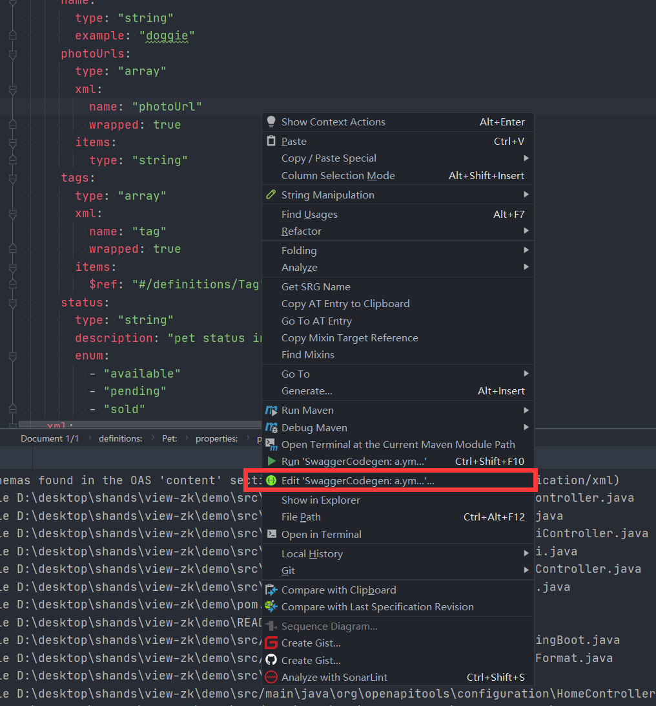
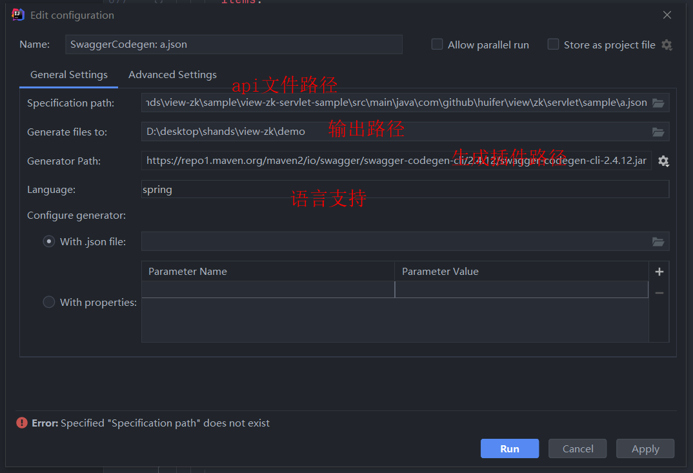
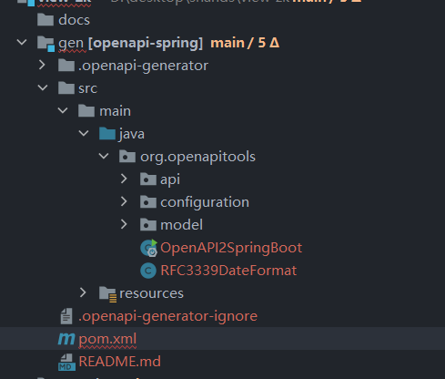
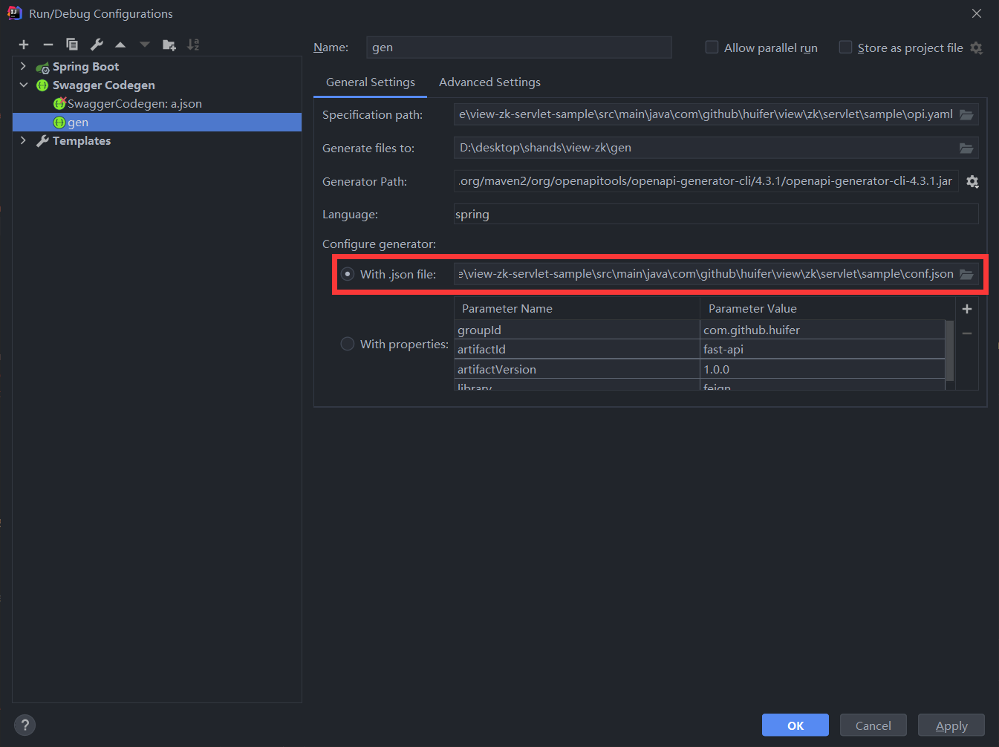
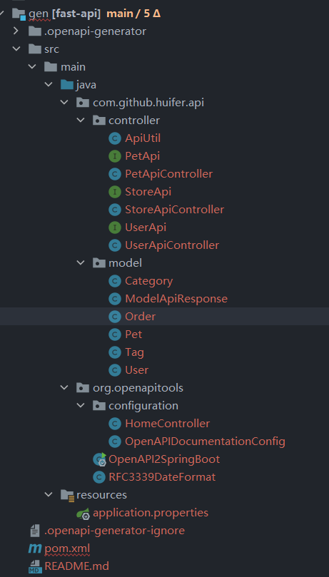

# Swagger 使用指北

> author: [huifer](https://github.com/huifer)

## 介绍

> Simplify API development for users, teams, and enterprises with the Swagger open source and professional toolset. Find out how Swagger can help you design and document your APIs at scale.
>
> from: https://swagger.io/


## 使用

### 第一部分

- 第一部分通常是一些基本信息的标注. 简单信息如下

```yml
swagger: "2.0"
info:
  description: "This is a sample server Petstore server.  You can find out more about     Swagger at [http://swagger.io](http://swagger.io) or on [irc.freenode.net, #swagger](http://swagger.io/irc/).      For this sample, you can use the api key `special-key` to test the authorization     filters."
  version: "1.0.0"
  title: "Swagger Petstore"
  termsOfService: "http://swagger.io/terms/"
  contact:
    email: "apiteam@swagger.io"
    url: ""
    name: ""
  license:
    name: "Apache 2.0"
    url: "http://www.apache.org/licenses/LICENSE-2.0.html"
```

- swagger: swagger 版本
- info: 信息
  - description:描述内容
  - version: api版本号
  - title: 标题
  - termsOfService: 链接到描述服务条款的页面。
  - contact: 联系方式
    - email: 邮箱
    - name: 名称 
    - url: url
  - license: 版权
    - name: 版权每次
    - url: 版权地址


### 第二部分

- api 补充信息

```yml
host: "petstore.swagger.io"
basePath: "/v2"
tags:
  - name: "pet"
    description: "Everything about your Pets"
    externalDocs:
      description: "Find out more"
      url: "http://swagger.io"
  - name: "store"
    description: "Access to Petstore orders"
  - name: "user"
    description: "Operations about user"
    externalDocs:
      description: "Find out more about our store"
      url: "http://swagger.io"
schemes:
  - "https"
  - "http"
```

- host: host

- basePath: basePath

  **host+basePath** 组成访问前缀

- tags

  - name: tag 名称
  - description: 描述
  - externalDocs: 外部文档
    - description: 外部文档描述
    - url: 外部文档地址

- schemes: 方式


### 第三部分

```yml
paths:
  /pet:
    post:
      tags:
        - "pet"
      summary: "Add a new pet to the store"
      description: ""
      operationId: "addPet"
      consumes:
        - "application/json"
        - "application/xml"
      produces:
        - "application/xml"
        - "application/json"
      parameters:
        - in: "body"
          name: "body"
          description: "Pet object that needs to be added to the store"
          required: true
          schema:
            $ref: "#/definitions/Pet"
      responses:
        "405":
          description: "Invalid input"
      security:
        - petstore_auth:
            - "write:pets"
            - "read:pets"
```


- paths: 地址列表
  - /{path} : url地址路径
    - post/delete/put/get: 请求方式
      - tags: 标签列表
      - summary: 概述
      - description: 详情
      - operationId: 操作标识符,全局唯一
      - consumes: 参数类型
      - produces: 参数类型
      - parameters: 具体参数对象
        - name: 名称
        - in: 参数位置（“query”、“header”、“path”、“cookie”，“body"）
        - description: 参数描述
        - required: 是否必填
        - schema: 连接对象
      - responses: 返回对象
        - code: 标识码
          - description: 标识描述


### 第四部分

- 安全

```yml
securityDefinitions:
  petstore_auth:
    type: "oauth2"
    authorizationUrl: "http://petstore.swagger.io/oauth/dialog"
    flow: "implicit"
    scopes:
      write:pets: "modify pets in your account"
      read:pets: "read your pets"
  api_key:
    type: "apiKey"
    name: "api_key"
    in: "header"
```


### 第五部分

- 实体对象


```yml
definitions:
  Order:
    type: "object"
    properties:
      id:
        type: "integer"
        format: "int64"
      petId:
        type: "integer"
        format: "int64"
      quantity:
        type: "integer"
        format: "int32"
      shipDate:
        type: "string"
        format: "date-time"
      status:
        type: "string"
        description: "Order Status"
        enum:
          - "placed"
          - "approved"
          - "delivered"
      complete:
        type: "boolean"
        default: false
    xml:
      name: "Order"
```

- definitions: 定义列表
  - Order: 对象名称
    - type: 类型
    - properties: 属性列表
      - 字段名称
        - type: 字段类型
        - format: 格式化类型
        - description: 描述
        - default: 默认值


**外联语法**

```
category:
  $ref: "#/definitions/Category"
```


### 第六部分

- response

```yml
responses:
  "200":
    description: OK
  "404":
    description: fond out
```


- responses
  - 状态码
    - description: 描述


## 实战

- swagger、openApi 文档编写跳过了. 这里直接使用swagger-editor提供的demo进行生成代码


先将文件放入idea的项目工程


在文件上右键



- 弹出下面窗口





点击 run 即可得到相关代码




- 此时生成的路径可能不太符合我们的需求. 在这里可以使用配置文件来进行修改

  ```json
  {
    "groupId":"com.github.huifer",
    "artifactId": "fast-api",
    "artifactVersion":"1.2.0",
    "apiPackage": "com.github.huifer.api.controller",
    "modelPackage": "com.github.huifer.api.model",
    "library":"spring-boot"
  }
  ```

  修改启动命令

  

  

  

  

  


## 资料


- https://swagger.io/
- https://swagger.io/docs/specification/api-general-info/
- https://swagger.io/docs/specification/about/

- https://github.com/OAI/OpenAPI-Specification

- https://github.com/OAI/OpenAPI-Specification/blob/master/versions/2.0.md
- https://github.com/openapitools/openapi-generator

- https://www.jetbrains.com/help/idea/openapi.html