# crud template 用例演示 
- 项目地址: https://github.com/huifer/crud/tree/dev
## 依赖
- 本次使用的是快照版本,请做出如下的maven调整

- pom.xml
```xml

  <dependencies>
    <dependency>
      <groupId>com.github.huifer</groupId>
      <artifactId>for-mybatis</artifactId>
      <version>0.0.5-Releases</version>
    </dependency>
  </dependencies>

  <repositories>
    <repository>
      <id>oss-snapshots</id>
      <name>oss快照</name>
      <url>https://oss.sonatype.org/content/repositories/snapshots</url>
      <snapshots>
        <enabled>true</enabled>
        <updatePolicy>always</updatePolicy>
      </snapshots>
    </repository>
  </repositories>
```

- setting.xml

```xml
  <mirrors>
    <mirror>
      <id>aliyunmaven</id>
      <mirrorOf>*</mirrorOf>
      <name>阿里云公共仓库</name>
      <url>https://maven.aliyun.com/repository/public</url>
    </mirror>


    <mirror>
      <id>oss-sp</id>
      <mirrorOf>oss-snapshots</mirrorOf>
      <name>oss快照</name>
      <url>https://oss.sonatype.org/content/repositories/snapshots</url>
    </mirror>
  </mirrors>

  <profiles>


    <profile>
      <id>oss-snapshots</id>
      <repositories>
        <repository>
          <id>alibaba</id>
          <releases>
            <enabled>true</enabled>
          </releases>
          <snapshots>
            <enabled>false</enabled>
          </snapshots>
          <url>https://maven.aliyun.com/repository/public</url>
        </repository>


        <repository>
          <id>nexus_snapshot_repository</id>
          <releases>
            <enabled>false</enabled>
          </releases>
          <snapshots>
            <enabled>true</enabled>
          </snapshots>
          <url>https://oss.sonatype.org/content/repositories/snapshots</url>
          <layout>default</layout>
        </repository>
      </repositories>
    </profile>
  </profiles>
```

- 如果不想修改配置可以直接下载项目: [crud](https://github.com/huifer/crud) 切换到dev分支. 用例内容在 simple-example 中


## crud 测试
- 首先贴出相关代码

```java
@SpringBootApplication
@EnableCrudTemplate(daoType = DaoType.MYBATIS,scanPackages = {"com.github.huifer.mybatis"})
public class MybatisApp {

  public static void main(String[] args) {
    SpringApplication.run(MybatisApp.class, args);
  }
}

@Mapper
@CacheKey(key = "issues", type = IssuesEntity.class)
public interface IssuesMapper extends A<Integer, IssuesEntity> {

  @Insert("   insert into issue(new_title)values(#{newTitle,jdbcType=VARCHAR})")
  @Options(useGeneratedKeys = true, keyProperty = "id", keyColumn = "id")
  int insertSelective(IssuesEntity record);

  @Select("select * from issue where id = #{integer} ")
  IssuesEntity selectByPrimaryKey(Integer integer);

  @Override
  @Update("UPDATE `issue` SET `new_title` = #{newTitle}  WHERE `id` = #{id} ")
  int updateByPrimaryKeySelective(IssuesEntity record);
}


public class IssuesEntity implements BaseEntity {


  private Integer id;
  private String newTitle;

  private String ooo() {
    return "OOO" + this.newTitle;
  }

  public Integer getId() {
    return id;
  }

  public void setId(Integer id) {
    this.id = id;
  }

  public String getNewTitle() {
    return newTitle;
  }

  public void setNewTitle(String newTitle) {
    this.newTitle = newTitle;
  }
}
```


### 测试新增对象
```java
  @Test
  void testInsert() {
    IssuesEntity issuesEntity = new IssuesEntity();
    issuesEntity.setNewTitle("mybatis_test");
    crudFacade.insert(issuesEntity);
  }
```
#### 开启 mapper上的`@CacheKey` 

- 希望结果时redis和数据库都存有

- 执行结果如下图

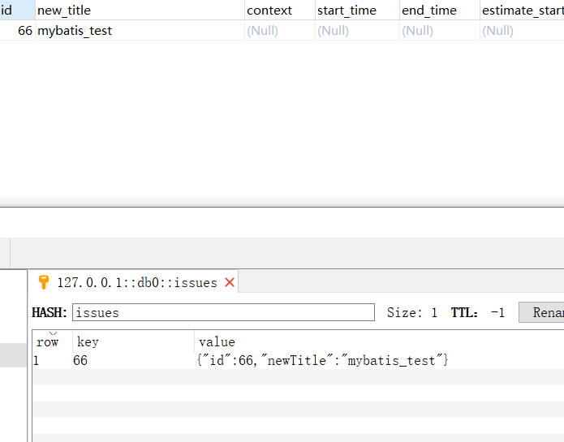

#### 注释 mapper上的`@CacheKey` 

- 注释掉mapper上面的`@CacheKey`

```java
@Mapper
@CacheKey(key = "issues", type = IssuesEntity.class)
public interface IssuesMapper extends A<Integer, IssuesEntity> {

  @Insert("   insert into issue(new_title)values(#{newTitle,jdbcType=VARCHAR})")
  @Options(useGeneratedKeys = true, keyProperty = "id", keyColumn = "id")
  int insertSelective(IssuesEntity record);

  @Select("select id as id , new_title as newTitle from issue where id = #{integer} ")
  IssuesEntity selectByPrimaryKey(Integer integer);

  @Override
  @Update("UPDATE `issue` SET `new_title` = #{newTitle}  WHERE `id` = #{id} ")
  int updateByPrimaryKeySelective(IssuesEntity record);

  @Override
  @Delete("delete from issue where id = #{integer}")
  int deleteByPrimaryKey(Integer integer);
}
```

- 再次执行测试用例,希望结果时redis没有，数库存有

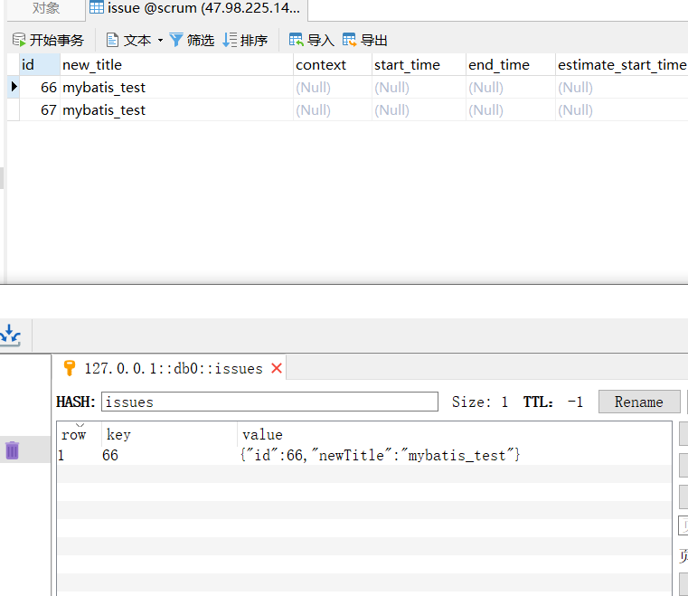

### 测试查询

```java
@Test
void testById() {
  IssuesEntity issuesEntity66 = crudFacade.byId(new IntIdInterface<Integer>() {
    @Override
    public Integer id() {
      return 66;
    }

  }, IssuesEntity.class);


  IssuesEntity issuesEntity67 = crudFacade.byId(new IntIdInterface<Integer>() {
    @Override
    public Integer id() {
      return 67;
    }

  }, IssuesEntity.class);
}
```

- id = 66 的用例希望从redis中获取，为了证明从redis中获取，修改一下属性方便确认

  修改属性为

  ```json
  {"id":66,"newTitle":"mybatis_test_test_by_id"}
  ```

  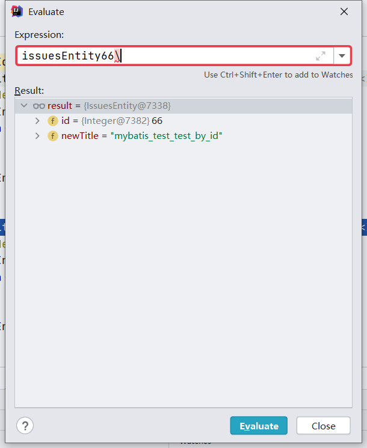

	- 测试符合期望值


- id = 67 的用例希望从数据库获取并且放入redis

  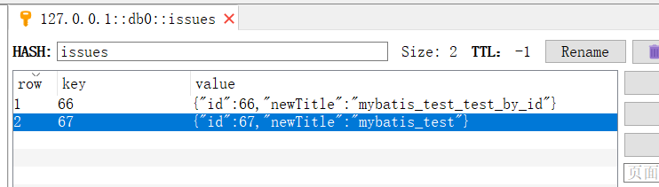

  - redis 中加入成功符合期望

### 测试修改

```java
@Test
void testEditor() {
  IssuesEntity issuesEntity66 = crudFacade.byId(new IntIdInterface<Integer>() {
    @Override
    public Integer id() {
      return 66;
    }

  }, IssuesEntity.class);

  issuesEntity66.setNewTitle("mybatis_editor_test");

  crudFacade.editor(issuesEntity66);
}
```

- 希望redis 和数据库同时修改


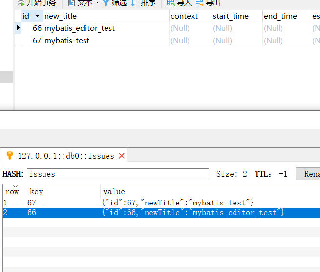


- 修改一条redis中没有的数据，查看redis是否会被更新

```java
@Test
void testEditor2() {
  IssuesEntity issuesEntity66 = crudFacade.byId(new IntIdInterface<Integer>() {
    @Override
    public Integer id() {
      return 68;
    }

  }, IssuesEntity.class);

  issuesEntity66.setNewTitle("mybatis_editor_test");

  crudFacade.editor(issuesEntity66);
}
```


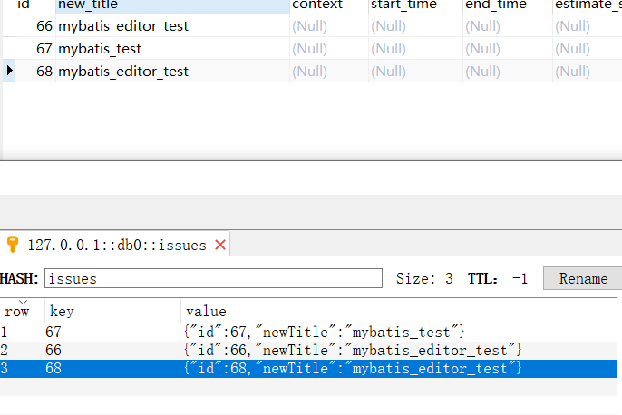

- redis 更新成功

### 测试删除

- redis 和 数据库都删除即可通过

```java
@Test
void testDel() {
  crudFacade.del(new IntIdInterface<Integer>() {
    @Override
    public Integer id() {
      return 67;
    }
  }, IssuesEntity.class);
}
```

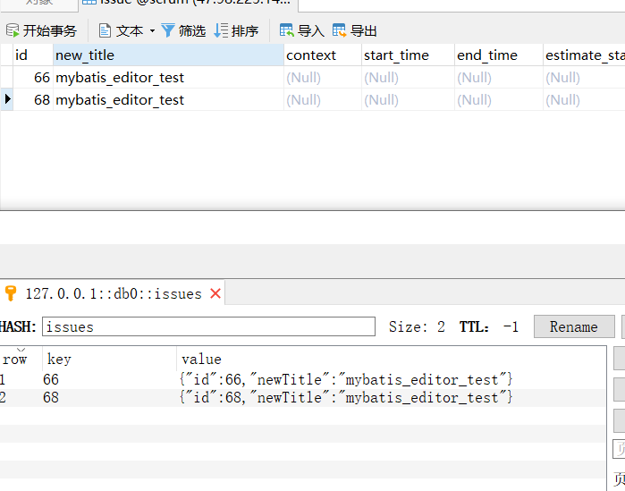

- redis 和数据库都删除了
- **注意：这里是物理删除还是逻辑删除取决于`deleteByPrimaryKey` 的sql ** 


## 实体redis测试

```java
@CacheKey(key = "tt", type = IssuesEntity.class, idFiled = "newTitle")
public class IssuesEntity  {


  private Integer id;
  private String newTitle;

  private String ooo() {
    return "OOO" + this.newTitle;
  }

  public Integer getId() {
    return id;
  }

  public void setId(Integer id) {
    this.id = id;
  }

  public String getNewTitle() {
    return newTitle;
  }

  public void setNewTitle(String newTitle) {
    this.newTitle = newTitle;
  }
}
```

### 测试新增

```java
@Test
void testInsert() {
  IssuesEntity issuesEntity = new IssuesEntity();
  issuesEntity.setNewTitle("insert");
  crudEntityFacade.insert(issuesEntity);
}
```

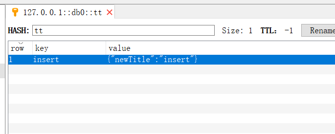


### 测试查询


```java
@Test
void testById() {
  IssuesEntity issuesEntity = crudEntityFacade.byId(new StrIdInterface<String>() {
    @Override
    public String id() {
      return "insert";
    }
  }, IssuesEntity.class);
  System.out.println();
}
```


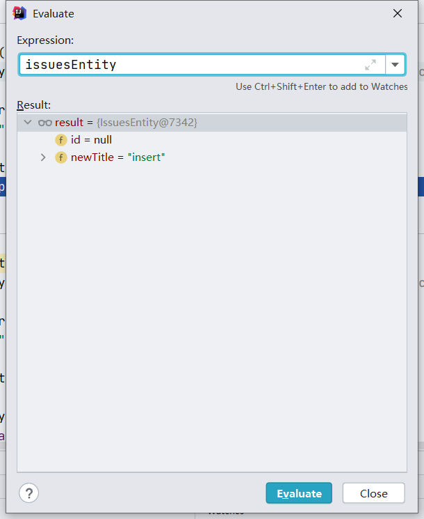

### 测试修改


```java
  @Test
  void testUpdate() {
    IssuesEntity issuesEntity = crudEntityFacade.byId(new StrIdInterface<String>() {
      @Override
      public String id() {
        return "insert";
      }
    }, IssuesEntity.class);

    issuesEntity.setId(999);
    crudEntityFacade.editor(issuesEntity);
  }

```

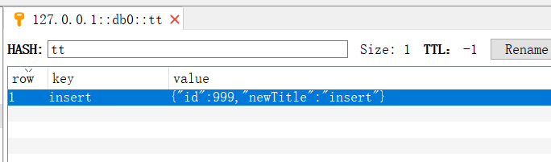

### 测试删除

```java
@Test
void testDel() {
  crudEntityFacade.del(new StrIdInterface<String>() {
    @Override
    public String id() {
      return "insert";
    }
  }, IssuesEntity.class);
}
```

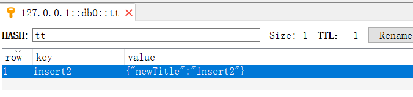