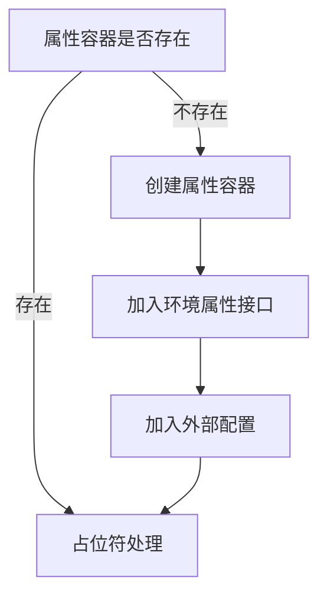
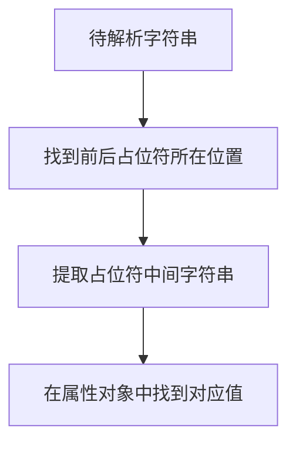
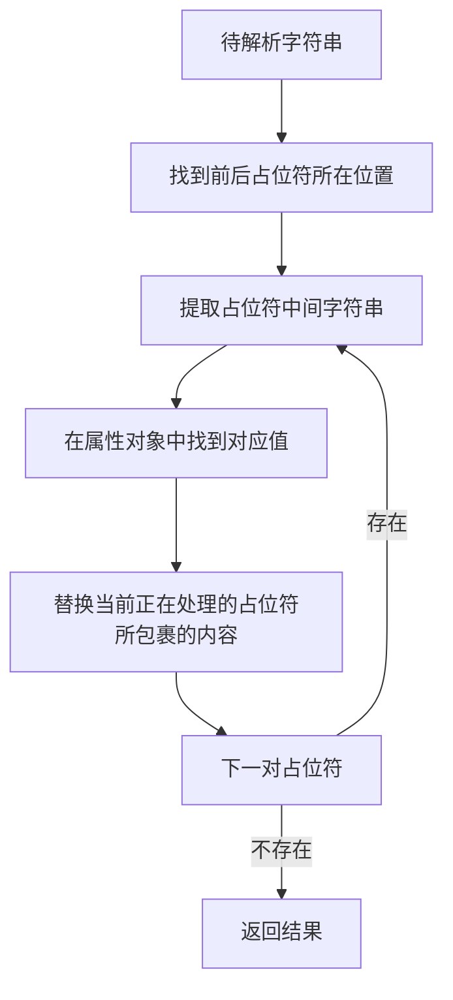
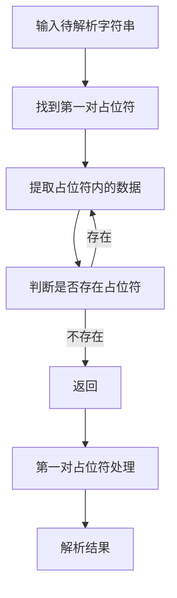
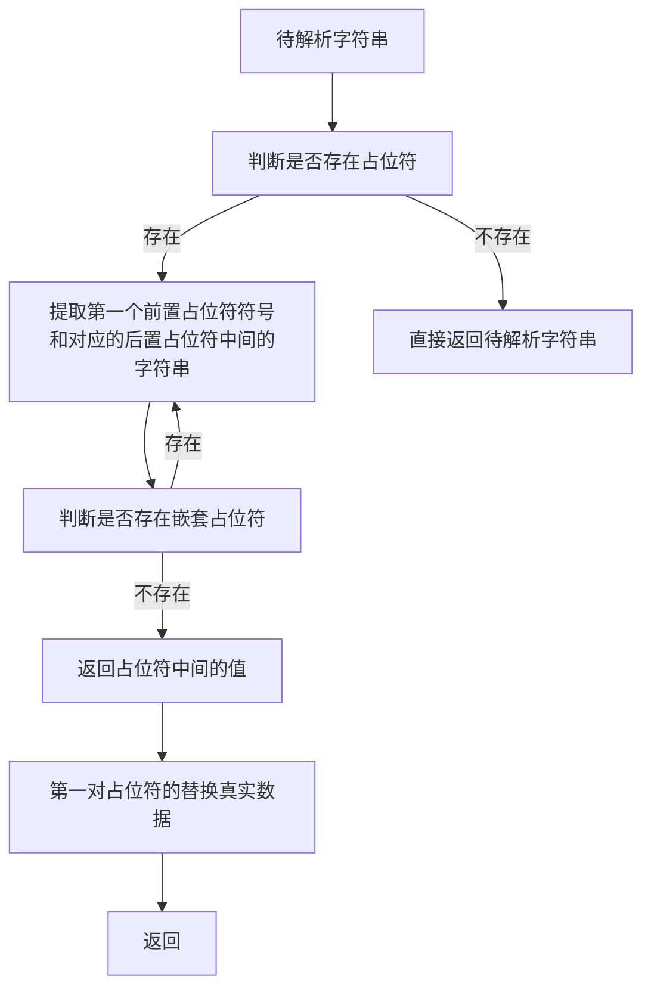

# 第十二章 占位符解析
在这一章节中笔者将和各位读者一起讨论 Spring 是如何处理占位符解析相关操作。

## 12.1 基本环节搭建
占位符解析在我们开发 Spring JDBC 会有一个比较直观的感受，比如我们将 `jdbc.properties` 设置为 `DataSource` 的属性，下面我们来模拟一个类似的操作。
首先我们来理清需要做的事情：

1. 第一步：定义一个Java对象
2. 第二步：定义外部属性文件
3. 第三步：配置 Spring XML
4. 第四步：使用

操作步骤已经明确下面我们来着手编辑

- 定义Java对象 `PropertyBean`

```java
public class PropertyBean {
	private String name;
	// 省略 getter & setter 
}
```

- 定义外部配置 `property.properties`

```properties
name=zhangsan
```

- 配置 Spring XML 文件 `PropertyResolution.xml`

```XML
<?xml version="1.0" encoding="UTF-8"?>
<beans xmlns:xsi="http://www.w3.org/2001/XMLSchema-instance"
       xmlns:context="http://www.springframework.org/schema/context" xmlns="http://www.springframework.org/schema/beans"
       xsi:schemaLocation="http://www.springframework.org/schema/beans http://www.springframework.org/schema/beans/spring-beans.xsd


http://www.springframework.org/schema/context http://www.springframework.org/schema/context/spring-context.xsd">
    <context:property-placeholder location="classpath:property.properties"/>

    <bean class="com.source.hot.ioc.book.pojo.PropertyBean">
        <property name="name" value="${name}"/>
    </bean>
</beans>
```

- 使用

```java
void testPropertyPlaceholder() {
    ClassPathXmlApplicationContext context = new ClassPathXmlApplicationContext("META-INF/PropertyResolution.xml");
    PropertyBean  bean = context.getBean(PropertyBean .class);
    assumeTrue(bean.getName().equals("zhangsan"));
}
```

我们来看一下最后的执行结果 

从执行结果上不难发现这里的 `name` 属性被外部文件中的 `name`的映射关系`zhangsan` 替换了，这个就是占位符解析的作用。占位符解析的作用：通过占位字符替换成其他数据，这个数据从外部导入。

基本测试用例现在准备完成下面我们将进入目前这些内容的源码分析。


## 12.2 XML 的解析

首先我们来看在 Spring XML 中配置文件的分析，从配置文件中我们可以看到 `<context:property-placeholder location="classpath:property.properties"/>` 配置，这个配置的作用是**将外部数据引入到 Spring 中**，在本章之前我们还没有使用过 `context` 这个标签这里就需要回顾第四章**自定义标签解析**相关的内容。

下面笔者来将处理相关的各个类都提取出来方便各位进行查找。

- `org.springframework.context.config.ContextNamespaceHandler`：该类是用来解析 `context` 的自定义标签

- `spring-context\src\main\resources\META-INF\spring.handlers` 中的信息

```properties
http\://www.springframework.org/schema/context=org.springframework.context.config.ContextNamespaceHandler
http\://www.springframework.org/schema/jee=org.springframework.ejb.config.JeeNamespaceHandler
http\://www.springframework.org/schema/lang=org.springframework.scripting.config.LangNamespaceHandler
http\://www.springframework.org/schema/task=org.springframework.scheduling.config.TaskNamespaceHandler
http\://www.springframework.org/schema/cache=org.springframework.cache.config.CacheNamespaceHandler
```

下面我们来看 `ContextNamespaceHandler` 

- `ContextNamespaceHandler` 方法详情

```java
public class ContextNamespaceHandler extends NamespaceHandlerSupport {

   @Override
   public void init() {
      registerBeanDefinitionParser("property-placeholder", new PropertyPlaceholderBeanDefinitionParser());
      registerBeanDefinitionParser("property-override", new PropertyOverrideBeanDefinitionParser());
      registerBeanDefinitionParser("annotation-config", new AnnotationConfigBeanDefinitionParser());
      registerBeanDefinitionParser("component-scan", new ComponentScanBeanDefinitionParser());
      registerBeanDefinitionParser("load-time-weaver", new LoadTimeWeaverBeanDefinitionParser());
      registerBeanDefinitionParser("spring-configured", new SpringConfiguredBeanDefinitionParser());
      registerBeanDefinitionParser("mbean-export", new MBeanExportBeanDefinitionParser());
      registerBeanDefinitionParser("mbean-server", new MBeanServerBeanDefinitionParser());
   }

}
```

在 `init` 方法中定义了具体标签对应的具体解析类，这里我们主要关注 `property-placeholder` 对应的解析类 `PropertyPlaceholderBeanDefinitionParser`，那么我们的探索方法应该是 `PropertyPlaceholderBeanDefinitionParser#doParse` 我们来看执行结果。

- `BeanDefinitionBuilder` 解析结果


在此时我们可以看到数据信息 `classpath:property.properties` 和 `location` 已经建立绑定关系。


## 12.3 外部配置的读取

我们在前面的操作中可以看到我们的外部配置文件在对象中已经存在，下面我们应该要考虑如何将这个文件转换成内存对象。寻找这个处理对象的过程很麻烦笔者饶了很多弯路，在这里直接告诉大家处理对象是 `PropertySourcesPlaceholderConfigurer`。

我们来看 `PropertySourcesPlaceholderConfigurer` 的类图


通过类图我们可以看到一个熟悉的接口 `BeanFactoryPostProcessor` ，我们这里想要找到的外部配置文件读取的过程就在 `postProcessBeanFactory` 中有所提及，下面我们来看完整代码

- `PropertySourcesPlaceholderConfigurer#postProcessBeanFactory`

```java
@Override
public void postProcessBeanFactory(ConfigurableListableBeanFactory beanFactory) throws BeansException {

    // 属性容器为空
    if (this.propertySources == null) {
        // 创建熟悉容器
        this.propertySources = new MutablePropertySources();
        // 环境属性存在的情况下
        if (this.environment != null) {
            // 往属性容器中添加 environment
            this.propertySources.addLast(
                new PropertySource<Environment>(ENVIRONMENT_PROPERTIES_PROPERTY_SOURCE_NAME, this.environment) {
                    @Override
                    @Nullable
                    public String getProperty(String key) {
                        return this.source.getProperty(key);
                    }
                }
            );
        }
        try {
            // 加载外部的属性文件
            PropertySource<?> localPropertySource =
                new PropertiesPropertySource(LOCAL_PROPERTIES_PROPERTY_SOURCE_NAME, mergeProperties());
            if (this.localOverride) {
                this.propertySources.addFirst(localPropertySource);
            }
            else {
                this.propertySources.addLast(localPropertySource);
            }
        }
        catch (IOException ex) {
            throw new BeanInitializationException("Could not load properties", ex);
        }
    }

    // 处理占位符
    processProperties(beanFactory, new PropertySourcesPropertyResolver(this.propertySources));
    this.appliedPropertySources = this.propertySources;
}
```

这里我们来看主要的流程




这里我们着重看下面这两段代码

```java
PropertySource<?> localPropertySource =
      new PropertiesPropertySource(LOCAL_PROPERTIES_PROPERTY_SOURCE_NAME, mergeProperties());
```

```java
processProperties(beanFactory, new PropertySourcesPropertyResolver(this.propertySources));
```


我们先来看第一段代码中 `PropertiesPropertySource` 的构造函数

```java
public PropertiesPropertySource(String name, Properties source) {
   super(name, (Map) source);
}
```

这个构造函数没有什么内容，我们的主要关注的应该是调用构造函数之前的 `mergeProperties()` 方法。


```java
protected Properties mergeProperties() throws IOException {
   Properties result = new Properties();

   if (this.localOverride) {
      // Load properties from file upfront, to let local properties override.
      loadProperties(result);
   }

   if (this.localProperties != null) {
      for (Properties localProp : this.localProperties) {
         CollectionUtils.mergePropertiesIntoMap(localProp, result);
      }
   }

   if (!this.localOverride) {
      // Load properties from file afterwards, to let those properties override.
      loadProperties(result);
   }

   return result;
}
```


在这段方法中我们看到了几个成员变量下面笔者对其进行解释

1. `localOverride`：是否需要重写本地数据，默认 `false`
2. `localProperties`：本地的属性数据

我们现在没有做 `localOverride` 的属性，那我们来这里最重要的方法 **`loadProperties`** 


```java
protected void loadProperties(Properties props) throws IOException {
   if (this.locations != null) {
      for (Resource location : this.locations) {
         if (logger.isTraceEnabled()) {
            logger.trace("Loading properties file from " + location);
         }
         try {
            PropertiesLoaderUtils.fillProperties(
                  props, new EncodedResource(location, this.fileEncoding), this.propertiesPersister);
         }
         catch (FileNotFoundException | UnknownHostException ex) {
            if (this.ignoreResourceNotFound) {
               if (logger.isDebugEnabled()) {
                  logger.debug("Properties resource not found: " + ex.getMessage());
               }
            }
            else {
               throw ex;
            }
         }
      }
   }
}
```

在 `loadProperties` 方法中我们需要理解一个属性 `locations` 这个属性存储了我们在 `context:property-placeholder` 中配置的 `location` 属性，得到单个 `location` 后 Spring 会去读取这个文件在转换成 `Properties` 对象。

下面我们来看几个关键信息的断点数据

- `locations` 信息


- 读取到的数据信息

  

- `propertySources` 


## 12.4 解析占位符

前文提到我们有两段重要代码现在我们对第一段代码进行了分析，下面我们要开始对第二段代码进行分析

```
processProperties(beanFactory, new PropertySourcesPropertyResolver(this.propertySources))
```

在这个方法中是正在处理 Bean Definition 中属性存在占位符的情况。下面我们来看我们在基本环境搭建章节中的 Bean Definition 是什么样子的


```xml
<bean class="com.source.hot.ioc.book.pojo.PropertyBean">
    <property name="name" value="${name}"/>
</bean>
```

我们通过 `BeanFactory` 中 `BeanDefinitionMap` 这个属性来查看我们的定义被 Spring 转换后的存储。

- `BeanDefinitionMap` 属性


我们先不进入 `processProperties` 源码分析，我们直接 debug 走一步看看结果是什么样子的

- 执行 `processProperties` 之后的信息


通过对比我们可以发现 `value` 已经替换成我们所希望的数据了。那我们可以确定 `processProperties` 就是给我们处理占位符的将占位符转换成真正的数据值。下面我们来看这个方法的细节

- `processProperties` 方法详情

```java
protected void processProperties(ConfigurableListableBeanFactory beanFactoryToProcess,
      final ConfigurablePropertyResolver propertyResolver) throws BeansException {

   // 设置前置占位符
   propertyResolver.setPlaceholderPrefix(this.placeholderPrefix);
   // 设置后置占位符
   propertyResolver.setPlaceholderSuffix(this.placeholderSuffix);
   // 设置字符分隔符
   propertyResolver.setValueSeparator(this.valueSeparator);

   // 字符串解析器
   StringValueResolver valueResolver = strVal -> {
      String resolved = (this.ignoreUnresolvablePlaceholders ?
            propertyResolver.resolvePlaceholders(strVal) :
            propertyResolver.resolveRequiredPlaceholders(strVal));
      if (this.trimValues) {
         resolved = resolved.trim();
      }
      return (resolved.equals(this.nullValue) ? null : resolved);
   };

   // 真正的解析方法
   doProcessProperties(beanFactoryToProcess, valueResolver);
}
```

在 `processProperties` 方法中除了最后一行代码意外其他的都是在为处理前做准备，准备内容如下

1. 设置前置占位符 ，一般是`${`。
2. 设置后置占位符，一般是 `}`。
3. 设置字符串分隔符，一般是 `;`。
4. 创建 `StringValueResolver` 对象。


下面我们来看真正的处理方法

```java
protected void doProcessProperties(ConfigurableListableBeanFactory beanFactoryToProcess,
      StringValueResolver valueResolver) {

   // beanDefinition 访问者
   BeanDefinitionVisitor visitor = new BeanDefinitionVisitor(valueResolver);

   // 获取 Bean Name 列表
   String[] beanNames = beanFactoryToProcess.getBeanDefinitionNames();
   for (String curName : beanNames) {
      // Check that we're not parsing our own bean definition,
      // to avoid failing on unresolvable placeholders in properties file locations.
      if (!(curName.equals(this.beanName) && beanFactoryToProcess.equals(this.beanFactory))) {
         BeanDefinition bd = beanFactoryToProcess.getBeanDefinition(curName);
         try {
            // 访问者进行数据修改
            visitor.visitBeanDefinition(bd);
         }
         catch (Exception ex) {
            throw new BeanDefinitionStoreException(bd.getResourceDescription(), curName, ex.getMessage(), ex);
         }
      }
   }

   // New in Spring 2.5: resolve placeholders in alias target names and aliases as well.
   beanFactoryToProcess.resolveAliases(valueResolver);

   // New in Spring 3.0: resolve placeholders in embedded values such as annotation attributes.
   beanFactoryToProcess.addEmbeddedValueResolver(valueResolver);
}
```

相信各位在这段代码的阅读过程中肯定找到了那个至关重要的对象 `BeanDefinitionVisitor`，我们吸纳来看  `BeanDefinitionVisitor#visitBeanDefinition` 方法的细节。

- `BeanDefinitionVisitor#visitBeanDefinition` 方法详情

```java
public void visitBeanDefinition(BeanDefinition beanDefinition) {
   // parent name 解析
   visitParentName(beanDefinition);
   // bean class 解析
   visitBeanClassName(beanDefinition);
   // factory bean 解析
   visitFactoryBeanName(beanDefinition);
   // factory method 解析
   visitFactoryMethodName(beanDefinition);
   // scope 解析
   visitScope(beanDefinition);
   if (beanDefinition.hasPropertyValues()) {
      // 属性解析
      visitPropertyValues(beanDefinition.getPropertyValues());
   }
   if (beanDefinition.hasConstructorArgumentValues()) {
      // 构造器解析
      ConstructorArgumentValues cas = beanDefinition.getConstructorArgumentValues();
      visitIndexedArgumentValues(cas.getIndexedArgumentValues());
      visitGenericArgumentValues(cas.getGenericArgumentValues());
   }
}
```

在这个方法中出现了个很多 `visit*` 方法这些方法中又会有不同的处理但是其目的是将原数据替换成解析后的数据，下面笔者将对应的转换关系列出

1. `resolveStringValue` 方法提供给：`visitParentName`、 `visitBeanClassName` 、`visitFactoryBeanName` 、`visitFactoryMethodName`、 `visitScope` 使用
2. `resolveValue` 方法提供给：`visitPropertyValues`、 `visitIndexedArgumentValues`、`visitGenericArgumentValues` 使用

我们来看 `visitParentName` 的细节代码

- `visitParentName` 方法详情

```java
protected void visitParentName(BeanDefinition beanDefinition) {
   String parentName = beanDefinition.getParentName();
   if (parentName != null) {
      String resolvedName = resolveStringValue(parentName);
      if (!parentName.equals(resolvedName)) {
         beanDefinition.setParentName(resolvedName);
      }
   }
}
```

在这段代码中我们可以看到关键方法是 `resolveStringValue` ，在前文提到的该方法的使用者都遵守下面这个处理逻辑

1. 从 Bean Definition 中获取需要解析的变量
2. 通过 `resolveStringValue` 方法解析对应数据
3. 将 `resolveStringValue` 解析得到的数据重新设置给 Bean Definition


我们再来看 `visitPropertyValues` 的细节代码

- `visitPropertyValues` 方法详情

```java
protected void visitPropertyValues(MutablePropertyValues pvs) {
   PropertyValue[] pvArray = pvs.getPropertyValues();
   for (PropertyValue pv : pvArray) {
      Object newVal = resolveValue(pv.getValue());
      if (!ObjectUtils.nullSafeEquals(newVal, pv.getValue())) {
         pvs.add(pv.getName(), newVal);
      }
   }
}
```

在这段代码中我们可以看到关键方法是 `resolveValue` ，在前文提到的该方法的使用者都遵守下面这个处理逻辑

1. 循环数据列表中 `value` 值
2. 通过 `resolveValue` 方法解析对应数据
3. 将 `resolveValue` 解析得到的数据重新设置给当前 `value`


在这里我们就引出了两个解析方案下面我们就对这两个解析方案进行分析。


### 12.4.1 `resolveStringValue` 分析

我们先来看 `resolveStringValue` 的具体实现代码

- `BeanDefinitionVisitor#resolveStringValue` 方法详情

```java
@Nullable
protected String resolveStringValue(String strVal) {
   if (this.valueResolver == null) {
      throw new IllegalStateException("No StringValueResolver specified - pass a resolver " +
            "object into the constructor or override the 'resolveStringValue' method");
   }
   String resolvedValue = this.valueResolver.resolveStringValue(strVal);
   // Return original String if not modified.
   return (strVal.equals(resolvedValue) ? strVal : resolvedValue);
}
```

在这段代码中我们主要关注的是 **`this.valueResolver.resolveStringValue(strVal)`** 方法，下面我们先来看整体流程。

1. 第一步：解析器是否存在，不存在抛出异常(`IllegalStateException`)。
2. 第二步：进行解析。
3. 第三步：解析结果和原数据对比如果不同就将解析结果作为返回值。

整体流程了解后我们来看 `valueResolver` 的一些信息，`valueResolver` 的类型是 `StringValueResolver` 这个接口的方法定义就是用来进行字符串解析的，这里我们就需要弄明白 `StringValueResolver` 实际是什么。各位还记得我们在进行占位符解析前的准备操作吗？在准备操作的最后一步中我们有下面代码


```java
StringValueResolver valueResolver = strVal -> {
	String resolved = (this.ignoreUnresolvablePlaceholders ?
			propertyResolver.resolvePlaceholders(strVal) :
			propertyResolver.resolveRequiredPlaceholders(strVal));
	if (this.trimValues) {
		resolved = resolved.trim();
	}
	return (resolved.equals(this.nullValue) ? null : resolved);
};

```


这段代码就是我们现在 `StringValueResolver` 的正真内容了。这里我们需要了解下面两个参数

1. 第一个参数：`ignoreUnresolvablePlaceholders` ，该参数表示是否需要忽略不可解析的占位符，默认 `false`。
2. 第二个参数：`propertyResolver`，该参数是接口 `ConfigurablePropertyResolver` 我们需要确认具体的类型，从调用方法中我们可以看到它是 `PropertySourcesPropertyResolver` 类型 。

现在就好办了我们真正的解析方法提供者是 `PropertySourcesPropertyResolver` 接下来我们就来看这个类中的两个处理方法。


### 12.4.2 `resolvePlaceholders` 分析

通过查找该方法的具体实现我们可以找到这样一段代码

- `AbstractPropertyResolver#resolvePlaceholders`

```java
@Override
public String resolvePlaceholders(String text) {
	if (this.nonStrictHelper == null) {
		this.nonStrictHelper = createPlaceholderHelper(true);
	}
	return doResolvePlaceholders(text, this.nonStrictHelper);
}
```

我们先来看 `nonStrictHelper` 的类型和这里的 `createPlaceholderHelper(true)` 方法，通过 `createPlaceholderHelper(true)` 方法会创建出 `PropertyPlaceholderHelper` 对象这个对象就是能够提供解析的核心，下面我们来看 `doResolvePlaceholders` 方法

- `doResolvePlaceholders` 方法详情

```java
private String doResolvePlaceholders(String text, PropertyPlaceholderHelper helper) {
   return helper.replacePlaceholders(text, this::getPropertyAsRawString);
}
```

找到了具体方法后我们直接来看 `replacePlaceholders` 

```java
public String replacePlaceholders(String value, PlaceholderResolver placeholderResolver) {
   Assert.notNull(value, "'value' must not be null");
   return parseStringValue(value, placeholderResolver, null);
}
```

先来理解参数

1. 第一个参数：`String value` ：需要解析的字符串，带有占位符也可以不带有占位符
2. 第二个参数：`PlaceholderResolver placeholderResolver` ：占位符解析器

 我们来分别看两个参数的数据截图，首先我们来看 `value`

- 需要解析的字符串数据

  

- 占位符解析器的数据

  


数据我们已经都看到了，下面我们就直接来看 `parseStringValue` 的实现逻辑了


- `parseStringValue` 方法详情

```java
protected String parseStringValue(
      String value, PlaceholderResolver placeholderResolver, @Nullable Set<String> visitedPlaceholders) {

   // 占位符所在位置
   int startIndex = value.indexOf(this.placeholderPrefix);
   if (startIndex == -1) {
      return value;
   }

   // 返回值
   StringBuilder result = new StringBuilder(value);
   while (startIndex != -1) {
      // 寻找结尾占位符
      int endIndex = findPlaceholderEndIndex(result, startIndex);
      if (endIndex != -1) {
         // 返回值切分留下中间内容
         String placeholder = result.substring(startIndex + this.placeholderPrefix.length(), endIndex);
         String originalPlaceholder = placeholder;
         if (visitedPlaceholders == null) {
            visitedPlaceholders = new HashSet<>(4);
         }
         if (!visitedPlaceholders.add(originalPlaceholder)) {
            throw new IllegalArgumentException(
                  "Circular placeholder reference '" + originalPlaceholder + "' in property definitions");
         }
         // Recursive invocation, parsing placeholders contained in the placeholder key.
         // 递归获取占位符内容
         placeholder = parseStringValue(placeholder, placeholderResolver, visitedPlaceholders);
         // Now obtain the value for the fully resolved key...
         // 解析占位符内容获得真正的属性值
         String propVal = placeholderResolver.resolvePlaceholder(placeholder);
         if (propVal == null && this.valueSeparator != null) {
            int separatorIndex = placeholder.indexOf(this.valueSeparator);
            if (separatorIndex != -1) {
               String actualPlaceholder = placeholder.substring(0, separatorIndex);
               String defaultValue = placeholder.substring(separatorIndex + this.valueSeparator.length());
               propVal = placeholderResolver.resolvePlaceholder(actualPlaceholder);
               if (propVal == null) {
                  propVal = defaultValue;
               }
            }
         }
         if (propVal != null) {
            // Recursive invocation, parsing placeholders contained in the
            // previously resolved placeholder value.
            propVal = parseStringValue(propVal, placeholderResolver, visitedPlaceholders);
            result.replace(startIndex, endIndex + this.placeholderSuffix.length(), propVal);
            if (logger.isTraceEnabled()) {
               logger.trace("Resolved placeholder '" + placeholder + "'");
            }
            startIndex = result.indexOf(this.placeholderPrefix, startIndex + propVal.length());
         }
         else if (this.ignoreUnresolvablePlaceholders) {
            // Proceed with unprocessed value.
            startIndex = result.indexOf(this.placeholderPrefix, endIndex + this.placeholderSuffix.length());
         }
         else {
            throw new IllegalArgumentException("Could not resolve placeholder '" +
                  placeholder + "'" + " in value \"" + value + "\"");
         }
         visitedPlaceholders.remove(originalPlaceholder);
      }
      else {
         startIndex = -1;
      }
   }
   return result.toString();
}
```


在这个方法中处理了三种情况

1. 第一种：需要解析的字符串没有占位符。
2. 第二种：需要解析的字符串只有一对占位符。
3. 第三种：需要解析的字符串存在一对及以上占位符。
   1. 小点1：平级占位符
   2. 小点2：嵌套占位符


为了模拟这三种情况笔者先做出针对这四种情况分别编写不同的测试用例以便针对性源码分析。笔者在这里找到了处理对象 `PropertyPlaceholderHelper` 笔者就不通过 Spring XML 的方式来编写测试用例了，下面来看代码。

- 占位符测试代码

```java
public class PropertyPlaceholderHelperTest {
	Properties properties = new Properties();

	PropertyPlaceholderHelper propertyPlaceholderHelper;

	@NotNull
	private static PropertyPlaceholderHelper.PlaceholderResolver getPlaceholderResolver(Properties properties) {
		return new PropertyPlaceholderHelper.PlaceholderResolver() {
			@Override
			public String resolvePlaceholder(String placeholderName) {
				String value = properties.getProperty(placeholderName);
				return value;
			}
		};
	}


	@BeforeEach
	void initProperties() {
		properties.put("a", "1");
		properties.put("b", "2");
		properties.put("c", "3");
		properties.put("a23", "abc");
		propertyPlaceholderHelper = new PropertyPlaceholderHelper("{", "}");
	}

	/**
	 * 没有占位符
	 */
	@Test
	void testNoPlaceholder() {
		String noPlaceholder = "a";
		String replacePlaceholders = propertyPlaceholderHelper.replacePlaceholders(noPlaceholder, this::getValue);
		assumeTrue(replacePlaceholders.equals("a"));
	}

	/**
	 * 存在一个占位符
	 */
	@Test
	void testOnePlaceholder() {
		String onePlaceholder = "{a}";
		String replacePlaceholders = propertyPlaceholderHelper.replacePlaceholders(onePlaceholder, this::getValue);
		assumeTrue(replacePlaceholders.equals("1"));

	}

	/**
	 * 存在平级占位符
	 */
	@Test
	void testSameLevelPlaceholder() {
		String sameLevelPlaceholder = "{a}{b}{c}";
		String replacePlaceholders = propertyPlaceholderHelper.replacePlaceholders(sameLevelPlaceholder, getPlaceholderResolver(properties));
		assumeTrue(replacePlaceholders.equals("123"));

	}

	/**
	 * 存在嵌套占位符
	 */
	@Test
	void testNestedPlaceholder() {
		String nestedPlaceholder = "{a{b}{c}}";
		String replacePlaceholders = propertyPlaceholderHelper.replacePlaceholders(nestedPlaceholder, getPlaceholderResolver(properties));
		assumeTrue(replacePlaceholders.equals("abc"));

	}

	private String getValue(String key) {
		return this.properties.getProperty(key);
	}
}
```


#### 12.4.2.1 没有占位符的分析

我们先来看没有占位符的情况，在我们的测试用例中找到 `testNoPlaceholder` ，我们一层层点进去可以找到方法 `parseStringValue` 这个方法前文有详细代码，我们来看下面这段代码。


```java
int startIndex = value.indexOf(this.placeholderPrefix);
if (startIndex == -1) {
   return value;
}
```


这段代码的作用就是来确认是否存在占位符，如果不存在那么就直接返回了。现在我们需要解析的字符串是 `"a"` ，前置占位符是 `{` ，很明显前置占位符不存在于需要解析的字符串中，此时就将原始数据返回。


#### 12.4.2.2 只有一对占位符的分析

下面我们来看只有一对占位符的情况，在我们的测试用例中找到 `testOnePlaceholder` 这一段处理就是 `parseStringValue` 整个调度了。

我们来看整个方法的执行流程




我们来看代码中的细节：

1. 通过 `int startIndex = value.indexOf(this.placeholderPrefix);` 找到前置占位符的索引
2. 通过 `int endIndex = findPlaceholderEndIndex(result, startIndex);` 找到后置占位符的索引
3. 通过 `String placeholder = result.substring(startIndex + this.placeholderPrefix.length(), endIndex);` 提取占位符中间的字符串
4. 通过 `String propVal = placeholderResolver.resolvePlaceholder(placeholder);` 方法来获取占位符中间字符串对应的实际值

我们来看最后一点的处理，我们在参数中传递的是 `this::getValue` 在此时进行的是 `PlaceholderResolver` 接口调用，其本质最终会调用 `getValue` 来得到数据，这里不太好理解的为什么参数是接口传递的确是函数，这里主要是 `@FunctionalInterface` 在产生作用，相关内容可以查看 JDK8 的知识。

我们整理一下我们现有内容：

1. 占位符中间的字符串： `a`
2. 获取数据的方法： `getValue`
3. 数据存储容器： `properties`

通过这三点我们的占位符解析呼之欲出，`a` 对应的是 `1` 下面我们来看一下变量截图

- `placeholder` 占位符中间的字符串

  

- `propVal` 解析后的数据

  


至此笔者对只存在一对占位符的情况分析完成。


#### 12.4.2.3 平级占位符的分析

下面我们来看平级占位符的情况，在我们的测试用例中找到 `testSameLevelPlaceholder`，在测试用例中笔者编写了 `{a}{b}{c}` 这样一个字符串，他们的占位符不存在嵌套关系都是一对一对包裹自己不会出现一对占位符中还有占位符的情况，笔者在这里就将其称为平级占位符了。

处理平级占位符的情况其实质就是多次执行一对占位符的逻辑但其中也有一些差异我们来看整体执行流程



我们来看 `{a}{b}{c}` 在这个流程中的变化过程，省略提取占位符中的字符串和从属性表中获取的过程

1. 第一步：输入变量 `{a}{b}{c}`
2. 第二步：处理第一对占位符 `{a}`
3. 第三步：返回值标记为 `1{b}{c}`
4. 第四步：处理 `1{b}{c}` 中的 `{b}`
5. 第五步：返回值标记为 `12{c}`
6. 第六步：处理 `12{c}` 中的 `{c}`
7. 第七步：返回值标记为 `123`

 下面笔者来进行一下断点截图

- 第一步到第二步的处理结果

  

- 第三步处理结果

  

  第三步的处理代码(替换占位符操作)

  ```java
  result.replace(startIndex, endIndex + this.placeholderSuffix.length(), propVal)
  ```


- 第四步到第五步操作

  

- 第六步到第七步操作

  


至此笔者对只存在平级占位符的情况分析完成。


#### 12.4.2.4 嵌套占位符的分析

最后我们来看存在嵌套占位符的分析，在我们的测试用例中找到 `testNestedPlaceholder`，在测试用例中笔者编写了 `{a{b}{c}}` 这样一个字符串，从这个字符串中的占位符表现形式上我们可以发现他出现了层级关系，对于这种层级关系 Spring 是如何进行解析的呢？我们先来整理流程操作




我们来看 `{a{b}{c}}` 在这个流程中的变化过程，省略提取占位符中的字符串和从属性表中获取的过程

1. 第一步：提取第一对占位符后的结果 `a{b}{c}`
2. 第二步：处理 `{a}` 得到第一个解析结果 `a2{c}`
3. 第三步：处理 `{c}` 得到第二个结果 `a23`
4. 第四步：处理整个`a23` 得到第三个结果 `abc`


在第二步和第三步可以看作是平级占位符的处理，第四步可以看作是只有一对占位符的处理，下面我们来看执行过程中的一些数据截图

- 第一步到第三步的截图

  

  解释：

  `value` 表示需要解析的字符串

  `placeholder` 表示需要解析字符串去掉最外一对占位符的结果

  `result` 表示返回结果

  `placeholderResolver.resolvePlaceholder(placeholder)` 表示 `placeholder` 中占位符处理后的结果

- 第四步截图

  

      	解释：
    
      `propVal` 表示 `placeholder` 在属性表中的具体数据值


对于嵌套解析其实就是一个递归操作，在这里通过这几张截图可能不够详细，各位读者还是要自行进行断点测试。


#### 12.4.2.5 占位符解析小结

前文我们对占位符的各种情况的分析都有了，下面我们来总结一下这个解析的算法执行过程。





### 12.4.3 `resolveRequiredPlaceholders` 分析

通过查找该方法的具体实现我们可以找到这样一段代码

- `AbstractPropertyResolver#resolveRequiredPlaceholders`

```java
@Override
public String resolveRequiredPlaceholders(String text) throws IllegalArgumentException {
   if (this.strictHelper == null) {
      this.strictHelper = createPlaceholderHelper(false);
   }
   return doResolvePlaceholders(text, this.strictHelper);
}
```

在这段方法中和前文提到的 `resolvePlaceholders` 处理核心都是同一个方法，两者在对于不可解析的占位符处理上存在一定偏差，在这里笔者就不再次对`doResolvePlaceholders` 方法进行分析了。


### 12.4.4`BeanDefinitionVisitor#visitBeanDefinition` 分析

现在回到 `BeanDefinitionVisitor#visitBeanDefinition` 方法中来，现在来看 `resolveStringValue` 方法就十分明朗了，这里使用到的技术就是我们前面提到的四种占位符处理。这样我们理解了 `visitParentName`、`visitBeanClassName`、`visitFactoryBeanName`、`visitFactoryMethodName` 和 `visitScope` 五个方法，现在我们还缺少 `resolveValue` 方法的理解，我们来看代码

- `resolveValue` 方法详情

```java
@SuppressWarnings("rawtypes")
@Nullable
protected Object resolveValue(@Nullable Object value) {
   if (value instanceof BeanDefinition) {
      visitBeanDefinition((BeanDefinition) value);
   }
   else if (value instanceof BeanDefinitionHolder) {
      visitBeanDefinition(((BeanDefinitionHolder) value).getBeanDefinition());
   }
   else if (value instanceof RuntimeBeanReference) {
      RuntimeBeanReference ref = (RuntimeBeanReference) value;
      String newBeanName = resolveStringValue(ref.getBeanName());
      if (newBeanName == null) {
         return null;
      }
      if (!newBeanName.equals(ref.getBeanName())) {
         return new RuntimeBeanReference(newBeanName);
      }
   }
   else if (value instanceof RuntimeBeanNameReference) {
      RuntimeBeanNameReference ref = (RuntimeBeanNameReference) value;
      String newBeanName = resolveStringValue(ref.getBeanName());
      if (newBeanName == null) {
         return null;
      }
      if (!newBeanName.equals(ref.getBeanName())) {
         return new RuntimeBeanNameReference(newBeanName);
      }
   }
   else if (value instanceof Object[]) {
      visitArray((Object[]) value);
   }
   else if (value instanceof List) {
      visitList((List) value);
   }
   else if (value instanceof Set) {
      visitSet((Set) value);
   }
   else if (value instanceof Map) {
      visitMap((Map) value);
   }
   else if (value instanceof TypedStringValue) {
      TypedStringValue typedStringValue = (TypedStringValue) value;
      String stringValue = typedStringValue.getValue();
      if (stringValue != null) {
         String visitedString = resolveStringValue(stringValue);
         typedStringValue.setValue(visitedString);
      }
   }
   else if (value instanceof String) {
      return resolveStringValue((String) value);
   }
   return value;
}
```

笔者通过点击每个 `visit*` 方法， 发现最终都指向了 `resolveStringValue` 方法。相信找到这个结论对各位读者来说不难，下面我们来看属性中占位符替换过程中的一些变量截图


- 入口参数

  

  在入口参数中我们看到此时 `value` 还是 `${name}` 

- `resolveValue(pv.getValue())` 执行后

  

  通过该方法执行后我们发现数据值进行了替换。


下面我们将这个 `visitBeanDefinition` 方法走完来看 Bean Definition 的数据信息


到此 Bean Definition 占位符替换全部完成，后续就是常规使用了。


## 12.5 总结

在本章章笔者和各位讨论了 Spring 中占位符处理的一些细节。

1. 占位符的基本使用

2. 存储了占位符替换信息的外部数据文件读取的类 `org.springframework.beans.factory.config.PropertyResourceConfigurer` 和 `org.springframework.core.io.support.PropertiesLoaderSupport`

   在读取外部配置文件的处理顺序是依靠 `BeanFactoryPostProcessor` 处理的

3. 占位符的解析核心对象 `PropertyPlaceholderHelper`

4. 占位符解析算法


