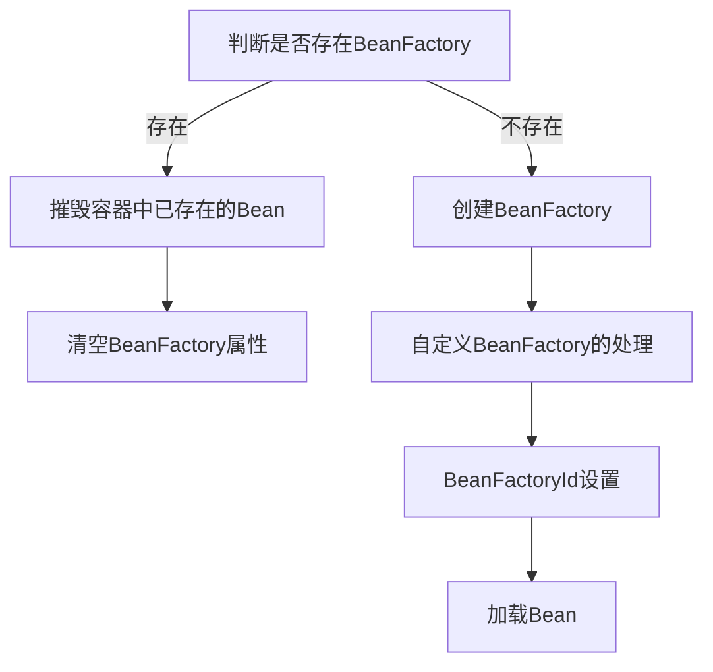

# 第十章 XML 配置下的容器生命周期
- 本章笔者将和各位一起来探讨关于 Spring XML 配置下容器的生命周期。

## 10.1 基础环境搭建
笔者在第一章的时候和各位介绍过三种 Spring XML 文件读取的方式，我们先来回顾一下这三种读取方式。

1. 第一种: `ClassPathXmlApplicationContext`

```java
ClassPathXmlApplicationContext context = new  ClassPathXmlApplicationContext("META-INF/first-ioc.xml");
```

2. 第二种：`FileSystemXmlApplicationContext`

```java
FileSystemXmlApplicationContext context
                = new FileSystemXmlApplicationContext("D:\\desktop\\git_repo\\spring-ebk\\spring-framework-read\\spring-source-hot-ioc-book\\src\\test\\resources\\META-INF\\first-ioc.xml");
```

3. 第三种：`XmlBeanFactory`

```java
XmlBeanFactory beanFactory = new XmlBeanFactory(new ClassPathResource("META-INF/first-ioc.xml"));
```


这三种方式就是我们这一章中重点分析对象。


## 10.2 `XmlBeanFactory` 分析

我们先来看 `XmlBeanFactory` 作为容器的生命周期。生命周期是指从没有这个对象到存在这个对象再到对象被摧毁的一个流程，下面我们先来看 `XmlBeanFactory` 从无到有的一个过程，即 `XmlBeanFactory` 构造函数做了什么。


### 10.2.1 `XmlBeanFactory` 构造函数

先来看构造函数的使用

```java
XmlBeanFactory beanFactory = new XmlBeanFactory(new ClassPathResource("META-INF/first-ioc.xml"));
```

我们从这个使用方法中进入了解真正的构造函数。

- `XmlBeanFactory` 中的两个构造函数

```java
public XmlBeanFactory(Resource resource) throws BeansException {
   this(resource, null);
}


public XmlBeanFactory(Resource resource, BeanFactory parentBeanFactory) throws BeansException {
   super(parentBeanFactory);
   this.reader.loadBeanDefinitions(resource);
}
```

在 `XmlBeanFactory` 的构造函数中使用了父类的构造函数，父类又有父类的使用，鉴于此我们先来看一下 `XmlBeanFactory` 的类图结构

- `XmlBeanFactory` 类图

  


在前往父类之前我们先来理解两个参数

1. `Resource resource`：资源对象
2. `BeanFactory parentBeanFactory`：父容器


在我们的用例之中我们使用 `ClassPathResource` 作为 `resource` 对象，该变量主要目的是存储 Spring XML 的路径信息。

`parentBeanFactory` 在源码中我们可以看到此时传递的是 `null` 在这个阶段我们没有传递父容器的数据。


下面我们来看 `super(parentBeanFactory)` 的调用堆栈

- `XmlBeanFactory`
  - `DefaultListableBeanFactory`
    - `AbstractAutowireCapableBeanFactory`
      - `AbstractBeanFactory`

我们根据调用堆栈来逐个检索下去

- `DefaultListableBeanFactory`

```java
public DefaultListableBeanFactory(@Nullable BeanFactory parentBeanFactory) {
   super(parentBeanFactory);
}
```

在 `DefaultListableBeanFactory` 代码信息还不够需要继续往父类进行检索

- `AbstractAutowireCapableBeanFactory`

```java
public AbstractAutowireCapableBeanFactory(@Nullable BeanFactory parentBeanFactory) {
   this();
   setParentBeanFactory(parentBeanFactory);
}
```

在 `AbstractAutowireCapableBeanFactory` 我们可以看到两个方法，这两个方法就是我们最终的目标了。

- `AbstractAutowireCapableBeanFactory#this`

```java
public AbstractAutowireCapableBeanFactory() {
   super();
   // 添加忽略的依赖接口(即add方法调用)
   ignoreDependencyInterface(BeanNameAware.class);
   ignoreDependencyInterface(BeanFactoryAware.class);
   ignoreDependencyInterface(BeanClassLoaderAware.class);
}
```

在这个构造方法中 `super` 调用的是 `AbstractBeanFactory` 的构造方法，`AbstractBeanFactory` 没有特殊内容就是一个无参数构造函数的调用，下面我们主要来看 `ignoreDependencyInterface` 方法。


#### 10.2.1.1 `ignoreDependencyInterface` 添加忽略的依赖接口

进入方法内部我们来看方法的细节内容

- `AbstractAutowireCapableBeanFactory#ignoreDependencyInterface`

```java
public void ignoreDependencyInterface(Class<?> ifc) {
   this.ignoredDependencyInterfaces.add(ifc);
}
```

在这个方法中就是将忽略的接口加入到容器中，我们来看容器的结构 

- `ignoredDependencyInterfaces` 定义

  ```java
  private final Set<Class<?>> ignoredDependencyInterfaces = new HashSet<>();
  ```


在构造器中将三个接口放入忽略的依赖容器中 `BeanNameAware` 、`BeanFactoryAware` 和 `BeanClassLoaderAware`


#### 10.2.1.2 `setParentBeanFactory` 设置父容器

在前面我们完成了 `this` 的操作，下面就是对于父容器的设置，设置父容器就是一个简单的 get set 方法


```java
@Override
public void setParentBeanFactory(@Nullable BeanFactory parentBeanFactory) {
   if (this.parentBeanFactory != null && this.parentBeanFactory != parentBeanFactory) {
      throw new IllegalStateException("Already associated with parent BeanFactory: " + this.parentBeanFactory);
   }
   this.parentBeanFactory = parentBeanFactory;
}
```


### 10.2.2 `XmlBeanFactory` 总结

在 `XmlBeanFactory` 的构造过程中总共做了两件事

1. 第一件：设置需要忽略的依赖接口
2. 第二件：设置父容器

在 `XmlBeanFactory` 中我们可以搜索到的内容只有这个关于构造函数相关的一个内容，并没有搜索到关闭和摧毁相关的一些实现内容，我们可以这样理解当 Java 程序关闭的时候 `XmlBeanFactory` 就直接消亡了不会触发任何事件。


对于 `XmlBeanFactory` 的生命周期我们就告一段落，下面我们将对 `FileSystemXmlApplicationContext` 的生命周期进行分析


## 10.3 `FileSystemXmlApplicationContext` 分析

下面我们将展开 `FileSystemXmlApplicationContext` 类的生命周期分析，值得注意的是在 `FileSystemXmlApplicationContext` 中式存在关闭方法的。这个关闭方法是由 `ConfigurableApplicationContext` ，同时也存在构造方法。我们先来看构造方法


### 10.3.1 构造方法分析

我们先来看  `FileSystemXmlApplicationContext`  构造方法

```java
public FileSystemXmlApplicationContext(String configLocation) throws BeansException {
   this(new String[] {configLocation}, true, null);
}
```

我们还是需要先进到 `this` 的实质内容中，各位请阅读下面代码

```java
public FileSystemXmlApplicationContext(
      String[] configLocations, boolean refresh, @Nullable ApplicationContext parent)
      throws BeansException {

   super(parent);
   setConfigLocations(configLocations);
   if (refresh) {
      refresh();
   }
}
```


在这个方法中我们先来认识这些参数是什么

1. `String[] configLocations`：多个 Spring XML 配置文件地址
2. `boolean refresh`：是否需要进行刷新操作
3. `@Nullable ApplicationContext parent`：父上下文

在这个构造方法中我们可以看到三个方法这三个方法分别对应三个参数的处理我们先来看父上下文的处理


#### 10.3.1.1 父上下文的处理

对于父上下文的处理我们可以在 `AbstractApplicationContext` 找到处理方案，下面我们来看相关实现的代码


```java
public AbstractApplicationContext(@Nullable ApplicationContext parent) {
    this();
    setParent(parent);
}
```


首先我们来看 `this` 中的内容

```java
public AbstractApplicationContext() {
    this.resourcePatternResolver = getResourcePatternResolver();
}


protected ResourcePatternResolver getResourcePatternResolver() {
    return new PathMatchingResourcePatternResolver(this);
}
```

在这段方法中主要是将 `ResourcePatternResolver` 进行初始化这里的实际对象是 **`PathMatchingResourcePatternResolver`**


其次我们再来看 `setParent` 方法

```java
@Override
public void setParent(@Nullable ApplicationContext parent) {
    this.parent = parent;
    if (parent != null) {
       // 获取 父上下文的环境信息
        Environment parentEnvironment = parent.getEnvironment();
        // 当环境信息是ConfigurableEnvironment 进行合并
        if (parentEnvironment instanceof ConfigurableEnvironment) {
            getEnvironment().merge((ConfigurableEnvironment) parentEnvironment);
        }
    }
}
```

在 `setParent` 方法中我们可以发现处理了两个事项

1. 第一个：对成员变量的父上下文进行设置
2. 第二个：环境配置合并，当前配置环境和父上下文中的配置环境进行合并


关于属性设置没有什么可以讲述的，我们着重来看属性合并的操作细节。提供属性合并的具体方法：`org.springframework.core.env.AbstractEnvironment#merge`，下面是具体操作代码


```java
@Override
public void merge(ConfigurableEnvironment parent) {
   for (PropertySource<?> ps : parent.getPropertySources()) {
      if (!this.propertySources.contains(ps.getName())) {
         this.propertySources.addLast(ps);
      }
   }
   String[] parentActiveProfiles = parent.getActiveProfiles();
   if (!ObjectUtils.isEmpty(parentActiveProfiles)) {
      synchronized (this.activeProfiles) {
         Collections.addAll(this.activeProfiles, parentActiveProfiles);
      }
   }
   String[] parentDefaultProfiles = parent.getDefaultProfiles();
   if (!ObjectUtils.isEmpty(parentDefaultProfiles)) {
      synchronized (this.defaultProfiles) {
         this.defaultProfiles.remove(RESERVED_DEFAULT_PROFILE_NAME);
         Collections.addAll(this.defaultProfiles, parentDefaultProfiles);
      }
   }
}
```

在这段操作代码中我们可以看到它围绕三个数据进行了合并

1. 第一个：`MutablePropertySources`，存储了属性名称和属性值

   对于这一项的处理逻辑是从父上下文中获取属性列表判断属性名称是否存在，如果不存在就追加到当前上下文的属性表中

2. 第二个：`activeProfiles` ，存放激活的 `profile`

   对于这一项的处理逻辑是父上下文中的 `activeProfiles` 直接添加到当前上下文的 `activeProfiles` 中

3. 第三个：`defaultProfiles`，存放默认的 `profile`

   对于这一项的处理逻辑是父上下文中的 `defaultProfiles` 直接添加到当前上下文的 `defaultProfiles` 中


到此笔者对于父上下文的处理就分析完成了下面我们来看 Spring 中对于配置地址的处理


#### 10.3.1.2 配置地址的处理

先来看配置地址处理的详细代码


```java
public void setConfigLocations(@Nullable String... locations) {
   if (locations != null) {
      Assert.noNullElements(locations, "Config locations must not be null");
      this.configLocations = new String[locations.length];
      for (int i = 0; i < locations.length; i++) {
         this.configLocations[i] = resolvePath(locations[i]).trim();
      }
   }
   else {
      this.configLocations = null;
   }
}
```

关于地址处理这里是将参数`locations` 进行解析，解析后放到 `configLocations` 中，我们这一节主要对 `resolvePath` 方法进行分析

先来看完整代码

```java
protected String resolvePath(String path) {
   return getEnvironment().resolveRequiredPlaceholders(path);
}
```

这里存在多个调用我们先看 `getEnvironment` 的细节

- `AbstractApplicationContext#getEnvironment` 方法详情

```java
@Override
public ConfigurableEnvironment getEnvironment() {
    if (this.environment == null) {
        this.environment = createEnvironment();
    }
    return this.environment;
}

protected ConfigurableEnvironment createEnvironment() {
    return new StandardEnvironment();
}
```

通过搜索我们可以看到上面这样的一段代码，这里我们确定了 `getEnvironment` 方法调用之后得到的结果是 `StandardEnvironment`，找到了提供方法的类之后我们再进一步搜索可以看到在 `org.springframework.core.env.AbstractEnvironment` 中有提供具体的 `resolveRequiredPlaceholders` 实现，具体代码如下

```java
@Override
public String resolveRequiredPlaceholders(String text) throws IllegalArgumentException {
   return this.propertyResolver.resolveRequiredPlaceholders(text);
}
```

在进行配置地址解析的时候我们还需要找到 `propertyResolver` 的具体定义，在 Spring 中 `propertyResolver` 它的定义如下

```java
private final ConfigurablePropertyResolver propertyResolver =
      new PropertySourcesPropertyResolver(this.propertySources);
```

找到了 `PropertySourcesPropertyResolver` 之后我们对于 `resolveRequiredPlaceholders` 方法的搜索就明朗了，我们来看 `PropertySourcesPropertyResolver` 的类图


经过进一步搜索 ，方法 `resolveRequiredPlaceholders` 在 `AbstractPropertyResolver` 中有具体实现我们来看相关代码


```java
@Override
public String resolveRequiredPlaceholders(String text) throws IllegalArgumentException {
   if (this.strictHelper == null) {
      this.strictHelper = createPlaceholderHelper(false);
   }
   return doResolvePlaceholders(text, this.strictHelper);
}
```

在这个方法中负责配置文件地址解析得是 `strictHelper` 对象，下面我们来看看里面具体做了什么，首先我们需要认识 `strictHelper` 的实际对象是 `PropertyPlaceholderHelper`，笔者这里对这里的解析做一个简单的介绍

首先我们定义一个属性表

```properties
a=1
b=2
```

其次我们来定义一个存在占位符的字符串 `{a}{b}`，那么经过这里的处理会变成 `12` ，这里的占位符可以自行设置，如果不存在占位符那么就不需要进行解析。关于这个解析的详细分析笔者会在第十二章再进行详细分析。由于我们再测试用例中填写的是一个绝对地址不存在占位符，因此这里会直接跳过解析我们来看解析后的结果。

- `setConfigLocations` 执行之后


配置地址解析到此我们也分析完毕，下面我们将进入一个"重型"方法 `refresh` 在这个方法中做了十分多的操作请各位保持耐心


#### 10.3.1.3 刷新操作

我们先来看 `AbstractApplicationContext#refresh` 的代码。


```java
@Override
 public void refresh() throws BeansException, IllegalStateException {
     synchronized (this.startupShutdownMonitor) {
         // Prepare this context for refreshing.
         // 准备刷新此上下文。
         prepareRefresh();

// 创建出 beanFactory
         // Tell the subclass to refresh the internal bean factory.
         ConfigurableListableBeanFactory beanFactory = obtainFreshBeanFactory();

         // Prepare the bean factory for use in this context.
// 准备 beanFactory , 对 beanFactory 进行设置数据等
         prepareBeanFactory(beanFactory);

         try {
   // beanFactory 在子类中进行后置处理
             // Allows post-processing of the bean factory in context subclasses.
             postProcessBeanFactory(beanFactory);

             // BeanFactoryPostProcessor 方法调用
             // Invoke factory processors registered as beans in the context.
             invokeBeanFactoryPostProcessors(beanFactory);

             // 注册 beanPostProcessor
             // Register bean processors that intercept bean creation.
             registerBeanPostProcessors(beanFactory);

             // 实例化 message source 相关信息
             // Initialize message source for this context.
             initMessageSource();

             // 实例化 应用事件传播器
             // Initialize event multicaster for this context.
             initApplicationEventMulticaster();

             // Initialize other special beans in specific context subclasses.
             onRefresh();

             // Check for listener beans and register them.
   // 注册监听器
             registerListeners();

             // Instantiate all remaining (non-lazy-init) singletons.
   // 完成 beanFactory 的实例化
             finishBeanFactoryInitialization(beanFactory);

             // Last step: publish corresponding event.
   // 完成刷新
             finishRefresh();
         }

         catch (BeansException ex) {
             if (logger.isWarnEnabled()) {
                 logger.warn("Exception encountered during context initialization - " +
                         "cancelling refresh attempt: " + ex);
             }

             // Destroy already created singletons to avoid dangling resources.
   // 摧毁bean
             destroyBeans();

             // Reset 'active' flag.
   // 取消刷新
             cancelRefresh(ex);

             // Propagate exception to caller.
             throw ex;
         }

         finally {
             // Reset common introspection caches in Spring's core, since we
             // might not ever need metadata for singleton beans anymore...
   // 重置通用缓存
             resetCommonCaches();
         }
     }
 }
```


在这个刷新方法它链接了多个方法，在 Spring 中这算是一个十分重型的方法了我们对这个方法的 分析需要一个个看过去，当我们看完每一个方法之后，我们就对这个方法有了一定的乐姐，下面我们先来看第一个方法 `prepareRefresh`


##### 10.3.1.3.1`prepareRefresh` 刷新前的准备工作

在 `prepareRefresh` 方法中设置了刷新之前需要做的事情，具体事项如下

1. 设置启动时间
2. 设置关闭标记
3. 设置启动标记
4. 执行属性初始化
5. 必填项的验证
6. 处理监听器列表
   1. 创建提前暴露的应用监听器列表
   2. 创建应用监听器列表

了解了处理事项后我们来看代码

```java
protected void prepareRefresh() {
    // Switch to active.
    // 设置开始时间
    this.startupDate = System.currentTimeMillis();
    // 设置关闭标记位 false
    this.closed.set(false);
    // 设置激活标记位 true
    this.active.set(true);

    // 初始化属性, 占位符资源等数据处理
    // 抽象方法, 子类实现
    initPropertySources();

    // 进行数据必填性验证
    getEnvironment().validateRequiredProperties();

    // 处理早期应用监听器列表 和 应用监听器列表
    if (this.earlyApplicationListeners == null) {
        this.earlyApplicationListeners = new LinkedHashSet<>(this.applicationListeners);
    }
    else {
        this.applicationListeners.clear();
        this.applicationListeners.addAll(this.earlyApplicationListeners);
    }
    this.earlyApplicationEvents = new LinkedHashSet<>();
}
```


在这段代码中 `initPropertySources` 是一个抽象方法在web应用上下文中会有实现，下面是实现了这个方法的对象


在 web 应用上下文中处理的内容是将 `ServletConfig` 写入到 `ServletContext` 中，我们现在是一个非 web 工程我们可以将这个当作一个空方法。

说完了属性初始化(`initPropertySources`) 下面我们再来看属性必填验证相关的处理逻辑，我们先来找到最终的处理方法：`org.springframework.core.env.AbstractPropertyResolver#validateRequiredProperties`


```java
@Override
public void validateRequiredProperties() {
   // 异常信息
   MissingRequiredPropertiesException ex = new MissingRequiredPropertiesException();
   for (String key : this.requiredProperties) {
      // 判断 key 的属性是否存在 如果不存在添加异常
      if (this.getProperty(key) == null) {
         ex.addMissingRequiredProperty(key);
      }
   }
   if (!ex.getMissingRequiredProperties().isEmpty()) {
      throw ex;
   }
}
```

对于数据字段的必填验证在这个方法中操作比较简单：循环每个需要必填的数据 key，在属性表中获取，如果不存在对应的 value 那么会加入到异常信息中，最后在统一抛出 `MissingRequiredPropertiesException`

在 `prepareRefresh` 中除了上述两个方法以外其他的都是一些成员变量的赋值操作，各位可以翻阅附表来对成员变量进行了解


##### 10.3.1.3.2 `obtainFreshBeanFactory` 创建 Bean Factory

现在我们做好了准备工作接下来我们需要进行 Bean Factory 的创建，具体方法签名`org.springframework.context.support.AbstractApplicationContext#obtainFreshBeanFactory` 进入方法来看具体代码

```java
protected ConfigurableListableBeanFactory obtainFreshBeanFactory() {
    // 刷新 beanFactory , 子类实现
    refreshBeanFactory();
    // 获取 beanFactory , 子类实现
    return getBeanFactory();
}
```

在这段代码中出现了两个方法`refreshBeanFactory` 和 `getBeanFactory` ，值得注意的是这两个方法都是抽象方法需要子类实现，我们现在是从`FileSystemXmlApplicationContext` 进入到这个方法中下面我们需要找到最终实现这个方法的对象是谁。

先来找 `refreshBeanFactory` 的实现

- 通过编辑找到的实现类


我们进行类图对比，对比`FileSystemXmlApplicationContext` 类图中是否存在 `AbstractRefreshableApplicationContext` 或者 `GenericApplicationContext`

- `FileSystemXmlApplicationContext` 类图


通过对比我们可以发现在 `FileSystemXmlApplicationContext` 继承了 `AbstractRefreshableApplicationContex` 那我们的 `refreshBeanFactory` 就找到了最终的分析目标。


###### 10.3.1.3.2.1 `refreshBeanFactory` 方法分析

通过前面的一些操作我们找到了需要分析的方法是 `org.springframework.context.support.AbstractRefreshableApplicationContext#refreshBeanFactory`，下面我们来看这个方法中的详细实现流程

- `AbstractRefreshableApplicationContext#refreshBeanFactory` 方法详情

```java
@Override
protected final void refreshBeanFactory() throws BeansException {
   // 是否存在 beanFactory
   if (hasBeanFactory()) {
      // 如果存在 beanFactory 则清空 bean 相关信息
      // 摧毁bean
      destroyBeans();
      // 清空 beanFactory
      closeBeanFactory();
   }
   try {
      // 创建 BeanFactory
      DefaultListableBeanFactory beanFactory = createBeanFactory();
      // 设置序列化id
      beanFactory.setSerializationId(getId());
      // 定制工厂的处理
      // 设置两个属性值
      //     1. allowBeanDefinitionOverriding
      //  2. allowCircularReferences
      customizeBeanFactory(beanFactory);
      // 加载 bean定义
      loadBeanDefinitions(beanFactory);
      // 上锁设置 beanFactory
      synchronized (this.beanFactoryMonitor) {
         this.beanFactory = beanFactory;
      }
   }
   catch (IOException ex) {
      throw new ApplicationContextException("I/O error parsing bean definition source for " + getDisplayName(), ex);
   }
}
```


我们现在来看这些方法的作用和方法的相关实现。我们先来整理代码逻辑

- `refreshBeanFactory` 方法逻辑



在了解了执行流程后我们来对一些方法进行说明

`hasBeanFactory` ：判断是否存在 Bean Factory。判断方式是 `this.beanFactory != null`

`destroyBeans`：摧毁 Bean。Bean 的摧毁在第八章中有详细分析，各位请移步第八章进行回顾

`closeBeanFactory`：清理 Bean Factory。清理内容：第一将 Bean Factory 的序列化ID 设置为空，第二将 Bean Factory 设置为空

`createBeanFactory`：创建一个Bean Factory 。在这个方法中就是一个对象的创建(`new` 对象)，这里的实质对象是 `DefaultListableBeanFactory`在它的构造函数中有父 Bean Factory 作为参数的。

```java
protected DefaultListableBeanFactory createBeanFactory() {
   return new DefaultListableBeanFactory(getInternalParentBeanFactory());
}
public DefaultListableBeanFactory(@Nullable BeanFactory parentBeanFactory) {
	super(parentBeanFactory);
}
```

`customizeBeanFactory`：对 Bean Factory 的拓展，这里的拓展实质上是设置两个属性。第一个属性：`allowBeanDefinitionOverriding` (否允许 Bean定义覆盖)，第二个属性：`allowCircularReferences` (是否允许循环引用)

```java
protected void customizeBeanFactory(DefaultListableBeanFactory beanFactory) {
   // 设置是否允许 bean定义覆盖
   if (this.allowBeanDefinitionOverriding != null) {
      beanFactory.setAllowBeanDefinitionOverriding(this.allowBeanDefinitionOverriding);
   }
   // 设置是否允许循环引用
   if (this.allowCircularReferences != null) {
      beanFactory.setAllowCircularReferences(this.allowCircularReferences);
   }
}
```


`loadBeanDefinitions`：加载 Bean Definition，这是一个抽象方法在Spring 中有下面这些实现方式


根据我们的入口 `FileSystemXmlApplicationContext` 查看类图可以知道具体的实现类是 `AbstractXmlApplicationContext` ，对于加载 Bean Definition 相关的分析各位可以前面的第三章、第四章、第六章和第七章。


下面我们来看一下经过了这段方法之后 Bean Factory 的数据是什么样子的


有关 Bean Factory 中的成员变量的详细介绍请查阅附表 `DefaultListableBeanFactory` 成员变量 


###### 10.3.1.3.2.2 `getBeanFactory` 方法分析

通过前半部分的分析我们现在已经将 Bean Factory 准备完成，接下来我们需要获取 Bean Factory 进行后续使用，前文已经介绍过如何找到具体的实现方法这里不做重复说明，我们直接来看 `AbstractRefreshableApplicationContext#getBeanFactory` 方法代码

```java
@Override
public final ConfigurableListableBeanFactory getBeanFactory() {
   synchronized (this.beanFactoryMonitor) {
      if (this.beanFactory == null) {
         throw new IllegalStateException("BeanFactory not initialized or already closed - " +
               "call 'refresh' before accessing beans via the ApplicationContext");
      }
      return this.beanFactory;
   }
}
```

在这段代码中我们可以看到它就是一个成员变量的返回，仅此而已。


##### 10.3.1.3.3 `prepareBeanFactory` 方法分析

到此我们就得到了 Bean Factory 对象，得到 Bean Factory 之后 Spring 对其进行了怎么样的操作，下面我们来看`prepareBeanFactory` 方法

- `prepareBeanFactory` 详细信息

```java
protected void prepareBeanFactory(ConfigurableListableBeanFactory beanFactory) {
    // Tell the internal bean factory to use the context's class loader etc.
    // 设置 classLaoder
    beanFactory.setBeanClassLoader(getClassLoader());
    // 设置 el 表达式解析器
    beanFactory.setBeanExpressionResolver(new StandardBeanExpressionResolver(beanFactory.getBeanClassLoader()));
    // 添加属性编辑器注册工具
    beanFactory.addPropertyEditorRegistrar(new ResourceEditorRegistrar(this, getEnvironment()));

    // Configure the bean factory with context callbacks.
    // 添加 bean 后置处理器
    beanFactory.addBeanPostProcessor(new ApplicationContextAwareProcessor(this));
    // 添加忽略的接口
    beanFactory.ignoreDependencyInterface(EnvironmentAware.class);
    beanFactory.ignoreDependencyInterface(EmbeddedValueResolverAware.class);
    beanFactory.ignoreDependencyInterface(ResourceLoaderAware.class);
    beanFactory.ignoreDependencyInterface(ApplicationEventPublisherAware.class);
    beanFactory.ignoreDependencyInterface(MessageSourceAware.class);
    beanFactory.ignoreDependencyInterface(ApplicationContextAware.class);

    // 注册依赖
    // BeanFactory interface not registered as resolvable type in a plain factory.
    // MessageSource registered (and found for autowiring) as a bean.
    beanFactory.registerResolvableDependency(BeanFactory.class, beanFactory);
    beanFactory.registerResolvableDependency(ResourceLoader.class, this);
    beanFactory.registerResolvableDependency(ApplicationEventPublisher.class, this);
    beanFactory.registerResolvableDependency(ApplicationContext.class, this);

    // 添加 bean 后置处理器
    // Register early post-processor for detecting inner beans as ApplicationListeners.
    beanFactory.addBeanPostProcessor(new ApplicationListenerDetector(this));

    // 判断是否存在 loadTimeWeaver bean
    // Detect a LoadTimeWeaver and prepare for weaving, if found.
    if (beanFactory.containsBean(LOAD_TIME_WEAVER_BEAN_NAME)) {
        // 添加后置处理器
        beanFactory.addBeanPostProcessor(new LoadTimeWeaverAwareProcessor(beanFactory));
        // Set a temporary ClassLoader for type matching.
        // 设置临时的 classLoader
        beanFactory.setTempClassLoader(new ContextTypeMatchClassLoader(beanFactory.getBeanClassLoader()));
    }

    // environment bean 注册
    // Register default environment beans.
    if (!beanFactory.containsLocalBean(ENVIRONMENT_BEAN_NAME)) {
        beanFactory.registerSingleton(ENVIRONMENT_BEAN_NAME, getEnvironment());
    }
    // systemProperties bean 注册
    if (!beanFactory.containsLocalBean(SYSTEM_PROPERTIES_BEAN_NAME)) {
        beanFactory.registerSingleton(SYSTEM_PROPERTIES_BEAN_NAME, getEnvironment().getSystemProperties());
    }
    // systemEnvironment bean 注册
    if (!beanFactory.containsLocalBean(SYSTEM_ENVIRONMENT_BEAN_NAME)) {
        beanFactory.registerSingleton(SYSTEM_ENVIRONMENT_BEAN_NAME, getEnvironment().getSystemEnvironment());
    }
}
```

在这个方法中主要是围绕 Bean Factory 的一些属性设置进行的，我们来看它有哪些属性设置操作。

1. 设置类加载器
2. 设置 EL 表达式解析对象
3. 设置属性编辑器的注册工具
4. 设置 Bean 后置处理器
5. 设置需要忽略的依赖接口
6. 注册依赖

这里暂时不展开每个方法的操作逻辑，我们在这里仅需要知道这些内容会变成成员变量中的数据即可。


##### 10.3.1.3.4 `postProcessBeanFactory` 分析

方法 `postProcessBeanFactory` 是一个抽象方法，该方法在非 WEB 工程情况下一般不会进入

- `postProcessBeanFactory` 实现类


在 `FileSystemXmlApplicationContext` 调度阶段我们可以将这个方法是为空方法不做任何操作。

##### 10.3.1.3.5 `invokeBeanFactoryPostProcessors` 分析

下面我们来看 `invokeBeanFactoryPostProcessors` 方法，在这个方法种主要是进行 `BeanFactoryPostProcessor` 接口相关调度，我们来看具体的代码实现

- `invokeBeanFactoryPostProcessors` 方法详情

```java
protected void invokeBeanFactoryPostProcessors(ConfigurableListableBeanFactory beanFactory) {
    // 后置处理器委托对象
    // 调用 BeanFactoryPostProcessor 方法
    PostProcessorRegistrationDelegate.invokeBeanFactoryPostProcessors(beanFactory, getBeanFactoryPostProcessors());

    // Detect a LoadTimeWeaver and prepare for weaving, if found in the meantime
    // (e.g. through an @Bean method registered by ConfigurationClassPostProcessor)
    // 判断临时类加载器是否存在
    // 是否包含 loadTimeWeaver bean
    if (beanFactory.getTempClassLoader() == null && beanFactory.containsBean(LOAD_TIME_WEAVER_BEAN_NAME)) {
        // 添加 bean后置处理器
        beanFactory.addBeanPostProcessor(new LoadTimeWeaverAwareProcessor(beanFactory));
        // 添加临时类加载器
        beanFactory.setTempClassLoader(new ContextTypeMatchClassLoader(beanFactory.getBeanClassLoader()));
    }
}
```

`invokeBeanFactoryPostProcessors` 方法中做了两件事

1. 第一件：将容器中存在的 Bean Post Processor 进行调度，即执行 `BeanFactoryPostProcessor#postProcessBeanFactory` 方法。
2. 第二件：处理 `LoadTimeWeaver` 相关的内容。

关于第一件事情的处理 Spring 使用的是 `PostProcessorRegistrationDelegate` 进行的，存在处理操作与之对应的还会有注册操作，在这里我们就做一个简单了解知道这个方法是调用了容器中"所有"的 `BeanFactoryPostProcessor` 接口即可。


##### 10.3.1.3.6 `registerBeanPostProcessors` 分析

下面我们来看 `registerBeanPostProcessors` 方法的细节，这个方法的主要作用就是注册 `BeanPostProcessor`，我们来看具体的方法代码

- `registerBeanPostProcessors` 方法详情

```java
protected void registerBeanPostProcessors(ConfigurableListableBeanFactory beanFactory) {
    // 后置处理器委托类进行能注册
    PostProcessorRegistrationDelegate.registerBeanPostProcessors(beanFactory, this);
}
```

在这个注册方法中我们可以简单理解就是将 `BeanPostProcessors` 添加到摸个成员变量中。

注册和执行 `BeanPostProcessors` 我们可以发现都是通过 `PostProcessorRegistrationDelegate` 来进行的，对于这两个操作笔者会在后续的第十四章中进行分析。


##### 10.3.1.3.7 `initMessageSource` 分析

下面我们来看 `initMessageSource` 方法的细节，在这个方法中主要作用是来实例化 `MessageSource` Bean 对象，我们来看具体的方法代码

- `initMessageSource` 方法详情

```java
protected void initMessageSource() {
    // 获取 beanFactory
    ConfigurableListableBeanFactory beanFactory = getBeanFactory();
    // 判断容器中是否存在 messageSource 这个beanName
    // 存在的情况
    if (beanFactory.containsLocalBean(MESSAGE_SOURCE_BEAN_NAME)) {
        // 获取 messageSource 对象
        this.messageSource = beanFactory.getBean(MESSAGE_SOURCE_BEAN_NAME, MessageSource.class);

        // 设置 父 MessageSource
        if (this.parent != null && this.messageSource instanceof HierarchicalMessageSource) {
            HierarchicalMessageSource hms = (HierarchicalMessageSource) this.messageSource;
            if (hms.getParentMessageSource() == null) {
                hms.setParentMessageSource(getInternalParentMessageSource());
            }
        }
    }
    // 不存在的情况
    else {
        //  MessageSource 实现类
        DelegatingMessageSource dms = new DelegatingMessageSource();
        // 设置父 MessageSource
        dms.setParentMessageSource(getInternalParentMessageSource());
        this.messageSource = dms;
        // 注册 MessageSource
        beanFactory.registerSingleton(MESSAGE_SOURCE_BEAN_NAME, this.messageSource);
    }
}
```

在这段代码中我们可以看到两种处理方式

1. 第一种：当前容器中已经存在名称是 `messageSource` 的 Bean ，经过判断确定是否需要设置父 `messageSource` 
2. 第二种：当前容器中已经不存在存在名称是 `messageSource` 的 Bean  ，此时会新建 `DelegatingMessageSource` 对象放入单例对象管理器中。

关于 Message Source 的相关实践和源码分析笔者将在第十三章和各位进行探讨


##### 10.3.1.3.8 `initApplicationEventMulticaster `分析

下面我们来看 `initApplicationEventMulticaster `方法的细节，在这个方法中主要作用是进行 `ApplicationEventMulticaster` 的实例化，下面我们来看具体代码

- `initApplicationEventMulticaster` 方法详情

```java
protected void initApplicationEventMulticaster() {
    ConfigurableListableBeanFactory beanFactory = getBeanFactory();
    // 存在的情况
    if (beanFactory.containsLocalBean(APPLICATION_EVENT_MULTICASTER_BEAN_NAME)) {
        this.applicationEventMulticaster =
                beanFactory.getBean(APPLICATION_EVENT_MULTICASTER_BEAN_NAME, ApplicationEventMulticaster.class);
    }
    // 不存在的情况
    else {
        this.applicationEventMulticaster = new SimpleApplicationEventMulticaster(beanFactory);
        // 注册到容器
        beanFactory.registerSingleton(APPLICATION_EVENT_MULTICASTER_BEAN_NAME, this.applicationEventMulticaster);
    }
}
```

在这段代码中我们可以看到两种处理方式

1. 第一种：当前容器中已存在名称是 `applicationEventMulticaster` 的 Bean ，从容器中获取 `applicationEventMulticaster` 赋值成员变量
2. 第二种：当前容器中不存在名称是 `applicationEventMulticaster` 的 Bean ，立即创建 `SimpleApplicationEventMulticaster` 对象并注册到 Bean 容器中

在这一个方法中主要围绕 `ApplicationEventMulticaster` 进行初始化，`ApplicationEventMulticaster` 主要用作与 Spring 的事件相关内容在第十五章和各位做一个分享。


##### 10.3.1.3.9 `onRefresh `分析

继续往下阅读代码来看 `onRefresh` ，先来阅读代码

- `onRefresh` 方法详情

```java
protected void onRefresh() throws BeansException {
    // For subclasses: do nothing by default.
}
```

这个方法都交由子类实现了，实现了这个方法的都是与 web 相关的，我们简单了解一下 Spring 中有哪些实现


##### 10.3.1.3.10 `registerListeners` 分析

下面我们来看 `registerListeners` 的一些细节，在这个方法中主要是将各类 `ApplicationListener` 注册到容器之中。我们来进行代码阅读

- `registerListeners` 方法详情

```java
protected void registerListeners() {
    // 获取 应用监听器列表
    // Register statically specified listeners first.
    for (ApplicationListener<?> listener : getApplicationListeners()) {
        // 获取事件广播器
        // 添加应用监听器
        getApplicationEventMulticaster().addApplicationListener(listener);
    }

    // 通过类型获取 应用监听器名称列表
    // Do not initialize FactoryBeans here: We need to leave all regular beans
    // uninitialized to let post-processors apply to them!
    String[] listenerBeanNames = getBeanNamesForType(ApplicationListener.class, true, false);
    // 将 应用监听器列表的名称注册到 事件广播器中
    for (String listenerBeanName : listenerBeanNames) {
        getApplicationEventMulticaster().addApplicationListenerBean(listenerBeanName);
    }

    // 早期应用事件发布
    // Publish early application events now that we finally have a multicaster...
    Set<ApplicationEvent> earlyEventsToProcess = this.earlyApplicationEvents;
    this.earlyApplicationEvents = null;
    if (earlyEventsToProcess != null) {
        for (ApplicationEvent earlyEvent : earlyEventsToProcess) {
            // 发布事件
            getApplicationEventMulticaster().multicastEvent(earlyEvent);
        }
    }
}
```


在这个方法中三层处理逻辑

1. 第一层：处理当前容器中存在的 `ApplicationListener` 将数据放入到 `ApplicationEventMulticaster` 中。
2. 第二层：在容器中通过类型将所有类型是 `ApplicationListener` 的 Bean Name 获取后加入到`ApplicationEventMulticaster` 中。
3. 第三层：处理 `earlyApplicationEvents` 相关事件，即发送事件进行相关处理。


##### 10.3.1.3.11 `finishBeanFactoryInitialization` 分析

下面我们来看 `finishBeanFactoryInitialization` 中的细节，在这个方法中我们的 Bean Factory 终于完成了真正意义上的对象创建和属性赋值，后续不会对 Bean Factory 做出大型改动。我们来看下面这段代码

- `finishBeanFactoryInitialization` 方法详情

```java
protected void finishBeanFactoryInitialization(ConfigurableListableBeanFactory beanFactory) {
    // 判断是否存在转换服务
    //  1. 转换服务的beanName存在
    //  2. 转换服务的beanName 和 类型是否匹配
    // Initialize conversion service for this context.
    if (beanFactory.containsBean(CONVERSION_SERVICE_BEAN_NAME) &&
            beanFactory.isTypeMatch(CONVERSION_SERVICE_BEAN_NAME, ConversionService.class)) {
        // 注册转换服务
        beanFactory.setConversionService(
                beanFactory.getBean(CONVERSION_SERVICE_BEAN_NAME, ConversionService.class));
    }

    // 添加嵌套值解析器, 字符串解析其
    // Register a default embedded value resolver if no bean post-processor
    // (such as a PropertyPlaceholderConfigurer bean) registered any before:
    // at this point, primarily for resolution in annotation attribute values.
    if (!beanFactory.hasEmbeddedValueResolver()) {
        beanFactory.addEmbeddedValueResolver(strVal -> getEnvironment().resolvePlaceholders(strVal));
    }

    // 将类型是 LoadTimeWeaverAware 的bean全部初始化
    // Initialize LoadTimeWeaverAware beans early to allow for registering their transformers early.
    String[] weaverAwareNames = beanFactory.getBeanNamesForType(LoadTimeWeaverAware.class, false, false);
    for (String weaverAwareName : weaverAwareNames) {
        getBean(weaverAwareName);
    }

    // 删除临时类加载器
    // Stop using the temporary ClassLoader for type matching.
    beanFactory.setTempClassLoader(null);

    // 冻结部分配置
    // Allow for caching all bean definition metadata, not expecting further changes.
    beanFactory.freezeConfiguration();

    // 非懒加载的单例对象实例化
    // Instantiate all remaining (non-lazy-init) singletons.
    beanFactory.preInstantiateSingletons();
}
```

我们来整理一下在这段代码中处理了那些事项

1. 第一：对转换服务接口的设置。
2. 第二：对字符串解析接口的设置。
3. 第三：对类型是 `LoadTimeWeaverAware` 的 Bean 进行实例化
4. 第四：删除临时类加载器
5. 第五：冻结配置
6. 第六：非懒加载的 Bean 进行实例化


在这六个流程中我们着重对第五第六两个方法进行进一步的分析。我们先来看冻结配置的内容，关注一个问题：**冻结配置冻结了那些内容？**

- `freezeConfiguration` 方法详情

```java
@Override
public void freezeConfiguration() {
   this.configurationFrozen = true;
   this.frozenBeanDefinitionNames = StringUtils.toStringArray(this.beanDefinitionNames);
}
```

看完代码我们来回答问题，**这里的冻结配置是指当前数据的一个镜像，镜像了容器中开发者自定义的 Bean Name** (`beanDefinitionNames`)


下面我们来看最后这一段方法 `preInstantiateSingletons` 中的细节代码

- `preInstantiateSingletons` 方法详情


```java
@Override
public void preInstantiateSingletons() throws BeansException {
   if (logger.isTraceEnabled()) {
      logger.trace("Pre-instantiating singletons in " + this);
   }

   // Iterate over a copy to allow for init methods which in turn register new bean definitions.
   // While this may not be part of the regular factory bootstrap, it does otherwise work fine.
   // beanNames 内容是 beanDefinition 的名称
   List<String> beanNames = new ArrayList<>(this.beanDefinitionNames);

   // Trigger initialization of all non-lazy singleton beans...
   // 处理非懒加载的bean进行实例化
   for (String beanName : beanNames) {
      // 获取 bean定义
      RootBeanDefinition bd = getMergedLocalBeanDefinition(beanName);
      // 条件过滤
      // 1. abstract 修饰
      // 2. 是否单例
      // 3. 是否懒加载
      if (!bd.isAbstract() && bd.isSingleton() && !bd.isLazyInit()) {
         // 是否是工厂bean
         if (isFactoryBean(beanName)) {
            // 获取 bean
            Object bean = getBean(FACTORY_BEAN_PREFIX + beanName);
            // 类型判断是否是 FactoryBean
            if (bean instanceof FactoryBean) {
               final FactoryBean<?> factory = (FactoryBean<?>) bean;
               // 是否立即加载
               boolean isEagerInit;
               // 计算 isEagerInit
               // 1. 是否是 SmartFactoryBean
               // 2. 执行SmartFactoryBean 的 isEagerInit 方法
               if (System.getSecurityManager() != null && factory instanceof SmartFactoryBean) {
                  isEagerInit = AccessController.doPrivileged((PrivilegedAction<Boolean>)
                              ((SmartFactoryBean<?>) factory)::isEagerInit,
                        getAccessControlContext());
               }
               else {
                  isEagerInit = (factory instanceof SmartFactoryBean &&
                        ((SmartFactoryBean<?>) factory).isEagerInit());
               }
               if (isEagerInit) {
                  getBean(beanName);
               }
            }
         }
         else {
            getBean(beanName);
         }
      }
   }

   // Trigger post-initialization callback for all applicable beans...
   // 触发回调方法
   for (String beanName : beanNames) {
      // 获取单例对象的实例
      Object singletonInstance = getSingleton(beanName);
      // 类型判断
      if (singletonInstance instanceof SmartInitializingSingleton) {
         // 执行 SmartInitializingSingleton 方法 afterSingletonsInstantiated
         final SmartInitializingSingleton smartSingleton = (SmartInitializingSingleton) singletonInstance;
         if (System.getSecurityManager() != null) {
            AccessController.doPrivileged((PrivilegedAction<Object>) () -> {
               smartSingleton.afterSingletonsInstantiated();
               return null;
            }, getAccessControlContext());
         }
         else {
            smartSingleton.afterSingletonsInstantiated();
         }
      }
   }
}
```

首先我们必须要明确一点在这个方法过程中的目的是什么？**目的是将开发者自定义的非懒加载的单例 Bean 实例化**。

该方法的具体处理逻辑：

1. 步骤一：获取非 Spring 内部的 Bean Name 通过 `getBean` 的方式进行实例化(实例化是指对象创建和属性设置)，在实例化上又会存在 `FactoryBean` 和 非 `FactoryBean` 的两种情况。
2. 步骤二：通过步骤一得到了单例对象，在得到这些单例对象之后回对其做类型判断是否属于 `SmartInitializingSingleton` ，如果是那么就执行 `SmartInitializingSingleton#afterSingletonsInstantiated` 方法 

下面我们来看经过这个方法和未经过这个方法的 Bean Factory 的差异，我们重点关注单例对象容器`singletonObjects`

- 未经过 `finishBeanFactoryInitialization` 方法的 Bean Factory 


- 经过`finishBeanFactoryInitialization` 方法的 Bean Factory 


通过这两张图我们可以发现我们定义的 `LiveBean` 和 `MyBeanPostProcessor`在容器中的出现顺序时不同的，例如`BeanPostProcessor` 会被提前加载它们并不会在 `finishBeanFactoryInitialization` 方法调用后在进行。


##### 10.3.1.3.12 `finishRefresh` 分析

如果正常执行的话会走到这个方法中来完成刷新操作，我们来看 `finishRefresh` 中的细节代码

```java
protected void finishRefresh() {
    // 清空资源缓存
    // Clear context-level resource caches (such as ASM metadata from scanning).
    clearResourceCaches();

    // 实例化生命周期处理接口
    // Initialize lifecycle processor for this context.
    initLifecycleProcessor();

    // 生命周期处理接口进行刷新操作
    // Propagate refresh to lifecycle processor first.
    getLifecycleProcessor().onRefresh();

    // 推送事件: 上下文刷新事件
    // Publish the final event.
    publishEvent(new ContextRefreshedEvent(this));

    // 注册应用上下文
    // Participate in LiveBeansView MBean, if active.
    LiveBeansView.registerApplicationContext(this);
}
```

在 `finishRefresh` 方法中我们可以十分清晰的看到五个方法我们来看看五个方法分别做了什么

第一个方法 `clearResourceCaches` ：清理资源缓存

资源缓存结构如下

```java
private final Map<Class<?>, Map<Resource, ?>> resourceCaches = new ConcurrentHashMap<>(4);
```


第二个方法 `initLifecycleProcessor`：实例化 `LifecycleProcessor` 对象。处理逻辑：如果容器中存在就直接从容器中获取，如果容器中不存在则立即创建一个默认的处理器

```java
    protected void initLifecycleProcessor() {
        // 获取 beanFactory
        ConfigurableListableBeanFactory beanFactory = getBeanFactory();
        // 判断 lifecycleProcessor beanName 是否有对应的 bean 实例
        if (beanFactory.containsLocalBean(LIFECYCLE_PROCESSOR_BEAN_NAME)) {
            // 设置 lifecycleProcessor
            this.lifecycleProcessor =
                    beanFactory.getBean(LIFECYCLE_PROCESSOR_BEAN_NAME, LifecycleProcessor.class);
        }
        else {
            // 创建默认的 生命周期处理接口的实现都西昂
            DefaultLifecycleProcessor defaultProcessor = new DefaultLifecycleProcessor();
            // 设置 beanFactory
            defaultProcessor.setBeanFactory(beanFactory);
            // 设置成员变量
            this.lifecycleProcessor = defaultProcessor;
            // 注册
            beanFactory.registerSingleton(LIFECYCLE_PROCESSOR_BEAN_NAME, this.lifecycleProcessor);
        }
    }

```


第三个方法 `getLifecycleProcessor().onRefresh()`：通过 `LifecycleProcessor` 接口来进行刷新的操作。

在这个调用链路中我们需要第二个方法中生成的`LifecycleProcessor` 对象实例来进行 `onRefresh` 操作，从第二个方法中我们确认了具体实现类是 `DefaultLifecycleProcessor` ，有关 `DefaultLifecycleProcessor` 的分析会在第十六章和各位一起探讨。


第四个方法 `publishEvent(new ContextRefreshedEvent(this))`：推送事件。这里我们需要关注的是处理**事件本体**和**事件处理者**这两个对象，就目前而言我们可以确定的是事件本体`ContextRefreshedEvent` 事件处理者在 Spring 中是通过 `ApplicationListener` 来定义的，这些内容都是 Spring Event 中的知识点，笔者会在第十五章中和各位进行探讨


第五个方法 `LiveBeansView.registerApplicationContext(this)`：在这个方法中尝试将当前的应用上下文放入到 `MBeanServer` 中，简单理解这个也是一个容器。


##### 10.3.1.3.13 `destroyBeans` 分析

前面我们在处理过程中一帆风顺的话就可以完成刷新操作了，但是总有意外，接下来我们来看当出现了意外(异常) 的时候 Spring 做了什么

```java
// Destroy already created singletons to avoid dangling resources.
// 摧毁bean
destroyBeans();

// Reset 'active' flag.
// 取消刷新
cancelRefresh(ex);

// Propagate exception to caller.
throw ex;
```

在遇到异常的时候 Spring 做了三件事

1. 摧毁 Beans 
2. 设置刷新状态
3. 抛出异常

下面我们先来看摧毁 Beans 这个方法

摧毁Bean 其实就是在做 Bean 生命周期中的摧毁的这一部分。这一部分内容笔者在第八章中有所介绍，各位可以前翻阅相关内容，这里简单提一下处理流程：

1. 摧毁的 Bean 是否实现 `DisposableBean` 接口，实现调用`destroy` 方法
2. 自定义的摧毁方法执行


##### 10.3.1.3.14 `cancelRefresh` 分析

`cancelRefresh` 方法只做一件事：将 `active` 设置未 `false`。

- `cancelRefresh` 方法详情

```java
protected void cancelRefresh(BeansException ex) {
    this.active.set(false);
}
```


##### 10.3.1.3.15 `resetCommonCaches `分析

最后不管是执行成功还是执行失败都需要经过的一个方法 `resetCommonCaches` 在这个方法中会清理一些通用的缓存，我们来看看这个方法中的内容

- `resetCommonCaches` 方法详情

```java
protected void resetCommonCaches() {
    // 反射缓存
    ReflectionUtils.clearCache();
    // 注解缓存
    AnnotationUtils.clearCache();
    // 类型解析器缓存
    ResolvableType.clearCache();
    CachedIntrospectionResults.clearClassLoader(getClassLoader());
}
```

总共清理三个缓存和一个类加载器

1. 第一个缓存：反射缓存

```java
private static final Map<Class<?>, Method[]> declaredMethodsCache = new ConcurrentReferenceHashMap<>(256);

private static final Map<Class<?>, Field[]> declaredFieldsCache = new ConcurrentReferenceHashMap<>(256);
```

2. 第二个缓存：注解缓存

```java
private static final Map<AnnotationFilter, Cache> standardRepeatablesCache = new ConcurrentReferenceHashMap<>();

private static final Map<AnnotationFilter, Cache> noRepeatablesCache = new ConcurrentReferenceHashMap<>();

private static final Map<AnnotatedElement, Annotation[]> declaredAnnotationCache = new ConcurrentReferenceHashMap<>(256);

private static final Map<Class<?>, Method[]> baseTypeMethodsCache = new ConcurrentReferenceHashMap<>(256);
```

3. 第三个缓存：解析类型缓存

```java
private static final ConcurrentReferenceHashMap<ResolvableType, ResolvableType> cache = new ConcurrentReferenceHashMap<>(256);
static final ConcurrentReferenceHashMap<Type, Type> cache = new ConcurrentReferenceHashMap<>(256);
```


### 10.3.2 关闭方法分析

我们通过前面的各项操作我们现在得到了容器，可以进行正常使用了，在使用过后我们需要对这个容器进行关闭。接下来我们的主要分析目标就是这个关闭方法 `org.springframework.context.ConfigurableApplicationContext#close`，先来看看整体代码

- `AbstractApplicationContext#close` 方法详情

```java
@Override
public void close() {
    synchronized (this.startupShutdownMonitor) {
        // 执行关闭
        doClose();
        // If we registered a JVM shutdown hook, we don't need it anymore now:
        // We've already explicitly closed the context.
        if (this.shutdownHook != null) {
            try {
                // 移除 关闭线程
                Runtime.getRuntime().removeShutdownHook(this.shutdownHook);
            }
            catch (IllegalStateException ex) {
                // ignore - VM is already shutting down
            }
        }
    }
}
```

在这个方法中重点关注两个，第一个是 `doClose()` 方法调用，第二个是关于 Java中的 hook 的处理。笔者这里着重对于 `doClose` 进行分析。


#### 10.3.2.1 `doClose` 分析

我们先来阅读 `doClose` 的完整代码

- `doClose` 方法详情

```java
protected void doClose() {
    // Check whether an actual close attempt is necessary...
    if (this.active.get() && this.closed.compareAndSet(false, true)) {
        if (logger.isDebugEnabled()) {
            logger.debug("Closing " + this);
        }

        // 在容器中移除当前上下文
        LiveBeansView.unregisterApplicationContext(this);

        try {
            // 发布关闭上下文事件
            // Publish shutdown event.
            publishEvent(new ContextClosedEvent(this));
        }
        catch (Throwable ex) {
            logger.warn("Exception thrown from ApplicationListener handling ContextClosedEvent", ex);
        }

        // Stop all Lifecycle beans, to avoid delays during individual destruction.
        if (this.lifecycleProcessor != null) {
            try {
                // 生命周期处理器执行关闭函数
                this.lifecycleProcessor.onClose();
            }
            catch (Throwable ex) {
                logger.warn("Exception thrown from LifecycleProcessor on context close", ex);
            }
        }

        // 摧毁bean
        // Destroy all cached singletons in the context's BeanFactory.
        destroyBeans();

        // 关闭 beanFactory
        // Close the state of this context itself.
        closeBeanFactory();

        // Let subclasses do some final clean-up if they wish...
        // 子类拓展关闭相关方法
        onClose();

        // Reset local application listeners to pre-refresh state.
        if (this.earlyApplicationListeners != null) {
            this.applicationListeners.clear();
            this.applicationListeners.addAll(this.earlyApplicationListeners);
        }

        // 设置激活状态为 false
        // Switch to inactive.
        this.active.set(false);
    }
}
```

通过阅读我们可以整理出下面这样的一个执行流程

1. 流程一：`MBeanServer` 中移除当前上下文
2. 流程二：推送上下文关闭时间
3. 流程三：生命周期接口执行关闭相关操作
4. 流程四：摧毁 Beans
5. 流程五：清理 Bean Factory 相关数据
6. 流程六：子上下文的关闭操作，这个操作是拓展操作
7. 流程七：应用监听器相关处理
8. 流程八：设置激活状态为关闭

在整个流程之中我们对于流程五中的清理需要进行了解

- `AbstractRefreshableApplicationContext` 中的清理 Bean Factory 数据

```java
@Override
protected final void closeBeanFactory() {
   synchronized (this.beanFactoryMonitor) {
      if (this.beanFactory != null) {
         this.beanFactory.setSerializationId(null);
         this.beanFactory = null;
      }
   }
}
```

将序列化Id设置为 `null` 将 `beanFactory` 设置为 `null`


- `GenericApplicationContext` 中的清理 Bean Factory 数据

```java
@Override
protected final void closeBeanFactory() {
   this.beanFactory.setSerializationId(null);
}
```

将序列化Id设置为 `null`


到此我们就了解了 `FileSystemXmlApplicationContext` 在初始化和关闭两个阶段所涉及到的相关操作了，下面我们来看看另一个上下文 `ClassPathXmlApplicationContext`


## 10.4 `ClassPathXmlApplicationContext` 分析

我们先来看 `ClassPathXmlApplicationContext` 的构造方法，通过查找我们可以找到真正的构造方法是下面这段代码

```java
public ClassPathXmlApplicationContext(
      String[] configLocations, boolean refresh, @Nullable ApplicationContext parent)
      throws BeansException {

   super(parent);
   setConfigLocations(configLocations);
   if (refresh) {
      refresh();
   }
}
```

不知道各位对这个代码是否熟悉，这段代码看着和 `FileSystemXmlApplicationContext` 差不多

```java
public FileSystemXmlApplicationContext(
      String[] configLocations, boolean refresh, @Nullable ApplicationContext parent)
      throws BeansException {

   super(parent);
   setConfigLocations(configLocations);
   if (refresh) {
      refresh();
   }
}
```


这两个对象（`FileSystemXmlApplicationContext` 和 `ClassPathXmlApplicationContext`）都是 `AbstractXmlApplicationContext` 的子类，也就是说他们的流程是相同的，那么这部分请各位读者在回忆一下`FileSystemXmlApplicationContext` 的分析。


## 10.5 总结

下面我们来回顾一下这一章节的内容，在这一章节中我们以 Spring XML 配置的形式展开通过三种方式来进行容器创建（或者说得到Bean Factory ）我们对创建的细节进行了追踪了解其内部实现细节，在创建后我们进一步去查找了关于摧毁容器相关实现。通过分析最后我们发现 `XmlBeanFactory` 是一个比较简单的 Bean Factory，相比较 `FileSystemXmlApplicationContext` 和 `ClassPathXmlApplicationContext` 继承关系更少一些，在后面我们分析了 `FileSystemXmlApplicationContext` 和 `ClassPathXmlApplicationContext` 的构造函数和 `close` 函数，经过分析发现这两者其实是一个同源的类在各自类设计上存在一定差异（成员变量）。


## 10.6 附表


### 10.6.1 `AbstractAutowireCapableBeanFactory` 成员变量


| `变量名称`                         | `变量类型`                                      | `说明`                                                       | `Java Doc`                                                   |
| ---------------------------------- | ----------------------------------------------- | ------------------------------------------------------------ | ------------------------------------------------------------ |
| `ignoredDependencyTypes`           | `Set<Class<?>>`                                 | 需要忽略的依赖(特指类)                                       | Dependency types to ignore on dependency check and autowire, as Set of Class objects: for example, String. Default is none. |
| `ignoredDependencyInterfaces`      | `Set<Class<?>>`                                 | 需要忽略的依赖(特指接口)                                     | Dependency interfaces to ignore on dependency check and autowire, as Set of Class objects. By default, only the BeanFactory interface is ignored. |
| `currentlyCreatedBean`             | `NamedThreadLocal<String>`                      | 当前正在创建的Bean Name , `NamedThreadLocal` 的本质是 `ThreadLocal` | The name of the currently created bean, for implicit dependency registration on getBean etc invocations triggered from a user-specified Supplier callback. |
| `factoryBeanInstanceCache`         | `ConcurrentMap<String, BeanWrapper>`            | 工厂Bean创建后的缓存，相关接口 `FactoryBean`<br />key： Bean Name<br />value：Bean 实例(包装过的) | Cache of unfinished FactoryBean instances: FactoryBean name to BeanWrapper. |
| `factoryMethodCandidateCache`      | `ConcurrentMap<Class<?>, Method[]>`             | 工厂方法的容器<br />key：工厂方法所在类<br />value：工厂方法列表 | Cache of candidate factory methods per factory class.        |
| `filteredPropertyDescriptorsCache` | `ConcurrentMap<Class<?>, PropertyDescriptor[]>` | 类的属性描述容器<br />key：类<br />value：属性描述对象集合   | Cache of filtered PropertyDescriptors: bean Class to PropertyDescriptor array. |
| `instantiationStrategy`            | `InstantiationStrategy`                         | Bean 的实例化策略                                            | Strategy for creating bean instances.                        |
| `parameterNameDiscoverer`          | `ParameterNameDiscoverer`                       | 用来提取参数名称的工具                                       | Resolver strategy for method parameter names.                |
| `allowCircularReferences`          | `boolean`                                       | 是否允许循环引用                                             | Whether to automatically try to resolve circular references between beans. |
| `allowRawInjectionDespiteWrapping` | `boolean`                                       | 是否允许当前 Bean 的原始类型注入到别的 Bean 中               | Whether to resort to injecting a raw bean instance in case of circular reference, even if the injected bean eventually got wrapped. |


### 10.6.2 `AbstractApplicationContext` 成员变量


| 变量名称                                  | 变量类型                         | 说明                                                        | Java Doc                                                     |
| ----------------------------------------- | -------------------------------- | ----------------------------------------------------------- | ------------------------------------------------------------ |
| `MESSAGE_SOURCE_BEAN_NAME`                | `String`                         | 接口 `MessageSource` 的 Bean Name                           | Name of the MessageSource bean in the factory. If none is supplied, message resolution is delegated to the parent. |
| `LIFECYCLE_PROCESSOR_BEAN_NAME`           | `String`                         | 接口 `LifecycleProcessor` 的 Bean Name                      | Name of the LifecycleProcessor bean in the factory. If none is supplied, a DefaultLifecycleProcessor is used. |
| `APPLICATION_EVENT_MULTICASTER_BEAN_NAME` | `String`                         | 接口 `ApplicationEventMulticaster` 的 Be'an Name            | Name of the ApplicationEventMulticaster bean in the factory. If none is supplied, a default SimpleApplicationEventMulticaster is used. |
| `beanFactoryPostProcessors`               | `List<BeanFactoryPostProcessor>` | 存储`BeanFactoryPostProcessor` 的容器                       | BeanFactoryPostProcessors to apply on refresh. bean          |
| `active`                                  | `AtomicBoolean`                  | 标识是否处于激活状态                                        | Flag that indicates whether this context is currently active. |
| `closed`                                  | `AtomicBoolean`                  | 标识是否处于关闭状态                                        | Flag that indicates whether this context has been closed already. |
| `startupShutdownMonitor`                  | `Object`                         | 在执行 `refresh` 方法和 `destroy` 时候的锁                  | Synchronization monitor for the "refresh" and "destroy".     |
| `applicationListeners`                    | `Set<ApplicationListener<?>>`    | 应用监听器列表                                              | Statically specified listeners.                              |
| `id`                                      | `String`                         | 上下文ID                                                    | Unique id for this context, if any.                          |
| `displayName`                             | `String`                         | 展示用名称                                                  | Display name                                                 |
| `parent`                                  | `ApplicationContext`             | 父上下文                                                    | Parent context.                                              |
| `environment`                             | `ConfigurableEnvironment`        | 环境配置                                                    | Environment used by this context                             |
| `startupDate`                             | `long`                           | 上下文启动时间                                              | System time in milliseconds when this context started.       |
| `shutdownHook`                            | `Thread`                         | 应用上下文关闭之后的线程                                    | Reference to the JVM shutdown hook, if registered.           |
| `resourcePatternResolver`                 | `ResourcePatternResolver`        | 资源解析器<br />常用: `PathMatchingResourcePatternResolver` | ResourcePatternResolver used by this context.                |
| `lifecycleProcessor`                      | `LifecycleProcessor`             | 容器生命周期的处理接口                                      | LifecycleProcessor for managing the lifecycle of beans within this context. |
| `messageSource`                           | `MessageSource`                  | 消息源接口，该接口主要用于国际化                            | MessageSource we delegate our implementation of this interface to. |
| `applicationEventMulticaster`             | `ApplicationEventMulticaster`    | 事件广播接口                                                | Helper class used in event publishing.                       |
| `earlyApplicationListeners`               | `Set<ApplicationListener<?>>`    | 早期的应用事件监听器列表                                    | Local listeners registered before refresh.                   |
| `earlyApplicationEvents`                  | `Set<ApplicationEvent>`          | 早期的应用事件对象集合                                      | ApplicationEvents published before the multicaster setup.    |


### 10.6.3 `DefaultListableBeanFactory` 成员变量

| 变量名称                        | 变量类型                                             | 说明                                                         | Java doc                                                     |
| ------------------------------- | ---------------------------------------------------- | ------------------------------------------------------------ | ------------------------------------------------------------ |
| `serializableFactories`         | `Map<String, Reference<DefaultListableBeanFactory>>` | 存储 Bean Factory 的容器。                                   | Map from serialized id to factory instance.                  |
| `javaxInjectProviderClass`      | `Class<?>`                                           | 注入类型。                                                   |                                                              |
| `resolvableDependencies`        | `Map<Class<?>, Object>`                              | 解析候的依赖容器。key：依赖类型<br />value：依赖对象         | Map from dependency type to corresponding autowired value.   |
| `beanDefinitionMap`             | `Map<String, BeanDefinition>`                        | 存储 Bean 定义的容器。<br />key ：Bean Name<br />value ：Bean 定义 | Map of bean definition objects, keyed by bean name.          |
| `allBeanNamesByType`            | `Map<Class<?>, String[]>`                            | 类型的别名容器<br />key: 类型<br />value: 别名               | Map of singleton and non-singleton bean names, keyed by dependency type. |
| `singletonBeanNamesByType`      | `Map<Class<?>, String[]>`                            | 单例Bean的别名容器<br />key: 类型<br />value: 别名           | Map of singleton-only bean names, keyed by dependency type.  |
| `serializationId`               | `String`                                             | 序列化id                                                     | Optional id for this factory, for serialization purposes.    |
| `allowBeanDefinitionOverriding` | `boolean`                                            | 是否允许名字不同但是bean定义相同                             | Whether to allow re-registration of a different definition with the same name. |
| `allowEagerClassLoading`        | `boolean`                                            | 延迟加载的Bean是否立即加载                                   | Whether to allow eager class loading even for lazy-init beans. |
| `dependencyComparator`          | `Comparator<Object>`                                 | 依赖比较器                                                   | Optional OrderComparator for dependency Lists and arrays.    |
| `autowireCandidateResolver`     | `AutowireCandidateResolver`                          | 用来进行 自动注入(自动装配)的解析类                          | Resolver to use for checking if a bean definition is an autowire candidate. |
| `beanDefinitionNames`           | `List<String>`                                       | bean definition 名称列表                                     | List of bean definition names, in registration order.        |
| `manualSingletonNames`          | `Set<String>`                                        | 按照注册顺序放入 单例的 Bean Name , 手动注册的单例对象       | List of names of manually registered singletons, in registration order. |
| `frozenBeanDefinitionNames`     | `String[]`                                           | 冻结的 bean definition 的名称列表                            | Cached array of bean definition names in case of frozen configuration. |
| `configurationFrozen`           | `boolean`                                            | 是否需要给bean元数据进行缓存                                 | Whether bean definition metadata may be cached for all beans. |


