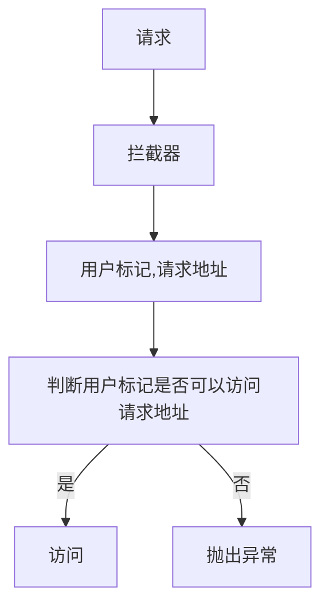
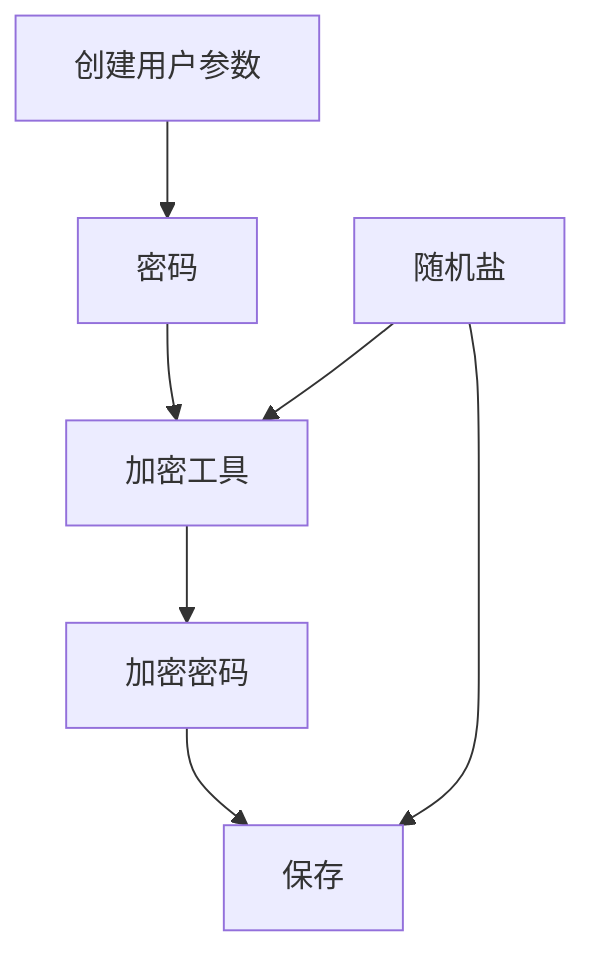

# SpringBoot整合Shiro
本章将介绍SpringBoot和Shiro的基础整合过程。 


## 基础流程整理

在传统Web开发中关于权限验证一般会通过拦截器或者过滤器进行处理，大致处理流程如下：



在传统开发中可以发现使用拦截器或过滤器做为进入请求处理前的最后一步，在这一步中会进行权限控制，同样的在Shiro中也提供了这种处理方式。在maven依赖中添加如下依赖：

```xml
<dependency>
    <groupId>org.apache.shiro</groupId>
    <artifactId>shiro-spring-boot-starter</artifactId>
    <version>1.7.1</version>
</dependency>
```

在添加这项依赖后需要回顾一个简单Shiro项目中关于权限操作需要哪些内容，最重要的是SecurityManager和Realm，在web开发中这两个类同样很重要。首先SpringBoot一般用于web项目开发，本章也是围绕Web开发中的Shiro使用进行实战，因此SecurityManager需要找到Web开发中的实现类，具体实现类是org.apache.shiro.web.mgt.DefaultWebSecurityManager，在SpringBoot中需要将其交给Spring管理，具体代码如下：

```java
@Bean
public DefaultWebSecurityManager defaultWebSecurityManager(
    @Autowired Realm realm
) {
  DefaultWebSecurityManager defaultWebSecurityManager = new DefaultWebSecurityManager();
  defaultWebSecurityManager.setRealm(realm);
  return defaultWebSecurityManager;
}
```

通过这样一个步骤就完成了SecurityManager的处理，在常规Shiro开发中SecurityManager需要使用到Realm对象同样的DefaultWebSecurityManager也需要，在Spring中可以通过@Autowired的方式进行自动注入，不过现在还未变现这个Bean实例，下面就创建一个Realm对象并且将其实例化交给Spring进行管理，首先实现AuthorizingRealm接口，类名为CustomerRealm，具体代码如下：

```java
public class CustomerRealm extends AuthorizingRealm {

  @Override
  protected AuthenticationInfo doGetAuthenticationInfo(
      AuthenticationToken token) throws AuthenticationException {
    return null;
  }

  @Override
  protected AuthorizationInfo doGetAuthorizationInfo(
      PrincipalCollection principals) {
    return null;
  }
}
```

完成基本实现类编写后需要编写Bean，具体代码如下：

```java
@Bean
public Realm realm() {
  return new CustomerRealm();
}
```

完成SecurityManager和Realm对象的实例化编写后就可以编写最重要的Shiro过滤器了，具体代码如下：

```java
@Bean
public ShiroFilterFactoryBean shiroFilterFactoryBean(
    @Autowired DefaultWebSecurityManager defaultWebSecurityManager
) {
  ShiroFilterFactoryBean shiroFilterFactoryBean = new ShiroFilterFactoryBean();
  shiroFilterFactoryBean.setSecurityManager(defaultWebSecurityManager);
  // 设置限制的资源
  Map<String, String> map = new HashMap<>();
  // 需要进行验证
  map.put("/authc", "authc");
  // 表示资源不需要验证
  map.put("/anon", "anon");
  shiroFilterFactoryBean.setFilterChainDefinitionMap(map);
  return shiroFilterFactoryBean;
}
```

在这里编写的是一个工厂Bean，具体类是ShiroFilterFactoryBean，Spring会将其自动创建为ShiroFilter。在上述代码中可以发现对于shiroFilterFactoryBean变量设置了filterChainDefinitionMap成员变量的数据设置，在这里需要对key和value进行说明，key表示的是一个资源，本例中为一个url地址，value表示验证方式，常见验证方式见表：

| 过滤器名称        | 过滤器类                                                     | 描述                                                     |
| ----------------- | ------------------------------------------------------------ | -------------------------------------------------------- |
| anon              | org.apache.shiro.web.filter.authc.AnonymousFilter | 匿名过滤器                                               |
| authc             | org.apache.shiro.web.filter.authc.FormAuthenticationFilter | 如果继续操作，需要做对应的表单验证否则不能通过           |
| authcBasic        | org.apache.shiro.web.filter.authc.BasicHttpAuthenticationFilter | 基本http验证过滤，如果不通过，跳转屋登录页面             |
| logout            | org.apache.shiro.web.filter.authc.LogoutFilter | 登录退出过滤器                                           |
| noSessionCreation | org.apache.shiro.web.filter.session.NoSessionCreationFilter | 没有session创建过滤器                                    |
| perms             | org.apache.shiro.web.filter.authz.PermissionsAuthorizationFilter | 权限过滤器                                               |
| port              | org.apache.shiro.web.filter.authz.PortFilter | 端口过滤器，可以设置是否是指定端口如果不是跳转到登录页面 |
| rest              | org.apache.shiro.web.filter.authz.HttpMethodPermissionFilter             |http方法过滤器，可以指定如post不能进行访问等|
| roles             | org.apache.shiro.web.filter.authz.RolesAuthorizationFilter | 角色过滤器，判断当前用户是否指定角色                     |
| ssl               | org.apache.shiro.web.filter.authz.SslFilter | 请求需要通过ssl，如果不是跳转回登录页                    |
| user              | org.apache.shiro.web.filter.authc.UserFilter | 如果访问一个已知用户，比如记住我功能，走这个过滤器       |

在上述内容中最为常用的是anon和authc。


## 数据表设计

下面将使用Shiro中的技术体系进行数据库设计，首先回顾Shiro中的权限验证方式，在Shiro中关于权限验证方式有两种，第一种根据角色第二种根据资源符，下面将围绕这两种方式进行数据表设计，此外还需要进行用户相关的数据表设计，在Shiro中常用的用户验证可以通过账号密码进行处理，本例也将使用用户名和密码的方式进行验证，密码采用MD5和随机盐的方式进行，具体的表设计如下：

- 用户表

| 字段名称 | 字段类型 | 字段含义       |
| -------- | -------- | -------------- |
| id       | int      | 主键     |
| username | varchar  | 用户名、登录名 |
| password | varchar  | 密码           |
| salt     | varchar  | 盐             |

- 资源表

| 字段名称 | 字段类型 | 字段含义   |
| -------- | -------- | ---------- |
| id       | int      | 主键     |
| name     | varchar  | 资源名称   |
| val      | varchar  | 资源标识符 |

- 角色表

| 字段名称 | 字段类型 | 字段含义 |
| -------- | -------- | -------- |
| id       | int      | 主键     |
| name     | varchar  | 角色名吃 |
| code     | varchar  | 角色值   |

在Shiro中关于权限验证的的方式都是由Subject进行提供，同时Subject作为主题对象一般和用户等价，在这个基础上可以认为用户表和资源表之间存在关系，用户表和角色表之间存在关系，下面将对这个关系进行表创建

- 用户和资源关系表

| 字段名称    | 字段类型 | 字段含义 |
| ----------- | -------- | -------- |
| id          | int      | 主键     |
| user_id     | int      | 用户表id |
| resource_id | int      | 资源表id |

- 用户和角色关系表

| 字段名称 | 字段类型 | 字段含义 |
| -------- | -------- | -------- |
| id       | int      | 主键     |
| user_id  | int      | 用户表id |
| role_id  | int      | 角色id   |

下面根据上述规则进行数据表创建，具体建表语句如下：

```sql
SET NAMES utf8mb4;
SET FOREIGN_KEY_CHECKS = 0;

-- ----------------------------
-- Table structure for shiro_resources
-- ----------------------------
DROP TABLE IF EXISTS `shiro_resources`;
CREATE TABLE `shiro_resources`  (
  `id` int(11) NOT NULL AUTO_INCREMENT,
  `name` varchar(50) CHARACTER SET utf8mb4 COLLATE utf8mb4_general_ci NULL DEFAULT NULL,
  `val` varchar(50) CHARACTER SET utf8mb4 COLLATE utf8mb4_general_ci NULL DEFAULT NULL,
  PRIMARY KEY (`id`) USING BTREE
) ENGINE = InnoDB AUTO_INCREMENT = 1 CHARACTER SET = utf8mb4 COLLATE = utf8mb4_general_ci ROW_FORMAT = Dynamic;

-- ----------------------------
-- Table structure for shiro_role
-- ----------------------------
DROP TABLE IF EXISTS `shiro_role`;
CREATE TABLE `shiro_role`  (
  `id` int(11) NOT NULL AUTO_INCREMENT,
  `name` varchar(50) CHARACTER SET utf8mb4 COLLATE utf8mb4_general_ci NULL DEFAULT NULL,
  `code` varchar(50) CHARACTER SET utf8mb4 COLLATE utf8mb4_general_ci NULL DEFAULT NULL,
  PRIMARY KEY (`id`) USING BTREE
) ENGINE = InnoDB AUTO_INCREMENT = 1 CHARACTER SET = utf8mb4 COLLATE = utf8mb4_general_ci ROW_FORMAT = Dynamic;

-- ----------------------------
-- Table structure for shiro_user
-- ----------------------------
DROP TABLE IF EXISTS `shiro_user`;
CREATE TABLE `shiro_user`  (
  `id` int(11) NOT NULL AUTO_INCREMENT,
  `username` varchar(50) CHARACTER SET utf8mb4 COLLATE utf8mb4_general_ci NULL DEFAULT NULL,
  `password` varchar(50) CHARACTER SET utf8mb4 COLLATE utf8mb4_general_ci NULL DEFAULT NULL,
  `salt` varchar(50) CHARACTER SET utf8mb4 COLLATE utf8mb4_general_ci NULL DEFAULT NULL,
  PRIMARY KEY (`id`) USING BTREE
) ENGINE = InnoDB AUTO_INCREMENT = 1 CHARACTER SET = utf8mb4 COLLATE = utf8mb4_general_ci ROW_FORMAT = Dynamic;

-- ----------------------------
-- Table structure for user_bind_resource
-- ----------------------------
DROP TABLE IF EXISTS `user_bind_resource`;
CREATE TABLE `user_bind_resource`  (
  `id` int(11) NOT NULL AUTO_INCREMENT,
  `user_id` int(11) NULL DEFAULT NULL,
  `resource_id` int(11) NULL DEFAULT NULL,
  PRIMARY KEY (`id`) USING BTREE
) ENGINE = InnoDB AUTO_INCREMENT = 1 CHARACTER SET = utf8mb4 COLLATE = utf8mb4_general_ci ROW_FORMAT = Dynamic;

-- ----------------------------
-- Table structure for user_bind_role
-- ----------------------------
DROP TABLE IF EXISTS `user_bind_role`;
CREATE TABLE `user_bind_role`  (
  `id` int(11) NOT NULL AUTO_INCREMENT,
  `user_id` int(11) NULL DEFAULT NULL,
  `role_id` int(11) NULL DEFAULT NULL,
  PRIMARY KEY (`id`) USING BTREE
) ENGINE = InnoDB AUTO_INCREMENT = 1 CHARACTER SET = utf8mb4 COLLATE = utf8mb4_general_ci ROW_FORMAT = Dynamic;

SET FOREIGN_KEY_CHECKS = 1;
```

在创建完成数据表后进行实体对象的生成，本例将采用JPA进行操作具体实体对象生成不做详细介绍，生成结果如下：


在得到上述实体对象后还需要创建对应的repo对象，具体创建结果如下：


## 实际业务开发

在进行实际业务开发之前需要进行maven依赖的修正，首先需要加入JPA依赖、mysql驱动、Junit和lombok依赖，具体依赖信息如下：

```xml
<dependency>
    <artifactId>mysql-connector-java</artifactId>
    <exclusions>
        <exclusion>
            <artifactId>protobuf-java</artifactId>
            <groupId>com.google.protobuf</groupId>
        </exclusion>
    </exclusions>
    <groupId>mysql</groupId>
</dependency>
<dependency>
    <artifactId>spring-boot-starter-data-jpa</artifactId>
    <groupId>org.springframework.boot</groupId>
</dependency>
<dependency>
    <groupId>org.projectlombok</groupId>
    <artifactId>lombok</artifactId>
</dependency>
<dependency>
    <groupId>junit</groupId>
    <artifactId>junit</artifactId>
    <scope>test</scope>
</dependency>

```

依赖处理完毕后㤇进行实际业务开发，首先需要解决的第一个问题是用户创建，定义一个接口用来完成用户创建，用户创建接口定义如下：

```http
post /user/
content-type: application/json

{
    "username":"用户名",
    "password":"密码"
}
```

上述接口定义说明：HTTP请求方式POST，请求地址是“/user”，请求参数是username和password。在编写Controller之前需要定义一个通用返回对象，具体定义如下：

```java
@Data
public class Result {

  private int code;
  private String msg;
  private Object data;

  public Result() {
  }

  public Result(int code, String msg, Object data) {
    this.code = code;
    this.msg = msg;
    this.data = data;
  }

  public static Result ok(String msg, Object data) {
    return new Result(200, msg, data);
  }

  public static Result fail(String msg) {
    return new Result(200, msg, null);
  }

}
```

完成通用返回值定义后需要进行用户创建接口的对象定义，具体定义信息如下：

```java
@Data
public class UserCreateParam {

  private String username;
  private String password;

}
```

最后编写用户接口，首先创建一个处理用户请求的对象，类名为UserController，并向其填充创建接口，具体代码如下：

```java
@RestController
@RequestMapping("/user")
public class UserController {

  @PostMapping("/")
  public Result userCreate(
      @RequestBody UserCreateParam param
  ) {
    return null;
  }
}
```

完成rest接口定义后需要创建service层的代码，首先需要创建一个Java接口，具体代码如下：

```java
public interface UserService {
  boolean userCreate(UserCreateParam param);
}
```

在这个接口基础上需要实现它，具体实现类如下：

```java
@Service
public class UserServiceImpl implements UserService {

  @Override
  public boolean userCreate(UserCreateParam param) {
    return false;
  }
}
```

至此基本的用户创建模型已经搭建完成，下面需要在UserServiceImpl类中填写具体的业务处理代码，在这个业务处理中用户名不需要进行特殊操作，主要进行的操作是密码，在实际开发中密码不能进行明文存储需要进行加密，本次采用的是MD5+随机盐的方式进行，整体处理流程如下 ：



在这个流程图中需要提供2个方法：

1. 生成随机盐的方法。
2. 加密密码的方法。

### 加密工具开发

为了处理上述两个方法需要创建一个新的类，类名为EncryptionUtils，该类只用于密码处理工作，下面进行代码编写，首先编写生成随机盐的方法，具体代码如下：

```java
public static String randomSalt(int len) {
  int leftLimit = 48; // numeral '0'
  int rightLimit = 122; // letter 'z'
  Random random = new Random();

return random.ints(leftLimit, rightLimit + 1)
      .filter(i -> (i <= 57 || i >= 65) && (i <= 90 || i >= 97))
      .limit(len)
      .collect(StringBuilder::new, StringBuilder::appendCodePoint, StringBuilder::append)
      .toString();
}
```

下面对randomSalt方法进行说明，在这个方法中需要传递一个参数len，该参数表示生成的随机盐长度，生产规则是在0到z之间进行任意字符的提取，下面编写测试用例，具体测试用例代码如下：

```java
  @Test
  public void testRandomSalt() {
    assert EncryptionUtils.randomSalt(10).length() == 10;
  }
```

完成随机盐的生成方法编写和测试后需要进行MD5+盐生成密码的方法编写，具体代码如下：

```java
public static String genMD5Hash(String password, String salt) {
  Md5Hash md5Hash = new Md5Hash(password, salt, HASH_ITERATIONS);
  return md5Hash.toHex();
}
```

在这个方法中需要两个参数：

1. password：用户在注册时输入的密码。
2. salt：盐。

在这个方法中整体处理逻辑就是调用Md5Hash对象的创建过程和toHex方法，该方法对应的测试用例如下：

```
@Test
public void testMD5() {
  String admin = EncryptionUtils.genMD5Hash("admin", "123casad");
  System.out.println(admin);
}
```


### 用户创建业务开发


现在基本工具准备完成需要正式为userCreate方法添加具体业务逻辑，实现代码如下：

```java
@Override
public boolean userCreate(UserCreateParam param) {
  String salt = EncryptionUtils.randomSalt(EncryptionUtils.SLAT_LEN);
  ShiroUserEntity shiroUserEntity = new ShiroUserEntity();
  shiroUserEntity.setUsername(param.getUsername());
  shiroUserEntity.setPassword(EncryptionUtils.genMD5Hash(param.getPassword(), salt));
  shiroUserEntity.setSalt(salt);
  ShiroUserEntity save = shiroUserRepo.save(shiroUserEntity);
  return save.getId() > 0;
}
```

在业务代码编写完成后需要编写测试用例，具体测试用例代码如下：

```java
@SpringBootTest(classes = {ShiroApp.class})
class UserServiceImplTest {

  @Autowired
  private UserService userService;

  @Test
  void userCreate() {
    UserCreateParam userCreateParam = new UserCreateParam();
    userCreateParam.setUsername("admin");
    userCreateParam.setPassword("admin");

    boolean b = userService.userCreate(userCreateParam);
    assert b;
  }
}
```

当执行该测试用例代码后会在数据库中插入数据，具体数据如图所示：


这样就做完了用户创建的业务代码及测试。最后需要将Controller代码编写完成，Controller代码如下：

```java
@RestController
@RequestMapping("/user")
public class UserController {

  @Autowired
  private UserService userService;

  @PostMapping("/")
  public Result userCreate(
      @RequestBody UserCreateParam param
  ) {
    boolean b = userService.userCreate(param);

    return Result.ok("用户创建", b);
  }
}
```

在编写完成这个接口后需要注意，用户注册接口应该是不需要进行权限验证的，当然可能需要进行权限验证，本例用户创建不需要进行权限验证，需要在ShiroFilterFactoryBean的配置中进行说明，配置代码如下：

```java
@Bean
public ShiroFilterFactoryBean shiroFilterFactoryBean(
    @Autowired DefaultWebSecurityManager defaultWebSecurityManager
) {
  ShiroFilterFactoryBean shiroFilterFactoryBean = new ShiroFilterFactoryBean();
  shiroFilterFactoryBean.setSecurityManager(defaultWebSecurityManager);
  // 设置限制的资源
  Map<String, String> map = new HashMap<>();
  // 需要进行验证
  map.put("/authc", "authc");
  // 表示资源不需要验证
 map.put("/anon", "anon");
 map.put("/user/", "anon");
  shiroFilterFactoryBean.setFilterChainDefinitionMap(map);
  return shiroFilterFactoryBean;
}
```

此时发送如下请求，具体请求信息如下：

```
POST http://localhost:8080/user/
Content-Type: application/json

{
  "username": "admin",
  "password": "admin"
}
```

请求返回数据如下：

```
POST http://localhost:8080/user/

HTTP/1.1 200 
Content-Type: application/json
Transfer-Encoding: chunked
Date: Fri, 16 Apr 2021 04:56:41 GMT
Keep-Alive: timeout=60
Connection: keep-alive

{
  "code": 200,
  "msg": "用户创建",
  "data": true
}
```

此时数据库就会增加一条数据，现在对于用户创建的接口以及处理完成。


### 用户角色资源数据查询开发

在用户创建完成后需要进行绑定数据查询，在前文提到用户的绑定数据有角色和资源，本节将实现这两个数据的查询。首先实现角色查询，角色查询在UserService中定义如下接口方法：

```java
List<String> queryRolesForUsername(String username);
```

在接口方法定义完成后着手实现该方法，首先确认查询流程，在本例中查询流程需要通过用户名查询用户id，在根据用户id查询Role的数据，分步编写两个JPA查询规则，首先是根据用户名查询用户id，具体代码如下：

```java
@Repository
public interface ShiroUserRepo extends CrudRepository<ShiroUserEntity, Integer> {
  Optional<ShiroUserEntity> findShiroUserEntityByUsername(String username);
}
```

其次是编写根据用户id查询Role的数据，具体代码如下：

```java
@Repository
public interface ShiroRoleRepo extends JpaRepository<ShiroRoleEntity, Integer> {

  @Query(value = "select * from shiro_role where id in (select role_id from user_bind_role where user_id = :user_id)",
  nativeQuery = true)
  List<ShiroRoleEntity> queryByUserId(@Param("user_id") Integer userId);
}
```

通过上述代码完成role对象的查询，下面将实现资源数据查询，具体实现代码如下：

```java
@Repository
public interface ShiroResourcesRepo extends CrudRepository<ShiroResourcesEntity, Integer> {
  @Query(
      value = "select * from shiro_resources where id in (select resource_id from user_bind_resource where user_id = :user_id)",
      nativeQuery = true)
  List<ShiroResourcesEntity> queryByUserId(@Param("user_id") Integer userId);

}
```

完成SQL编写后在项目中将缺少的方法补充完整，具体代码如下：

```java
@Override
public List<String> queryRolesForUsername(String username) {
  Optional<ShiroUserEntity> shiroUserEntityByUsername = this.shiroUserRepo
      .findShiroUserEntityByUsername(username);
  if (shiroUserEntityByUsername.isPresent()) {
    ShiroUserEntity shiroUserEntity = shiroUserEntityByUsername.get();
    return this.shiroRoleRepo.queryByUserId(shiroUserEntity.getId()).stream()
        .map(ShiroRoleEntity::getCode).collect(
            Collectors.toList());
  }
  return Collections.emptyList();
}

@Override
public List<String> queryPermissionsForUsername(String username) {
  Optional<ShiroUserEntity> shiroUserEntityByUsername = this.shiroUserRepo
      .findShiroUserEntityByUsername(username);
  if (shiroUserEntityByUsername.isPresent()) {
    ShiroUserEntity shiroUserEntity = shiroUserEntityByUsername.get();
    return shiroResourcesRepo.queryByUserId(shiroUserEntity.getId()).stream()
        .map(ShiroResourcesEntity::getVal).collect(
            Collectors.toList());
  }
  return Collections.emptyList();
}
```


下面在数据库中创建模拟数据，首先创建role数据，具体信息如图所示：


其次创建permission数据，具体数据如图所示：


### 自定义Realm开发

本节将对CustomerRealm代码进行补充，首先实现用户校验，具体代码如下：

```java
  @Override
  protected AuthenticationInfo doGetAuthenticationInfo(
      AuthenticationToken token) throws AuthenticationException {
    if (token instanceof UsernamePasswordToken
    ) {

      String username = ((UsernamePasswordToken) token).getUsername();
      String pwd = new String(((UsernamePasswordToken) token).getPassword());

      if (username == null) {
        throw new RuntimeException("用户名称不能为空");
      }
      if (pwd == null) {
        throw new RuntimeException("密码不能为空");
      }

      ShiroUserEntity byUsername = this.userService.findByUsername(username);
      if (byUsername != null) {

        String salt = byUsername.getSalt();
        return new SimpleAuthenticationInfo(byUsername.getUsername(), byUsername.getPassword(),
            ByteSource.Util.bytes(salt), getName());
      }
    }
    return null;
  }

```

完成认证代码编写后需要创建一个密码匹配器，这里采用Shiro所提供的HashedCredentialsMatcher，在ShiroConfig类中将其进行注册，具体注册代码如下：

```java
@Bean
public HashedCredentialsMatcher hashedCredentialsMatcher() {
  HashedCredentialsMatcher hashedCredentialsMatcher = new HashedCredentialsMatcher();
  hashedCredentialsMatcher.setHashAlgorithmName("md5");
  hashedCredentialsMatcher.setHashIterations(EncryptionUtils.HASH_ITERATIONS);
  return hashedCredentialsMatcher;
}
```

完成注册后需要将其设置给Realm对象，具体代码如下：

```java
@Bean
public Realm realm(@Autowired HashedCredentialsMatcher credentialsMatcher) {
  CustomerRealm customerRealm = new CustomerRealm();
  customerRealm.setCredentialsMatcher(credentialsMatcher);
  return customerRealm;
}
```

至此关于用户验证的代码已经完成编写，下面将进入授权部分代码编写，授权代码实现如下：

```java
@Override
protected AuthorizationInfo doGetAuthorizationInfo(
    PrincipalCollection principals) {
  Object primaryPrincipal = principals.getPrimaryPrincipal();
  if (primaryPrincipal == null) {
    throw new RuntimeException("ex");
  }
  List<String> permissions = this.userService
      .queryPermissionsForUsername(String.valueOf(principals));
  List<String> roles = this.userService.queryRolesForUsername(String.valueOf(principals));
  SimpleAuthorizationInfo simpleAuthorizationInfo = new SimpleAuthorizationInfo();
  simpleAuthorizationInfo.addStringPermissions(permissions);
  simpleAuthorizationInfo.addRoles(roles);
  return simpleAuthorizationInfo;
}
```


### 用户登陆开发

本节将开发用户登陆，用户登陆需要使用Shrio进行登陆处理，具体登陆代码如下：

```java
@PostMapping("/login")
public Result login(
    @RequestBody UserCreateParam param
) {
  Subject subject = SecurityUtils.getSubject();
  UsernamePasswordToken usernamePasswordToken = new UsernamePasswordToken(
      param.getUsername(),
      param.getPassword()
  );
  subject.login(usernamePasswordToken);
  return Result.ok("用户登录", true);
}
```

在使用SpringBoot和Shiro整合是登陆需要使用Shiro的Subject进行登陆，这个处理和单独的Shiro使用相同，


### 权限接口测试

本节将进行权限接口测试，首先进行role测试，在前文添加的测试数据中role只有admin，现在需要编写2个controller其中一个包含admin其中一个不包含admin，具体代码如下：

```java
@RequiresRoles("admin")
@GetMapping("/data")
public String data() {
  return "data";
}

@RequiresRoles("test")
@GetMapping("/test")
public String test() {
  return "data";
}
```

下面启动项目首先进行登陆接口调用，具体调用细节如下：

```http
POST http://localhost:8080/user/login
Content-Type: application/json

{
  "username": "admin",
  "password": "admin"
}
```

在登陆接口调用后进行http://localhost:8080/data接口的调用，接口响应如下：

```
GET http://localhost:8080/data

HTTP/1.1 200 
Content-Type: text/plain;charset=UTF-8
Content-Length: 4
Date: Fri, 16 Apr 2021 06:59:47 GMT
Keep-Alive: timeout=60
Connection: keep-alive

data
```

下面进行http://localhost:8080/test接口的调用，接口响应如下：

```
GET http://localhost:8080/test

HTTP/1.1 500 
Content-Type: application/json
Transfer-Encoding: chunked
Date: Fri, 16 Apr 2021 07:00:19 GMT
Connection: close

{
  "timestamp": "2021-04-16T07:00:19.537+00:00",
  "status": 500,
  "error": "Internal Server Error",
  "message": "",
  "path": "/test"
}
```

此时出现了一个异常，这个异常在响应中难以观察，可以通过观察控制台得到具体的数据，控制台输出如下：

```
org.apache.shiro.authz.AuthorizationException: Not authorized to invoke method: public java.lang.String com.github.huifer.simple.shiro.boot.rest.DataController.test()
	at org.apache.shiro.authz.aop.AuthorizingAnnotationMethodInterceptor.assertAuthorized(AuthorizingAnnotationMethodInterceptor.java:90) ~[shiro-core-1.7.1.jar:1.7.1]
	at org.apache.shiro.authz.aop.AnnotationsAuthorizingMethodInterceptor.assertAuthorized(AnnotationsAuthorizingMethodInterceptor.java:100) ~[shiro-core-1.7.1.jar:1.7.1]

```

此时抛出的异常是AuthorizationException，当进行checkRole操作失败后会抛出该异常。


下面进行permission的测试，首先编写两个测试接口，具体代码如下：

```java
@RequiresPermissions("user:query:*")
@GetMapping("/p1")
public String p1() {
  return "p1";
}

@RequiresPermissions("user:create:*")
@GetMapping("/p2")
public String p2() {
  return "p2";
}
```

同样进行模拟请求，在模拟请求中p2接口的permission是不属于用户admin的资源值，因此访问该接口会抛出异常，异常如下：

```
org.apache.shiro.authz.AuthorizationException: Not authorized to invoke method: public java.lang.String com.github.huifer.simple.shiro.boot.rest.DataController.p2()
	at org.apache.shiro.authz.aop.AuthorizingAnnotationMethodInterceptor.assertAuthorized(AuthorizingAnnotationMethodInterceptor.java:90) ~[shiro-core-1.7.1.jar:1.7.1]
	at org.apache.shiro.authz.aop.AnnotationsAuthorizingMethodInterceptor.assertAuthorized(AnnotationsAuthorizingMethodInterceptor.java:100) ~[shiro-core-1.7.1.jar:1.7.1]

```

