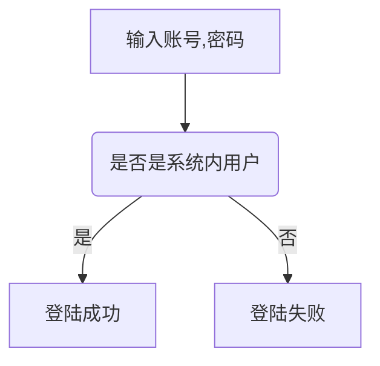
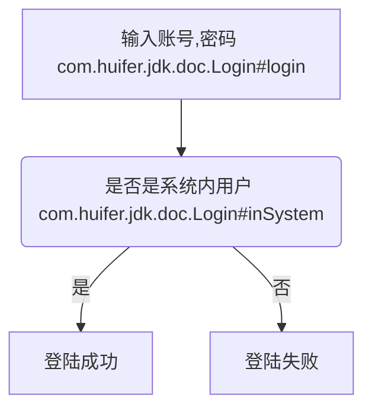
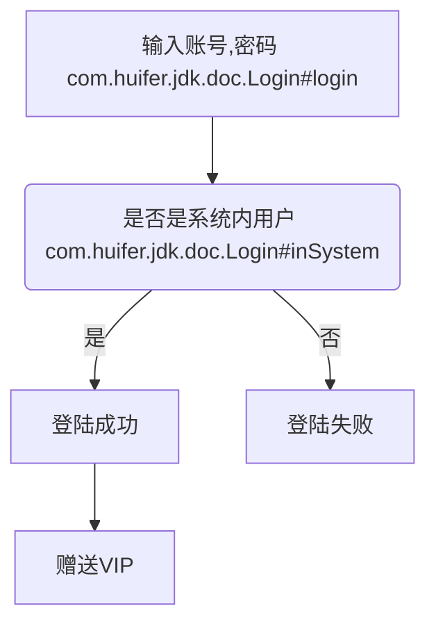

# 对于开发文档的想法
- Author: [HuiFer](https://github.com/huifer)

- 你是否在开发中经常修改业务,你是否在开发中经常接手别人的代码,在开发中我们经常为此烦恼,如何才可以解决这些问题? 本文对此做了简单的想法.
## 分类
- 首先对开发文档进行简单分类
1. 需求文档
    - 记录需求.
2. 流程文档
    - 记录需求的实现流程.
3. 测试文档
    - 测试人员的测试文档,记录测试用例,异常信息等.
4. API文档
    - 前后端交互文档,记录参数以及返回值.
5. 代码文档
    - JAVA、JS 代码上的注释文档
    
## 案例
### 需求文档
1. 登录: 使用账号密码进行登录
### 流程文档
- 使用markdown进行流程图回值

### API文档
- 返回值为一个全局对象,对异常\成功的做封装方便前端识别.如成功200,失败400....

- POST user/login
    - 参数列表:
        - username: 用户名
        - password: 密码
    - 返回
        - code: 状态码
        - msg: 信息
        - data: 数据

### 代码文档
- 假设基本代码如下
```java
public class Login {

    /**
     * 登录: 使用账号密码进行登录
     * <ol>
     *     <li>需求文档: 需求文档url</li>
     *     <li>流程文档: 流程文档url</li>
     * </ol>
     * @param username
     * @param password
     * @return
     */
    public Boolean login(String username, String password) {
        // 业务代码
        return true;
    }

    /**
     * 判断是否为系统内用户
     * @param username 用户名
     * @return true: 是,false: 否
     */
    private boolean inSystem(String username) {
        // 业务代码
        return true;
    }

}

```
- 在完成这写业务代码后需要修改**流程文档** ,修改内容为: 补充具体函数



- 这里我使用的是全类名+方法名,各位可以酌情使用. 此时流程文档更新完成,提交给测试人员进行测试.


#### java doc 使用说明
1. 标记方法的作用
2. 标记需求文档
3. 标记流程文档
4. 标注其中使用到的关键方法.
    - 本例中 `isSystem` 为关键方法使用`@see`进行标记`@see Login#inSystem(java.lang.String)`
5. 标记版本    
    - `@version`,本例中这个版本为1号版本`@version 1

### 测试文档
- 针对登录进行测试,测试方向:是否是系统内用户. 输入两组参数进行测试,第一组非系统内用户,第二组系统内用户.记录测试结果


## 需求进化
### 需求文档
- 在登录成功后赠送vip
### 流程文档
- 在原有文档上进行补充即可.


### 代码文档
```java
public class Login {

    /**
     * 登录: 使用账号密码进行登录
     * <ol>
     *     <li>需求文档: 需求文档url</li>
     *     <li>流程文档: 流程文档url</li>
     * </ol>
     * @param username
     * @param password
     * @return
     * @see Login#inSystem(java.lang.String)
     * @version 2
     */
    public Boolean login(String username, String password) {
        // 业务代码
        if (inSystem(username)) {
            giveVip(username);
            return true;
        }
        else {
            return false;
        } 
        
    }

    /**
     * 判断是否为系统内用户
     * @param username 用户名
     * @return true: 是,false: 否
     */
    private boolean inSystem(String username) {
        // 业务代码
        return true;
    }

    /**
     * 赠送VIP
     * @param username
     */
    private void giveVip(String username){
        // 业务代码
    }
}
```
### 测试文档
- 对vip是否赠送成功进行测试.


### 注意
1. VIP模块可以独立于用户模块,初始阶段只有用户模块,后续增加了VIP相关模块
2. 文档目录.顶层目录为(需求文档,流程文档,测试文档),子集目录为具体模块.案例如下
    - 需求文档
        - 用户
            - 用户登录需求.md
        - VIP
            - VIP需求.md
    - 流程文档
        - 用户
            - 用户登录流程.md
        - VIP
            - VIP赠送流程.md

## 优势
1. 需求可溯源.
2. 流程清晰,便于修改.
3. 文档全面.