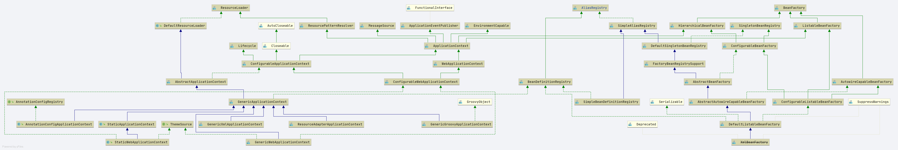

# Spring AliasRegistry
- Author: [HuiFer](https://github.com/huifer)
- 源码阅读仓库: [SourceHot-spring](https://github.com/SourceHot/spring-framework-read)

- 全路径: `org.springframework.core.AliasRegistry`


- 别名操作相关接口

```java
public interface AliasRegistry {

   /**
    * Given a name, register an alias for it.
    * 别名注册
    * @param name the canonical name
    * @param alias the alias to be registered
    * @throws IllegalStateException if the alias is already in use
    * and may not be overridden
    */
   void registerAlias(String name, String alias);

   /**
    * Remove the specified alias from this registry.
    * 移除别名
    * @param alias the alias to remove
    * @throws IllegalStateException if no such alias was found
    */
   void removeAlias(String alias);

   /**
    * Determine whether the given name is defined as an alias
    * 是不是别名
    * (as opposed to the name of an actually registered component).
    * @param name the name to check
    * @return whether the given name is an alias
    */
   boolean isAlias(String name);

   /**
    * Return the aliases for the given name, if defined.
    * 输入一个 beanName 获取别名列表
    * @param name the name to check for aliases
    * @return the aliases, or an empty array if none
    */
   String[] getAliases(String name);

}
```


类图




## SimpleAliasRegistry

- 全路径: `org.springframework.core.SimpleAliasRegistry`

**为了便于区分name,在这里使用真名作为别名的对应. **

### registerAlias

1. 参数验证
2. 别名和真名是否相同
   1. 相同移除别名
3. 通过别名获取已经注册的真名
   1. 已注册的真名不为空
      1. 已注册的真名是否和参数真名是否相同
      2. 是否需要执行覆盖
4. 检查别名是否循环使用
5. 将参数真名和别名放入map

```java
	@Override
	public void registerAlias(String name, String alias) {
		// 参数验证
		Assert.hasText(name, "'name' must not be empty");
		Assert.hasText(alias, "'alias' must not be empty");
		// 上锁
		synchronized (this.aliasMap) {
			// 别名和真名是否相同
			if (alias.equals(name)) {
				// 移除
				this.aliasMap.remove(alias);
				if (logger.isDebugEnabled()) {
					logger.debug("Alias definition '" + alias + "' ignored since it points to same name");
				}
			}
			else {
				// 通过别名获取真名
				String registeredName = this.aliasMap.get(alias);
				// 真名不为空
				if (registeredName != null) {
					// 真名等于参数的真名
					if (registeredName.equals(name)) {
						// An existing alias - no need to re-register
						return;
					}
					// 是否覆盖别名
					if (!allowAliasOverriding()) {
						throw new IllegalStateException("Cannot define alias '" + alias + "' for name '" +
								name + "': It is already registered for name '" + registeredName + "'.");
					}
					if (logger.isDebugEnabled()) {
						logger.debug("Overriding alias '" + alias + "' definition for registered name '" +
								registeredName + "' with new target name '" + name + "'");
					}
				}
				// 别名是否循环使用
				checkForAliasCircle(name, alias);
				// 设置 别名对应真名
				this.aliasMap.put(alias, name);
				if (logger.isTraceEnabled()) {
					logger.trace("Alias definition '" + alias + "' registered for name '" + name + "'");
				}
			}
		}
	}
```


### checkForAliasCircle

```java
protected void checkForAliasCircle(String name, String alias) {
   // 是否存在别名
   if (hasAlias(alias, name)) {
      throw new IllegalStateException("Cannot register alias '" + alias +
            "' for name '" + name + "': Circular reference - '" +
            name + "' is a direct or indirect alias for '" + alias + "' already");
   }
}
```


### hasAlias

```java
public boolean hasAlias(String name, String alias) {
   // 从别名map中获取已注册的真名
   String registeredName = this.aliasMap.get(alias);
   // 注册的真名和 参数真名是否相同,
   // 递归判断是否存在别名
   return ObjectUtils.nullSafeEquals(registeredName, name) || (registeredName != null
         && hasAlias(name, registeredName));
}
```


### removeAlias

```java
@Override
public void removeAlias(String alias) {
   synchronized (this.aliasMap) {
      // 移除别名
      String name = this.aliasMap.remove(alias);
      if (name == null) {
         throw new IllegalStateException("No alias '" + alias + "' registered");
      }
   }
}
```


### isAlias

```java
@Override
public boolean isAlias(String name) {
   return this.aliasMap.containsKey(name);
}
```


### getAliases

```java
@Override
public String[] getAliases(String name) {
   List<String> result = new ArrayList<>();
   synchronized (this.aliasMap) {
      retrieveAliases(name, result);
   }
   return StringUtils.toStringArray(result);
}

/**
 * Transitively retrieve all aliases for the given name.
 * @param name the target name to find aliases for
 * @param result the resulting aliases list
 */
private void retrieveAliases(String name, List<String> result) {
   this.aliasMap.forEach((alias, registeredName) -> {
      if (registeredName.equals(name)) {
         result.add(alias);
         retrieveAliases(alias, result);
      }
   });
}
```

