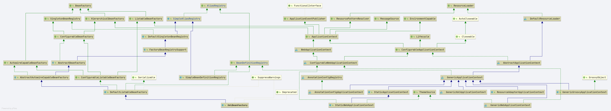

# Spring BeanDefinitionRegistry 
- Author: [HuiFer](https://github.com/huifer)
- 源码阅读仓库: [SourceHot-spring](https://github.com/SourceHot/spring-framework-read)

- 全路径: `org.springframework.beans.factory.support.BeanDefinitionRegistry`

```java
public interface BeanDefinitionRegistry extends AliasRegistry {

   /**
    * Register a new bean definition with this registry.
    * Must support RootBeanDefinition and ChildBeanDefinition.
    *
    * 注册beanDefinition
    * @param beanName the name of the bean instance to register
    * @param beanDefinition definition of the bean instance to register
    * @throws BeanDefinitionStoreException if the BeanDefinition is invalid
    * @throws BeanDefinitionOverrideException if there is already a BeanDefinition
    * for the specified bean name and we are not allowed to override it
    * @see GenericBeanDefinition
    * @see RootBeanDefinition
    * @see ChildBeanDefinition
    */
   void registerBeanDefinition(String beanName, BeanDefinition beanDefinition)
         throws BeanDefinitionStoreException;

   /**
    * Remove the BeanDefinition for the given name.
    * 移除bean的定义
    * @param beanName the name of the bean instance to register
    * @throws NoSuchBeanDefinitionException if there is no such bean definition
    */
   void removeBeanDefinition(String beanName) throws NoSuchBeanDefinitionException;

   /**
    * Return the BeanDefinition for the given bean name.
    * 获取bean定义
    * @param beanName name of the bean to find a definition for
    * @return the BeanDefinition for the given name (never {@code null})
    * @throws NoSuchBeanDefinitionException if there is no such bean definition
    */
   BeanDefinition getBeanDefinition(String beanName) throws NoSuchBeanDefinitionException;

   /**
    * Check if this registry contains a bean definition with the given name.
    * 是否存在 beanDefinition
    * @param beanName the name of the bean to look for
    * @return if this registry contains a bean definition with the given name
    */
   boolean containsBeanDefinition(String beanName);

   /**
    * Return the names of all beans defined in this registry.
    * 获取所有的beanDefinition的名称(beanName列表)
    * @return the names of all beans defined in this registry,
    * or an empty array if none defined
    */
   String[] getBeanDefinitionNames();

   /**
    * Return the number of beans defined in the registry.
    * 获取 beanDefinition 的数量
    * @return the number of beans defined in the registry
    */
   int getBeanDefinitionCount();

   /**
    * Determine whether the given bean name is already in use within this registry,
    * i.e. whether there is a local bean or alias registered under this name.
    * beanName是否被使用
    * @param beanName the name to check
    * @return whether the given bean name is already in use
    */
   boolean isBeanNameInUse(String beanName);

}
```


类图




## SimpleBeanDefinitionRegistry

- 全路径: `org.springframework.beans.factory.support.SimpleBeanDefinitionRegistry`


- 一个简单的map操作代码如下.

```java
public class SimpleBeanDefinitionRegistry extends SimpleAliasRegistry implements BeanDefinitionRegistry {

   /**
    *  Map of bean definition objects, keyed by bean name.
    * key:beanName
    * value: bean definition
    * */
   private final Map<String, BeanDefinition> beanDefinitionMap = new ConcurrentHashMap<>(64);


   @Override
   public void registerBeanDefinition(String beanName, BeanDefinition beanDefinition)
         throws BeanDefinitionStoreException {

      Assert.hasText(beanName, "'beanName' must not be empty");
      Assert.notNull(beanDefinition, "BeanDefinition must not be null");
      this.beanDefinitionMap.put(beanName, beanDefinition);
   }

   @Override
   public void removeBeanDefinition(String beanName) throws NoSuchBeanDefinitionException {
      if (this.beanDefinitionMap.remove(beanName) == null) {
         throw new NoSuchBeanDefinitionException(beanName);
      }
   }

   @Override
   public BeanDefinition getBeanDefinition(String beanName) throws NoSuchBeanDefinitionException {
      BeanDefinition bd = this.beanDefinitionMap.get(beanName);
      if (bd == null) {
         throw new NoSuchBeanDefinitionException(beanName);
      }
      return bd;
   }

   @Override
   public boolean containsBeanDefinition(String beanName) {
      return this.beanDefinitionMap.containsKey(beanName);
   }

   @Override
   public String[] getBeanDefinitionNames() {
      return StringUtils.toStringArray(this.beanDefinitionMap.keySet());
   }

   @Override
   public int getBeanDefinitionCount() {
      return this.beanDefinitionMap.size();
   }

   @Override
   public boolean isBeanNameInUse(String beanName) {
      return isAlias(beanName) || containsBeanDefinition(beanName);
   }

}
```


## DefaultListableBeanFactory

### registerBeanDefinition

- `org.springframework.beans.factory.support.DefaultListableBeanFactory#registerBeanDefinition`

```java
@Override
public void registerBeanDefinition(String beanName, BeanDefinition beanDefinition)
      throws BeanDefinitionStoreException {

   Assert.hasText(beanName, "Bean name must not be empty");
   Assert.notNull(beanDefinition, "BeanDefinition must not be null");

   // 类型严重
   if (beanDefinition instanceof AbstractBeanDefinition) {
      try {
         // bean定义验证
         ((AbstractBeanDefinition) beanDefinition).validate();
      }
      catch (BeanDefinitionValidationException ex) {
         throw new BeanDefinitionStoreException(beanDefinition.getResourceDescription(), beanName,
               "Validation of bean definition failed", ex);
      }
   }

   // 从 map 中根据 beanName 获取 beanDefinition
   BeanDefinition existingDefinition = this.beanDefinitionMap.get(beanName);
   if (existingDefinition != null) {
      // bean name 是否允许重复注册
      if (!isAllowBeanDefinitionOverriding()) {
         throw new BeanDefinitionOverrideException(beanName, beanDefinition, existingDefinition);
      }
      // role 值比较
      else if (existingDefinition.getRole() < beanDefinition.getRole()) {
         // e.g. was ROLE_APPLICATION, now overriding with ROLE_SUPPORT or ROLE_INFRASTRUCTURE
         if (logger.isInfoEnabled()) {
            logger.info("Overriding user-defined bean definition for bean '" + beanName +
                  "' with a framework-generated bean definition: replacing [" +
                  existingDefinition + "] with [" + beanDefinition + "]");
         }
      }
      // map 中存储的 beanDefinition 是否和参数相同
      else if (!beanDefinition.equals(existingDefinition)) {
         if (logger.isDebugEnabled()) {
            logger.debug("Overriding bean definition for bean '" + beanName +
                  "' with a different definition: replacing [" + existingDefinition +
                  "] with [" + beanDefinition + "]");
         }
      }
      else {
         if (logger.isTraceEnabled()) {
            logger.trace("Overriding bean definition for bean '" + beanName +
                  "' with an equivalent definition: replacing [" + existingDefinition +
                  "] with [" + beanDefinition + "]");
         }
      }
      // 设置 beanName 和 beanDefinition 关系
      this.beanDefinitionMap.put(beanName, beanDefinition);
   }
   else {
      // 检查 bean 是否已经开始创建
      if (hasBeanCreationStarted()) {
         // Cannot modify startup-time collection elements anymore (for stable iteration)
         synchronized (this.beanDefinitionMap) {
            // 设置 beanName 和 beanDefinition 关系
            this.beanDefinitionMap.put(beanName, beanDefinition);
            // bean definiton 的名称列表
            List<String> updatedDefinitions = new ArrayList<>(this.beanDefinitionNames.size() + 1);
            // 加入内存数据
            updatedDefinitions.addAll(this.beanDefinitionNames);
            // 加入当前的 beanName
            updatedDefinitions.add(beanName);
            // 对象替换
            this.beanDefinitionNames = updatedDefinitions;
            // 移除当前的beanName
            removeManualSingletonName(beanName);
         }
      }
      else {
         // Still in startup registration phase
         this.beanDefinitionMap.put(beanName, beanDefinition);
         this.beanDefinitionNames.add(beanName);
         // 移除当前的beanName
         removeManualSingletonName(beanName);
      }
      this.frozenBeanDefinitionNames = null;
   }

   if (existingDefinition != null || containsSingleton(beanName)) {
      // 刷新bean definition
      resetBeanDefinition(beanName);
   }
}
```


### updateManualSingletonNames

```java
	private void removeManualSingletonName(String beanName) {
		updateManualSingletonNames(set -> set.remove(beanName), set -> set.contains(beanName));
	}


	private void updateManualSingletonNames(Consumer<Set<String>> action, Predicate<Set<String>> condition) {
		if (hasBeanCreationStarted()) {
			// Cannot modify startup-time collection elements anymore (for stable iteration)
			synchronized (this.beanDefinitionMap) {
				// 输入的 beanName 是否在 manualSingletonNames 存在
				if (condition.test(this.manualSingletonNames)) {
					// 数据重写
					Set<String> updatedSingletons = new LinkedHashSet<>(this.manualSingletonNames);
					// 删除 beanName
					action.accept(updatedSingletons);
					// 数据重写
					this.manualSingletonNames = updatedSingletons;
				}
			}
		}
		else {
			// Still in startup registration phase
			// 输入的 beanName 是否在 manualSingletonNames 存在
			if (condition.test(this.manualSingletonNames)) {
				// 删除 beanName
				action.accept(this.manualSingletonNames);
			}
		}
	}

```


### removeBeanDefinition

- `org.springframework.beans.factory.support.DefaultListableBeanFactory#removeBeanDefinition`


```java
@Override
public void removeBeanDefinition(String beanName) throws NoSuchBeanDefinitionException {
   Assert.hasText(beanName, "'beanName' must not be empty");

   // 删除 beanName key
   BeanDefinition bd = this.beanDefinitionMap.remove(beanName);
   if (bd == null) {
      if (logger.isTraceEnabled()) {
         logger.trace("No bean named '" + beanName + "' found in " + this);
      }
      throw new NoSuchBeanDefinitionException(beanName);
   }

   if (hasBeanCreationStarted()) {
      // Cannot modify startup-time collection elements anymore (for stable iteration)
      synchronized (this.beanDefinitionMap) {
         List<String> updatedDefinitions = new ArrayList<>(this.beanDefinitionNames);
         // 删除需要移除的BeanName
         updatedDefinitions.remove(beanName);
         // 重新赋值
         this.beanDefinitionNames = updatedDefinitions;
      }
   }
   else {
      // Still in startup registration phase
      // 移除 beanName
      this.beanDefinitionNames.remove(beanName);
   }
   this.frozenBeanDefinitionNames = null;

   // 刷新bean definition
   resetBeanDefinition(beanName);
}
```


### resetBeanDefinition

```java
@Override
public void removeBeanDefinition(String beanName) throws NoSuchBeanDefinitionException {
   Assert.hasText(beanName, "'beanName' must not be empty");

   // 删除 beanName key
   BeanDefinition bd = this.beanDefinitionMap.remove(beanName);
   if (bd == null) {
      if (logger.isTraceEnabled()) {
         logger.trace("No bean named '" + beanName + "' found in " + this);
      }
      throw new NoSuchBeanDefinitionException(beanName);
   }

   if (hasBeanCreationStarted()) {
      // Cannot modify startup-time collection elements anymore (for stable iteration)
      synchronized (this.beanDefinitionMap) {
         List<String> updatedDefinitions = new ArrayList<>(this.beanDefinitionNames);
         // 删除需要移除的BeanName
         updatedDefinitions.remove(beanName);
         // 重新赋值
         this.beanDefinitionNames = updatedDefinitions;
      }
   }
   else {
      // Still in startup registration phase
      // 移除 beanName
      this.beanDefinitionNames.remove(beanName);
   }
   this.frozenBeanDefinitionNames = null;

   // 刷新bean definition
   resetBeanDefinition(beanName);
}
```


### clearMergedBeanDefinition

```java
protected void clearMergedBeanDefinition(String beanName) {
   RootBeanDefinition bd = this.mergedBeanDefinitions.get(beanName);
   if (bd != null) {
      bd.stale = true;
   }
}
```


### destroySingleton

```java
@Override
public void destroySingleton(String beanName) {
   // 摧毁方法的调用
   super.destroySingleton(beanName);
   // 删除 manualSingletonNames 中的BeanName
   removeManualSingletonName(beanName);
   //allBeanNamesByType clean 
   //singletonBeanNamesByType clean
   clearByTypeCache();
}
```


### getBeanDefinition

```java
@Override
public BeanDefinition getBeanDefinition(String beanName) throws NoSuchBeanDefinitionException {
   BeanDefinition bd = this.beanDefinitionMap.get(beanName);
   if (bd == null) {
      if (logger.isTraceEnabled()) {
         logger.trace("No bean named '" + beanName + "' found in " + this);
      }
      throw new NoSuchBeanDefinitionException(beanName);
   }
   return bd;
}
```

- 其他几个`BeanDefinitionRegistry`方法不具体贴出代码. 操作本指还是map结构的使用