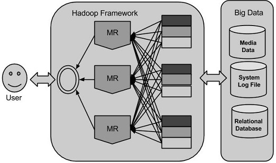
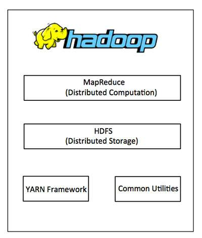
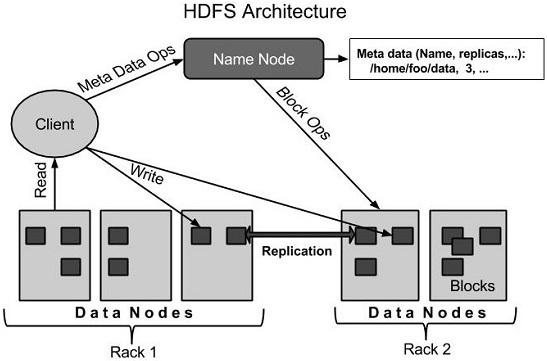
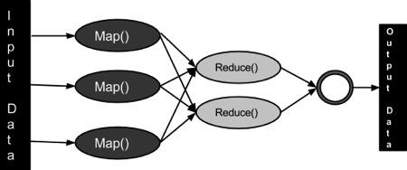

# Hadoop
## 简介


### MapReduce
- MapReduce 是一种编程模型
### Hadoop 分布式文件系统
- Hadoop Common :  Java类库
- Hadoop YARN :  这是作业调度和集群资源管理的框架.


## 安装
(官网)[http://hadoop.apache.org/]下载Hadoop,本文使用版本:hadoop-2.10.0
- 下载hadoop
```shell script
wget http://mirror.bit.edu.cn/apache/hadoop/common/hadoop-2.10.0/hadoop-2.10.0.tar.gz
tar -zxvf hadoop-2.10.0.tar.gz
```
- 修改环境变量
```shell script
> vim .profile

export HADOOP_HOME=/home/huifer/hadoop-2.10.0
export HADOOP_CONF_DIR=/home/huifer/hadoop-2.10.0/etc/hadoop
export HADOOP_MAPRED_HOME=/home/huifer/hadoop-2.10.0
export HADOOP_COMMON_HOME=/home/huifer/hadoop-2.10.0
export HADOOP_HDFS_HOME=/home/huifer/hadoop-2.10.0
export PATH=$PATH:$HADOOP_HOME/bin
source .profile
```
- hadoop version
```shell script
> hadoop version
Hadoop 2.10.0
Subversion ssh://git.corp.linkedin.com:29418/hadoop/hadoop.git -r e2f1f118e465e787d8567dfa6e2f3b72a0eb9194
Compiled by jhung on 2019-10-22T19:10Z
Compiled with protoc 2.5.0
From source with checksum 7b2d8877c5ce8c9a2cca5c7e81aa4026
This command was run using /home/huifer/hadoop-2.10.0/share/hadoop/common/hadoop-common-2.10.0.jar
```
- config
```shell script
huifer@huifer:~/hadoop-2.10.0/etc/hadoop$ ls
capacity-scheduler.xml      hadoop-policy.xml        kms-log4j.properties        ssl-client.xml.example
configuration.xsl           hdfs-site.xml            kms-site.xml                ssl-server.xml.example
container-executor.cfg      httpfs-env.sh            log4j.properties            yarn-env.cmd
core-site.xml               httpfs-log4j.properties  mapred-env.cmd              yarn-env.sh
hadoop-env.cmd              httpfs-signature.secret  mapred-env.sh               yarn-site.xml
hadoop-env.sh               httpfs-site.xml          mapred-queues.xml.template
hadoop-metrics2.properties  kms-acls.xml             mapred-site.xml.template
hadoop-metrics.properties   kms-env.sh               slaves

```
- 修改 `cor-site.xml`
```shell script
vi core-site.xml
```
详细内容如下
```xml
<?xml version="1.0" encoding="UTF-8"?>
 <?xml-stylesheet type="text/xsl" href="configuration.xsl"?>

<configuration>
 <property>
 <name>fs.default.name</name>
 <value>hdfs://localhost:9000</value>
 </property>
</configuration>
```
- 修改 `hdfs-site.xml`
```shell script
vi hdfs-site.xml
```
详细内容如下
```xml
<?xml version="1.0" encoding="UTF-8"?>
<?xml-stylesheet type="text/xsl" href="configuration.xsl"?>
<configuration>
<property>
<name>dfs.replication</name>
<value>1</value>
</property>
<property>
<name>dfs.permission</name>
<value>false</value>
</property>
</configuration>
```
- 修改 `mapred-site.xml`
```shell script
cp mapred-site.xml.template mapred-site.xml
vi mapred-site.xml
```
详细内容如下
```xml

<?xml version="1.0" encoding="UTF-8"?>
<?xml-stylesheet type="text/xsl" href="configuration.xsl"?>
<configuration>
<property>
<name>mapreduce.framework.name</name>
<value>yarn</value>
</property>
</configuration>
```

- 修改 `yarn-site.xml`
```shell script
vi yarn-site.xml

```
详细内容如下
```xml
<?xml version="1.0">
<configuration>
<property>
<name>yarn.nodemanager.aux-services</name>
<value>mapreduce_shuffle</value>
</property>
<property>
<name>yarn.nodemanager.auxservices.mapreduce.shuffle.class</name>
<value>org.apache.hadoop.mapred.ShuffleHandler</value>
</property>
</configuration>

```
- 修改  `hadoop–env.sh` 设置java_home
```shell script
vim hadoop-env.sh
export JAVA_HOME=${JAVA_HOME}
```


- 进入 hadoop 根目录
```shell script
huifer@huifer:~/hadoop-2.10.0$ bin/hadoop namenode -format
```
- 进入 sbin
    - `start-dfs.sh, start-yarn.sh & mr-jobhistory-daemon.sh` 等价`start-all.sh`
```shell script
huifer@huifer:~/hadoop-2.10.0$ cd sbin/
huifer@huifer:~/hadoop-2.10.0/sbin$ ./start-all.sh

```
- 节点管理器
```shell script
huifer@huifer:~/hadoop-2.10.0/sbin$ ./yarn-daemon.sh start nodemanager
```
- 启动历史记录服务器
```shell script
huifer@huifer:~/hadoop-2.10.0/sbin$ ./mr-jobhistory-daemon.sh start historyserver
```

- 访问 http://localhost:50070/dfshealth.html


## HDFS
- HDFS 架构

- HDFS 包括如下几个元素
    1. Namenode
    1. Datanode
    1. Block
### Namenode
职责:
1. 管理文件系统命名空间
1. 规范客户端对文件的访问
1. 文件系统操作

### Datanode
职责:
1. 根据客户的请求, 对数据节点上的文件进行读写操作
1. 对快进行操作(创建,删除等)
### Block
- HDFS 中的最小存储单元称为 Block

### 命令
#### 格式化 HDFS 文件系统
```shell script
hadoop namenode -format
```
#### 启动 HDFS 
```shell script
start-dfs.sh
```
#### 文件列表
```shell script
bin/hadoop fs -ls <args>
```
#### 插入数据
1. 创建目录
```shell script
bin/hadoop fs -mkdir /huifer/input

huifer@huifer:~/hadoop-2.10.0$ bin/hadoop fs -mkdir /hh
huifer@huifer:~/hadoop-2.10.0$ bin/hadoop fs -ls /
Found 3 items
drwxr-xr-x   - huifer supergroup          0 2019-11-27 10:05 /hh
drwxrwx---   - huifer supergroup          0 2019-11-27 09:07 /tmp
drwxr-xr-x   - huifer supergroup          0 2019-11-27 09:58 /user
huifer@huifer:~/hadoop-2.10.0$ bin/hadoop fs -mkdir /hh/input
huifer@huifer:~/hadoop-2.10.0$ 

```
**一层一层创建不要直接创建所有**
1. 传输文件
```shell script
huifer@huifer:~/hadoop-2.10.0$ bin/hadoop fs -put 1.txt /hh/input
huifer@huifer:~/hadoop-2.10.0$ 

```

1. ls 验证文件
```shell script
huifer@huifer:~/hadoop-2.10.0$ bin/hadoop fs -ls /hh/input
Found 1 items
-rw-r--r--   1 huifer supergroup         16 2019-11-27 10:06 /hh/input/1.txt
huifer@huifer:~/hadoop-2.10.0$ 
```

#### 数据检索
- 查看命令 cat
```shell script
huifer@huifer:~/hadoop-2.10.0$ bin/hadoop fs -cat /hh/input/1.txt
1
1
1
1

1
1
1
huifer@huifer:~/hadoop-2.10.0$
```
- 下载命令
```shell script
huifer@huifer:~/hadoop-2.10.0$ bin/hadoop fs -get /hh/input test_dat/

huifer@huifer:~/hadoop-2.10.0/test_dat$ ll
total 12
drwxrwxr-x  3 huifer huifer 4096 Nov 27 10:11 ./
drwxr-xr-x 11 huifer huifer 4096 Nov 27 10:01 ../
drwxrwxr-x  2 huifer huifer 4096 Nov 27 10:11 input/
huifer@huifer:~/hadoop-2.10.0/test_dat$ cd input/
huifer@huifer:~/hadoop-2.10.0/test_dat/input$ ll
total 12
drwxrwxr-x 2 huifer huifer 4096 Nov 27 10:11 ./
drwxrwxr-x 3 huifer huifer 4096 Nov 27 10:11 ../
-rw-r--r-- 1 huifer huifer   16 Nov 27 10:11 1.txt
huifer@huifer:~/hadoop-2.10.0/test_dat/input$ 

```

#### 关闭 hdfs
```shell script
stop-dfs.sh
```

## MapReduce
### MapReduce 是什么(1.0版本)
> MapReduce是一种编程模型，用于大规模数据集（大于1TB）的并行运算。概念"Map（映射）"和"Reduce（归约）"，是它们的主要思想，都是从函数式编程语言里借来的，还有从矢量编程语言里借来的特性。它极大地方便了编程人员在不会分布式并行编程的情况下，将自己的程序运行在分布式系统上。 当前的软件实现是指定一个Map（映射）函数，用来把一组键值对映射成一组新的键值对，指定并发的Reduce（归约）函数，用来保证所有映射的键值对中的每一个共享相同的键组。
> MapReduce 应该拆分理解,1. map(映射) 2. reduce(化简) ,


> **2.0版本使用了 yarm 框架**
### 核心步骤
1. input
1. splitting
1. mapping
1. shuffling
1. reducing
1. output(final result)