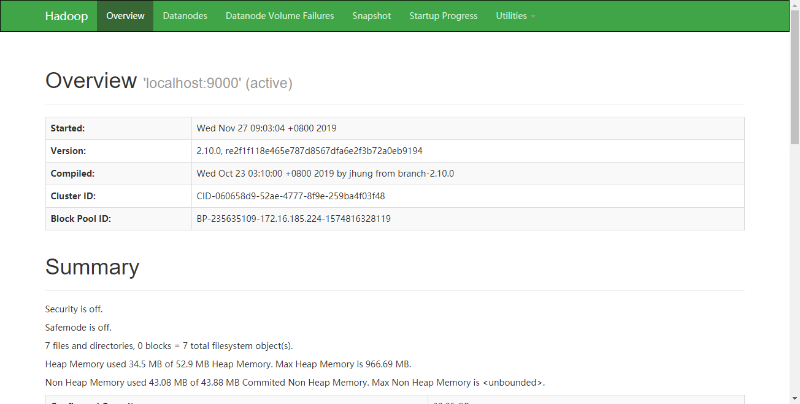

# Hadoop
## 简介
## 安装
(官网)[http://hadoop.apache.org/]下载Hadoop,本文使用版本:hadoop-2.10.0
- 下载hadoop
```shell script
wget http://mirror.bit.edu.cn/apache/hadoop/common/hadoop-2.10.0/hadoop-2.10.0.tar.gz
tar -zxvf hadoop-2.10.0.tar.gz
```
- 修改环境变量
```shell script
> vim .profile

export HADOOP_HOME=/home/huifer/hadoop-2.10.0
export HADOOP_CONF_DIR=/home/huifer/hadoop-2.10.0/etc/hadoop
export HADOOP_MAPRED_HOME=/home/huifer/hadoop-2.10.0
export HADOOP_COMMON_HOME=/home/huifer/hadoop-2.10.0
export HADOOP_HDFS_HOME=/home/huifer/hadoop-2.10.0
export PATH=$PATH:$HADOOP_HOME/bin
source .profile
```
- hadoop version
```shell script
> hadoop version
Hadoop 2.10.0
Subversion ssh://git.corp.linkedin.com:29418/hadoop/hadoop.git -r e2f1f118e465e787d8567dfa6e2f3b72a0eb9194
Compiled by jhung on 2019-10-22T19:10Z
Compiled with protoc 2.5.0
From source with checksum 7b2d8877c5ce8c9a2cca5c7e81aa4026
This command was run using /home/huifer/hadoop-2.10.0/share/hadoop/common/hadoop-common-2.10.0.jar
```
- config
```shell script
huifer@huifer:~/hadoop-2.10.0/etc/hadoop$ ls
capacity-scheduler.xml      hadoop-policy.xml        kms-log4j.properties        ssl-client.xml.example
configuration.xsl           hdfs-site.xml            kms-site.xml                ssl-server.xml.example
container-executor.cfg      httpfs-env.sh            log4j.properties            yarn-env.cmd
core-site.xml               httpfs-log4j.properties  mapred-env.cmd              yarn-env.sh
hadoop-env.cmd              httpfs-signature.secret  mapred-env.sh               yarn-site.xml
hadoop-env.sh               httpfs-site.xml          mapred-queues.xml.template
hadoop-metrics2.properties  kms-acls.xml             mapred-site.xml.template
hadoop-metrics.properties   kms-env.sh               slaves

```
- 修改 `cor-site.xml`
```shell script
vi core-site.xml
```
详细内容如下
```xml
<?xml version="1.0" encoding="UTF-8"?>
 <?xml-stylesheet type="text/xsl" href="configuration.xsl"?>

<configuration>
 <property>
 <name>fs.default.name</name>
 <value>hdfs://localhost:9000</value>
 </property>
</configuration>
```
- 修改 `hdfs-site.xml`
```shell script
vi hdfs-site.xml
```
详细内容如下
```xml
<?xml version="1.0" encoding="UTF-8"?>
<?xml-stylesheet type="text/xsl" href="configuration.xsl"?>
<configuration>
<property>
<name>dfs.replication</name>
<value>1</value>
</property>
<property>
<name>dfs.permission</name>
<value>false</value>
</property>
</configuration>
```
- 修改 `mapred-site.xml`
```shell script
cp mapred-site.xml.template mapred-site.xml
vi mapred-site.xml
```
详细内容如下
```xml

<?xml version="1.0" encoding="UTF-8"?>
<?xml-stylesheet type="text/xsl" href="configuration.xsl"?>
<configuration>
<property>
<name>mapreduce.framework.name</name>
<value>yarn</value>
</property>
</configuration>
```

- 修改 `yarn-site.xml`
```shell script
vi yarn-site.xml

```
详细内容如下
```xml
<?xml version="1.0">
<configuration>
<property>
<name>yarn.nodemanager.aux-services</name>
<value>mapreduce_shuffle</value>
</property>
<property>
<name>yarn.nodemanager.auxservices.mapreduce.shuffle.class</name>
<value>org.apache.hadoop.mapred.ShuffleHandler</value>
</property>
</configuration>

```
- 修改  `hadoop–env.sh` 设置java_home
```shell script
vim hadoop-env.sh
export JAVA_HOME=${JAVA_HOME}
```


- 进入 hadoop 根目录
```shell script
huifer@huifer:~/hadoop-2.10.0$ bin/hadoop namenode -format
```
- 进入 sbin
    - `start-dfs.sh, start-yarn.sh & mr-jobhistory-daemon.sh` 等价`start-all.sh`
```shell script
huifer@huifer:~/hadoop-2.10.0$ cd sbin/
huifer@huifer:~/hadoop-2.10.0/sbin$ ./start-all.sh

```
- 节点管理器
```shell script
huifer@huifer:~/hadoop-2.10.0/sbin$ ./yarn-daemon.sh start nodemanager
```
- 启动历史记录服务器
```shell script
huifer@huifer:~/hadoop-2.10.0/sbin$ ./mr-jobhistory-daemon.sh start historyserver
```

- 访问 http://localhost:50070/dfshealth.html

