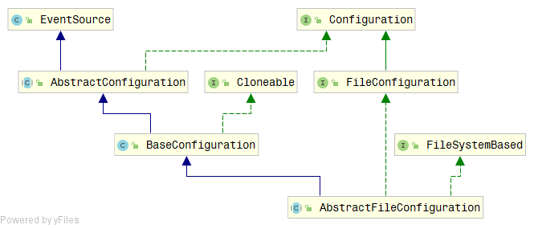
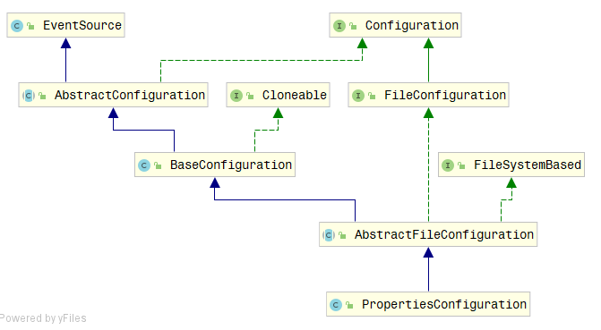
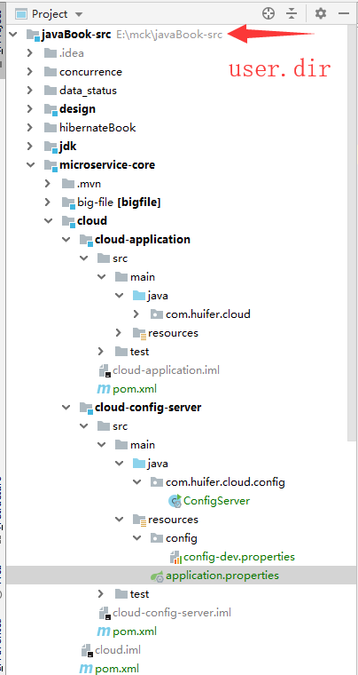
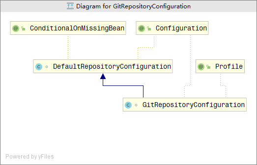
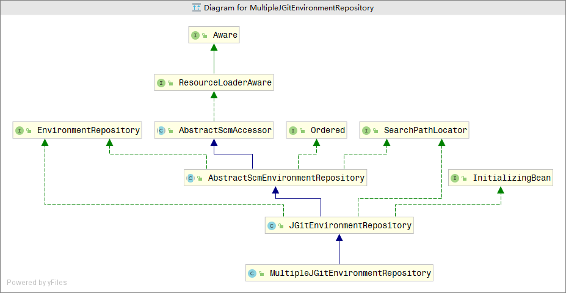

# Spring-Cloud

## 文档

[官方文档](<https://cloud.spring.io/spring-cloud-static/Greenwich.SR1/>)

##  Bootstrap Application Context

- 为了查看bootstrap application context 情况我们使用 `spring-boot-starter-actuator` 进行查看

```xml
    <dependency>
      <groupId>org.springframework.boot</groupId>
      <artifactId>spring-boot-starter-actuator</artifactId>
    </dependency>
```

```properties
spring.application.name=cloud
# web服务端口
server.port=8081
# web 管理端口
management.server.port=9091
# 开放 管理endpoints
management.endpoints.web.exposure.include=*

```

启动一个spring boot 项目

访问<http://localhost:9091/actuator/beans>

```json
{
      "contexts": {
          "application-1":{
              
              ...
              "parentId": "bootstrap"
          },
          "bootstrap":{
               "parentId": null
          }
      }
}
```

- 继承关系
  - bootstrap (父级)
    - application-1(儿子级别)


parent 设置

```java
@SpringBootApplication
@RestController
public class CloudApp {

    @Autowired
    @Qualifier(value = "message")
    private String message;

    public static void main(String[] args) {

        AnnotationConfigApplicationContext context = new AnnotationConfigApplicationContext();
        context.setId("huifer’s context");

        context.registerBean("message", String.class, "this is message");
        context.refresh();

        new SpringApplicationBuilder(CloudApp.class)
                .parent(context)
                .run(args);
    }

    @GetMapping("/index")
    public String index() {
        return message;
    }


}
```


- `org.springframework.boot.builder.SpringApplicationBuilder#parent(org.springframework.context.ConfigurableApplicationContext)`

  ```java
  private ConfigurableApplicationContext context;
  
  public SpringApplicationBuilder parent(ConfigurableApplicationContext parent) {
     this.parent = new SpringApplicationBuilder();
     this.parent.context = parent;
     this.parent.running.set(true);
     return this;
  }
  ```

  - `org.springframework.context.ConfigurableApplicationContext#setParent`

    ```java
    void setParent(@Nullable ApplicationContext parent);
    ```

    
    - `org.springframework.context.support.AbstractApplicationContext#setParent`

      ```java
      @Override
      public void setParent(@Nullable ApplicationContext parent) {
         this.parent = parent;
         if (parent != null) {
            Environment parentEnvironment = parent.getEnvironment();
            if (parentEnvironment instanceof ConfigurableEnvironment) {
               getEnvironment().merge((ConfigurableEnvironment) parentEnvironment);
            }
         }
      }
      ```

## 配置

- `java.util.Properties` 

  - 该类通常获取`String`类型的键值对

  - ```java
    public class Properties extends Hashtable<Object,Object> {}
    ```

    继承`hashtable` 事实上可以存储`object`类型

- `org.apache.commons.configuration.Configuration`

  - `getBigDecimal`
  - `getBigInteger`
  - 它可以做到将文本信息转换成具体的对应类型，提供一个类型转换


- `org.apache.commons.configuration.PropertiesConfiguration`



- `org.apache.commons.configuration.XMLPropertiesConfiguration`



顶层接口都有`org.apache.commons.configuration.Configuration` 补充了转换的功能。


## 配置源

1. http
2. git
3. jdbc
4. file


## spring 配置源

- `org.springframework.core.env.Environment`

  - `org.springframework.core.env.ConfigurableEnvironment`

    - `org.springframework.core.env.MutablePropertySources`

      - `org.springframework.core.env.PropertySource`

        - `org.springframework.core.env.MapPropertySource`

        - `org.springframework.core.env.PropertiesPropertySource`

          


## spring cloud config 

### 服务端

- 服务端依赖

```java
<dependency>
  <groupId>org.springframework.cloud</groupId>
  <artifactId>spring-cloud-config-server</artifactId>
</dependency>
```

- 启动项

  ```java
  @SpringBootApplication
  @EnableConfigServer
  public class ConfigServer {
  
      public static void main(String[] args) {
          SpringApplication.run(ConfigServer.class, args);
      }
  
  }
  ```

- 服务配置项

  ```properties
  spring.application.name=cloud-config-server
  
  
  server.port=9090
  spring.cloud.config.server.git.uri=\
    ${user.dir}/microservice-core/cloud/cloud-config-server/src/main/resources/config
  ```

  - 其他配置

    ```properties
    name=huifer
    ```

  
  - `config-dev.properties`

    - ```properties
      name=huifer
      ```

  - `config-test.properties`

    - ```properties
      type=git
      ```

- 提交配置文件

  - ```
    cd resources\config
    git init 
    git add *.properties
    git add -m "add config"
    ```

- 启动项目 + 访问

  - http://localhost:9090/config/test

  ```json
  // http://localhost:9090/config/test
  
  {
    "name": "config",
    "profiles": [
      "test"
    ],
    "label": null,
    "version": "d4c78fd3d0a04e1722b2198ff0ba0362ff6102e5",
    "state": null,
    "propertySources": [
      {
        "name": "E:\\mck\\javaBook-src/microservice-core/cloud/cloud-config-server/src/main/resources/config/config-test.properties",
        "source": {
          "type": "git"
        }
      }
    ]
  }
  ```

  

  - <http://localhost:9090/config/dev>

    ```json
    // http://localhost:9090/config/dev
    
    {
      "name": "config",
      "profiles": [
        "dev"
      ],
      "label": null,
      "version": "d4c78fd3d0a04e1722b2198ff0ba0362ff6102e5",
      "state": null,
      "propertySources": [
        {
          "name": "E:\\mck\\javaBook-src/microservice-core/cloud/cloud-config-server/src/main/resources/config/config-dev.properties",
          "source": {
            "name": "huifer"
          }
        }
      ]
    }
    ```

- 访问路径规则

  - /{application}/{profile}[/{label}]
  - /{application}-{profile}.yml
  - /{label}/{application}-{profile}.yml
  - /{application}-{profile}.properties
  - /{label}/{application}-{profile}.properties
  - `config-dev.properties`中 `application = config `,` profile = dev `

### 客户端

- 依赖

```xml
<dependency>
  <groupId>org.springframework.cloud</groupId>
  <artifactId>spring-cloud-config-client</artifactId>
</dependency>

<dependency>
  <groupId>org.springframework.boot</groupId>
  <artifactId>spring-boot-starter-web</artifactId>
</dependency>
```

- `application.properties`

  ```properties
  spring.application.name=cloud-config-client
  
  server.port=9091
  ```

- `bootstrap.properties`

  ```properties
  spring.cloud.config.name=config
  spring.cloud.config.profile=dev
  spring.cloud.config.uri=http://localhost:9090/
  spring.cloud.config.label=master
  ```

  - spring.application.name：对应{application}部分
  - spring.cloud.config.profile：对应{profile}部分
  - spring.cloud.config.label：对应git的分支。如果配置中心使用的是本地存储，则该参数无用
  - spring.cloud.config.uri：配置中心的具体地址
  - spring.cloud.config.discovery.service-id：指定配置中心的service-id，便于扩展为高可用配置集群。
  - 必须配置在`bootstrap.properties`中


- 测试

  ```java
  @SpringBootApplication
  @RestController
  public class ConfigClient {
  
  
      @Value("${name}")
      private String message;
  
      public static void main(String[] args) {
          SpringApplication.run(ConfigClient.class, args);
      }
  
      @GetMapping
      public String index() {
          return message;
      }
  }
  ```

  - 访问 <http://localhost:9091/> 返回 `huifer` 和 `config-dev.properties` 中内容相等 。


### `EnableConfigServer` 服务端实现源码

- `org.springframework.cloud.config.server.EnableConfigServer`

    ```java
    @Target({ElementType.TYPE})
    @Retention(RetentionPolicy.RUNTIME)
    @Documented
    @Import({ConfigServerConfiguration.class})
    public @interface EnableConfigServer {
    }
    ```
	- `org.springframework.cloud.config.server.config.ConfigServerConfiguration`
      
        ```java
        @Configuration
        public class ConfigServerConfiguration {
            public ConfigServerConfiguration() {
    }
        
            @Bean
            public ConfigServerConfiguration.Marker enableConfigServerMarker() {
                return new ConfigServerConfiguration.Marker();
    }
        
            class Marker {
                Marker() {
                }
            }
        }
        ```
        
        ```java
        @Configuration
        @ConditionalOnBean(ConfigServerConfiguration.Marker.class)
        @EnableConfigurationProperties(ConfigServerProperties.class)
        @Import({ EnvironmentRepositoryConfiguration.class, CompositeConfiguration.class,
              ResourceRepositoryConfiguration.class, ConfigServerEncryptionConfiguration.class,
              ConfigServerMvcConfiguration.class })
        public class ConfigServerAutoConfiguration {
        
        }
        ```
        
        - `org.springframework.cloud.config.server.config.EnvironmentRepositoryConfiguration`
        
          ```java
          @Configuration
          @EnableConfigurationProperties({ SvnKitEnvironmentProperties.class,
                CredhubEnvironmentProperties.class, JdbcEnvironmentProperties.class,
                NativeEnvironmentProperties.class, VaultEnvironmentProperties.class })
          @Import({ CompositeRepositoryConfiguration.class, JdbcRepositoryConfiguration.class,
                VaultRepositoryConfiguration.class, CredhubConfiguration.class,
                CredhubRepositoryConfiguration.class, SvnRepositoryConfiguration.class,
                NativeRepositoryConfiguration.class, GitRepositoryConfiguration.class,
                DefaultRepositoryConfiguration.class })
          public class EnvironmentRepositoryConfiguration {
          }
          ```
        
          - ```
            GitRepositoryConfiguration
            SvnRepositoryConfiguration
            VaultRepositoryConfiguration
            ...
            ```
        
            - `org.springframework.cloud.config.server.config.GitRepositoryConfiguration`
        
              ```java
              @Configuration
              @Profile("git")
              class GitRepositoryConfiguration extends DefaultRepositoryConfiguration {}
              ```
              继承`DefaultRepositoryConfiguration` 默认使用git进行配置
        
              - `org.springframework.cloud.config.server.config.DefaultRepositoryConfiguration`
              
                ```java
                @Configuration
                @ConditionalOnMissingBean(value = EnvironmentRepository.class, search = SearchStrategy.CURRENT)
                class DefaultRepositoryConfiguration {
                
                   @Bean
                   public MultipleJGitEnvironmentRepository defaultEnvironmentRepository(
                         MultipleJGitEnvironmentRepositoryFactory gitEnvironmentRepositoryFactory,
                         MultipleJGitEnvironmentProperties environmentProperties) throws Exception {
                      return gitEnvironmentRepositoryFactory.build(environmentProperties);
                   }
                
                }
                ```
              
              - `org.springframework.cloud.config.server.environment.MultipleJGitEnvironmentRepository`
              
                - `org.springframework.cloud.config.server.environment.AbstractScmEnvironmentRepository#findOne`
              
                  ```java
                  @Override
                  public synchronized Environment findOne(String application, String profile,
                        String label) {
                      // 创建本地仓储来进行临时操作
                     NativeEnvironmentRepository delegate = new NativeEnvironmentRepository(
                           getEnvironment(), new NativeEnvironmentProperties());
                      // 本地仓库中应用位置
                     Locations locations = getLocations(application, profile, label);
                     delegate.setSearchLocations(locations.getLocations());
                     // 根据仓库来搜索应用相关配置
                      Environment result = delegate.findOne(application, profile, "");
                     result.setVersion(locations.getVersion());
                     result.setLabel(label);
                     return this.cleaner.clean(result, getWorkingDirectory().toURI().toString(),
                           getUri());
                  }
                  ```
              
                  - `getLocations`多种实现
              
                    1. `JGitEnvironmentRepository`
                       1. 根据类图我们选择这个类进行解析
                    2. `MultipleJGitEnvironmentRepository`
                    3. `SvnKitEnvironmentRepository`
              
                    - `org.springframework.cloud.config.server.environment.JGitEnvironmentRepository#getLocations`
              
                      ```java
                      	@Override
                      	public synchronized Locations getLocations(String application, String profile,
                      			String label) {
                      		if (label == null) {
                      			label = this.defaultLabel;
                      		}
                              // 拉取最新版本号
                      		String version = refresh(label);
                              // 返回资源路径
                      		return new Locations(application, profile, label, version,
                      				getSearchLocations(getWorkingDirectory(), application, profile, label));
                      	}
                      ```
              
                      - `org.springframework.cloud.config.server.environment.JGitEnvironmentRepository#refresh`
              
                        ```java
                        public String refresh(String label) {
                        	// 创建一个git客户端	
                            Git git = null;
                        			git = createGitClient();
                            // 是否执行git pull
                        			if (shouldPull(git)) {
                        				FetchResult fetchStatus = fetch(git, label);
                        				if (this.deleteUntrackedBranches && fetchStatus != null) {
                        					deleteUntrackedLocalBranches(fetchStatus.getTrackingRefUpdates(),
                        							git);
                        				}
                        				// checkout after fetch so we can get any new branches, tags, ect.
                                        // 校验查看是否能够全部获取
                        				checkout(git, label);
                        				tryMerge(git, label);
                        			}
                        			else {
                        				// nothing to update so just checkout and merge.
                        				// Merge because remote branch could have been updated before
                        				checkout(git, label);
                        				tryMerge(git, label);
                        			}
                        			// always return what is currently HEAD as the version
                            // 返回当前版本的数据内容
                        			return git.getRepository().findRef("HEAD").getObjectId().getName();
                        		//... 省略异常处理
                        ```
              
                        
              
                  
              
                  
              
                  
              
                  
              
                  
              
                  - `org.springframework.cloud.config.server.environment.EnvironmentRepository`
              
                    ```java
                    public interface EnvironmentRepository {
                    
                       Environment findOne(String application, String profile, String label);
                    
                    }
                    ```
              
                    - 最终读取 `application` `profile` `label`






### 客户端实现源码

配置文件

```pro
spring.cloud.config.name=config
spring.cloud.config.profile=dev
spring.cloud.config.uri=http://localhost:9090/
spring.cloud.config.label=master
```

- D:\dev\JAR\org\springframework\cloud\spring-cloud-config-client\2.1.1.RELEASE\spring-cloud-config-client-2.1.1.RELEASE.jar!\META-INF\spring-configuration-metadata.json 。截取部分内容

  ```json
      {
        "name": "spring.cloud.config.uri",
        "type": "java.lang.String[]",
        "description": "The URI of the remote server (default http:\/\/localhost:8888).",
        "sourceType": "org.springframework.cloud.config.client.ConfigClientProperties",
        "defaultValue": [
          "http:\/\/localhost:8888"
        ]
      },
  ```

  

  - 通过 `ConfigClientProperties`解析

    ```java
    public class ConfigClientProperties {
        public static final String PREFIX = "spring.cloud.config";
        public static final String TOKEN_HEADER = "X-Config-Token";
        public static final String STATE_HEADER = "X-Config-State";
        public static final String AUTHORIZATION = "authorization";
        private boolean enabled = true;
        private String profile = "default";
        @Value("${spring.application.name:application}")
        private String name;
        private String label;
        private String username;
        private String password;
        private String[] uri = new String[]{"http://localhost:8888"};
        private ConfigClientProperties.Discovery discovery = new ConfigClientProperties.Discovery();
        private boolean failFast = false;
        private String token;
        private int requestReadTimeout = 185000;
        private boolean sendState = true;
        private Map<String, String> headers = new HashMap();
    }
    ```


- 装载 `ConfigClientProperties` Bean 给 `org.springframework.cloud.config.client.ConfigServiceBootstrapConfiguration`使用

  ```java
  //
  // Source code recreated from a .class file by IntelliJ IDEA
  // (powered by Fernflower decompiler)
  //
  
  package org.springframework.cloud.config.client;
  
  import org.aspectj.lang.annotation.Aspect;
  import org.springframework.beans.factory.annotation.Autowired;
  import org.springframework.boot.autoconfigure.aop.AopAutoConfiguration;
  import org.springframework.boot.autoconfigure.condition.ConditionalOnClass;
  import org.springframework.boot.autoconfigure.condition.ConditionalOnMissingBean;
  import org.springframework.boot.autoconfigure.condition.ConditionalOnProperty;
  import org.springframework.boot.context.properties.EnableConfigurationProperties;
  import org.springframework.context.annotation.Bean;
  import org.springframework.context.annotation.Configuration;
  import org.springframework.context.annotation.Import;
  import org.springframework.core.env.ConfigurableEnvironment;
  import org.springframework.retry.annotation.EnableRetry;
  import org.springframework.retry.annotation.Retryable;
  import org.springframework.retry.interceptor.RetryInterceptorBuilder;
  import org.springframework.retry.interceptor.RetryOperationsInterceptor;
  
  @Configuration
  @EnableConfigurationProperties
  public class ConfigServiceBootstrapConfiguration {
      @Autowired
      private ConfigurableEnvironment environment;
  
      public ConfigServiceBootstrapConfiguration() {
      }
  
      @Bean
      public ConfigClientProperties configClientProperties() {
          ConfigClientProperties client = new ConfigClientProperties(this.environment);
          return client;
      }
  
      @Bean
      @ConditionalOnMissingBean({ConfigServicePropertySourceLocator.class})
      @ConditionalOnProperty(
          value = {"spring.cloud.config.enabled"},
          matchIfMissing = true
      )
      public ConfigServicePropertySourceLocator configServicePropertySource(ConfigClientProperties properties) {
          ConfigServicePropertySourceLocator locator = new ConfigServicePropertySourceLocator(properties);
          return locator;
      }
  
      @ConditionalOnProperty({"spring.cloud.config.fail-fast"})
      @ConditionalOnClass({Retryable.class, Aspect.class, AopAutoConfiguration.class})
      @Configuration
      @EnableRetry(
          proxyTargetClass = true
      )
      @Import({AopAutoConfiguration.class})
      @EnableConfigurationProperties({RetryProperties.class})
      protected static class RetryConfiguration {
          protected RetryConfiguration() {
          }
  
          @Bean
          @ConditionalOnMissingBean(
              name = {"configServerRetryInterceptor"}
          )
          public RetryOperationsInterceptor configServerRetryInterceptor(RetryProperties properties) {
              return (RetryOperationsInterceptor)RetryInterceptorBuilder.stateless().backOffOptions(properties.getInitialInterval(), properties.getMultiplier(), properties.getMaxInterval()).maxAttempts(properties.getMaxAttempts()).build();
          }
      }
  }
  ```

- 读取配置信息

  - `configClientProperties`

- 远程获取信息

  - `configServicePropertySource`

  ```java
  @Bean
  @ConditionalOnMissingBean(ConfigServicePropertySourceLocator.class)
  @ConditionalOnProperty(value = "spring.cloud.config.enabled", matchIfMissing = true)
  public ConfigServicePropertySourceLocator configServicePropertySource(
        ConfigClientProperties properties) {
     ConfigServicePropertySourceLocator locator = new ConfigServicePropertySourceLocator(
           properties);
     return locator;
  }
  ```

- 获取配置信息类`org.springframework.cloud.config.client.ConfigServicePropertySourceLocator`

  - ```java
    	@Override
    	@Retryable(interceptor = "configServerRetryInterceptor")
    	public org.springframework.core.env.PropertySource<?> locate(
    			org.springframework.core.env.Environment environment) {
    		ConfigClientProperties properties = this.defaultProperties.override(environment);
    		CompositePropertySource composite = new CompositePropertySource("configService");
    			// RestTemplate 用来进行api访问
            RestTemplate restTemplate = this.restTemplate == null
    				? getSecureRestTemplate(properties) : this.restTemplate;
    		Exception error = null;
    		String errorBody = null;
    		try {
                // 获取 application  profile lable 
    			String[] labels = new String[] { "" };
    			if (StringUtils.hasText(properties.getLabel())) {
    				labels = StringUtils
    						.commaDelimitedListToStringArray(properties.getLabel());
    			}
    			String state = ConfigClientStateHolder.getState();
    			// Try all the labels until one works
                // 遍历标签来获取配置信息
    			for (String label : labels) {
    				Environment result = getRemoteEnvironment(restTemplate, properties,
    						label.trim(), state);
    				if (result != null) {
    					log(result);
    
    					if (result.getPropertySources() != null) { // result.getPropertySources()
    																// can be null if using
    																// xml
    						for (PropertySource source : result.getPropertySources()) {
    							@SuppressWarnings("unchecked")
    							Map<String, Object> map = (Map<String, Object>) source
    									.getSource();
    							composite.addPropertySource(
    									new MapPropertySource(source.getName(), map));
    						}
    					}
    
    					if (StringUtils.hasText(result.getState())
    							|| StringUtils.hasText(result.getVersion())) {
                            // 设置客户端状态 以及 版本信息
    						HashMap<String, Object> map = new HashMap<>();
    						putValue(map, "config.client.state", result.getState());
    						putValue(map, "config.client.version", result.getVersion());
    						composite.addFirstPropertySource(
    								new MapPropertySource("configClient", map));
    					}
    					return composite;
    				}
    			}
    		}
    		catch (HttpServerErrorException e) {
    			error = e;
    			if (MediaType.APPLICATION_JSON
    					.includes(e.getResponseHeaders().getContentType())) {
    				errorBody = e.getResponseBodyAsString();
    			}
    		}
    		catch (Exception e) {
    			error = e;
    		}
    		if (properties.isFailFast()) {
    			throw new IllegalStateException(
    					"Could not locate PropertySource and the fail fast property is set, failing"
    							+ (errorBody == null ? "" : ": " + errorBody),
    					error);
    		}
    		logger.warn("Could not locate PropertySource: " + (errorBody == null
    				? error == null ? "label not found" : error.getMessage() : errorBody));
    		return null;
    
    	}
    ```