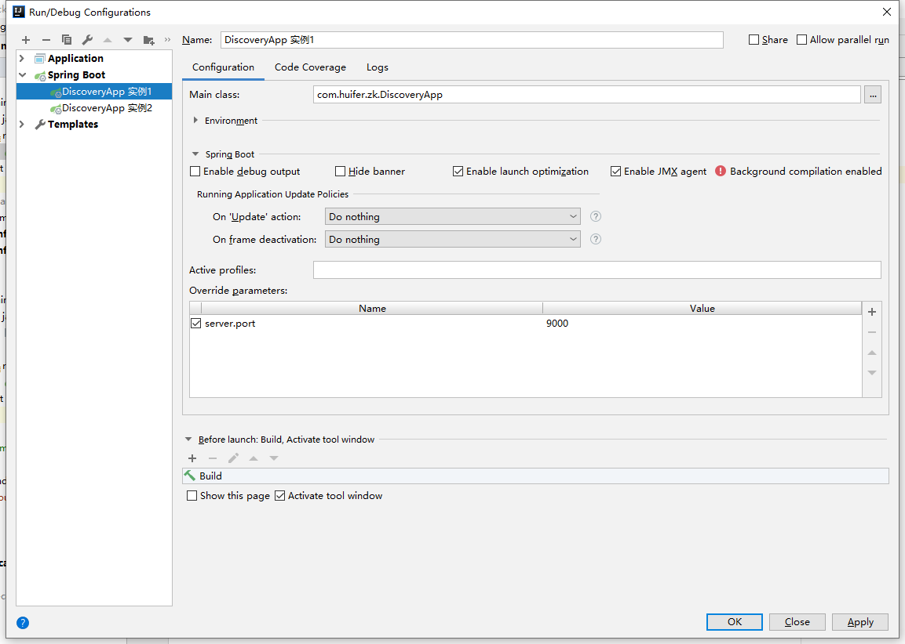
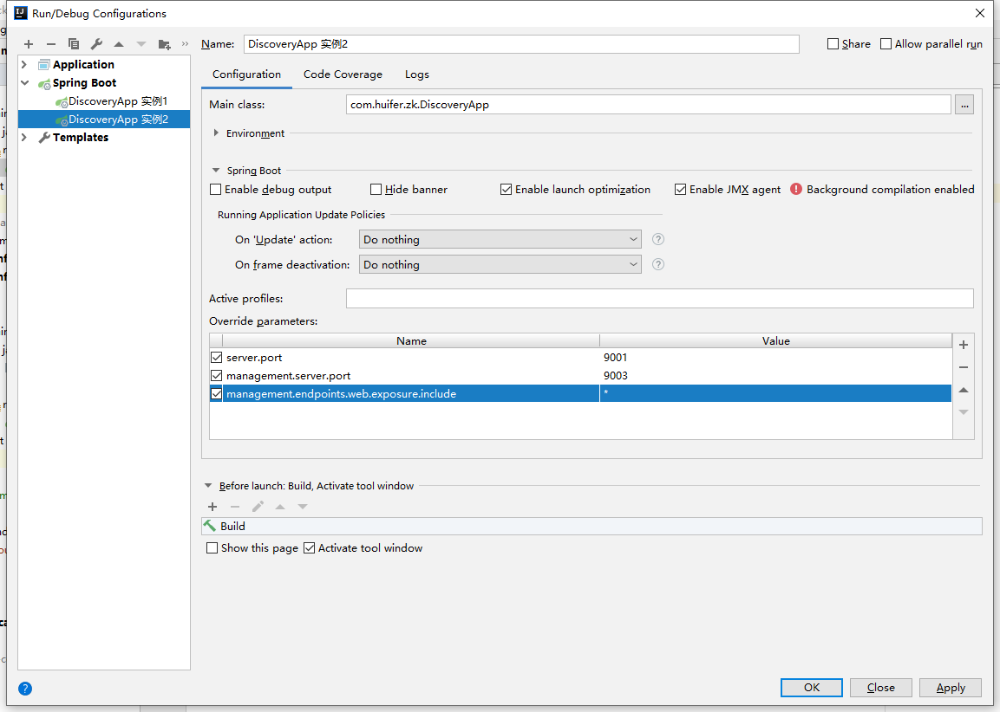
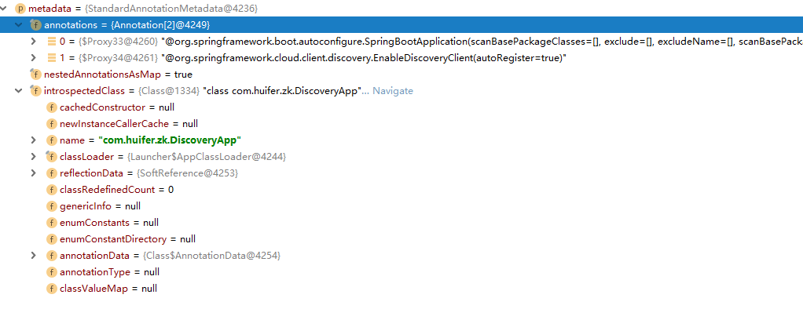
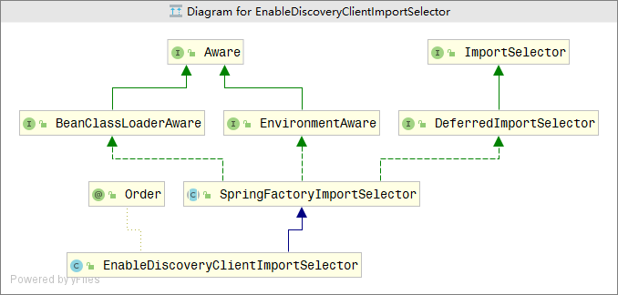
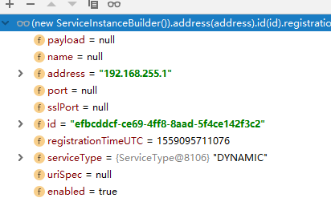
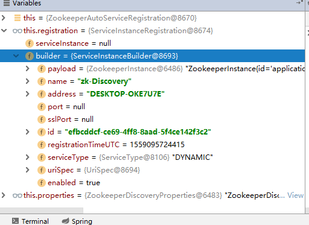
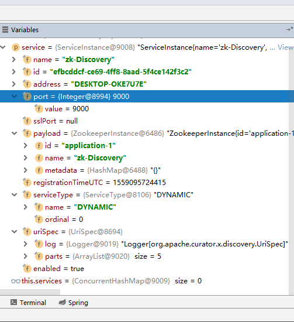
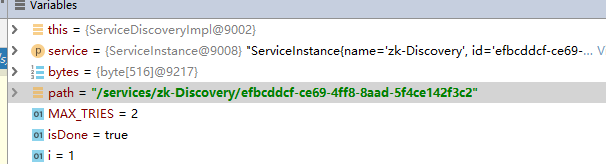
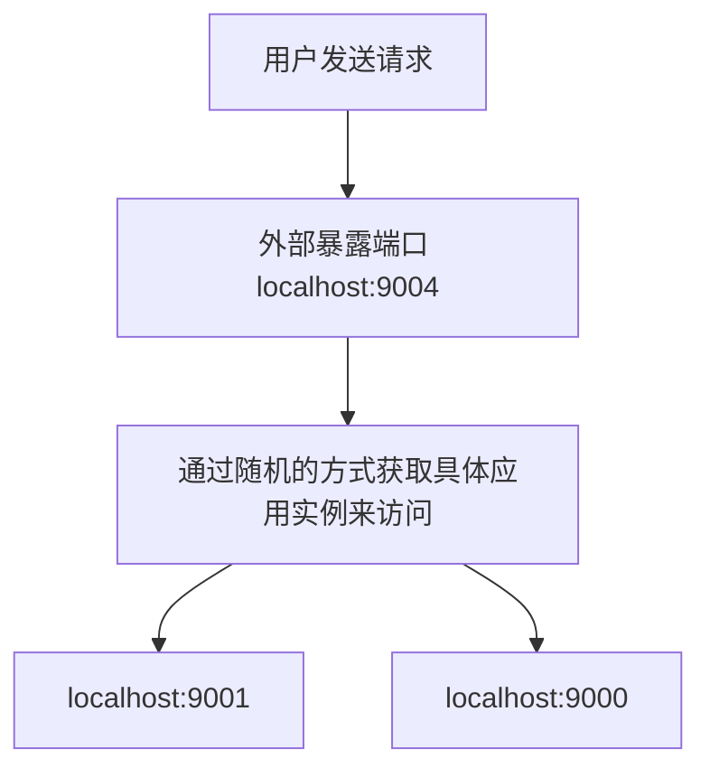

# Spring-Cloud

## 文档

[官方文档](<https://cloud.spring.io/spring-cloud-static/Greenwich.SR1/>)

##  Bootstrap Application Context

- 为了查看bootstrap application context 情况我们使用 `spring-boot-starter-actuator` 进行查看

```xml
    <dependency>
      <groupId>org.springframework.boot</groupId>
      <artifactId>spring-boot-starter-actuator</artifactId>
    </dependency>
```

```properties
spring.application.name=cloud
# web服务端口
server.port=8081
# web 管理端口
management.server.port=9091
# 开放 管理endpoints
management.endpoints.web.exposure.include=*

```

启动一个spring boot 项目

访问<http://localhost:9091/actuator/beans>

```json
{
      "contexts": {
          "application-1":{
              
              ...
              "parentId": "bootstrap"
          },
          "bootstrap":{
               "parentId": null
          }
      }
}
```

- 继承关系
  - bootstrap (父级)
    - application-1(儿子级别)


parent 设置

```java
@SpringBootApplication
@RestController
public class CloudApp {

    @Autowired
    @Qualifier(value = "message")
    private String message;

    public static void main(String[] args) {

        AnnotationConfigApplicationContext context = new AnnotationConfigApplicationContext();
        context.setId("huifer’s context");

        context.registerBean("message", String.class, "this is message");
        context.refresh();

        new SpringApplicationBuilder(CloudApp.class)
                .parent(context)
                .run(args);
    }

    @GetMapping("/index")
    public String index() {
        return message;
    }


}
```


- `org.springframework.boot.builder.SpringApplicationBuilder#parent(org.springframework.context.ConfigurableApplicationContext)`

  ```java
  private ConfigurableApplicationContext context;
  
  public SpringApplicationBuilder parent(ConfigurableApplicationContext parent) {
     this.parent = new SpringApplicationBuilder();
     this.parent.context = parent;
     this.parent.running.set(true);
     return this;
  }
  ```

  - `org.springframework.context.ConfigurableApplicationContext#setParent`

    ```java
    void setParent(@Nullable ApplicationContext parent);
    ```

    
    - `org.springframework.context.support.AbstractApplicationContext#setParent `方法具体代码如下

      
      
      ```java
      @Override
      public void setParent(@Nullable ApplicationContext parent) {
         this.parent = parent;
         if (parent != null) {
            Environment parentEnvironment = parent.getEnvironment();
            if (parentEnvironment instanceof ConfigurableEnvironment) {
               getEnvironment().merge((ConfigurableEnvironment) parentEnvironment);
            }
         }
      }
      ```

## 配置

- `java.util.Properties` 

  - 该类通常获取`String`类型的键值对

  - ```java
    public class Properties extends Hashtable<Object,Object> {}
    ```

    继承`hashtable` 事实上可以存储`object`类型

- `org.apache.commons.configuration.Configuration`

  - `getBigDecimal`
  - `getBigInteger`
  - 它可以做到将文本信息转换成具体的对应类型，提供一个类型转换


- `org.apache.commons.configuration.PropertiesConfiguration`


- `org.apache.commons.configuration.XMLPropertiesConfiguration`


顶层接口都有`org.apache.commons.configuration.Configuration` 补充了转换的功能。


## 配置源

1. http
2. git
3. jdbc
4. file


## spring 配置源

- `org.springframework.core.env.Environment`

  - `org.springframework.core.env.ConfigurableEnvironment`

    - `org.springframework.core.env.MutablePropertySources`

      - `org.springframework.core.env.PropertySource`

        - `org.springframework.core.env.MapPropertySource`

        - `org.springframework.core.env.PropertiesPropertySource`

     


## spring cloud config 

### 服务端

- 服务端依赖

```xml
<dependency>
  <groupId>org.springframework.cloud</groupId>
  <artifactId>spring-cloud-config-server</artifactId>
</dependency>
```

- 启动项

  ```java
  @SpringBootApplication
  @EnableConfigServer
  public class ConfigServer {
  
      public static void main(String[] args) {
          SpringApplication.run(ConfigServer.class, args);
      }
  
  }
  ```

- 服务配置项

  ```properties
  spring.application.name=cloud-config-server
  
  
  server.port=9090
  spring.cloud.config.server.git.uri=\
    ${user.dir}/microservice-core/cloud/cloud-config-server/src/main/resources/config
  ```

  - 其他配置

    ```properties
    name=huifer
    ```

  
  - `config-dev.properties`

    - ```properties
      name=huifer
      ```

  - `config-test.properties`

    - ```properties
      type=git
      ```

- 提交配置文件

  - ```
    cd resources\config
    git init 
    git add *.properties
    git add -m "add config"
    ```

- 启动项目 + 访问

  - http://localhost:9090/config/test

  ```json
  // http://localhost:9090/config/test
  
  {
    "name": "config",
    "profiles": [
      "test"
    ],
    "label": null,
    "version": "d4c78fd3d0a04e1722b2198ff0ba0362ff6102e5",
    "state": null,
    "propertySources": [
      {
        "name": "E:\\mck\\javaBook-src/microservice-core/cloud/cloud-config-server/src/main/resources/config/config-test.properties",
        "source": {
          "type": "git"
        }
      }
    ]
  }
  ```

  

  - <http://localhost:9090/config/dev>

    ```json
    // http://localhost:9090/config/dev
    
    {
      "name": "config",
      "profiles": [
        "dev"
      ],
      "label": null,
      "version": "d4c78fd3d0a04e1722b2198ff0ba0362ff6102e5",
      "state": null,
      "propertySources": [
        {
          "name": "E:\\mck\\javaBook-src/microservice-core/cloud/cloud-config-server/src/main/resources/config/config-dev.properties",
          "source": {
            "name": "huifer"
          }
        }
      ]
    }
    ```

- 访问路径规则

  - /{application}/{profile}[/{label}]
  - /{application}-{profile}.yml
  - /{label}/{application}-{profile}.yml
  - /{application}-{profile}.properties
  - /{label}/{application}-{profile}.properties
  - `config-dev.properties`中 `application = config `,` profile = dev `

### 客户端

- 依赖

```xml
<dependency>
  <groupId>org.springframework.cloud</groupId>
  <artifactId>spring-cloud-config-client</artifactId>
</dependency>

<dependency>
  <groupId>org.springframework.boot</groupId>
  <artifactId>spring-boot-starter-web</artifactId>
</dependency>
```

- `application.properties`

  ```properties
  spring.application.name=cloud-config-client
  
  server.port=9091
  ```

- `bootstrap.properties`

  ```properties
  spring.cloud.config.name=config
  spring.cloud.config.profile=dev
  spring.cloud.config.uri=http://localhost:9090/
  spring.cloud.config.label=master
  ```

  - spring.application.name：对应{application}部分
  - spring.cloud.config.profile：对应{profile}部分
  - spring.cloud.config.label：对应git的分支。如果配置中心使用的是本地存储，则该参数无用
  - spring.cloud.config.uri：配置中心的具体地址
  - spring.cloud.config.discovery.service-id：指定配置中心的service-id，便于扩展为高可用配置集群。
  - 必须配置在`bootstrap.properties`中


- 测试

  ```java
  @SpringBootApplication
  @RestController
  public class ConfigClient {
  
  
      @Value("${name}")
      private String message;
  
      public static void main(String[] args) {
          SpringApplication.run(ConfigClient.class, args);
      }
  
      @GetMapping
      public String index() {
          return message;
      }
  }
  ```

  - 访问 <http://localhost:9091/> 返回 `huifer` 和 `config-dev.properties` 中内容相等 。


### `EnableConfigServer` 服务端实现源码

- `org.springframework.cloud.config.server.EnableConfigServer`

    ```java
    @Target({ElementType.TYPE})
    @Retention(RetentionPolicy.RUNTIME)
    @Documented
    @Import({ConfigServerConfiguration.class})
    public @interface EnableConfigServer {
    }
    ```
	- `org.springframework.cloud.config.server.config.ConfigServerConfiguration`
      
        ```java
        @Configuration
        public class ConfigServerConfiguration {
            public ConfigServerConfiguration() {
          }
        
            @Bean
            public ConfigServerConfiguration.Marker enableConfigServerMarker() {
                return new ConfigServerConfiguration.Marker();
          }
        
            class Marker {
                Marker() {
                }
            }
        }
    
        @Configuration
        @ConditionalOnBean(ConfigServerConfiguration.Marker.class)
        @EnableConfigurationProperties(ConfigServerProperties.class)
        @Import({ EnvironmentRepositoryConfiguration.class, CompositeConfiguration.class,
              ResourceRepositoryConfiguration.class, ConfigServerEncryptionConfiguration.class,
              ConfigServerMvcConfiguration.class })
        public class ConfigServerAutoConfiguration {
        
        }
        ```
        
        - `org.springframework.cloud.config.server.config.EnvironmentRepositoryConfiguration`
        
          ```java
          @Configuration
          @EnableConfigurationProperties({ SvnKitEnvironmentProperties.class,
                CredhubEnvironmentProperties.class, JdbcEnvironmentProperties.class,
                NativeEnvironmentProperties.class, VaultEnvironmentProperties.class })
          @Import({ CompositeRepositoryConfiguration.class, JdbcRepositoryConfiguration.class,
                VaultRepositoryConfiguration.class, CredhubConfiguration.class,
                CredhubRepositoryConfiguration.class, SvnRepositoryConfiguration.class,
                NativeRepositoryConfiguration.class, GitRepositoryConfiguration.class,
                DefaultRepositoryConfiguration.class })
          public class EnvironmentRepositoryConfiguration {
          }
          ```
        
            1. GitRepositoryConfiguration
            2. SvnRepositoryConfiguration
            3. VaultRepositoryConfiguration
          
            - `org.springframework.cloud.config.server.config.GitRepositoryConfiguration`
            
              ```java
              @Configuration
              @Profile("git")
              class GitRepositoryConfiguration extends DefaultRepositoryConfiguration {}
              ```
    
              继承`DefaultRepositoryConfiguration` 默认使用git进行配置
          
    
 - org.springframework.cloud.config.server.config.DefaultRepositoryConfiguration
              
```java
@Configuration
@ConditionalOnMissingBean(value = EnvironmentRepository.class, search = SearchStrategy.CURRENT)
class DefaultRepositoryConfiguration {

   @Bean
   public MultipleJGitEnvironmentRepository defaultEnvironmentRepository(
         MultipleJGitEnvironmentRepositoryFactory gitEnvironmentRepositoryFactory,
         MultipleJGitEnvironmentProperties environmentProperties) throws Exception {
      return gitEnvironmentRepositoryFactory.build(environmentProperties);
   }

}
```

- `org.springframework.cloud.config.server.environment.MultipleJGitEnvironmentRepository`
              
  - `org.springframework.cloud.config.server.environment.AbstractScmEnvironmentRepository#findOne`
              
    ```java
    @Override
    public synchronized Environment findOne(String application, String profile,
          String label) {
        // 创建本地仓储来进行临时操作
       NativeEnvironmentRepository delegate = new NativeEnvironmentRepository(
             getEnvironment(), new NativeEnvironmentProperties());
        // 本地仓库中应用位置
       Locations locations = getLocations(application, profile, label);
       delegate.setSearchLocations(locations.getLocations());
       // 根据仓库来搜索应用相关配置
        Environment result = delegate.findOne(application, profile, "");
       result.setVersion(locations.getVersion());
       result.setLabel(label);
       return this.cleaner.clean(result, getWorkingDirectory().toURI().toString(),
             getUri());
    }
    ```
    
    - `getLocations`多种实现
              
        1. `JGitEnvironmentRepository`
           1. 根据类图我们选择这个类进行解析
        2. `MultipleJGitEnvironmentRepository`
        3. `SvnKitEnvironmentRepository`
           
        - `org.springframework.cloud.config.server.environment.JGitEnvironmentRepository#getLocations`
              
          ```java
            @Override
            public synchronized Locations getLocations(String application, String profile,
                String label) {
              if (label == null) {
                label = this.defaultLabel;
              }
                  // 拉取最新版本号
              String version = refresh(label);
                  // 返回资源路径
              return new Locations(application, profile, label, version,
                  getSearchLocations(getWorkingDirectory(), application, profile, label));
            }
          ```
    
  - `org.springframework.cloud.config.server.environment.JGitEnvironmentRepository#refresh`

    ```java
    public String refresh(String label) {
      // 创建一个git客户端	
        Git git = null;
          git = createGitClient();
        // 是否执行git pull
          if (shouldPull(git)) {
            FetchResult fetchStatus = fetch(git, label);
            if (this.deleteUntrackedBranches && fetchStatus != null) {
              deleteUntrackedLocalBranches(fetchStatus.getTrackingRefUpdates(),
                  git);
            }
            // checkout after fetch so we can get any new branches, tags, ect.
                    // 校验查看是否能够全部获取
            checkout(git, label);
            tryMerge(git, label);
          }
          else {
            // nothing to update so just checkout and merge.
            // Merge because remote branch could have been updated before
            checkout(git, label);
            tryMerge(git, label);
          }
          // always return what is currently HEAD as the version
        // 返回当前版本的数据内容
          return git.getRepository().findRef("HEAD").getObjectId().getName();
        //... 省略异常处理
    ```
    
    
    ​          
    ​              
  
- `org.springframework.cloud.config.server.environment.EnvironmentRepository`

  ```java
  public interface EnvironmentRepository {
  
     Environment findOne(String application, String profile, String label);
  
  }
  ```
  
- 最终读取 `application` `profile` `label`


### 客户端实现源码

配置文件

```pro
spring.cloud.config.name=config
spring.cloud.config.profile=dev
spring.cloud.config.uri=http://localhost:9090/
spring.cloud.config.label=master
```

- D:\dev\JAR\org\springframework\cloud\spring-cloud-config-client\2.1.1.RELEASE\spring-cloud-config-client-2.1.1.RELEASE.jar!\META-INF\spring-configuration-metadata.json 。截取部分内容

  ```json
      {
        "name": "spring.cloud.config.uri",
        "type": "java.lang.String[]",
        "description": "The URI of the remote server (default http:\/\/localhost:8888).",
        "sourceType": "org.springframework.cloud.config.client.ConfigClientProperties",
        "defaultValue": [
          "http:\/\/localhost:8888"
        ]
      },
  ```

  

  - 通过 `ConfigClientProperties`解析

    ```java
    public class ConfigClientProperties {
        public static final String PREFIX = "spring.cloud.config";
        public static final String TOKEN_HEADER = "X-Config-Token";
        public static final String STATE_HEADER = "X-Config-State";
        public static final String AUTHORIZATION = "authorization";
        private boolean enabled = true;
        private String profile = "default";
        @Value("${spring.application.name:application}")
        private String name;
        private String label;
        private String username;
        private String password;
        private String[] uri = new String[]{"http://localhost:8888"};
        private ConfigClientProperties.Discovery discovery = new ConfigClientProperties.Discovery();
        private boolean failFast = false;
        private String token;
        private int requestReadTimeout = 185000;
        private boolean sendState = true;
        private Map<String, String> headers = new HashMap();
    }
    ```


- 装载 `ConfigClientProperties` Bean 给 `org.springframework.cloud.config.client.ConfigServiceBootstrapConfiguration`使用

  ```java
  //
  // Source code recreated from a .class file by IntelliJ IDEA
  // (powered by Fernflower decompiler)
  //
  
  package org.springframework.cloud.config.client;
  
  import org.aspectj.lang.annotation.Aspect;
  import org.springframework.beans.factory.annotation.Autowired;
  import org.springframework.boot.autoconfigure.aop.AopAutoConfiguration;
  import org.springframework.boot.autoconfigure.condition.ConditionalOnClass;
  import org.springframework.boot.autoconfigure.condition.ConditionalOnMissingBean;
  import org.springframework.boot.autoconfigure.condition.ConditionalOnProperty;
  import org.springframework.boot.context.properties.EnableConfigurationProperties;
  import org.springframework.context.annotation.Bean;
  import org.springframework.context.annotation.Configuration;
  import org.springframework.context.annotation.Import;
  import org.springframework.core.env.ConfigurableEnvironment;
  import org.springframework.retry.annotation.EnableRetry;
  import org.springframework.retry.annotation.Retryable;
  import org.springframework.retry.interceptor.RetryInterceptorBuilder;
  import org.springframework.retry.interceptor.RetryOperationsInterceptor;
  
  @Configuration
  @EnableConfigurationProperties
  public class ConfigServiceBootstrapConfiguration {
      @Autowired
      private ConfigurableEnvironment environment;
  
      public ConfigServiceBootstrapConfiguration() {
      }
  
      @Bean
      public ConfigClientProperties configClientProperties() {
          ConfigClientProperties client = new ConfigClientProperties(this.environment);
          return client;
      }
  
      @Bean
      @ConditionalOnMissingBean({ConfigServicePropertySourceLocator.class})
      @ConditionalOnProperty(
          value = {"spring.cloud.config.enabled"},
          matchIfMissing = true
      )
      public ConfigServicePropertySourceLocator configServicePropertySource(ConfigClientProperties properties) {
          ConfigServicePropertySourceLocator locator = new ConfigServicePropertySourceLocator(properties);
          return locator;
      }
  
      @ConditionalOnProperty({"spring.cloud.config.fail-fast"})
      @ConditionalOnClass({Retryable.class, Aspect.class, AopAutoConfiguration.class})
      @Configuration
      @EnableRetry(
          proxyTargetClass = true
      )
      @Import({AopAutoConfiguration.class})
      @EnableConfigurationProperties({RetryProperties.class})
      protected static class RetryConfiguration {
          protected RetryConfiguration() {
          }
  
          @Bean
          @ConditionalOnMissingBean(
              name = {"configServerRetryInterceptor"}
          )
          public RetryOperationsInterceptor configServerRetryInterceptor(RetryProperties properties) {
              return (RetryOperationsInterceptor)RetryInterceptorBuilder.stateless().backOffOptions(properties.getInitialInterval(), properties.getMultiplier(), properties.getMaxInterval()).maxAttempts(properties.getMaxAttempts()).build();
          }
      }
  }
  ```

- 读取配置信息

  - `configClientProperties`

- 远程获取信息

  - `configServicePropertySource`

  ```java
  @Bean
  @ConditionalOnMissingBean(ConfigServicePropertySourceLocator.class)
  @ConditionalOnProperty(value = "spring.cloud.config.enabled", matchIfMissing = true)
  public ConfigServicePropertySourceLocator configServicePropertySource(
        ConfigClientProperties properties) {
     ConfigServicePropertySourceLocator locator = new ConfigServicePropertySourceLocator(
           properties);
     return locator;
  }
  ```

- 获取配置信息类`org.springframework.cloud.config.client.ConfigServicePropertySourceLocator`

  - ```java
    	@Override
      	@Retryable(interceptor = "configServerRetryInterceptor")
      	public org.springframework.core.env.PropertySource<?> locate(
      			org.springframework.core.env.Environment environment) {
      		ConfigClientProperties properties = this.defaultProperties.override(environment);
      		CompositePropertySource composite = new CompositePropertySource("configService");
      			// RestTemplate 用来进行api访问
            RestTemplate restTemplate = this.restTemplate == null
      				? getSecureRestTemplate(properties) : this.restTemplate;
      		Exception error = null;
      		String errorBody = null;
      		try {
                // 获取 application  profile lable 
      			String[] labels = new String[] { "" };
      			if (StringUtils.hasText(properties.getLabel())) {
      				labels = StringUtils
      						.commaDelimitedListToStringArray(properties.getLabel());
      			}
      			String state = ConfigClientStateHolder.getState();
      			// Try all the labels until one works
                // 遍历标签来获取配置信息
      			for (String label : labels) {
      				Environment result = getRemoteEnvironment(restTemplate, properties,
      						label.trim(), state);
      				if (result != null) {
      					log(result);
      
      					if (result.getPropertySources() != null) { // result.getPropertySources()
      																// can be null if using
      																// xml
      						for (PropertySource source : result.getPropertySources()) {
      							@SuppressWarnings("unchecked")
      							Map<String, Object> map = (Map<String, Object>) source
      									.getSource();
      							composite.addPropertySource(
      									new MapPropertySource(source.getName(), map));
      						}
      					}
      
      					if (StringUtils.hasText(result.getState())
      							|| StringUtils.hasText(result.getVersion())) {
                            // 设置客户端状态 以及 版本信息
      						HashMap<String, Object> map = new HashMap<>();
      						putValue(map, "config.client.state", result.getState());
      						putValue(map, "config.client.version", result.getVersion());
      						composite.addFirstPropertySource(
      								new MapPropertySource("configClient", map));
      					}
      					return composite;
      				}
      			}
      		}
      		catch (HttpServerErrorException e) {
      			error = e;
      			if (MediaType.APPLICATION_JSON
      					.includes(e.getResponseHeaders().getContentType())) {
      				errorBody = e.getResponseBodyAsString();
      			}
      		}
      		catch (Exception e) {
      			error = e;
      		}
      		if (properties.isFailFast()) {
      			throw new IllegalStateException(
      					"Could not locate PropertySource and the fail fast property is set, failing"
      							+ (errorBody == null ? "" : ": " + errorBody),
      					error);
      		}
      		logger.warn("Could not locate PropertySource: " + (errorBody == null
      				? error == null ? "label not found" : error.getMessage() : errorBody));
      		return null;
      
      	}
    ```


### 自定义配置仓库

经过源码查看 可知 最终的接口为`EnvironmentRepository` 实现一个这个接口 注入到spring 中就可以实现自定义仓库


```java
@Configuration
public class MyEnvironmentRepository {

    @Bean
    public EnvironmentRepository environmentRepository() {
        EnvironmentRepository environmentRepository = new EnvironmentRepository() {
            @Override
            public Environment findOne(String application, String profile, String label) {
                Environment environment = new Environment("default", profile);
                List<PropertySource> propertySources = environment.getPropertySources();

                Map<String, String> source = new HashMap<>();
                source.put("MyEnvironmentRepository", "hello,world");

                PropertySource propertySource = new PropertySource("new_property", source);

                propertySources.add(propertySource);
                return environment;
            }
        };

        return environmentRepository;
    }


}
```

- 访问url

```json
// http://localhost:9090/config/default

{
  "name": "config",
  "profiles": [
    "default"
  ],
  "label": null,
  "version": null,
  "state": null,
  "propertySources": [
    {
      "name": "new_property",
      "source": {
        "MyEnvironmentRepository": "hello,world"
      }
    }
  ]
}
```


### EnvironmentController

- `org.springframework.cloud.config.server.environment.EnvironmentController`

  ```java
  @RequestMapping("/{name}/{profiles}/{label:.*}")
  public Environment labelled(@PathVariable String name, @PathVariable String profiles,
        @PathVariable String label) {
     if (name != null && name.contains("(_)")) {
        // "(_)" is uncommon in a git repo name, but "/" cannot be matched
        // by Spring MVC
        name = name.replace("(_)", "/");
     }
     if (label != null && label.contains("(_)")) {
        // "(_)" is uncommon in a git branch name, but "/" cannot be matched
        // by Spring MVC
        label = label.replace("(_)", "/");
     }
     Environment environment = this.repository.findOne(name, profiles, label);
     if (!this.acceptEmpty
           && (environment == null || environment.getPropertySources().isEmpty())) {
        throw new EnvironmentNotFoundException("Profile Not found");
     }
     return environment;
  }
  ```


## 服务发现

### 简单项目

#### zookeeper linux 

```shell
tar -zxvf zookeeper-3.5.4-beta.tar.gz 
cd zookeeper-3.5.4-beta
cp conf/zoo_sample.cfg zoo.cfg
# 启动
bin/zkServer.sh start
# 关闭
bin/zkServer.sh stop
```


#### zookeeper windows

1. 解压文件

2. 复制 `zoo_sample.cfg` 为 `zoo.cfg`

   ```properties
   #...
   # 修改成具体存放路径
   dataDir=D:/dev/zookeeper-3.5.4-beta/temp/zookeeper
   #...
   ```

3. bin 目录下zkServer.cmd启动


- 依赖配置

```xml
    <dependency>
      <groupId>org.springframework.cloud</groupId>
      <artifactId>spring-cloud-starter-zookeeper-discovery</artifactId>
    </dependency>
```

- 启动器

  ```java
  @SpringBootApplication
  @EnableDiscoveryClient
  public class DiscoveryApp {
  
      public static void main(String[] args) {
          SpringApplication.run(DiscoveryApp.class, args);
      }
  }
  ```

- 启动两个实例

	- 第一个实例端口9000

  
  
  - 第二个实例端口9001  


- 具体的zk实例查看

  - `zkCli.cmd`
  - `ls /serverices/{spring.application.name}/{service_id}`
  - 

  - 通过命令行查看结果可以得知存在 `zk-Discovery` + `[1fd448a2-1a20-493a-bc47-cecef807cb5b, eab7fb85-a5a1-472d-92cf-a3f3482b0b75]` 两个节点

  

- `1fd448a2-1a20-493a-bc47-cecef807cb5b`

  `get /serverices/{spring.application.name}/{service_id}`

  ```json
  {"name":"zk-Discovery","id":"1fd448a2-1a20-493a-bc47-cecef807cb5b","address":"DESKTOP-OKE7U7E","port":9000,"sslPort":null,"payload":{"@class":"org.springframework.cloud.zookeeper.discovery.ZookeeperInstance","id":"application-1","name":"zk-Discovery","metadata":{}},"registrationTimeUTC":1559091492114,"serviceType":"DYNAMIC","uriSpec":{"parts":[{"value":"scheme","variable":true},{"value":"://","variable":false},{"value":"address","variable":true},{"value":":","variable":false},{"value":"port","variable":true}]}}
  ```

  

- `eab7fb85-a5a1-472d-92cf-a3f3482b0b75`

  ```json
  [zk: localhost:2181(CONNECTED) 6] get /services/zk-Discovery/eab7fb85-a5a1-472d-92cf-a3f3482b0b75
  {"name":"zk-Discovery","id":"eab7fb85-a5a1-472d-92cf-a3f3482b0b75","address":"DESKTOP-OKE7U7E","port":9001,"sslPort":null,"payload":{"@class":"org.springframework.cloud.zookeeper.discovery.ZookeeperInstance","id":"application-1","name":"zk-Discovery","metadata":{}},"registrationTimeUTC":1559091501167,"serviceType":"DYNAMIC","uriSpec":{"parts":[{"value":"scheme","variable":true},{"value":"://","variable":false},{"value":"address","variable":true},{"value":":","variable":false},{"value":"port","variable":true}]}}
  ```

  


- 在第二个实例中 启动了 actuator 

  <http://localhost:9003/actuator/env>

```json
{
	"activeProfiles": [

	],
	"propertySources": [{
		"name": "server.ports",
		"properties": {
			"local.server.port": {
				"value": 9001
			},
			"local.management.port": {
				"value": 9003
			}
		}
	}]

}
```

### 获取所有服务

```java
package com.huifer.zk.controller;

import java.util.List;
import java.util.stream.Collectors;
import org.springframework.beans.factory.annotation.Autowired;
import org.springframework.beans.factory.annotation.Value;
import org.springframework.cloud.client.discovery.DiscoveryClient;
import org.springframework.web.bind.annotation.GetMapping;
import org.springframework.web.bind.annotation.RestController;

/**
 * <p>Title : ServiceController </p>
 * <p>Description : </p>
 *
 * @author huifer
 * @date 2019-05-29
 */
@RestController
public class ServiceController {

    @Autowired
    private DiscoveryClient discoveryClient;

    @Value("${spring.application.name}")
    private String applicationName;

    /**
     * 获取所有的服务
     */
    @GetMapping("/services")
    public List<String> getAllServices() {
        return discoveryClient.getServices();
    }

    /**
     * 获取服务实例
     */
    @GetMapping("/services/instances")
    public List<String> getAllServiceInstances() {
        return discoveryClient.getInstances(applicationName).stream().map(
                serviceInstance -> {
                    return serviceInstance.getServiceId() + "-" + serviceInstance.getHost() + ":"
                            + serviceInstance.getPort();
                }
        ).collect(Collectors.toList());
    }


}

```


### 源码阅读

#### EnableDiscoveryClient

- `@EnableDiscoveryClient`

    ```java
    @Target(ElementType.TYPE)
    @Retention(RetentionPolicy.RUNTIME)
    @Documented
    @Inherited
    @Import(EnableDiscoveryClientImportSelector.class)
    public @interface EnableDiscoveryClient {
       boolean autoRegister() default true;

    }
    ```
	- `EnableDiscoveryClientImportSelector`
	
	  ```java
	  	@Override
	  	public String[] selectImports(AnnotationMetadata metadata) {
	  		String[] imports = super.selectImports(metadata);
	  
	  		AnnotationAttributes attributes = AnnotationAttributes.fromMap(
	  				metadata.getAnnotationAttributes(getAnnotationClass().getName(), true));
	  
	  		boolean autoRegister = attributes.getBoolean("autoRegister");
	  
	  		if (autoRegister) {
	  			List<String> importsList = new ArrayList<>(Arrays.asList(imports));
	  			importsList.add(
	  					"org.springframework.cloud.client.serviceregistry.AutoServiceRegistrationConfiguration");
	  			imports = importsList.toArray(new String[0]);
	  		}
	  		else {
	  			Environment env = getEnvironment();
	  			if (ConfigurableEnvironment.class.isInstance(env)) {
	  				ConfigurableEnvironment configEnv = (ConfigurableEnvironment) env;
	  				LinkedHashMap<String, Object> map = new LinkedHashMap<>();
	  				map.put("spring.cloud.service-registry.auto-registration.enabled", false);
	  				MapPropertySource propertySource = new MapPropertySource(
	  						"springCloudDiscoveryClient", map);
	  				configEnv.getPropertySources().addLast(propertySource);
	  			}
	  
	  		}
	  
	  		return imports;
	  	}
	  
	  ```
	
	  - 这里的`AnnotationMetadata metadata`可以理解成被`@EnableDiscoveryClient`注解的类
	
	    
	
	    - `String[] imports = super.selectImports(metadata); `进入`oorg.springframework.cloud.commons.util.SpringFactoryImportSelector#selectImports`方法中
	
	      ```java
	      @Override
	      public String[] selectImports(AnnotationMetadata metadata) {
	         if (!isEnabled()) { // 调用org.springframework.cloud.client.discovery.EnableDiscoveryClientImportSelector#isEnabled 
	            return new String[0];
	         }
	         AnnotationAttributes attributes = AnnotationAttributes.fromMap(
	               metadata.getAnnotationAttributes(this.annotationClass.getName(), true));
	      
	         Assert.notNull(attributes, "No " + getSimpleName() + " attributes found. Is "
	               + metadata.getClassName() + " annotated with @" + getSimpleName() + "?");
	      
	         // Find all possible auto configuration classes, filtering duplicates
	         List<String> factories = new ArrayList<>(new LinkedHashSet<>(SpringFactoriesLoader
	               .loadFactoryNames(this.annotationClass, this.beanClassLoader)));
	      
	         if (factories.isEmpty() && !hasDefaultFactory()) {
	            throw new IllegalStateException("Annotation @" + getSimpleName()
	                  + " found, but there are no implementations. Did you forget to include a starter?");
	         }
	      
	         if (factories.size() > 1) {
	            // there should only ever be one DiscoveryClient, but there might be more than
	            // one factory
	            this.log.warn("More than one implementation " + "of @" + getSimpleName()
	                  + " (now relying on @Conditionals to pick one): " + factories);
	         }
	      
	         return factories.toArray(new String[factories.size()]);
	      }
	      ```
	
	      1. 调用 `org.springframework.cloud.client.discovery.EnableDiscoveryClientImportSelector#isEnabled`
	
	         ```java
	         @Override
	         protected boolean isEnabled() {
	            return getEnvironment().getProperty("spring.cloud.discovery.enabled",
	                  Boolean.class, Boolean.TRUE);
	         }
	         ```
	
	         返回`true`
	
	         通过这里的操作来实现一个自动注册的属性值`autoRegister=true`,
	
	    - 回到selectImports方法中
          
            ```
            if (autoRegister) {
            			List<String> importsList = new ArrayList<>(Arrays.asList(imports));
			importsList.add(
            	"org.springframework.cloud.client.serviceregistry.AutoServiceRegistrationConfiguration");
            			imports = importsList.toArray(new String[0]);
						}
            		else {
            			Environment env = getEnvironment();
            			if (ConfigurableEnvironment.class.isInstance(env)) {
            				ConfigurableEnvironment configEnv = (ConfigurableEnvironment) env;
            				LinkedHashMap<String, Object> map = new LinkedHashMap<>();
            				map.put("spring.cloud.service-registry.auto-registration.enabled", false);
            				MapPropertySource propertySource = new MapPropertySource(
            						"springCloudDiscoveryClient", map);
            				configEnv.getPropertySources().addLast(propertySource);
            			}
            
            		}
            ```
            
            
        




#### zookeeper注册

- `ZookeeperAutoServiceRegistrationAutoConfiguration`

  ```java
  @Bean
  @ConditionalOnMissingBean({ZookeeperRegistration.class})
  public ServiceInstanceRegistration serviceInstanceRegistration(ApplicationContext context, ZookeeperDiscoveryProperties properties) {
      String appName = context.getEnvironment().getProperty("spring.application.name", "application");
      String host = properties.getInstanceHost();
      if (!StringUtils.hasText(host)) {
          throw new IllegalStateException("instanceHost must not be empty");
      } else {
          ZookeeperInstance zookeeperInstance = new ZookeeperInstance(context.getId(), appName, properties.getMetadata());
          RegistrationBuilder builder = ServiceInstanceRegistration.builder().address(host).name(appName).payload(zookeeperInstance).uriSpec(properties.getUriSpec());
          if (properties.getInstanceSslPort() != null) {
              builder.sslPort(properties.getInstanceSslPort());
          }
  
          if (properties.getInstanceId() != null) {
              builder.id(properties.getInstanceId());
          }
  
          return builder.build();
      }
  }
  ```

  `RegistrationBuilder builder = ServiceInstanceRegistration.builder().address(host).name(appName).payload(zookeeperInstance).uriSpec(properties.getUriSpec());` 主要内容

  - `org.springframework.cloud.zookeeper.serviceregistry.ServiceInstanceRegistration`

    ```java
    public static ServiceInstanceRegistration.RegistrationBuilder builder() {
        try {
            return new ServiceInstanceRegistration.RegistrationBuilder(ServiceInstance.builder());
        } catch (Exception var1) {
            throw new RuntimeException("Error creating ServiceInstanceBuilder", var1);
        }
    }
    ```

    - `org.apache.curator.x.discovery.ServiceInstance`

      ```java
      public static <T> ServiceInstanceBuilder<T> builder() throws Exception {
          String address = null;
          Collection<InetAddress> ips = ServiceInstanceBuilder.getAllLocalIPs();
          if (ips.size() > 0) {
              address = ((InetAddress)ips.iterator().next()).getHostAddress();
          }
      
          String id = UUID.randomUUID().toString();
          return (new ServiceInstanceBuilder()).address(address).id(id).registrationTimeUTC(System.currentTimeMillis());
      }
      ```

      将端口、ip、服务id获取 创建一个 `ServiceInstanceBuilder`

      ​	

      - 注册 `org.springframework.cloud.zookeeper.serviceregistry.ZookeeperAutoServiceRegistration#register`

        ```java
        protected void register() {
            if (!this.properties.isRegister()) {
                log.debug("Registration disabled.");
            } else {
                if (this.registration.getPort() == 0) {
                    this.registration.setPort(this.getPort().get());
                }
                super.register();
            }
        }
        ```

        

        - `org.springframework.cloud.zookeeper.serviceregistry.ZookeeperServiceRegistry#register`

          ```java
          public void register(ZookeeperRegistration registration) {
              try {
                  this.getServiceDiscovery().registerService(registration.getServiceInstance());
              } catch (Exception var3) {
                  ReflectionUtils.rethrowRuntimeException(var3);
              }
          
          }
          ```

          - `org.apache.curator.x.discovery.details.ServiceDiscoveryImpl#registerService`

            ```java
            public void registerService(ServiceInstance<T> service) throws Exception {
                ServiceDiscoveryImpl.Entry<T> newEntry = new ServiceDiscoveryImpl.Entry(service);
                ServiceDiscoveryImpl.Entry<T> oldEntry = (ServiceDiscoveryImpl.Entry)this.services.putIfAbsent(service.getId(), newEntry);
                ServiceDiscoveryImpl.Entry<T> useEntry = oldEntry != null ? oldEntry : newEntry;
                synchronized(useEntry) {
                    if (useEntry == newEntry) {
                        useEntry.cache = this.makeNodeCache(service);
                    }
            
                    this.internalRegisterService(service);
                }
            }
            ```

            

            - `org.apache.curator.x.discovery.details.ServiceDiscoveryImpl#internalRegisterService`

              ```
              protected void internalRegisterService(ServiceInstance<T> service) throws Exception {
                  byte[] bytes = this.serializer.serialize(service);
                  String path = this.pathForInstance(service.getName(), service.getId());
                  int MAX_TRIES = true;
                  boolean isDone = false;
              
                  for(int i = 0; !isDone && i < 2; ++i) {
                      try {
                          CreateMode mode;
                          switch(service.getServiceType()) {
                          case DYNAMIC:
                              mode = CreateMode.EPHEMERAL;
                              break;
                          case DYNAMIC_SEQUENTIAL:
                              mode = CreateMode.EPHEMERAL_SEQUENTIAL;
                              break;
                          default:
                              mode = CreateMode.PERSISTENT;
                          }
                     ((ACLBackgroundPathAndBytesable)this.client.create().creatingParentContainersIfNeeded().withMode(mode)).forPath(path, bytes);
                          isDone = true;
                      } catch (NodeExistsException var8) {
                          this.client.delete().forPath(path);
                      }
                  }
              
              }
              ```

              - 这部分代码执行完成

                

                

                - 这样就注册成功了

---

## restTemplate & zookeeper 负载均衡？

- 构建一个controller ， 这个服务后续会启动多个实例 端口:`9000`和`9001`

```java
@RestController
public class SayController {

    @GetMapping("/say")
    public String say(@RequestParam String message) {
        return "接收内容 : " + message;
    }
}
```

- 客户端编写 端口 `9004`

  ```properties
  
  # 去那个服务上找
  find.server.name=zk-Discovery
  server.port=9004
  
  ```

  

  ```java
  @RestController
  @EnableScheduling
  public class FindServerController {
  
      /**
       * 用来发送请求
       */
      @Autowired
      private RestTemplate restTemplate;
      /**
       * 服务发现
       */
      @Autowired
      private DiscoveryClient discoveryClient;
  
      /**
       * 查询的服务名称
       */
      @Value("${find.server.name}")
      private String findServerAppName;
      private volatile Set<String> targetUrls = new ConcurrentSkipListSet<>();
  
      /**
       * 创建restTemplate
       */
      @Bean
      public RestTemplate restTemplate() {
          return new RestTemplate();
      }
  
      @GetMapping("/getsay")
      public String getSay(@RequestParam String message) {
          List<String> targetUrls = new ArrayList<>(this.targetUrls);
  
          int index = new Random().nextInt(targetUrls.size());
          String s = targetUrls.get(index);
          System.out.println("当前请求地址 : " + s);
          String forObject = restTemplate.getForObject(s + "/say?message=" + message, String.class);
  
          return forObject;
      }
  
      /**
       * 十秒钟查询一次服务
       */
      @Scheduled(fixedRate = 10 * 1000)
      @Lazy(false)
      public void updateTargetUrls() {
          System.out.println(System.currentTimeMillis() + "当前总共有 " + targetUrls.size() + "个服务被发现");
  
          Set<String> oldTargetUrls = this.targetUrls;
          Set<String> newTargetUrls = new HashSet<>();
          // 获取 http://host:port 路由地址
          newTargetUrls.addAll(
                  discoveryClient.getInstances(findServerAppName).stream().map(
                          serviceInstance -> "http://" + serviceInstance.getHost() + ":"
                                  + serviceInstance
                                  .getPort()
                  ).collect(Collectors.toSet())
          );
  
          this.targetUrls = newTargetUrls;
          System.out.println("跟新后存在" + targetUrls.size() + "个服务");
          targetUrls.forEach(
                  s -> {
                      System.out.println(s);
                  }
          );
          oldTargetUrls.clear();
      }
  
  
  }
  ```

- 启动客户端服务

  ```
  1559116640978当前总共有 0个服务被发现
  2019-05-29 15:57:20.988  INFO 13456 --- [           main] o.s.b.w.embedded.tomcat.TomcatWebServer  : Tomcat started on port(s): 9004 (http) with context path ''
  跟新后存在1个服务
  http://DESKTOP-OKE7U7E:9000
  2019-05-29 15:57:21.096  INFO 13456 --- [           main] com.huifer.zk.ZkRestApp                  : Started ZkRestApp in 2.972 seconds (JVM running for 3.587)
  ​```
  ```

  - 启动2个实例

    ```
    1559116670980当前总共有 1个服务被发现
    跟新后存在2个服务
    http://DESKTOP-OKE7U7E:9001
    http://DESKTOP-OKE7U7E:9000
    ```

    

- 连续访问 `http://localhost:9004/getsay?message=helloworld`

  ```
  当前请求地址 : http://DESKTOP-OKE7U7E:9001
  当前请求地址 : http://DESKTOP-OKE7U7E:9000
  当前请求地址 : http://DESKTOP-OKE7U7E:9000
  当前请求地址 : http://DESKTOP-OKE7U7E:9001
  当前请求地址 : http://DESKTOP-OKE7U7E:9000
  当前请求地址 : http://DESKTOP-OKE7U7E:9000
  当前请求地址 : http://DESKTOP-OKE7U7E:9001
  当前请求地址 : http://DESKTOP-OKE7U7E:9001
  当前请求地址 : http://DESKTOP-OKE7U7E:9001
  当前请求地址 : http://DESKTOP-OKE7U7E:9000
  
  ```

- 可以发现此处的请求地址是一个随机值，符合我们的需求




### 多个应用

```java
@GetMapping("/{service}/getsay")
public String getSayService(
        @PathVariable String service,
        @RequestParam String message) {
    List<String> targetUrls = new ArrayList<>(this.allServerUrls.get(service));

    if (targetUrls.size() == 1) {
        String forObject = restTemplate
                .getForObject(targetUrls.get(0) + "/say?message=" + message, String.class);
        return forObject;

    } else {

        int index = new Random().nextInt(targetUrls.size());
        String s = targetUrls.get(index);
        System.out.println("当前请求地址 : " + s);
        String forObject = restTemplate
                .getForObject(s + "/say?message=" + message, String.class);

        return forObject;
    }
}


@Scheduled(fixedRate = 10 * 1000)
@Lazy(false)
public void updateOtherServer() {

    HashMap<String, Set<String>> oldAllServerUrls = this.allServerUrls;
    HashMap<String, Set<String>> newAllServerUrls = new HashMap<>();

    discoveryClient.getServices().forEach(
            s -> {
                List<ServiceInstance> instances = discoveryClient.getInstances(s);
                Set<String> collect = instances.stream().map(
                        server ->
                                server.isSecure() ? "https://" + server.getHost() + ":" + server
                                        .getPort() :
                                        "http://" + server.getHost() + ":" + server.getPort()

                ).collect(Collectors.toSet());
                newAllServerUrls.put(s, collect);
            }
    );

    this.allServerUrls = newAllServerUrls;
    oldAllServerUrls.clear();
}
```


### ribbon 

```java
@RestController
public class RibbonRestController {


    @Autowired
    @Qualifier(value = "ribbon")
    private RestTemplate restTemplate3;


    @Bean
    @Autowired
    @Qualifier(value = "ribbon") // 固定搜索范围
    public RestTemplate restTemplate3() {
        return new RestTemplate();
    }

    @GetMapping("/lb/{service}/say")
    public String lbSay(@PathVariable String service,
            @RequestParam String message) {
        return restTemplate3
                .getForObject("http://" + service + "/say?message=" + message, String.class);
    }


    
    @Bean
    @Autowired
    public Object f(@Qualifier(value = "ribbon") Collection<RestTemplate> restTemplates,
            ClientHttpRequestInterceptor interceptor) {
        restTemplates.forEach(
                restTemplate -> {
                    restTemplate.setInterceptors(Arrays.asList(interceptor));
                }
        );
        return new Object();
    }


}
```


## 熔断 hystrix

### 简单案例

- 依赖

```xml
    <dependency>
      <groupId>org.springframework.cloud</groupId>
      <artifactId>spring-cloud-starter-netflix-hystrix</artifactId>
    </dependency>
```

- 启动器

  ```java
  @SpringBootApplication
  @EnableHystrix
  public class HystrixApp {
  
      public static void main(String[] args) {
          SpringApplication.run(HystrixApp.class, args);
      }
  
  }
  ```

- controller

  ```java
  @RestController
  public class HystrixController {
  
      private Random random = new Random();
  
      @HystrixCommand(
              fallbackMethod = "errorHystrix",
              commandProperties = {
                      @HystrixProperty(name = "execution.isolation.thread.timeoutInMilliseconds", value = "100"),
              }
      )
      @GetMapping("hystrix")
      public String hystrix() throws Exception {
          int i = random.nextInt(200);
          System.out.println("sleep " + i + "ms");
          Thread.sleep(i);
          return "hello hystrix";
      }
  
      public String errorHystrix() {
          return "error hystrix";
      }
  
  }
  ```

- `@HystrixCommand`简单说明

  - `fallbackMethod` 超时执行方法

  - ```java
    commandProperties = {
            @HystrixProperty(name = "execution.isolation.thread.timeoutInMilliseconds", value = "100"),
    }
    ```

    设置具体等待时间

- **异常情况**

  ```java
  @HystrixCommand(
          fallbackMethod = "errorHystrix2",
          commandProperties = {
                  @HystrixProperty(name = "execution.isolation.thread.timeoutInMilliseconds", value = "100"),
          }
  )
  @GetMapping("hystrix2")
  public String hystrix2(@RequestParam String msg) throws Exception {
      int i = random.nextInt(200);
      System.out.println("sleep " + i + "ms");
      Thread.sleep(i);
      return "hello hystrix";
  }
  public String errorHystrix2() {
      return "error hystrix";
  }
  ```

  访问 <http://localhost:9005/hystrix2?msg=123>出现如下异常

  `com.netflix.hystrix.contrib.javanica.exception.FallbackDefinitionException: fallback method wasn't found: errorHystrix2([class java.lang.String])`

  - 简单来说 `fallbackMethod` 方法的参数需要和 被`@HystrixCommand`标记的参数相等

    ```java
    public String errorHystrix2( String msg) {
        return "error hystrix";
    }
    ```

### 熔断自实现

- 通用方法

  ```java
   private final ExecutorService executorService = Executors.newSingleThreadScheduledExecutor();
      private Random random = new Random();
  
  private String errorMsg(String msg) {
      return "error " + msg;
  }
  
  
  private String resultMsg(String msg) {
      try {
          int i = random.nextInt(200);
          System.out.println("sleep " + i + " ms");
          Thread.sleep(i);
          return "msg = " + msg;
      } catch (Exception e) {
          e.printStackTrace();
          return null;
      }
  }
  ```

#### v1版本

> 思路：通过线程进行一个等待操作，当等待操作时间超过目标值100 进行熔断，使用try catch方式，当出现TimeoutException就熔断，发送熔断信息

- controller

```java
@GetMapping("/v1")
public String v1(@RequestParam String msg) throws Exception {

    Future<String> submit = executorService.submit(
            () -> resultMsg(msg)
    );
    String s;
    try {
        // 强制等待100ms 执行
        s = submit.get(100, TimeUnit.MILLISECONDS);
    } catch (Exception e) {
        s = errorMsg(msg);
    }
    return s;
}
```

#### v2版本

> 思路：使用@RestControllerAdvice 注解获取异常，再返回异常信息

```java
@GetMapping("v2")
public String v2(@RequestParam String msg) throws Exception {

    Future<String> submit = executorService.submit(
        () -> resultMsg(msg)
    );
    String s = submit.get(100, TimeUnit.MILLISECONDS);
    return s;
}

@RestControllerAdvice(assignableTypes = {MyHystrixController.class})
public class TimeoutController {


    @ExceptionHandler
    public void onTimeoutException(TimeoutException timeoutException, Writer writer)
            throws IOException {
        writer.write(s(""));

    }

    private String s(String mse) {
        return "error " + mse;
    }

}
```

#### v3版本

> 思路：aop拦截，将v1版本的内容用aop来做

```java

@GetMapping("v3")
public String v3(@RequestParam String msg)
    throws InterruptedException, ExecutionException, TimeoutException {
    return resultMsg(msg);
}


@Aspect
@Component
public class MyHystrixControllerAspect {

    private final ExecutorService executorService = Executors.newSingleThreadScheduledExecutor();


    @Around(" execution(*  com.huifer.hystrix.controller.MyHystrixController.v3(..)  )  && args(msg)")
    public Object timeout(ProceedingJoinPoint joinPoint, String msg) throws Throwable {

        Future<Object> submit = executorService.submit(() -> {
            Object resout = null;
            try {
                resout = joinPoint.proceed(new String[]{msg});
            } catch (Throwable throwable) {
            }
            return resout;
        });
        String s;
        try {
            s = (String) submit.get(100, TimeUnit.MILLISECONDS);
        } catch (TimeoutException t) {
            s = errorMsg(msg);
        }

        return s;


    }

    private String errorMsg(String msg) {
        return "AOP 熔断 " + msg;
    }


}
```

#### v4版本

> 思路： 模拟一个注解内容
>
> ```java
> @HystrixCommand(
>         fallbackMethod = "errorHystrix2",
>         commandProperties = {
>                 @HystrixProperty(name = "execution.isolation.thread.timeoutInMilliseconds", value = "100"),
>         }
> )
> ```


```java
@Target({ElementType.METHOD})
@Retention(RetentionPolicy.RUNTIME)
@Inherited
@Documented
public @interface Fusing {

    /**
     * 超时时间
     * @return
     */
    int timeout() default 100;

}


    @GetMapping("v4")
    @Fusing(timeout = 200)
    public String v4(@RequestParam String msg) {
        System.out.println("v4 gogogo");
        return resultMsg(msg);
    }


    @Around("execution(*  com.huifer.hystrix.controller.MyHystrixController.v4(..)  ) && args(msg) && @annotation( fusing )")
    public Object versionFour(ProceedingJoinPoint joinPoint, String msg, Fusing fusing)
            throws Throwable {

        int timeout = fusing.timeout();

        Future<Object> submit = executorService.submit(() -> {
            Object resout = null;
            try {
                resout = joinPoint.proceed(new String[]{msg});
            } catch (Throwable throwable) {
            }
            return resout;
        });
        String s;
        try {
            s = (String) submit.get(timeout, TimeUnit.MILLISECONDS);
        } catch (TimeoutException t) {
            s = errorMsg("注解形式 "+msg);
        }

        return s;

    }
```