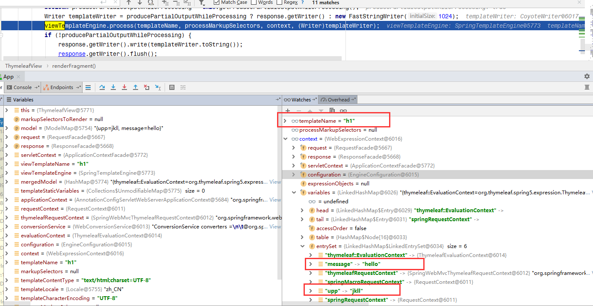
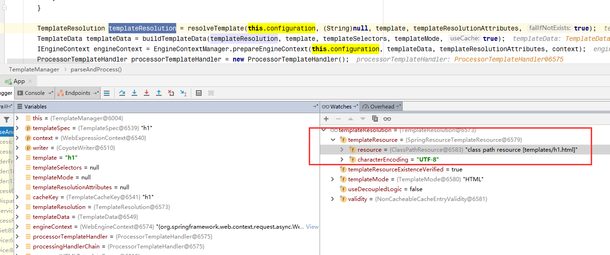
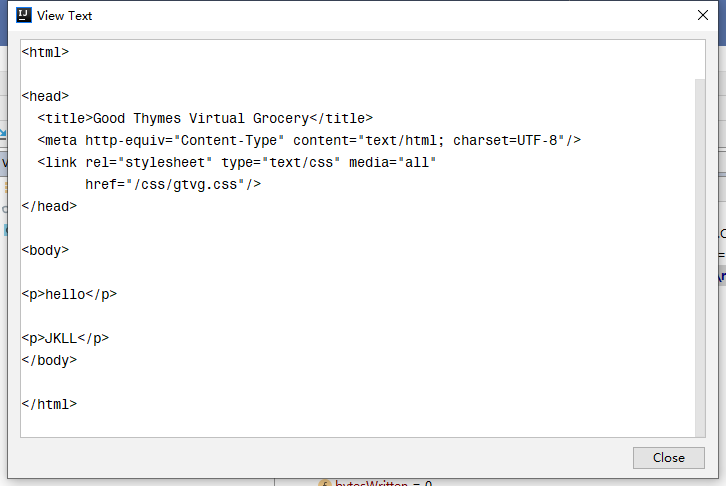
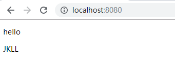

# Spring-mvc

## servlet

### servlet-scope

- PageContext

  - 生命周期
    - 发送JSP页面请求时创建
    - JSP页面响应结束销毁
  - 作用域
    - 单一JSP页面

- Request

  - 生命周期
    - 在发送请求时Request存在，当请求结束Request销毁
  - 作用
    - 负责在请求过程中数据交互
  - 作用域
    - 一个请求
  - Spring中对应
    - `org.springframework.web.context.WebApplicationContext#SCOPE_REQUEST`

- Session

  - 生命周期
    - request.getSession() 调用时，校验是否存在session ， 如果不存在则创建
    - 销毁
      - 不正当销毁：强制关闭服务器
      - session一定量的时间内没有使用，自动进行销毁
      - session.invalidate()手动销毁
  - 作用域
    - 一个会话
  - Spring中对应
    - `org.springframework.web.context.WebApplicationContext#SCOPE_SESSION`

- ServletContext

  - 生命周期
    - web应用加载到容器，此时ServletContext 就是整个web应用
    - 当服务器关闭、web应用从容器中移除，ServletContext被销毁
  - 作用域
    - 整个web应用

  - Spring中对应
    - `org.springframework.web.context.WebApplicationContext#SCOPE_APPLICATION`


## thymeleaf


### 配置

- Properties配置内容

```properties
# THYMELEAF (ThymeleafAutoConfiguration)
spring.thymeleaf.cache=true # Whether to enable template caching.
spring.thymeleaf.check-template=true # Whether to check that the template exists before rendering it.
spring.thymeleaf.check-template-location=true # Whether to check that the templates location exists.
spring.thymeleaf.enabled=true # Whether to enable Thymeleaf view resolution for Web frameworks.
spring.thymeleaf.enable-spring-el-compiler=false # Enable the SpringEL compiler in SpringEL expressions.
spring.thymeleaf.encoding=UTF-8 # Template files encoding.
spring.thymeleaf.excluded-view-names= # Comma-separated list of view names (patterns allowed) that should be excluded from resolution.
spring.thymeleaf.mode=HTML # Template mode to be applied to templates. See also Thymeleaf's TemplateMode enum.
spring.thymeleaf.prefix=classpath:/templates/ # Prefix that gets prepended to view names when building a URL.
spring.thymeleaf.reactive.chunked-mode-view-names= # Comma-separated list of view names (patterns allowed) that should be the only ones executed in CHUNKED mode when a max chunk size is set.
spring.thymeleaf.reactive.full-mode-view-names= # Comma-separated list of view names (patterns allowed) that should be executed in FULL mode even if a max chunk size is set.
spring.thymeleaf.reactive.max-chunk-size=0B # Maximum size of data buffers used for writing to the response.
spring.thymeleaf.reactive.media-types= # Media types supported by the view technology.
spring.thymeleaf.render-hidden-markers-before-checkboxes=false # Whether hidden form inputs acting as markers for checkboxes should be rendered before the checkbox element itself.
spring.thymeleaf.servlet.content-type=text/html # Content-Type value written to HTTP responses.
spring.thymeleaf.servlet.produce-partial-output-while-processing=true # Whether Thymeleaf should start writing partial output as soon as possible or buffer until template processing is finished.
spring.thymeleaf.suffix=.html # Suffix that gets appended to view names when building a URL.
spring.thymeleaf.template-resolver-order= # Order of the template resolver in the chain.
spring.thymeleaf.view-names= # Comma-separated list of view names (patterns allowed) that can be resolved.
```

- `org.springframework.boot.autoconfigure.thymeleaf.ThymeleafProperties` 配置内容的对应类

  ```java
  @ConfigurationProperties(prefix = "spring.thymeleaf")
  public class ThymeleafProperties {
  
     private static final Charset DEFAULT_ENCODING = StandardCharsets.UTF_8;
  
     public static final String DEFAULT_PREFIX = "classpath:/templates/";
  
     public static final String DEFAULT_SUFFIX = ".html";
      ...
  }
  ```

- 通过  `@ConfigurationProperties(prefix = "spring.thymeleaf")` 前缀找到对应的 配置属性

- 模板寻址

  - prefix-view-name+suffix 

    ```java
    	public static final String DEFAULT_PREFIX = "classpath:/templates/";
    	public static final String DEFAULT_SUFFIX = ".html";
    ```

    ```java
    @Controller
    public class Tcontroller {
    
        @GetMapping("/")
        public String hello(Model model) {
            model.addAttribute("message", "hello");
            return "h1";
        }
    
    }
    ```

    默认情况下 地址为  classpath:/templates/ + hello方法的返回值 + ".html"  

    - /target/classes/templates/h1.html


### 内置变量

- **execInfo** 
  - 对应JAVA 类 `org.thymeleaf.expression.ExecutionInfo`
- **messages** 
  - 对应JAVA 类 `org.thymeleaf.expression.Messages`
- **uris** 
  - 对应JAVA 类 `	org.thymeleaf.expression.Uris`
- **conversions** 
  - `对应JAVA 类 org.thymeleaf.expression.Conversions`
- **dates** 
  - 对应JAVA 类 ` org.thymeleaf.expression.Dates`
- **calendars** 
  - 对应JAVA 类 `org.thymeleaf.expression.Calendars`
- **numbers** 
  - 对应JAVA 类 `org.thymeleaf.expression.Numbers`
- **strings** 
  - 对应JAVA 类 ` org.thymeleaf.expression.Strings`
- **objects** 
  - 对应JAVA 类 `org.thymeleaf.expression.Objects`
- **bools** 
  - 对应JAVA 类 `org.thymeleaf.expression.Bools`
- **arrays** 
  - 对应JAVA 类 `org.thymeleaf.expression.Arrays`
- **lists** 
  - 对应JAVA 类 `org.thymeleaf.expression.Lists`
- **sets** 
  - 对应JAVA 类 `org.thymeleaf.expression.Sets`
- **maps** 
  - 对应JAVA 类 `org.thymeleaf.expression.Maps`
- **aggregates** 
  - 对应JAVA 类 `org.thymeleaf.expression.Aggregates`
- **ids**
  - 对应JAVA 类 ` org.thymeleaf.expression.Ids`

#### 使用方法

一般用`${#内置变量名称.方法函数 }`

```html
<p th:text="${#strings.toUpperCase(upp)}">Hello</p>
```

```java
@ModelAttribute(name = "upp")
public String upp(){
    return "jkll";
}
```


### 渲染 ThymeleafView

- Spring-mvc 渲染view 逻辑基本相同 详细查看[这篇文章]([https://github.com/huifer/java-ebook/blob/master/ch-2/springMvc.md#spring-mvc%E5%A4%A7%E8%87%B4%E6%B5%81%E7%A8%8B%E6%BA%90%E7%A0%81%E7%BF%BB%E9%98%85](https://github.com/huifer/java-ebook/blob/master/ch-2/springMvc.md#spring-mvc大致流程源码翻阅))

- `org.thymeleaf.spring5.view.ThymeleafView#renderFragment`

  ```
              viewTemplateEngine.process(templateName, processMarkupSelectors, context, (Writer)templateWriter);
  ```

  

  

  - 数据有了，模板名称有了 ，接下来进行路径组合
    
    - `org.thymeleaf.TemplateEngine#process(org.thymeleaf.TemplateSpec, org.thymeleaf.context.IContext, java.io.Writer)` 中的具体解析
    
      ```java
      templateManager.parseAndProcess(templateSpec, context, writer);
      ```
    
      ```java
      public void parseAndProcess(TemplateSpec templateSpec, IContext context, Writer writer) {
        ....
            // 第一次访问时 通过resolveTemplate 进行模板初始化
                    TemplateResolution templateResolution = resolveTemplate(this.configuration, (String)null, template, templateResolutionAttributes, true);
      
          ...
      }
      ```
    
      - `org.thymeleaf.engine.TemplateManager#resolveTemplate`
    
        处理完成后 
    
        
    
        - 内容部分`org.thymeleaf.TemplateEngine#process(org.thymeleaf.TemplateSpec, org.thymeleaf.context.IContext, java.io.Writer)`
    
          ```java
          public final void process(TemplateSpec templateSpec, IContext context, Writer writer) {
              ...
                  try {
                          writer.flush();
                      } catch (IOException var11) {
                          throw new TemplateOutputException("An error happened while flushing output writer", templateSpec.getTemplate(), -1, -1, var11);
                      } 
                  
          }
          ```
    
          
    
          - `org.apache.catalina.connector.CoyoteWriter#flush`
    
            ```java
                public void flush() {
                    if (!this.error) {
                        try {
                            this.ob.flush();
                        } catch (IOException var2) {
                            this.error = true;
                        }
            
                    }
                }
            ```
    
            
    
            
    
            - 到此**路径** + **模板替换具体数据**都完成 可以在网页中正常看到内容
    
              