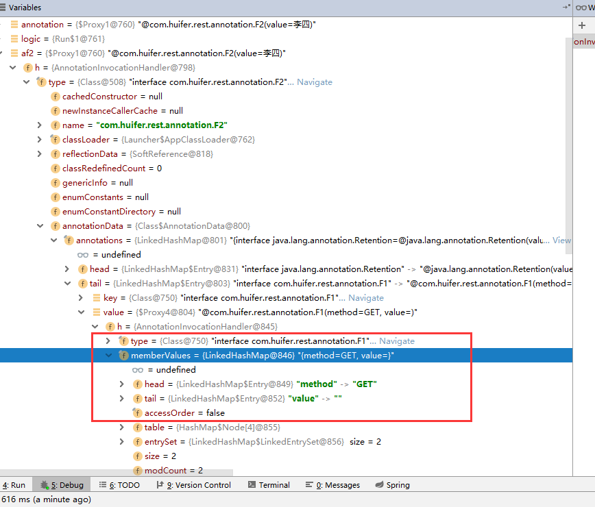

# REST

## HTTP状态码

- `org.springframework.http.HttpStatus`

  ```
  public enum HttpStatus {
  	OK(200, "OK"),
  	NOT_FOUND(404, "Not Found"),
  	BAD_REQUEST(400, "Bad Request"),
  	...
  
  }
  ```

  

## 响应

- 响应头 

  - 元信息 `org.springframework.http.HttpHeaders`

    ```java
    public class HttpHeaders implements MultiValueMap<String, String>, Serializable {
    	public static final String ACCEPT = "Accept";
    	public static final String ACCEPT_CHARSET = "Accept-Charset";
    	public static final String ACCEPT_ENCODING = "Accept-Encoding";
    	...
    }
    ```
    

    
    - 下列是一个响应头部分信息
    
    ```
    accept-ranges: bytes
    access-control-allow-methods: GET
    access-control-allow-origin: *
    access-control-max-age: 3600
    age: 3058
    content-encoding: gzip
    content-length: 88320
    ```
    
    

- 响应体

  - 业务信息
  - Http实体 `org.springframework.http.HttpEntity`


```java
@RestController
public class Controller {

    @GetMapping("/")
    public ResponseEntity<String> helloWorld() {
        return ResponseEntity.ok("hello");
    }

}
```


## URI & URL

- **URI—Uniform Resource Identifier通用资源标志符**
  Web上可用的每种资源如HTML文档、图像、视频片段、程序等都是一个来URI来定位的
  URI一般由三部组成

  1. 访问资源的命名机制
  2. 存放资源的主机名
  3. 资源自身的名称，由路径表示，着重强调于资源。

- **URL—Uniform Resource Location统一资源定位符**

  URL是Internet上用来描述信息资源的字符串，主要用在各种WWW客户程序和服务器程序上，特别是著名的Mosaic。采用URL可以用一种统一的格式来描述各种信息资源，包括文件、服务器的地址和目录等。URL一般由三部组成

  1. 协议(或称为服务方式)
  2. 存有该资源的主机IP地址(有时也包括端口号)
  3. 主机资源的具体地址。如目录和文件名等


## `@RequestMapping`

- `@RequestMapping`
  
    - `@GetMapping`
    
        ```java
        @RequestMapping(method = RequestMethod.GET)
        public @interface GetMapping {
           	@AliasFor(annotation = RequestMapping.class)
        	String name() default "";
            ...
        }
        ```
    
    - `@PutMapping`
    
        ```java
        @RequestMapping(method = RequestMethod.PUT)
        public @interface PutMapping {
            @AliasFor(annotation = RequestMapping.class)
        	String name() default "";
        }
        ```
    
    - `@PostMapping`
    
        ```java
        @RequestMapping(method = RequestMethod.POST)
        public @interface PostMapping {
            @AliasFor(annotation = RequestMapping.class)
        	String name() default "";
        }
        ```
    
    - `@DeleteMapping`
    
        ```JAVA
        @RequestMapping(method = RequestMethod.DELETE)
        public @interface DeleteMapping {
            @AliasFor(annotation = RequestMapping.class)
        	String name() default "";
        }
        ```
    
        

- spring 4.2 以后开始引入 语义强的 几个Mapping 如上所示。从源码查看上来说 这几个注解都覆盖了原始的`@RequestMapping` 注解 。
- ~~`@AliasFor` 别名语义，委派到具体的注解中 ，在`@GetMapping`中 将传入`name`值发送给 `@RequestMapping`的`name~~`


- `@AliasFor`

```java
@Retention(RetentionPolicy.RUNTIME)
@Target({ElementType.METHOD, ElementType.TYPE})
@Documented
public @interface F1 {

    String value() default "";
    String method() default "";
}
```

```java
@Retention(RetentionPolicy.RUNTIME)
@Target(ElementType.METHOD)
@F1(method = "GET")
public @interface F2 {

    @AliasFor(annotation = F1.class)
    String value() default "";


}
```

```java
public class T {

    @F2(value = "李四")
    private static void method2() {

    }

}
```

```java
public class Run {

    public static void main(String[] args) throws Exception {
        Class<T> tClass = T.class;
        Method method2 = tClass.getDeclaredMethod("method2");
        F2 annotation = method2.getAnnotation(F2.class);

        Consumer<F2> logic = new Consumer<F2>() {
            @Override
            public void accept(F2 f2a) {
                String value = f2a.value();
                System.out.println(value);
            }
        };

        F2 af2 = AnnotationUtils
                .findAnnotation(method2, F2.class);
        logic.accept(af2);

    }

}
```



- 在`af2`变量中它存放了 `@F1#method`的数据


----

