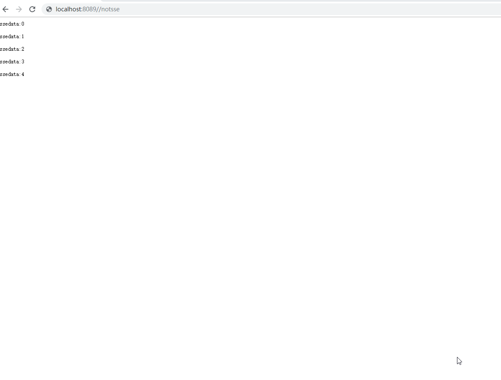
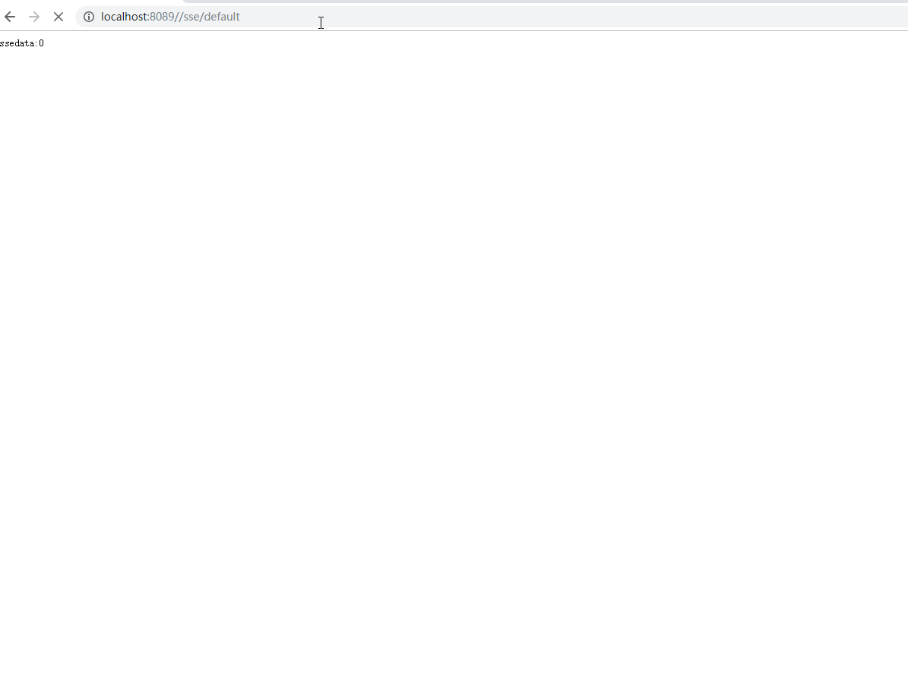

# Web-Flux

## Mono案例

- 依赖

  ```java
      <dependency>
          <groupId>org.springframework.boot</groupId>
          <artifactId>spring-boot-starter-webflux</artifactId>
      </dependency>
  ```

- controller

  ```java
  @RestController
  @Slf4j
  public class FluxController {
  
      @GetMapping("/mono")
      public Mono<String> hello() {
          // Mono 表示： >=0 个元素的异步序列
          return Mono.just("mono hello");
      }
  
  
  
  }
  ```


- 比较Mono 和常规的类型

  - 比较内容：发送请求后的直接相应时间，具体代码如下。

  ```java
  package com.huifer.webflux.controller;
  
  import lombok.extern.slf4j.Slf4j;
  import org.springframework.web.bind.annotation.GetMapping;
  import org.springframework.web.bind.annotation.RestController;
  import reactor.core.publisher.Mono;
  
  import java.util.concurrent.TimeUnit;
  
  /**
   * 描述:
   *
   * @author huifer
   * @date 2019-06-02
   */
  @RestController
  @Slf4j
  public class MonoController {
  
      @GetMapping("/default")
      public String defaultResp() {
          log.info("defaultResp method start");
          String default_hello = doSome("default hello");
          log.info("defaultResp method end");
  
          return default_hello;
      }
  
  
      @GetMapping("/mono")
      public Mono<String> mono() {
          log.info("mono method start");
          Mono<String> mono_hello = Mono.fromSupplier(() -> doSome("mono hello"));
          log.info("mono method end");
          return mono_hello;
  
      }
  
  
      private String doSome(String msg) {
          try {
              TimeUnit.SECONDS.sleep(3);
          } catch (InterruptedException e) {
              e.printStackTrace();
          }
  
          return msg;
      }
  
  
      
  }
  
  ```

  ```
  2019-06-02 15:38:05.432  INFO 6076 --- [ctor-http-nio-2] c.h.webflux.controller.FluxController    : defaultResp method start
  2019-06-02 15:38:08.433  INFO 6076 --- [ctor-http-nio-2] c.h.webflux.controller.FluxController    : defaultResp method end
  
  
  
  2019-06-02 15:38:11.907  INFO 6076 --- [ctor-http-nio-3] c.h.webflux.controller.FluxController    : mono method start
  2019-06-02 15:38:11.908  INFO 6076 --- [ctor-http-nio-3] c.h.webflux.controller.FluxController    : mono method end
  ```

  - 不难看出defaultResp方法他必须要等待3秒才能有结果返回，而mono 是直接就返回了，mono的处理内容会交给其他线程进行操作。用户访问请求还是需要等待3秒并不是不需要等待！！！

  ```sequence
  请求1 --> defaultResp :请求进入堵塞状态
  defaultResp --> 请求1结束 : 等待3秒返回结果
  请求2 --> defaultResp : 进入堵塞状态
  defaultResp --> 请求1结束: 等待请求1结束
  请求1结束 --> 请求2结束: 得到结果
  
  ```

  ```sequence
  请求1 --> monoMethod : 请求发送
  monoMethod --> 结果处理器: 处理结果
  结果处理器 --> 请求1结束: 返回请求1数据
  monoMethod --> 请求1结束 : 直接返回值等待时间3秒 
  请求2 --> monoMethod : 请求发送
  monoMethod --> 结果处理器: 处理结果
  结果处理器 --> 请求2结束: 返回请求2数据
  monoMethod --> 请求2结束: 直接返回结果等待时间3秒
  ```


## Flux 案例

```java
package com.huifer.webflux.controller;

import lombok.extern.slf4j.Slf4j;
import org.springframework.web.bind.annotation.GetMapping;
import org.springframework.web.bind.annotation.RequestParam;
import org.springframework.web.bind.annotation.RestController;
import reactor.core.publisher.Flux;

import java.util.List;

@RestController
@Slf4j
public class FluxController {

    @GetMapping("/flux")
    public Flux<String> flux1(@RequestParam String[] lang) {
        return Flux.fromArray(lang);
    }

    @GetMapping("/flux2")
    public Flux<String> flux2(@RequestParam List<String> lang) {

        return Flux.fromStream(lang.stream());
    }

    /**
     * 返回给JS进行操作并不是直接给用户查看
     *
     * @return
     */
    @GetMapping(value = "/see", produces = "text/event-stream")
    public Flux<String> flux3() {
        return Flux.just("java", "python");
    }

}

```

## SSE 案例

### 什么是SSE

> SSE （ Server-sent Events ）是 WebSocket 的一种轻量代替方案，使用 HTTP 协议。
>
> - Server-Sent Events：简称SSE技术，也是前端es5支持的一种基于http协议的服务器推送技术。
> - EventSource：js中承载SSE技术的主要核心方案和方法
> - 单工通道：只能一方面的数据导向，例如，在我们前端，我们通过浏览器向服务器请求数据，但是服务器不会主动推送数据给我们，这就是单通道
> - 双工通道：类似webSocket这样的技术，客户端可以推数据给服务器，服务器也可以推数据给客户端
> - 定点推送：服务器可以将数据针对单个客户端推送
> - 多人推送：服务器可以将数据一次性推送给所有人

### SSE数据类型

```
data: first event
 
data: second event
id: 100
 
event: myevent
data: third event
id: 101
 
: this is a comment
data: fourth event
data: fourth event continue
```

- 类型为空白，表示该行是注释，会在处理时被忽略。
- 类型为 data，表示该行包含的是数据。以 data 开头的行可以出现多次。所有这些行都是该事件的数据。
- 类型为 event，表示该行用来声明事件的类型。浏览器在收到数据时，会产生对应类型的事件。
- 类型为 id，表示该行用来声明事件的标识符。
- 类型为 retry，表示该行用来声明浏览器在连接断开之后进行再次连接之前的等待时间。


### demo

- 使用SSE

  ```java
  @WebServlet("/notsse")
  public class NotSseServlet extends HttpServlet {
      @Override
      protected void doGet(HttpServletRequest req, HttpServletResponse resp) throws ServletException, IOException {
  
  
          PrintWriter writer = resp.getWriter();
  
  
          for (int i = 0; i < 5; i++) {
              writer.print("data:" + i + "\n");
              writer.print("\n");
              writer.flush();
              try {
                  TimeUnit.SECONDS.sleep(1);
              } catch (InterruptedException e) {
                  e.printStackTrace();
              }
  
          }
      }
  }
  ```

- 使用SSE

  ```java
  @WebServlet(value = "/sse/default",asyncSupported = true)
  public class DefaultEventServlet extends HttpServlet {
      @Override
      protected void doGet(HttpServletRequest req, HttpServletResponse resp) throws ServletException, IOException {
  
  
          resp.setContentType("text/event-stream");
          resp.setCharacterEncoding("utf-8");
          PrintWriter writer = resp.getWriter();
  
  
          for (int i = 0; i < 5; i++) {
              writer.print("data:" + i + "\n");
              writer.print("\n");
              writer.flush();
  
  
              try {
                  TimeUnit.SECONDS.sleep(1);
              } catch (InterruptedException e) {
                  e.printStackTrace();
              }
  
          }
      }
  }
  ```

  

- 使用SSE 的结果返回为一步步的返回， 不适用为等待所有处理完成后返回...


## 整合mongodb

- entity

  ```
  @Data
  @Document(collection = "t_student")
  public class Student {
  
      @Id
      private String id;
  
  
      @NotBlank(message = "名字不能空")
      private String name;
  
      @Range(max = 200, min = 18)
      private int age;
  
  
  }
  ```

- repository

  ```java
  public interface StudentRepository
          extends ReactiveMongoRepository<Student, String> {
  
  
      /***
       * 根据年龄上下限查询 ，都不包含边界
       * @param below 下限
       * @param top 上限
       * @return
       */
      Flux<Student> findByAgeBetween(int below, int top);
  
  
  }
  ```

- controller

  ```java
  package com.huifer.webflux.controller;
  
  import com.huifer.webflux.entity.Student;
  import com.huifer.webflux.repository.StudentRepository;
  import com.huifer.webflux.util.NameValidateUtil;
  import org.springframework.beans.factory.annotation.Autowired;
  import org.springframework.http.HttpStatus;
  import org.springframework.http.MediaType;
  import org.springframework.http.ResponseEntity;
  import org.springframework.web.bind.annotation.*;
  import reactor.core.publisher.Flux;
  import reactor.core.publisher.Mono;
  
  import javax.validation.Valid;
  
  
  @RestController
  @RequestMapping("/student")
  public class StudentController {
  
  
      @Autowired
      private StudentRepository studentRepository;
  
      @GetMapping("/all")
      public Flux<Student> all() {
          return studentRepository.findAll();
      }
  
      @GetMapping(value = "/sse/all", produces = MediaType.TEXT_EVENT_STREAM_VALUE)
      public Flux<Student> allSSE() {
          return studentRepository.findAll();
      }
  
      @PostMapping("/update")
      public ResponseEntity add(@Valid Student student) {
          return ResponseEntity.ok(studentRepository.save(student));
      }
  
  
      @PostMapping("/save")
      public ResponseEntity save(@Valid Student student) {
          NameValidateUtil.validateName(student.getName());
  
          return ResponseEntity.ok(studentRepository.save(student));
      }
  
  
      @DeleteMapping("/del/{id}")
      public Mono<Void> deleteStudentVoid(@PathVariable(value = "id") String id) {
          // 无状态删除 不管是否成功 都是200
          return studentRepository.deleteById(id);
      }
  
      @DeleteMapping("/ddl/{id}")
      public Mono<ResponseEntity> deleteStudent(@PathVariable(value = "id") String id) {
          Mono<ResponseEntity> responseEntityMono = studentRepository.findById(id).flatMap(
                  student -> studentRepository.delete(student)
                          // 成功
                          .then(Mono.just(ResponseEntity.ok().body(student)))
                          // 失败
                          .defaultIfEmpty(new ResponseEntity<>(HttpStatus.NOT_FOUND))
          );
  
          return responseEntityMono;
      }
  
  
      @PutMapping("/put/{id}")
      public Mono<ResponseEntity<Student>> update(@PathVariable(value = "id") String id, @RequestBody Student student) {
  
          Mono<ResponseEntity<Student>> responseEntityMono = studentRepository.findById(id).flatMap(
                  stu -> {
                      stu.setAge(student.getAge());
                      stu.setName(student.getName());
                      return studentRepository.save(stu);
                  }).map(stu -> new ResponseEntity<Student>(stu, HttpStatus.OK))
  
                  .defaultIfEmpty(new ResponseEntity<Student>(HttpStatus.NOT_FOUND));
  
  
          return responseEntityMono;
      }
  
  
      @GetMapping("/find/{id}")
      public Mono<ResponseEntity<Student>> findById(@PathVariable("id") String id) {
  
          return studentRepository.findById(id).map(stu -> new ResponseEntity<Student>(stu, HttpStatus.OK))
                  .defaultIfEmpty(new ResponseEntity<Student>(HttpStatus.NOT_FOUND));
      }
  
  
      @GetMapping("/age/{below}/{top}")
      public Flux<Student> findByAge(@PathVariable("below") int below, @PathVariable("top") int top) {
          return studentRepository.findByAgeBetween(below, top);
      }
  
  
  }
  ```

- exception

  ```java
  @Getter
  @Setter
  @NoArgsConstructor
  public class StudentException extends RuntimeException {
      private String errField;
      private String errValue;
  
      public StudentException(String message, String errField, String errValue) {
          super(message);
          this.errField = errField;
          this.errValue = errValue;
      }
  }
  ```

- advice

  ```java
  @ControllerAdvice
  public class StucentAop {
  
      private static String apply(String s1, String s2) {
          return s1 + "\n" + s2;
      }
  
      @ExceptionHandler
      public ResponseEntity validateHandleName(StudentException ex) {
          return new ResponseEntity(ex.getMessage(), HttpStatus.BAD_REQUEST);
      }
  
  
      @ExceptionHandler
      public ResponseEntity validateHandle(WebExchangeBindException ex) {
          return new ResponseEntity(ex2str(ex), HttpStatus.BAD_REQUEST);
      }
  
      private String ex2str(WebExchangeBindException ex) {
  
          return ex.getFieldErrors().stream().map(
                  e -> {
                      return e.getField() + " : " + e.getDefaultMessage();
                  }
          ).reduce("", StucentAop::apply);
  
  
      }
  
  
  }
  ```

- util

  ```java
  public class NameValidateUtil {
  
  
      public static final String[] INVALIDE_NAMES = {"ADMIN", "ROOT"};
  
      public static void validateName(String name) {
  
          Arrays.stream(INVALIDE_NAMES).filter(s -> name.equalsIgnoreCase(s))
                  .findAny()
                  .ifPresent(s -> {
                      throw new StudentException("name 非法名词", s, "非法名词");
                  });
  
          ;
  
      }
  }
  ```

- 启动项

  ```java
  @SpringBootApplication
  @EnableReactiveMongoRepositories
  public class WebFluxApp {
      public static void main(String[] args) {
          SpringApplication.run(WebFluxApp.class, args);
      }
  }
  ```


