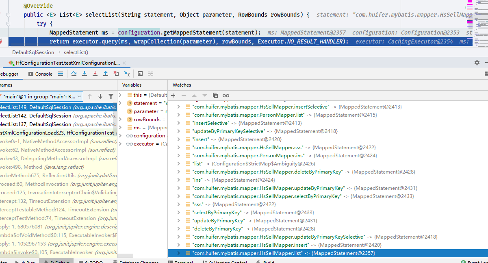

# SqlSessionFactory
- `org.apache.ibatis.session.SqlSessionFactory`
```java
public interface SqlSessionFactory {

    SqlSession openSession();

    SqlSession openSession(boolean autoCommit);

    SqlSession openSession(Connection connection);

    SqlSession openSession(TransactionIsolationLevel level);

    SqlSession openSession(ExecutorType execType);

    SqlSession openSession(ExecutorType execType, boolean autoCommit);

    SqlSession openSession(ExecutorType execType, TransactionIsolationLevel level);

    SqlSession openSession(ExecutorType execType, Connection connection);

    Configuration getConfiguration();

}
```
- 两个实现类
    - `org.apache.ibatis.session.SqlSessionManager`
    - `org.apache.ibatis.session.defaults.DefaultSqlSessionFactory`
    - 默认 `DefaultSqlSessionFactory`


```java
    /**
     * <setting name="defaultExecutorType" value="SIMPLE"/>
     *
     * @param execType   setting 标签的 defaultExecutorType 属性
     * @param level      事物级别
     * @param autoCommit
     * @return
     */
    private SqlSession openSessionFromDataSource(ExecutorType execType, TransactionIsolationLevel level, boolean autoCommit) {
        Transaction tx = null;
        try {
            final Environment environment = configuration.getEnvironment();
            //       <transactionManager type="JDBC"/>
            // org.apache.ibatis.transaction.jdbc.JdbcTransaction
            final TransactionFactory transactionFactory = getTransactionFactoryFromEnvironment(environment);
            tx = transactionFactory.newTransaction(environment.getDataSource(), level, autoCommit);
            final Executor executor = configuration.newExecutor(tx, execType);
            return new DefaultSqlSession(configuration, executor, autoCommit);
        } catch (Exception e) {
            closeTransaction(tx); // may have fetched a connection so lets call close()
            throw ExceptionFactory.wrapException("Error opening session.  Cause: " + e, e);
        } finally {
            ErrorContext.instance().reset();
        }
    }

```


- 测试用例可看这个方法`org.apache.ibatis.session.SqlSessionTest`, 
```java
    @Test
    void testXmlConfigurationLoad() throws IOException {
        Reader reader = Resources.getResourceAsReader("mybatis-config-demo.xml");
        SqlSessionFactory factory = new SqlSessionFactoryBuilder().build(reader);
        Configuration configuration = factory.getConfiguration();
        SqlSession sqlSession = factory.openSession();
        Object o = sqlSession.selectList("com.huifer.mybatis.mapper.HsSellMapper.list");

        System.out.println();
    }

```

- 最终调用的方法都是

  ```java
      @Override
      public <E> List<E> selectList(String statement, Object parameter, RowBounds rowBounds) {
          try {
              MappedStatement ms = configuration.getMappedStatement(statement);
              return executor.query(ms, wrapCollection(parameter), rowBounds, Executor.NO_RESULT_HANDLER);
          } catch (Exception e) {
              throw ExceptionFactory.wrapException("Error querying database.  Cause: " + e, e);
          } finally {
              ErrorContext.instance().reset();
          }
      }
  
  ```

  - `org.apache.ibatis.executor.BaseExecutor#query(org.apache.ibatis.mapping.MappedStatement, java.lang.Object, org.apache.ibatis.session.RowBounds, org.apache.ibatis.session.ResultHandler)`

    ```java
    @Override
        public <E> List<E> query(MappedStatement ms, Object parameter, RowBounds rowBounds, ResultHandler resultHandler) throws SQLException {
            BoundSql boundSql = ms.getBoundSql(parameter);
            CacheKey key = createCacheKey(ms, parameter, rowBounds, boundSql);
            return query(ms, parameter, rowBounds, resultHandler, key, boundSql);
        }
    ```

  - `org.apache.ibatis.executor.CachingExecutor#query(org.apache.ibatis.mapping.MappedStatement, java.lang.Object, org.apache.ibatis.session.RowBounds, org.apache.ibatis.session.ResultHandler)`

    ```java
        @Override
        public <E> List<E> query(MappedStatement ms, Object parameterObject, RowBounds rowBounds, ResultHandler resultHandler) throws SQLException {
            BoundSql boundSql = ms.getBoundSql(parameterObject);
            CacheKey key = createCacheKey(ms, parameterObject, rowBounds, boundSql);
            return query(ms, parameterObject, rowBounds, resultHandler, key, boundSql);
        }
    
    ```

    

  - 下图描述了`org.apache.ibatis.session.Configuration#mappedStatements` 属性值的内容。 改内容解析是通过 `Mybatis-config.xml`解析得到




