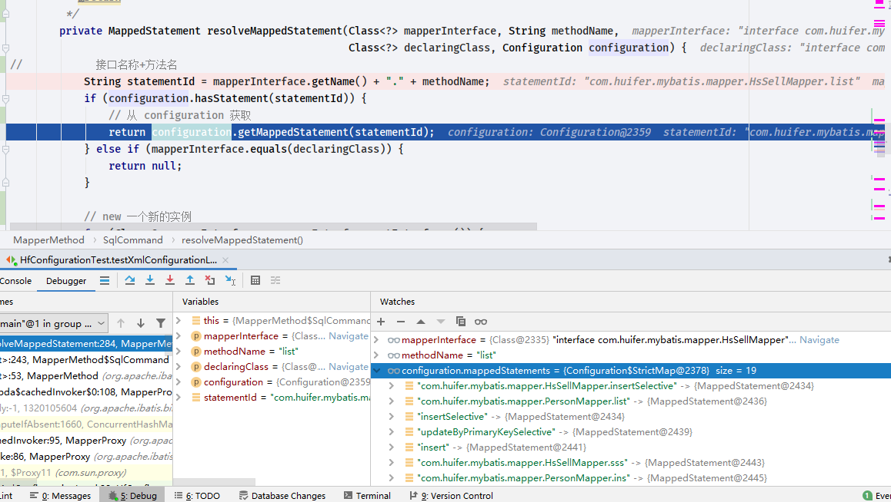
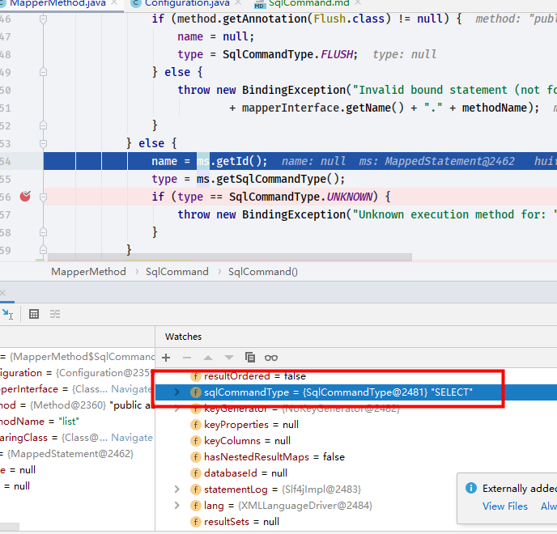

# sqlCommand 
- `org.apache.ibatis.binding.MapperMethod.SqlCommand`
```java
    /**
     * 核心思想: sql id , Sql 类型
     */
    public static class SqlCommand {

        /**
         * sql id
         */
        private final String name;
        /**
         * sql  类型select|update|delete|insert|...
         */
        private final SqlCommandType type;

        /**
         * 根据传递的参数 设置sql的一些属性 , sql id , type .
         *
         * @param configuration
         * @param mapperInterface
         * @param method
         */
        public SqlCommand(Configuration configuration, Class<?> mapperInterface, Method method) {
            final String methodName = method.getName();
            final Class<?> declaringClass = method.getDeclaringClass();
            MappedStatement ms = resolveMappedStatement(mapperInterface, methodName, declaringClass,
                    configuration);
            if (ms == null) {
                if (method.getAnnotation(Flush.class) != null) {
                    name = null;
                    type = SqlCommandType.FLUSH;
                } else {
                    throw new BindingException("Invalid bound statement (not found): "
                            + mapperInterface.getName() + "." + methodName);
                }
            } else {
                name = ms.getId();
                type = ms.getSqlCommandType();
                if (type == SqlCommandType.UNKNOWN) {
                    throw new BindingException("Unknown execution method for: " + name);
                }
            }
            System.out.println();
        }

        public String getName() {
            return name;
        }

        public SqlCommandType getType() {
            return type;
        }

        /**
         * @param mapperInterface mapper.class
         * @param methodName      方法名
         * @param declaringClass  可能是 mapper.class
         * @param configuration
         * @return
         */
        private MappedStatement resolveMappedStatement(Class<?> mapperInterface, String methodName,
                                                       Class<?> declaringClass, Configuration configuration) {
//            接口名称+方法名
            String statementId = mapperInterface.getName() + "." + methodName;
            if (configuration.hasStatement(statementId)) {
                // 从 configuration 获取
                return configuration.getMappedStatement(statementId);
            } else if (mapperInterface.equals(declaringClass)) {
                return null;
            }

            // new 一个新的实例
            for (Class<?> superInterface : mapperInterface.getInterfaces()) {
                if (declaringClass.isAssignableFrom(superInterface)) {
                    MappedStatement ms = resolveMappedStatement(superInterface, methodName,
                            declaringClass, configuration);
                    if (ms != null) {
                        return ms;
                    }
                }
            }
            return null;
        }
    }

```





