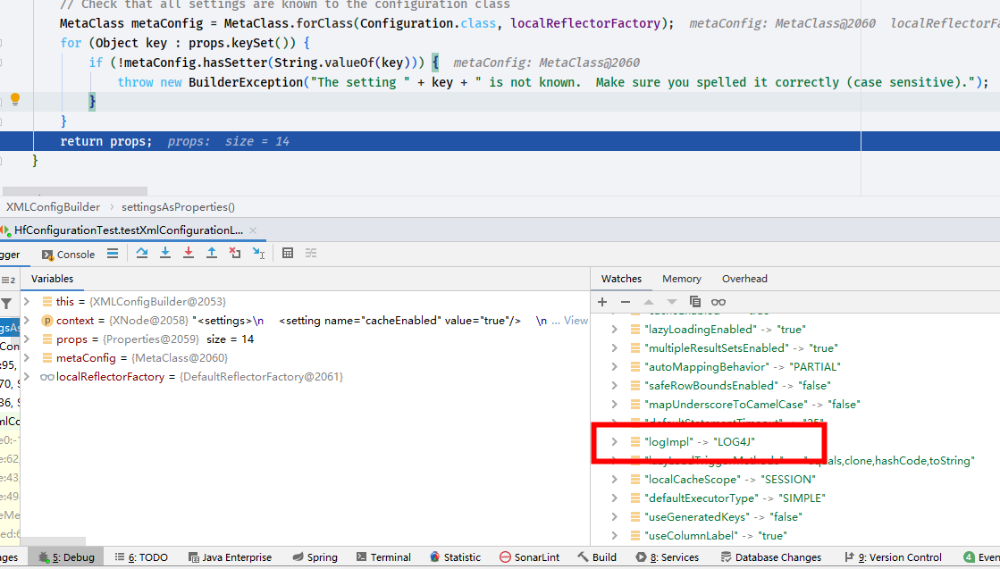
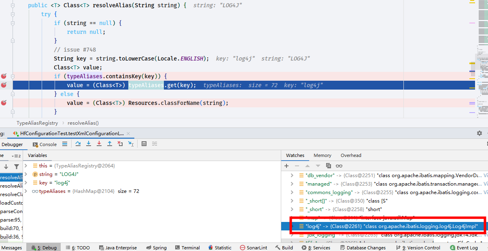
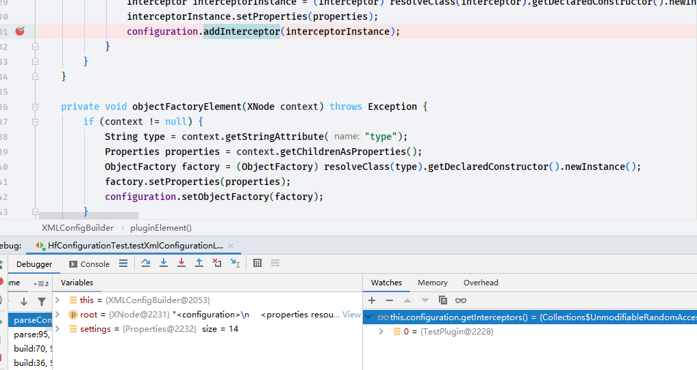
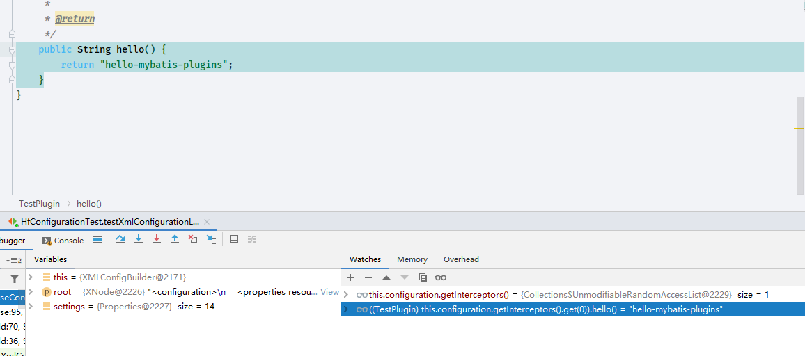

# mybatis 配置文件
> 通常情况下使用`mybatis`的时候我们会添加一个`mybatis-config.xml`的文件. 这个文件是如何解析的呢?
## 解析
- 先编辑一个`mybatis-config.xml`文件放在`src\resources`目录下,具体内容如下
```xml
<?xml version="1.0" encoding="UTF-8" ?>
<!DOCTYPE configuration
    PUBLIC "-//mybatis.org//DTD Config 3.0//EN"
    "http://mybatis.org/dtd/mybatis-3-config.dtd">
<configuration>
  <settings>
    <setting name="lazyLoadingEnabled" value="true"/>
  </settings>

  <typeAliases>
    <!--    <package name="com.huifer.mybatis.entity"/>-->
    <typeAlias type="com.huifer.mybatis.entity.Person" alias="Person"/>
  </typeAliases>

  <!-- 定义数据库的信息，默认使用development数据库构建环境 -->
  <environments default="development">
    <environment id="development">
      <transactionManager type="JDBC"/>
      <dataSource type="POOLED">
        <property name="driver" value="com.mysql.jdbc.Driver"/>
        <property name="url" value="jdbc:mysql://localhost:3306/mybatis"/>
        <property name="username" value="root"/>
        <property name="password" value="root"/>
      </dataSource>
    </environment>
  </environments>
  <!-- 定义映射器 -->
  <mappers>
    <mapper resource="com/huifer/mybatis/mapper/PersonMapper.xml"/>
  </mappers>
</configuration>

```
- 目前已知的条件: 这是一个配置文件,应该有一个对应的JAVA类来存储`org.apache.ibatis.session.Configuration`
```xml
  <settings>
    <setting name="lazyLoadingEnabled" value="true"/>
  </settings>
```
看上述的xml文件标签内容是否在`org.apache.ibatis.session.Configuration`存在,搜索`lazyLoadingEnabled`属性
```java
protected boolean lazyLoadingEnabled = false;
```
- 其他的一些属性应该也会有对应的比如查询超时`defaultStatementTimeout`等等.

- mappers 标签的属性对应
```java

   protected final Map<String, MappedStatement> mappedStatements = new StrictMap<MappedStatement>("Mapped Statements collection")
            .conflictMessageProducer((savedValue, targetValue) ->
                    ". please check " + savedValue.getResource() + " and " + targetValue.getResource());
    protected final Map<String, Cache> caches = new StrictMap<>("Caches collection");
    protected final Map<String, ResultMap> resultMaps = new StrictMap<>("Result Maps collection");
    protected final Map<String, ParameterMap> parameterMaps = new StrictMap<>("Parameter Maps collection");
    protected final Map<String, KeyGenerator> keyGenerators = new StrictMap<>("Key Generators collection");
```

- 打开`mybatis`提供的测试类`org.apache.ibatis.submitted.global_variables_defaults.ConfigurationTest` 查看方法`org.apache.ibatis.submitted.global_variables_defaults.ConfigurationTest.applyDefaultValueOnXmlConfiguration`
```java
    @Test
    void applyDefaultValueOnXmlConfiguration() throws IOException {

        Properties props = new Properties();
        props.setProperty(PropertyParser.KEY_ENABLE_DEFAULT_VALUE, "true");

        Reader reader = Resources.getResourceAsReader("org/apache/ibatis/submitted/global_variables_defaults/mybatis-config.xml");
        SqlSessionFactory factory = new SqlSessionFactoryBuilder().build(reader, props);
        Configuration configuration = factory.getConfiguration();

        Assertions.assertThat(configuration.getJdbcTypeForNull()).isEqualTo(JdbcType.NULL);
        Assertions.assertThat(((UnpooledDataSource) configuration.getEnvironment().getDataSource()).getUrl())
                .isEqualTo("jdbc:hsqldb:mem:global_variables_defaults");
        Assertions.assertThat(configuration.getDatabaseId()).isEqualTo("hsql");
        Assertions.assertThat(((SupportClasses.CustomObjectFactory) configuration.getObjectFactory()).getProperties().getProperty("name"))
                .isEqualTo("default");

    }
```
- 不难发现`org.apache.ibatis.session.SqlSessionFactoryBuilder.build(java.io.Reader, java.util.Properties)`通过这个方法就可以将`mybatis-config.xml`文件解析出来了

```java
    public SqlSessionFactory build(Reader reader, Properties properties) {
        return build(reader, null, properties);
    }
```

```java
    /**
     * 真正的创建方法
     *
     * @param reader inputStream
     * @param environment
     * @param properties 属性值
     * @return
     */
    public SqlSessionFactory build(Reader reader, String environment, Properties properties) {
        try {
            // 通过 XMLConfigBuilder 解析成一个 XMLConfigBuilder
            XMLConfigBuilder parser = new XMLConfigBuilder(reader, environment, properties);
            // 往下点进去看方法
            // 1. org.apache.ibatis.session.SqlSessionFactoryBuilder.build(org.apache.ibatis.session.Configuration)
            // 2. org.apache.ibatis.session.defaults.DefaultSqlSessionFactory.DefaultSqlSessionFactory
            // 3. 第二步的构造方法中生成了 `org.apache.ibatis.session.Configuration`对象
            return build(parser.parse());
        } catch (Exception e) {
            throw ExceptionFactory.wrapException("Error building SqlSession.", e);
        } finally {
            ErrorContext.instance().reset();
            try {
                reader.close();
            } catch (IOException e) {
                // Intentionally ignore. Prefer previous error.
            }
        }
    }

```
```java
    public SqlSessionFactory build(Configuration config) {
        return new DefaultSqlSessionFactory(config);
    }
```
```java
public class DefaultSqlSessionFactory implements SqlSessionFactory {

    private final Configuration configuration;

    public DefaultSqlSessionFactory(Configuration configuration) {
        this.configuration = configuration;
    }
}
```
- 调用链路
1. `org.apache.ibatis.session.SqlSessionFactoryBuilder.build(java.io.Reader, java.util.Properties)`
    1. `org.apache.ibatis.builder.xml.XMLConfigBuilder.parse`
        1. `org.apache.ibatis.session.SqlSessionFactoryBuilder.build(java.io.Reader, java.lang.String, java.util.Properties)`
            1. `org.apache.ibatis.session.SqlSessionFactoryBuilder.build(org.apache.ibatis.session.Configuration)`
                1. `org.apache.ibatis.session.defaults.DefaultSqlSessionFactory`
                
## XMLConfigBuilder.parse
```java
    public Configuration parse() {
        if (parsed) {
            throw new BuilderException("Each XMLConfigBuilder can only be used once.");
        }
        parsed = true;
        parseConfiguration(parser.evalNode("/configuration"));
        return configuration;
    }
```
```java
private void parseConfiguration(XNode root) {
        try {
            //issue #117 read properties first
            propertiesElement(root.evalNode("properties"));
            Properties settings = settingsAsProperties(root.evalNode("settings"));
            loadCustomVfs(settings);
            loadCustomLogImpl(settings);
            typeAliasesElement(root.evalNode("typeAliases"));
            pluginElement(root.evalNode("plugins"));
            objectFactoryElement(root.evalNode("objectFactory"));
            objectWrapperFactoryElement(root.evalNode("objectWrapperFactory"));
            reflectorFactoryElement(root.evalNode("reflectorFactory"));
            settingsElement(settings);
            // read it after objectFactory and objectWrapperFactory issue #631
            environmentsElement(root.evalNode("environments"));
            databaseIdProviderElement(root.evalNode("databaseIdProvider"));
            typeHandlerElement(root.evalNode("typeHandlers"));
            mapperElement(root.evalNode("mappers"));
        } catch (Exception e) {
            throw new BuilderException("Error parsing SQL Mapper Configuration. Cause: " + e, e);
        }
    }
```
- 先自己先一段测试用例
```java
    @Test
    void testXmlConfigurationLoad() throws IOException {
        Reader reader = Resources.getResourceAsReader("mybatis-config.xml");
        SqlSessionFactory factory = new SqlSessionFactoryBuilder().build(reader);
        Configuration configuration = factory.getConfiguration();
        System.out.println();
    }
```
## propertiesElement 
- properties 标签属性加载
```java
   private void propertiesElement(XNode context) throws Exception {
           if (context != null) {
               // 加载下级标签,解析属性
               Properties defaults = context.getChildrenAsProperties();
               String resource = context.getStringAttribute("resource");
               String url = context.getStringAttribute("url");
               if (resource != null && url != null) {
                   // 不会同时设置 resource 和 url 的属性值
                   throw new BuilderException("The properties element cannot specify both a URL and a resource based property file reference.  Please specify one or the other.");
               }
               if (resource != null) {
                   // 覆盖子节点属性
                   defaults.putAll(Resources.getResourceAsProperties(resource));
               } else if (url != null) {
                   // 覆盖子节点属性
                   defaults.putAll(Resources.getUrlAsProperties(url));
               }
               Properties vars = configuration.getVariables();
               if (vars != null) {
                   defaults.putAll(vars);
               }
               parser.setVariables(defaults);
               // 设置到 全局的 configuration 中
               configuration.setVariables(defaults);
           }
       }
```
- 解析标签属性
```java

    /**
     * 解析配置文件xml的标签将返回 {name:value}
     * @return
     */
    public Properties getChildrenAsProperties() {
        Properties properties = new Properties();
        for (XNode child : getChildren()) {
            String name = child.getStringAttribute("name");
            String value = child.getStringAttribute("value");
            if (name != null && value != null) {
                properties.setProperty(name, value);
            }
        }
        return properties;
    }
```
- 当前配置文件
```xml
  <properties resource="test.properties" >
      <property name="hello" value="world"/>
      <property name="k" value="v"/>
  </properties>
```


可以看到`defaults`就是我们配置的标签属性值了

为了测试后半段内容将`test.properties`添加一个属性

```properties
k=java

```


可以看到这段话

```java
            if (resource != null && url != null) {
                // 不会同时设置 resource 和 url 的属性值
                throw new BuilderException("The properties element cannot specify both a URL and a resource based property file reference.  Please specify one or the other.");
            }
            if (resource != null) {
                // 覆盖子节点属性
                defaults.putAll(Resources.getResourceAsProperties(resource));
            } else if (url != null) {
                // 覆盖子节点属性
                defaults.putAll(Resources.getUrlAsProperties(url));
            }
```

`defaults.putAll()`方法将会读取`properties`文件中的内容. 并且覆盖`<properties>`标签的子节点


最终设置结果`k`的属性值修改了:happy:


## typeAliasesElement

- 别名加载,配置文件在下方,在debug阶段选择开启不同的别名方式进行源码查看
```xml
  <typeAliases>
<!--    <package name="com.huifer.mybatis.entity"/>-->
    <typeAlias type="com.huifer.mybatis.entity.Person" alias="Person"/>
  </typeAliases>
```
```java
private void typeAliasesElement(XNode parent) {
        if (parent != null) {
            for (XNode child : parent.getChildren()) {
                if ("package".equals(child.getName())) {
                    // 解析 package 标签
                    String typeAliasPackage = child.getStringAttribute("name");
                    configuration.getTypeAliasRegistry().registerAliases(typeAliasPackage);
                } else {
                    // 解析 typeAliases 标签
                    String alias = child.getStringAttribute("alias");
                    String type = child.getStringAttribute("type");
                    try {
                        Class<?> clazz = Resources.classForName(type);
                        // 别名注册
                        if (alias == null) {
                            typeAliasRegistry.registerAlias(clazz);
                        } else {
                            
                            typeAliasRegistry.registerAlias(alias, clazz);
                        }
                    } catch (ClassNotFoundException e) {
                        throw new BuilderException("Error registering typeAlias for '" + alias + "'. Cause: " + e, e);
                    }
                }
            }
        }
    }
```


目前解析的内容为`Person`这个实体

- 别名加载方法

```java
    /**
     * 别名注册,
     * typeAliases 是一个map key=>别名,value=>字节码
     *
     * @param alias 别名名称
     * @param value 别名的字节码
     */
    public void registerAlias(String alias, Class<?> value) {
        if (alias == null) {
            throw new TypeException("The parameter alias cannot be null");
        }
        // issue #748
        String key = alias.toLowerCase(Locale.ENGLISH);
        if (typeAliases.containsKey(key) && typeAliases.get(key) != null && !typeAliases.get(key).equals(value)) {
            throw new TypeException("The alias '" + alias + "' is already mapped to the value '" + typeAliases.get(key).getName() + "'.");
        }
        typeAliases.put(key, value);
    }

```

完成了`properties`标签和`typeAliases`看一下此时的`configuration`是什么

通过下面的代码我们知道`properties`属性放置在` configuration.variables`

```java
            configuration.setVariables(defaults);
```

```java
    public void setVariables(Properties variables) {
        this.variables = variables;
    }
```


`typeAaliases`放在`this.configuration.typeAliasRegistry.typeAliases`中


## settingsAsProperties

- `org.apache.ibatis.builder.xml.XMLConfigBuilder#parseConfiguration`

- 设置 setting 标签下的属性相关代码

  ```java
              Properties settings = settingsAsProperties(root.evalNode("settings"));
              // vfs 虚拟文件相关属性
              loadCustomVfs(settings);
              // 日志实现类
              loadCustomLogImpl(settings);
  ```

  


```JAVA
    private Properties settingsAsProperties(XNode context) {
        if (context == null) {
            // 返回一个空的 Properties
            return new Properties();
        }
        Properties props = context.getChildrenAsProperties();
        // Check that all settings are known to the configuration class
        MetaClass metaConfig = MetaClass.forClass(Configuration.class, localReflectorFactory);
        for (Object key : props.keySet()) {
            if (!metaConfig.hasSetter(String.valueOf(key))) {
                throw new BuilderException("The setting " + key + " is not known.  Make sure you spelled it correctly (case sensitive).");
            }
        }
        return props;
    }
```

返回结果就是`Properties` 对象

- 修改`mybatis-config.xml`

  ```xml
  <setting name="logImpl" value="LOG4J"/>
  ```





### loadCustomLogImpl

- `org.apache.ibatis.builder.xml.XMLConfigBuilder#loadCustomLogImpl`

```java
    private void loadCustomLogImpl(Properties props) {
        Class<? extends Log> logImpl = resolveClass(props.getProperty("logImpl"));
        configuration.setLogImpl(logImpl);
    }
```

- 熟悉的方法他来了

  ```java
      /**
       * 通过别名查询
       * @param alias
       * @param <T>
       * @return
       */
      protected <T> Class<? extends T> resolveClass(String alias) {
          if (alias == null) {
              return null;
          }
          try {
              return resolveAlias(alias);
          } catch (Exception e) {
              throw new BuilderException("Error resolving class. Cause: " + e, e);
          }
      }
  
  ```

  ```java
     protected <T> Class<? extends T> resolveAlias(String alias) {
          return typeAliasRegistry.resolveAlias(alias);
      }
  ```

  ```java
      /**
       * 获取别名的value
       *
       * @param string 别名名称
       * @param <T>
       * @return
       */
      @SuppressWarnings("unchecked")
      // throws class cast exception as well if types cannot be assigned
      public <T> Class<T> resolveAlias(String string) {
          try {
              if (string == null) {
                  return null;
              }
              // issue #748
              String key = string.toLowerCase(Locale.ENGLISH);
              Class<T> value;
              if (typeAliases.containsKey(key)) {
                  value = (Class<T>) typeAliases.get(key);
              } else {
                  value = (Class<T>) Resources.classForName(string);
              }
              return value;
          } catch (ClassNotFoundException e) {
              throw new TypeException("Could not resolve type alias '" + string + "'.  Cause: " + e, e);
          }
      }
  
  ```

  从别名`private final Map<String, Class<?>> typeAliases = new HashMap<>();`存储空间获取存储的实体直接返回

  

- 此时该日志为： `org.apache.ibatis.logging.log4j.Log4jImpl`


## pluginElement

- `org.apache.ibatis.builder.xml.XMLConfigBuilder#pluginElement`

- 准备一个插件类测试用

  ```java
  package com.huifer.mybatis.plugins;
  
  import org.apache.ibatis.plugin.Interceptor;
  import org.apache.ibatis.plugin.Invocation;
  import org.apache.ibatis.plugin.Plugin;
  
  import java.util.Properties;
  
  //@Intercepts({
  //        @Signature(
  //                type = Executor.class,
  //                method = "query",
  //                args = {MappedStatement.class, Object.class, RowBounds.class, ResultHandler.class}
  //        )
  //})
  public class TestPlugin implements Interceptor {
      @Override
      public Object intercept(Invocation invocation) throws Throwable {
  
          return invocation.proceed();
      }
  
      @Override
      public Object plugin(Object target) {
          return Plugin.wrap(target, this);
      }
  
      @Override
      public void setProperties(Properties properties) {
          System.out.println(properties);
      }
  }
  
  ```


修改 `mybatis-config.xml`

```xml
  <plugins>
    <plugin interceptor="com.huifer.mybatis.plugins.TestPlugin">
      <property name="testPlugins" value="tPl"/>
    </plugin>
  </plugins>
```


```java
    /**
     * 记载 plugins 标签内容
     * @param parent
     * @throws Exception
     */
    private void pluginElement(XNode parent) throws Exception {
        if (parent != null) {
            for (XNode child : parent.getChildren()) {
                //     <plugin interceptor="com.huifer.mybatis.plugins.TestPlugin"> 获取 interceptor 值
                String interceptor = child.getStringAttribute("interceptor");
                // 获取plugin 下面的 property 标签数据
                Properties properties = child.getChildrenAsProperties();
                Interceptor interceptorInstance = (Interceptor) resolveClass(interceptor).getDeclaredConstructor().newInstance();
                interceptorInstance.setProperties(properties);
                configuration.addInterceptor(interceptorInstance);
            }
        }
    }

```

先看`interceptor` 和 `properties` 


- `Interceptor interceptorInstance = (Interceptor) resolveClass(interceptor).getDeclaredConstructor().newInstance();`这段内容其实是通过反射获取对应的实例 ， 

- 注意：**`org.apache.ibatis.plugin.Interceptor`的`setProperties`方法是空的实现类需要实现. 现在的实现方式是输出参数`properties`**

```java
public interface Interceptor {

    Object intercept(Invocation invocation) throws Throwable;

    default Object plugin(Object target) {
        return Plugin.wrap(target, this);
    }

    default void setProperties(Properties properties) {
        // NOP
    }

}

```


- 跳出这个方法，通过 debug 查看下面这个方法的返回值

  ```java
  this.configuration.getInterceptors()
  ```



- 指向了我们刚才编写的插件类，为了测试在插件类编写

  ```java
  public String hello() {    return "hello-mybatis-plugins";}
  ```
- `((TestPlugin) this.configuration.getInterceptors().get(0)).hello()`




## objectFactoryElement

- 标签`<objectFactory>` 的解析

- 在`mybatis-config.xml`中写入

  ```xml
    <objectFactory type="com.huifer.mybatis.factory.TestObjectFactory">
      <property name="data" value="100"/>
    </objectFactory>
  ```

  ```java
  package com.huifer.mybatis.factory;
  
  import org.apache.ibatis.reflection.factory.ObjectFactory;
  
  import java.util.List;
  import java.util.Properties;
  
  public class TestObjectFactory implements ObjectFactory {
      private String data;
  
      public String getData() {
          return data;
      }
  
      public void setData(String data) {
          this.data = data;
      }
  
      /**
       * Sets configuration properties.
       *
       * @param properties configuration properties
       */
      @Override
      public void setProperties(Properties properties) {
          this.data = properties.getProperty("data");
      }
  
      /**
       * Creates a new object with default constructor.
       *
       * @param type Object type
       * @return
       */
      @Override
      public <T> T create(Class<T> type) {
          return null;
      }
  
      /**
       * Creates a new object with the specified constructor and params.
       *
       * @param type                Object type
       * @param constructorArgTypes Constructor argument types
       * @param constructorArgs     Constructor argument values
       * @return
       */
      @Override
      public <T> T create(Class<T> type, List<Class<?>> constructorArgTypes, List<Object> constructorArgs) {
          return null;
      }
  
      /**
       * Returns true if this object can have a set of other objects.
       * It's main purpose is to support non-java.util.Collection objects like Scala collections.
       *
       * @param type Object type
       * @return whether it is a collection or not
       * @since 3.1.0
       */
      @Override
      public <T> boolean isCollection(Class<T> type) {
          return false;
      }
  }
  
  ```

- `objectFactoryElement`方法的内容和其他标签的解析方式基本相同

```java
    private void objectFactoryElement(XNode context) throws Exception {
        if (context != null) {
            // 获取标签 objectFactory 中的 type 属性
            String type = context.getStringAttribute("type");
            Properties properties = context.getChildrenAsProperties();
            // 去别名 MAP 中获取实例
            ObjectFactory factory = (ObjectFactory) resolveClass(type).getDeclaredConstructor().newInstance();
            // 设置属性值
            factory.setProperties(properties);
            // 在 configuration 中放入该工厂
            configuration.setObjectFactory(factory);
        }
    }
```


## objectWrapperFactoryElement

- 解析`<objectWrapperFactory>`标签

- 修改`mybatis-config.xml`

  ```xml
    <objectWrapperFactory type="org.apache.ibatis.reflection.wrapper.DefaultObjectWrapperFactory"/>
  
  ```

```java
    private void objectWrapperFactoryElement(XNode context) throws Exception {
        if (context != null) {
            // 获取 objectWrapperFactory 标签 type 的值
            String type = context.getStringAttribute("type");
            // 别名 mao 中获取
            ObjectWrapperFactory factory = (ObjectWrapperFactory) resolveClass(type).getDeclaredConstructor().newInstance();
            // 在 configuration 设置
            configuration.setObjectWrapperFactory(factory);
        }
    }

```


## reflectorFactoryElement

- 解析`<reflectorFactoryElement>`标签

- 修改`mybatis-config.xml`
```xml
<reflectorFactory type="org.apache.ibatis.reflection.DefaultReflectorFactory"/>
```
- 源码和`objectWrapperFactoryElement`方法相同的解析过程.
```java
    /**
     * 解析 reflectorFactory 标签
     *
     * @param context
     * @throws Exception
     */
    private void reflectorFactoryElement(XNode context) throws Exception {
        if (context != null) {
            // 获取 reflectorFactory 标签 type 的值
            String type = context.getStringAttribute("type");
            // 别名 mao 中获取
            ReflectorFactory factory = (ReflectorFactory) resolveClass(type).getDeclaredConstructor().newInstance();
            // 在 configuration 设置
            configuration.setReflectorFactory(factory);
        }
    }
```
## settingsElement
- 这个方法的作用是将xml解析道德内容放入 `org.apache.ibatis.session.Configuration` 中
```java
    /**
     * 该方法将settings标签内的数据放到 {@link Configuration}
     *
     * @param props settings 标签的内容
     */
    private void settingsElement(Properties props) {
        configuration.setAutoMappingBehavior(AutoMappingBehavior.valueOf(props.getProperty("autoMappingBehavior", "PARTIAL")));
        configuration.setAutoMappingUnknownColumnBehavior(AutoMappingUnknownColumnBehavior.valueOf(props.getProperty("autoMappingUnknownColumnBehavior", "NONE")));
        configuration.setCacheEnabled(booleanValueOf(props.getProperty("cacheEnabled"), true));
        configuration.setProxyFactory((ProxyFactory) createInstance(props.getProperty("proxyFactory")));
        configuration.setLazyLoadingEnabled(booleanValueOf(props.getProperty("lazyLoadingEnabled"), false));
        configuration.setAggressiveLazyLoading(booleanValueOf(props.getProperty("aggressiveLazyLoading"), false));
        configuration.setMultipleResultSetsEnabled(booleanValueOf(props.getProperty("multipleResultSetsEnabled"), true));
        configuration.setUseColumnLabel(booleanValueOf(props.getProperty("useColumnLabel"), true));
        configuration.setUseGeneratedKeys(booleanValueOf(props.getProperty("useGeneratedKeys"), false));
        configuration.setDefaultExecutorType(ExecutorType.valueOf(props.getProperty("defaultExecutorType", "SIMPLE")));
        configuration.setDefaultStatementTimeout(integerValueOf(props.getProperty("defaultStatementTimeout"), null));
        configuration.setDefaultFetchSize(integerValueOf(props.getProperty("defaultFetchSize"), null));
        configuration.setDefaultResultSetType(resolveResultSetType(props.getProperty("defaultResultSetType")));
        configuration.setMapUnderscoreToCamelCase(booleanValueOf(props.getProperty("mapUnderscoreToCamelCase"), false));
        configuration.setSafeRowBoundsEnabled(booleanValueOf(props.getProperty("safeRowBoundsEnabled"), false));
        configuration.setLocalCacheScope(LocalCacheScope.valueOf(props.getProperty("localCacheScope", "SESSION")));
        configuration.setJdbcTypeForNull(JdbcType.valueOf(props.getProperty("jdbcTypeForNull", "OTHER")));
        configuration.setLazyLoadTriggerMethods(stringSetValueOf(props.getProperty("lazyLoadTriggerMethods"), "equals,clone,hashCode,toString"));
        configuration.setSafeResultHandlerEnabled(booleanValueOf(props.getProperty("safeResultHandlerEnabled"), true));
        configuration.setDefaultScriptingLanguage(resolveClass(props.getProperty("defaultScriptingLanguage")));
        configuration.setDefaultEnumTypeHandler(resolveClass(props.getProperty("defaultEnumTypeHandler")));
        configuration.setCallSettersOnNulls(booleanValueOf(props.getProperty("callSettersOnNulls"), false));
        configuration.setUseActualParamName(booleanValueOf(props.getProperty("useActualParamName"), true));
        configuration.setReturnInstanceForEmptyRow(booleanValueOf(props.getProperty("returnInstanceForEmptyRow"), false));
        configuration.setLogPrefix(props.getProperty("logPrefix"));
        configuration.setConfigurationFactory(resolveClass(props.getProperty("configurationFactory")));
    }

```
## environmentsElement
- 先修改配置`mybatis-config.xml`
```xml
  <environments default="development">
    <environment id="development">
      <transactionManager type="JDBC"/>
      <dataSource type="POOLED">
        <property name="driver" value="com.mysql.jdbc.Driver"/>
        <property name="url" value="jdbc:mysql://localhost:3306/mybatis"/>
        <property name="username" value="root"/>
        <property name="password" value="root"/>
      </dataSource>
    </environment>
  </environments>
```
- 这个`environments`标签下我们会有多个数据源的填写操作,所以代码中应该会有循环来解析`environment`标签, 代码如下 。
```java
    /**
     * 解析 environments 标签
     *
     * @param context
     * @throws Exception
     */
    private void environmentsElement(XNode context) throws Exception {
        if (context != null) {
            if (environment == null) {
                // environment 初始化的是就是空
                environment = context.getStringAttribute("default");
            }
            for (XNode child : context.getChildren()) {
                // 获取 environment 的 id
                String id = child.getStringAttribute("id");
                if (isSpecifiedEnvironment(id)) {
                    // 解析 transactionManager
                    TransactionFactory txFactory = transactionManagerElement(child.evalNode("transactionManager"));
                    // 解析 dataSource
                    DataSourceFactory dsFactory = dataSourceElement(child.evalNode("dataSource"));
                    // 获取数据库
                    DataSource dataSource = dsFactory.getDataSource();
                    // 构建
                    Environment.Builder environmentBuilder = new Environment.Builder(id)
                            .transactionFactory(txFactory)
                            .dataSource(dataSource);
                    // 在 configuration 设置
                    configuration.setEnvironment(environmentBuilder.build());
                }
            }
        }
    }

```

### transactionManagerElement
```java
    /**
     * 解析 transactionManager 标签
     * <transactionManager type="JDBC"/>
     *
     * @param context
     * @return
     * @throws Exception
     */
    private TransactionFactory transactionManagerElement(XNode context) throws Exception {
        if (context != null) {
            // 获取 type 属性
            String type = context.getStringAttribute("type");
            Properties props = context.getChildrenAsProperties();
            TransactionFactory factory = (TransactionFactory) resolveClass(type).getDeclaredConstructor().newInstance();
            factory.setProperties(props);
            return factory;
        }
        throw new BuilderException("Environment declaration requires a TransactionFactory.");
    }
```
### dataSourceElement
```java
    /**
     * 解析 dataSourceElement 标签
     * <dataSource type="POOLED">
     * <property name="driver" value="com.mysql.jdbc.Driver"/>
     * <property name="url" value="jdbc:mysql://localhost:3306/mybatis"/>
     * <property name="username" value="root"/>
     * <property name="password" value="root"/>
     * </dataSource>
     *
     * @param context
     * @return
     * @throws Exception
     */
    private DataSourceFactory dataSourceElement(XNode context) throws Exception {
        if (context != null) {
            String type = context.getStringAttribute("type");
            Properties props = context.getChildrenAsProperties();
            //org.apache.ibatis.datasource.unpooled.UnpooledDataSourceFactory.setProperties
            DataSourceFactory factory = (DataSourceFactory) resolveClass(type).getDeclaredConstructor().newInstance();
            factory.setProperties(props);
            return factory;
        }
        throw new BuilderException("Environment declaration requires a DataSourceFactory.");
    }
```
- 这部分有话说! 此时通过`type`我们可以知道当前值为:`POOLED` 那么他的别名背后的类是那一个,从哪里寻找. 这一点之前源码中没有描述,补充一下在`org.apache.ibatis.session.Configuration.Configuration()`构造中
```java
public Configuration() {
        typeAliasRegistry.registerAlias("JDBC", JdbcTransactionFactory.class);
        typeAliasRegistry.registerAlias("MANAGED", ManagedTransactionFactory.class);

        typeAliasRegistry.registerAlias("JNDI", JndiDataSourceFactory.class);
        typeAliasRegistry.registerAlias("POOLED", PooledDataSourceFactory.class);
        typeAliasRegistry.registerAlias("UNPOOLED", UnpooledDataSourceFactory.class);

        typeAliasRegistry.registerAlias("PERPETUAL", PerpetualCache.class);
        typeAliasRegistry.registerAlias("FIFO", FifoCache.class);
        typeAliasRegistry.registerAlias("LRU", LruCache.class);
        typeAliasRegistry.registerAlias("SOFT", SoftCache.class);
        typeAliasRegistry.registerAlias("WEAK", WeakCache.class);

        typeAliasRegistry.registerAlias("DB_VENDOR", VendorDatabaseIdProvider.class);

        typeAliasRegistry.registerAlias("XML", XMLLanguageDriver.class);
        typeAliasRegistry.registerAlias("RAW", RawLanguageDriver.class);

        typeAliasRegistry.registerAlias("SLF4J", Slf4jImpl.class);
        typeAliasRegistry.registerAlias("COMMONS_LOGGING", JakartaCommonsLoggingImpl.class);
        typeAliasRegistry.registerAlias("LOG4J", Log4jImpl.class);
        typeAliasRegistry.registerAlias("LOG4J2", Log4j2Impl.class);
        typeAliasRegistry.registerAlias("JDK_LOGGING", Jdk14LoggingImpl.class);
        typeAliasRegistry.registerAlias("STDOUT_LOGGING", StdOutImpl.class);
        typeAliasRegistry.registerAlias("NO_LOGGING", NoLoggingImpl.class);

        typeAliasRegistry.registerAlias("CGLIB", CglibProxyFactory.class);
        typeAliasRegistry.registerAlias("JAVASSIST", JavassistProxyFactory.class);

        languageRegistry.setDefaultDriverClass(XMLLanguageDriver.class);
        languageRegistry.register(RawLanguageDriver.class);
    }
```


```java
public class PooledDataSourceFactory extends UnpooledDataSourceFactory {

    public PooledDataSourceFactory() {
        this.dataSource = new PooledDataSource();
    }

}
```

```java
public class UnpooledDataSourceFactory implements DataSourceFactory {

    private static final String DRIVER_PROPERTY_PREFIX = "driver.";
    private static final int DRIVER_PROPERTY_PREFIX_LENGTH = DRIVER_PROPERTY_PREFIX.length();

    protected DataSource dataSource;

    public UnpooledDataSourceFactory() {
        this.dataSource = new UnpooledDataSource();
    }

    @Override
    public void setProperties(Properties properties) {
        Properties driverProperties = new Properties();
        MetaObject metaDataSource = SystemMetaObject.forObject(dataSource);
        for (Object key : properties.keySet()) {
            String propertyName = (String) key;
            if (propertyName.startsWith(DRIVER_PROPERTY_PREFIX)) {
                String value = properties.getProperty(propertyName);
                driverProperties.setProperty(propertyName.substring(DRIVER_PROPERTY_PREFIX_LENGTH), value);
            } else if (metaDataSource.hasSetter(propertyName)) {
                String value = (String) properties.get(propertyName);
                Object convertedValue = convertValue(metaDataSource, propertyName, value);
                metaDataSource.setValue(propertyName, convertedValue);
            } else {
                throw new DataSourceException("Unknown DataSource property: " + propertyName);
            }
        }
        if (driverProperties.size() > 0) {
            metaDataSource.setValue("driverProperties", driverProperties);
        }
    }

    @Override
    public DataSource getDataSource() {
        return dataSource;
    }

    private Object convertValue(MetaObject metaDataSource, String propertyName, String value) {
        Object convertedValue = value;
        Class<?> targetType = metaDataSource.getSetterType(propertyName);
        if (targetType == Integer.class || targetType == int.class) {
            convertedValue = Integer.valueOf(value);
        } else if (targetType == Long.class || targetType == long.class) {
            convertedValue = Long.valueOf(value);
        } else if (targetType == Boolean.class || targetType == boolean.class) {
            convertedValue = Boolean.valueOf(value);
        }
        return convertedValue;
    }

}

```

类图


```java
    private DataSourceFactory dataSourceElement(XNode context) throws Exception {
        if (context != null) {
            String type = context.getStringAttribute("type");
            Properties props = context.getChildrenAsProperties();
            //org.apache.ibatis.session.Configuration.Configuration()
            DataSourceFactory factory = (DataSourceFactory) resolveClass(type).getDeclaredConstructor().newInstance();

            // PooledDataSourceFactory -> UnpooledDataSourceFactory
            factory.setProperties(props);
            return factory;
        }
        throw new BuilderException("Environment declaration requires a DataSourceFactory.");
    }
```

` factory.setProperties(props);`设置jdbc链接相关的属性值

```java
    @Override
    public void setProperties(Properties properties) {
        Properties driverProperties = new Properties();
        //metaDataSource 现在是一个dataSource
        MetaObject metaDataSource = SystemMetaObject.forObject(dataSource);
        for (Object key : properties.keySet()) {
            String propertyName = (String) key;
            if (propertyName.startsWith(DRIVER_PROPERTY_PREFIX)) {
                // 如果是 driver. 前缀开头
                String value = properties.getProperty(propertyName);
                driverProperties.setProperty(propertyName.substring(DRIVER_PROPERTY_PREFIX_LENGTH), value);
            } else if (metaDataSource.hasSetter(propertyName)) {
                String value = (String) properties.get(propertyName);
                Object convertedValue = convertValue(metaDataSource, propertyName, value);
                // 通过 metaDataSource 来对 dataSource 进行设置属性
                metaDataSource.setValue(propertyName, convertedValue);
            } else {
                throw new DataSourceException("Unknown DataSource property: " + propertyName);
            }
        }
        if (driverProperties.size() > 0) {
            metaDataSource.setValue("driverProperties", driverProperties);
        }
    }


```

debug 第一次进来


此时拿到的`key`=`password` 程序会设置`password`


此时的密码是`root`

执行`metaDataSource.setValue(propertyName, convertedValue);`


方法走过去此时`dataSource`的`password`属性被设置了

`environmentsElement`方法还有两个

```java
                    // 构建
                    Environment.Builder environmentBuilder = new Environment.Builder(id)
                            .transactionFactory(txFactory)
                            .dataSource(dataSource);
                    // 在 configuration 设置
                    configuration.setEnvironment(environmentBuilder.build());
```

### Environment 

```java
/**
 * <environment id="development">
 * <transactionManager type="JDBC"/>
 * <dataSource type="POOLED">
 * <property name="driver" value="com.mysql.jdbc.Driver"/>
 * <property name="url" value="jdbc:mysql://localhost:3306/mybatis"/>
 * <property name="username" value="root"/>
 * <property name="password" value="root"/>
 * </dataSource>
 * </environment>
 */
public final class Environment {
    /**
     * <environment id="development">
     */
    private final String id;
    /**
     * <transactionManager type="JDBC"/>
     * {@link Configuration#Configuration()}
     * {@link JdbcTransactionFactory}
     */
    private final TransactionFactory transactionFactory;
    /**
     * * <dataSource type="POOLED">
     * * <property name="driver" value="com.mysql.jdbc.Driver"/>
     * * <property name="url" value="jdbc:mysql://localhost:3306/mybatis"/>
     * * <property name="username" value="root"/>
     * * <property name="password" value="root"/>
     * * </dataSource>
     */
    private final DataSource dataSource;

    public Environment(String id, TransactionFactory transactionFactory, DataSource dataSource) {
        if (id == null) {
            throw new IllegalArgumentException("Parameter 'id' must not be null");
        }
        if (transactionFactory == null) {
            throw new IllegalArgumentException("Parameter 'transactionFactory' must not be null");
        }
        this.id = id;
        if (dataSource == null) {
            throw new IllegalArgumentException("Parameter 'dataSource' must not be null");
        }
        this.transactionFactory = transactionFactory;
        this.dataSource = dataSource;
    }

    public String getId() {
        return this.id;
    }

    public TransactionFactory getTransactionFactory() {
        return this.transactionFactory;
    }

    public DataSource getDataSource() {
        return this.dataSource;
    }

    public static class Builder {
        private final String id;
        private TransactionFactory transactionFactory;
        private DataSource dataSource;

        public Builder(String id) {
            this.id = id;
        }

        public Builder transactionFactory(TransactionFactory transactionFactory) {
            this.transactionFactory = transactionFactory;
            return this;
        }

        public Builder dataSource(DataSource dataSource) {
            this.dataSource = dataSource;
            return this;
        }

        public String id() {
            return this.id;
        }

        public Environment build() {
            return new Environment(this.id, this.transactionFactory, this.dataSource);
        }

    }

}

```


## databaseIdProviderElement
- 修改`mybatis-config.xml`
```java
  <databaseIdProvider type="DB_VENDOR">
    <property name="Oracle" value="oracle"/>
    <property name="MySQL" value="mysql"/>
    <property name="DB2" value="d2"/>
  </databaseIdProvider>
```


回到`org.apache.ibatis.session.Configuration`类

搜索`DB_VENDOR`

```java
        typeAliasRegistry.registerAlias("DB_VENDOR", VendorDatabaseIdProvider.class);

```

```java
   // 向 VendorDatabaseIdProvider 放入解析标签后的结果
            Properties properties = context.getChildrenAsProperties();
            databaseIdProvider = (DatabaseIdProvider) resolveClass(type).getDeclaredConstructor().newInstance();
            databaseIdProvider.setProperties(properties);
        }
        Environment environment = configuration.getEnvironment();
        if (environment != null && databaseIdProvider != null) {
            // 从 configuration 获取 environment 标签的内容 在通过
            String databaseId = databaseIdProvider.getDatabaseId(environment.getDataSource());
            configuration.setDatabaseId(databaseId);
        }
```

- 解析下面这段代码

```java
String databaseId = databaseIdProvider.getDatabaseId(environment.getDataSource());
```


```java
    /**
     * 获取数据库名称 MySQL
     * 核心内容是JDBC 相关的 java.sql
     *
     * @param dataSource
     * @return
     * @throws SQLException
     */
    private String getDatabaseProductName(DataSource dataSource) throws SQLException {
        Connection con = null;
        try {
            con = dataSource.getConnection();
            DatabaseMetaData metaData = con.getMetaData();
            return metaData.getDatabaseProductName();
        } finally {
            if (con != null) {
                try {
                    con.close();
                } catch (SQLException e) {
                    // ignored
                }
            }
        }
    }

```


有了上面两张图片的内容再看下面这个方法就明了了

```java
    /**
     * 通过数据源获取数据库类型名称
     *
     * @param dataSource
     * @return
     * @throws SQLException
     */
    private String getDatabaseName(DataSource dataSource) throws SQLException {
        String productName = getDatabaseProductName(dataSource);
        if (this.properties != null) {
            // 通过获取到的数据库类型 获取 属性值的小写
            // properties 就是
            //  <databaseIdProvider type="DB_VENDOR">
            //    <property name="Oracle" value="oracle"/>
            //    <property name="MySQL" value="mysql"/>
            //    <property name="DB2" value="d2"/>
            //  </databaseIdProvider>

            for (Map.Entry<Object, Object> property : properties.entrySet()) {
                if (productName.contains((String) property.getKey())) {
                    return (String) property.getValue();
                }
            }
            // no match, return null
            return null;
        }
        return productName;
    }

```

在走一步

```java
    /**
     * 返回数据源名称
     * 返回的是 mysql
     * <databaseIdProvider type="DB_VENDOR">
     * <property name="Oracle" value="oracle"/>
     * <property name="MySQL" value="mysql"/>
     * <property name="DB2" value="d2"/>
     * </databaseIdProvider>
     *
     * @param dataSource
     * @return
     */
    @Override
    public String getDatabaseId(DataSource dataSource) {
        if (dataSource == null) {
            throw new NullPointerException("dataSource cannot be null");
        }
        try {
            return getDatabaseName(dataSource);
        } catch (Exception e) {
            LogHolder.log.error("Could not get a databaseId from dataSource", e);
        }
        return null;
    }

```


最终我们获取到了`mysql `这个字符加载也就结束了


## typeHandlerElement
- 修改`mybatis-config.xml`
```xml
    <typeHandlers>
      <typeHandler jdbcType="varchar" javaType="String" handler="com.huifer.mybatis.handler.TestTypeHandler"/>
    </typeHandlers>
```

```java
    /**
     * 解析 typeHandler
     * 最终调用方法：{@link TypeHandlerRegistry#register(java.lang.reflect.Type, org.apache.ibatis.type.JdbcType, org.apache.ibatis.type.TypeHandler)}
     *
     *
     * <typeHandlers>
     * <!--      <package name="com.huifer.mybatis.handler"/>-->
     * <typeHandler jdbcType="VARCHAR" javaType="String" handler="com.huifer.mybatis.handler.TestTypeHandler"/>
     * </typeHandlers>
     *
     * @param parent
     */
    private void typeHandlerElement(XNode parent) {
        if (parent != null) {
            for (XNode child : parent.getChildren()) {
                if ("package".equals(child.getName())) {
                    // 获取 package 的 name 属性
                    String typeHandlerPackage = child.getStringAttribute("name");
                    // 注册
                    typeHandlerRegistry.register(typeHandlerPackage);
                } else {
                  // 获取 javaType 属性值
                    String javaTypeName = child.getStringAttribute("javaType");
                  // 获取 jdbcType 属性值
                    String jdbcTypeName = child.getStringAttribute("jdbcType");
                  // 获取 handler 属性值
                    String handlerTypeName = child.getStringAttribute("handler");
                    // org.apache.ibatis.type.TypeAliasRegistry.TypeAliasRegistry 构造方法中有默认的
                    // 从别名中获取
                    Class<?> javaTypeClass = resolveClass(javaTypeName);
                    JdbcType jdbcType = resolveJdbcType(jdbcTypeName);
                    Class<?> typeHandlerClass = resolveClass(handlerTypeName);
                    if (javaTypeClass != null) {
                        if (jdbcType == null) {
                            typeHandlerRegistry.register(javaTypeClass, typeHandlerClass);
                        } else {
                            typeHandlerRegistry.register(javaTypeClass, jdbcType, typeHandlerClass);
                        }
                    } else {
                        typeHandlerRegistry.register(typeHandlerClass);
                    }
                }
            }
        }
    }

```

```java
    /**
     * * 注册方法 , 将 类型处理字节码注册到 allTypeHandlersMap
     *
     * @param javaType
     * @param jdbcType
     * @param handler
     */
    private void register(Type javaType, JdbcType jdbcType, TypeHandler<?> handler) {
        if (javaType != null) {
            // 在 默认的 typeHandlerMap 获取 javaType 的子集
            Map<JdbcType, TypeHandler<?>> map = typeHandlerMap.get(javaType);
            if (map == null || map == NULL_TYPE_HANDLER_MAP) {
                map = new HashMap<>();
                typeHandlerMap.put(javaType, map);
            }
            // 在 所选的 javaType 中注册 TypeHandler
            map.put(jdbcType, handler);
        }
        allTypeHandlersMap.put(handler.getClass(), handler);
    }
```

- 默认的TypeHandler


- 添加一条自己的TypeHandler


## mapperElement

- `org.apache.ibatis.builder.xml.XMLConfigBuilder#mapperElement`

  ```java
      /**
       * 解析 mappers
       *
       * @param parent
       * @throws Exception
       */
      private void mapperElement(XNode parent) throws Exception {
          if (parent != null) {
              for (XNode child : parent.getChildren()) {
                  if ("package".equals(child.getName())) {
                      String mapperPackage = child.getStringAttribute("name");
                      configuration.addMappers(mapperPackage);
                  } else {
                      // 读取 resource 属性
                      String resource = child.getStringAttribute("resource");
                      // 读取 url 属性
                      String url = child.getStringAttribute("url");
                      // 读取 class 属性
                      String mapperClass = child.getStringAttribute("class");
                      if (resource != null && url == null && mapperClass == null) {
                          // 加载 resource 内容
                          ErrorContext.instance().resource(resource);
                          InputStream inputStream = Resources.getResourceAsStream(resource);
                          // 解析 mapper.xml 文件
                          XMLMapperBuilder mapperParser = new XMLMapperBuilder(inputStream, configuration, resource, configuration.getSqlFragments());
                          mapperParser.parse();
                      } else if (resource == null && url != null && mapperClass == null) {
                          ErrorContext.instance().resource(url);
                          InputStream inputStream = Resources.getUrlAsStream(url);
                          XMLMapperBuilder mapperParser = new XMLMapperBuilder(inputStream, configuration, url, configuration.getSqlFragments());
                          mapperParser.parse();
                      } else if (resource == null && url == null && mapperClass != null) {
                          Class<?> mapperInterface = Resources.classForName(mapperClass);
                          configuration.addMapper(mapperInterface);
                      } else {
                          throw new BuilderException("A mapper element may only specify a url, resource or class, but not more than one.");
                      }
                  }
              }
          }
      }
  
  ```

  

- 编辑`mybatis-config.xml`

  ```xml
  <mappers>  <mapper resource="com/huifer/mybatis/mapper/PersonMapper.xml"/></mappers>
  ```


### XMLMapperBuilder

- 解析 `Mapper.xml`

  ```xml
  <?xml version="1.0" encoding="UTF-8" ?>
  <!DOCTYPE mapper
      PUBLIC "-//mybatis.org//DTD Mapper 3.0//EN"
      "http://mybatis.org/dtd/mybatis-3-mapper.dtd">
  <mapper namespace="com.huifer.mybatis.mapper.PersonMapper">
  
    <cache-ref namespace="com.huifer.mybatis.mapper.PersonMapper"/>
    <resultMap id="base" type="com.huifer.mybatis.entity.Person"   >
      <id column="ID" jdbcType="VARCHAR" property="id" />
      <result column="age" jdbcType="INTEGER" property="age"/>
      <collection property="name" jdbcType="VARCHAR"/>
  
    </resultMap>
    <!--  <cache blocking="" eviction="" flushInterval="" readOnly="" size="" type=""/>-->
    <parameterMap id="hc" type="com.huifer.mybatis.entity.PersonQuery">
      <parameter property="name" resultMap="base" jdbcType="VARCHAR"/>
    </parameterMap>
    <sql id="Base_List">
  name,age,phone,email,address
  </sql>
    <insert id="insert" parameterType="Person" keyProperty="id"
            useGeneratedKeys="true">
          INSERT INTO person (name, age, phone, email, address)
          VALUES(#{name},#{age},#{phone},#{email},#{address})
      </insert>
  
  </mapper>
  ```

  


- `org.apache.ibatis.builder.xml.XMLMapperBuilder#XMLMapperBuilder(java.io.InputStream, org.apache.ibatis.session.Configuration, java.lang.String, java.util.Map<java.lang.String,org.apache.ibatis.parsing.XNode>)`

- ```java
      /**
       * @param inputStream   mapper.xml 文件流
       * @param configuration 全局的配置文件
       * @param resource      mapper.xml 文件路径/com/../..
       * @param sqlFragments  配置里面的内容
       */
      public XMLMapperBuilder(InputStream inputStream, Configuration configuration, String resource, Map<String, XNode> sqlFragments) {
          this(new XPathParser(inputStream, true, configuration.getVariables(), new XMLMapperEntityResolver()),
                  configuration, resource, sqlFragments);
      }
  ```

- `org.apache.ibatis.builder.xml.XMLMapperBuilder#parse`

```java
public void parse() {
        if (!configuration.isResourceLoaded(resource)) {
            // 解析 mapper 标签下的内容
            configurationElement(parser.evalNode("/mapper"));
            configuration.addLoadedResource(resource);
            bindMapperForNamespace();
        }

        parsePendingResultMaps();
        parsePendingCacheRefs();
        parsePendingStatements();
    }
```

- `org.apache.ibatis.builder.xml.XMLMapperBuilder#configurationElement`

```java
    /**
     * 解析 mapper 标签
     * <mapper resource="com/huifer/mybatis/mapper/PersonMapper.xml"/>
     * <mapper namespace="com.huifer.mybatis.mapper.PersonMapper">
     * <p>
     * <cache-ref namespace="com.huifer.mybatis.mapper.PersonMapper"/>
     * <resultMap id="base" type="com.huifer.mybatis.entity.Person">
     * <id column="ID" jdbcType="VARCHAR" property="id"/>
     * <result column="age" jdbcType="INTEGER" property="age"/>
     * </resultMap>
     *
     * <parameterMap id="hc" type="com.huifer.mybatis.entity.PersonQuery">
     * <parameter property="name" resultMap="base"/>
     * </parameterMap>
     * <sql id="Base_List">
     * name,age,phone,email,address
     * </sql>
     * <insert id="insert" parameterType="Person" keyProperty="id"
     * useGeneratedKeys="true">
     * INSERT INTO person (name, age, phone, email, address)
     * VALUES(#{name},#{age},#{phone},#{email},#{address})
     * </insert>
     * </mapper>
     *
     * @param context
     */
    private void configurationElement(XNode context) {
        try {
            // 获取 namespace 属性
            String namespace = context.getStringAttribute("namespace");
            if (namespace == null || namespace.equals("")) {
                throw new BuilderException("Mapper's namespace cannot be empty");
            }
            // 直接设置 namespace 属性不做其他操作普通的 setter 方法
            builderAssistant.setCurrentNamespace(namespace);
            //   <cache-ref namespace="com.huifer.mybatis.mapper.PersonMapper"/>
            cacheRefElement(context.evalNode("cache-ref"));
//              <cache blocking="" eviction="" flushInterval="" readOnly="" size="" type=""/>
            cacheElement(context.evalNode("cache"));
            //   <parameterMap id="hc" type="com.huifer.mybatis.entity.PersonQuery">
            parameterMapElement(context.evalNodes("/mapper/parameterMap"));
            //   <resultMap id="base" type="com.huifer.mybatis.entity.Person">
            resultMapElements(context.evalNodes("/mapper/resultMap"));
            //   <sql id="Base_List">
            //name,age,phone,email,address
            //</sql>
            sqlElement(context.evalNodes("/mapper/sql"));
            // 解析 select|insert|update|delete 标签
            buildStatementFromContext(context.evalNodes("select|insert|update|delete"));
        } catch (Exception e) {
            throw new BuilderException("Error parsing Mapper XML. The XML location is '" + resource + "'. Cause: " + e, e);
        }
    }

```

这个方法解析了`mapper.xml`的内容


### cacheRefElement


- `org.apache.ibatis.builder.xml.XMLMapperBuilder#cacheRefElement`

  ```java
      /**
       * 解析 <cache-ref namespace=""/> 标签的属性
       *
       * @param context
       */
      private void cacheRefElement(XNode context) {
          if (context != null) {
              configuration.addCacheRef(builderAssistant.getCurrentNamespace(), context.getStringAttribute("namespace"));
              // 构造
              CacheRefResolver cacheRefResolver = new CacheRefResolver(builderAssistant, context.getStringAttribute("namespace"));
              try {
                  cacheRefResolver.resolveCacheRef();
              } catch (IncompleteElementException e) {
                  // 初始化是没有内容走这一步
                  configuration.addIncompleteCacheRef(cacheRefResolver);
              }
          }
      }
  ```

  ```java
    /**
       * 向 cacheRefMap 插入值
       * <mapper namespace="com.huifer.mybatis.mapper.PersonMapper">
       * <p>
       * <cache-ref namespace="com.huifer.mybatis.mapper.PersonMapper"/>
       *
       * @param namespace           mapper 的 namespace
       * @param referencedNamespace cache-ref 的 namespace
       */
      public void addCacheRef(String namespace, String referencedNamespace) {
          cacheRefMap.put(namespace, referencedNamespace);
      }
  ```

  

  


### cacheElement

- `org.apache.ibatis.builder.xml.XMLMapperBuilder#cacheElement`

  ```java
      /**
       * 解析
       * <cache blocking="" eviction="" flushInterval="" readOnly="" size="" type=""/>
       * 具体缓存策略查看{@link org.apache.ibatis.cache.decorators} 下的类
       * 获取每个属性构造成 {@link  Cache}
       *
       * @param context
       */
      private void cacheElement(XNode context) {
          if (context != null) {
              // org.apache.ibatis.cache.impl.PerpetualCache 默认缓存实现
              String type = context.getStringAttribute("type", "PERPETUAL");
              // 添加到别名,或者从别名中获取
              Class<? extends Cache> typeClass = typeAliasRegistry.resolveAlias(type);
              // 緩存策略 LRU 最近最少使用的：移除最长时间不被使用的对象。
              String eviction = context.getStringAttribute("eviction", "LRU");
              Class<? extends Cache> evictionClass = typeAliasRegistry.resolveAlias(eviction);
              // 刷新时间 单位 毫秒
              Long flushInterval = context.getLongAttribute("flushInterval");
              // 引用数量
              Integer size = context.getIntAttribute("size");
              // 只读
              boolean readWrite = !context.getBooleanAttribute("readOnly", false);
              //
              boolean blocking = context.getBooleanAttribute("blocking", false);
              // <properties> 下级属性
              Properties props = context.getChildrenAsProperties();
              // 构造 cache
              builderAssistant.useNewCache(typeClass, evictionClass, flushInterval, size, readWrite, blocking, props);
          }
      }
  
  ```

  默认实现方式

  ```java
          typeAliasRegistry.registerAlias("PERPETUAL", PerpetualCache.class);
          typeAliasRegistry.registerAlias("LRU", LruCache.class);
  
  ```

  

  不难发现这两个属性和默认值的属性相同


### parameterMapElement

- `org.apache.ibatis.builder.xml.XMLMapperBuilder#parameterMapElement`

  ```java
      /**
       * 解析  parameterMap 标签的内容
       * <parameterMap id="hc" type="com.huifer.mybatis.entity.PersonQuery">
       * <parameter property="name" resultMap="base"/>
       * </parameterMap>
       *
       * @param list
       */
      private void parameterMapElement(List<XNode> list) {
          for (XNode parameterMapNode : list) {
              // 获取标签属性值
              String id = parameterMapNode.getStringAttribute("id");
              String type = parameterMapNode.getStringAttribute("type");
              // 到别名map中注册
              Class<?> parameterClass = resolveClass(type);
              // 获取下级标签 parameter 的属性值
              List<XNode> parameterNodes = parameterMapNode.evalNodes("parameter");
              List<ParameterMapping> parameterMappings = new ArrayList<>();
              for (XNode parameterNode : parameterNodes) {
                  // 遍历下级节点获取属性
                  String property = parameterNode.getStringAttribute("property");
                  String javaType = parameterNode.getStringAttribute("javaType");
                  String jdbcType = parameterNode.getStringAttribute("jdbcType");
                  String resultMap = parameterNode.getStringAttribute("resultMap");
                  String mode = parameterNode.getStringAttribute("mode");
                  String typeHandler = parameterNode.getStringAttribute("typeHandler");
                  Integer numericScale = parameterNode.getIntAttribute("numericScale");
                  ParameterMode modeEnum = resolveParameterMode(mode);
                  Class<?> javaTypeClass = resolveClass(javaType);
                  JdbcType jdbcTypeEnum = resolveJdbcType(jdbcType);
                  Class<? extends TypeHandler<?>> typeHandlerClass = resolveClass(typeHandler);
                  ParameterMapping parameterMapping = builderAssistant.buildParameterMapping(parameterClass, property, javaTypeClass, jdbcTypeEnum, resultMap, modeEnum, typeHandlerClass, numericScale);
                  parameterMappings.add(parameterMapping);
              }
              builderAssistant.addParameterMap(id, parameterClass, parameterMappings);
          }
      }
  
  ```

  ```java
      /**
       * 向 {@link  Configuration} configuration 添加 parameter 标签的内容 
       *
       * @param id
       * @param parameterClass
       * @param parameterMappings
       * @return
       */
      public ParameterMap addParameterMap(String id, Class<?> parameterClass, List<ParameterMapping> parameterMappings) {
          id = applyCurrentNamespace(id, false);
          ParameterMap parameterMap = new ParameterMap.Builder(configuration, id, parameterClass, parameterMappings).build();
          configuration.addParameterMap(parameterMap);
          return parameterMap;
      }
  ```

  


### resultMapElements

- `org.apache.ibatis.builder.xml.XMLMapperBuilder#resultMapElements`

  ```java
      /**
       * 解析 resultMap 标签
       *
       * @param list
       * @throws Exception
       */
      private void resultMapElements(List<XNode> list) throws Exception {
          for (XNode resultMapNode : list) {
              try {
                  resultMapElement(resultMapNode);
              } catch (IncompleteElementException e) {
                  // ignore, it will be retried
              }
          }
      }
  	
  ```

```java
    /**
     * reslutMapper 下级标签解析
     * <resultMap type="com.huifer.mybatis.entity.Person" id="base">
     * <id jdbcType="VARCHAR" column="ID" property="id"/>
     * <result jdbcType="INTEGER" column="age" property="age"/>
     * </resultMap>
     *
     * @param resultMapNode            resultMap 节点
     * @param additionalResultMappings
     * @param enclosingType
     * @return
     * @throws Exception
     */
    private ResultMap resultMapElement(XNode resultMapNode, List<ResultMapping> additionalResultMappings, Class<?> enclosingType) throws Exception {
        ErrorContext.instance().activity("processing " + resultMapNode.getValueBasedIdentifier());
        String type = resultMapNode.getStringAttribute("type",
                resultMapNode.getStringAttribute("ofType",
                        resultMapNode.getStringAttribute("resultType",
                                resultMapNode.getStringAttribute("javaType"))));
        // 别名注册
        Class<?> typeClass = resolveClass(type);
        if (typeClass == null) {
            typeClass = inheritEnclosingType(resultMapNode, enclosingType);
        }
        Discriminator discriminator = null;
        List<ResultMapping> resultMappings = new ArrayList<>();
        // 粗暴
        resultMappings.addAll(additionalResultMappings);
        List<XNode> resultChildren = resultMapNode.getChildren();
        for (XNode resultChild : resultChildren) {
            if ("constructor".equals(resultChild.getName())) {
                processConstructorElement(resultChild, typeClass, resultMappings);
            } else if ("discriminator".equals(resultChild.getName())) {
                discriminator = processDiscriminatorElement(resultChild, typeClass, resultMappings);
            } else {
                List<ResultFlag> flags = new ArrayList<>();
                if ("id".equals(resultChild.getName())) {
                    // 获取 id 属性
                    flags.add(ResultFlag.ID);
                }
                resultMappings.add(buildResultMappingFromContext(resultChild, typeClass, flags));
            }
        }
        // 解析xml 中的resultMap标签
        // mapper_resultMap[base]_collection[name]
        String id = resultMapNode.getStringAttribute("id",
                resultMapNode.getValueBasedIdentifier());
        String extend = resultMapNode.getStringAttribute("extends");
        Boolean autoMapping = resultMapNode.getBooleanAttribute("autoMapping");
        ResultMapResolver resultMapResolver = new ResultMapResolver(builderAssistant, id, typeClass, extend, discriminator, resultMappings, autoMapping);
        try {
            return resultMapResolver.resolve();
        } catch (IncompleteElementException e) {
            configuration.addIncompleteResultMap(resultMapResolver);
            throw e;
        }
    }
	
```

```java
    public ResultMap resolve() {
        return assistant.addResultMap(this.id, this.type, this.extend, this.discriminator, this.resultMappings, this.autoMapping);
    }
```

```java
    /**
     * 添加 resultMap
     *
     * <resultMap id="base" type="com.huifer.mybatis.entity.Person">
     * <id column="ID" jdbcType="VARCHAR" property="id"/>
     * <result column="age" jdbcType="INTEGER" property="age"/>
     * <collection property="name" jdbcType="VARCHAR"/>
     * </resultMap>
     * @param id             resultMap 标签的 id 属性
     * @param type           resultMap 标签的 type 属性的字节码
     * @param extend         resultMap 标签的 extend 属性
     * @param discriminator  下级标签
     * @param resultMappings 夏季标签
     * @param autoMapping    resultMap 标签的 autoMapping 属性
     * @return
     */
    public ResultMap addResultMap(
            String id,
            Class<?> type,
            String extend,
            Discriminator discriminator,
            List<ResultMapping> resultMappings,
            Boolean autoMapping) {
        id = applyCurrentNamespace(id, false);
        extend = applyCurrentNamespace(extend, true);

        if (extend != null) {
            if (!configuration.hasResultMap(extend)) {
                throw new IncompleteElementException("Could not find a parent resultmap with id '" + extend + "'");
            }
            ResultMap resultMap = configuration.getResultMap(extend);
            List<ResultMapping> extendedResultMappings = new ArrayList<>(resultMap.getResultMappings());
            extendedResultMappings.removeAll(resultMappings);
            // Remove parent constructor if this resultMap declares a constructor.
            boolean declaresConstructor = false;
            for (ResultMapping resultMapping : resultMappings) {
                if (resultMapping.getFlags().contains(ResultFlag.CONSTRUCTOR)) {
                    declaresConstructor = true;
                    break;
                }
            }
            if (declaresConstructor) {
                extendedResultMappings.removeIf(resultMapping -> resultMapping.getFlags().contains(ResultFlag.CONSTRUCTOR));
            }
            resultMappings.addAll(extendedResultMappings);
        }
        // 构建 ResultMap
        ResultMap resultMap = new ResultMap.Builder(configuration, id, type, resultMappings, autoMapping)
                .discriminator(discriminator)
                .build();
        configuration.addResultMap(resultMap);
        return resultMap;
    }

```

他又来了`configuration`

### sqlElement

- `org.apache.ibatis.builder.xml.XMLMapperBuilder#sqlElement(java.util.List<org.apache.ibatis.parsing.XNode>)`

  ```java
  private void sqlElement(List<XNode> list) {
          if (configuration.getDatabaseId() != null) {
              sqlElement(list, configuration.getDatabaseId());
          }
          sqlElement(list, null);
      }
  ```

  ```java
  private void sqlElement(List<XNode> list, String requiredDatabaseId) {
          for (XNode context : list) {
              String databaseId = context.getStringAttribute("databaseId");
              // 获取 id
              String id = context.getStringAttribute("id");
              id = builderAssistant.applyCurrentNamespace(id, false);
              if (databaseIdMatchesCurrent(id, databaseId, requiredDatabaseId)) {
                  sqlFragments.put(id, context);
              }
          }
      }
  ```

  