# mybatis 配置文件
> 通常情况下使用`mybatis`的时候我们会添加一个`mybatis-config.xml`的文件. 这个文件是如何解析的呢?
## 解析
- 先编辑一个`mybatis-config.xml`文件放在`src\resources`目录下,具体内容如下
```xml
<?xml version="1.0" encoding="UTF-8" ?>
<!DOCTYPE configuration
    PUBLIC "-//mybatis.org//DTD Config 3.0//EN"
    "http://mybatis.org/dtd/mybatis-3-config.dtd">
<configuration>
  <settings>
    <setting name="lazyLoadingEnabled" value="true"/>
  </settings>

  <typeAliases>
    <!--    <package name="com.huifer.mybatis.entity"/>-->
    <typeAlias type="com.huifer.mybatis.entity.Person" alias="Person"/>
  </typeAliases>

  <!-- 定义数据库的信息，默认使用development数据库构建环境 -->
  <environments default="development">
    <environment id="development">
      <transactionManager type="JDBC"/>
      <dataSource type="POOLED">
        <property name="driver" value="com.mysql.jdbc.Driver"/>
        <property name="url" value="jdbc:mysql://localhost:3306/mybatis"/>
        <property name="username" value="root"/>
        <property name="password" value="root"/>
      </dataSource>
    </environment>
  </environments>
  <!-- 定义映射器 -->
  <mappers>
    <mapper resource="com/huifer/mybatis/mapper/PersonMapper.xml"/>
  </mappers>
</configuration>

```
- 目前已知的条件: 这是一个配置文件,应该有一个对应的JAVA类来存储`org.apache.ibatis.session.Configuration`
```xml
  <settings>
    <setting name="lazyLoadingEnabled" value="true"/>
  </settings>
```
看上述的xml文件标签内容是否在`org.apache.ibatis.session.Configuration`存在,搜索`lazyLoadingEnabled`属性
```java
protected boolean lazyLoadingEnabled = false;
```
- 其他的一些属性应该也会有对应的比如查询超时`defaultStatementTimeout`等等.

- mappers 标签的属性对应
```java

   protected final Map<String, MappedStatement> mappedStatements = new StrictMap<MappedStatement>("Mapped Statements collection")
            .conflictMessageProducer((savedValue, targetValue) ->
                    ". please check " + savedValue.getResource() + " and " + targetValue.getResource());
    protected final Map<String, Cache> caches = new StrictMap<>("Caches collection");
    protected final Map<String, ResultMap> resultMaps = new StrictMap<>("Result Maps collection");
    protected final Map<String, ParameterMap> parameterMaps = new StrictMap<>("Parameter Maps collection");
    protected final Map<String, KeyGenerator> keyGenerators = new StrictMap<>("Key Generators collection");
```

- 打开`mybatis`提供的测试类`org.apache.ibatis.submitted.global_variables_defaults.ConfigurationTest` 查看方法`org.apache.ibatis.submitted.global_variables_defaults.ConfigurationTest.applyDefaultValueOnXmlConfiguration`
```java
    @Test
    void applyDefaultValueOnXmlConfiguration() throws IOException {

        Properties props = new Properties();
        props.setProperty(PropertyParser.KEY_ENABLE_DEFAULT_VALUE, "true");

        Reader reader = Resources.getResourceAsReader("org/apache/ibatis/submitted/global_variables_defaults/mybatis-config.xml");
        SqlSessionFactory factory = new SqlSessionFactoryBuilder().build(reader, props);
        Configuration configuration = factory.getConfiguration();

        Assertions.assertThat(configuration.getJdbcTypeForNull()).isEqualTo(JdbcType.NULL);
        Assertions.assertThat(((UnpooledDataSource) configuration.getEnvironment().getDataSource()).getUrl())
                .isEqualTo("jdbc:hsqldb:mem:global_variables_defaults");
        Assertions.assertThat(configuration.getDatabaseId()).isEqualTo("hsql");
        Assertions.assertThat(((SupportClasses.CustomObjectFactory) configuration.getObjectFactory()).getProperties().getProperty("name"))
                .isEqualTo("default");

    }
```
- 不难发现`org.apache.ibatis.session.SqlSessionFactoryBuilder.build(java.io.Reader, java.util.Properties)`通过这个方法就可以将`mybatis-config.xml`文件解析出来了

```java
    public SqlSessionFactory build(Reader reader, Properties properties) {
        return build(reader, null, properties);
    }
```

```java
    /**
     * 真正的创建方法
     *
     * @param reader inputStream
     * @param environment
     * @param properties 属性值
     * @return
     */
    public SqlSessionFactory build(Reader reader, String environment, Properties properties) {
        try {
            // 通过 XMLConfigBuilder 解析成一个 XMLConfigBuilder
            XMLConfigBuilder parser = new XMLConfigBuilder(reader, environment, properties);
            // 往下点进去看方法
            // 1. org.apache.ibatis.session.SqlSessionFactoryBuilder.build(org.apache.ibatis.session.Configuration)
            // 2. org.apache.ibatis.session.defaults.DefaultSqlSessionFactory.DefaultSqlSessionFactory
            // 3. 第二步的构造方法中生成了 `org.apache.ibatis.session.Configuration`对象
            return build(parser.parse());
        } catch (Exception e) {
            throw ExceptionFactory.wrapException("Error building SqlSession.", e);
        } finally {
            ErrorContext.instance().reset();
            try {
                reader.close();
            } catch (IOException e) {
                // Intentionally ignore. Prefer previous error.
            }
        }
    }

```
```java
    public SqlSessionFactory build(Configuration config) {
        return new DefaultSqlSessionFactory(config);
    }
```
```java
public class DefaultSqlSessionFactory implements SqlSessionFactory {

    private final Configuration configuration;

    public DefaultSqlSessionFactory(Configuration configuration) {
        this.configuration = configuration;
    }
}
```
- 调用链路
1. `org.apache.ibatis.session.SqlSessionFactoryBuilder.build(java.io.Reader, java.util.Properties)`
    1. `org.apache.ibatis.builder.xml.XMLConfigBuilder.parse`
        1. `org.apache.ibatis.session.SqlSessionFactoryBuilder.build(java.io.Reader, java.lang.String, java.util.Properties)`
            1. `org.apache.ibatis.session.SqlSessionFactoryBuilder.build(org.apache.ibatis.session.Configuration)`
                1. `org.apache.ibatis.session.defaults.DefaultSqlSessionFactory`
                
## XMLConfigBuilder.parse
```java
    public Configuration parse() {
        if (parsed) {
            throw new BuilderException("Each XMLConfigBuilder can only be used once.");
        }
        parsed = true;
        parseConfiguration(parser.evalNode("/configuration"));
        return configuration;
    }
```
```java
private void parseConfiguration(XNode root) {
        try {
            //issue #117 read properties first
            propertiesElement(root.evalNode("properties"));
            Properties settings = settingsAsProperties(root.evalNode("settings"));
            loadCustomVfs(settings);
            loadCustomLogImpl(settings);
            typeAliasesElement(root.evalNode("typeAliases"));
            pluginElement(root.evalNode("plugins"));
            objectFactoryElement(root.evalNode("objectFactory"));
            objectWrapperFactoryElement(root.evalNode("objectWrapperFactory"));
            reflectorFactoryElement(root.evalNode("reflectorFactory"));
            settingsElement(settings);
            // read it after objectFactory and objectWrapperFactory issue #631
            environmentsElement(root.evalNode("environments"));
            databaseIdProviderElement(root.evalNode("databaseIdProvider"));
            typeHandlerElement(root.evalNode("typeHandlers"));
            mapperElement(root.evalNode("mappers"));
        } catch (Exception e) {
            throw new BuilderException("Error parsing SQL Mapper Configuration. Cause: " + e, e);
        }
    }
```
- 先自己先一段测试用例
```java
    @Test
    void testXmlConfigurationLoad() throws IOException {
        Reader reader = Resources.getResourceAsReader("mybatis-config.xml");
        SqlSessionFactory factory = new SqlSessionFactoryBuilder().build(reader);
        Configuration configuration = factory.getConfiguration();
        System.out.println();
    }
```
## propertiesElement 
- properties 标签属性加载
```java
   private void propertiesElement(XNode context) throws Exception {
           if (context != null) {
               // 加载下级标签,解析属性
               Properties defaults = context.getChildrenAsProperties();
               String resource = context.getStringAttribute("resource");
               String url = context.getStringAttribute("url");
               if (resource != null && url != null) {
                   // 不会同时设置 resource 和 url 的属性值
                   throw new BuilderException("The properties element cannot specify both a URL and a resource based property file reference.  Please specify one or the other.");
               }
               if (resource != null) {
                   // 覆盖子节点属性
                   defaults.putAll(Resources.getResourceAsProperties(resource));
               } else if (url != null) {
                   // 覆盖子节点属性
                   defaults.putAll(Resources.getUrlAsProperties(url));
               }
               Properties vars = configuration.getVariables();
               if (vars != null) {
                   defaults.putAll(vars);
               }
               parser.setVariables(defaults);
               // 设置到 全局的 configuration 中
               configuration.setVariables(defaults);
           }
       }
```
- 解析标签属性
```java

    /**
     * 解析配置文件xml的标签将返回 {name:value}
     * @return
     */
    public Properties getChildrenAsProperties() {
        Properties properties = new Properties();
        for (XNode child : getChildren()) {
            String name = child.getStringAttribute("name");
            String value = child.getStringAttribute("value");
            if (name != null && value != null) {
                properties.setProperty(name, value);
            }
        }
        return properties;
    }
```
- 当前配置文件
```xml
  <properties resource="test.properties" >
      <property name="hello" value="world"/>
      <property name="k" value="v"/>
  </properties>
```

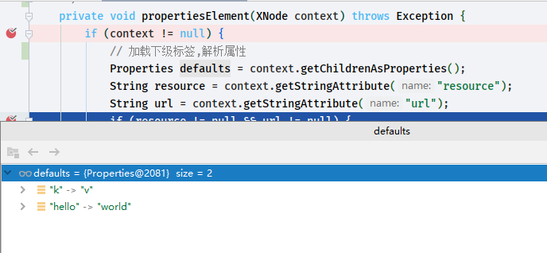

可以看到`defaults`就是我们配置的标签属性值了

为了测试后半段内容将`test.properties`添加一个属性

```properties
k=java

```

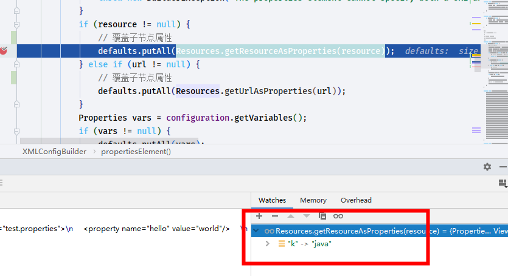

可以看到这段话

```java
            if (resource != null && url != null) {
                // 不会同时设置 resource 和 url 的属性值
                throw new BuilderException("The properties element cannot specify both a URL and a resource based property file reference.  Please specify one or the other.");
            }
            if (resource != null) {
                // 覆盖子节点属性
                defaults.putAll(Resources.getResourceAsProperties(resource));
            } else if (url != null) {
                // 覆盖子节点属性
                defaults.putAll(Resources.getUrlAsProperties(url));
            }
```

`defaults.putAll()`方法将会读取`properties`文件中的内容. 并且覆盖`<properties>`标签的子节点

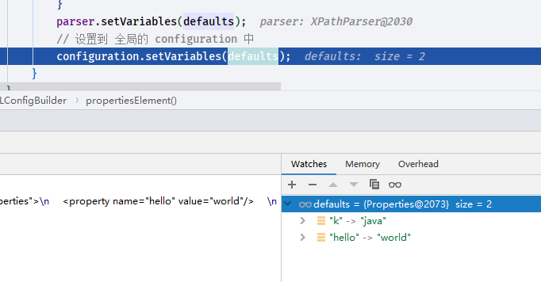

最终设置结果`k`的属性值修改了:happy:


## typeAliasesElement

- 别名加载,配置文件在下方,在debug阶段选择开启不同的别名方式进行源码查看
```xml
  <typeAliases>
<!--    <package name="com.huifer.mybatis.entity"/>-->
    <typeAlias type="com.huifer.mybatis.entity.Person" alias="Person"/>
  </typeAliases>
```
```java
private void typeAliasesElement(XNode parent) {
        if (parent != null) {
            for (XNode child : parent.getChildren()) {
                if ("package".equals(child.getName())) {
                    // 解析 package 标签
                    String typeAliasPackage = child.getStringAttribute("name");
                    configuration.getTypeAliasRegistry().registerAliases(typeAliasPackage);
                } else {
                    // 解析 typeAliases 标签
                    String alias = child.getStringAttribute("alias");
                    String type = child.getStringAttribute("type");
                    try {
                        Class<?> clazz = Resources.classForName(type);
                        // 别名注册
                        if (alias == null) {
                            typeAliasRegistry.registerAlias(clazz);
                        } else {
                            
                            typeAliasRegistry.registerAlias(alias, clazz);
                        }
                    } catch (ClassNotFoundException e) {
                        throw new BuilderException("Error registering typeAlias for '" + alias + "'. Cause: " + e, e);
                    }
                }
            }
        }
    }
```

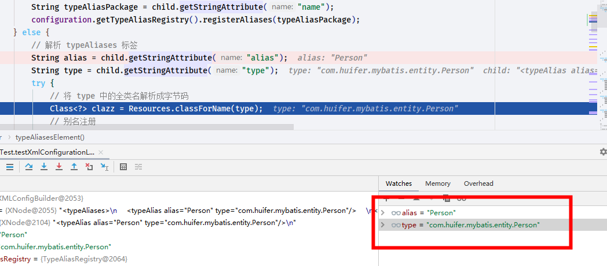

目前解析的内容为`Person`这个实体

- 别名加载方法

```java
    /**
     * 别名注册,
     * typeAliases 是一个map key=>别名,value=>字节码
     *
     * @param alias 别名名称
     * @param value 别名的字节码
     */
    public void registerAlias(String alias, Class<?> value) {
        if (alias == null) {
            throw new TypeException("The parameter alias cannot be null");
        }
        // issue #748
        String key = alias.toLowerCase(Locale.ENGLISH);
        if (typeAliases.containsKey(key) && typeAliases.get(key) != null && !typeAliases.get(key).equals(value)) {
            throw new TypeException("The alias '" + alias + "' is already mapped to the value '" + typeAliases.get(key).getName() + "'.");
        }
        typeAliases.put(key, value);
    }

```

完成了`properties`标签和`typeAliases`看一下此时的`configuration`是什么

通过下面的代码我们知道`properties`属性放置在` configuration.variables`

```java
            configuration.setVariables(defaults);
```

```java
    public void setVariables(Properties variables) {
        this.variables = variables;
    }
```


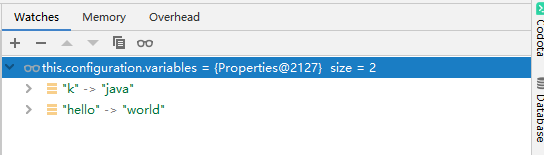

`typeAaliases`放在`this.configuration.typeAliasRegistry.typeAliases`中


## settingsAsProperties

- `org.apache.ibatis.builder.xml.XMLConfigBuilder#parseConfiguration`

- 设置 setting 标签下的属性相关代码

  ```java
              Properties settings = settingsAsProperties(root.evalNode("settings"));
              // vfs 虚拟文件相关属性
              loadCustomVfs(settings);
              // 日志实现类
              loadCustomLogImpl(settings);
  ```

  


```JAVA
    private Properties settingsAsProperties(XNode context) {
        if (context == null) {
            // 返回一个空的 Properties
            return new Properties();
        }
        Properties props = context.getChildrenAsProperties();
        // Check that all settings are known to the configuration class
        MetaClass metaConfig = MetaClass.forClass(Configuration.class, localReflectorFactory);
        for (Object key : props.keySet()) {
            if (!metaConfig.hasSetter(String.valueOf(key))) {
                throw new BuilderException("The setting " + key + " is not known.  Make sure you spelled it correctly (case sensitive).");
            }
        }
        return props;
    }
```

返回结果就是`Properties` 对象

- 修改`mybatis-config.xml`

  ```xml
  <setting name="logImpl" value="LOG4J"/>
  ```


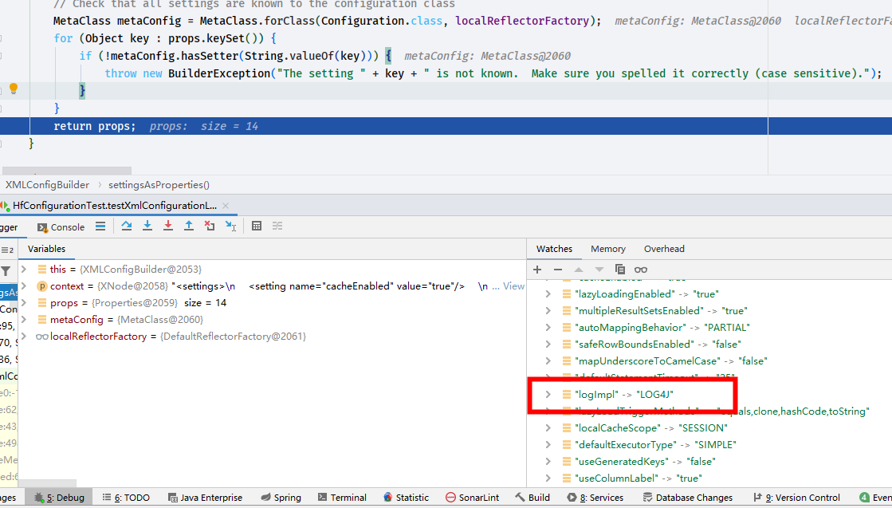


### loadCustomLogImpl

- `org.apache.ibatis.builder.xml.XMLConfigBuilder#loadCustomLogImpl`

```java
    private void loadCustomLogImpl(Properties props) {
        Class<? extends Log> logImpl = resolveClass(props.getProperty("logImpl"));
        configuration.setLogImpl(logImpl);
    }
```

- 熟悉的方法他来了

  ```java
      /**
       * 通过别名查询
       * @param alias
       * @param <T>
       * @return
       */
      protected <T> Class<? extends T> resolveClass(String alias) {
          if (alias == null) {
              return null;
          }
          try {
              return resolveAlias(alias);
          } catch (Exception e) {
              throw new BuilderException("Error resolving class. Cause: " + e, e);
          }
      }
  
  ```

  ```java
     protected <T> Class<? extends T> resolveAlias(String alias) {
          return typeAliasRegistry.resolveAlias(alias);
      }
  ```

  ```java
      /**
       * 获取别名的value
       *
       * @param string 别名名称
       * @param <T>
       * @return
       */
      @SuppressWarnings("unchecked")
      // throws class cast exception as well if types cannot be assigned
      public <T> Class<T> resolveAlias(String string) {
          try {
              if (string == null) {
                  return null;
              }
              // issue #748
              String key = string.toLowerCase(Locale.ENGLISH);
              Class<T> value;
              if (typeAliases.containsKey(key)) {
                  value = (Class<T>) typeAliases.get(key);
              } else {
                  value = (Class<T>) Resources.classForName(string);
              }
              return value;
          } catch (ClassNotFoundException e) {
              throw new TypeException("Could not resolve type alias '" + string + "'.  Cause: " + e, e);
          }
      }
  
  ```

  从别名`private final Map<String, Class<?>> typeAliases = new HashMap<>();`存储空间获取存储的实体直接返回

  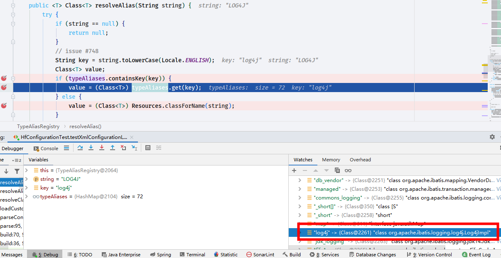

- 此时该日志为： `org.apache.ibatis.logging.log4j.Log4jImpl`


## pluginElement

- `org.apache.ibatis.builder.xml.XMLConfigBuilder#pluginElement`

- 准备一个插件类测试用

  ```java
  package com.huifer.mybatis.plugins;
  
  import org.apache.ibatis.plugin.Interceptor;
  import org.apache.ibatis.plugin.Invocation;
  import org.apache.ibatis.plugin.Plugin;
  
  import java.util.Properties;
  
  //@Intercepts({
  //        @Signature(
  //                type = Executor.class,
  //                method = "query",
  //                args = {MappedStatement.class, Object.class, RowBounds.class, ResultHandler.class}
  //        )
  //})
  public class TestPlugin implements Interceptor {
      @Override
      public Object intercept(Invocation invocation) throws Throwable {
  
          return invocation.proceed();
      }
  
      @Override
      public Object plugin(Object target) {
          return Plugin.wrap(target, this);
      }
  
      @Override
      public void setProperties(Properties properties) {
          System.out.println(properties);
      }
  }
  
  ```


修改 `mybatis-config.xml`

```xml
  <plugins>
    <plugin interceptor="com.huifer.mybatis.plugins.TestPlugin">
      <property name="testPlugins" value="tPl"/>
    </plugin>
  </plugins>
```


```java
    /**
     * 记载 plugins 标签内容
     * @param parent
     * @throws Exception
     */
    private void pluginElement(XNode parent) throws Exception {
        if (parent != null) {
            for (XNode child : parent.getChildren()) {
                //     <plugin interceptor="com.huifer.mybatis.plugins.TestPlugin"> 获取 interceptor 值
                String interceptor = child.getStringAttribute("interceptor");
                // 获取plugin 下面的 property 标签数据
                Properties properties = child.getChildrenAsProperties();
                Interceptor interceptorInstance = (Interceptor) resolveClass(interceptor).getDeclaredConstructor().newInstance();
                interceptorInstance.setProperties(properties);
                configuration.addInterceptor(interceptorInstance);
            }
        }
    }

```

先看`interceptor` 和 `properties` 

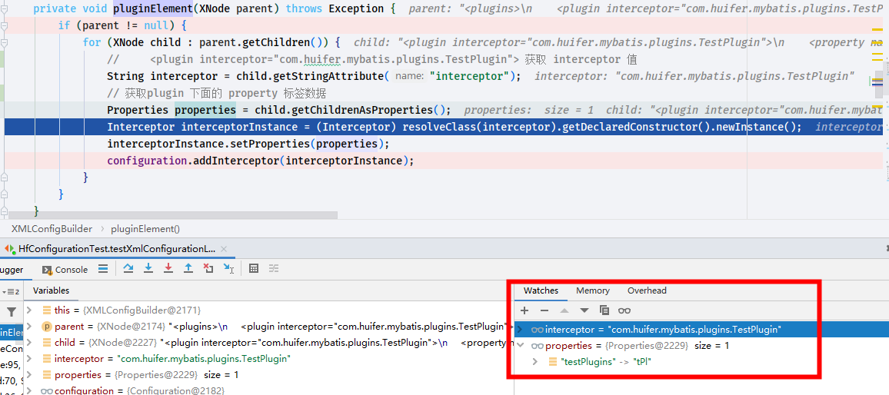


- `Interceptor interceptorInstance = (Interceptor) resolveClass(interceptor).getDeclaredConstructor().newInstance();`这段内容其实是通过反射获取对应的实例 ， 

- 注意：**`org.apache.ibatis.plugin.Interceptor`的`setProperties`方法是空的实现类需要实现. 现在的实现方式是输出参数`properties`**

```java
public interface Interceptor {

    Object intercept(Invocation invocation) throws Throwable;

    default Object plugin(Object target) {
        return Plugin.wrap(target, this);
    }

    default void setProperties(Properties properties) {
        // NOP
    }

}

```

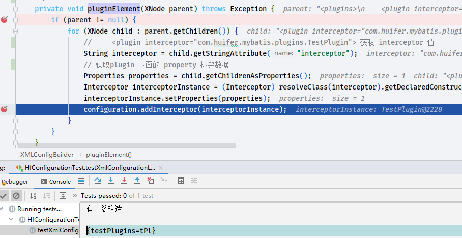

- 跳出这个方法，通过 debug 查看下面这个方法的返回值

  ```java
  this.configuration.getInterceptors()
  ```

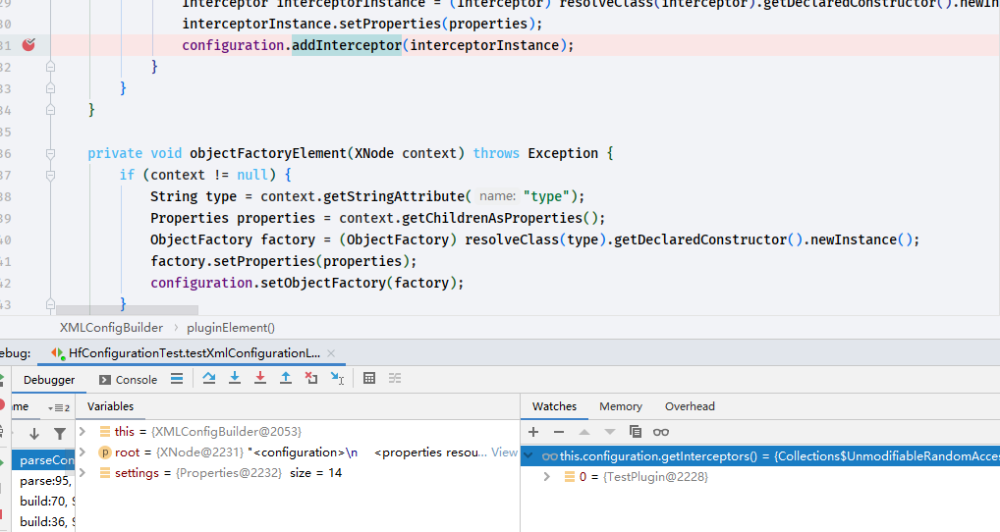

- 指向了我们刚才编写的插件类，为了测试在插件类编写

  ```java
  public String hello() {    return "hello-mybatis-plugins";}
  ```
- `((TestPlugin) this.configuration.getInterceptors().get(0)).hello()`

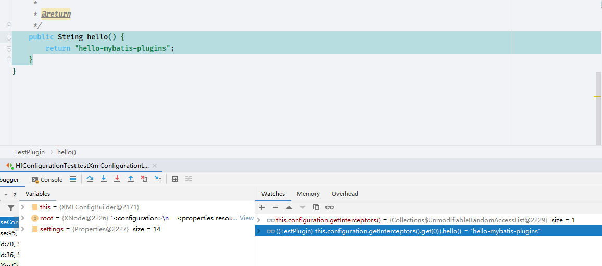