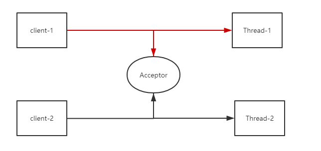
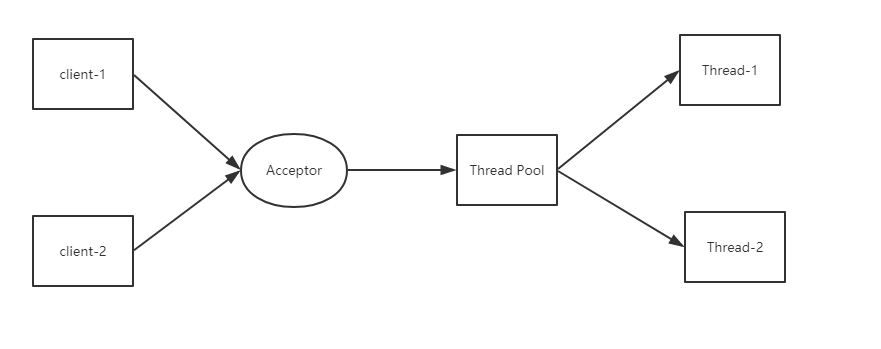
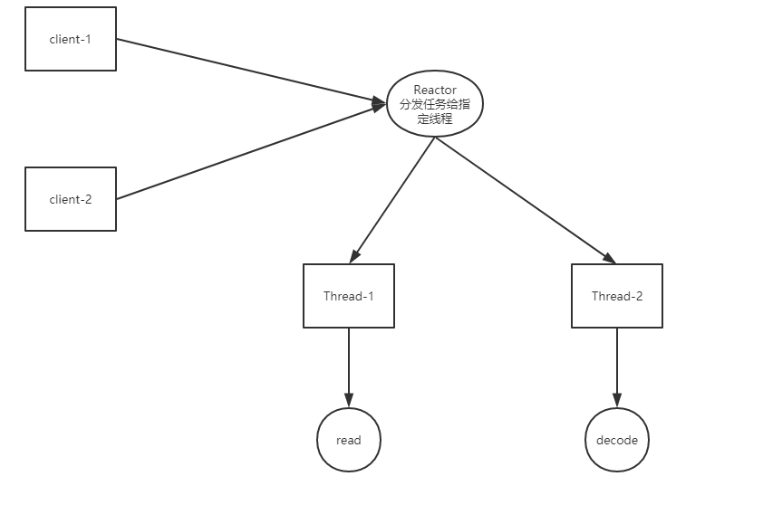
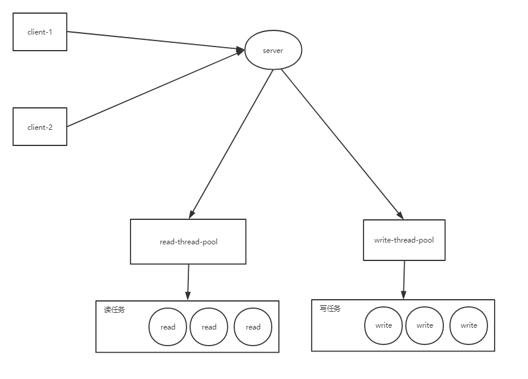

# Netty

## Netty是什么

> Netty is *an asynchronous event-driven network application framework* 
> for rapid development of maintainable high performance protocol servers & clients.

- 异步，事件驱动框架


## BIO/NIO/AIO

### BIO

#### 1:1同步阻塞IO模型




#### M:N同步阻塞IO模型




> 同步并阻塞，服务器实现模式为一个连接一个线程，即客户端有连接请求时服务器端就需要启动一个线程进行处理，如果这个连接不做任何事情会造成不必要的线程开销，当然可以通过线程池机制改善。


- 应用场景：适用于连接数目比较小且固定的架构，这种方式对服务器资源要求比较高，并发局限于应用中

### NIO




> 同步非阻塞，服务器实现模式为一个请求一个线程，即客户端发送的连接请求都会注册到多路复用器上，多路复用器轮询到连接有I/O请求时才启动一个线程进行处理。

- 应用场景：适用于连接数目多且连接比较短（轻操作）的架构，比如聊天服务器，并发局限于应用中，编程比较复杂

### AIO



> 异步非阻塞，服务器实现模式为一个有效请求一个线程，客户端的I/O请求都是由OS先完成了再通知服务器应用去启动线程进行处理，

- 应用场景：适用于连接数目多且连接比较长（重操作）的架构，比如相册服务器，充分调用OS参与并发操作，编程比较复杂


## FileChannel

```java
public class FileChannelDemo {

    public static void main(String[] args) throws IOException {
        File file = new File("E:\\mck\\javaBook-src\\netty\\src\\main\\resources\\data.data");
        if (!file.exists()) {
            file.createNewFile();
        }
        FileOutputStream fos = new FileOutputStream(file);
        FileChannel fc = fos.getChannel();

        ByteBuffer byteBuffer = ByteBuffer.allocate(1024);
        byteBuffer.put("hello , fileChannel\n".getBytes(StandardCharsets.UTF_8));

        byteBuffer.flip();
        fc.write(byteBuffer);
        byteBuffer.clear();

        byteBuffer.clear();
        fos.close();
        fc.close();


    }
}
```