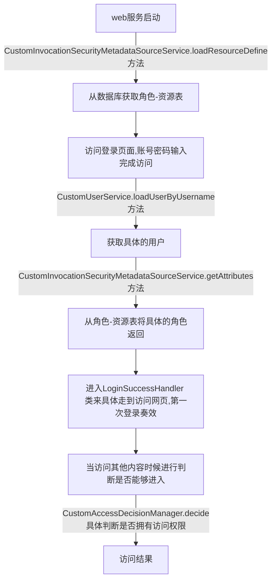

# security


## 文档&源码

[官方文档](https://docs.spring.io/spring-security/site/docs/5.2.0.BUILD-SNAPSHOT/reference/htmlsingle/)

[本文源码](https://github.com/wt1187982580/javaBook-src/tree/master/security)

## 依赖

本文在spring-boot中运行，

```xml
        <dependency>
            <groupId>org.springframework.boot</groupId>
            <artifactId>spring-boot-starter-security</artifactId>
        </dependency>
```

## 简单案例

- MVCconfig

  ```JAVA
  package com.huifer.security.config;
  
  import org.springframework.context.annotation.Configuration;
  import org.springframework.web.servlet.config.annotation.ViewControllerRegistry;
  import org.springframework.web.servlet.config.annotation.WebMvcConfigurationSupport;
  
  /**
   * 描述:
   * WebMvcConfig
   *
   * @author huifer
   * @date 2019-03-21
   */
  @Configuration
  public class WebMvcConfig extends WebMvcConfigurationSupport {
      @Override
      protected void addViewControllers(ViewControllerRegistry registry) {
          registry.addViewController("/login").setViewName("login");
      }
  }
  
  ```

  

- 实现 org.springframework.security.core.userdetails.UserDetailsService

```java
@Component
public class UserServiceForSecurity implements UserDetailsService {
    @Autowired
    private UserRepority userRepority;


    @Override
    public UserDetails loadUserByUsername(String s) throws UsernameNotFoundException {
        Specification<UserEntity> fu = (Specification<UserEntity>)
                (root, criteriaQuery, criteriaBuilder) -> criteriaBuilder.equal(
                        root.get("username"), s
                );
        UserEntity userEntity = userRepority.findOne(fu).get();
        if (userEntity == null) {
            throw new UsernameNotFoundException("用户名不存在");
        }
        RoleEntity roleEntity = userEntity.gettRoleById();

        List<SimpleGrantedAuthority> authorities = new ArrayList<>();

        authorities.add(new SimpleGrantedAuthority(roleEntity.getName()));

        return new User(userEntity.getUsername(), userEntity.getPassword(), authorities);
    }
}

```

- 配置 sucrityconfig

  ```JAVA
  package com.huifer.security.config;
  
  import com.huifer.security.service.UserServiceForSecurity;
  import org.springframework.context.annotation.Bean;
  import org.springframework.context.annotation.Configuration;
  import org.springframework.security.config.annotation.authentication.builders.AuthenticationManagerBuilder;
  import org.springframework.security.config.annotation.web.builders.HttpSecurity;
  import org.springframework.security.config.annotation.web.configuration.EnableWebSecurity;
  import org.springframework.security.config.annotation.web.configuration.WebSecurityConfigurerAdapter;
  import org.springframework.security.crypto.password.PasswordEncoder;
  
  /**
   * 描述:
   *
   * @author huifer
   * @date 2019-03-21
   */
  
  @Configuration
  @EnableWebSecurity
  public class WebSecurityConfig extends WebSecurityConfigurerAdapter {
  
  
      @Bean
      UserServiceForSecurity userService() {
          return new UserServiceForSecurity();
      }
  
      @Override
      protected void configure(AuthenticationManagerBuilder auth) throws Exception {
          auth.userDetailsService(userService()).passwordEncoder(
                  new PasswordEncoder() {
                      @Override
                      public String encode(CharSequence charSequence) {
                          // 自定义的加密或解密
                          return charSequence.toString();
                      }
  
                      @Override
                      public boolean matches(CharSequence charSequence, String s) {
                          // 自定义的加密或解密
                          return s.equals(charSequence.toString());
                      }
                  }
          );
      }
  
      @Override
      protected void configure(HttpSecurity http) throws Exception {
          http.authorizeRequests()
                  .anyRequest().authenticated() //任何请求,登录后可以访问
                  .and()
                  .formLogin()
                  .loginPage("/login")
                  .failureUrl("/login?error")
                  .permitAll() //登录页面用户任意访问
                  .and()
                  .logout().permitAll(); //注销行为
      }
  }
  
  ```

  


---

## 根据不同用户访问不同页面

### 表设计

- 用户表
  - username：用户名
  - password：用户密码
  - roles: 角色列表
- 角色表
  - roleName：角色名称
- 资源表
  - resourceName : 网页路由

- 资源-角色
  - roleid:角色id
  - resourceid:资源id

### 实体

- SysUser

  - 继承UserDetails 在UserDetailsService可以直接返回这个类不需要再去重新new

  - ```java
    package com.huifer.securityuserview.entity;
    
    import org.springframework.security.core.GrantedAuthority;
    import org.springframework.security.core.authority.SimpleGrantedAuthority;
    import org.springframework.security.core.userdetails.UserDetails;
    
    import javax.persistence.*;
    import java.util.*;
    
    /**
     *  用户类
     */
    @Entity
    public class SysUser implements UserDetails {
    
        @Id
        @GeneratedValue(strategy = GenerationType.IDENTITY)
        @Column(name = "id", unique = true, nullable = false)
        private Integer id;
        @Column(name = "username", length = 120)
        private String username;
    
        @Column(name = "password", length = 120)
        private String password;
    
        @ManyToMany(cascade = CascadeType.REFRESH,fetch = FetchType.EAGER)
        private List<SysRole> roles;
    
        public SysUser() {
        }
    
        @Override
        public boolean isAccountNonExpired() {
            return true;
        }
    
        @Override
        public boolean isAccountNonLocked() {
            return true;
        }
    
        @Override
        public boolean isCredentialsNonExpired() {
            return true;
        }
    
        @Override
        public boolean isEnabled() {
            return true;
        }
    
    
        @Override
        public Collection<? extends GrantedAuthority> getAuthorities() {
            Collection<GrantedAuthority> authorities = new ArrayList<>();
            List<SysRole> userRoles = this.getRoles();
            if(userRoles != null){
                for (SysRole role : userRoles) {
                    SimpleGrantedAuthority authority = new SimpleGrantedAuthority(role.getRoleName());
                    authorities.add(authority);
                }
            }
            return authorities;
        }
    
        public Integer getId() {
            return this.id;
        }
    
        public void setId(Integer id) {
            this.id = id;
        }
    
        public void setUsername(String username) {
            this.username = username;
        }
    
        public String getUsername() {
            return username;
        }
    
        public String getPassword() {
            return this.password;
        }
    
        public void setPassword(String password) {
            this.password = password;
        }
    
        public List<SysRole> getRoles() {
            return roles;
        }
    
        public void setRoles(List<SysRole> roles) {
            this.roles = roles;
        }
    
        @Override
        public String toString() {
            return "SysUser{" +
                    "id=" + id +
                    ", username='" + username + '\'' +
                    ", password='" + password + '\'' +
                    '}';
        }
    }
    
    ```

    

- SysRole

  - ```java
    @Entity
    public class SysRole {
        @Id
        @GeneratedValue(strategy= GenerationType.IDENTITY)
        @Column (name="id",length=10)
        private Integer id;
    
        @Column(name="roleName",length=100)
        private String roleName;
    
        public Integer getId() {
            return id;
        }
    
        public void setId(Integer id) {
            this.id = id;
        }
    
        public String getRoleName() {
            return roleName;
        }
    
        public void setRoleName(String roleName) {
            this.roleName = roleName;
        }
    
        @Override
        public String toString() {
            return "SysRole{" +
                    "id=" + id +
                    ", roleName='" + roleName + '\'' +
                    '}';
        }
    }
    ```

- SysResource

  - ```java
    package com.huifer.securityuserview.entity;
    
    import javax.persistence.*;
    
    /**
     *  资源类：本实例指的是访问路径
     */
    @Entity
    public class SysResource {
        @Id
        @GeneratedValue(strategy= GenerationType.IDENTITY)
        @Column (name="id",length=10)
        private Integer id;
    
        @Column(name="resourceName",length=1000)
        private String resourceName;
    
        public int getId() {
            return id;
        }
    
        public void setId(int id) {
            this.id = id;
        }
    
        public void setId(Integer id) {
            this.id = id;
        }
    
        public String getResourceName() {
            return resourceName;
        }
    
        public void setResourceName(String resourceName) {
            this.resourceName = resourceName;
        }
    
        @Override
        public String toString() {
            return "SysResource{" +
                    "id=" + id +
                    ", resourceName='" + resourceName + '\'' +
                    '}';
        }
    }
    ```

- SysResourceRole

  - ```java
    package com.huifer.securityuserview.entity;
    
    import javax.persistence.*;
    import java.util.Date;
    
    /**
     *  资源与角色中间表
     */
    @Entity
    public class SysResourceRole {
        @Id
        @GeneratedValue(strategy= GenerationType.IDENTITY)
        @Column (name="id",length=10)
        private int id;
    
        @Column(name="roleId",length=50)
        private String roleId;
    
        @Column(name="resourceId",length=50)
        private String resourceId;
    
    
        public int getId() {
            return id;
        }
    
        public void setId(int id) {
            this.id = id;
        }
    
        public String getRoleId() {
            return roleId;
        }
    
        public void setRoleId(String roleId) {
            this.roleId = roleId;
        }
    
        public String getResourceId() {
            return resourceId;
        }
    
        public void setResourceId(String resourceId) {
            this.resourceId = resourceId;
        }
    
        @Override
        public String toString() {
            return "SysResourceRole{" +
                    "id=" + id +
                    ", roleId='" + roleId + '\'' +
                    ", resourceId='" + resourceId + '\'' +
                    '}';
        }
    }
    ```


### service

- UserDetailsService

  ```java
  @Service
  public class CustomUserService implements UserDetailsService {
      @Autowired
      private SysUserRepository userRepority;
  
  
      @Override
      public UserDetails loadUserByUsername(String s) throws UsernameNotFoundException {
          SysUser userEntity = userRepority.findByUsername(s);
          if (userEntity == null) {
              throw new UsernameNotFoundException("用户名不存在");
          }
  
          return userEntity;
      }
  
  }
  ```

- FilterInvocationSecurityMetadataSource

  ```
  @Service
  public class CustomInvocationSecurityMetadataSourceService implements FilterInvocationSecurityMetadataSource {
  
      @Autowired
      private SysRoleRepository roleRepository;
  
      @Autowired
      private SysResourceRepository resourceRepository;
  
      /**
       * 权限和url映射
       */
      private static Map<String, Collection<ConfigAttribute>> resourceMap = null;
  
      @PostConstruct
      private void loadResourceDefine() {
          // 在Web服务器启动时，提取系统中的所有权限。
          List<SysRole> roleList = roleRepository.findAll();
  
          List<String> roleNameList = new ArrayList<String>();
          if (roleList != null && roleList.size() > 0) {
              for (SysRole role : roleList) {
                  roleNameList.add(role.getRoleName());
              }
          }
  
          resourceMap = new HashMap<String, Collection<ConfigAttribute>>();
          for (String roleName : roleNameList) {
              ConfigAttribute configAttribute = new SecurityConfig(roleName);
              List<String> urlList = new ArrayList<String>();
              List<SysResource> resourceList = resourceRepository.findByRoleName(roleName);
              if (resourceList != null && resourceList.size() > 0) {
                  for (SysResource resource : resourceList) {
                      urlList.add(resource.getResourceName());
                  }
              }
              for (String res : urlList) {
                  String url = res;
                  if (resourceMap.containsKey(url)) {
                      Collection<ConfigAttribute> value = resourceMap.get(url);
                      value.add(configAttribute);
                      resourceMap.put(url, value);
                  } else {
                      Collection<ConfigAttribute> atts = new ArrayList<ConfigAttribute>();
                      atts.add(configAttribute);
                      resourceMap.put(url, atts);
                  }
              }
          }
  
      }
  
      @Override
      public Collection<ConfigAttribute> getAllConfigAttributes() {
          return new ArrayList<ConfigAttribute>();
      }
  
      @Override
      public Collection<ConfigAttribute> getAttributes(Object object) throws IllegalArgumentException {
          // object 是用户请求的url
          FilterInvocation filterInvocation = (FilterInvocation) object;
          if (resourceMap == null) {
              loadResourceDefine();
          }
          Iterator<String> iterator = resourceMap.keySet().iterator();
          while (iterator.hasNext()) {
              String resURL = iterator.next();
              RequestMatcher requestMatcher = new AntPathRequestMatcher(resURL);
              if (requestMatcher.matches(filterInvocation.getHttpRequest())) {
                  return resourceMap.get(resURL);
              }
          }
          return null;
      }
  
      @Override
      public boolean supports(Class<?> arg0) {
          return true;
      }
  
  }
  ```

- AccessDecisionManager

  ```java
  package com.huifer.securityuserview.service;
  
  import org.springframework.security.access.AccessDecisionManager;
  import org.springframework.security.access.AccessDeniedException;
  import org.springframework.security.access.ConfigAttribute;
  import org.springframework.security.access.SecurityConfig;
  import org.springframework.security.authentication.InsufficientAuthenticationException;
  import org.springframework.security.core.Authentication;
  import org.springframework.security.core.GrantedAuthority;
  import org.springframework.stereotype.Service;
  
  import java.util.Collection;
  import java.util.Iterator;
  /**
   * 描述:
   *
   * @author huifer
   * @date 2019-03-24
   */
  
  @Service
  public class CustomAccessDecisionManager implements AccessDecisionManager {
  
      @Override
      public void decide(Authentication authentication, Object object, Collection<ConfigAttribute> configAttributes) throws AccessDeniedException, InsufficientAuthenticationException {
          if (configAttributes == null) {
              return;
          }
          Iterator<ConfigAttribute> iterator = configAttributes.iterator();
          while (iterator.hasNext()) {
              ConfigAttribute configAttribute = iterator.next();
              String needRole = ((SecurityConfig) configAttribute).getAttribute();
              for (GrantedAuthority grantedAuthority : authentication.getAuthorities()) {
                  if (needRole.trim().equals(grantedAuthority.getAuthority().trim())) {
                      return;
                  }
              }
          }
          throw new AccessDeniedException("权限不足");
      }
  
      @Override
      public boolean supports(ConfigAttribute attribute) {
          return true;//都要设为true
  
      }
  
      @Override
      public boolean supports(Class<?> clazz) {
          return true;
      }
  
  
  }
  ```

### 配置


- webSecurityConfig

  ```java
  package com.huifer.securityuserview.config;
  
  import com.huifer.securityuserview.service.CustomUserService;
  import org.springframework.beans.factory.annotation.Autowired;
  import org.springframework.context.annotation.Bean;
  import org.springframework.context.annotation.Configuration;
  import org.springframework.security.config.annotation.authentication.builders.AuthenticationManagerBuilder;
  import org.springframework.security.config.annotation.web.builders.HttpSecurity;
  import org.springframework.security.config.annotation.web.configuration.EnableWebSecurity;
  import org.springframework.security.config.annotation.web.configuration.WebSecurityConfigurerAdapter;
  import org.springframework.security.crypto.password.PasswordEncoder;
  import org.springframework.security.web.access.AccessDeniedHandlerImpl;
  
  /**
   * 描述:
   *
   * @author huifer
   * @date 2019-03-21
   */
  
  @Configuration
  @EnableWebSecurity
  public class WebSecurityConfig extends WebSecurityConfigurerAdapter {
  
      @Autowired
      private CustomUserService customUserService;
  
  
  
      @Override
      protected void configure(AuthenticationManagerBuilder auth) throws Exception {
          auth.userDetailsService(customUserService).passwordEncoder(
                  new PasswordEncoder() {
                      @Override
                      public String encode(CharSequence charSequence) {
                          return charSequence.toString();
                      }
  
                      @Override
                      public boolean matches(CharSequence charSequence, String s) {
                          return s.equals(charSequence.toString());
                      }
                  }
          );
      }
  
      @Override
      protected void configure(HttpSecurity http) throws Exception {
          http.authorizeRequests()
                  .anyRequest().authenticated() //任何请求,登录后可以访问
                  .and()
                  .formLogin()
                  .loginPage("/login")
                  .successHandler(loginSuccessHandler())
                  .failureUrl("/login?error")
                  .permitAll() //登录页面用户任意访问
                  .and()
                  .logout().permitAll(); //注销行为
  
          http.exceptionHandling().accessDeniedHandler(new AccessDeniedHandlerImpl()).accessDeniedPage("/deny");
  
      }
  
      @Bean
      public LoginSuccessHandler loginSuccessHandler(){
          return new LoginSuccessHandler();
      }
  }
  ```

- 自定义路由分配

  ```java
  public class LoginSuccessHandler extends SavedRequestAwareAuthenticationSuccessHandler {
  
      @Autowired
      private SysResourceRepository resourceRepository;
  
      private RedirectStrategy redirectStrategy = new DefaultRedirectStrategy();
  
      @Override
      public void onAuthenticationSuccess(HttpServletRequest request, HttpServletResponse response, Authentication authentication) throws IOException,
              ServletException {
          System.out.println(authentication);
  
          System.out.println(authentication.getPrincipal());
          //获得授权后可得到用户信息
          SysUser user = (SysUser) authentication.getPrincipal();
  
          //输出登录提示信息
          System.out.println("用户名： " + user.getUsername());
  
          System.out.println("用户密码： " + user.getPassword());
  
          System.out.println("角色列表：" + authentication.getAuthorities());
  
          System.out.println("IP信息 :" + authentication.getDetails());
  
          System.out.println("是否被授权 :" + authentication.isAuthenticated());
  
          //登录成功后跳转到默认对应的页面
          String targetUrl = "/home";
          for (GrantedAuthority grantedAuthority : authentication.getAuthorities()) {
              String roleName = grantedAuthority.getAuthority();
              switch (roleName) {
                  case "ADMIN":
                      targetUrl = "/admin";
                      break;
                  case "VIP":
                      targetUrl = "/vip";
                      break;
              }
          }
          redirectStrategy.sendRedirect(request, response, targetUrl);
      }
  }
  ```

- AbstractSecurityInterceptor

  ```java
  package com.huifer.securityuserview.config;
  
  import com.huifer.securityuserview.service.CustomAccessDecisionManager;
  import org.springframework.beans.factory.annotation.Autowired;
  import org.springframework.security.access.SecurityMetadataSource;
  import org.springframework.security.access.intercept.AbstractSecurityInterceptor;
  import org.springframework.security.access.intercept.InterceptorStatusToken;
  import org.springframework.security.web.FilterInvocation;
  import org.springframework.security.web.access.intercept.FilterInvocationSecurityMetadataSource;
  import org.springframework.stereotype.Service;
  
  import javax.servlet.*;
  import java.io.IOException;
  
  /**
   * 描述:
   *
   * @author huifer
   * @date 2019-03-24
   */
  @Service
  public class MyFilterSecurityInterceptor extends AbstractSecurityInterceptor implements Filter {
  
  
      @Autowired
      private FilterInvocationSecurityMetadataSource securityMetadataSource;
  
      @Autowired
      public void setMyAccessDecisionManager(CustomAccessDecisionManager myAccessDecisionManager) {
          super.setAccessDecisionManager(myAccessDecisionManager);
      }
  
  
      @Override
      public void init(FilterConfig filterConfig) throws ServletException {
  
      }
  
      @Override
      public void doFilter(ServletRequest request, ServletResponse response, FilterChain chain) throws IOException, ServletException {
  
          FilterInvocation fi = new FilterInvocation(request, response, chain);
          invoke(fi);
      }
  
  
      public void invoke(FilterInvocation fi) throws IOException, ServletException {
          InterceptorStatusToken token = super.beforeInvocation(fi);
          try {
              fi.getChain().doFilter(fi.getRequest(), fi.getResponse());
          } finally {
              super.afterInvocation(token, null);
          }
      }
  
  
      @Override
      public void destroy() {
  
      }
  
      @Override
      public Class<?> getSecureObjectClass() {
          return FilterInvocation.class;
  
      }
  
      @Override
      public SecurityMetadataSource obtainSecurityMetadataSource() {
          return this.securityMetadataSource;
      }
  }
  ```

### 执行流程



