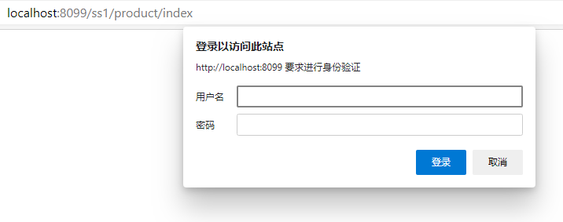

# HTTP BASIC 
spring-security 使用 http-basic 认证
- 最初的配置如下
```xml
  <security:http>
    <security:http-basic/>
  </security:http>
```
1. 配置拦截 url
```xml
    <security:intercept-url pattern="/**"  access="isFullyAuthenticated()"/>
```
此时再访问 `product/index` 需要登录



登录名密码从何而来？
这是一段 spring-security 5.x 以后的配置 这个密码需要手动计算出来  4.x 版本的可以直接写密码 ， 千万不要忘记加入 `BCryptPasswordEncoder` bean 4.x 不需要
```xml
  <bean name="passwordEncoder" class="org.springframework.security.crypto.bcrypt.BCryptPasswordEncoder"></bean>
```
```xml
  <security:authentication-manager>
    <security:authentication-provider>
      <security:user-service>
        <security:user name="huifer" password="$2a$10$IFWSAJgpUEt4QSS3sMpw1uxZwxI7ozUgmx0NM/ZAJpHpzMiv8JrGG" authorities="ROLE_USER"/>
      </security:user-service>
    </security:authentication-provider>
  </security:authentication-manager>
```
- 计算方式
```java

import org.springframework.security.crypto.bcrypt.BCryptPasswordEncoder;

public class MainController {
    public static void main(String[] args) {
        BCryptPasswordEncoder b = new BCryptPasswordEncoder();
        String str = b.encode("123");
        System.out.println("Encoding " + str);
    }
}

```