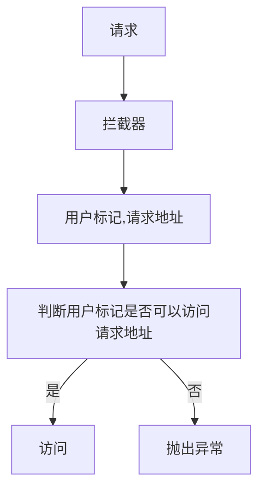

# SpringBoot整合Shiro
本章将介绍SpringBoot和Shiro的基础整合过程。 


在传统Web开发中关于权限验证一般会通过拦截器或者过滤器进行处理，大致处理流程如下：



在传统开发中可以发现使用拦截器或过滤器做为进入请求处理前的最后一步，在这一步中会进行权限控制，同样的在Shiro中也提供了这种处理方式。在maven依赖中添加如下依赖：

```xml
<dependency>
    <groupId>org.apache.shiro</groupId>
    <artifactId>shiro-spring-boot-starter</artifactId>
    <version>1.7.1</version>
</dependency>
```

在添加这项依赖后需要回顾一个简单Shiro项目中关于权限操作需要哪些内容，最重要的是SecurityManager和Realm，在web开发中这两个类同样很重要。首先SpringBoot一般用于web项目开发，本章也是围绕Web开发中的Shiro使用进行实战，因此SecurityManager需要找到Web开发中的实现类，具体实现类是org.apache.shiro.web.mgt.DefaultWebSecurityManager，在SpringBoot中需要将其交给Spring管理，具体代码如下：

```java
@Bean
public DefaultWebSecurityManager defaultWebSecurityManager(
    @Autowired Realm realm
) {
  DefaultWebSecurityManager defaultWebSecurityManager = new DefaultWebSecurityManager();
  defaultWebSecurityManager.setRealm(realm);
  return defaultWebSecurityManager;
}
```

通过这样一个步骤就完成了SecurityManager的处理，在常规Shiro开发中SecurityManager需要使用到Realm对象同样的DefaultWebSecurityManager也需要，在Spring中可以通过@Autowired的方式进行自动注入，不过现在还未变现这个Bean实例，下面就创建一个Realm对象并且将其实例化交给Spring进行管理，首先实现AuthorizingRealm接口，类名为CustomerRealm，具体代码如下：

```java
public class CustomerRealm extends AuthorizingRealm {

  @Override
  protected AuthenticationInfo doGetAuthenticationInfo(
      AuthenticationToken token) throws AuthenticationException {
    return null;
  }

  @Override
  protected AuthorizationInfo doGetAuthorizationInfo(
      PrincipalCollection principals) {
    return null;
  }
}
```

完成基本实现类编写后需要编写Bean，具体代码如下：

```java
@Bean
public Realm realm() {
  return new CustomerRealm();
}
```

完成SecurityManager和Realm对象的实例化编写后就可以编写最重要的Shiro过滤器了，具体代码如下：

```java
@Bean
public ShiroFilterFactoryBean shiroFilterFactoryBean(
    @Autowired DefaultWebSecurityManager defaultWebSecurityManager
) {
  ShiroFilterFactoryBean shiroFilterFactoryBean = new ShiroFilterFactoryBean();
  shiroFilterFactoryBean.setSecurityManager(defaultWebSecurityManager);
  // 设置限制的资源
  Map<String, String> map = new HashMap<>();
  // 需要进行验证
  map.put("/authc", "authc");
  // 表示资源不需要验证
  map.put("/anon", "anon");
  shiroFilterFactoryBean.setFilterChainDefinitionMap(map);
  return shiroFilterFactoryBean;
}
```

在这里编写的是一个工厂Bean，具体类是ShiroFilterFactoryBean，Spring会将其自动创建为ShiroFilter。在上述代码中可以发现对于shiroFilterFactoryBean变量设置了filterChainDefinitionMap成员变量的数据设置，在这里需要对key和value进行说明，key表示的是一个资源，本例中为一个url地址，value表示验证方式，常见验证方式见表：

| 过滤器名称        | 过滤器类                                                     | 描述                                                     |
| ----------------- | ------------------------------------------------------------ | -------------------------------------------------------- |
| anon              | org.apache.shiro.web.filter.authc.AnonymousFilter | 匿名过滤器                                               |
| authc             | org.apache.shiro.web.filter.authc.FormAuthenticationFilter | 如果继续操作，需要做对应的表单验证否则不能通过           |
| authcBasic        | org.apache.shiro.web.filter.authc.BasicHttpAuthenticationFilter | 基本http验证过滤，如果不通过，跳转屋登录页面             |
| logout            | org.apache.shiro.web.filter.authc.LogoutFilter | 登录退出过滤器                                           |
| noSessionCreation | org.apache.shiro.web.filter.session.NoSessionCreationFilter | 没有session创建过滤器                                    |
| perms             | org.apache.shiro.web.filter.authz.PermissionsAuthorizationFilter | 权限过滤器                                               |
| port              | org.apache.shiro.web.filter.authz.PortFilter | 端口过滤器，可以设置是否是指定端口如果不是跳转到登录页面 |
| rest              | org.apache.shiro.web.filter.authz.HttpMethodPermissionFilter             |http方法过滤器，可以指定如post不能进行访问等|
| roles             | org.apache.shiro.web.filter.authz.RolesAuthorizationFilter | 角色过滤器，判断当前用户是否指定角色                     |
| ssl               | org.apache.shiro.web.filter.authz.SslFilter | 请求需要通过ssl，如果不是跳转回登录页                    |
| user              | org.apache.shiro.web.filter.authc.UserFilter | 如果访问一个已知用户，比如记住我功能，走这个过滤器       |

在上述内容中最为常用的是anon和authc。