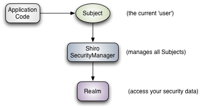
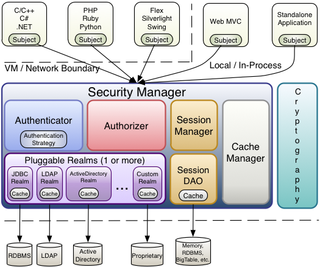

# 初识Shiro

本节将对Shiro做基本认识，主要讲述Shiro中的架构和关键对象。


## Shiro 介绍

Shiro项目的全名是Apache Shiro，后续简称Shiro，是一个关于安全的框架，在Shiro[官网](https://shiro.apache.org/)具体介绍如下：

> **Apache Shiro™** is a powerful and easy-to-use Java security framework that performs authentication, authorization, cryptography, and session management. With Shiro’s easy-to-understand API, you can quickly and easily secure any application – from the smallest mobile applications to the largest web and enterprise applications.
>
> from: https://shiro.apache.org/

在这段介绍中可以看出Shiro是一个功能强大且易用的Java安全框架，它包含了身份验证、授权、加密和会话管理等功能。并且Shiro具有易于理解的API，可以快速轻松的保护任何应用程序。


## 为什么使用Shiro

本节将解释为什么使用Shiro框架，在使用Shiro的主要原因中包含如下几点：

1. 易于使用：在Shiro中因为具备易于理解的API定义和优秀的抽象从而使开发在在使用Shiro时十分方便易于上手。
2. 全面：Shiro提供了关于权限认证的各类基础模型定义并对其进行了抽象涵盖的内容相对全面。
3. 灵活：Shiro几乎可以在任何程序环境中执行工作，包括且不限于Java开发中的Spring、EJB等。


## Shiro 处理流程

本节将对Shiro的处理流程做简单说明，在Shiro官方文档中可以搜索到下图：



> from:https://shiro.apache.org/architecture.html 

在上图中可以发现Shiro中整体处理流程是通过Subject对象、SecurityManager对象和Realm对象组成。

1. Subject对象可以理解为用户。
2. SecurityManager对象可以理解为安全管理器，主要目的是管理Subject对象。
3. Realm对象可以理解为权限资源。


## Shiro 架构说明

本节将对Shiro的架构进行说明，在Shiro的官方文档中可以搜索到下图。



> from:https://shiro.apache.org/architecture.html 

在上图中可以发现在Shiro架构中分为如下几个内容：

1. **Subject**：主题。一般情况下是用户。
2. **Security Manager**：安全管理器，它是整个Shiro的核心
3. **Authenticator**：认证器。
   1. **Authentication Strategy**：认证策略。
4. **Authorizer**：授权器。
5. **SessionManager**：Session 管理器。
   1. **SessionDAO**：Session 持久操作
6. **CacheManager**：缓存管理器
7. **Cryptography**：密码学相关内容，主要负责加密解密。
8. **Realms**：领域，权限。

在Shiro中主要的对象就是上面八个，在后续的开发过程中会经常使用到，它们组成了Shiro的各种功能


### 认证顺序

下面将对Shiro的基本认证过程做说明，在Shiro的官网可以看到如下图片：


> from: https://shiro.apache.org/authentication.html

从上图中可以发现关于Shiro的认证过程包含五个步骤：

1. 应用程序调用Subject.login方法将token作为参数构件Subject对象。
2. 将步骤一中得到的Subject对象传递到SecurityManager中。
3. 在SecurityManager中将认证交给Authenticator对象处理。
4. 在Authenticator中具体的处理是由AuthenticationStrategy认证策略进行实际处理。
5. 在AuthenticationStrategy处理过程中回去寻找Realm数据信息对其进行认证。


### 授权顺序

下面将对Shiro的基本授权过程做说明，在Shiro的官网可以看到如下图片：


> from: https://shiro.apache.org/authorization.html

从上图中可以发现关于Shiro的授权过程包含四个步骤：

1. Subject对象调用`isPermitted*`、`hasRole*`、`checkRole*`或`checkPermission*`方法。
2. SecurityManager进行授权判断，具体处理将委托Authorizer类进行。
3. 在Authorizer处理过程中会依赖Realm相关操作。
4. Realm检查相关配置。


## 第一个 Shiro 程序

在前文对Shiro做了一些基本概念的介绍，本节将使用Shiro搭建一个简单的用例，主要实现认证相关处理操作。在确认目标后需要率先选择Shiro的版本，在本文编写期间Shiro的版本更新到了1.7.1，具体maven依赖如下：

```xml
<dependency>
    <groupId>org.apache.shiro</groupId>
    <artifactId>shiro-core</artifactId>
    <version>1.7.1</version>
</dependency>
```

关于JDK的版本具体信息如下：

```
openjdk version "1.8.0_282"
OpenJDK Runtime Environment Corretto-8.282.08.1 (build 1.8.0_282-b08)
OpenJDK 64-Bit Server VM Corretto-8.282.08.1 (build 25.282-b08, mixed mode)
```

在完成这基本的技术选型后需要进行工程创建，本例采用的是maven进行管理，具体的POM文件内容如下：

```xml
<?xml version="1.0" encoding="UTF-8"?>
<project xmlns="http://maven.apache.org/POM/4.0.0"
    xmlns:xsi="http://www.w3.org/2001/XMLSchema-instance"
    xsi:schemaLocation="http://maven.apache.org/POM/4.0.0 http://maven.apache.org/xsd/maven-4.0.0.xsd">
    <parent>
        <artifactId>shiro-book</artifactId>
        <groupId>com.github.huifer</groupId>
        <version>1.0-SNAPSHOT</version>
    </parent>
    <modelVersion>4.0.0</modelVersion>

    <artifactId>just-shiro</artifactId>

    <properties>
        <maven.compiler.source>8</maven.compiler.source>
        <maven.compiler.target>8</maven.compiler.target>
    </properties>

    <dependencies>
        <!-- https://mvnrepository.com/artifact/org.apache.shiro/shiro-core -->
        <dependency>
            <groupId>org.apache.shiro</groupId>
            <artifactId>shiro-core</artifactId>
            <version>1.7.1</version>
        </dependency>

    </dependencies>
    <build>
       <resources>
           <resource>
               <directory>src/main/resources</directory>
               <includes>
                   <include>**/*.ini</include>
               </includes>
           </resource>
       </resources>
    </build>
</project>
```

**注意: 这里采用的是父子工程，如果不采用父子工程请直接使用下面两个依赖**

```xml
<dependencies>
    <!-- https://mvnrepository.com/artifact/org.apache.shiro/shiro-core -->
    <dependency>
        <groupId>org.apache.shiro</groupId>
        <artifactId>shiro-core</artifactId>
        <version>1.7.1</version>
    </dependency>

</dependencies>
<build>
   <resources>
       <resource>
           <directory>src/main/resources</directory>
           <includes>
               <include>**/*.ini</include>
           </includes>
       </resource>
   </resources>
</build>
```
在工程创建完成后需要先编写一个配置文件，该配置文件用于存放账号密码，文件名可以任意设置，在本例中使用的文件名为`shiro.ini`，该文件需要放在`resources`文件夹下，具体内容如下：

```ini
[users]
admin=admin
userAdd=userAdd
```

在该文件中定义了两个用户，等号左侧是用户名，等号右侧是密码，在后续的测试用例中将会使用。下面编写一个测试方法，具体代码如下：

```java
import org.apache.shiro.SecurityUtils;
import org.apache.shiro.authc.UsernamePasswordToken;
import org.apache.shiro.mgt.DefaultSecurityManager;
import org.apache.shiro.realm.text.IniRealm;
import org.apache.shiro.subject.Subject;

public class TestAuthenticator {
  public static void main(String[] args) {
    // 1. 创建安全管理器对象
    DefaultSecurityManager securityManager = new DefaultSecurityManager();
    // 2. 设置 realm 数据
    securityManager.setRealm(new IniRealm("classpath:shiro.ini"));
    // 3. 设置安全工具类相关数据
    SecurityUtils.setSecurityManager(securityManager);
    // 4. 从安全工具类中获取 subject 对象
    Subject subject = SecurityUtils.getSubject();
    // 5. 创建令牌
    UsernamePasswordToken usernamePasswordToken = new UsernamePasswordToken("admin", "admin");
    // 6. 登陆
    // 认证状态
    boolean authenticated = subject.isAuthenticated();
    System.out.println("登录前的认证状态" + authenticated);
    subject.login(usernamePasswordToken);
    authenticated = subject.isAuthenticated();
    System.out.println("登录后的认证状态" + authenticated);
  }
}
```

在边编写完成上输代码后可以尝试执行改代码，执行结果如下：

```
登录前的认证状态false
登录后的认证状态true
```

在这个简单的Shiro用例中主要执行的操作有如下六个步骤：

1. 创建默认的安全管理器对象，其本质实际上是SecurityManager。
2. 设置Realm数据，本例采用的是静态配置。
3. 安全工具类中设置安全管理器。
4. 从安全工具类中提取Subject对象。
5. 创建令牌，此时的令牌采用的是账号密码的形式。
6. 进行登陆操作，主要执行`subject.login`方法，参数是令牌。

通过上述六个操作可以制作一个简单的用户登陆验证，下面将模拟用户名错误，密码错误从而了解Shiro中的两个基本异常。首先将UsernamePasswordToken构造器中的第一个参数用户名任意修改，修改后内容如下：

```java
UsernamePasswordToken usernamePasswordToken = new UsernamePasswordToken("admin1", "admin");
```

在修改后执行程序控制台输出内容如下：

```java
Exception in thread "main" org.apache.shiro.authc.UnknownAccountException: Realm [org.apache.shiro.realm.text.IniRealm@5b80350b] was unable to find account data for the submitted AuthenticationToken [org.apache.shiro.authc.UsernamePasswordToken - admin1, rememberMe=false].
	at org.apache.shiro.authc.pam.ModularRealmAuthenticator.doSingleRealmAuthentication(ModularRealmAuthenticator.java:184)
	at org.apache.shiro.authc.pam.ModularRealmAuthenticator.doAuthenticate(ModularRealmAuthenticator.java:273)
	at org.apache.shiro.authc.AbstractAuthenticator.authenticate(AbstractAuthenticator.java:198)
	at org.apache.shiro.mgt.AuthenticatingSecurityManager.authenticate(AuthenticatingSecurityManager.java:106)
	at org.apache.shiro.mgt.DefaultSecurityManager.login(DefaultSecurityManager.java:275)
	at org.apache.shiro.subject.support.DelegatingSubject.login(DelegatingSubject.java:260)
	at com.github.huifer.shiro.TestAuthenticator.main(TestAuthenticator.java:31)

```

此时可以发现出现了异常，该异常表示的就是用户名错误，具体异常对象是UnknownAccountException。下面将模拟密码错误的异常，将UsernamePasswordToken构造器中的第二个参数密码任意修改，修改后内容如下：

```java
UsernamePasswordToken usernamePasswordToken = new UsernamePasswordToken("admin", "admin1");
```

在修改后执行程序控制台输出内容如下：

```java
Exception in thread "main" org.apache.shiro.authc.IncorrectCredentialsException: Submitted credentials for token [org.apache.shiro.authc.UsernamePasswordToken - admin, rememberMe=false] did not match the expected credentials.
	at org.apache.shiro.realm.AuthenticatingRealm.assertCredentialsMatch(AuthenticatingRealm.java:603)
	at org.apache.shiro.realm.AuthenticatingRealm.getAuthenticationInfo(AuthenticatingRealm.java:581)
	at org.apache.shiro.authc.pam.ModularRealmAuthenticator.doSingleRealmAuthentication(ModularRealmAuthenticator.java:180)
	at org.apache.shiro.authc.pam.ModularRealmAuthenticator.doAuthenticate(ModularRealmAuthenticator.java:273)
	at org.apache.shiro.authc.AbstractAuthenticator.authenticate(AbstractAuthenticator.java:198)
	at org.apache.shiro.mgt.AuthenticatingSecurityManager.authenticate(AuthenticatingSecurityManager.java:106)
	at org.apache.shiro.mgt.DefaultSecurityManager.login(DefaultSecurityManager.java:275)
	at org.apache.shiro.subject.support.DelegatingSubject.login(DelegatingSubject.java:260)
	at com.github.huifer.shiro.TestAuthenticator.main(TestAuthenticator.java:31)
```

此时可以发现出现了异常，该异常表示的就是密码验证错误，具体异常对象是IncorrectCredentialsException。


