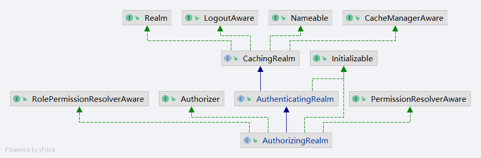

# 自定义 Realm 
本节将介绍在Shiro中如何自定义Realm. 

## 实现自定义认证
在Shiro中关于Realm的认证和授权操作分别由下面两方法负责：
1. 认证Realm： org.apache.shiro.realm.AuthenticatingRealm.doGetAuthenticationInfo
2. 授权Realm: org.apache.shiro.realm.AuthorizingRealm.doGetAuthorizationInfo

在实际开发中如果想要自定义Realm的实现只需要继承AuthorizingRealm类即可，并不需要继承上述的两个类，原因是AuthorizingRealm类继承了AuthenticatingRealm。具体继承关系如图所示：



在整理清楚自定义实现方法后下面开始代码编写，创建自定义Realm类，类名为CustomerRealm，具体代码如下：

```java
public class CustomerRealm extends AuthorizingRealm {

  private static final Logger log = LoggerFactory.getLogger(CustomerRealm.class);

  /**
   * 授权
   */
  @Override
  protected AuthorizationInfo doGetAuthorizationInfo(
      PrincipalCollection principals) {
    return null;
  }

  /**
   * 认证
   *
   */
  @Override
  protected AuthenticationInfo doGetAuthenticationInfo(AuthenticationToken token)
      throws AuthenticationException {

    return null;
  }
}
```

在这样一段代码中开发者需要在其中填写自定义的处理逻辑，下面对认证过程的自定义处理进行编写。在认证中最简单的处理方式可以是用户名密码校验，那么在doGetAuthenticationInfo方法中需要解决的问题是如何获取用户名和密码，首先进行用户名获取，在AuthenticationToken接口中提供了getPrincipal方法，该方法就是用于获取用户名的，但是返回值是Object，通常情况下用户名是String类型，因此需要做一个转换，关于用户名的验证代码如下：

```java
Object principal = token.getPrincipal();
if (String.valueOf(principal).equals("admin")) {
  return null;
}
return null;
```

在上述代码中通过硬编码的方式认为用户名必是admin才通过，在上述代码中即便用户名验证通过返回值还是null，下面要对返回值进行处理，返回对象是AuthenticationInfo接口，在Shiro中AuthenticationInfo接口有一个简单实现，这个实现类是SimpleAuthenticationInfo，在这里就直接采用该类作为返回值，下面对SimpleAuthenticationInfo的构造函数进行说明，先看构造函数的代码：

```java
public SimpleAuthenticationInfo(Object principal, Object credentials, String realmName) {
    this.principals = new SimplePrincipalCollection(principal, realmName);
    this.credentials = credentials;
}
```

在这个构造函数中需要传递三个参数三个参数的含义如下：

1. principal：该参数表示用户名。
2. credentials：该参数表示密码。
3. realmName：该参数表示Realm。

在上述三个参数中principal应该填写token中所携带的数据，credentials应该携带正确的密码，realmName填写具体的Realm，如果不确定可以使用this.getName作为默认值。明确这些内容后下面将代码补充完整，补充后代码如下：

```
@Override
protected AuthenticationInfo doGetAuthenticationInfo(AuthenticationToken token)
    throws AuthenticationException {
  Object principal = token.getPrincipal();
  log.info("username = [{}]", principal);
  if (String.valueOf(principal).equals("admin")) {
    SimpleAuthenticationInfo simpleAuthenticationInfo = new SimpleAuthenticationInfo(principal,
        "admin", getName());
    return simpleAuthenticationInfo;
  }
  return null;
}
```

完成简单的用户名验证后编写测试用例，具体测试用例方法如下：

```java
@Test
public void testCustomerRealm(){
  DefaultSecurityManager defaultSecurityManager = new DefaultSecurityManager();
  defaultSecurityManager.setRealm(new CustomerRealm());
  SecurityUtils.setSecurityManager(defaultSecurityManager);
  Subject subject = SecurityUtils.getSubject();
  UsernamePasswordToken usernamePasswordToken = new UsernamePasswordToken("admin", "admin");
  subject.login(usernamePasswordToken);
}
```

在这个测试用例中执行结果是一个正常的处理，并不会抛出异常，下面将UsernamePasswordToken("admin", "admin")代码中的第一个参数admin修改成非admin在执行测试方法会看到如下结果：

```
org.apache.shiro.authc.UnknownAccountException: Realm [com.github.huifer.shiro.CustomerRealm@3cb5cdba] was unable to find account data for the submitted AuthenticationToken [org.apache.shiro.authc.UsernamePasswordToken - admin1, rememberMe=false].
```

此时抛出的异常是UnknownAccountException（未知的用户），表示用户名验证失败，以此可以说明在doGetAuthenticationInfo方法中对于用户名的验证是真确的。下面将UsernamePasswordToken("admin", "admin")代码中的第二个参数admin修改成非admin在执行测试方法会看到如下结果：

```
org.apache.shiro.authc.IncorrectCredentialsException: Submitted credentials for token [org.apache.shiro.authc.UsernamePasswordToken - admin, rememberMe=false] did not match the expected credentials.
```

此时抛出的异常是IncorrectCredentialsException，表示密码错误。注意在本例中仅作为演示用例来表示自定义认证的处理过程，具体项目开发中各位可以按照各自的需求进行更多的自定义处理，下面举一个简单例子，在前文提到的用户名验证如果在系统中用户名允许存在多个的情况下（用户名不唯一）那么原有的根据用户名进行查询这个逻辑是存在问题的，需要通过用户名和密码同时作为查询条件进行，修改后可以得到如下代码：

```java
protected AuthenticationInfo doGetAuthenticationInfo(AuthenticationToken token)
    throws AuthenticationException {
  // 认证方式: 从token对象中获取用户名和密码判断是否和db相同
  // 用户名
  Object principal = token.getPrincipal();
  // 密码
  Object credentials = token.getCredentials();

  User user = userMapper.findByUserNameAndPassword(principal, credentials);
  if (user != null) {
    SimpleAuthenticationInfo simpleAuthenticationInfo = new SimpleAuthenticationInfo(principal,
        "admin", getName());
  }
  return  null;
}
```