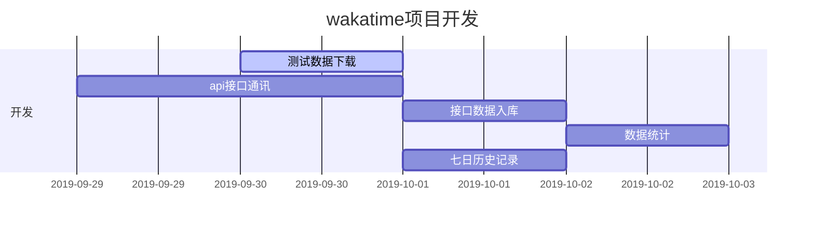

# jenkins-spring-boot 
jenkins 部署运行sprin-boot项目
## 项目缘由
> 近期使用到一个叫做wakatime的插件([官网](https://wakatime.com)),这个插件可以用来记录各个项目上所消费的时间(具体的xxx文件).
> 官方提供了API文档可以进行数据获取,给予这部分数据内容我想可以作为一个项目组(或者企业)对项目管理的一个依据.

## 项目数据
- WakaTime api提供
## 项目设计
- 用户信息
    - 通过`wakatime.user_info_url`接口提供
    - 更新周期24小时
    
- 用时信息
    - 通过`wakatime.duration_url`接口提供
    - 更新周期24小时
    
- 项目信息
  
    - 需要统计的项目在这张表中存储
    
- 数据统计
    - 按照项目,人员统计
        `com.huifer.jenkinsspringboot.entity.result.ProjectWithUser`
        `com.huifer.jenkinsspringboot.service.query.WakaTimeQuery.statisticsProjectByUser`
        ```json
        {
        "项目名称": "xxx",
        "日期":"",
        "数据列表": {
          "人员名称": "xxx", 
          "编码时间": ""
          }
        }
        ```
    - 个人项目时间统计
        `com.huifer.jenkinsspringboot.entity.result.UserProject`
        ```json
        {
          "用户id": "1",
          "日期":"",
          "用户信息": {},
          "数据列表": {
            "项目名称": "xxx",
            "编码时间": ""
          }
        }
        ```
    - 按日期统计
        `com.huifer.jenkinsspringboot.entity.result.DayInfo`
        - https://wakatime.com/api/v1/users/current/summaries?start=2019-09-30&end=2019-09-30
        ```json
        {
          "日期": "2019-09-30",
          "数据列表": {
            "项目名称": "xxx",
            "编码时间": ""
          }
        }
        ```
    - 项目详情
    
- 数据来源通过官方api进行获取,数据获取会采用定时任务周期拉取数据.存储上将当日数据存放到mysql数据库中,
存放完成后进行查询缓存(为什么采用缓存? 数据稳定不会有修改的情况,当日数据在定时任务后不会再有插入).Controller层查询走redis缓存逻辑.
```sequence
数据获取定时任务 ->mysql: 写入数据
mysql -> 消息: 写入完成
消息 -> 查询定时任务: 开始进行数据库统计
查询定时任务 -> redis: 写入缓存
```


```sequence
controller -> service: 具体业务
service -> redis:数据获取
service -> controller : 数据返回
```


## 开发计划
### Version: 0.0.1-SNAPSHOT(开始时间:2019年9月29日)
- wakatime 接口调用实现
- 数据库表建设
- wakatime 落库

## todo
- [*] 先获取wakatime前几天的数据看最多能获取多少,用于sql测试
- 七日历史记录
- 查询




